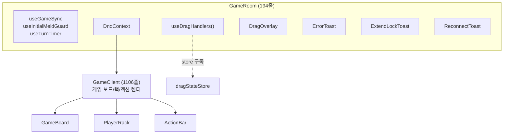
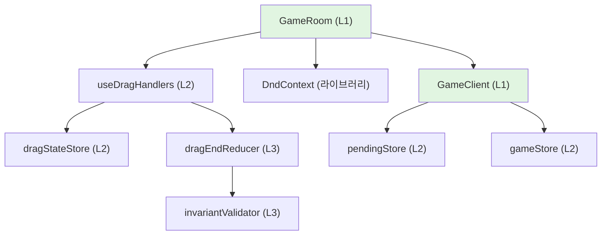

# 66. P3-3 상세 설계 근거 — GameClient 모놀리스 분해, DndContext GameRoom 이전, 단방향 의존성

| 항목 | 값 |
|------|----|
| 작성일 | 2026-04-29 |
| 작성자 | 메인 Claude (Opus 4.7) + frontend-dev-opus 페어 작업 결과 정리 |
| 관련 커밋 | `d088068` `7f098ef` `c3cd2e8` `2b58b1e` `9d773f5` (W2 사전정리), `a49b4fb` `b0270a8` `c6c61e6` `923c21b` (Task #3 본 이전) |
| 관련 룰 ID | UR-DRAG-*, UR-EXTEND-*, V-07, V-CONFIRM-*, BUG-UI-009/010/EXT |
| 관련 문서 | [64](./64-ui-state-architecture-2026-04-28.md) (직전 단계), [65](./65-opus-pair-coding-2026-04-28.md) (페어코딩), [58](./58-ui-component-decomposition.md) (분해 설계) |
| 상태 | **완료** (배포 `day7-923c21b`) |

---

## 1. 핵심 질문

> **"왜 P3-3이 필요했는가? 이미 P2b/P3-2 가 끝났는데 무엇을 더 해결해야 했는가?"**

이 문서는 P3-3 본 작업(DndContext GameRoom 이전, GameClient -126줄 본 분해, useIsMyTurn derived hook 추출, 토스트 GameRoom 이전)이 왜 필요했는지를 **3가지 근본 원인** 관점에서 설명합니다.

1. **모놀리스의 잠재 부채** (P3-2 까지 해결되지 않은 부분)
2. **드래그 어셈블리의 위치 부조화** (DndContext가 GameClient 내부에 있을 때 발생하는 문제)
3. **양방향 의존성의 누적** (계층형 아키텍처 위반 누적)

---

## 2. 배경 — P3-2 까지 해결된 것 / P3-3 이전에 남아있던 것

### 2.1 P3-2 까지 해결된 것 (직전 상태)

[64-ui-state-architecture-2026-04-28.md](./64-ui-state-architecture-2026-04-28.md) 가 정리한 P3-2 마감 상태:

- `pendingStore.draft` 단일 SSOT 확립 (deprecated pending 13 개 필드 제거)
- `useDragHandlers` hook 으로 9 개 dragEnd 분기 캡슐화
- `useTurnActions` 가 pendingStore 기반으로 동작 (OUT_OF_TURN 고착 해소)
- ActionBar fallback 제거

이로써 **상태 SSOT** 는 정리됐습니다.

### 2.2 P3-2 이후 남아있던 것 (P3-3 의 필요성)

| 잔여 부채 | 영향 |
|----------|------|
| GameClient 1232 줄 (P3-2 직후 W2 시작 시점은 2042 줄) | 단일 파일 가독성 한계, 리뷰 부담 |
| `DndContext` + `sensors` + `collisionDetection` + `DragOverlay` 가 GameClient 내부에 응축 | 드래그 어셈블리가 게임 보드/랙/액션바 렌더링과 동일 컴포넌트에 혼재 |
| GameClient 의 5 개 ref (`isHandlingDragEndRef`, `lastDragEndTimestampRef`, `pendingGroupSeqRef`, `extendLockToastShownRef`, `activeDragSourceRef`) | ref 인스턴스가 GameClient 수명에 묶여 hook 외부에 노출 |
| `forceNewGroup`, `activeDragCode`, `showExtendLockToast` React state | 드래그 관련 transient 상태가 컴포넌트 state 로 분산 |
| 토스트 3 종 (`ErrorToast`, `ExtendLockToast`, `ReconnectToast`) GameClient 내부 렌더 | 게임 보드 책임과 토스트 책임 혼재 |
| `isMyTurn` derived value 가 GameClient 와 GameRoom 양쪽에서 각자 계산 | stale 위험, 단일 진실 부재 |
| `GameClient.handleDragEnd` 의 `_DEPRECATED_INLINE_HANDLE_DRAG_END_BEGIN` alias + 인라인 본문 ~810 줄 | P3-2 에서 hook 으로 이전 완료된 죽은 코드가 안전망으로 보존 중 |

이 잔재들은 P3-2 시점에서는 **의도적으로 보존**된 안전망(롤백 가능성)이었습니다. P3-3 은 안전망이 더 이상 필요 없음을 확인한 후 정리하는 단계입니다.

---

## 3. 근본 원인 1 — 모놀리스의 잠재 부채

### 3.1 단일 파일 2042 줄의 실측 문제

| 측정 지표 | 값 |
|----------|----|
| 줄 수 | 2042 |
| import 항목 | ~50 |
| useState/useRef 선언 | 17 |
| useEffect | 8 |
| 인라인 핸들러 (useCallback) | 12 |
| 자식 컴포넌트 렌더 | GameBoard, PlayerRack, ActionBar, MyRack, JokerSwapModal, ExtendLockToast, ErrorToast, ReconnectToast, DragOverlay |

이 규모는 다음 4 가지 문제를 야기했습니다:

#### 3.1.1 리뷰 부담

어제(2026-04-28) 마라톤 마감에서 P0~P3-2 변경이 38 개 파일에 영향을 주었고, 그 중심이 GameClient. PR 단위 리뷰가 비현실적이라 단계별 작은 커밋으로 분해해야 했습니다 ([65 페어코딩 문서](./65-opus-pair-coding-2026-04-28.md) 참조).

#### 3.1.2 회귀 표면적

handleDragEnd 1 줄 변경이 dragStart/dragCancel/dragOver 4 개 핸들러 + 5 개 ref + 9 개 분기 + 12 개 자식 prop 에 동시 영향. 어제 myRack race 핫픽스(P2b Phase C4 부작용)가 24 시간 내 발견된 것도 이 표면적의 결과입니다.

#### 3.1.3 테스트 격리 불가

GameClient 단위 테스트는 DndContext + WebSocket + Router + 9 개 자식 컴포넌트 모두 마운트해야 함. Jest 단위 테스트가 사실상 통합 테스트화. 어제 614 PASS 가 myRack E2E race 를 못 잡은 이유 (qa 교훈: "Jest PASS ≠ UI 동작").

#### 3.1.4 책임 응축

게임 페이지 횡단 관심사(드래그 어셈블리, 토스트 표시) 와 게임 보드 책임(보드/랙/액션 렌더, 핸들러 호출) 이 **하나의 Fragment 자식 트리에 응축**. 분리 가능한 책임이 분리되지 않은 상태.

### 3.2 P3-3 분해의 의도

P3-3 은 GameClient 를 1232 → 1106 줄(-126) 로 줄이는 것이 표면 목표지만, 진짜 의도는 다음 4 가지 책임을 분리하는 것입니다:

| 책임 | P3-3 이후 위치 |
|------|--------------|
| 게임 보드/랙/액션 렌더링 + 도메인 핸들러 호출 | GameClient (남음) |
| 드래그 어셈블리 (DndContext + sensors + collision + DragOverlay) | **GameRoom 으로 이전** (Sub-C) |
| 토스트 3 종 표시 | **GameRoom 으로 이전** (Sub-D) |
| 드래그 transient 상태 (forceNewGroup, activeTile, ref 5개) | **dragStateStore 로 흡수** (W2 Step 1~3b + Sub-A) |
| `isMyTurn` derived value | **`useIsMyTurn` hook** (Sub-B, B2 채택) |

**원칙**: GameClient 는 "게임 도메인을 표현하는 컴포넌트", GameRoom 은 "게임 페이지 레벨 어셈블리(드래그 + 토스트 + WS 라이프사이클)". 책임 경계 명확화.

---

## 4. 근본 원인 2 — 드래그 어셈블리의 위치 부조화

### 4.1 DndContext 가 GameClient 안에 있을 때의 문제

#### 4.1.1 횡단 관심사의 종속화

dnd-kit 의 `<DndContext>` 는 자식 컴포넌트에 드래그 컨텍스트를 제공하는 **횡단 관심사**입니다 (Provider 패턴). 게임 페이지 어디에서든 `useDraggable`/`useDroppable` 호출이 가능해야 하는 인프라.

이것이 GameClient 내부에 있으면:
- GameClient 가 마운트되어야만 드래그가 활성화
- GameRoom 의 다른 자식(미래의 사이드바, 통계 패널 등) 은 드래그 컨텍스트 접근 불가
- GameClient 단위 테스트 시 드래그 어셈블리가 강제 포함

#### 4.1.2 ref 인스턴스의 누출

DndContext 의 onDragStart/End/Cancel 콜백이 GameClient state 와 ref 를 클로저로 잡음. P3-2 에서 useDragHandlers hook 으로 핸들러 본체를 옮겼지만, **5 개 ref 는 여전히 GameClient 에 선언**:

```tsx
// P3-2 직후 GameClient (잔재)
const isHandlingDragEndRef = useRef(false);
const lastDragEndTimestampRef = useRef(0);
const pendingGroupSeqRef = useRef(0);
const extendLockToastShownRef = useRef(false);
const activeDragSourceRef = useRef<...>(null);

const dragHandlers = useDragHandlers({
  isHandlingDragEndRef,        // ref 주입
  lastDragEndTimestampRef,
  // ... 5개 ref 모두 주입
});
```

이 구조는 **GameClient 의 ref 가 hook 의 옵션이 되는 양방향 의존**. GameRoom 으로 DndContext 를 옮기려면 5 개 ref 도 GameRoom 으로 옮겨야 하지만, GameClient 의 `handleUndo`/`handleRackSort` 도 ref 를 직접 참조 → GameRoom→GameClient props 신설 필요 → P3-3 의도와 정반대.

#### 4.1.3 토스트 위치 부조화

ExtendLockToast 는 드래그 lock(BUG-UI-EXT 가드) 시 표시되는 사용자 안내. 드래그 어셈블리와 동일 레벨에 위치해야 자연스러운데, GameClient Fragment 자식으로 들어가 있어 DndContext 와 동거. 관심사가 흐려진 상태.

### 4.2 GameRoom 으로 이전한 이유

#### 4.2.1 게임 페이지의 자연스러운 어셈블리 위치

GameRoom 은 이미 다음을 마운트:
- `useGameSync` (WebSocket 라이프사이클)
- `useInitialMeldGuard` (초기 등록 검증)
- `useTurnTimer` (턴 타이머)

**게임 페이지 레벨의 인프라 hook** 들이 GameRoom 에 모여 있는 이유는, 이들이 game 페이지가 마운트되는 동안 항상 활성화되어야 하기 때문. **DndContext + sensors + DragOverlay 도 동일 성격** (게임 페이지 레벨 인프라).

#### 4.2.2 ref 인스턴스 격리 해소

Sub-A 에서 5 개 ref 중 3 개를 hook 내부 fallback ref 로 단순 제거. 나머지 2 개(`pendingGroupSeq`, `extendLockToastShown`) 는 W2 Step 3b 에서 store-backed ref-like 로 흡수. **결과: GameClient 가 ref 를 hook 에 주입하는 양방향 의존성 0**.

이 정리 후에야 GameRoom 이 `useDragHandlers()` 를 옵션 없이 호출하고, DndContext 의 onDragStart/End/Cancel 에 hook 결과를 그대로 연결할 수 있습니다.

#### 4.2.3 토스트 관심사 분리 (Sub-D)

토스트 3 종 모두 store 구독 (props 의존성 0). GameRoom 으로 이전 시 GameClient 와 무관해짐. z-index/포지션은 토스트 내부 `position: fixed` 라 부모 변경 무관.



---

## 5. 근본 원인 3 — 양방향 의존성의 누적

### 5.1 계층형 아키텍처 (CLAUDE.md L1~L4)

| 계층 | 책임 | 예시 |
|------|------|------|
| **L1 UI** | 컴포넌트 렌더링, 이벤트 위임 | GameClient, GameRoom, GameBoard |
| **L2 상태** | 클라이언트 상태 store / hook | gameStore, pendingStore, dragStateStore, useDragHandlers, useIsMyTurn |
| **L3 도메인** | 순수 함수, 게임 로직 | dragEndReducer, turnUtils, invariantValidator, dndCollision |
| **L4 통신** | WebSocket, REST | useWebSocket, ws/wsClient |

**원칙**: L1 → L2 → L3 → L4 (위에서 아래로 의존). 역방향 또는 동일 계층 내 양방향 의존 금지.

### 5.2 P3-3 직전의 위반 사례

#### 위반 1: GameClient(L1) 의 ref → useDragHandlers(L2) 옵션 주입

```tsx
// 위반: L1 컴포넌트의 ref 인스턴스가 L2 hook 의 옵션이 됨
const isHandlingDragEndRef = useRef(false);  // L1 에서 생성
const dragHandlers = useDragHandlers({
  isHandlingDragEndRef,  // L2 가 L1 의 ref 를 받음 = 양방향
});
```

L2 hook 이 L1 컴포넌트의 ref 인스턴스에 의존 = **L1 → L2 단방향 위반**. hook 이 어디서 호출되는지에 따라 동작이 달라짐(같은 GameClient 안에서만 동작 보장).

#### 위반 2: `isMyTurn` 양쪽 계산

```tsx
// GameClient 내부
const isMyTurn = useGameStore((s) => s.mySeat === s.currentSeat);

// GameRoom 도 별도 계산 (예시)
const isMyTurn = computeIsMyTurn(useGameStore());
```

동일 로직이 두 곳에서 각자 계산. React batch 시점에 따라 stale 위험. **L2 derived value 의 단일 진실 부재**.

### 5.3 P3-3 의 단방향 의존성 확립

#### 수정 1: ref → store 흡수 또는 hook 내부 fallback

**Sub-A (3 개 ref)**: 외부 reader 부재 + transient 특성 → hook 내부 `fallbackXRef = useRef(...)` 단순 제거. hook 인스턴스 수명 동안 동일 identity 유지하므로 안전.

**W2 Step 3b (2 개 ref)**: store-backed ref-like 패턴 — `MutableRefObject<T>` = `{ current: T }` 인터페이스이므로 `useMemo<{ get/set current }>` 로 store getter/setter 모방. ref 인스턴스 격리 유지하면서 store 단일화.

```ts
// store-backed ref-like (W2 Step 3b 패턴)
const pendingGroupSeqRef = useMemo(() => ({
  get current() { return useDragStateStore.getState().pendingGroupSeq; },
  set current(v) { useDragStateStore.getState().setPendingGroupSeq(v); },
}), []);
```

L1 컴포넌트에서 ref 를 만들지 않고 L2 store 가 단일 소스. **L2 → L2 자기 참조**(허용).

#### 수정 2: `useIsMyTurn` derived hook (Sub-B, B2 채택)

```tsx
// hooks/useIsMyTurn.ts (신규 66줄)
export function useIsMyTurn(): boolean {
  return useGameStore((s) => computeIsMyTurn(s));  // L3 turnUtils 호출
}
```

GameClient/GameRoom 둘 다 `useIsMyTurn()` 호출 → 동일 store snapshot 구독 → React batch 단위 동기화. **단일 진실 확립**.

##### 왜 B1(props) 이 아니고 B2(derived hook) 였는가

| 옵션 | 설명 | 채택 여부 |
|------|------|----------|
| B1 | GameRoom 에서 단일 계산 후 props 로 전달 | 거부 |
| **B2** | **derived selector hook 추출** | **채택** |
| B3 | 양쪽 각자 계산 (현 상태 유지) | 거부 (stale 위험) |

B1 거부 사유: useDragHandlers 도 GameRoom 에서 직접 호출되므로 props 구조가 부적합. props 가 늘어나면 prop drilling 부채 발생.

B2 채택 사유: hook 으로 추출하면 어떤 컴포넌트도 원하는 곳에서 호출 가능. store 구독 단일화. L2 → L2 패턴(허용).

#### 수정 3: DndContext 이전으로 어셈블리 단방향화



GameRoom(L1) → useDragHandlers(L2) 단방향. GameClient 는 store 구독만 하고 hook 옵션을 주입하지 않음. **양방향 의존성 0**.

---

## 6. 단계별 매핑 (왜 이 순서로 진행했는가)

P3-3 은 5 개 sub-step 으로 분해됐고, 순서가 위험도 평가에 의해 결정됐습니다.

| Sub-Step | 변경 | 위험도 | 사유 |
|---------|------|--------|------|
| W2 Step 1 | `forceNewGroup` → store | 낮음 | 단일 boolean state. 외부 reader 1 곳 |
| W2 Step 2 | `activeDragCode` → `activeTile` | 낮음 | 기존 store 필드와 통합, 이름만 변경 |
| W2 Step 3a | `showExtendLockToast` → store | 낮음 | 토스트 단일 boolean |
| W2 Step 3b | `pendingGroupSeq`, `extendLockToastShown` → store-backed ref-like | 중간 | ref 인스턴스 격리 유지 패턴 신규 |
| W2 Step 4 | 죽은 코드 -810 줄 | 낮음 | P3-2 에서 hook 이전 완료된 본문, 런타임 영향 0 |
| Task #3 Sub-A | 3 ref → hook 내부 fallback | 낮음 | 외부 reader 0 확인 후 단순 제거 |
| Task #3 Sub-B | `useIsMyTurn` 추출 | 낮음 | derived hook, 호출처 단순 교체 |
| **Task #3 Sub-C** | **DndContext + sensors + DragOverlay GameRoom 이전** | **최고** | **본 작업. Sub-A/B 완료 후에만 안전** |
| Task #3 Sub-D | 토스트 3 종 GameRoom 이전 | 낮음 | props 의존성 0 확인 후 |
| Task #3 Sub-E | 통합 검증 + 배포 | 중간 | E2E 회귀 검증 |

**핵심**: Sub-C(본 작업) 가 안전하려면 Sub-A/B(ref 정리, derived hook) 가 먼저 완료되어야 함. 사용자 절대 원칙 "위험도 평가 후 분해 진행" 그대로 적용.

---

## 7. 검증 결과 (P3-3 완료 시점)

| 지표 | P3-2 직후 | P3-3 직후 | 변화 |
|------|----------|----------|------|
| GameClient 줄 수 | 2042 | **1106** | **-936** (-45.8%) |
| GameRoom 줄 수 | 138 | 194 | +56 |
| useDragHandlers 줄 수 | 1083 | 1117 | +34 (store-backed ref-like) |
| dragStateStore 줄 수 | 64 | 121 | +57 |
| 신규 파일 | - | useIsMyTurn.ts (66) + dndCollision.ts (32) | +98 |
| GameClient 의 useState/useRef | 17 | ~7 | -10 |
| GameClient 의 ref 주입 | 5 | **0** | **-5** |
| Jest | 614 PASS | **634 PASS** | +20 (회귀 0) |
| TypeScript errors | 12 (베이스라인) | **0** | -12 (Task #5 별도 정리) |
| E2E rule spec | 9 PASS / 3 FAIL / 3 SKIP | **14 PASS / 0 FAIL / 4 SKIP** | +5 PASS |
| 배포 이미지 | day7-1f53481 | day7-923c21b | OK |

---

## 8. 잔여 작업 / 차후 권장

### 8.1 직접 후속

P3-3 본 작업은 완료. 직접 후속 없음.

### 8.2 간접 후속

| 항목 | 우선순위 | 비고 |
|------|--------|------|
| GameClient 내부 주석에 "P3-3 Sub-C/D" 흔적 정리 | P3 | history 추적 가치로 유지도 OK |
| 향후 다른 페이지(연습 모드 등) 에서 DndContext 재사용 검토 | P3 | GameRoom 패턴을 추출 가능 여부 |
| `useIsMyTurn` 외 derived hook 추가 추출 (`useIsHost`, `useIsAITurn` 등) | P3 | 동일 패턴, 필요 시 |

---

## 9. 핵심 교훈

### 9.1 모놀리스 분해는 "여러 단계 안전망"

P3-3 의 본 작업은 Sub-C 한 줄("DndContext 를 GameRoom 으로 옮겨라") 이지만, 안전하게 진행하려면 Sub-A/B + W2 Step 1~3b + Step 4 의 사전 정리가 필요. **위험도가 높은 변경일수록 사전 정리에 더 많은 시간을 쓴다**. 사용자 절대 원칙 그대로.

### 9.2 양방향 의존성은 분해의 적

GameClient 의 ref 를 useDragHandlers 옵션으로 주입하던 패턴이 "DndContext 를 옮길 수 없는" 근본 장애. ref 인스턴스 격리를 유지하면서 store 단일화하는 **store-backed ref-like 패턴**이 분해의 열쇠.

### 9.3 단계별 Jest 게이트의 가치

각 sub-step 별 Jest 634 PASS 게이트가 회귀를 즉시 발견. P3-3 전체에서 회귀 0 건 유지. **"Jest PASS ≠ UI 동작" 이지만, Jest FAIL = 즉시 알아차림** 의 가치.

### 9.4 페어코딩의 효과

frontend-dev-opus(Opus 4.7) 단독 dispatch 로 4~6 시간 작업을 안정 진행. 위험도 평가 + 단계 분해 + 자체 보고서 작성 모두 자율 수행. Sonnet(구현) + Opus(설계/리뷰/복잡 리팩토링) 분업 패턴 정착 ([65 페어코딩 문서](./65-opus-pair-coding-2026-04-28.md) 참조).

---

## 10. 참고

- [64. UI State 아키텍처 (2026-04-28)](./64-ui-state-architecture-2026-04-28.md) — 직전 단계 (P2b/P3-2)
- [65. Opus 페어코딩 (2026-04-28)](./65-opus-pair-coding-2026-04-28.md) — 페어코딩 구조
- [58. UI 컴포넌트 분해](./58-ui-component-decomposition.md) — 분해 설계 원본
- `work_logs/reviews/2026-04-29-w2-p3-3-report.md` — W2 사전정리 작업 보고서
- `work_logs/plans/2026-04-29-p3-3-and-ghost-sc2-plan.md` — 작업 계획서
- `CLAUDE.md` — 계층형 아키텍처 + 사용자 절대 원칙

---

**작성**: 2026-04-29 메인 Claude (Opus 4.7)
**원 작업**: frontend-dev-opus(Opus 4.7) Task #3 + W2 dispatch
**검증**: Jest 634 PASS / TS 0 errors / E2E 14 PASS / 배포 day7-923c21b
