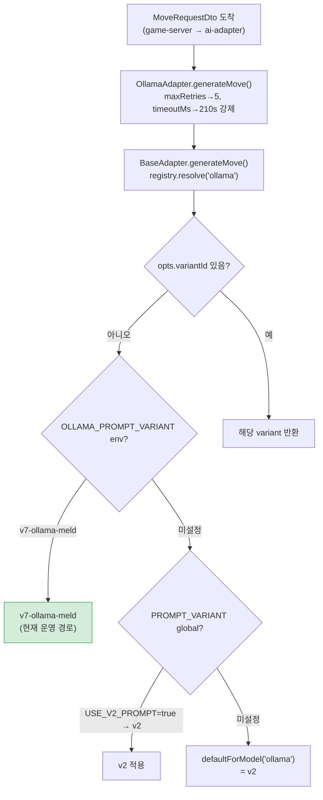
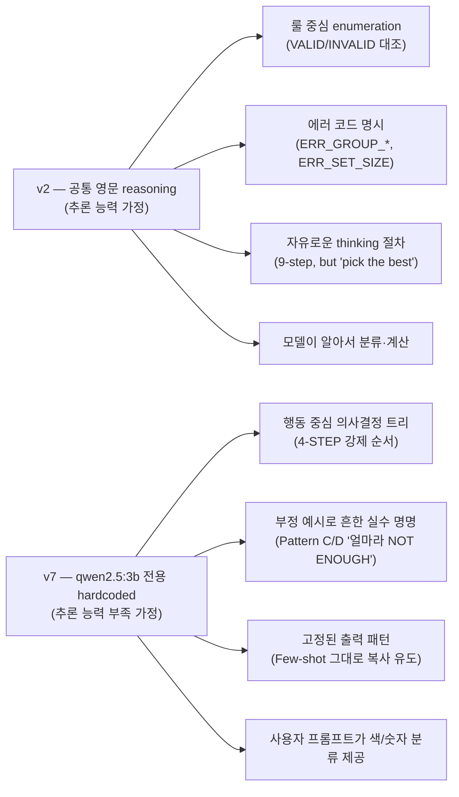

# 68. LLaMA(Ollama) 프롬프트 현황 분석 — game-analyst 검토

- 작성일: 2026-04-30
- 작성자: game-analyst
- 상태: 분석 보고서 (코드 수정 없음)
- 분석 범위: ai-adapter 의 Ollama 어댑터가 사용하는 프롬프트 변형 + 게임룰 커버리지
- 연관 SSOT 문서:
  - `docs/02-design/42-prompt-variant-standard.md` (variant 운영 SSOT)
  - `docs/02-design/39-prompt-registry-architecture.md` (resolve 우선순위)
  - `docs/02-design/55-game-rules-enumeration.md` (V-01 ~ V-21 룰 SSOT)

---

## 1. 현황 요약 (TL;DR)

LLaMA(Ollama) 모델은 **다른 모델과 다른 전용 프롬프트(`v7-ollama-meld`)를 사용한다**. 다른 4개 모델(OpenAI, Claude, DeepSeek, DeepSeek-Reasoner, DashScope)은 공통 영문 프롬프트(v2 / v3 / v4 / v4.1 / v5) 군을 공유하지만, qwen2.5:3b 는 3B 파라미터 소형 모델이라는 특성 때문에 별도 하드코딩 프롬프트가 필요했다.

| 항목 | 값 |
|---|---|
| 활성 variant | **`v7-ollama-meld`** (Sprint 7 hotfix, 2026-04-22 도입) |
| 활성화 방식 | helm `OLLAMA_PROMPT_VARIANT=v7-ollama-meld` per-model override (live 적용 중) |
| 결정 출처 | resolve() 단계 2 — env-per-model |
| 모델 | qwen2.5:3b (Ollama 로컬 호스팅, ClusterIP `ollama:11434`) |
| 토큰 예산 | 1,700 tokens (v2 영문 ~1,200 대비 +40%, hand-holding few-shot 포함) |
| 권장 temperature | **0.0** (소형 모델 결정성 강제) |
| 추천 모델 | `['ollama']` 단일 — 다른 모델에 적용 시 warn 로그 (안전장치) |
| 도입 트리거 | qwen2.5:3b place rate 0% (23턴 / 22턴 강제 드로우) |
| 목표 KPI | 초기 등록 성공률 0% → ≥ 20% (모델 교체 없이 프롬프트만으로) |
| Sprint 8 계획 | qwen2.5:7b 모델 교체 후 v7 폐기 검토 |

**핵심 결론**: v7 프롬프트는 qwen2.5:3b 의 인지 한계를 정면으로 겨눈 **절차적 의사결정 트리** 다. v2 가 "추론 능력이 있는 모델용 가이드라인"이라면 v7 은 "추론 능력이 부족한 모델을 위한 단계별 매뉴얼"이다. 게임룰 커버리지는 V-01/V-02/V-04 핵심 룰을 강하게 강조하지만 **V-13b/c/d/e (재배치 4유형), V-07 (조커 회수 즉시 사용), V-14/V-15 (그룹 동색·런 비순환) 의 명시 강도가 약하다**. P1 권고는 §6 참조.

---

## 2. 프롬프트 파일 위치 및 분기 조건

### 2.1 파일 트리

```
src/ai-adapter/src/
├── adapter/
│   └── ollama.adapter.ts                                # Ollama HTTP 클라이언트 어댑터 (variant 미인식, BaseAdapter 위임)
└── prompt/
    ├── v7-ollama-meld-prompt.ts                         # 본문 — system + user + retry 빌더
    └── registry/
        └── variants/
            └── v7-ollama-meld.variant.ts                # PromptVariant 메타데이터 + builder export
```

### 2.2 variant resolve 흐름 (Ollama 기준)



**현재 K8s ConfigMap (helm/charts/ai-adapter/values.yaml:43)**:
```yaml
OLLAMA_PROMPT_VARIANT: "v7-ollama-meld"
```

이 한 줄이 단계 2 에서 잡혀 v7 이 활성화된다.

### 2.3 어댑터 동작 특이점 (`ollama.adapter.ts`)

| 동작 | 값 | 이유 |
|---|---|---|
| `MIN_RETRIES` | **5** | 소형 모델 JSON 오류율 대응 (v2 어댑터들의 default 3 보다 +2) |
| `MIN_TIMEOUT_MS` | **210,000** (210s) | CPU 추론 + Qwen3 thinking 모드 대응 |
| `format: 'json'` | 강제 | Ollama 자체 JSON 모드 활용 (스키마 검증은 추가 안 됨) |
| `temperature` cap | `min(input, 0.7)` | 소형 모델 분산 폭주 방지 |
| `num_predict` | 4096 | 응답 truncation 방지 |
| thinking 모드 처리 | content 비고 thinking 에 JSON 들어오면 `\{[\s\S]*\}` 정규식으로 추출 | Qwen3 호환성 |
| 기본 모델명 | `gemma3:4b` (ConfigService default) → 실제 K8s `qwen2.5:3b` | 코드 default 와 운영 모델 불일치 (현황) |

> **관찰**: 코드의 `OLLAMA_DEFAULT_MODEL` default 값은 `gemma3:4b` 이지만 K8s ConfigMap 은 `qwen2.5:3b` 다. v7 프롬프트는 docstring 상 명백히 qwen2.5:3b 만 가정하고 작성됐다. gemma3:4b 로 전환 시 v7 의 few-shot 패턴 유효성은 재검증 필요.

---

## 3. 공통 프롬프트(v2) vs LLaMA 프롬프트(v7) 비교

### 3.1 구조 차이 (행 단위 비교)

| 섹션 | v2 (공통) | v7 (Ollama 전용) | 차이 핵심 |
|---|---|---|---|
| **타일 인코딩** | 표 형식 + 4×13×2+2=106 총합 명시 | 한 줄 정의 + 1개 예시 | v2 가 더 풍부. v7 은 토큰 절약 |
| **GROUP 룰** | VALID 2개 + INVALID 3개 (에러코드 명시: ERR_GROUP_COLOR_DUP, ERR_GROUP_NUMBER, ERR_SET_SIZE) | 절차 1단계로 통합, 부정 예시 분리 섹션(Pattern C/D) | v2 가 룰 중심, v7 이 행동 중심 |
| **RUN 룰** | VALID 3개 + INVALID 4개 (wraparound 명시) | 절차 2단계로 통합, "no gaps and no wrap-around" 한 줄 | v7 의 wraparound 강조 약함 |
| **3장 최소** | "Size Rule: EVERY group and run must have >= 3 tiles. 2 tiles = ALWAYS INVALID." 독립 섹션 | "No 2-tile sets. Every set must have 3 or more tiles." 시스템 프롬프트 상단 + checklist 1번 | v7 도 강조 충분 |
| **초기 등록 30점** | 한 섹션 (예시 3개) | 시스템 프롬프트 상단 "ONE RULE YOU MUST ALWAYS OBEY" + 4-step 절차 + Pattern A/B/C/D 6개 + Few-shot 6개 모두에서 반복 | **v7 이 압도적으로 강조** |
| **재배치 (V-13)** | "extend or rearrange existing board sets" 한 줄 | Few-shot Example 6 (extend only) | **v7 의 분할/합병/이동 미커버** |
| **조커 (V-07)** | 타일 인코딩에서 "Wild cards (2 total)" 만 언급, 회수 후 즉시 사용 룰 미언급 | 동일 (빌더 함수에서 JK1/JK2 skip 처리만) | **v2/v7 둘 다 미흡** |
| **타일 보존 (V-06)** | "tableGroups = COMPLETE final state... You MUST include ALL existing table groups" | Step 4 + Few-shot Example 6 + Checklist 6 | 비슷한 강도 |
| **자기 검증 체크리스트** | 7개 항목 | 6개 항목 | v7 이 ERR 코드 미언급 |
| **사고 절차** | 9-step "Step-by-Step Thinking Procedure" | 4-STEP DECISION PROCEDURE | v7 이 더 짧고 의사결정 트리에 가까움 |
| **재시도 프롬프트** | 5개 mistake 리스트 + draw fallback | 4개 mistake 리스트 + draw fallback (한 줄 더 짧음) | 동등 |
| **유저 프롬프트 힌트** | 색상별 분류 없음 | **색상별 분류(R/B/Y/K) + Group candidates(3+ same number) 자동 추출** | **v7 이 hand-holding 우월** |
| **Few-shot 개수** | 5개 | 6개 (+ Pattern A/B/C/D 4개) | v7 이 +5개 |
| **언어** | 영문 | 영문 | 동일 |
| **토큰 예산** | ~1,200 | ~1,700 (+40%) | v7 의 hand-holding 비용 |

### 3.2 설계 철학 비교



**핵심 차이**: v2 는 모델에게 "분석하라"고 시키고, v7 은 모델에게 "**이 정확한 순서로 따라하라**"고 시킨다. 3B 모델은 자유 reasoning 시 무효 set 또는 합계 30 미만의 집합을 자주 출력하므로, 행동을 고정 템플릿으로 묶는 전략이 선택됐다.

---

## 4. 게임룰 커버리지 평가 (V-01 ~ V-21 기준)

### 4.1 V-NN 룰별 커버리지 매트릭스

| 룰 ID | 룰 명 | v7 명시 위치 | 커버리지 | 비고 |
|---|---|---|---|---|
| V-01 | 세트 유효성 (그룹/런) | 시스템 4-STEP + Pattern A/B + Checklist 2/3 | **STRONG** | 가장 많이 강조됨 |
| V-02 | 세트 크기 ≥ 3 | "No 2-tile sets" (상단) + Checklist 1 + Retry mistakes | **STRONG** | 명시적 반복 |
| V-03 | 랙에서 최소 1장 추가 | 미명시 (단, action='place' 시 tilesFromRack 비어있을 수 없음을 Few-shot 으로 암시) | **WEAK** | 명문 룰 부재. 모델이 "place + tilesFromRack=[]" 출력 가능성 있음 |
| V-04 | 최초 등록 30점 | 시스템 "ONE RULE" 최상단 + 4-STEP 의 모든 분기 + Pattern A/B + Few-shot 1~5 + Checklist 5 + 유저 프롬프트 "FIRST CHECK" | **STRONG (압도적)** | v7 의 핵심 KPI 대상 |
| V-05 | 최초 등록 시 랙 타일만 | "30 or more points using ONLY tiles from your rack" + Checklist 4 + Pattern A 모든 예시 | **STRONG** | 명시적 |
| V-06 | 타일 보존 (Conservation) | "include ALL existing table groups in your output" + Few-shot 6 + Checklist 6 + 유저 프롬프트 마지막 줄 | **MEDIUM** | initial meld DONE 분기에서만 강조. 일반 턴에서도 적용됨을 명시 부족 |
| V-07 | 조커 회수 후 즉시 사용 | **미명시** | **NONE** | 빌더 함수에서 JK1/JK2 를 byColor/byNumber 분류에서 제외할 뿐. 조커 swap 시나리오 자체가 Few-shot 에 없음 |
| V-08 | 자기 턴 확인 | 시스템 미명시 (서버측 룰) | **N/A** | 서버 검증 영역 |
| V-09 | 턴 타임아웃 | 미명시 | **N/A** | timeout=210s 어댑터 설정으로 대응 |
| V-10 | 드로우 파일 소진 | 유저 프롬프트 `drawPileCount` 전달, 단 v7 빌더는 turnNumber/drawPileCount 를 받지만 **본문에 출력하지 않음** | **WEAK** | v2 는 "Draw pile: N tiles remaining" 출력. v7 은 누락 |
| V-11 | 교착 상태 | 미명시 | **N/A** | 서버 검증 |
| V-12 | 승리 (랙 0장) | 미명시 | **N/A** | 결과 영역 |
| V-13a | 재배치 권한 (hasInitialMeld) | "Initial Meld: DONE/NOT DONE" 분기 + Few-shot 6 (DONE 분기) | **STRONG** | 분기 자체는 명확 |
| V-13b | 재배치 — 분할 (Split) | **미명시** | **NONE** | "extend" 만 다룸 |
| V-13c | 재배치 — 합병 (Merge) | **미명시** | **NONE** | 그룹 4색 합병 시나리오 부재 |
| V-13d | 재배치 — 이동 (Move) | **미명시** | **NONE** | 타일 이동 Few-shot 부재 |
| V-13e | 재배치 — 조커 교체 | **미명시** | **NONE** | 조커 swap 자체가 v7 인지 외 |
| V-14 | 그룹 동색 중복 불가 | 4-STEP 1단계 "DIFFERENT colors" + Pattern A "R,B,K (three different colors)" + Checklist 2 + Retry "Groups with duplicate colors" | **MEDIUM** | "different" 표현 약함 (v2 는 "no duplicate colors" 명시) |
| V-15 | 런 숫자 연속 (1↔13 비순환) | 4-STEP 2단계 "no gaps and no wrap-around" + Checklist 3 "no 13->1 wrap" | **MEDIUM** | 명시는 됐으나 Few-shot 부정 예시 부재 (v2 는 "[R12a, R13a, R1a] -> REJECTED" 명시) |
| V-16 | 그룹 색상 enumeration 정합성 | 미명시 (서버 분류 영역) | **N/A** | 클라/서버 영역 |
| V-17 | 그룹 ID 서버측 발급 | 미명시 | **N/A** | 서버 영역 |
| V-18 | 턴 스냅샷 무결성 | 미명시 | **N/A** | 서버 영역 |
| V-19 | 메시지 시퀀스 단조성 | 미명시 | **N/A** | 서버 영역 |
| V-20 | 패널티 정책 | 미명시 (모델은 패널티 인지 불필요) | **N/A** | 서버 영역. AI=1장 패널티는 서버 적용 |
| V-21 | 방 정원 충족 후 게임 시작 | 미명시 | **N/A** | 시스템 영역 |

### 4.2 커버리지 요약

| 카테고리 | STRONG | MEDIUM | WEAK | NONE | N/A |
|---|---|---|---|---|---|
| **v7 적용 룰 (V-01 ~ V-15, V-13a~e)** | V-01, V-02, V-04, V-05, V-13a | V-06, V-14, V-15 | V-03, V-10 | V-07, V-13b, V-13c, V-13d, V-13e | V-08, V-09, V-11, V-12 |
| 갯수 (12개 LLM-applicable) | 5 | 3 | 2 | 5 | (서버 영역 제외) |

**커버리지 핵심**: v7 은 **초기 등록(V-04/V-05)과 세트 기본 룰(V-01/V-02)을 압도적으로 강조**하지만, **재배치 4유형(V-13b/c/d/e)과 조커 회수 룰(V-07)을 전혀 다루지 않는다**. 이는 의도적 결정으로 보인다 — 3B 모델의 인지 부담을 핵심 룰에만 집중시키고 복잡한 재배치는 포기. 다만 다음 부작용 가능:

1. **Initial Meld DONE 후 turn rate 정체**: V-13a 권한이 열려도 분할/합병/이동 패턴 미학습 → 단순 extend 만 시도 → 새 set 도 못 만들고 extend 도 못하면 draw 빈발
2. **조커 활용률 0**: 조커 swap 시나리오 부재 → 조커가 랙에 들어와도 단순 GROUP/RUN 보충용으로만 사용

### 4.3 Few-shot 의 함정 (Pattern E 이슈)

> **새로운 관찰** (본 분석에서 발견):

v7 Few-shot Example 1 의 출력 JSON:
```json
{"action":"place","tableGroups":[{"tiles":["R10a","B10a","K10a"]}],"tilesFromRack":["R10a","B10a","K10a"],...}
```

문제: `tableGroups` 가 **현재 테이블 상태(empty) + 새 그룹** 의 합집합이 아니라 **새 그룹만** 표시된다. Empty 테이블이라서 우연히 일치하지만, 모델이 **"tableGroups = 내가 새로 추가하는 set 만"** 이라는 잘못된 패턴으로 학습할 위험. v2 는 동일 시나리오에서도 같은 출력을 하지만 V-06 룰을 별도로 강조하므로 충돌이 적다. v7 은 V-06 명시가 Few-shot 6 에서야 나오므로 **앞 5개 예시가 V-06 위반 패턴을 학습시킬 가능성**.

---

## 5. qwen2.5:3b 모델 적합성 평가

### 5.1 모델 특성

| 항목 | qwen2.5:3b | 비교: 다른 모델 |
|---|---|---|
| 파라미터 수 | 3B | gpt-5-mini ~수십B / claude-sonnet-4 수백B / deepseek V4-Pro 671B MoE |
| 컨텍스트 길이 | 128k (선언상) — 실용 ~32k | 200k+ |
| Reasoning | 없음 (qwen2.5 thinking 변형은 별도) | gpt-5-mini CoT / claude extended thinking / deepseek R1 thinking |
| 추론 환경 | CPU (Ollama 로컬) | 클라우드 GPU |
| 평균 응답 시간 | 30~120s | 5~30s |
| JSON 안정성 | 낮음 (재시도 5회 강제) | 높음 (재시도 3회) |
| 한국어 능력 | 양호 | 양호 |
| 영문 instruction following | **약함** — long instruction 시 mid-context 망각 | 강함 |

### 5.2 v7 프롬프트의 적합도 평가

| 측면 | v7 설계 결정 | qwen2.5:3b 적합도 | 평가 |
|---|---|---|---|
| 토큰 예산 1,700 | hand-holding few-shot 6개 | 32k 컨텍스트 대비 5% — 여유 충분 | **PASS** |
| 절차적 4-STEP | 의사결정 트리 강제 | 소형 모델 instruction following 안정화 | **PASS** |
| Pattern A/B/C/D 정/부 예시 | 흔한 실수 직접 명명 | 토큰 매칭으로 행동 유도 | **PASS** |
| 색상별/숫자별 사전 분류 | 유저 프롬프트가 분류 제공 | 모델의 분류 부담 제거 | **PASS** |
| Few-shot 6 (DONE 분기) | extend 만 다룸 | 3B 모델 인지 한계 | **PASS** (의도적 단순화) |
| 영문 작성 | 다른 모델 통일성 | qwen2.5:3b 영문 가능 | **PASS** |
| temperature 0.0 권장 | 결정성 강제 | 소형 모델 분산 폭주 방지 | **PASS** |
| `format: 'json'` 강제 | Ollama API 활용 | JSON 오류율 감소 | **PASS** |
| **재시도 5회** | 어댑터 강제 | JSON 오류율 보완 | **PASS** |
| **timeout 210s** | 어댑터 강제 | CPU 추론 + 4096 num_predict 대응 | **PASS** |
| Pattern E 함정 (§4.3) | tableGroups 첫 5 예시 V-06 미강조 | 모델이 잘못된 패턴 학습 가능 | **CONCERN** |
| V-13b/c/d/e 미커버 | 의도적 단순화 | initial meld 후 정체 가능성 | **CONCERN** |
| V-07 조커 룰 미언급 | 빌더에서 JK 분류 제외만 | 조커 활용 0% 예상 | **CONCERN** |
| drawPileCount 미출력 | v2 와 다름 | 종반 draw 결정 정보 부족 | **MINOR** |

### 5.3 KPI 검증 (실측 데이터 미수집)

> **확인 필요 사항**: v7 도입(2026-04-22) 이후 qwen2.5:3b place rate 가 0% → ≥ 20% 목표를 달성했는지 실측 데이터 없음. `docs/04-testing/` 또는 self-play harness 결과를 별도 추적 필요.

`MEMORY.md` 를 보면 Round 5 까지 DeepSeek/GPT/Claude 만 언급되고 Ollama 의 Round 결과는 누락. 즉 **v7 hotfix 의 효과 측정이 운영 단계에서 누락됐을 가능성**이 있다.

---

## 6. 개선 권고

### P0 (즉시 — Sprint 7 마감 전)

| ID | 권고 | 근거 | 영향 |
|---|---|---|---|
| **P0-1** | **v7 효과 측정 self-play harness 실행** — qwen2.5:3b 단독 또는 qwen vs ai 매치업 N=3 이상으로 place rate 측정. 2026-04-22 이후 실측 데이터 부재 | §5.3 KPI 미검증 | Sprint 8 모델 교체 의사결정 근거 |
| **P0-2** | **`docs/04-testing/` 에 v7 검증 결과 기록** — 측정 후 P0-1 결과를 v7-ollama-meld-empirical.md 로 기록. v7 이 0% → 20% 달성하지 못했다면 §6 P1/P2 권고 우선순위 상승 | 운영 KPI 추적 누락 | SSOT 정합 |

### P1 (Sprint 7 W3 또는 Sprint 8 초)

| ID | 권고 | 근거 | 영향 |
|---|---|---|---|
| **P1-1** | **Pattern E 수정** — Few-shot Example 1 의 reasoning 또는 출력 옆에 "(table empty 라서 새 그룹만 출력. table 에 기존 그룹이 있으면 모두 포함해야 함 — Example 6 참조)" 한 줄 추가 | §4.3 V-06 패턴 함정 | 재배치 시 V-06 위반 감소 |
| **P1-2** | **drawPileCount 유저 프롬프트 출력 복원** — v2 와 동일하게 "Draw pile: N tiles remaining" 한 줄 추가. 종반 의사결정 정보 제공 | §5.2 MINOR concern | 종반 draw vs place 결정 정확도 |
| **P1-3** | **V-15 부정 예시 추가** — Pattern D 또는 Few-shot Example 5 옆에 "[R12a, R13a, R1a] -> REJECTED: wraparound" 한 줄 부정 예시 추가 | §4.1 V-15 MEDIUM | wraparound 시도 차단 |
| **P1-4** | **V-13a DONE 분기 Few-shot 추가** — 현재 Example 6 (extend) 만 있으므로 Example 7 (split: 기존 그룹에서 타일 떼서 새 그룹 형성) 또는 Example 8 (merge: 기존 3색 그룹 + 4번째 색 추가) 추가 | §4.1 V-13b/c NONE | 재배치 활용률 ↑ |

### P2 (Sprint 8 — 모델 교체와 함께)

| ID | 권고 | 근거 | 영향 |
|---|---|---|---|
| **P2-1** | **qwen2.5:7b 교체 시 v7 폐기 검토** — 7b 는 instruction following 안정화 가능. v2/v3 공통 프롬프트로 통합 가능한지 측정 | §1 Sprint 8 계획 | 운영 단순화 |
| **P2-2** | **v7 폐기 시 §3 비교표를 retrospective 로 보존** — 3B 모델 hand-holding 패턴은 향후 다른 소형 모델 도입 시 재활용 가능 | 학습 자산 | 미래 모델 도입 가속 |
| **P2-3** | **조커(V-07) 룰 v2/v7 모두 보완** — qwen 뿐 아니라 GPT/Claude 도 조커 회수 즉시 사용 룰을 모르는 상태. 모든 variant 에 조커 swap Few-shot 추가 (별도 ADR) | §4.1 V-07 NONE (전 모델 공통) | 조커 활용 전반 ↑ |

### P3 (Long-term)

| ID | 권고 | 근거 |
|---|---|---|
| **P3-1** | **OLLAMA_DEFAULT_MODEL 코드 default 정합화** — `ollama.adapter.ts:47` default `gemma3:4b` 와 K8s 운영 `qwen2.5:3b` 불일치. v7 프롬프트는 qwen2.5 가정. gemma3 운영 시 v7 유효성 무보장 |
| **P3-2** | **variant per (model, model_size) 매트릭스 도입** — 향후 qwen2.5:3b / qwen2.5:7b / gemma3:4b / llama3.2:3b 등 Ollama 가 여러 backend 지원 시 단일 OLLAMA_PROMPT_VARIANT 로는 부족. modelType + modelName 조합 변형 필요 (ADR 항목) |

---

## 7. 분석 결론

**v7-ollama-meld 는 Sprint 7 hotfix 로서 합리적인 설계 선택이었다**. 3B 소형 모델의 인지 한계를 정면으로 인정하고, 절차적 의사결정 트리 + hand-holding few-shot + 사전 분류 힌트로 행동 안정화를 달성하려는 시도다. 코드/메타데이터 측면에서는 SSOT 와 정합되고, warn 안전장치도 적절하다.

다만 **운영 KPI 검증(0% → 20%)이 누락**됐고, 게임룰 V-13b/c/d/e (재배치)와 V-07 (조커) 미커버는 의도적 단순화의 부작용으로 turn rate 정체를 유발할 수 있다. Pattern E 함정(V-06 학습 오염)은 한 줄 수정으로 해소 가능한 P1 항목이다.

**Sprint 8 의사결정 분기**:
- v7 + qwen2.5:3b 가 ≥ 20% 달성 → 7b 교체 후 v7 유지 또는 v2 복귀 비교
- v7 + qwen2.5:3b 가 < 20% → Sprint 8 즉시 7b 교체 + v7 폐기 (v2 또는 v8 재설계)

**다음 단계 (game-analyst → 협업)**:
- qa: P0-1 self-play harness 실행 + P0-2 결과 기록
- ai-engineer: P1-1 ~ P1-4 프롬프트 패치 검토 (코드 수정은 ai-engineer 권한)
- architect: P3-2 variant per (model, modelName) 매트릭스 ADR 발의 검토

---

## 8. 변경 이력

| 일자 | 변경 | 담당 | 근거 |
|---|---|---|---|
| 2026-04-30 | 초판 작성 — game-analyst 검토 | game-analyst | 사용자 요청 (LLaMA 프롬프트 현황 파악) |
