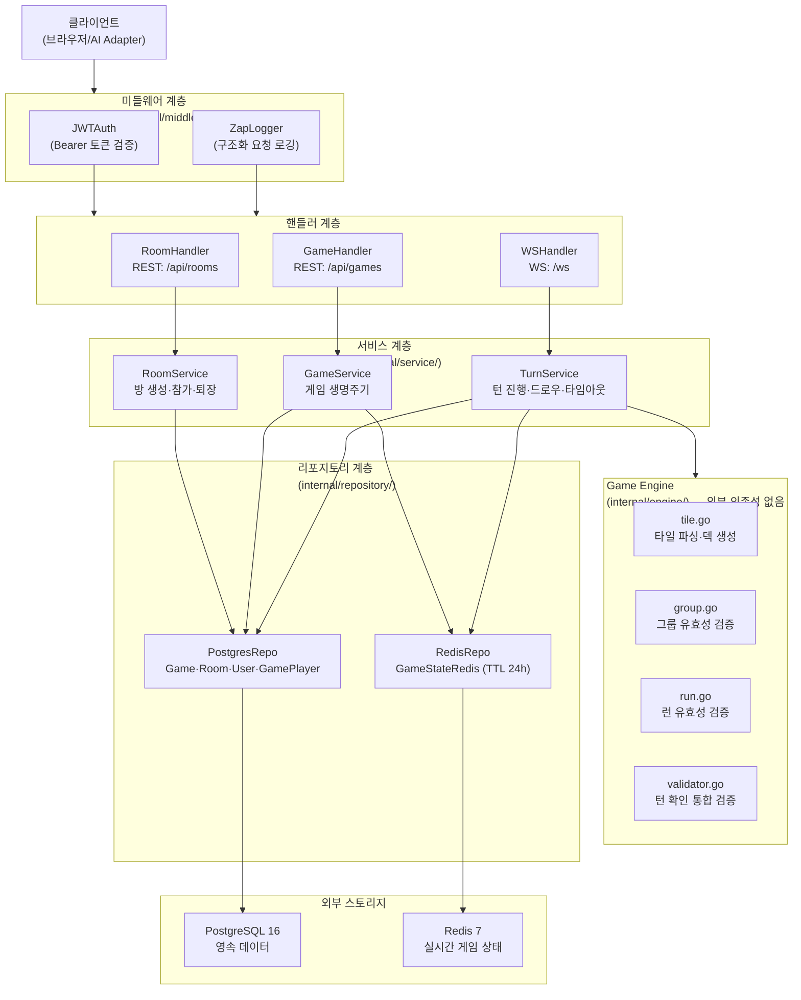
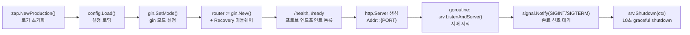
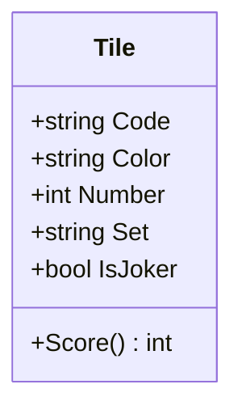
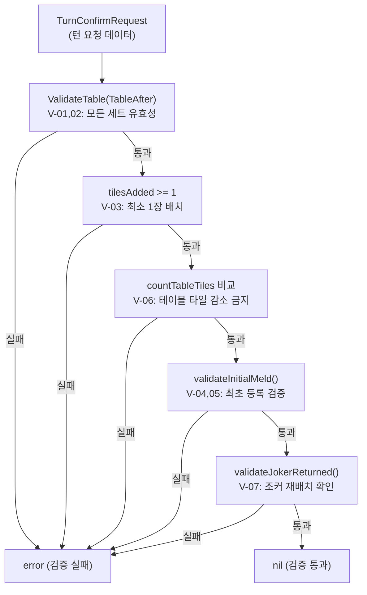
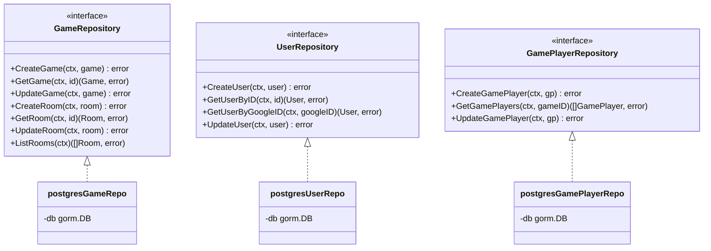
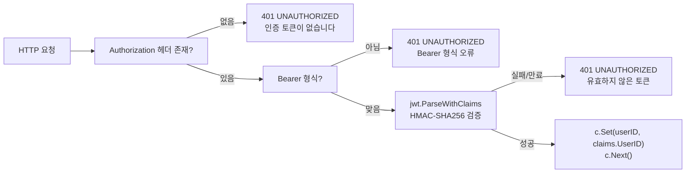
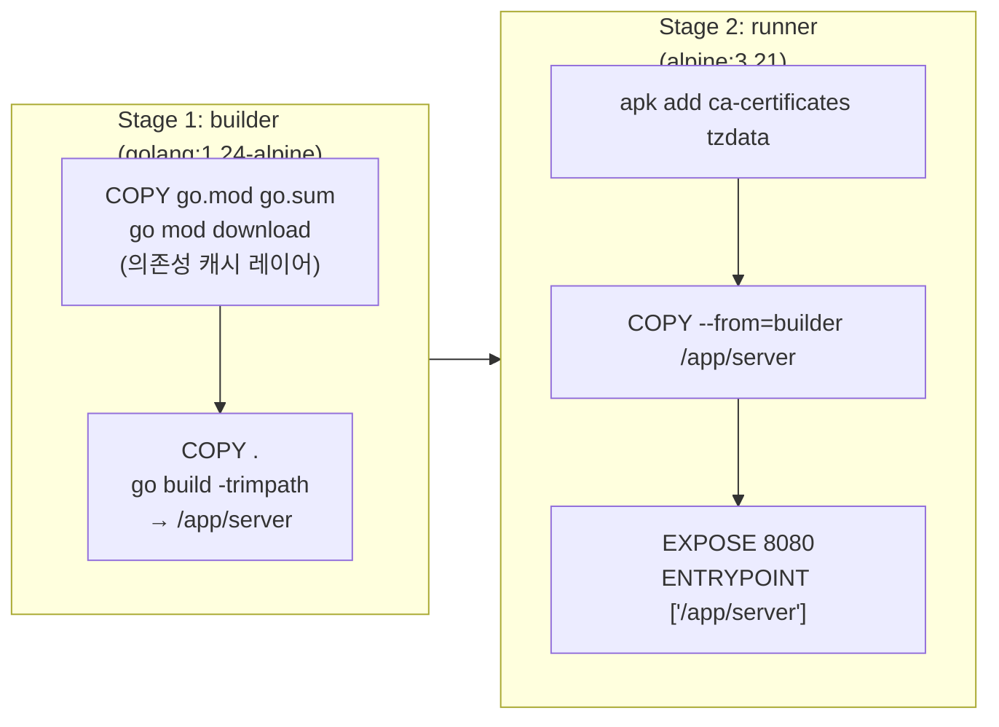
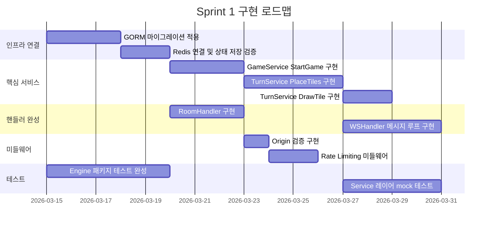

# game-server 스캐폴딩 상세 설명

> 작성일: 2026-03-12
> 작성자: 애벌레
> 버전: 0.1 (Sprint 0 스캐폴딩 완료 기준)

---

## 1. 개요

`src/game-server`는 RummiArena의 핵심 백엔드 서버다. 역할은 크게 세 가지다.

1. **REST API**: 방(Room) 생성/조회, 게임 이력 조회 등 HTTP 기반 CRUD
2. **WebSocket**: 실시간 게임 이벤트 양방향 통신 (턴 진행, 타일 배치, 타이머 등)
3. **Game Engine**: 루미큐브 규칙 순수 검증 — 외부 I/O 없음, LLM에 무관

이 서버는 **Stateless**를 원칙으로 한다. 진행 중인 게임 상태는 Redis에 저장하고, 영속 이력(게임 결과, 사용자, ELO 점수)은 PostgreSQL에 기록한다. Pod가 재시작되더라도 게임은 중단 없이 재개된다.

### 기술 스택 요약

| 영역 | 기술 | 선정 이유 |
|------|------|-----------|
| HTTP 프레임워크 | gin v1.10 | 경량, 라우팅 성능, 미들웨어 생태계 |
| WebSocket | gorilla/websocket v1.5 | Go 생태계 사실상 표준 |
| ORM | GORM v1.25 | 마이그레이션, 관계 매핑, PostgreSQL 지원 |
| 캐시/상태 | go-redis v9 | Redis 7 클라이언트, Context 지원 |
| 설정 관리 | viper v1.19 | 환경변수 + 파일 통합, 12-Factor App |
| JWT 인증 | golang-jwt/jwt v5 | HMAC-SHA256, Claims 커스터마이징 |
| 구조화 로깅 | go.uber.org/zap v1.27 | 고성능 JSON 로그, 프로덕션 적합 |
| 테스트 | testify v1.10 | 단언(assert), 목(mock), 스위트 |

---

## 2. 디렉토리 구조

```
src/game-server/
├── cmd/
│   └── server/
│       └── main.go              # 엔트리포인트: 초기화, graceful shutdown
├── internal/
│   ├── config/
│   │   └── config.go            # viper 기반 설정 구조체 및 로딩
│   ├── engine/                  # Game Engine (순수 함수, 외부 의존성 없음)
│   │   ├── tile.go              # 타일 인코딩/디코딩, 덱 생성
│   │   ├── group.go             # 그룹 유효성 검증 (같은 숫자, 다른 색)
│   │   ├── run.go               # 런 유효성 검증 (같은 색, 연속 숫자)
│   │   └── validator.go         # 턴 확인 통합 검증 (V-01 ~ V-15)
│   ├── handler/                 # HTTP/WebSocket 핸들러 (gin 컨텍스트 처리)
│   │   ├── game_handler.go      # 게임 이력 REST 핸들러
│   │   ├── room_handler.go      # Room CRUD REST 핸들러
│   │   └── ws_handler.go        # WebSocket 업그레이드 및 연결 처리
│   ├── middleware/              # gin 미들웨어
│   │   ├── auth.go              # JWT Bearer 토큰 검증
│   │   └── logger.go            # 구조화 요청 로깅 (zap)
│   ├── model/                   # 도메인 모델 (GORM + JSON 직렬화)
│   │   ├── game.go              # Game, Room GORM 엔티티
│   │   ├── player.go            # User, GamePlayer GORM 엔티티
│   │   └── tile.go              # Tile, SetOnTable, GameStateRedis 구조체
│   ├── repository/              # 데이터 접근 계층 (인터페이스 + 구현)
│   │   ├── postgres_repo.go     # PostgreSQL: Game/Room/User/GamePlayer
│   │   └── redis_repo.go        # Redis: 실시간 게임 상태 저장/조회/삭제
│   └── service/                 # 비즈니스 로직 (인터페이스 우선 정의)
│       ├── game_service.go      # GameService: 게임 생명주기
│       ├── room_service.go      # RoomService: 방 생성/참가/퇴장
│       └── turn_service.go      # TurnService: 턴 진행, 타임아웃 처리
├── Dockerfile                   # 멀티스테이지 빌드 (builder + runner)
├── go.mod                       # 모듈 선언 및 직접 의존성
└── go.sum                       # 의존성 체크섬
```

### 디렉토리별 핵심 역할

| 디렉토리 | 외부 의존성 | 역할 범위 |
|----------|------------|----------|
| `engine/` | 없음 (표준 라이브러리만) | 게임 규칙 검증 전담. 순수 함수 집합 |
| `handler/` | gin, gorilla/websocket | HTTP 요청 파싱, 응답 직렬화 |
| `service/` | model, repository, engine | 유스케이스 구현 |
| `repository/` | GORM, go-redis | 영속화 및 캐시 추상화 |
| `model/` | GORM, encoding/json | 도메인 엔티티 정의 |
| `middleware/` | gin, golang-jwt, zap | 횡단 관심사(인증, 로깅) |
| `config/` | viper | 환경변수 → 구조체 매핑 |

---

## 3. 계층 아키텍처

요청이 들어오는 흐름과 Game Engine의 독립적 위치를 나타낸다.



### 계층 간 의존 방향 원칙

- handler는 service 인터페이스만 참조한다. 구현체를 직접 알지 못한다.
- service는 repository 인터페이스와 engine 패키지를 참조한다.
- engine은 어떤 계층도 참조하지 않는다. 표준 라이브러리만 사용한다.
- repository는 model 패키지와 외부 드라이버(GORM, go-redis)만 참조한다.

---

## 4. 핵심 의존성

`go.mod`에 선언된 직접 의존성과 각 역할이다.

| 패키지 | 버전 | 역할 |
|--------|------|------|
| `github.com/gin-gonic/gin` | v1.10.0 | HTTP 라우터·미들웨어 프레임워크 |
| `github.com/gorilla/websocket` | v1.5.3 | WebSocket 프로토콜 업그레이드 및 메시지 프레임 |
| `gorm.io/gorm` | v1.25.12 | PostgreSQL ORM, 마이그레이션, 소프트 삭제 |
| `github.com/redis/go-redis/v9` | v9.7.0 | Redis 7 클라이언트, Context 기반 API |
| `github.com/spf13/viper` | v1.19.0 | 환경변수·설정 파일 통합 로딩 |
| `github.com/golang-jwt/jwt/v5` | v5.2.1 | JWT 발급·파싱·서명 검증 (HMAC-SHA256) |
| `go.uber.org/zap` | v1.27.0 | 구조화 JSON 로깅, 고성능 제로 할당 |
| `github.com/stretchr/testify` | v1.10.0 | 단언(assert/require), 모의 객체(mock) |

주요 간접 의존성:

| 패키지 | 역할 |
|--------|------|
| `github.com/bytedance/sonic` | gin 내부 고속 JSON 직렬화 |
| `github.com/go-playground/validator/v10` | gin 요청 바인딩 유효성 검사 |
| `github.com/fsnotify/fsnotify` | viper의 설정 파일 변경 감지 |
| `go.uber.org/multierr` | zap 다중 에러 누적 유틸리티 |

---

## 5. 엔트리포인트 (main.go)

파일 위치: `cmd/server/main.go`

### 초기화 흐름



### 헬스 프로브

| 엔드포인트 | 용도 | 응답 |
|-----------|------|------|
| `GET /health` | Kubernetes liveness probe | `{"status":"ok","timestamp":"..."}` |
| `GET /ready` | Kubernetes readiness probe | `{"status":"ready"}` |

### Graceful Shutdown

SIGINT 또는 SIGTERM 신호를 받으면 `context.WithTimeout` 10초를 부여하고 `srv.Shutdown(ctx)`를 호출한다. 이 시간 안에 진행 중인 요청이 완료된다. 10초 초과 시 강제 종료한다.

```go
ctx, cancel := context.WithTimeout(context.Background(), 10*time.Second)
defer cancel()
if err := srv.Shutdown(ctx); err != nil {
    logger.Error("server shutdown error", zap.Error(err))
}
```

---

## 6. 설정 관리 (config.go)

파일 위치: `internal/config/config.go`

`viper.AutomaticEnv()`를 통해 환경변수를 자동으로 읽는다. 환경변수가 없으면 `viper.SetDefault()`로 선언된 기본값을 사용한다.

### 환경변수 매핑

| 환경변수 | 기본값 | 설명 | Config 구조체 필드 |
|----------|--------|------|-------------------|
| `SERVER_PORT` | `8080` | HTTP 수신 포트 | `Config.Server.Port` |
| `SERVER_MODE` | `debug` | gin 모드 (`debug`/`release`/`test`) | `Config.Server.Mode` |
| `DB_HOST` | `localhost` | PostgreSQL 호스트 | `Config.DB.Host` |
| `DB_PORT` | `5432` | PostgreSQL 포트 | `Config.DB.Port` |
| `DB_USER` | `rummikub` | PostgreSQL 사용자 | `Config.DB.User` |
| `DB_PASSWORD` | `REDACTED_DB_PASSWORD` | PostgreSQL 패스워드 | `Config.DB.Password` |
| `DB_NAME` | `rummikub` | PostgreSQL 데이터베이스 이름 | `Config.DB.DBName` |
| `REDIS_HOST` | `localhost` | Redis 호스트 | `Config.Redis.Host` |
| `REDIS_PORT` | `6379` | Redis 포트 | `Config.Redis.Port` |
| `REDIS_PASSWORD` | `` (빈 문자열) | Redis 패스워드 (없으면 비워둠) | `Config.Redis.Password` |
| `JWT_SECRET` | `change-me-in-production` | JWT 서명 비밀키 | `Config.JWT.Secret` |

> **주의**: `JWT_SECRET`의 기본값은 개발 편의를 위한 것이다. 프로덕션 배포 시 반드시 강력한 무작위 문자열로 교체해야 한다.

### Config 구조체

```go
type Config struct {
    Server ServerConfig
    DB     DBConfig
    Redis  RedisConfig
    JWT    JWTConfig
}
```

---

## 7. 각 패키지 상세

### 7.1 engine — 게임 규칙 검증기

Game Engine은 프로젝트의 핵심 불변 원칙을 구현한다. LLM이 제안한 수를 포함해 모든 플레이어의 행동은 반드시 Engine을 통과해야 한다. Engine은 외부 의존성(DB, 네트워크, 전역 상태)이 전혀 없는 **순수 함수** 집합이다.

#### tile.go — 타일 표현과 덱 생성



| 함수/메서드 | 역할 |
|------------|------|
| `Parse(code string)` | 타일 코드 문자열을 `Tile`로 디코딩. 형식 오류 시 에러 반환 |
| `ParseAll(codes []string)` | 코드 슬라이스 일괄 파싱 |
| `(*Tile).Score()` | 타일 점수 반환. 숫자 타일은 숫자값, 조커는 30점 |
| `GenerateDeck()` | 106장 전체 덱 생성 (4색 × 13숫자 × 2세트 + 조커 2장) |

타일 코드 파싱 규칙:
- 조커: `JK1`, `JK2` — 색상·숫자·세트 없음
- 숫자 타일: 첫 글자(색상) + 중간 숫자(1~13) + 마지막 글자(a/b)
- 파싱 실패 시 에러 반환 (`invalid tile code: "X99z"`)

#### group.go — 그룹 유효성 검증

그룹(Group)은 같은 숫자, 다른 색으로 구성된 3~4개의 타일 묶음이다.

```go
func ValidateGroup(tiles []*Tile) error
```

| 검증 조건 | 오류 예시 |
|----------|---------|
| 타일 수 3~4개 | `"group must have 3 or 4 tiles, got 2"` |
| 조커 제외 타일은 모두 동일 숫자 | `"group tiles must share the same number: expected 7, got 8"` |
| 색상 중복 없음 | `"duplicate color \"R\" in group (tile R7b)"` |

조커는 참조 숫자를 대체하는 와일드카드로 동작한다. 그룹 내 조커의 점수는 해당 그룹의 공유 숫자로 계산된다(`groupScore` 내부 함수).

#### run.go — 런 유효성 검증

런(Run)은 같은 색, 연속된 숫자로 구성된 3개 이상의 타일 묶음이다.

```go
func ValidateRun(tiles []*Tile) error
```

| 검증 조건 | 오류 예시 |
|----------|---------|
| 타일 수 3개 이상 | `"run must have at least 3 tiles, got 2"` |
| 조커 제외 타일은 모두 동일 색상 | `"run tiles must share the same color: expected \"R\", got \"B\""` |
| 조커로 채울 수 없는 간격 없음 | `"run has too many gaps for available jokers (span 5, tiles 3)"` |
| 런 범위가 1~13을 벗어나지 않음 | `"run exceeds maximum tile number 13"` |
| 순환 불가 (13 → 1 wrap-around 금지) | 범위 계산에서 자동 차단 |

조커는 숫자 간격을 채우거나 런의 양 끝을 확장하는 데 사용된다. 조커만으로 구성된 런은 어떤 런도 나타낼 수 있으므로 유효로 처리한다.

#### validator.go — 턴 확인 통합 검증



`TurnConfirmRequest` 구조체:

| 필드 | 타입 | 설명 |
|------|------|------|
| `TableBefore` | `[]*TileSet` | 턴 시작 시점의 테이블 스냅샷 |
| `TableAfter` | `[]*TileSet` | 플레이어가 제안하는 최종 테이블 상태 |
| `RackBefore` | `[]string` | 턴 시작 시 플레이어 랙의 타일 코드 |
| `RackAfter` | `[]string` | 배치 후 남은 랙의 타일 코드 |
| `HasInitialMeld` | `bool` | 이전 턴에 최초 등록을 완료했는지 여부 |
| `JokerReturnedCodes` | `[]string` | 이번 턴에 테이블에서 회수한 조커 코드 |

검증 규칙 번호와 의미:

| 규칙 | 설명 |
|------|------|
| V-01, V-02 | 테이블의 모든 세트가 유효한 그룹 또는 런이어야 함 |
| V-03 | 최소 1장의 랙 타일을 테이블에 배치해야 함 |
| V-04 | 최초 등록 점수 합계 30점 이상이어야 함 |
| V-05 | 최초 등록 전에는 기존 테이블 타일 재배치 불가 |
| V-06 | 테이블 타일 총수가 턴 전보다 감소할 수 없음 |
| V-07 | 조커를 테이블에서 회수한 경우 반드시 재배치해야 함 |
| V-14, V-15 | 모든 세트는 3장 이상이어야 함 (ValidateTable에서 포괄) |

---

### 7.2 handler — HTTP/WebSocket 핸들러

핸들러는 gin 컨텍스트로부터 요청을 파싱하고, service를 호출하며, 응답을 직렬화한다. 비즈니스 로직을 직접 포함하지 않는다.

#### room_handler.go

`RoomHandler`는 방 관련 REST 엔드포인트를 처리한다.

| 메서드 | 엔드포인트 | 핸들러 함수 |
|--------|-----------|------------|
| POST | `/api/rooms` | `CreateRoom` |
| GET | `/api/rooms` | `ListRooms` |
| GET | `/api/rooms/:id` | `GetRoom` |
| POST | `/api/rooms/:id/join` | `JoinRoom` |
| POST | `/api/rooms/:id/leave` | `LeaveRoom` |
| POST | `/api/rooms/:id/start` | `StartGame` |

#### game_handler.go

`GameHandler`는 게임 이력 조회 REST 엔드포인트를 처리한다.

| 메서드 | 엔드포인트 | 핸들러 함수 |
|--------|-----------|------------|
| GET | `/api/games` | `ListGames` |
| GET | `/api/games/:id` | `GetGame` |
| GET | `/api/games/:id/events` | `GetGameEvents` |

#### ws_handler.go

`WSHandler`는 WebSocket 연결을 처리한다. `gorilla/websocket`의 `Upgrader`를 사용해 HTTP 연결을 WebSocket으로 업그레이드한다.

```go
var upgrader = websocket.Upgrader{
    CheckOrigin: func(r *http.Request) bool {
        // TODO: origin 검증 로직 구현
        return true
    },
}
```

WebSocket 연결 방식:
- 방법 A: `ws://host/ws?token={JWT}&roomId={roomId}` — 쿼리스트링으로 토큰 전달
- 방법 B (권장): `ws://host/ws?roomId={roomId}` + 첫 메시지로 `auth` 이벤트 전송

---

### 7.3 service — 비즈니스 로직

서비스 계층은 인터페이스를 우선 정의하고 구현체를 분리한다. 이를 통해 테스트 시 mock 구현체로 대체할 수 있다.

#### game_service.go

```go
type GameService interface {
    StartGame(roomID string) (*model.Game, error)
    GetGame(gameID string) (*model.Game, error)
    GetGameState(gameID string) (*model.GameStateRedis, error)
    EndGame(gameID string) error
}
```

| 메서드 | 구현 예정 로직 |
|--------|--------------|
| `StartGame` | 106장 생성 → Fisher-Yates 셔플 → 플레이어별 14장 분배 → Redis 저장 |
| `GetGame` | PostgreSQL에서 게임 엔티티 조회 |
| `GetGameState` | Redis에서 실시간 게임 상태 조회 |
| `EndGame` | 게임 종료 처리, 점수 계산, ELO 업데이트 |

#### room_service.go

```go
type RoomService interface {
    CreateRoom(req *CreateRoomRequest) (*model.Room, error)
    GetRoom(id string) (*model.Room, error)
    ListRooms() ([]*model.Room, error)
    JoinRoom(roomID, userID string) error
    LeaveRoom(roomID, userID string) error
}
```

`CreateRoomRequest` DTO:

| 필드 | 타입 | 설명 |
|------|------|------|
| `PlayerCount` | `int` | 최대 플레이어 수 (2~4) |
| `TurnTimeoutSec` | `int` | 턴 제한 시간 (초) |
| `HostUserID` | `string` | JSON 직렬화 제외 (`json:"-"`), 미들웨어에서 주입 |

#### turn_service.go

```go
type TurnService interface {
    PlaceTiles(req *PlaceTilesRequest) (*TurnResult, error)
    DrawTile(gameID string, playerSeat int) (*TurnResult, error)
    HandleTimeout(gameID string, playerSeat int) (*TurnResult, error)
}
```

| 메서드 | 구현 예정 로직 |
|--------|--------------|
| `PlaceTiles` | Engine 검증 → 상태 적용 → Redis 업데이트 → 승리 조건 체크 |
| `DrawTile` | 드로우 파일에서 1장 뽑기 → 랙에 추가 → 다음 턴으로 이동 |
| `HandleTimeout` | 테이블 스냅샷 롤백 + 자동 드로우 1장 |

`TurnResult`:

| 필드 | 타입 | 설명 |
|------|------|------|
| `Success` | `bool` | 턴 처리 성공 여부 |
| `NextSeat` | `int` | 다음 플레이어 좌석 번호 |
| `GameState` | `*model.GameStateRedis` | 업데이트된 게임 상태 (WebSocket 브로드캐스트용) |
| `ErrorCode` | `string` | 실패 시 에러 코드 |

---

### 7.4 repository — 데이터 접근 계층

리포지토리 계층은 인터페이스와 구현체를 같은 파일에 함께 정의한다. 단순한 CRUD 패턴에서는 파일 분리보다 가독성을 우선한다.

#### postgres_repo.go

세 개의 인터페이스와 구현체가 정의된다.



에러 래핑 패턴 — 모든 에러는 맥락을 포함해 래핑한다.

```go
return fmt.Errorf("postgres_repo: get game %q: %w", id, err)
```

#### redis_repo.go

Redis 키 명명 규칙: `game:{gameID}:state`

```go
type GameStateRepository interface {
    SaveGameState(ctx context.Context, state *model.GameStateRedis) error
    GetGameState(ctx context.Context, gameID string) (*model.GameStateRedis, error)
    DeleteGameState(ctx context.Context, gameID string) error
}
```

| 동작 | 내부 처리 |
|------|----------|
| `SaveGameState` | `json.Marshal` → `SET game:{id}:state {json} EX 86400` |
| `GetGameState` | `GET` → `json.Unmarshal` → 구조체 반환. 키 없으면 명시적 에러 |
| `DeleteGameState` | `DEL game:{id}:state` |

TTL은 24시간(`gameStateTTL = 24 * time.Hour`)이다. 게임이 종료되면 `DeleteGameState`로 명시적으로 제거한다.

---

### 7.5 model — GORM 도메인 모델

#### game.go

| 구조체 | 용도 | 주요 필드 |
|--------|------|----------|
| `Game` | PostgreSQL 게임 엔티티 | `ID(uuid)`, `Status`, `MaxPlayers`, `CurrentSeat`, `TurnTimeoutSecs`, `WinnerID` |
| `Room` | PostgreSQL 방 엔티티 | `ID(uuid)`, `Name`, `HostID`, `GameID`, `IsPrivate` |
| `GameStatus` | 게임 상태 열거형 | `WAITING`, `PLAYING`, `FINISHED`, `CANCELLED` |

#### player.go

| 구조체 | 용도 | 주요 필드 |
|--------|------|----------|
| `User` | PostgreSQL 사용자 | `GoogleID(unique)`, `Email`, `Nickname`, `EloRating` |
| `GamePlayer` | 게임 참가자 | `SeatOrder`, `PlayerType`, `AIModel`, `HasInitialMeld`, `ConsecForceDraw` |

`ConsecForceDraw`는 연속 강제 드로우 횟수를 추적한다. 이 값이 3에 도달하면 게임 규칙에 따라 교착 상태 처리가 트리거된다.

#### tile.go

Redis에 저장되는 실시간 상태 구조체가 포함된다.

| 구조체 | 용도 |
|--------|------|
| `Tile` | JSON/WebSocket 직렬화용 타일 표현 |
| `SetOnTable` | 테이블 위의 타일 묶음 (`ID` + `Tiles`) |
| `GameStateRedis` | Redis에 저장되는 전체 게임 상태 |
| `PlayerState` | 플레이어별 랙(Rack) 상태 |

`GameStateRedis` 구조:

```go
type GameStateRedis struct {
    GameID      string        `json:"gameId"`
    Status      GameStatus    `json:"status"`
    CurrentSeat int           `json:"currentSeat"`
    DrawPile    []string      `json:"drawPile"`   // 타일 코드 슬라이스
    Table       []*SetOnTable `json:"table"`
    Players     []PlayerState `json:"players"`
    TurnStartAt int64         `json:"turnStartAt"` // Unix timestamp
}
```

---

### 7.6 middleware — 횡단 관심사

#### auth.go — JWT 인증 미들웨어



`Claims` 구조체:

```go
type Claims struct {
    UserID string `json:"sub"`
    Email  string `json:"email"`
    jwt.RegisteredClaims
}
```

핸들러에서 사용자 ID를 꺼낼 때는 `middleware.UserIDFromContext(c)`를 사용한다.

#### logger.go — 구조화 요청 로깅

`ZapLogger` 미들웨어는 gin의 `c.Next()` 이후에 요청 결과를 기록한다.

기록 필드: `status`, `method`, `path`, `query`, `ip`, `latency`, `userAgent`, `errors`(있을 경우)

로그 레벨 분기:

| HTTP 상태 | 로그 레벨 |
|----------|---------|
| 5xx | `Error` |
| 4xx | `Warn` |
| 나머지 | `Info` |

---

## 8. Dockerfile — 멀티스테이지 빌드



### 빌드 최적화 포인트

| 기법 | 적용 위치 | 효과 |
|------|----------|------|
| 의존성 레이어 선분리 | `COPY go.mod go.sum` → `go mod download` → `COPY .` | 소스 변경 시 의존성 레이어 캐시 재사용 |
| `-trimpath` 빌드 플래그 | `go build -trimpath` | 바이너리에서 빌드 머신 경로 제거 (보안, 재현성) |
| `CGO_ENABLED=0` | 빌드 환경변수 | CGO 비활성화, 정적 바이너리 생성 |
| `alpine:3.21` 베이스 | 런너 스테이지 | 이미지 크기 최소화 (~10MB) |
| `ca-certificates` 추가 | `apk add` | HTTPS 외부 API 호출 지원 |
| `tzdata` 추가 | `apk add` | 타임존 데이터, 게임 시간 계산에 필요 |

최종 이미지는 Go 컴파일러나 소스 코드를 포함하지 않는다. 정적 바이너리 하나만 포함된다.

---

## 9. 빌드 및 실행 방법

### 로컬 직접 실행

```bash
# 의존성 설치
cd /mnt/d/Users/KTDS/Documents/06.과제/RummiArena/src/game-server
go mod download

# 개발 서버 실행 (기본 포트 8080)
go run ./cmd/server

# 환경변수 재정의
SERVER_PORT=9090 SERVER_MODE=release go run ./cmd/server
```

### Docker 빌드 및 실행

```bash
cd /mnt/d/Users/KTDS/Documents/06.과제/RummiArena/src/game-server

# 이미지 빌드
docker build -t rummiarena/game-server:dev .

# 컨테이너 실행 (PostgreSQL, Redis가 이미 동작 중인 경우)
docker run -p 8080:8080 \
  -e DB_HOST=host.docker.internal \
  -e REDIS_HOST=host.docker.internal \
  -e JWT_SECRET=my-dev-secret \
  rummiarena/game-server:dev
```

### 헬스체크 확인

```bash
curl http://localhost:8080/health
# {"status":"ok","timestamp":"2026-03-12T00:00:00Z"}

curl http://localhost:8080/ready
# {"status":"ready"}
```

### Engine 단위 테스트

Game Engine은 외부 의존성이 없으므로 인프라 없이 바로 테스트할 수 있다.

```bash
cd /mnt/d/Users/KTDS/Documents/06.과제/RummiArena/src/game-server
go test ./internal/engine/... -v
```

### 전체 테스트 실행

```bash
go test ./... -coverprofile=coverage.out
go tool cover -func=coverage.out
```

목표 커버리지: 80% 이상 (engine 패키지는 100% 목표).

---

## 10. 다음 단계 (Sprint 1 로드맵)

스캐폴딩 단계에서는 인터페이스와 구조체, Game Engine 핵심 로직이 완성되었다. Sprint 1에서 구현할 항목이다.



### 우선 구현 항목

| 우선순위 | 항목 | 관련 파일 |
|----------|------|----------|
| 1 | GORM AutoMigrate 연결 (`main.go` 초기화 블록) | `cmd/server/main.go` |
| 2 | `GameService.StartGame` — 타일 셔플, 분배, Redis 저장 | `internal/service/game_service.go` |
| 3 | `TurnService.PlaceTiles` — Engine 검증 → Redis 업데이트 | `internal/service/turn_service.go` |
| 4 | `WSHandler` 메시지 루프 — 인증, 룸 참가, 이벤트 브로드캐스트 | `internal/handler/ws_handler.go` |
| 5 | WebSocket Origin 검증 | `internal/handler/ws_handler.go` |
| 6 | `RoomHandler` 전체 메서드 구현 | `internal/handler/room_handler.go` |
| 7 | Engine 패키지 테스트 커버리지 100% | `internal/engine/*_test.go` |
