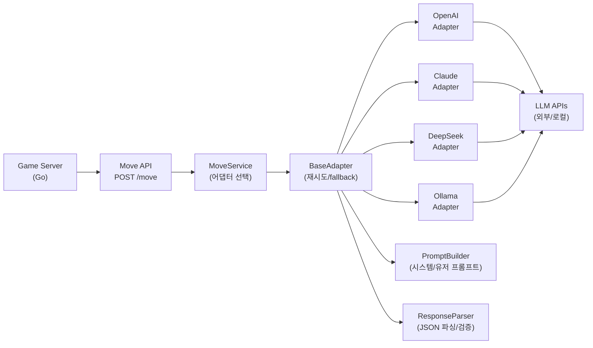
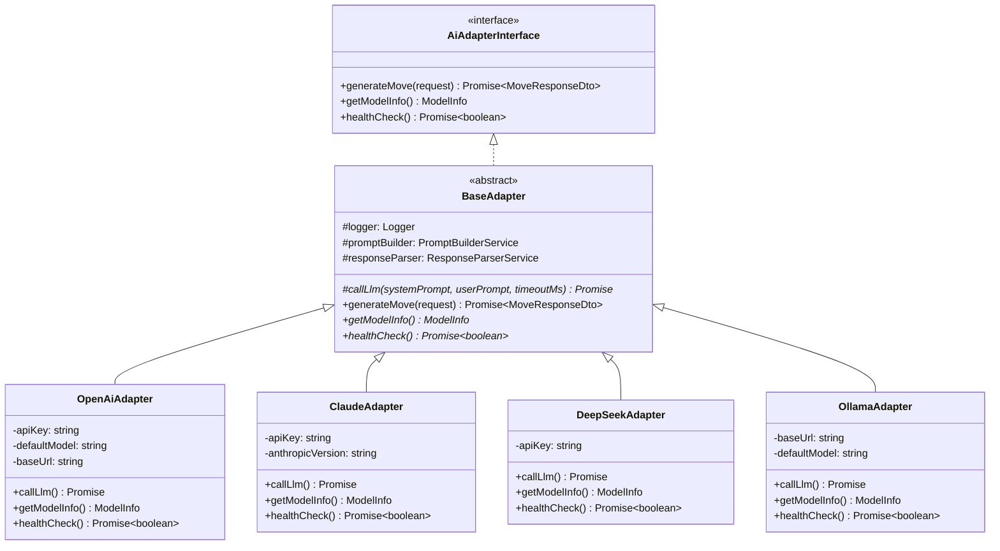
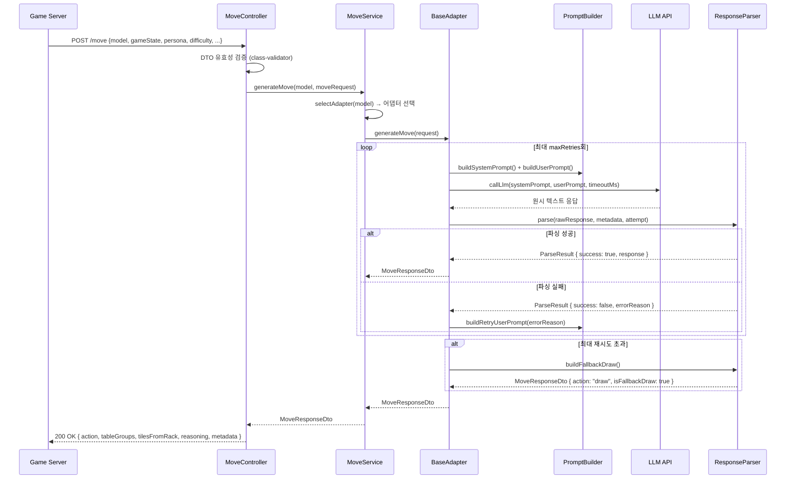
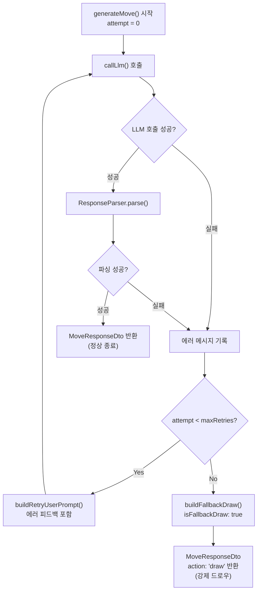
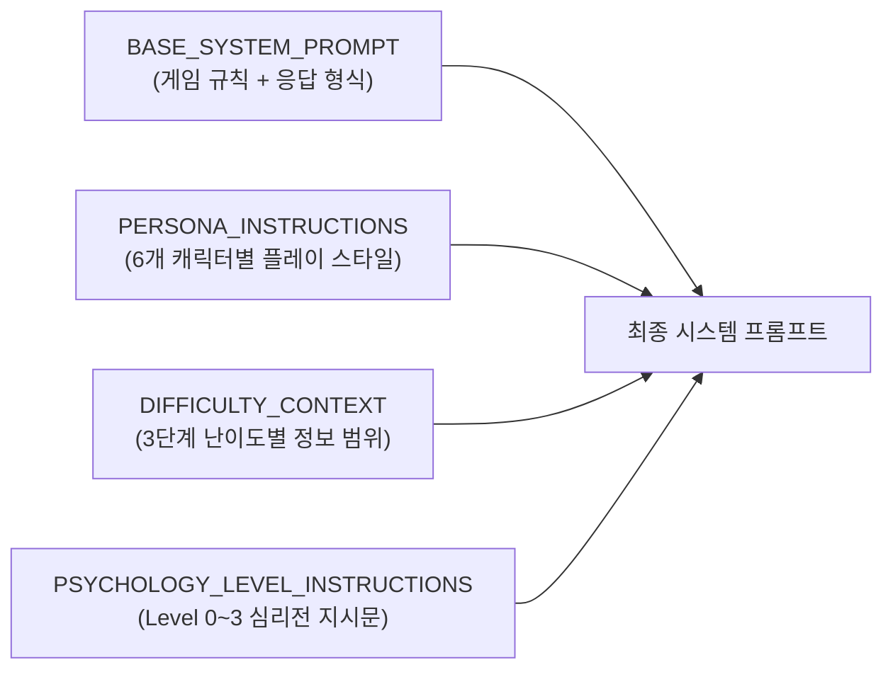

# AI Adapter 개발 가이드

> 최종 수정: 2026-03-14
> 담당: AI Adapter (NestJS/TypeScript)
> 포트: 8081 (로컬) / NodePort 30081 (K8s)

---

## 1. 개요

AI Adapter는 Game Server(Go)와 외부 LLM API 사이의 중간 계층이다. Game Server는 어떤 LLM을 쓰는지 알 필요 없이 공통 인터페이스(`POST /move`)를 호출하면, AI Adapter가 내부적으로 모델을 선택하고 프롬프트를 빌드하여 LLM에 전달한다.



### 핵심 설계 원칙

| 원칙 | 내용 |
|------|------|
| LLM 불신 | LLM 응답은 절대 신뢰하지 않는다. 모든 파싱은 try-catch로 보호한다 |
| 재시도 정책 | 파싱/호출 실패 시 최대 3회(기본값) 재시도 후 강제 DRAW |
| 공통 인터페이스 | 모든 LLM 어댑터는 `AiAdapterInterface`를 구현한다 |
| 프롬프트 관리 | 캐릭터·난이도·심리전 템플릿은 `persona.templates.ts` 단일 파일로 관리 |
| DTO 검증 | 요청/응답 모두 `class-validator`로 유효성을 검증한다 |
| 타임아웃 | LLM API 호출 기본 타임아웃 30,000ms |

---

## 2. 디렉토리 구조

```
src/ai-adapter/
├── src/
│   ├── main.ts                          # 애플리케이션 진입점 (포트 8081, ValidationPipe 전역 설정)
│   ├── app.module.ts                    # 루트 모듈 (ConfigModule, HealthModule, MoveModule)
│   ├── app.controller.ts                # GET / 기본 라우트
│   ├── app.service.ts                   # 기본 서비스
│   │
│   ├── adapter/                         # LLM 어댑터 구현체
│   │   ├── base.adapter.ts              # 공통 추상 클래스 (재시도/fallback/로깅)
│   │   ├── openai.adapter.ts            # OpenAI GPT (JSON mode)
│   │   ├── claude.adapter.ts            # Anthropic Claude (Messages API)
│   │   ├── deepseek.adapter.ts          # DeepSeek (OpenAI 호환 API)
│   │   └── ollama.adapter.ts            # Ollama 로컬 LLM (llama3.2 기본)
│   │
│   ├── common/
│   │   ├── dto/
│   │   │   ├── move-request.dto.ts      # MoveRequestDto, GameStateDto, TileGroupDto 등
│   │   │   └── move-response.dto.ts     # MoveResponseDto, MoveMetadataDto
│   │   ├── interfaces/
│   │   │   └── ai-adapter.interface.ts  # AiAdapterInterface, ModelInfo
│   │   └── parser/
│   │       ├── response-parser.service.ts   # LLM 텍스트 → MoveResponseDto 파싱
│   │       └── response-parser.service.spec.ts
│   │
│   ├── move/                            # /move 엔드포인트 모듈
│   │   ├── move.module.ts               # MoveModule (4개 어댑터 + 공통 서비스 등록)
│   │   ├── move.controller.ts           # POST /move (PostMoveBodyDto 수신)
│   │   └── move.service.ts              # 어댑터 선택 및 위임
│   │
│   ├── prompt/                          # 프롬프트 빌더
│   │   ├── persona.templates.ts         # 캐릭터·난이도·심리전 템플릿 상수
│   │   ├── prompt-builder.service.ts    # 시스템/유저/재시도 프롬프트 빌드
│   │   └── prompt-builder.service.spec.ts
│   │
│   └── health/                          # 헬스체크 모듈
│       ├── health.module.ts
│       ├── health.controller.ts         # GET /health, GET /health/adapters
│       └── health.service.ts
│
├── .env.example                         # 환경변수 예시
├── .env                                 # 로컬 실제 값 (Git 제외)
├── Dockerfile
├── package.json
└── tsconfig.json
```

---

## 3. 아키텍처

### 어댑터 패턴



### 요청 흐름 (시퀀스)



---

## 4. 핵심 모듈 상세

### 4.1 MoveRequest / MoveResponse DTO

**MoveRequestDto** (`src/common/dto/move-request.dto.ts`)

| 필드 | 타입 | 설명 |
|------|------|------|
| `gameId` | `string` | 게임 세션 ID |
| `playerId` | `string` | AI 플레이어 ID |
| `gameState` | `GameStateDto` | 현재 게임 상태 전체 |
| `persona` | `Persona` | rookie / calculator / shark / fox / wall / wildcard |
| `difficulty` | `Difficulty` | beginner / intermediate / expert |
| `psychologyLevel` | `0 \| 1 \| 2 \| 3` | 심리전 레벨 |
| `maxRetries` | `number` | 최대 재시도 횟수 (1~5, 기본 3) |
| `timeoutMs` | `number` | LLM 타임아웃ms (5000~60000, 기본 30000) |

**GameStateDto** (MoveRequestDto 내부)

| 필드 | 타입 | 설명 |
|------|------|------|
| `tableGroups` | `TileGroupDto[]` | 현재 테이블 위의 그룹/런 |
| `myTiles` | `string[]` | AI 플레이어의 현재 타일 랙 (최대 14장) |
| `opponents` | `OpponentInfoDto[]` | 상대 플레이어 정보 |
| `drawPileCount` | `number` | 드로우 파일 남은 장수 |
| `turnNumber` | `number` | 현재 턴 번호 |
| `initialMeldDone` | `boolean` | 최초 등록(30점) 완료 여부 |
| `unseenTiles` | `string[]?` | 미출현 타일 목록 (expert 전용) |

**MoveResponseDto** (`src/common/dto/move-response.dto.ts`)

| 필드 | 타입 | 설명 |
|------|------|------|
| `action` | `"place" \| "draw"` | AI가 선택한 행동 |
| `tableGroups` | `TileGroupDto[]?` | 배치 후 테이블 전체 구성 (place 시) |
| `tilesFromRack` | `string[]?` | 이번 턴에 랙에서 사용한 타일 |
| `reasoning` | `string?` | AI 사고 과정 (디버깅/UI 표시용) |
| `metadata` | `MoveMetadataDto` | 모델명, 지연시간, 토큰 수, 재시도 횟수, fallback 여부 |

**타일 코드 규칙**

```
{Color}{Number}{Set}
- Color: R(빨강), B(파랑), Y(노랑), K(검정)
- Number: 1~13
- Set: a | b
- 조커: JK1, JK2
- 예시: R7a, B13b, JK1
```

### 4.2 4개 어댑터

| 어댑터 | 엔드포인트 | 응답 형식 | 기본 모델 | 특이사항 |
|--------|-----------|----------|----------|---------|
| OpenAiAdapter | `https://api.openai.com/v1/chat/completions` | JSON mode (`response_format: {type: "json_object"}`) | `gpt-4o` | JSON 강제 응답 |
| ClaudeAdapter | `https://api.anthropic.com/v1/messages` | system/user 분리 | `claude-sonnet-4-20250514` | `anthropic-version` 헤더 필요 |
| DeepSeekAdapter | `https://api.deepseek.com/v1/chat/completions` | JSON mode | `deepseek-chat` | OpenAI 호환 API |
| OllamaAdapter | `http://localhost:11434/api/chat` | `format: "json"` | `llama3.2` | 로컬 실행, API 키 불필요 |

각 어댑터가 구현하는 핵심 메서드는 `callLlm(systemPrompt, userPrompt, timeoutMs)`이다. 재시도·fallback 로직은 `BaseAdapter`가 공통으로 처리하므로 각 어댑터는 LLM API 호출에만 집중한다.

### 4.3 어댑터 자동 선택 로직

`MoveService.selectAdapter(model)`이 `model` 문자열을 실제 어댑터 인스턴스로 매핑한다. 알 수 없는 모델 타입이 오면 `BadRequestException`을 던진다.

```
POST /move { model: "openai" }  →  OpenAiAdapter
POST /move { model: "claude" }  →  ClaudeAdapter
POST /move { model: "deepseek" } →  DeepSeekAdapter
POST /move { model: "ollama" }  →  OllamaAdapter
```

### 4.4 재시도 + fallback DRAW 정책



- **1회차**: 기본 유저 프롬프트 사용
- **2~n회차**: `buildRetryUserPrompt(errorReason, attemptNumber)`로 이전 실패 이유를 포함한 프롬프트 전송
- **maxRetries 소진**: `isFallbackDraw: true`인 드로우 응답 반환. Game Engine이 이를 받아 실제 드로우 처리

### 4.5 프롬프트 시스템 (persona.templates.ts)

캐릭터 × 난이도 × 심리전 레벨의 조합으로 시스템 프롬프트를 구성한다.



**6개 AI 캐릭터**

| 캐릭터 | 전략 스타일 |
|--------|-----------|
| `rookie` | 초보자. 단순 그룹/런만 구성, 재배치 없음 |
| `calculator` | 확률 계산. 최적 효율 추구, 조커 아끼기 |
| `shark` | 공격형. 대량 배치, 상대 타일 선점 |
| `fox` | 교활형. 블러핑, 전략적 보류 후 기습 배치 |
| `wall` | 방어형. 최소 배치, 장기전 유도 |
| `wildcard` | 예측 불가. 매 턴 다른 전략, 일관성 없음 |

**3단계 난이도**

| 난이도 | 제공 정보 범위 |
|--------|------------|
| `beginner` (하수) | 내 타일 + 테이블만 |
| `intermediate` (중수) | + 상대 타일 수 |
| `expert` (고수) | + 행동 히스토리 + 미출현 타일 |

**심리전 레벨**

| 레벨 | 내용 |
|------|------|
| 0 | 없음 |
| 1 | 상대 타일 수 관찰 후 공격/집중 전환 |
| 2 | 패턴 분석 + 선점 견제 |
| 3 | 블러핑 + 페이크 드로우 + 템포 조절 |

### 4.6 ResponseParser (LLM 응답 파싱)

LLM이 코드 블록(` ```json `)을 포함하거나 JSON이 아닌 텍스트를 섞어도 처리할 수 있도록 3단계 파싱을 수행한다.

1. **JSON 추출**: 코드 블록 제거 → `{}` 경계 찾기 → `JSON.parse()`
2. **구조 검증**: `action` 필드가 `"place"` 또는 `"draw"`인지 확인
3. **타일 코드 검증**: 정규식 `^([RBYK](?:[1-9]|1[0-3])[ab]|JK[12])$`로 각 타일 코드 검증

파싱 실패 시 `{ success: false, errorReason: "..." }`를 반환하여 BaseAdapter가 재시도를 결정한다.

---

## 5. 환경 설정

### 5.1 .env (로컬 개발)

`.env.example`을 `.env`로 복사 후 실제 값을 설정한다.

```
# 서버 설정
PORT=8081
NODE_ENV=development

# OpenAI
OPENAI_API_KEY=sk-...
OPENAI_DEFAULT_MODEL=gpt-4o

# Claude (Anthropic)
CLAUDE_API_KEY=sk-ant-...
CLAUDE_DEFAULT_MODEL=claude-sonnet-4-20250514

# DeepSeek
DEEPSEEK_API_KEY=sk-...
DEEPSEEK_DEFAULT_MODEL=deepseek-chat

# Ollama (로컬, API 키 불필요)
OLLAMA_BASE_URL=http://localhost:11434
OLLAMA_DEFAULT_MODEL=llama3.2

# LLM 공통 기본값
LLM_TIMEOUT_MS=30000
LLM_MAX_RETRIES=3

# 비용 제한 (미구현, 향후 확장)
DAILY_COST_LIMIT_USD=10
USER_DAILY_CALL_LIMIT=500
GAME_CALL_LIMIT=200
```

`production` 환경(`NODE_ENV=production`)에서는 `.env` 파일을 읽지 않고 환경변수로만 주입한다(`ignoreEnvFile: true`).

### 5.2 K8s ConfigMap / Secret

Helm values (`helm/charts/ai-adapter/values.yaml`) 기준:

```yaml
service:
  type: NodePort
  port: 8081
  nodePort: 30081    # http://localhost:30081

env:
  NODE_ENV: "production"
  PORT: "8081"
```

API 키는 K8s Secret으로 관리한다. 예:

```bash
kubectl create secret generic ai-adapter-secrets \
  --from-literal=OPENAI_API_KEY=sk-... \
  --from-literal=CLAUDE_API_KEY=sk-ant-... \
  --from-literal=DEEPSEEK_API_KEY=sk-... \
  -n rummikub
```

Helm Deployment template에서 `envFrom.secretRef`로 주입한다.

---

## 6. 빌드 및 실행

### 6.1 로컬 개발

```bash
cd src/ai-adapter

# 의존성 설치
npm install

# 개발 서버 (핫 리로드)
npm run start:dev

# 프로덕션 빌드
npm run build

# 프로덕션 실행
npm run start:prod
```

개발 서버는 포트 `8081`에서 실행된다.

### 6.2 Docker 이미지 빌드

```bash
cd src/ai-adapter
docker build -t rummiarena/ai-adapter:dev .
```

### 6.3 K8s 배포 (Helm)

```bash
# 이미지를 Docker Desktop K8s에 로드
docker build -t rummiarena/ai-adapter:dev src/ai-adapter/

# Helm 배포
helm upgrade --install ai-adapter helm/charts/ai-adapter \
  --namespace rummikub --create-namespace

# 배포 확인
kubectl get pods -n rummikub -l app=ai-adapter
kubectl logs -n rummikub -l app=ai-adapter --tail=50
```

서비스 접근: `http://localhost:30081`

### 6.4 주요 엔드포인트

| 메서드 | 경로 | 설명 |
|--------|------|------|
| `GET` | `/` | 기본 응답 (`Hello World!`) |
| `GET` | `/health` | 서비스 헬스체크 (K8s liveness probe) |
| `GET` | `/health/adapters` | 4개 어댑터 연결 상태 확인 (K8s readiness probe) |
| `POST` | `/move` | AI 다음 수 생성 (Game Server 호출) |

**POST /move 요청 예시**

```json
{
  "gameId": "game-001",
  "playerId": "ai-player-1",
  "model": "openai",
  "persona": "calculator",
  "difficulty": "expert",
  "psychologyLevel": 2,
  "gameState": {
    "tableGroups": [
      { "tiles": ["R7a", "B7a", "K7b"] }
    ],
    "myTiles": ["R3a", "R4a", "R5a", "B11a", "Y13b"],
    "opponents": [
      { "playerId": "player-1", "remainingTiles": 6 }
    ],
    "drawPileCount": 42,
    "turnNumber": 5,
    "initialMeldDone": true
  }
}
```

---

## 7. 테스트

### 7.1 단위 테스트

```bash
cd src/ai-adapter

# 전체 단위 테스트
npm test

# 감시 모드
npm run test:watch

# 커버리지 리포트
npm run test:cov
```

주요 테스트 파일:

| 파일 | 테스트 대상 |
|------|-----------|
| `src/common/parser/response-parser.service.spec.ts` | ResponseParser (JSON 추출, 타일 코드 검증, fallback) |
| `src/prompt/prompt-builder.service.spec.ts` | PromptBuilder (시스템/유저/재시도 프롬프트 생성) |
| `src/app.controller.spec.ts` | AppController |

### 7.2 수동 API 테스트

Ollama가 로컬에서 실행 중인 경우:

```bash
curl -X POST http://localhost:8081/move \
  -H "Content-Type: application/json" \
  -d '{
    "gameId": "test-001",
    "playerId": "ai-1",
    "model": "ollama",
    "persona": "rookie",
    "difficulty": "beginner",
    "psychologyLevel": 0,
    "gameState": {
      "tableGroups": [],
      "myTiles": ["R3a","R4a","R5a","B7a","K7b","Y7a"],
      "opponents": [{"playerId":"p1","remainingTiles":8}],
      "drawPileCount":80,
      "turnNumber":1,
      "initialMeldDone":false
    }
  }'
```

헬스체크:

```bash
curl http://localhost:8081/health
curl http://localhost:8081/health/adapters
```

### 7.3 새 어댑터 추가 방법

1. `src/adapter/` 아래 `{name}.adapter.ts` 파일 생성
2. `BaseAdapter`를 상속하여 `callLlm()`, `getModelInfo()`, `healthCheck()` 구현
3. `src/move/move.module.ts`의 `providers` 배열에 추가
4. `src/move/move.service.ts`의 `ModelType`과 `adapters` 맵에 추가
5. `src/move/move.controller.ts`의 `@IsEnum` 값에 추가
6. `.env.example`에 새 어댑터의 환경변수 추가

---

## 8. 다음 단계

| 항목 | 우선순위 | 내용 |
|------|---------|------|
| E2E 테스트 | 높음 | Game Server → AI Adapter 실제 호출 통합 테스트 |
| 비용 추적 | 중간 | Redis 기반 일일/게임당 토큰 사용량 기록 |
| 스트리밍 응답 | 낮음 | UI에 AI 사고 과정 실시간 표시 (SSE 또는 WS) |
| LangChain 검토 | 낮음 | Sprint 4 PoC 시점에 LangGraph 도입 여부 결정 |
| 캐릭터 Fine-tuning | 낮음 | 실제 게임 데이터로 캐릭터별 프롬프트 개선 |
