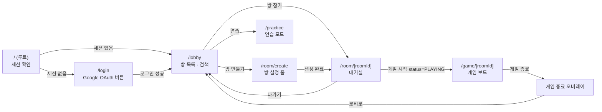
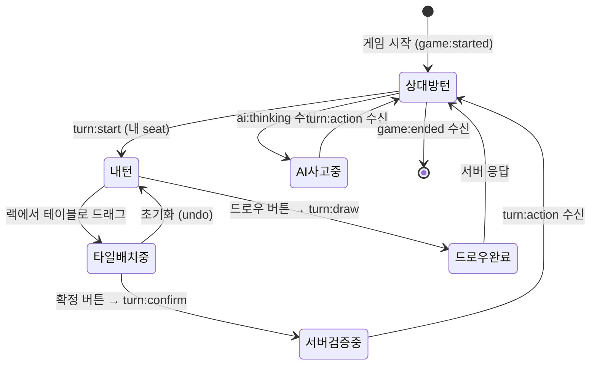
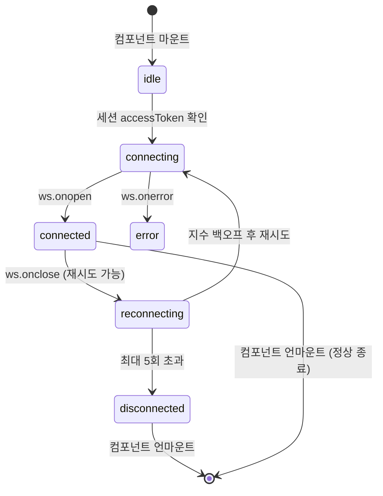
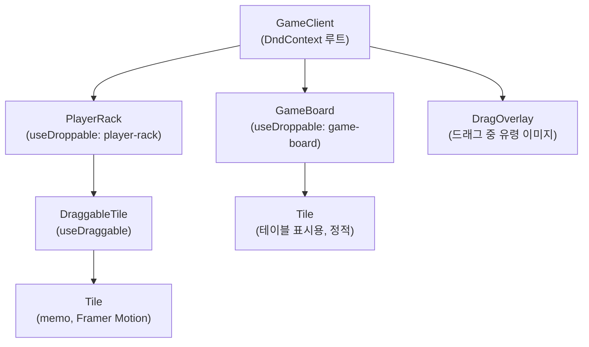
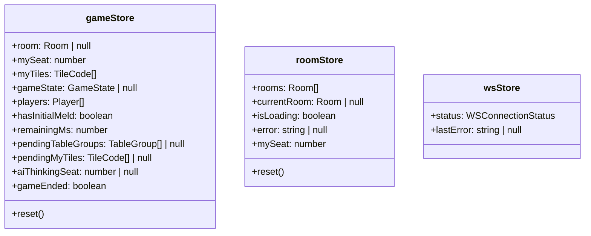
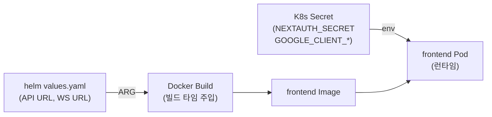
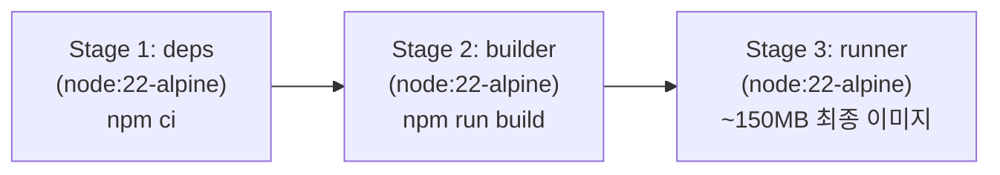

# Frontend 개발 가이드

## 1. 개요

`src/frontend/`는 RummiArena의 플레이어 대면 Next.js 15 애플리케이션이다. App Router 기반으로 서버 컴포넌트와 클라이언트 컴포넌트를 명확히 분리하며, Google OAuth 인증 → 로비 → 방 생성 → 대기실 → 게임 플레이까지 E2E 흐름이 구현되어 있다.

### 역할

- Google OAuth 2.0 기반 로그인 (NextAuth.js)
- 로비: 방 목록 조회, 방 코드로 참가, 방 생성 폼
- 대기실: 플레이어 슬롯 표시, 게임 설정 확인, 호스트 게임 시작
- 게임 보드: 1인칭 뷰, 타일 드래그 앤 드롭(dnd-kit), WebSocket 실시간 동기화
- WebSocket 클라이언트: 자동 재연결, 이벤트 디스패치, 연결 상태 배너

### 현재 구현 상태 요약

| 영역 | 상태 |
|---|---|
| Google OAuth 로그인 | 완료 |
| 로비 (방 목록 / 검색 / 참가) | 완료 |
| 방 생성 폼 (AI 설정 포함) | 완료 |
| 대기실 (Seat 슬롯 / 시작 버튼) | 완료 |
| 게임 보드 (타일 DnD) | 완료 |
| WebSocket 훅 (useWebSocket) | 구현 완료 (game-server 스텁 대기 중) |
| 연습 모드 (PracticeClient) | UI 스캐폴딩 완료, 로직 미구현 |
| 게임 복기 (4분할 뷰) | 미구현 |
| ELO / 랭킹 페이지 | 미구현 |

---

## 2. 디렉토리 구조

```
src/frontend/
├── Dockerfile                        # 멀티스테이지 빌드 (node:22-alpine, standalone)
├── package.json                      # Next.js 15, React 19, next-auth 4, zustand 5
├── tailwind.config.ts                # 디자인 토큰 (타일 색상, 폰트, 커스텀 크기)
├── tsconfig.json
└── src/
    ├── app/                          # Next.js App Router (페이지)
    │   ├── layout.tsx                # 루트 레이아웃 (AuthProvider 주입)
    │   ├── page.tsx                  # 루트: 세션 여부에 따라 /lobby 또는 /login으로 리다이렉트
    │   ├── login/
    │   │   ├── page.tsx              # Server Component (메타데이터 설정)
    │   │   └── LoginClient.tsx       # 'use client' — Google 로그인 버튼, Framer Motion
    │   ├── lobby/
    │   │   ├── page.tsx              # Server Component (세션 검증 → 리다이렉트 가드)
    │   │   └── LobbyClient.tsx       # 'use client' — 3단 레이아웃, 방 목록, 검색
    │   ├── room/
    │   │   ├── create/
    │   │   │   ├── page.tsx
    │   │   │   └── CreateRoomClient.tsx  # 방 설정 폼 (인원, 타임아웃, AI 슬롯)
    │   │   └── [roomId]/
    │   │       ├── page.tsx
    │   │       └── WaitingRoomClient.tsx # 대기실 (Seat 그리드, 게임 시작)
    │   ├── game/
    │   │   └── [roomId]/
    │   │       ├── page.tsx
    │   │       └── GameClient.tsx    # 게임 플레이 (DnD, WebSocket, 1인칭 뷰)
    │   ├── practice/
    │   │   ├── page.tsx
    │   │   └── PracticeClient.tsx    # 연습 모드 (스캐폴딩 단계)
    │   └── globals.css
    ├── components/
    │   ├── providers/
    │   │   └── AuthProvider.tsx      # 'use client' — SessionProvider 래퍼
    │   ├── tile/
    │   │   ├── Tile.tsx              # 타일 렌더링 (memo, 색약 접근성 심볼)
    │   │   ├── DraggableTile.tsx     # dnd-kit useDraggable 래퍼 (memo)
    │   │   └── TileBack.tsx          # 뒤집힌 타일 (상대방 타일 수 표시)
    │   └── game/
    │       ├── GameBoard.tsx         # 테이블 보드 (useDroppable, 그룹 목록)
    │       ├── PlayerRack.tsx        # 내 타일 랙 (useDroppable, DraggableTile 목록)
    │       ├── PlayerCard.tsx        # 플레이어 카드 (현재 턴 하이라이트, AI 사고 중)
    │       ├── TurnTimer.tsx         # 턴 타이머 (프로그레스바, 경고/위험 색상)
    │       └── ConnectionStatus.tsx  # WS 연결 상태 배너 (fixed, role="alert")
    ├── hooks/
    │   ├── useWebSocket.ts           # WS 연결/재연결/이벤트 처리/send
    │   └── useTurnTimer.ts           # 1초 카운트다운 (remainingMs 기반)
    ├── store/
    │   ├── gameStore.ts              # Zustand — 게임 상태, 타일, 플레이어, pending 편집
    │   ├── roomStore.ts              # Zustand — 방 목록, 현재 방, mySeat
    │   └── wsStore.ts                # Zustand — WS 연결 상태 (status, lastError)
    ├── lib/
    │   ├── auth.ts                   # NextAuth authOptions (Google Provider, JWT 콜백)
    │   ├── api.ts                    # REST 클라이언트 (game-server, mock fallback)
    │   └── mock-data.ts              # 개발/데모용 mock 데이터
    └── types/
        ├── game.ts                   # Room, Player, GameState, GameResult 등
        ├── tile.ts                   # TileCode, TableGroup, parseTileCode, 색상 매핑
        ├── websocket.ts              # WSMessage, WSServerEvent, WSClientEvent, 페이로드
        └── index.ts                  # 재export 편의 모음
```

---

## 3. 페이지 흐름

### 3-1. E2E 네비게이션 흐름



### 3-2. 게임 보드 내 상태 흐름



### 3-3. WebSocket 연결 상태 전이



---

## 4. 핵심 컴포넌트

### 4-1. 인증 (NextAuth.js, Google OAuth)

**설정 파일:** `src/lib/auth.ts`

`NextAuthOptions`에 Google Provider를 등록한다. `GOOGLE_CLIENT_ID` / `GOOGLE_CLIENT_SECRET` 환경변수가 없으면 Provider를 등록하지 않아 빌드 오류를 방지한다.

JWT 콜백에서 `account.access_token`을 토큰에 저장하고, 세션 콜백에서 `session.accessToken`으로 노출한다. 이 토큰은 WebSocket 연결 시 `auth` 이벤트 페이로드로 game-server에 전달된다.

```
세션 전략: JWT, 유효기간 24시간
커스텀 페이지: signIn → /login, error → /login
```

**컴포넌트 분리 패턴**

서버 컴포넌트인 `layout.tsx`가 `SessionProvider`를 직접 사용할 수 없으므로 `AuthProvider.tsx`를 `'use client'`로 분리하여 래핑한다. 이 패턴은 모든 페이지 레이아웃에 적용된다.

**로그인 UI:** `src/app/login/LoginClient.tsx`

- Framer Motion으로 카드 진입 애니메이션, 타일 장식 순차 표시
- Google 로그인 버튼: `loading` 상태에서 스피너 표시
- `signIn("google", { callbackUrl: "/lobby" })` 호출

### 4-2. 게임 보드 (타일 DnD - dnd-kit)

**구성 요소**



**DnD 이벤트 처리** (`GameClient.tsx` → `handleDragEnd`)

| 드롭 대상 | 동작 |
|---|---|
| `game-board` | 랙 타일을 테이블 새 그룹으로 이동 (`pendingTableGroups` 업데이트) |
| `player-rack` | 테이블 그룹에서 타일 제거 후 랙으로 복원 |

pending 상태는 Zustand `gameStore`의 `pendingTableGroups` / `pendingMyTiles`에 임시 저장된다. 확정 버튼 클릭 시 `turn:confirm` + `turn:place` WebSocket 이벤트를 전송하고 pending을 초기화한다.

**센서 설정**

```
PointerSensor, activationConstraint: { distance: 8 }
(8px 이동 후 드래그 시작 — 오클릭 방지)
```

**Tile 컴포넌트 (`src/components/tile/Tile.tsx`)**

- `React.memo`로 메모이제이션 (타일이 많을 때 불필요한 리렌더 방지)
- 색상과 심볼을 이중 인코딩 (색약 접근성): R=◆, B=●, Y=▲, K=■, JK=★
- 크기 프리셋: `rack(42×58px)`, `table(34×46px)`, `mini(10×16px)`, `quad(28×38px)`, `icon(20×26px)`
- Framer Motion: hover 시 `scale(1.08), y(-2)`, 선택 시 `y(-6)`

**타일 코드 규칙** (`src/types/tile.ts`)

```
형식: {Color}{Number}{Set}
Color: R(Red) | B(Blue) | Y(Yellow) | K(Black)
Number: 1~13
Set: a | b  (동일 번호·색상 타일 구분)
조커: JK1 | JK2
예: R7a, B13b, JK1
```

### 4-3. WebSocket 클라이언트 (useWebSocket)

**파일:** `src/hooks/useWebSocket.ts`

현재 코드 구조는 완성되어 있으나 game-server WebSocket 엔드포인트가 스텁 상태이므로 실제 통신은 불가능하다. game-server 구현 완료 후 연동 예정이다.

**연결 설정**

```
엔드포인트: ${NEXT_PUBLIC_WS_URL}/ws?roomId={roomId}
인증: ws.onopen 후 { event: "auth", data: { token: accessToken } } 전송
재연결: 지수 백오프 (기본 2000ms × 1.5^시도횟수, 최대 5회)
```

**서버 → 클라이언트 이벤트 처리**

| 이벤트 | 처리 내용 |
|---|---|
| `game:started` | `myTiles`, `players` 설정 |
| `game:state` | `gameState`, `players` 갱신 |
| `turn:start` | `remainingMs` 리셋, AI 사고 표시 해제 |
| `turn:action` | 드로우 타일 추가, `tableGroups` 갱신 |
| `turn:timeout` | 강제 드로우 타일 추가 |
| `game:ended` | `gameEnded = true` (종료 오버레이 표시) |
| `player:joined` / `player:left` | 콘솔 로그 (대기실 폴링으로 보완) |
| `ai:thinking` | `aiThinkingSeat` 설정 (AI 사고 중 표시) |
| `error` | `lastError` 설정, 연결 상태 배너 표시 |

**클라이언트 → 서버 이벤트**

| 이벤트 | 전송 시점 |
|---|---|
| `auth` | 연결 성공 직후 |
| `turn:place` | 확정 버튼 클릭 |
| `turn:draw` | 드로우 버튼 클릭 |
| `turn:undo` | 초기화 버튼 클릭 |
| `turn:confirm` | 확정 버튼 클릭 (turn:place와 함께) |

**mock 데이터 fallback**

game-server 미연결 시 `GameClient`는 마운트 시점에 `MOCK_GAME_STATE`, `MOCK_MY_TILES`, `MOCK_PLAYERS`로 초기화하여 UI 데모가 가능하다. API 클라이언트(`src/lib/api.ts`)도 각 호출마다 `try/catch`로 mock fallback을 구현한다.

**대기실 폴링**

WebSocket 대기실 이벤트(room 상태 변화)는 아직 game-server에서 지원하지 않으므로, `WaitingRoomClient`는 5초 간격으로 REST API `/rooms/{id}`를 폴링하여 Room 상태를 갱신한다. `status === "PLAYING"` 감지 시 `/game/{roomId}`로 자동 이동한다.

### 4-4. 상태 관리 (Zustand)

세 개의 독립 스토어로 관심사를 분리한다.



`gameStore`는 `subscribeWithSelector` 미들웨어를 사용하여 특정 슬라이스만 선택적으로 구독할 수 있다. `pendingTableGroups` / `pendingMyTiles`는 턴 편집 중 서버에 아직 확정하지 않은 로컬 임시 상태다.

---

## 5. 스타일링

### 5-1. TailwindCSS 디자인 토큰

`tailwind.config.ts`에 프로젝트 전용 토큰이 정의되어 있다.

**색상 토큰**

| 토큰 | 값 | 용도 |
|---|---|---|
| `tile-red` | #E74C3C | 빨강 타일 |
| `tile-blue` | #3498DB | 파랑 타일 |
| `tile-yellow` | #F1C40F | 노랑 타일 |
| `tile-black` | #2C3E50 | 검정 타일 |
| `board-bg` | #1A3328 | 게임 테이블 배경 |
| `app-bg` | #0D1117 | 전체 앱 배경 |
| `panel-bg` | #161B22 | 헤더/사이드패널 |
| `card-bg` | #1C2128 | 카드 컴포넌트 |
| `warning` | #F3C623 | 강조 (현재 턴, CTA 버튼) |
| `success` | #3FB950 | 성공/인간 플레이어 |
| `danger` | #F85149 | 오류/경고 |
| `color-ai` | #9B59B6 | AI 플레이어 전용 |

**폰트**

- sans: `Pretendard Variable`, `-apple-system`, `Malgun Gothic`
- mono: `D2Coding`, `Consolas` (타일 숫자, 방 코드 표시)

**폰트 크기 (타일 전용)**

`tile-xs(10px)` ~ `tile-3xl(30px)` 의 사이즈 스케일을 사용한다. 일반 Tailwind `text-*` 대신 이 토큰을 사용해 일관성을 유지한다.

### 5-2. Framer Motion 패턴

컴포넌트별 애니메이션 패턴은 다음과 같다.

| 컴포넌트 | 애니메이션 |
|---|---|
| 로그인 카드 | `opacity: 0→1, y: 20→0` (0.4초) |
| 타일 장식 | 순차 등장 (`delay: 0.2 + i * 0.08`) |
| 타일 hover | `scale: 1.08, y: -2` (spring) |
| 타일 선택 | `y: -6` (spring) |
| 방 카드 목록 | `AnimatePresence` + `layout` (순서 변경 애니메이션) |
| 게임 종료 오버레이 | `scale: 0.85→1` (spring, stiffness 300) |
| AI 사고 중 표시 | `scale: [1, 1.2, 1]` 반복 펄스 |
| 연결 상태 배너 | `y: -20→0` 슬라이드인 |
| `AnimatePresence` | 조건부 렌더 컴포넌트 진입/퇴장 모두 적용 |

---

## 6. 환경 설정

### 6-1. .env.local

`src/frontend/.env.local.example`을 복사하여 `.env.local`을 생성한다.

```
# game-server REST API 엔드포인트 (NEXT_PUBLIC_ → 브라우저에 노출됨)
NEXT_PUBLIC_API_URL=http://localhost:8080

# WebSocket 엔드포인트
NEXT_PUBLIC_WS_URL=ws://localhost:8080

# NextAuth 설정
NEXTAUTH_URL=http://localhost:3000
NEXTAUTH_SECRET=<랜덤 문자열 32자 이상>

# Google OAuth Console에서 발급
GOOGLE_CLIENT_ID=<your-client-id>.apps.googleusercontent.com
GOOGLE_CLIENT_SECRET=<your-client-secret>
```

`NEXTAUTH_SECRET`은 `openssl rand -base64 32` 명령으로 생성한다.

Google OAuth 설정 시 승인된 리디렉션 URI에 `http://localhost:3000/api/auth/callback/google`을 추가해야 한다.

### 6-2. K8s ConfigMap / Secret

K8s 배포 시 `NEXT_PUBLIC_*` 변수는 빌드 타임에 주입된다(Dockerfile ARG). 런타임 변수는 K8s Secret으로 관리한다.



| 변수 | 관리 방식 |
|---|---|
| `NEXT_PUBLIC_API_URL` | Helm values → Docker ARG |
| `NEXT_PUBLIC_WS_URL` | Helm values → Docker ARG |
| `NEXTAUTH_URL` | K8s ConfigMap |
| `NEXTAUTH_SECRET` | K8s Secret |
| `GOOGLE_CLIENT_ID` | K8s Secret |
| `GOOGLE_CLIENT_SECRET` | K8s Secret |

---

## 7. 빌드 및 실행

### 7-1. 로컬 개발

```bash
cd src/frontend

# 의존성 설치
npm install

# 환경변수 설정
cp .env.local.example .env.local
# .env.local 편집 (NEXTAUTH_SECRET, GOOGLE_CLIENT_* 입력)

# 개발 서버 시작 (http://localhost:3000)
npm run dev

# 린트 검사
npm run lint

# 프로덕션 빌드 확인
npm run build
npm run start
```

### 7-2. Docker 빌드

```bash
cd src/frontend

docker build \
  --build-arg NEXT_PUBLIC_API_URL=http://game-server:8080 \
  --build-arg NEXT_PUBLIC_WS_URL=ws://game-server:8080 \
  -t rummiarena/frontend:latest .
```

멀티스테이지 빌드 구조:



`next.config.ts`에 `output: "standalone"` 설정이 있어야 `Runner` 스테이지가 정상 동작한다.

### 7-3. K8s 배포 (NodePort 30000)

```bash
# Helm 설치 (또는 업그레이드)
helm upgrade --install rummiarena ./helm/rummiarena \
  --set frontend.image.tag=latest

# Pod 상태 확인
kubectl get pods -l app=frontend

# 브라우저 접근
# http://localhost:30000
```

헬스체크: Dockerfile에 `wget http://localhost:3000/`으로 설정되어 있다 (15초 간격, 5초 타임아웃, 3회 실패 시 재시작).

---

## 8. 다음 단계

### 8-1. 단기 (game-server WebSocket 연동)

game-server의 WebSocket 엔드포인트(`/ws`)가 구현되면 다음 작업을 진행한다.

1. `NEXT_PUBLIC_WS_URL` 환경변수를 game-server 주소로 교체
2. `useWebSocket`의 `enabled` 옵션을 `true`로 유지 (현재 기본값 true)
3. mock 데이터 초기화 코드(`GameClient.tsx` useEffect) 제거 또는 조건부 실행으로 전환
4. 대기실 폴링을 WebSocket `room:updated` 이벤트로 대체

### 8-2. 중기 구현 항목

| 항목 | 설명 |
|---|---|
| 게임 복기 (Replay) | `/replay/[gameId]` — 4분할 뷰, `game_snapshots` 데이터 |
| ELO 랭킹 페이지 | `/ranking` — `UserStats`, 페이지네이션 |
| 연습 모드 | `/practice` — Stage 1~6 단계별 로직 구현 |
| 알림 통합 | 카카오톡 API 웹훅 수신 후 인앱 토스트 표시 |
| 관리자 링크 | ROLE_ADMIN 세션 시 `/admin` 바로가기 노출 |

### 8-3. 성능 개선 항목

- `PlayerRack`: 타일이 14개 이상일 때 가상화 고려 (`@tanstack/react-virtual`)
- `GameBoard`: 그룹 수가 많을 때 intersection observer로 뷰포트 외 타일 렌더 스킵
- WebSocket 메시지 수신 시 불필요한 전체 리렌더 방지: `useGameStore`의 선택적 구독(`subscribeWithSelector`) 활용

### 8-4. 접근성(a11y) 보완

- 색약 접근성: 타일 심볼 이중 인코딩은 완료. 고대비 모드 CSS 미디어 쿼리 추가 예정
- 키보드 내비게이션: 타일 드래그를 키보드로도 가능하도록 dnd-kit `KeyboardSensor` 추가 예정
- 스크린 리더: `aria-live="polite"` 영역에 게임 상태 변경 메시지 추가 예정
