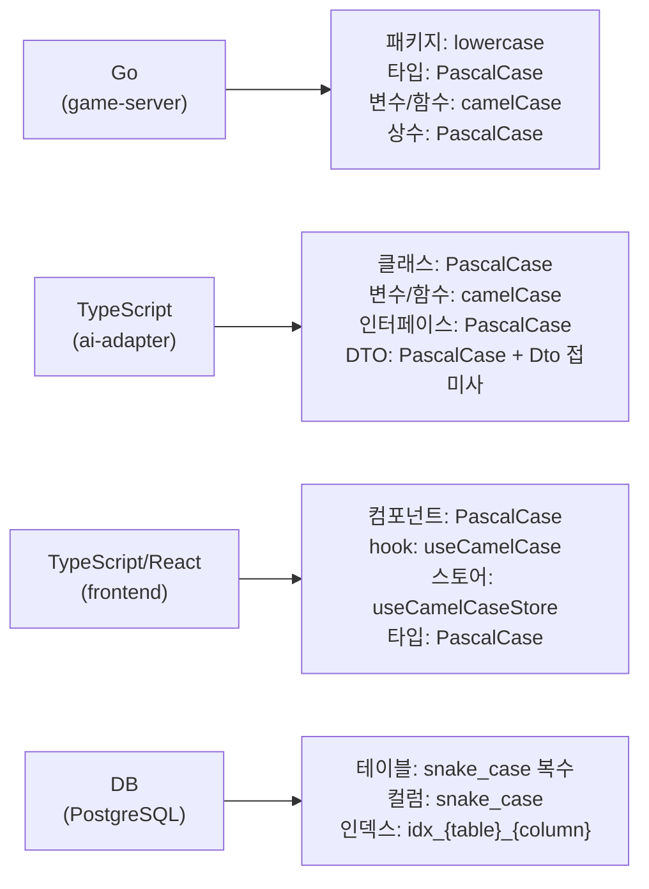
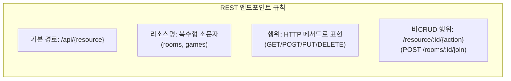
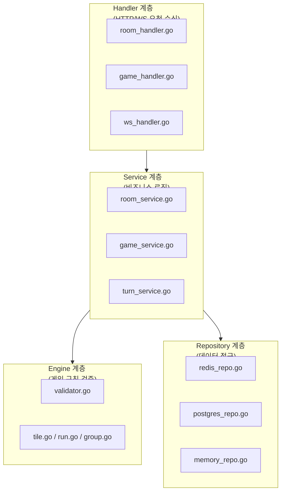

# 코딩 컨벤션 (Coding Conventions)

> **최종 수정**: 2026-03-14
> **대상**: RummiArena 프로젝트 전체 (game-server, ai-adapter, frontend, admin)

---

## 1. 공통 규칙

### 1.1 파일 포맷

| 항목 | 규칙 |
|------|------|
| 인코딩 | UTF-8 (BOM 없음) |
| 줄 끝 | LF (`\n`) -- Windows 환경이라도 Git `core.autocrlf=input` 설정 |
| 들여쓰기 | Go: **탭**, TypeScript/JSON/YAML: **스페이스 2칸** |
| 최대 줄 길이 | 120자 권장 (엄격 제한 아님) |
| 파일 끝 | 반드시 개행 1줄로 끝남 |

### 1.2 언어 규칙

| 항목 | 규칙 |
|------|------|
| 코드 주석 | **영어** (Go godoc, JSDoc 모두 영어) |
| 사용자 표시 문자열 | **한글** (에러 메시지, UI 텍스트 등) |
| 문서 | **한글** (docs/ 전체) |
| 커밋 메시지 | **한글** (별도 07-git-workflow.md 참조) |

### 1.3 네이밍 총괄



### 1.4 import 정렬

모든 언어에서 import는 다음 순서로 그룹화하고, 그룹 사이에 빈 줄을 둔다.

1. 표준 라이브러리 / 프레임워크
2. 외부 라이브러리 (third-party)
3. 프로젝트 내부 모듈 (상대 경로 또는 모듈 별칭)

---

## 2. Go (game-server)

### 2.1 프로젝트 구조

```
src/game-server/
  cmd/server/main.go        -- 엔트리포인트
  internal/
    config/                  -- 설정 로딩 (viper)
    engine/                  -- 게임 규칙 검증 (순수 로직, 외부 의존성 없음)
    handler/                 -- HTTP/WebSocket 핸들러 (gin)
    middleware/              -- JWT 인증, 로깅 등 미들웨어
    model/                   -- 도메인 모델 + GORM 엔티티
    repository/              -- 데이터 접근 (Redis, PostgreSQL, Memory)
    service/                 -- 비즈니스 로직 (handler와 repository 사이)
    infra/                   -- 인프라 초기화 (DB 연결, Redis 연결)
  server/                    -- 라우터 설정 (필요 시)
```

### 2.2 패키지 네이밍

- 소문자 단일 단어 사용 (`engine`, `handler`, `model`)
- 언더스코어, 하이픈, 대문자 금지
- 패키지명과 디렉토리명이 동일해야 함

```go
// Good
package engine
package middleware

// Bad
package gameEngine    // camelCase 금지
package game_engine   // 언더스코어 금지
```

### 2.3 인터페이스 우선 정의

서비스 계층은 반드시 인터페이스를 먼저 정의하고, 구현체는 unexported struct로 작성한다. Handler는 인터페이스에만 의존한다.

```go
// RoomService Room 생성/관리 비즈니스 로직
type RoomService interface {
    CreateRoom(req *CreateRoomRequest) (*model.RoomState, error)
    GetRoom(id string) (*model.RoomState, error)
    ListRooms() ([]*model.RoomState, error)
}

// 구현체는 unexported
type roomService struct {
    roomRepo repository.MemoryRoomRepository
}

// NewRoomService RoomService 구현체 생성자
func NewRoomService(repo repository.MemoryRoomRepository) RoomService {
    return &roomService{roomRepo: repo}
}
```

### 2.4 에러 래핑 패턴

- 에러는 `fmt.Errorf`에 `%w` 동사로 래핑하여 호출 체인을 추적 가능하게 한다
- 래핑 시 `{패키지}_{함수}: {설명}` 형식으로 컨텍스트를 덧붙인다
- 비즈니스 에러는 전용 에러 타입(`ServiceError`, `ValidationError`)을 사용한다

```go
// 인프라 에러 래핑
return nil, fmt.Errorf("redis_repo: marshal game state: %w", err)
return nil, fmt.Errorf("room_service: save room: %w", err)

// 비즈니스 에러 (타입 assertion으로 HTTP 상태 코드 매핑)
return nil, &ServiceError{
    Code:    "NOT_FOUND",
    Message: "방을 찾을 수 없습니다.",
    Status:  404,
}
```

### 2.5 구조체 태그

```go
// GORM 모델: json + gorm 태그 병용
type User struct {
    ID          string    `json:"id" gorm:"type:uuid;primaryKey;default:gen_random_uuid()"`
    Email       string    `json:"email" gorm:"type:varchar(255);uniqueIndex;not null"`
    DisplayName string    `json:"displayName" gorm:"type:varchar(100);not null"`
    CreatedAt   time.Time `json:"createdAt" gorm:"autoCreateTime"`
}

// Redis 캐시 모델: json 태그만
type GameStateRedis struct {
    GameID      string     `json:"gameId"`
    Status      GameStatus `json:"status"`
    CurrentSeat int        `json:"currentSeat"`
}

// 요청 바디: json + binding 태그 (gin 유효성 검증)
type createRoomRequest struct {
    Name           string `json:"name"`
    PlayerCount    int    `json:"playerCount" binding:"required,min=2,max=4"`
    TurnTimeoutSec int    `json:"turnTimeoutSec" binding:"required,min=30,max=120"`
}
```

### 2.6 로깅 (zap)

- 구조화된 로깅을 위해 `go.uber.org/zap`을 사용한다
- `main.go`에서 `zap.NewProduction()`으로 초기화하여 DI로 전달한다
- 필드는 `zap.String()`, `zap.Int()`, `zap.Error()` 등 타입드 필드를 사용한다

```go
logger.Info("server starting", zap.String("port", cfg.Server.Port))
logger.Warn("postgres unavailable", zap.Error(err))
logger.Error("request", zap.Int("status", status), zap.Duration("latency", duration))
```

### 2.7 테스트 네이밍

- 테스트 함수명: `Test{함수명}_{시나리오}` 형식 (PascalCase)
- 테이블 드리븐 테스트 사용을 권장한다
- 테스트 설명(name)은 **한글**로 작성한다
- `testify`의 `assert`/`require` 패키지를 사용한다

```go
func TestParse_ValidNormalTile(t *testing.T) {
    tests := []struct {
        name       string
        code       string
        wantColor  string
        wantNumber int
    }{
        {name: "빨강 7 세트a", code: "R7a", wantColor: ColorRed, wantNumber: 7},
        {name: "최댓값 13", code: "B13b", wantColor: ColorBlue, wantNumber: 13},
    }

    for _, tc := range tests {
        t.Run(tc.name, func(t *testing.T) {
            got, err := Parse(tc.code)
            require.NoError(t, err)
            assert.Equal(t, tc.wantColor, got.Color)
        })
    }
}
```

### 2.8 주석 규칙

- 모든 exported 심볼에 godoc 주석을 작성한다
- 주석은 `{심볼명} {설명}` 형식으로 시작한다 (영어)
- 한글 설명이 필요하면 두 번째 줄 이후에 추가한다

```go
// RoomHandler Room 관련 HTTP 핸들러
type RoomHandler struct { ... }

// NewRoomHandler RoomHandler 생성자
func NewRoomHandler(roomSvc service.RoomService) *RoomHandler { ... }

// CreateRoom POST /api/rooms
func (h *RoomHandler) CreateRoom(c *gin.Context) { ... }
```

---

## 3. TypeScript (ai-adapter)

### 3.1 NestJS 모듈 구조

```
src/ai-adapter/src/
  app.module.ts              -- 루트 모듈
  main.ts                    -- 엔트리포인트 (bootstrap)
  common/
    dto/                     -- DTO 클래스 (class-validator)
    interfaces/              -- 공통 인터페이스
    parser/                  -- 응답 파서
  adapter/
    base.adapter.ts          -- 추상 기반 어댑터
    openai.adapter.ts        -- OpenAI 구현
    claude.adapter.ts        -- Claude 구현
    deepseek.adapter.ts      -- DeepSeek 구현
    ollama.adapter.ts        -- Ollama 구현
  health/
    health.module.ts         -- 헬스체크 모듈
    health.controller.ts
    health.service.ts
  move/
    move.module.ts           -- Move 기능 모듈
    move.controller.ts
    move.service.ts
  prompt/
    prompt-builder.service.ts
    persona.templates.ts
```

### 3.2 모듈 등록 패턴

모든 기능은 독립된 NestJS 모듈로 캡슐화한 뒤 AppModule에 import한다.

```typescript
// app.module.ts
@Module({
  imports: [
    ConfigModule.forRoot({ isGlobal: true }),
    HealthModule,
    MoveModule,
  ],
  controllers: [AppController],
  providers: [AppService],
})
export class AppModule {}
```

### 3.3 DTO 클래스 + class-validator

- 요청/응답 DTO는 클래스로 정의하고 `class-validator` 데코레이터를 적용한다
- 필드에 definite assignment assertion (`!`)을 사용한다
- JSDoc 주석으로 필드 용도를 설명한다 (영어)

```typescript
export class MoveRequestDto {
  /** Game session ID */
  @IsString()
  @IsNotEmpty()
  gameId!: string;

  /** AI player ID */
  @IsString()
  @IsNotEmpty()
  playerId!: string;

  @ValidateNested()
  @Type(() => GameStateDto)
  gameState!: GameStateDto;

  @IsEnum(['rookie', 'calculator', 'shark', 'fox', 'wall', 'wildcard'])
  persona!: Persona;
}
```

### 3.4 서비스 계층 패턴

- 서비스는 `@Injectable()` 데코레이터를 사용한다
- 로거는 `private readonly logger = new Logger(ClassName.name)` 패턴을 사용한다
- 컨트롤러는 요청 검증과 서비스 위임에만 집중한다

```typescript
@Injectable()
export class MoveService {
  private readonly logger = new Logger(MoveService.name);

  constructor(
    private readonly openAiAdapter: OpenAiAdapter,
    private readonly claudeAdapter: ClaudeAdapter,
  ) {}

  async generateMove(model: ModelType, request: MoveRequestDto): Promise<MoveResponseDto> {
    const adapter = this.selectAdapter(model);
    return adapter.generateMove(request);
  }
}
```

### 3.5 인터페이스와 추상 클래스

- 공통 계약은 `interface`로 정의한다
- 공통 로직이 포함된 기반은 `abstract class`로 구현한다
- 어댑터 패턴을 활용하여 LLM 교체를 자유롭게 한다

```typescript
// Interface: 계약 정의
export interface AiAdapterInterface {
  generateMove(request: MoveRequestDto): Promise<MoveResponseDto>;
  getModelInfo(): ModelInfo;
  healthCheck(): Promise<boolean>;
}

// Abstract class: 공통 로직 (재시도, fallback)
export abstract class BaseAdapter implements AiAdapterInterface {
  protected abstract callLlm(
    systemPrompt: string,
    userPrompt: string,
    timeoutMs: number,
  ): Promise<{ content: string; promptTokens: number; completionTokens: number }>;
}
```

### 3.6 에러 핸들링

- NestJS 내장 예외 클래스를 사용한다 (`BadRequestException`, `NotFoundException` 등)
- 에러 메시지는 한글로 작성한다

```typescript
throw new BadRequestException(
  `지원하지 않는 모델입니다: "${model}". 사용 가능한 모델: openai, claude, deepseek, ollama`,
);
```

### 3.7 Prettier / ESLint 설정

| 항목 | 값 |
|------|-----|
| singleQuote | `true` |
| trailingComma | `all` |
| ESLint extends | `@typescript-eslint/recommended`, `prettier/recommended` |

---

## 4. TypeScript/React (frontend)

### 4.1 Next.js App Router 규칙

```
src/frontend/src/
  app/
    layout.tsx               -- 루트 레이아웃
    page.tsx                 -- 홈 페이지
    login/page.tsx           -- 로그인 페이지
    lobby/page.tsx           -- 로비 (Server Component)
    game/[roomId]/page.tsx   -- 게임 화면 (Dynamic Route)
    practice/page.tsx        -- 1인 연습 모드
    room/create/page.tsx     -- 방 생성
    api/auth/[...nextauth]/  -- NextAuth API Route
  components/
    game/                    -- 게임 관련 컴포넌트
    tile/                    -- 타일 관련 컴포넌트
    providers/               -- Context Provider
  hooks/                     -- 커스텀 훅
  store/                     -- Zustand 스토어
  types/                     -- TypeScript 타입 정의
  lib/                       -- 유틸리티, 설정
```

### 4.2 컴포넌트 네이밍

- 파일명은 `PascalCase.tsx` (컴포넌트) 또는 `camelCase.ts` (유틸리티/훅)
- 컴포넌트는 `memo()` + named function을 사용한다
- `displayName`을 명시적으로 설정한다

```tsx
const GameBoard = memo(function GameBoard({
  tableGroups,
  isMyTurn,
  className = "",
}: GameBoardProps) {
  // ...
});

GameBoard.displayName = "GameBoard";
export default GameBoard;
```

### 4.3 Server Component vs Client Component

- 기본적으로 Server Component를 사용한다 (인증 체크, 데이터 패칭)
- 상호작용이 필요한 컴포넌트만 `"use client"` 지시문을 추가한다

```tsx
// Server Component (인증 체크 후 리다이렉트)
export default async function LobbyPage() {
  const session = await getServerSession(authOptions);
  if (!session) redirect("/login");
  return <LobbyClient />;
}

// Client Component (상호작용 포함)
"use client";
const LobbyClient = () => { ... };
```

### 4.4 Zustand 스토어 패턴

- 스토어 파일은 `{name}Store.ts`로 네이밍한다
- `create<StoreType>()()` 패턴을 사용한다
- 최상단에 `"use client"` 지시문을 포함한다

```typescript
"use client";

import { create } from "zustand";

interface WSStore {
  status: WSConnectionStatus;
  setStatus: (s: WSConnectionStatus) => void;
  lastError: string | null;
  setLastError: (e: string | null) => void;
}

export const useWSStore = create<WSStore>()((set) => ({
  status: "idle",
  setStatus: (status) => set({ status }),
  lastError: null,
  setLastError: (lastError) => set({ lastError }),
}));
```

### 4.5 TailwindCSS 유틸리티 클래스

- 클래스 목록이 길어지면 배열 + `join(" ")` 패턴을 사용한다
- 조건부 클래스는 삼항 연산자로 처리한다
- 디자인 토큰은 `tailwind.config.ts`에 정의하고 시맨틱 이름을 사용한다

```tsx
<section
  className={[
    "flex-1 p-4 rounded-xl overflow-auto",
    "bg-board-bg border-2",
    isOver && isMyTurn ? "border-border-active" : "border-board-border",
    "min-h-[300px] transition-colors",
  ].join(" ")}
>
```

### 4.6 타입 정의

- 타입 정의는 `src/types/` 디렉토리에 도메인별로 분리한다
- `type`과 `interface`를 구분하여 사용한다
  - 유니온, 리터럴: `type`
  - 객체 구조: `interface`
- export 타입은 `index.ts`에서 re-export 한다

```typescript
// types/game.ts
export type GameStatus = "WAITING" | "PLAYING" | "FINISHED" | "CANCELLED";
export type PlayerType = "HUMAN" | AIPlayerType;

export interface Room {
  id: string;
  roomCode: string;
  status: GameStatus;
  hostUserId: string;
  playerCount: number;
}
```

---

## 5. API 규칙

### 5.1 REST 엔드포인트 네이밍



| 메서드 | 경로 | 설명 |
|--------|------|------|
| POST | `/api/rooms` | Room 생성 |
| GET | `/api/rooms` | Room 목록 조회 |
| GET | `/api/rooms/:id` | Room 상세 조회 |
| POST | `/api/rooms/:id/join` | Room 참가 |
| POST | `/api/rooms/:id/start` | 게임 시작 |
| DELETE | `/api/rooms/:id` | Room 삭제 |
| GET | `/api/games/:id` | 게임 상태 조회 |
| POST | `/api/games/:id/place` | 타일 배치 |
| POST | `/api/games/:id/draw` | 타일 드로우 |

### 5.2 응답 형식

**성공 응답** -- 리소스를 직접 반환하거나 래핑한다.

```json
{
  "rooms": [...],
  "total": 5
}
```

**에러 응답** -- API 설계 문서 Section 0.1 공통 포맷을 따른다.

```json
{
  "error": {
    "code": "NOT_FOUND",
    "message": "방을 찾을 수 없습니다."
  }
}
```

### 5.3 HTTP 상태 코드 사용

| 상태 코드 | 용도 |
|-----------|------|
| 200 OK | 조회 성공, 행위 성공 |
| 201 Created | 리소스 생성 성공 |
| 400 Bad Request | 요청 형식 오류, 유효성 검증 실패 |
| 401 Unauthorized | 인증 실패 (JWT 없음/만료) |
| 403 Forbidden | 권한 부족 (방장이 아닌 사용자가 방 삭제 시도 등) |
| 404 Not Found | 리소스 없음 |
| 409 Conflict | 상태 충돌 (이미 시작된 게임, 방 꽉 참 등) |
| 500 Internal Server Error | 서버 내부 오류 |

### 5.4 인증 헤더

```
Authorization: Bearer <JWT_TOKEN>
```

- 헬스체크(`/health`, `/ready`)와 WebSocket 핸드셰이크는 인증 불필요
- API 그룹(`/api/*`)은 JWT 미들웨어를 적용한다

### 5.5 인증/인가와 사용자 프로필의 분리 (필수)

> **이 규칙은 반복적으로 위반되었으므로 특별히 강조한다.**

**OAuth(인증/인가) 영역에 사용자 프로필 정보를 절대 포함시키지 않는다.**

| 영역 | 포함 대상 | 포함 금지 |
|------|-----------|-----------|
| **인증 (Auth)** | google_id, email, JWT claims (sub, role, exp) | DisplayName, AvatarURL, EloRating, 기타 프로필 |
| **사용자 프로필 (User Profile)** | display_name, avatar_url, elo_rating, 게임 통계 | OAuth token, google_id |

**구체적 금지 사항:**

1. **OAuth 로그인 시 DisplayName 덮어쓰기 금지** — Google 프로필 이름(`gc.Name`)으로 기존 사용자의 `DisplayName`을 갱신하면 안 된다. 사용자가 설정한 닉네임이 로그인할 때마다 초기화된다.
2. **신규 가입 시에만** Google Name을 `DisplayName` 기본값으로 사용 가능 (최초 1회).
3. **JWT 토큰에 프로필 정보 포함 금지** — JWT에는 `sub`(userID), `role`, `exp`만 포함한다. DisplayName은 별도 API로 조회한다.
4. **인증 핸들러에서 프로필 업데이트 금지** — `auth_handler.go`에서는 인증 관련 필드(`email` 변경 감지)만 동기화한다. 프로필 변경은 별도 프로필 API에서 처리한다.

**배경**: `DisplayName`의 "Name"이 Google OAuth의 `name` 필드와 혼동을 일으킨다. 그러나 `DisplayName`은 **게임 내 닉네임**이지 **실명**이 아니다. OAuth는 "이 사람이 누구인지 확인"하는 것이고, 닉네임은 "게임에서 어떤 이름으로 표시할지"를 결정하는 것이다. 두 관심사를 절대 섞지 않는다.

```go
// BAD — OAuth 로그인에서 프로필 덮어쓰기
if gc.Name != "" && existing.DisplayName != gc.Name {
    existing.DisplayName = gc.Name  // 절대 금지
}

// GOOD — 인증 관련 필드만 동기화
if gc.Email != "" && existing.Email != gc.Email {
    existing.Email = gc.Email  // email은 인증 영역이므로 동기화 가능
}
```

---

## 6. 데이터베이스

### 6.1 네이밍 규칙

| 대상 | 규칙 | 예시 |
|------|------|------|
| 테이블명 | snake_case, **복수형** | `users`, `games`, `game_players` |
| 컬럼명 | snake_case | `display_name`, `elo_rating`, `created_at` |
| 기본키 | `id` (UUID) | `id UUID PRIMARY KEY DEFAULT gen_random_uuid()` |
| 외래키 | `{참조테이블_단수}_id` | `user_id`, `game_id` |
| 인덱스 | `idx_{테이블}_{컬럼}` | `idx_users_email` |
| 유니크 제약 | `uniq_{테이블}_{컬럼}` | `uniq_users_email` |
| 타임스탬프 | `{동사}_at` (TIMESTAMPTZ) | `created_at`, `started_at`, `finished_at` |

### 6.2 GORM 모델 태그

Go 구조체 필드에 `gorm` 태그로 DDL을 명시한다. `json` 태그와 병용하되, 필드 순서는 `json` -> `gorm`으로 통일한다.

```go
type Game struct {
    ID          string     `json:"id" gorm:"type:uuid;primaryKey;default:gen_random_uuid()"`
    RoomCode    string     `json:"roomCode" gorm:"type:varchar(10);uniqueIndex;not null"`
    Status      string     `json:"status" gorm:"type:varchar(20);not null"`
    Settings    string     `json:"settings" gorm:"type:jsonb;default:'{}'"`
    WinnerID    *string    `json:"winnerId" gorm:"type:uuid"`
    CreatedAt   time.Time  `json:"createdAt" gorm:"autoCreateTime"`
}
```

### 6.3 마이그레이션 규칙

| 환경 | 방식 |
|------|------|
| 개발 (로컬) | GORM `AutoMigrate` -- `infra.AutoMigrate()` 호출 |
| 스테이징/프로덕션 | SQL 마이그레이션 파일 (`migrations/` 디렉토리) |

- SQL 마이그레이션 파일명: `{번호}_{설명}.up.sql` / `{번호}_{설명}.down.sql`
- AutoMigrate는 편의 기능이며, 프로덕션에서는 사용하지 않는다

### 6.4 Redis 키 네이밍

| 패턴 | 용도 | TTL |
|------|------|-----|
| `game:{gameId}:state` | 게임 상태 JSON | 24시간 |
| `session:{sessionId}` | 사용자 세션 | 세션 TTL |
| `room:{roomId}` | 방 상태 (Phase 2+) | 4시간 |

```go
func gameStateKey(gameID string) string {
    return fmt.Sprintf("game:%s:state", gameID)
}
```

---

## 7. 계층 아키텍처 요약



**의존 방향 규칙**: Handler -> Service -> Repository. 역방향 의존 금지.
- Handler는 Service 인터페이스에만 의존한다
- Service는 Repository 인터페이스에만 의존한다
- Engine은 순수 로직이며 어떤 외부 의존성도 갖지 않는다

---

## 8. 참조 문서

| 문서 | 경로 |
|------|------|
| API 설계 | `docs/02-design/03-api-design.md` |
| DB 설계 | `docs/02-design/02-database-design.md` |
| 게임 엔진 상세 | `docs/02-design/09-game-engine-detail.md` |
| AI Adapter 설계 | `docs/02-design/04-ai-adapter-design.md` |
| 시크릿 관리 | `docs/03-development/02-secret-management.md` |
| Git 워크플로우 | `docs/03-development/07-git-workflow.md` |
