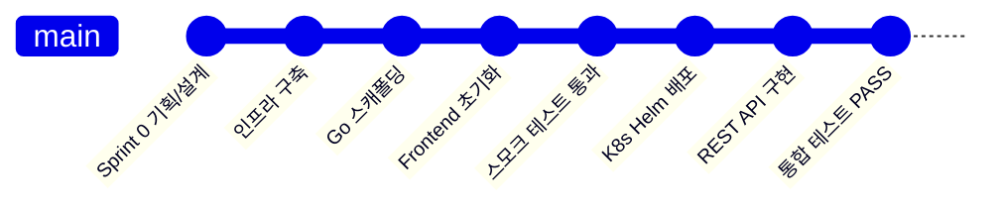
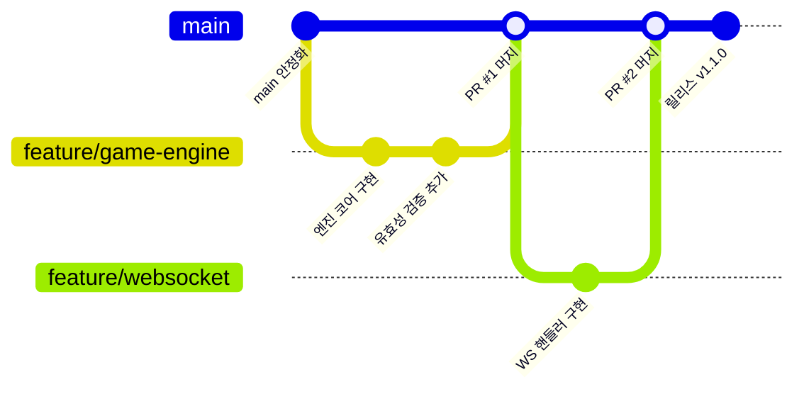
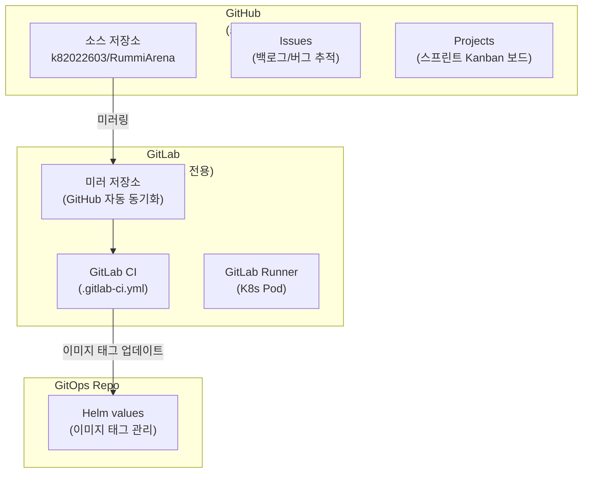
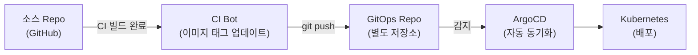
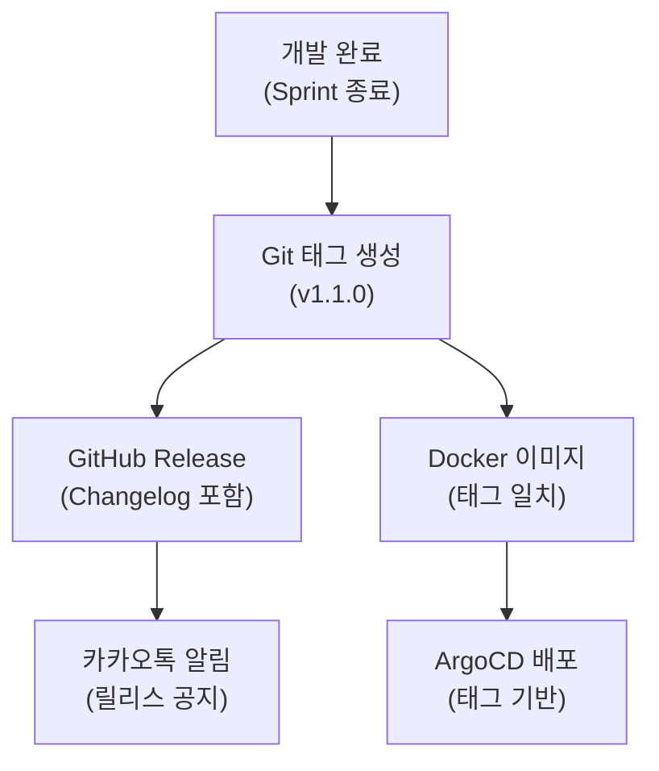

# Git 워크플로우 (Git Workflow)

> **최종 수정**: 2026-03-14
> **대상**: RummiArena 프로젝트 전체
> **소스 저장소**: [github.com/k82022603/RummiArena](https://github.com/k82022603/RummiArena)

---

## 1. 브랜치 전략

### 1.1 현재 전략: Trunk-Based (main 단일 브랜치)

1인 개발(애벌레) + Claude Code AI 어시스턴트 체제에서는 **main 단일 브랜치**로 운영한다.
Feature 브랜치를 분리하면 병합 오버헤드만 증가하고 실익이 없으므로, 모든 커밋을 main에 직접 푸시한다.



**현재 전략의 근거**:

| 항목 | 설명 |
|------|------|
| 개발 인원 | 1인 (애벌레) + AI 어시스턴트 |
| 충돌 가능성 | 없음 (단일 작업자) |
| 리뷰 프로세스 | 자체 검증 + AI 코드 리뷰 |
| 배포 주기 | 커밋 단위 (ArgoCD 자동 동기화) |

### 1.2 Phase 2+ 진화 계획: Feature 브랜치 도입

협업자가 추가되거나 CI 파이프라인이 본격 가동(Sprint 2)되면, feature 브랜치를 도입한다.



**브랜치 네이밍 규칙** (Phase 2+ 적용):

| 접두사 | 용도 | 예시 |
|--------|------|------|
| `feature/` | 새 기능 개발 | `feature/game-engine-core` |
| `fix/` | 버그 수정 | `fix/websocket-reconnect` |
| `docs/` | 문서 작업 | `docs/api-specification` |
| `refactor/` | 리팩토링 | `refactor/tile-encoding` |
| `infra/` | 인프라/DevOps 변경 | `infra/gitlab-ci-pipeline` |
| `hotfix/` | 긴급 수정 | `hotfix/auth-token-expiry` |

**도입 기준** (하나라도 해당 시 전환):
- 협업 개발자 1인 이상 합류
- GitLab CI 파이프라인 운영 시작 (Sprint 2)
- QA 환경과 운영 환경 분리 필요 시

---

## 2. 커밋 메시지 규칙

### 2.1 기본 원칙

| 항목 | 규칙 |
|------|------|
| 언어 | **한글** |
| 길이 | 제목 70자 이내 권장, 본문 제한 없음 |
| 형식 | 1줄 제목 (무엇을 했는지 요약) |
| 시제 | 과거형 또는 명사형 종결 |

### 2.2 커밋 메시지 구조

```
{범위} {작업 요약}

(선택) 상세 설명

Co-Authored-By: Claude {Model} <noreply@anthropic.com>
```

**범위 표기**: 커밋 제목에 작업 대상 서비스나 영역을 자연스럽게 포함한다.
별도의 `feat:`, `fix:` 접두사 형식(Conventional Commits)은 사용하지 않는다.

### 2.3 실제 프로젝트 커밋 예시

아래는 RummiArena 프로젝트의 실제 커밋 히스토리에서 발췌한 예시이다.

**인프라/환경 구축**:
```
K8s/Traefik/ArgoCD 인프라 구축 + 보안 이슈 해결
K8s Helm chart 5개 서비스 배포 + 통합 테스트 계획 + 세션 마감
```

**코드 구현**:
```
game-server Go 프로젝트 스캐폴딩 (S1-01): 22개 파일, go build/vet 통과
game-server 핵심 구현: 12개 REST API + DB/Redis 연동 + 보안 강화
Frontend/AI Adapter/Admin 프로젝트 초기화 + 도구 설치 완료
```

**테스트/품질**:
```
QA 스모크 테스트 전 항목 통과 (16/16) + Frontend OAuth 수정
QA 통합 테스트 31/31 전원 PASS -- game-server REST API + ai-adapter + K8s 정합성
```

**문서/기획**:
```
아키텍처 &sect;9.5 CI/CD 파이프라인에 SonarQube/Trivy/ZAP 보안 게이트 추가
기획/설계 문서 종합 검토 및 보완 (10개 문서, 17개 이슈 해소)
GitHub README.md 추가: 프로젝트 소개, 아키텍처, 기술 스택, Quick Start
```

**로그/마감**:
```
데일리 마감 (2026-03-13)
세션 #01 마감 (2026-03-12, 09:30~10:51)
PM 마감 스탠드업미팅 + 데일리 로그 현행화 (Sprint 1 Day 1 마감)
```

### 2.4 좋은 커밋 메시지 작성법

| 원칙 | 좋은 예 | 나쁜 예 |
|------|---------|---------|
| 무엇을 변경했는지 명확히 | `game-server 핵심 구현: 12개 REST API + DB/Redis 연동` | `코드 수정` |
| 정량적 결과 포함 | `QA 통합 테스트 31/31 전원 PASS` | `테스트 완료` |
| 범위 명시 | `Frontend OAuth 로그인 콜백 수정` | `버그 수정` |
| 스프린트 맥락 포함 | `(S1-01): 22개 파일, go build/vet 통과` | `스캐폴딩` |

### 2.5 Co-Authored-By 표기

Claude Code AI 어시스턴트가 참여한 커밋에는 `Co-Authored-By` 트레일러를 추가한다.
GitHub가 이 트레일러를 인식하여 기여자로 표시한다.

```
Co-Authored-By: Claude Opus 4.6 <noreply@anthropic.com>
Co-Authored-By: Claude Haiku 4.5 <noreply@anthropic.com>
```

**모델별 표기**: 실제 작업에 참여한 Claude 모델명을 기재한다.

| 모델 | 표기 |
|------|------|
| Claude Opus 4.6 | `Claude Opus 4.6 <noreply@anthropic.com>` |
| Claude Haiku 4.5 | `Claude Haiku 4.5 <noreply@anthropic.com>` |
| Claude Sonnet 4 | `Claude Sonnet 4 <noreply@anthropic.com>` |

### 2.6 커밋 단위 기준

| 기준 | 설명 |
|------|------|
| 논리적 단위 | 하나의 기능/수정/문서를 하나의 커밋으로 |
| 빌드 가능 상태 | 매 커밋이 빌드/테스트 통과하는 상태여야 함 |
| 세션 마감 | 작업 세션 종료 시 반드시 커밋 (로그 포함) |
| 혼합 금지 | 코드 변경과 문서 변경을 같은 커밋에 넣지 않음 (예외: 코드와 직접 관련된 문서) |

---

## 3. GitHub 활용

### 3.1 저장소 구조



> GitHub가 소스 관리 + ALM(백로그/이슈), GitLab이 CI 빌드를 담당하는 이중 구조이다.
> 자세한 내용은 `docs/01-planning/04-tool-chain.md` 3절 참조.

### 3.2 Issues 활용

GitHub Issues를 백로그 및 버그 추적의 단일 소스(single source of truth)로 사용한다.

**이슈 템플릿** (`.github/ISSUE_TEMPLATE/`):

| 템플릿 | 접두사 | 라벨 | 용도 |
|--------|--------|------|------|
| Feature Request | `[FEAT]` | `enhancement` | 새 기능 요청 (요구사항 ID 포함) |
| Bug Report | `[BUG]` | `bug` | 버그 리포트 (재현 절차 포함) |

**라벨 체계**:

| 라벨 | 용도 |
|------|------|
| `enhancement` | 새 기능 |
| `bug` | 버그 |
| `documentation` | 문서 작업 |
| `infrastructure` | 인프라/DevOps |
| `good first issue` | 입문자용 |

### 3.3 Projects (스프린트 보드)

GitHub Projects의 Kanban 보드로 스프린트를 관리한다.

| 컬럼 | 설명 |
|------|------|
| Backlog | 우선순위 미정 항목 |
| Sprint Backlog | 현재 스프린트 대상 |
| In Progress | 진행 중 |
| Review | 검토/테스트 대기 |
| Done | 완료 |

### 3.4 Pull Request (Phase 2+ 도입 예정)

현재 main 직접 푸시 체제이므로 PR을 사용하지 않는다.
Feature 브랜치 도입 시 다음 규칙을 적용한다.

| 항목 | 규칙 |
|------|------|
| 제목 | 70자 이내, 변경 내용 요약 |
| 본문 | Summary + Test Plan 구조 |
| 리뷰어 | 자체 검증 + Claude Code 리뷰 |
| 머지 방식 | Squash and Merge (커밋 이력 정리) |
| 브랜치 삭제 | 머지 후 자동 삭제 |

---

## 4. CI/CD 연동

### 4.1 전체 흐름

```mermaid
flowchart LR
    subgraph Source["소스 관리"]
        Dev["개발자\n(애벌레 + Claude)"] -->|"git push"| GH["GitHub\nmain 브랜치"]
    end

    subgraph CI["CI 빌드\n(Sprint 2 도입)"]
        GH -->|"미러링"| GL["GitLab\n미러 저장소"]
        GL --> Pipeline["GitLab CI\n파이프라인"]

        subgraph Stages["파이프라인 단계"]
            direction TB
            Lint["Lint\n(golangci-lint / eslint)"]
            Test["Test\n(go test / jest)"]
            Sonar["SonarQube\n(Quality Gate)"]
            Build["Docker Build\n(멀티스테이지)"]
            Scan["Trivy\n(이미지 스캔)"]
            Lint --> Test --> Sonar --> Build --> Scan
        end

        Pipeline --> Stages
    end

    subgraph Registry["이미지 저장소"]
        Scan -->|"Push"| Image["Container\nRegistry"]
    end

    subgraph CD["CD 배포"]
        Image -->|"태그 업데이트"| GitOps["GitOps Repo\n(Helm values)"]
        GitOps -->|"감지"| Argo["ArgoCD\n(자동 동기화)"]
        Argo -->|"Helm 배포"| K8s["Kubernetes\n(rummikub NS)"]
    end
```



### 4.2 GitLab CI 파이프라인 (Sprint 2 도입 예정)

GitHub를 GitLab으로 미러링하고, `.gitlab-ci.yml`로 빌드 파이프라인을 실행한다.

**Go (game-server) 파이프라인**:

| 단계 | 도구 | 실패 시 |
|------|------|---------|
| Lint | golangci-lint | 파이프라인 중단 |
| Test | go test ./... (커버리지 80%+) | 파이프라인 중단 |
| SonarQube | SonarQube Scanner (Quality Gate) | 파이프라인 중단 |
| Docker Build | golang:alpine -> scratch (멀티스테이지) | 파이프라인 중단 |
| Trivy | 이미지 CVE 스캔 (Critical/High) | 파이프라인 중단 |

**NestJS (ai-adapter) 파이프라인**:

| 단계 | 도구 | 실패 시 |
|------|------|---------|
| Lint | eslint + prettier | 파이프라인 중단 |
| Test | jest --coverage (커버리지 80%+) | 파이프라인 중단 |
| SonarQube | SonarQube Scanner (Quality Gate) | 파이프라인 중단 |
| Docker Build | node:20-alpine (싱글스테이지) | 파이프라인 중단 |
| Trivy | 이미지 CVE 스캔 (Critical/High) | 파이프라인 중단 |

### 4.3 ArgoCD 자동 배포

ArgoCD가 GitOps 저장소(현재는 소스 repo의 `helm/` 디렉토리)를 감시하여 변경 감지 시 자동 배포한다.

**현재 ArgoCD 설정** (`argocd/application.yaml`):

| 항목 | 값 |
|------|-----|
| 소스 | `https://github.com/k82022603/RummiArena.git` |
| 경로 | `helm` (Umbrella Chart) |
| 대상 브랜치 | `main` |
| 대상 네임스페이스 | `rummikub` |
| 동기화 정책 | 자동 (prune + selfHeal) |
| Values 파일 | `environments/dev-values.yaml` |

**GitOps 저장소 분리 계획** (Phase 2+):



현재는 소스 repo와 GitOps repo가 동일하지만, CI 파이프라인 도입 시 별도 GitOps 저장소로 분리한다.
이를 통해 소스 변경과 배포 변경의 이력을 독립적으로 관리한다.

---

## 5. 릴리스 전략

### 5.1 태그 네이밍

```
v{Phase}.{Sprint}.{Patch}
```

| 구성 요소 | 설명 | 예시 |
|-----------|------|------|
| Phase | 프로젝트 Phase 번호 (1~6) | `v1` = Phase 1 |
| Sprint | 해당 Phase 내 Sprint 번호 | `v1.1` = Phase 1, Sprint 1 |
| Patch | 핫픽스/패치 번호 (0부터) | `v1.1.0` = 첫 릴리스 |

**예시**:

| 태그 | 의미 |
|------|------|
| `v1.0.0` | Phase 1 Sprint 0 -- 인프라 구축 완료 |
| `v1.1.0` | Phase 1 Sprint 1 -- 게임 엔진 코어 완료 |
| `v1.1.1` | Phase 1 Sprint 1 핫픽스 |
| `v2.1.0` | Phase 2 Sprint 1 -- MVP 기능 완료 |

### 5.2 릴리스 흐름



### 5.3 Changelog 관리

각 릴리스의 GitHub Release에 Changelog를 작성한다.

**Changelog 구조**:

```markdown
## v1.1.0 (2026-04-11)

### 추가
- 게임 엔진 코어: 타일 모델, 그룹/런 유효성 검증, 조커 처리
- Room CRUD REST API (POST/GET/DELETE)
- PostgreSQL 마이그레이션 + Redis 연동

### 변경
- 없음

### 수정
- Frontend OAuth 콜백 리다이렉트 오류 수정

### 인프라
- game-server Dockerfile 멀티스테이지 빌드 추가
```

**Changelog 카테고리**:

| 카테고리 | 설명 |
|----------|------|
| 추가 | 새로운 기능 |
| 변경 | 기존 기능 변경 |
| 수정 | 버그 수정 |
| 삭제 | 제거된 기능 |
| 인프라 | DevOps/인프라 변경 |
| 문서 | 문서 추가/수정 |

### 5.4 릴리스 체크리스트

릴리스 전 다음 항목을 확인한다.

- [ ] 모든 테스트 통과 (단위 + 통합)
- [ ] SonarQube Quality Gate 통과
- [ ] Trivy 이미지 스캔 통과 (Critical/High 없음)
- [ ] API 문서 현행화
- [ ] Changelog 작성
- [ ] Git 태그 생성 (`git tag -a v1.1.0 -m "Phase 1 Sprint 1 릴리스"`)
- [ ] GitHub Release 게시
- [ ] ArgoCD 배포 확인
- [ ] 카카오톡 릴리스 알림 발송

---

## 6. Git 운영 규칙

### 6.1 .gitignore 관리

민감 정보와 불필요한 파일을 반드시 추적에서 제외한다.

| 제외 대상 | 예시 |
|-----------|------|
| 환경변수 / 시크릿 | `.env`, `*.secret`, `credentials.json` |
| 빌드 산출물 | `node_modules/`, `dist/`, `bin/` |
| IDE 설정 | `.vscode/settings.json`, `.idea/` |
| OS 파일 | `.DS_Store`, `Thumbs.db` |
| Docker 볼륨 | `data/`, `postgres-data/` |
| MCP 토큰 | `.mcp.json` (토큰 포함 시) |

### 6.2 시크릿 관리 원칙

Git에 시크릿을 절대 커밋하지 않는다. 자세한 내용은 `docs/03-development/02-secret-management.md`를 참조한다.

| 항목 | 관리 방식 |
|------|-----------|
| API 키 (OpenAI, Claude 등) | K8s Secret + Helm values |
| DB 비밀번호 | K8s Secret |
| OAuth Client Secret | K8s Secret |
| 환경변수 | ConfigMap (비밀 아닌 것) / Secret (비밀인 것) |

### 6.3 대용량 파일 정책

| 항목 | 규칙 |
|------|------|
| 바이너리 파일 | Git에 커밋 금지 (이미지는 Container Registry 사용) |
| PPT/문서 | `docs/` 하위에 마크다운으로 관리, PPT는 예외 허용 |
| 데이터 파일 | `.gitignore`로 제외, 필요 시 별도 저장소 |

---

## 관련 문서

| 문서 | 경로 |
|------|------|
| 코딩 컨벤션 | `docs/03-development/06-coding-conventions.md` |
| 시크릿 관리 | `docs/03-development/02-secret-management.md` |
| 도구 체인 | `docs/01-planning/04-tool-chain.md` |
| 아키텍처 (CI/CD 파이프라인) | `docs/02-design/01-architecture.md` 9.5절 |
| 게이트웨이 구축계획 | `docs/05-deployment/02-gateway-architecture.md` |
| Sprint 1 백로그 | `docs/01-planning/06-sprint1-backlog.md` |
