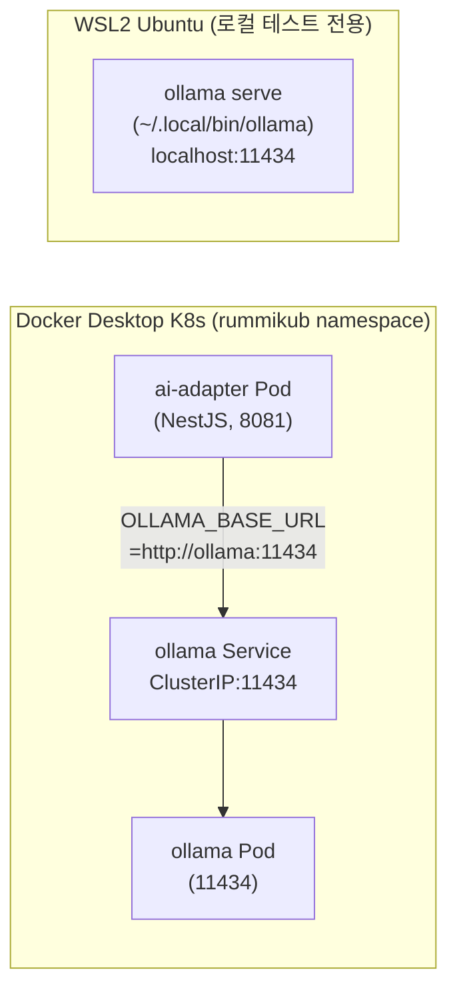

# Ollama 설치 및 설정 가이드

> 최종 수정: 2026-03-23
> 대상: AI Adapter 개발 환경 구성
> 환경: Windows 11 + WSL2 (Ubuntu), LG Gram i7-1360P, RAM 16GB

---

## 1. 개요

### 운용 구조 (2026-03-23 현재)



- **운영 환경**: Ollama는 K8s Pod로 실행 (`ollama` ClusterIP 서비스)
- **ai-adapter**: `OLLAMA_BASE_URL=http://ollama:11434` (K8s DNS)
- **로컬 테스트**: WSL2에 ollama 바이너리 설치, `OLLAMA_HOST=http://localhost:11434`

---

## 2. K8s Ollama 배포 (운영 표준)

### 2.1 Helm Chart 설치

```bash
cd /mnt/d/Users/KTDS/Documents/06.과제/RummiArena
helm install ollama helm/charts/ollama -n rummikub
```

Chart 위치: `helm/charts/ollama/`

### 2.2 초기 모델 Pull

initContainer가 pod 시작 시 `gemma3:1b`를 자동으로 pull한다.
모델은 PVC(`ollama-models`, hostpath 2Gi)에 저장되어 pod 재시작 후에도 유지된다.

**pod 상태 확인:**

```bash
kubectl get pods -n rummikub | grep ollama
# Init:0/1 → Running 으로 변경될 때까지 대기 (최초 pull: ~3분)
```

**수동 pull (재pull 필요 시):**

```bash
kubectl exec -n rummikub deploy/ollama -- ollama pull gemma3:1b
```

### 2.3 K8s 서비스 접근 URL

| 환경 | URL |
|------|-----|
| K8s 내부 (ai-adapter) | `http://ollama:11434` |
| WSL2에서 테스트 | `http://localhost:30434` (NodePort 미설정 시 port-forward 사용) |

**WSL2에서 port-forward로 K8s Ollama 접근:**

```bash
kubectl port-forward -n rummikub svc/ollama 30434:11434 &
curl http://localhost:30434/api/tags
```

### 2.4 ai-adapter ConfigMap 설정

```bash
kubectl patch configmap ai-adapter-config -n rummikub \
  --type merge \
  -p '{"data":{"OLLAMA_BASE_URL":"http://ollama:11434"}}'

kubectl rollout restart deployment/ai-adapter -n rummikub
```

---

## 3. WSL2 로컬 Ollama (개발/테스트용)

### 3.1 설치 경로

```
~/.local/bin/ollama   # 실행 바이너리 (v0.18.2)
~/.ollama/            # 모델 저장 디렉토리
```

### 3.2 서버 시작

```bash
# OLLAMA_HOST 환경변수가 172.21.32.1로 설정되어 있으므로 반드시 override
OLLAMA_HOST=0.0.0.0 ~/.local/bin/ollama serve &

# 모델 목록 확인 (OLLAMA_HOST override 필수)
OLLAMA_HOST=http://localhost:11434 ~/.local/bin/ollama list
```

### 3.3 gemma3:1b Pull

```bash
OLLAMA_HOST=http://localhost:11434 ~/.local/bin/ollama pull gemma3:1b
```

### 3.4 ~/.bashrc 주의사항

`~/.bashrc`에 `OLLAMA_HOST=172.21.32.1:11434`가 설정되어 있다.
이는 구 Windows Ollama 접근용 설정으로, **WSL2 로컬 서버 사용 시 반드시 override**해야 한다.

```bash
# 임시 override (세션 단위)
export OLLAMA_HOST=http://localhost:11434

# 영구 변경 (Windows Ollama 복구 불필요 시)
sed -i 's|OLLAMA_HOST=172.21.32.1:11434|OLLAMA_HOST=http://localhost:11434|' ~/.bashrc
source ~/.bashrc
```

---

## 4. 모델 정보

| 모델 | 크기 | 응답 속도 | 적합 용도 | 비고 |
|------|------|----------|---------|------|
| `gemma3:1b` | 815MB | ~4s (WSL2) | beginner AI | **현재 운영 모델** |
| `gemma3:4b` | 3.3GB | 300s (CPU) | intermediate | 현재 하드웨어 부적합 |
| `llama3.2:3b` | 2.0GB | ~30s | beginner/intermediate | 여유 메모리 시 |

**운용 지침:**
- RAM 제약(16GB, WSL2 10GB)으로 gemma3:1b 이상 모델은 교대 실행 전략 필요
- K8s limits: `cpu=2000m, memory=2Gi`

---

## 5. AI Adapter 연동 설정

### K8s 환경 (표준)

```yaml
# helm/charts/ai-adapter/values.yaml
OLLAMA_BASE_URL: "http://ollama:11434"
OLLAMA_DEFAULT_MODEL: "gemma3:1b"
```

### 로컬 개발 환경

```dotenv
# src/ai-adapter/.env
OLLAMA_BASE_URL=http://localhost:11434
OLLAMA_DEFAULT_MODEL=gemma3:1b
```

---

## 6. 연동 테스트

### 6.1 K8s Ollama 헬스체크

```bash
# K8s Pod 직접 확인
kubectl exec -n rummikub deploy/ollama -- ollama list

# port-forward로 외부 접근
kubectl port-forward -n rummikub svc/ollama 30434:11434 &
curl http://localhost:30434/api/tags
```

### 6.2 AI Adapter를 통한 추론 테스트

```bash
curl -X POST http://localhost:30081/move \
  -H "Content-Type: application/json" \
  -d '{
    "gameId": "test-001",
    "playerId": "ai-test-1",
    "model": "ollama",
    "persona": "rookie",
    "difficulty": "beginner",
    "psychologyLevel": 0,
    "gameState": {
      "tableGroups": [],
      "myTiles": ["R3a","R4a","R5a","B7a","K7b","Y7a"],
      "opponents": [{"playerId": "p1","remainingTiles": 8}],
      "drawPileCount": 80,
      "turnNumber": 1,
      "initialMeldDone": false
    }
  }'
```

---

## 7. 트러블슈팅

### 7.1 K8s Ollama Pod가 Init 상태에서 멈춤

**원인:** 이미지 pull 중 또는 모델 다운로드 중

```bash
kubectl describe pod -n rummikub -l app=ollama | grep -A10 Events
kubectl logs -n rummikub -l app=ollama -c pull-model
```

### 7.2 ai-adapter가 Ollama 연결 실패

**증상:** `"ollama": false` in `/health/adapters`

```bash
# ConfigMap 확인
kubectl get configmap ai-adapter-config -n rummikub -o yaml | grep OLLAMA

# ClusterIP 서비스 확인
kubectl get svc ollama -n rummikub

# ai-adapter pod에서 ollama 서비스 접근 테스트
kubectl exec -n rummikub deploy/ai-adapter -- wget -qO- http://ollama:11434/api/tags
```

### 7.3 ResourceQuota 초과로 Pod 생성 실패

```bash
kubectl describe quota -n rummikub
# limits.cpu=4, limits.memory=4Gi 초과 시 다른 서비스 리소스 축소 필요
```

### 7.4 WSL2에서 ollama list 오류 (172.21.32.1 연결 실패)

`~/.bashrc`의 `OLLAMA_HOST=172.21.32.1:11434` 때문. Override 후 실행:

```bash
OLLAMA_HOST=http://localhost:11434 ollama list
```

---

## 8. 설치 이력

| 날짜 | 변경 내용 |
|------|---------|
| 2026-03-15 | Windows Ollama 설치, gemma3:4b pull, WSL2 연동 설정 |
| 2026-03-23 | gemma3:4b → gemma3:1b 교체 (300s → 4s, 70배 개선) |
| 2026-03-23 | Windows Ollama 삭제 → WSL2 직접 설치 (v0.18.2) + K8s Pod 배포 |
