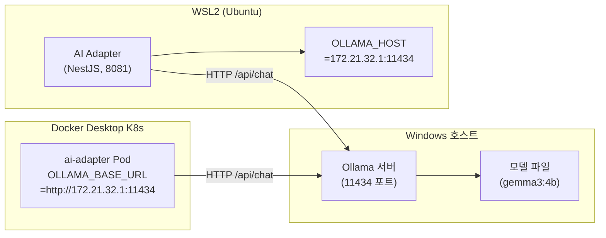

# Ollama 설치 및 WSL2 연동 가이드

> 최종 수정: 2026-03-15
> 대상: AI Adapter 개발 환경 구성
> 환경: Windows 11 + WSL2 (Ubuntu), LG Gram i7-1360P, RAM 16GB

---

## 1. 개요

### 왜 Windows에 설치하는가

Ollama는 WSL2 내부가 아닌 **Windows 호스트**에 설치한다. 이유는 두 가지다.

**GPU 직접 접근**
WSL2는 DirectML 경유 CUDA/GPU 접근을 지원하지만, Ollama for Windows는 NVIDIA/AMD GPU를 네이티브로 인식한다. GPU가 있는 경우 Windows 설치가 추론 속도를 극대화한다.

**WSL2 메모리 절약**
이 프로젝트의 하드웨어 제약(RAM 16GB, WSL2에 10GB 할당)에서 모델 추론을 WSL2 내에서 실행하면 NestJS, Redis, PostgreSQL 등과 메모리를 경쟁하게 된다. Windows 프로세스로 분리하면 WSL2 메모리 압박을 줄일 수 있다.

### 연동 구조



WSL2에서 Windows 호스트로의 통신은 vEthernet(WSL) 게이트웨이 IP를 통해 이루어진다. 이 IP는 WSL2 재시작 시 변경될 수 있으므로 확인 방법을 별도로 기술한다.

---

## 2. Ollama Windows 설치

### 설치 절차

1. 공식 사이트(ollama.com)에서 Windows용 설치 파일을 내려받는다.
2. 설치 파일을 실행하면 자동으로 설치되고 시스템 트레이에 아이콘이 나타난다.
3. 설치 완료 후 PowerShell에서 정상 설치 여부를 확인한다.

```powershell
ollama --version
```

### WSL2 접근 허용 설정

기본 상태에서 Ollama는 `127.0.0.1:11434`에만 바인딩되므로, WSL2에서 접근하려면 모든 인터페이스에 바인딩하도록 환경변수를 설정해야 한다.

**PowerShell (관리자 권한)에서 영구 설정:**

```powershell
[System.Environment]::SetEnvironmentVariable("OLLAMA_HOST", "0.0.0.0:11434", "Machine")
```

설정 후 Ollama를 재시작한다. 시스템 트레이 아이콘 우클릭 → Quit 후 다시 실행하거나, 서비스로 등록된 경우 다음 명령을 사용한다.

```powershell
Stop-Process -Name "ollama" -Force
ollama serve
```

### Windows 방화벽 인바운드 규칙 추가

WSL2 → Windows 통신은 vEthernet(WSL) 인터페이스를 거치므로 방화벽 규칙이 필요하다.

```powershell
New-NetFirewallRule `
  -DisplayName "Ollama WSL2 Access" `
  -Direction Inbound `
  -Protocol TCP `
  -LocalPort 11434 `
  -Action Allow
```

---

## 3. 모델 설치

### gemma3:4b 설치 (현재 프로젝트 기본 모델)

PowerShell에서 실행한다.

```powershell
ollama pull gemma3:4b
```

gemma3:4b는 Q4_K_M 양자화 기준 약 3.3GB를 차지하며 이 하드웨어에서 안정적으로 동작한다.

### 설치 확인

```powershell
ollama list
```

출력 예시:

```
NAME            ID              SIZE    MODIFIED
gemma3:4b       a2af6cc3eb7f    3.3 GB  2 hours ago
```

---

## 4. WSL2에서 접근 설정

### Windows 호스트 IP 확인

WSL2 인스턴스 내에서 Windows 호스트 IP를 확인하는 방법은 세 가지다.

```bash
# 방법 1: /etc/resolv.conf의 nameserver 항목
cat /etc/resolv.conf | grep nameserver

# 방법 2: ip route의 default 게이트웨이
ip route show | grep default

# 방법 3: 환경변수 (WSL2 2.0 이상)
echo $WSL_HOST_IP
```

이 프로젝트에서 확인된 IP: `172.21.32.1`

> WSL2 재시작 시 IP가 변경될 수 있다. 변경된 경우 아래 환경변수를 갱신해야 한다.

### ~/.bashrc 환경변수 설정

```bash
echo 'export OLLAMA_HOST="172.21.32.1:11434"' >> ~/.bashrc
source ~/.bashrc
```

설정 후 CLI로 직접 Ollama를 호출할 수 있다.

```bash
# WSL2에서 Ollama CLI로 모델 목록 확인
ollama list

# 직접 추론 테스트
ollama run gemma3:4b "안녕하세요"
```

---

## 5. AI Adapter 연동 설정

### .env 설정

`/mnt/d/.../RummiArena/src/ai-adapter/.env`에서 Ollama 관련 항목을 다음과 같이 설정한다.

```dotenv
# Ollama (Windows 호스트 접근)
OLLAMA_BASE_URL=http://172.21.32.1:11434
OLLAMA_DEFAULT_MODEL=gemma3:4b
```

`.env.example`의 기본값(`http://localhost:11434`, `llama3.2`)과 다르므로 주의한다.

### K8s 배포 시 설정

Helm values 또는 ConfigMap에 동일 값을 설정한다.

```yaml
# helm/charts/ai-adapter/values.yaml 또는 K8s ConfigMap
env:
  OLLAMA_BASE_URL: "http://172.21.32.1:11434"
  OLLAMA_DEFAULT_MODEL: "gemma3:4b"
```

K8s Pod는 Docker Desktop 내부 네트워크에서 실행되지만, `172.21.32.1`은 호스트 네트워크 게이트웨이이므로 Pod에서도 동일하게 접근 가능하다.

---

## 6. 연동 테스트

### 6.1 Ollama API 직접 테스트 (WSL2에서)

```bash
# 헬스체크: 모델 목록 조회
curl http://172.21.32.1:11434/api/tags

# 추론 테스트: 단건 완료 모드 (stream: false)
curl -X POST http://172.21.32.1:11434/api/chat \
  -H "Content-Type: application/json" \
  -d '{
    "model": "gemma3:4b",
    "messages": [
      {"role": "user", "content": "Hello"}
    ],
    "stream": false
  }'
```

정상 응답 예시:

```json
{
  "model": "gemma3:4b",
  "message": {
    "role": "assistant",
    "content": "Hello! How can I help you today?"
  },
  "done": true,
  "prompt_eval_count": 12,
  "eval_count": 9
}
```

### 6.2 AI Adapter 헬스체크

```bash
# AI Adapter 서비스 전체 상태
curl http://localhost:8081/health

# 어댑터별 연결 상태 (Ollama 포함)
curl http://localhost:8081/health/adapters
```

`health/adapters` 응답에서 `ollama` 항목이 `true`이면 연동 성공이다.

### 6.3 AI Adapter를 통한 Ollama 추론 테스트

```bash
curl -X POST http://localhost:8081/move \
  -H "Content-Type: application/json" \
  -d '{
    "gameId": "test-ollama-001",
    "playerId": "ai-ollama-1",
    "model": "ollama",
    "persona": "rookie",
    "difficulty": "beginner",
    "psychologyLevel": 0,
    "gameState": {
      "tableGroups": [],
      "myTiles": ["R3a", "R4a", "R5a", "B7a", "K7b", "Y7a"],
      "opponents": [{"playerId": "p1", "remainingTiles": 8}],
      "drawPileCount": 80,
      "turnNumber": 1,
      "initialMeldDone": false
    }
  }'
```

---

## 7. 권장 모델 목록

이 하드웨어(i7-1360P, 16GB RAM, WSL2 10GB 할당) 기준으로 적합한 모델 목록이다.

| 모델 | 크기 | 속도 | 품질 | 난이도 적합성 | 비고 |
|------|------|------|------|-------------|------|
| `gemma3:4b` | ~3.3GB | 빠름 | 중간 | beginner / intermediate | 현재 설치됨, 권장 기본값 |
| `llama3.2:3b` | ~2.0GB | 매우 빠름 | 낮음 | beginner | 경량, 메모리 여유 시 |
| `llama3.2:1b` | ~1.3GB | 최고속 | 낮음 | beginner 전용 | 초보 AI 시뮬레이션 |
| `phi4-mini` | ~2.5GB | 빠름 | 중간 | beginner / intermediate | 코드/논리 특화 |
| `deepseek-r1:7b` | ~4.7GB | 느림 | 높음 | intermediate / expert | 추론 강화, RAM 여유 필요 |
| `llama3.1:8b` | ~4.9GB | 느림 | 높음 | expert | expert용, 동시 서비스 불가 |

**운용 지침:**
- 게임 서버, Redis, PostgreSQL이 동시 실행되는 상황에서는 `gemma3:4b` 또는 그 이하 모델을 권장한다.
- 4B 초과 모델은 교대 실행 전략(다른 서비스 중지 후 실행)을 적용한다.
- `OLLAMA_DEFAULT_MODEL` 환경변수를 변경하면 AI Adapter 재시작 없이 다른 모델로 전환된다.

---

## 8. 트러블슈팅

### 8.1 WSL2에서 Ollama에 연결 안 됨

**증상:** `curl http://172.21.32.1:11434/api/tags` 타임아웃 또는 Connection refused

**원인 및 해결:**

1. **Ollama가 `0.0.0.0`에 바인딩되지 않음**
   PowerShell에서 확인한다.
   ```powershell
   netstat -an | findstr 11434
   ```
   `0.0.0.0:11434`가 없으면 `OLLAMA_HOST` 환경변수를 재설정하고 Ollama를 재시작한다.

2. **Windows 방화벽 차단**
   방화벽 인바운드 규칙이 없는 경우 2절의 명령을 다시 실행한다.

3. **WSL2 IP 변경**
   현재 IP를 재확인한다.
   ```bash
   ip route show | grep default | awk '{print $3}'
   ```
   변경된 IP로 `~/.bashrc`와 `.env`를 갱신하고 `source ~/.bashrc`를 실행한다.

### 8.2 모델 응답이 느림

**증상:** 추론에 30초 이상 소요, AI Adapter 타임아웃 발생

**해결:**
- 더 작은 모델로 교체한다(`OLLAMA_DEFAULT_MODEL=llama3.2:3b`).
- 다른 서비스를 일시 중지하여 메모리를 확보한다.
- AI Adapter의 타임아웃을 늘린다(`LLM_TIMEOUT_MS=60000`).

```bash
# 현재 Ollama가 사용 중인 메모리 확인 (PowerShell)
Get-Process ollama | Select-Object WorkingSet64
```

### 8.3 JSON 파싱 실패 (isFallbackDraw: true 반환)

**증상:** AI Adapter 응답에 `"isFallbackDraw": true`, `action: "draw"`

**원인:** Ollama의 `format: "json"` 옵션에도 불구하고 모델이 불완전한 JSON을 반환

**해결:**
- `gemma3:4b` 이상의 모델을 사용한다. `1b` 모델은 JSON 구조화 능력이 낮다.
- AI Adapter의 재시도 횟수를 늘린다(`LLM_MAX_RETRIES=5`).
- 장기적으로 해결되지 않으면 모델을 교체한다.

### 8.4 `ollama list`가 빈 목록 반환 (WSL2에서)

**증상:** `OLLAMA_HOST` 설정 후 `ollama list`가 빈 배열 또는 에러 반환

**원인:** Windows에 설치된 Ollama와 WSL2의 `ollama` CLI 버전이 다름, 또는 CLI가 없음

**해결:**
- WSL2에서는 curl로 직접 API를 호출하거나, Windows PowerShell에서 `ollama list`를 실행한다.
- WSL2에 별도로 Ollama CLI만 설치할 필요는 없다. API 엔드포인트 직접 접근으로 충분하다.

### 8.5 K8s Pod에서 Ollama 연결 안 됨

**증상:** K8s ai-adapter Pod의 `/health/adapters`에서 `ollama: false`

**원인:** Pod 내부 네트워크에서 `172.21.32.1`에 도달 불가

**해결:**
Docker Desktop K8s는 호스트 네트워크를 공유하므로 `172.21.32.1`은 일반적으로 접근 가능하다. 접근이 안 되면 다음을 확인한다.

```bash
# Pod 내에서 연결 확인
kubectl exec -n rummikub <ai-adapter-pod> -- curl http://172.21.32.1:11434/api/tags
```

연결이 안 되면 Windows 방화벽 규칙을 재확인하고, Docker Desktop 네트워크 설정에서 호스트 네트워킹 옵션을 활성화한다.
