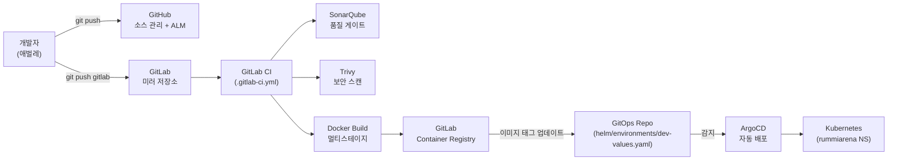
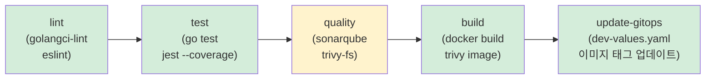
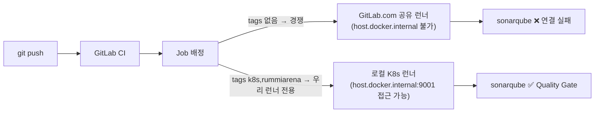
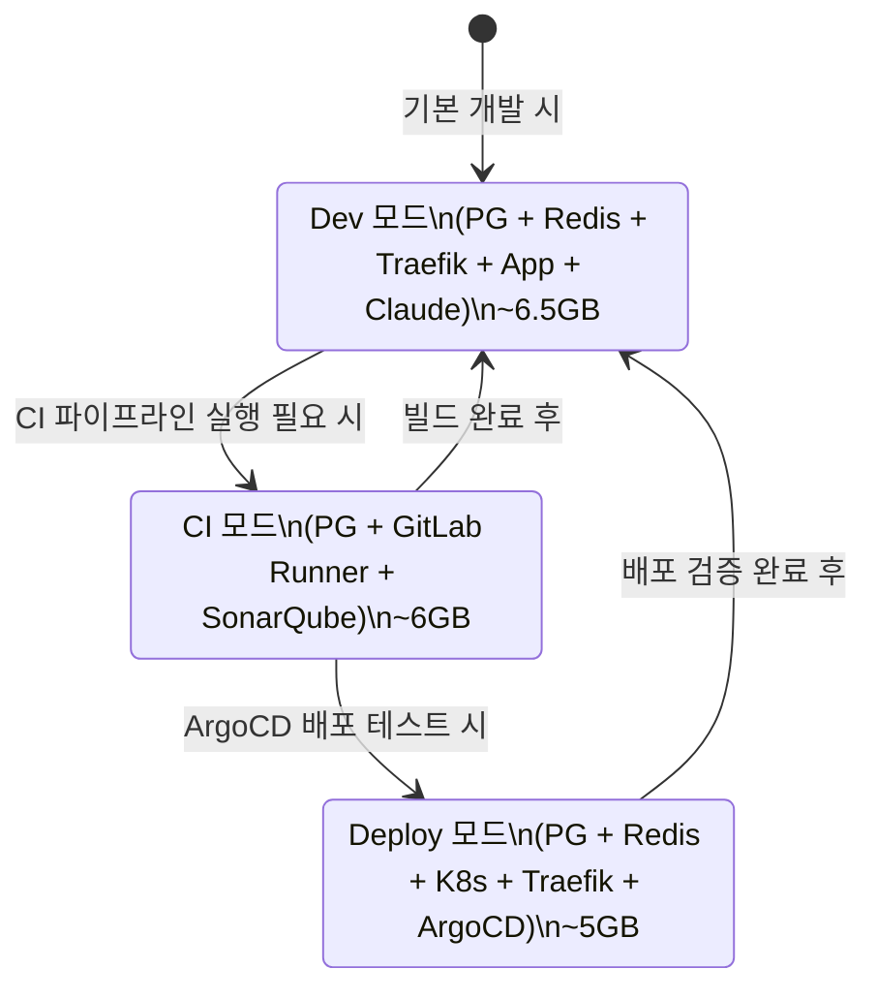

# GitLab CI/CD 환경 설정 가이드

> 최종 수정: 2026-03-16
> 대상: Sprint 1 CI 파이프라인 운영 중 (lint/test GREEN 달성, quality 단계 진행 중)
> 환경: WSL2 Ubuntu, Docker Desktop Kubernetes (docker-desktop context)

---

## 개요

RummiArena CI 파이프라인은 **GitHub(소스 관리) + GitLab(CI 빌드)** 이중 구조를 사용한다.



**핵심 설계 원칙**:
- GitHub가 단일 소스 진실(SSoT): 이슈/백로그/소스 코드
- GitLab은 CI 빌드 전용: SaaS GitLab.com 사용 (자체 호스팅 불필요)
- GitLab Runner는 K8s Executor 방식으로 Docker Desktop K8s 위에서 실행
- 모든 토큰/시크릿은 GitLab CI Variables 또는 K8s Secret으로 관리, Git 커밋 금지

---

## 1. GitLab.com 계정 및 프로젝트 생성

### 1.1 GitLab.com 계정 생성

1. https://gitlab.com/users/sign_up 접속
2. 회원 가입 완료 후 이메일 인증
3. 사용자명(username) 확인: 이후 remote URL에 사용됨

### 1.2 프로젝트 생성 (웹 UI 방식)

1. GitLab.com 로그인 후 상단 "+" 버튼 → "New project" 클릭
2. "Create blank project" 선택
3. 설정값:
   - Project name: `RummiArena`
   - Project slug: `rummiarena` (자동 생성됨)
   - Visibility Level: **Private** (소스 코드 보호)
   - "Initialize repository with a README": 체크 해제 (기존 코드 push 예정)
4. "Create project" 클릭

### 1.3 프로젝트 생성 (glab CLI 방식)

```bash
# 먼저 glab 설치 및 인증 완료 필요 (아래 2절 참조)
./scripts/gitlab-setup.sh create-project
```

---

## 2. glab CLI 설치 및 인증

glab은 GitLab 공식 CLI 도구로 프로젝트 생성, Variables 등록, 파이프라인 모니터링을 터미널에서 수행할 수 있다.

### 2.1 glab 설치

```bash
# scripts/gitlab-setup.sh를 통한 자동 설치
./scripts/gitlab-setup.sh install-glab

# 설치 경로: ~/.local/bin/glab (sudo 불필요)
# PATH 설정 확인 (없으면 ~/.bashrc에 추가)
echo 'export PATH="$HOME/.local/bin:$PATH"' >> ~/.bashrc
source ~/.bashrc

# 설치 확인
glab --version
```

수동 설치가 필요한 경우:

```bash
# 최신 버전 확인
GLAB_VER=$(curl -sf https://api.github.com/repos/gitlab-org/cli/releases/latest \
  | python3 -c "import sys,json; print(json.load(sys.stdin)['tag_name'])" )

# 다운로드 및 설치
curl -fL "https://gitlab.com/gitlab-org/cli/-/releases/${GLAB_VER}/downloads/glab_${GLAB_VER#v}_linux_amd64.tar.gz" \
  -o /tmp/glab.tar.gz
mkdir -p /tmp/glab_extract && tar -xzf /tmp/glab.tar.gz -C /tmp/glab_extract
cp /tmp/glab_extract/bin/glab ~/.local/bin/glab
chmod +x ~/.local/bin/glab
glab --version
```

### 2.2 GitLab 인증

```bash
./scripts/gitlab-setup.sh auth
# 또는
glab auth login --hostname gitlab.com
```

인증 방식 선택 프롬프트에서 **Personal Access Token** 을 선택하는 것을 권장한다.

**PAT 발급 절차**:
1. GitLab.com → 우측 상단 아바타 → "Edit Profile"
2. 좌측 메뉴 "Access Tokens" 클릭
3. "Add new token" 클릭
4. Token name: `glab-cli`
5. Expiration date: 적절한 만료일 설정 (6개월 권장)
6. Scopes 선택:
   - `api` — 프로젝트 API 전체 접근
   - `read_user` — 사용자 정보 조회
   - `write_repository` — 코드 push
7. "Create personal access token" 클릭
8. **생성된 토큰을 즉시 복사** (페이지 새로고침 시 재확인 불가)

```bash
# 인증 상태 확인
glab auth status
```

---

## 3. 소스 코드 GitLab remote 추가

### 3.1 현재 remote 구성 확인

```bash
cd /mnt/d/Users/KTDS/Documents/06.과제/RummiArena
git remote -v
# origin  https://github.com/k82022603/RummiArena.git (fetch)
# origin  https://github.com/k82022603/RummiArena.git (push)
```

### 3.2 GitLab remote 추가

```bash
# GitLab remote 추가 (YOUR_USERNAME을 실제 GitLab 사용자명으로 교체)
git remote add gitlab https://gitlab.com/YOUR_USERNAME/RummiArena.git

# 확인
git remote -v
```

### 3.3 GitHub + GitLab 동시 push 설정

매 push마다 두 번 명령을 실행하는 대신 origin에 push URL을 추가하는 방식을 사용할 수 있다.

```bash
# origin에 GitLab push URL 추가 (GitHub URL은 그대로 유지)
git remote set-url --add --push origin https://github.com/k82022603/RummiArena.git
git remote set-url --add --push origin https://gitlab.com/YOUR_USERNAME/RummiArena.git

# 확인 (push URL이 2개여야 함)
git remote -v
# origin  https://github.com/k82022603/RummiArena.git (fetch)
# origin  https://github.com/k82022603/RummiArena.git (push)
# origin  https://gitlab.com/YOUR_USERNAME/RummiArena.git (push)

# 테스트 push (두 remote에 동시 push)
git push origin main
```

> 동시 push 구성 이후 `git push` 한 번으로 GitHub와 GitLab에 모두 push되며,
> GitLab에서 push를 감지해 `.gitlab-ci.yml` 파이프라인이 자동 트리거된다.

### 3.4 개별 push 방식 (선택)

동시 push 대신 CI가 필요할 때만 GitLab에 push하는 방식이다.

```bash
git push origin main   # GitHub (소스 관리)
git push gitlab main   # GitLab (CI 트리거)
```

---

## 4. Runner 토큰 발급

GitLab Runner를 등록하려면 **Runner 등록 토큰**이 필요하다. 토큰 형식은 `glrt-`로 시작한다.

### 4.1 Project Runner 토큰 발급 절차

1. GitLab.com에서 RummiArena 프로젝트 접속
2. 좌측 사이드바: **Settings** → **CI/CD**
3. "Runners" 섹션 펼치기 → **"New project runner"** 클릭
4. Runner 설정:
   - **Tags**: `rummiarena, docker, go, node` (쉼표로 구분)
   - "Run untagged jobs": 체크 (태그 없는 job도 실행 허용)
   - **Description**: `RummiArena K8s Runner (docker-desktop)`
5. **"Create runner"** 클릭
6. Step 1 화면에서 표시되는 토큰 복사 (`glrt-xxxxxxxxxxxx` 형식)
   - 이 화면을 벗어나면 토큰을 다시 볼 수 없으므로 반드시 즉시 저장

> 토큰은 Git에 커밋하지 말고 환경변수나 K8s Secret으로 관리한다.
> 참고: `docs/03-development/02-secret-management.md`

### 4.2 토큰 안전 보관

```bash
# 임시 환경변수로 사용 (세션 종료 시 사라짐)
export RUNNER_TOKEN="glrt-xxxxxxxxxxxx"

# 또는 K8s Secret으로 저장 (영구적, 권장)
kubectl create secret generic gitlab-runner-token \
  -n gitlab-runner \
  --from-literal=runnerToken="glrt-xxxxxxxxxxxx" \
  --dry-run=client -o yaml | kubectl apply -f -
```

---

## 5. CI/CD Variables 등록

GitLab CI 파이프라인에서 사용하는 토큰과 설정값을 CI/CD Variables로 등록한다.

### 5.1 등록 대상 Variables

| 변수명 | 설명 | Protected | Masked | 예시 값 |
|--------|------|-----------|--------|---------|
| `SONAR_HOST_URL` | SonarQube 서버 URL | No | No | `http://host.docker.internal:9000` |
| `SONAR_TOKEN` | SonarQube 분석 토큰 | Yes | Yes | `squ_xxxxxxxxxxxx` |
| `GITOPS_TOKEN` | GitHub PAT (GitOps repo push용) | Yes | Yes | `ghp_xxxxxxxxxxxx` |

> `CI_REGISTRY_USER`, `CI_REGISTRY_PASSWORD`는 GitLab이 자동으로 제공하므로 별도 등록 불필요.

### 5.2 glab CLI로 등록 (권장)

```bash
# 대화형 등록
./scripts/gitlab-setup.sh set-vars

# 환경변수로 미리 설정 후 실행 (비대화형)
export SONAR_HOST_URL="http://host.docker.internal:9000"
export SONAR_TOKEN="squ_xxxxxxxxxxxx"
export GITOPS_TOKEN="ghp_xxxxxxxxxxxx"
./scripts/gitlab-setup.sh set-vars
```

### 5.3 웹 UI로 등록

1. GitLab 프로젝트 → **Settings** → **CI/CD**
2. "Variables" 섹션 펼치기 → **"Add variable"** 클릭
3. 각 변수 입력:
   - Key: 변수명 (예: `SONAR_TOKEN`)
   - Value: 실제 값
   - Type: Variable
   - Environment scope: All
   - Protect variable: 보안 민감 변수는 체크
   - Mask variable: 로그에서 숨길 변수는 체크

### 5.4 SonarQube 토큰 발급

SonarQube가 실행 중인 상태에서 토큰을 발급한다.

```bash
# SonarQube 기동 (CI 모드)
./scripts/setup-cicd.sh sonarqube

# SonarQube 접속
# URL: http://localhost:9000
# 초기 계정: admin / admin
```

1. SonarQube 웹 UI (http://localhost:9000) 로그인
2. 우측 상단 아바타 → "My Account"
3. "Security" 탭 → "Generate Tokens" 섹션
4. Token name: `gitlab-ci`
5. Type: `Global Analysis Token`
6. **"Generate"** 클릭 → 토큰 즉시 복사

### 5.5 GitHub PAT (GITOPS_TOKEN) 발급

GitLab CI가 빌드 후 이미지 태그를 GitHub의 `dev-values.yaml`에 push하는 데 사용된다.

1. GitHub.com → 우측 상단 아바타 → "Settings"
2. 좌측 하단 "Developer settings" → "Personal access tokens" → "Fine-grained tokens"
3. "Generate new token" 클릭
4. 설정:
   - Token name: `gitlab-ci-gitops`
   - Expiration: 1년 설정
   - Repository access: "Only select repositories" → `k82022603/RummiArena` 선택
   - Permissions:
     - Contents: **Read and write** (파일 수정/push에 필요)
     - Metadata: Read (기본값)
5. "Generate token" 클릭 → `ghp_`로 시작하는 토큰 즉시 복사

---

## 6. GitLab Runner K8s 설치

### 6.1 전제 조건 확인

```bash
# K8s 클러스터 연결 확인
kubectl cluster-info
kubectl get nodes

# Helm 버전 확인
helm version

# gitlab-runner 네임스페이스 확인
kubectl get namespace gitlab-runner 2>/dev/null || echo "gitlab-runner 네임스페이스 없음 (자동 생성됨)"
```

### 6.2 Helm dry-run 검증 (필수)

실제 설치 전에 dry-run으로 Helm 렌더링 결과를 검증한다.

```bash
./scripts/gitlab-setup.sh runner-dryrun

# 또는 setup-cicd.sh 사용
./scripts/setup-cicd.sh runner-dryrun
```

dry-run에서 확인할 항목:

| 확인 항목 | 기대값 |
|-----------|--------|
| 에러 메시지 없음 | YAML 파싱 오류 없음 |
| ServiceAccount 생성 | `gitlab-runner` SA 포함 |
| RBAC 규칙 | Pod 생성/삭제 권한 포함 |
| 리소스 제한 | requests.memory: 64Mi, limits.memory: 256Mi |
| concurrent | 2 (10GB WSL 제약) |

### 6.3 실제 설치

> **자세한 Runner 설치 절차**: `docs/03-development/10-gitlab-runner-guide.md` 참조
>
> **핵심 주의사항**: `--set runnerToken=glrt-xxx.01.yyy` 사용 금지. `.`이 Helm 경로 구분자로 해석되어 오류 발생. 반드시 values 파일로 전달.

```bash
# values 파일 방식으로 설치 (권장)
cat > /tmp/gitlab-runner-values.yaml << 'EOF'
gitlabUrl: https://gitlab.com
runnerToken: "glrt-xxxxxxxxxxxx"
rbac:
  create: true
runners:
  executor: kubernetes
  kubernetes:
    namespace: gitlab-runner
EOF

helm repo add gitlab https://charts.gitlab.io
helm install gitlab-runner gitlab/gitlab-runner \
  --namespace gitlab-runner \
  --create-namespace \
  -f /tmp/gitlab-runner-values.yaml
```

Helm values 파일 위치: `helm/charts/gitlab-runner/values.yaml`

주요 설정값 요약:

```yaml
# Executor: kubernetes (Docker Desktop K8s)
runners:
  executor: kubernetes
  namespace: gitlab-runner
  image: alpine:3.19

# 동시 실행 2개 (10GB WSL 제약)
concurrent: 2

# Runner Pod 리소스 (컨트롤러)
resources:
  requests:
    cpu: "50m"
    memory: "64Mi"
  limits:
    cpu: "200m"
    memory: "256Mi"
```

### 6.4 Run Untagged Jobs 설정

Runner 생성 시 "Run untagged jobs" 체크를 놓쳤거나 기존 Runner에 적용하는 경우, GitLab API로 수동 설정할 수 있다.

```bash
# Runner ID 확인 (GitLab UI: Settings → CI/CD → Runners → Runner 클릭 → Runner ID)
RUNNER_ID=52262488
GITLAB_PAT="glpat-xxxxxxxxxxxx"   # glab CLI 인증용 PAT

# run_untagged: true 설정
curl -s -X PUT "https://gitlab.com/api/v4/runners/${RUNNER_ID}" \
  -H "PRIVATE-TOKEN: ${GITLAB_PAT}" \
  -H "Content-Type: application/json" \
  -d '{"run_untagged": true}' | python3 -m json.tool

# 확인: run_untagged 필드가 true여야 함
```

### 6.5 설치 확인

```bash
# Runner Pod 상태 확인 (Running이어야 함)
kubectl get pods -n gitlab-runner -l app=gitlab-runner

# Runner Pod 로그 확인
kubectl logs -n gitlab-runner deploy/gitlab-runner --tail=20

# Helm 릴리스 상태
helm status gitlab-runner -n gitlab-runner

# GitLab 웹 UI 확인
# 프로젝트 → Settings → CI/CD → Runners → Runner 목록
```

---

## 7. 첫 파이프라인 실행 확인

### 7.1 파이프라인 트리거

```bash
# GitLab에 push (파이프라인 자동 트리거)
git push gitlab main

# 또는 동시 push 설정이 된 경우
git push origin main
```

### 7.2 파이프라인 상태 모니터링

```bash
# glab으로 파이프라인 목록 확인
glab pipeline list --repo YOUR_USERNAME/RummiArena

# 특정 파이프라인 상태 확인
glab pipeline status --repo YOUR_USERNAME/RummiArena

# 파이프라인 로그 실시간 확인
glab pipeline ci view --repo YOUR_USERNAME/RummiArena
```

웹 UI에서 확인:
1. GitLab 프로젝트 → **CI/CD** → **Pipelines**
2. 최신 파이프라인 클릭 → 각 stage 상태 확인
3. 실패한 job 클릭 → 로그 확인

### 7.3 파이프라인 단계별 기대 결과



> quality 단계는 SonarQube가 실행 중일 때만 통과한다. SonarQube가 없으면 `allow_failure: false` 설정으로 파이프라인이 실패한다. CI 모드에서만 SonarQube를 실행하므로 평상시 Dev/Deploy 모드에서는 파이프라인을 트리거하지 않도록 주의한다.

### 7.4 파이프라인 실패 시 트러블슈팅

| 실패 단계 | 원인 | 해결 |
|-----------|------|------|
| lint-go | golangci-lint 규칙 위반 | `golangci-lint run` 로컬 실행 후 수정 |
| lint-go | Go 버전 불일치 | `.gitlab-ci.yml`의 golangci-lint 이미지 버전 확인 (v2.1+) |
| test-go | go.mod 버전과 CI 이미지 불일치 | `golang:1.24-alpine` 사용 (go.mod toolchain과 일치) |
| test-go | gocover-cobertura not found | `GOBIN=/usr/local/bin go install ...` 사용 (PATH 문제 해결) |
| sonarqube | `v2 API not found` | `sonarsource/sonar-scanner-cli:5.0` 고정 (SonarQube 9.9 LTS와 호환) |
| sonarqube | SONAR_TOKEN 미설정 | GitLab Variables에 SONAR_TOKEN 등록 |
| sonarqube | SonarQube 미실행 | `./scripts/setup-cicd.sh sonarqube` 실행 |
| trivy-fs | HIGH/CRITICAL CVE 발견 | 아래 CVE 수정 절차 참조 |
| build-* | Docker 빌드 오류 | `docker build src/game-server/` 로컬 테스트 |
| update-gitops | GITOPS_TOKEN 권한 부족 | GitHub PAT의 Contents write 권한 확인 |
| update-gitops | YAML 파싱 오류 | script 행을 단일 따옴표로 래핑 (`'sed -i ...'`) |

---

## 8. `.gitlab-ci.yml` 이미지 버전 가이드

### 8.1 확정 이미지 버전 (2026-03-16 기준)

| Job | 이미지 | 이유 |
|-----|--------|------|
| lint-go | `golangci/golangci-lint:v2.1` | Go 1.24 지원 (v1.62는 Go 1.23 기반으로 버전 불일치) |
| test-go | `golang:1.24-alpine` | `go.mod` toolchain directive와 일치 |
| test-nest | `node:20-alpine` | ai-adapter package.json engines 기준 |
| lint-frontend | `node:20-alpine` | Next.js 15 LTS 기준 |
| sonarqube | `sonarsource/sonar-scanner-cli:5.0` | SonarQube 9.9 LTS 호환 (`:latest`는 v2 API 사용으로 비호환) |
| trivy-fs | `aquasec/trivy:latest` | 취약점 DB 최신성 우선 |
| build-* | `docker:26-dind` | Docker 26 LTS |
| update-gitops | `alpine/git:latest` | 경량 git 이미지 |

### 8.2 gocover-cobertura PATH 문제

CI 환경에서 `go install` 실행 시 바이너리가 `$GOPATH/bin`에 설치되지만 PATH에 포함되지 않는 경우가 있다. `GOBIN=/usr/local/bin`을 명시하면 `/usr/local/bin`에 설치되어 문제가 해결된다.

```yaml
# ❌ 잘못된 방법 — CI 환경에서 PATH 미포함 디렉토리에 설치됨
- go install github.com/boumenot/gocover-cobertura@latest

# ✅ 올바른 방법 — /usr/local/bin에 설치 (PATH에 포함됨)
- GOBIN=/usr/local/bin go install github.com/boumenot/gocover-cobertura@latest
```

### 8.3 로컬 런너 강제 실행 (공유 런너 차단)

`tags:`가 없는 job은 GitLab.com 공유 런너와 우리 K8s 런너 중 먼저 응답하는 쪽에서 실행된다. 공유 런너는 `host.docker.internal`에 접근할 수 없으므로 sonarqube/trivy-fs가 실패한다.



`.gitlab-ci.yml` 상단에 앵커를 정의하고 lint/test/quality job에 적용:

```yaml
.local-runner: &local-runner
  tags:
    - k8s
    - rummiarena

lint-go:
  <<: *local-runner
  ...
sonarqube:
  <<: *local-runner
  ...
```

### 8.4 update-gitops YAML 파싱 주의

`update-gitops` job의 `sed` 명령은 큰따옴표와 변수 확장이 섞여 GitLab YAML 파서가 멀티라인으로 오해할 수 있다. **단일 따옴표로 래핑**하면 안전하다.

```yaml
# ❌ 문제 발생 가능 — YAML 파서가 > fold로 인식할 수 있음
script:
  - sed -i "s|image:.*|image:$CI_COMMIT_SHA|g" file.yaml

# ✅ 안전한 방법 — 단일 따옴표 래핑
script:
  - 'sed -i "s|image:.*|image:$CI_COMMIT_SHA|g" file.yaml'
```

### 8.4 Trivy CVE 수정 절차

trivy-fs job이 HIGH/CRITICAL CVE로 실패하면 다음 방법으로 수정한다.

**npm 패키지 직접 업데이트** (direct dependency):

```bash
# 버전은 trivy 로그의 "Fixed Version" 컬럼 참조
npm install next@<fixed-version> eslint-config-next@<fixed-version> --save-exact --prefix src/frontend
```

**npm 간접 의존성 버전 강제** (transitive dependency via overrides):

```json
// src/ai-adapter/package.json
{
  "overrides": {
    "multer": "<fixed-version>"
  }
}
```

overrides 변경 후 반드시 lock 파일을 재생성해야 CI에 반영된다:

```bash
cd src/ai-adapter && npm install
cd src/frontend && npm install
```

**Go 모듈 보안 패치**:

```bash
cd src/game-server
go get golang.org/x/crypto@<fixed-version>
go get github.com/golang-jwt/jwt/v5@<fixed-version>
go mod tidy
```

**RummiArena CVE 수정 이력**:

| 날짜 | CVE | 심각도 | 패키지 | 수정 내용 |
|------|-----|--------|--------|----------|
| 2026-03-16 | CVE-2025-55182 | CRITICAL | next | 15.2.3→15.2.6 |
| 2026-03-16 | CVE-2026-2359 | HIGH | multer (간접) | overrides 2.1.0 |
| 2026-03-16 | CVE-2025-30204 | HIGH | golang-jwt/jwt/v5 | v5.2.1→v5.2.2 |
| 2026-03-16 | GHSA-h25m-26qc-wcjf | HIGH | next | 15.2.6→15.2.9 |
| 2026-03-16 | GHSA-mwv6-3258-q52c | HIGH | next | 15.2.6→15.2.9 |
| 2026-03-16 | CVE-2026-3520 | HIGH | multer (간접) | overrides 2.1.0→2.1.1 |
| 2026-03-16 | CVE-2025-22869 | HIGH | golang.org/x/crypto | v0.31.0→v0.35.0 |

---

## 9. 교대 실행 전략 적용

16GB RAM (WSL 10GB) 제약으로 모든 서비스를 동시 실행할 수 없다.



**CI 모드 전환 절차**:

```bash
# 1. Dev 모드 서비스 중지
docker compose -f docker-compose.dev.yml down  # 앱 서비스 중지

# 2. 메모리 확인 (최소 6GB 필요)
free -h

# 3. CI 모드 시작
./scripts/setup-cicd.sh sonarqube     # SonarQube 기동

# 4. GitLab에 push (파이프라인 트리거)
git push gitlab main

# 5. CI 완료 후 종료
./scripts/setup-cicd.sh down
```

---

## 9. 빠른 참조 (Quick Reference)

### 자주 쓰는 명령

```bash
# glab 설치 확인
glab --version

# GitLab 인증 상태
glab auth status

# 파이프라인 목록
glab pipeline list

# Runner 상태 (K8s)
kubectl get pods -n gitlab-runner

# Runner Helm 상태
helm status gitlab-runner -n gitlab-runner

# Runner 재설치 (토큰 변경 시)
RUNNER_TOKEN=glrt-xxx ./scripts/gitlab-setup.sh install-runner

# dry-run 재검증
./scripts/gitlab-setup.sh runner-dryrun
```

### Variables 재등록

기존 Variables를 수정하려면 웹 UI에서 직접 편집하거나 다음 명령을 사용한다.

```bash
# 기존 변수 삭제 후 재등록
glab api "projects/YOUR_USERNAME%2FRummiArena/variables/SONAR_TOKEN" \
  --method DELETE
# 그 후 set-vars 재실행
./scripts/gitlab-setup.sh set-vars
```

---

## 관련 문서

| 문서 | 경로 |
|------|------|
| GitLab Runner 상세 가이드 | `docs/03-development/10-gitlab-runner-guide.md` |
| 인프라 설치 체크리스트 | `docs/05-deployment/03-infra-setup-checklist.md` |
| 시크릿 관리 | `docs/03-development/02-secret-management.md` |
| Git 워크플로우 | `docs/03-development/07-git-workflow.md` |
| GitLab CI 파이프라인 | `.gitlab-ci.yml` |
| Runner Helm values | `helm/charts/gitlab-runner/values.yaml` |
| CI/CD 설정 스크립트 | `scripts/setup-cicd.sh` |
| GitLab 설정 스크립트 | `scripts/gitlab-setup.sh` |
| GitLab CI 도구 매뉴얼 | `docs/00-tools/05-gitlab-ci.md` |

---

> **문서 이력**
> | 버전 | 날짜 | 작성자 | 내용 |
> |------|------|--------|------|
> | 1.0 | 2026-03-15 | DevOps Agent | 초안 작성 (glab 설치, Runner K8s 설치, 토큰 등록 가이드) |
> | 1.1 | 2026-03-16 | 애벌레 | 네임스페이스 cicd→gitlab-runner 수정, 이미지 버전 가이드 추가 (8절), CVE 수정 절차, run_untagged API 설정, 트러블슈팅 보강 |
> | 1.2 | 2026-03-16 | 애벌레 | 8.4 CVE 수정 이력 테이블 추가 (7건), multer/next/golang.org/x/crypto 추가 수정 반영 |
> | 1.3 | 2026-03-16 | 애벌레 | 8.3 신규: 로컬 런너 강제 실행 (Mermaid 도식 + local-runner 앵커), 8.5 CVE 이력 완성 |
