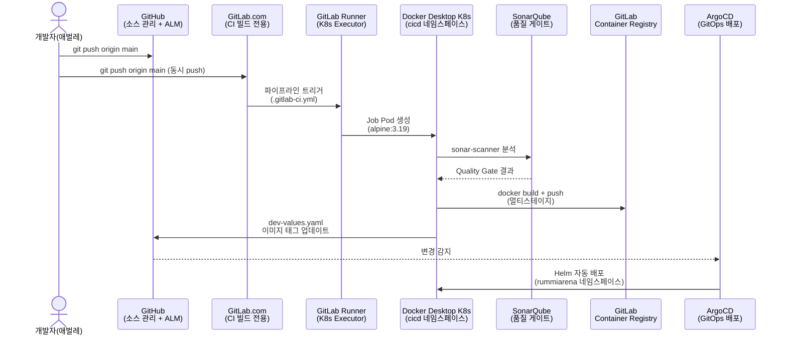
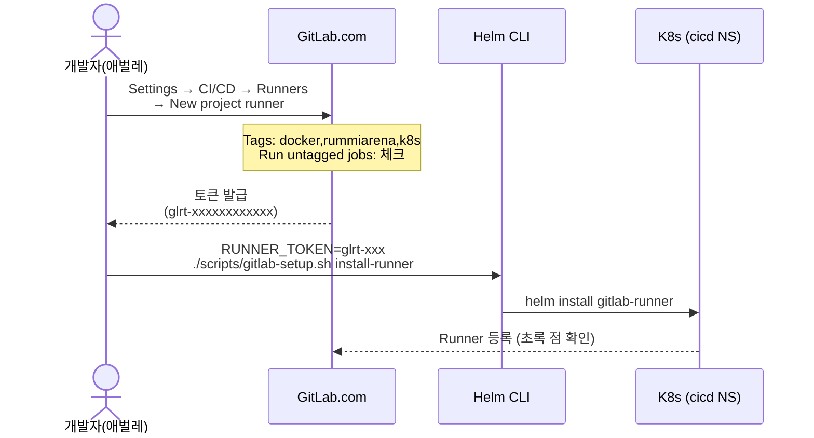
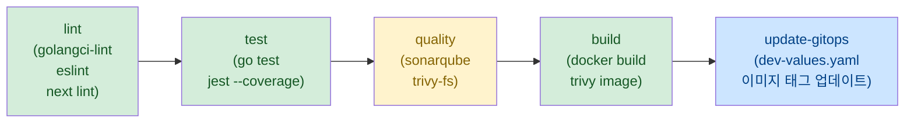
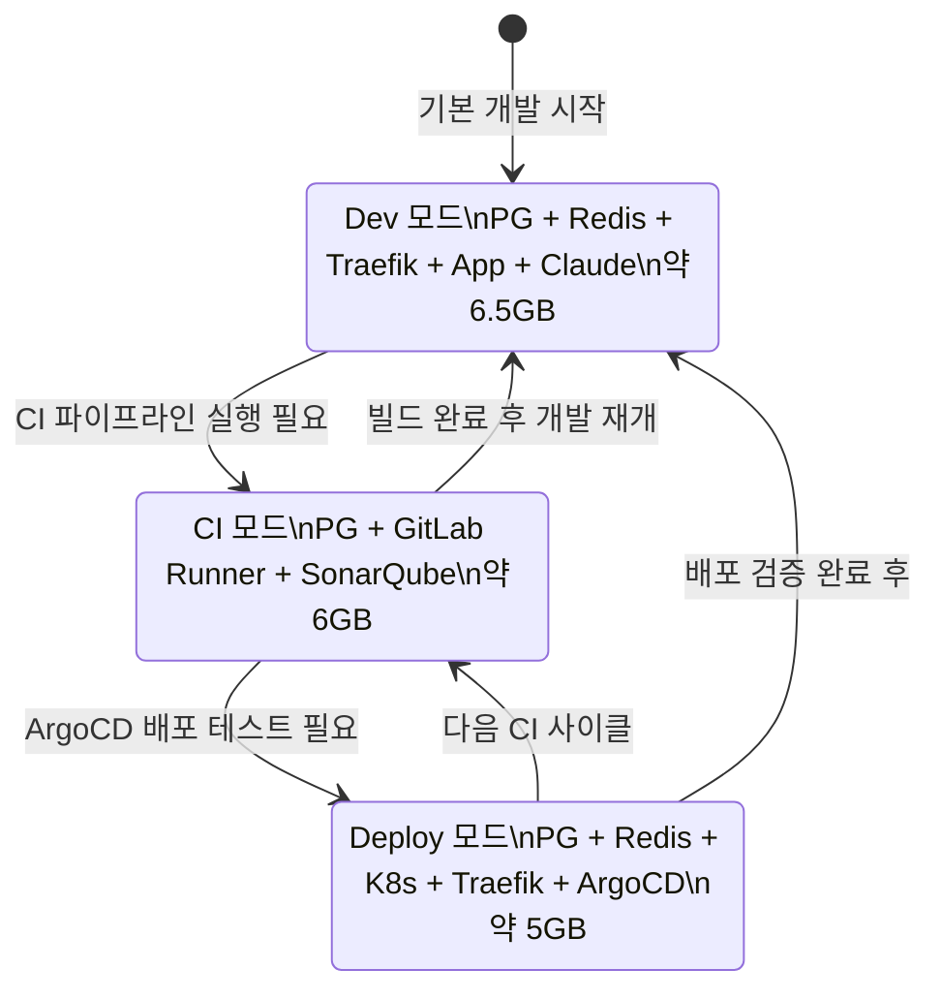

# GitLab + GitLab Runner 설치 및 이용 가이드

> 최종 수정: 2026-03-15
> 대상: Sprint 2 CI 파이프라인 실전 운영 준비 (Sprint 1에서 dry-run 검증 완료)
> 환경: WSL2 Ubuntu, Docker Desktop Kubernetes (docker-desktop context), glab 1.89.0

---

## 1. 개요

### 1.1 GitLab CI/CD 구성 다이어그램



### 1.2 RummiArena에서의 역할

| 단계 | 도구 | 역할 |
|------|------|------|
| 빌드 | GitLab Runner (K8s Executor) | Go/NestJS/Next.js 소스 컴파일 |
| 테스트 | go test, jest | 단위/통합 테스트 + 커버리지 수집 |
| 품질 | SonarQube + Trivy | 코드 품질 게이트 + 취약점 스캔 |
| 이미지 빌드 | Docker 멀티스테이지 | game-server / ai-adapter / frontend 이미지 생성 |
| 배포 트리거 | GitOps (dev-values.yaml) | 이미지 태그 업데이트 → ArgoCD 자동 감지 |

**핵심 설계 원칙**:
- GitHub = 단일 소스 진실(SSoT): 이슈, 백로그, 소스 코드
- GitLab = CI 빌드 전용: SaaS GitLab.com 사용 (자체 호스팅 불필요)
- GitLab Runner = K8s Executor: Docker Desktop K8s 위에서 Job Pod 실행
- 모든 토큰/시크릿 = GitLab CI Variables 또는 K8s Secret (Git 커밋 금지)

---

## 2. glab CLI 설치 확인

glab은 GitLab 공식 CLI 도구다. 프로젝트 생성, CI/CD Variables 등록, 파이프라인 모니터링을 터미널에서 수행한다.

### 2.1 설치 여부 확인

```bash
~/.local/bin/glab --version
# glab version 1.89.0 (2025-xx-xx)
```

glab이 없으면 scripts/gitlab-setup.sh로 설치한다.

```bash
./scripts/gitlab-setup.sh install-glab
```

### 2.2 PATH 등록

```bash
echo 'export PATH="$HOME/.local/bin:$PATH"' >> ~/.bashrc
source ~/.bashrc

# 등록 확인
which glab
glab --version
```

> glab 설치 경로는 `~/.local/bin/glab`이며 sudo 권한이 불필요하다.
> GitLab.com 공식 릴리즈(github.com/gitlab-org/cli)에서 다운로드된다.

### 2.3 수동 설치 (자동 설치 실패 시)

```bash
# 최신 버전 확인
GLAB_VER=$(curl -sf https://api.github.com/repos/gitlab-org/cli/releases/latest \
  | python3 -c "import sys,json; print(json.load(sys.stdin)['tag_name'])")

# 다운로드 및 설치
curl -fL "https://github.com/gitlab-org/cli/releases/download/${GLAB_VER}/glab_${GLAB_VER#v}_linux_amd64.tar.gz" \
  -o /tmp/glab.tar.gz
mkdir -p /tmp/glab_extract && tar -xzf /tmp/glab.tar.gz -C /tmp/glab_extract
cp /tmp/glab_extract/bin/glab ~/.local/bin/glab
chmod +x ~/.local/bin/glab
glab --version
```

---

## 3. GitLab.com 계정 설정

### 3.1 계정 생성 또는 로그인

- 신규 가입: https://gitlab.com/users/sign_up
- 이메일 인증 완료 후 사용자명(username) 확인

### 3.2 PAT(Personal Access Token) 발급

PAT는 glab CLI 인증과 CI/CD 설정에 사용된다.

1. GitLab.com 로그인
2. 우측 상단 아바타 클릭 → **Edit Profile**
3. 좌측 메뉴 **Access Tokens** 클릭
4. **Add new token** 클릭
5. 설정값 입력:

| 항목 | 값 |
|------|-----|
| Token name | `glab-cli` |
| Expiration date | 6개월 (권장) |
| Scopes | `api`, `read_user`, `write_repository`, `read_registry` |

6. **Create personal access token** 클릭
7. 생성된 토큰 즉시 복사 (페이지 이탈 후 재확인 불가)

### 3.3 glab 인증

```bash
glab auth login --hostname gitlab.com
```

프롬프트에서 **Token** 방식 선택 후 발급받은 PAT를 입력한다.

```bash
# 인증 상태 확인
glab auth status
# gitlab.com
#   - Logged in to gitlab.com as <username>
#   - Git operations for gitlab.com configured to use https protocol.
#   - Token: ********************
```

또는 스크립트 사용:

```bash
./scripts/gitlab-setup.sh auth
```

---

## 4. GitLab 프로젝트 생성 및 설정

### 4.1 프로젝트 생성

```bash
# glab CLI로 생성 (인증 완료 후)
./scripts/gitlab-setup.sh create-project
```

스크립트가 수행하는 작업:
- GitLab.com에 `RummiArena` Private 프로젝트 생성
- `gitlab` remote 자동 추가 (`https://gitlab.com/<username>/RummiArena.git`)

웹 UI 방식으로 생성하는 경우: GitLab.com → 상단 "+" → **New project** → **Create blank project** → Visibility: Private → Initialize README: 체크 해제

### 4.2 GitHub + GitLab 동시 push 설정

매 push마다 GitHub와 GitLab 모두에 동시 전송한다. `origin` push URL에 두 원격을 추가한다.

```bash
cd /mnt/d/Users/KTDS/Documents/06.과제/RummiArena

git remote set-url --add --push origin https://github.com/k82022603/RummiArena.git
git remote set-url --add --push origin https://gitlab.com/<username>/RummiArena.git

# 확인 (push URL이 2개여야 함)
git remote -v
# origin  https://github.com/k82022603/RummiArena.git (fetch)
# origin  https://github.com/k82022603/RummiArena.git (push)
# origin  https://gitlab.com/<username>/RummiArena.git (push)
```

이후 `git push origin main` 한 번으로 GitHub와 GitLab에 동시 push되며, GitLab이 `.gitlab-ci.yml`을 자동 트리거한다.

개별 push 방식(CI가 필요할 때만):

```bash
git push origin main    # GitHub (소스 관리)
git push gitlab main    # GitLab (CI 트리거)
```

---

## 5. CI/CD Variables 등록

GitLab CI 파이프라인이 사용하는 토큰과 설정값을 등록한다.

### 5.1 등록 대상 Variables

| 변수명 | 설명 | Protected | Masked | 예시 값 |
|--------|------|-----------|--------|---------|
| `SONAR_HOST_URL` | SonarQube 서버 URL | No | No | `http://host.docker.internal:9001` |
| `SONAR_TOKEN` | SonarQube 분석 토큰 | Yes | Yes | `squ_xxxxxxxxxxxx` |
| `GITOPS_TOKEN` | GitHub PAT (GitOps repo push용) | Yes | Yes | `ghp_xxxxxxxxxxxx` |

> `CI_REGISTRY_USER`, `CI_REGISTRY_PASSWORD`는 GitLab이 자동으로 주입하므로 별도 등록이 불필요하다.

### 5.2 glab CLI로 등록 (권장)

```bash
# 대화형 등록 (프롬프트에서 값 입력)
./scripts/gitlab-setup.sh set-vars

# 환경변수로 미리 설정 후 비대화형 등록
export SONAR_HOST_URL="http://host.docker.internal:9001"
export SONAR_TOKEN="squ_xxxxxxxxxxxx"
export GITOPS_TOKEN="ghp_xxxxxxxxxxxx"
./scripts/gitlab-setup.sh set-vars
```

### 5.3 웹 UI로 등록

1. GitLab 프로젝트 → **Settings** → **CI/CD**
2. **Variables** 섹션 펼치기 → **Add variable** 클릭
3. 각 변수 입력: Key / Value / Type: Variable / Protect/Mask 체크

### 5.4 Variables 수정 (기존 값 변경)

```bash
# 기존 변수 삭제 후 재등록
glab api "projects/<username>%2FRummiArena/variables/SONAR_TOKEN" \
  --method DELETE

./scripts/gitlab-setup.sh set-vars
```

---

## 6. GitLab Runner K8s Executor 설치

GitLab Runner는 K8s Executor 방식으로 설치된다. Runner 컨트롤러 Pod가 `cicd` 네임스페이스에 상주하고, Job 실행 시 Job Pod를 동적으로 생성/삭제한다.

### 6.1 Runner 토큰 발급



토큰 발급 절차:

1. GitLab.com → RummiArena 프로젝트 → **Settings** → **CI/CD**
2. **Runners** 섹션 펼치기 → **New project runner** 클릭
3. Runner 설정:
   - **Tags**: `docker, rummiarena, k8s` (쉼표 구분)
   - **Run untagged jobs**: 체크 (태그 없는 job도 실행 허용)
   - **Description**: `RummiArena K8s Runner (docker-desktop)`
4. **Create runner** 클릭
5. Step 1 화면에서 `glrt-xxxxxxxxxxxx` 형식 토큰 즉시 복사

> 토큰은 Git에 커밋하지 않는다. 환경변수 또는 K8s Secret으로 관리한다.
> 참고: `docs/03-development/02-secret-management.md`

토큰 K8s Secret 저장 (영구 보관 권장):

```bash
kubectl create namespace cicd --dry-run=client -o yaml | kubectl apply -f -

kubectl create secret generic gitlab-runner-token \
  -n cicd \
  --from-literal=runnerToken="glrt-xxxxxxxxxxxx" \
  --dry-run=client -o yaml | kubectl apply -f -
```

### 6.2 전제 조건 확인

```bash
# K8s 클러스터 연결 확인
kubectl cluster-info
kubectl get nodes
# NAME             STATUS   ROLES           AGE
# docker-desktop   Ready    control-plane   ...

# Helm 버전 확인
helm version

# cicd 네임스페이스 확인
kubectl get namespace cicd 2>/dev/null || echo "cicd 네임스페이스 없음 (자동 생성됨)"
```

### 6.3 Helm dry-run 검증 (필수)

실제 설치 전 dry-run으로 Helm 렌더링 결과를 검증한다.

```bash
./scripts/gitlab-setup.sh runner-dryrun
```

dry-run 확인 항목:

| 항목 | 기대값 |
|------|--------|
| YAML 파싱 오류 | 없음 |
| ServiceAccount | `gitlab-runner` SA 포함 |
| RBAC 규칙 | Pod 생성/삭제/조회 권한 포함 |
| Runner Pod 메모리 | requests: 64Mi, limits: 256Mi |
| Job Pod 메모리 | requests: 128Mi, limits: 512Mi |
| concurrent | 2 (10GB WSL 제약) |

Helm values 파일 위치: `helm/charts/gitlab-runner/values.yaml`

### 6.4 실제 설치

```bash
# Runner 토큰을 환경변수로 전달
RUNNER_TOKEN="glrt-xxxxxxxxxxxx" ./scripts/gitlab-setup.sh install-runner

# 또는 대화형 입력 (프롬프트에서 토큰 직접 입력)
./scripts/gitlab-setup.sh install-runner
```

스크립트가 수행하는 작업:
1. gitlab Helm repo 추가 (`https://charts.gitlab.io`)
2. `cicd` 네임스페이스 생성 (idempotent)
3. `helm install gitlab-runner` 또는 기존 릴리즈가 있으면 `helm upgrade`
4. Runner Pod 상태 출력

주요 values 설정 요약:

```yaml
gitlabUrl: https://gitlab.com
concurrent: 2           # 동시 실행 Job 수 (10GB WSL 제약)
checkInterval: 15       # Job 폴링 간격(초)

runners:
  executor: kubernetes
  namespace: cicd
  image: alpine:3.19
  privileged: false     # DinD 필요 시 true (build 단계에서 개별 override)
  builds:
    memoryRequests: "128Mi"
    memoryLimits: "512Mi"

resources:              # Runner 컨트롤러 Pod 자체 리소스
  requests:
    memory: "64Mi"
  limits:
    memory: "256Mi"
```

### 6.5 설치 확인

```bash
# Runner Pod 상태 확인 (Running 이어야 함)
kubectl get pods -n cicd -l app=gitlab-runner

# Runner Pod 로그 확인
kubectl logs -n cicd deploy/gitlab-runner --tail=20

# Helm 릴리스 상태
helm status gitlab-runner -n cicd

# 전체 상태 한 번에 확인
./scripts/gitlab-setup.sh status
```

GitLab 웹 UI 확인: 프로젝트 → **Settings** → **CI/CD** → **Runners** → Runner 목록에 초록 점(online) 확인

---

## 7. SonarQube 토큰 발급 (CI 연동용)

GitLab CI의 `sonarqube` job이 SonarQube 서버에 코드 분석 결과를 전송할 때 사용하는 토큰이다.

### 7.1 SonarQube 기동

```bash
# CI 모드로 SonarQube 기동 (setup-cicd.sh 사용)
./scripts/setup-cicd.sh sonarqube

# 기동 확인 (포트 9001)
curl -s http://localhost:9001/api/system/status | python3 -m json.tool
# "status": "UP"
```

### 7.2 토큰 발급 절차

1. http://localhost:9001 접속
2. 초기 계정: `admin` / `admin` (최초 로그인 시 비밀번호 변경 필요)
3. 우측 상단 아바타 → **My Account**
4. **Security** 탭 클릭
5. **Generate Tokens** 섹션:
   - Name: `gitlab-ci-token`
   - Type: `Global Analysis Token`
   - Expires: `No expiration` (또는 1년)
6. **Generate** 클릭 → `squ_`로 시작하는 토큰 즉시 복사

### 7.3 GitLab CI Variable에 등록

```bash
# 발급받은 토큰을 SONAR_TOKEN 변수로 등록
export SONAR_TOKEN="squ_xxxxxxxxxxxx"
./scripts/gitlab-setup.sh set-vars
```

또는 GitLab 웹 UI: 프로젝트 → Settings → CI/CD → Variables → `SONAR_TOKEN` 편집

> SonarQube는 CI 모드에서만 실행한다. Dev/Deploy 모드에서는 포트 9001이 열리지 않아도 된다.

---

## 8. 첫 파이프라인 실행

### 8.1 파이프라인 트리거

```bash
cd /mnt/d/Users/KTDS/Documents/06.과제/RummiArena

# 동시 push 설정이 된 경우 (GitHub + GitLab 동시 push)
git push origin main

# GitLab만 push하는 경우
git push gitlab main

# 또는 GitLab 웹 UI에서 수동 실행
# 프로젝트 → CI/CD → Pipelines → Run pipeline
```

### 8.2 파이프라인 단계



| 단계 | Job | 조건 |
|------|-----|------|
| lint | lint-go, lint-nest, lint-frontend | main, develop, MR |
| test | test-go, test-nest | main, develop, MR |
| quality | sonarqube, trivy-fs | main, develop (SonarQube 실행 중 필요) |
| build | build-game-server, build-ai-adapter, build-frontend | main 브랜치만 |
| update-gitops | update-gitops | main 브랜치, build 성공 후 |

### 8.3 파이프라인 상태 확인

```bash
# 파이프라인 목록
glab pipeline list

# 최신 파이프라인 상세 보기
glab pipeline view <pipeline-id>

# 실시간 로그 (CI 뷰)
glab pipeline ci view
```

웹 UI에서 확인: 프로젝트 → **CI/CD** → **Pipelines** → 최신 파이프라인 클릭 → 각 stage 상태 확인

### 8.4 커버리지 리포트 확인

test-go와 test-nest job이 성공하면 GitLab이 커버리지 배지와 Cobertura XML을 자동으로 파싱한다.

- 프로젝트 → **CI/CD** → **Pipelines** → 파이프라인 클릭 → **Coverage** 탭
- MR(Merge Request)에서는 커버리지 변화량이 자동 코멘트로 표시된다.

---

## 9. 교대 실행 전략

16GB RAM (WSL 10GB 할당) 제약으로 모든 서비스를 동시 실행할 수 없다. 작업 목적에 따라 모드를 전환한다.

### 9.1 모드별 메모리 사용량



### 9.2 CI 모드 전환 절차

```bash
# 1. Dev 모드 서비스 중지
docker compose -f docker-compose.dev.yml down

# 2. 메모리 확인 (최소 6GB 확보 필요)
free -h

# 3. CI 모드 시작 — SonarQube 기동
./scripts/setup-cicd.sh sonarqube

# 4. SonarQube 준비 대기 (약 60~90초)
curl -s http://localhost:9001/api/system/status

# 5. GitLab에 push (파이프라인 트리거)
git push gitlab main   # 또는 git push origin main

# 6. 파이프라인 모니터링
glab pipeline ci view

# 7. CI 완료 후 SonarQube 중지
./scripts/setup-cicd.sh down
```

### 9.3 OOM 방지 권고

- SonarQube가 실행 중인 상태에서 game-server K8s Pod를 추가로 띄우면 OOM이 발생할 수 있다.
- CI 파이프라인 실행 중에는 `docker compose up` 명령을 실행하지 않는다.
- Runner concurrent를 2로 제한했으므로 동시 Job 수가 많으면 자동으로 대기한다.

---

## 10. 트러블슈팅

### 10.1 Runner not connecting

증상: GitLab 웹 UI에서 Runner가 오프라인(회색 점) 상태

```bash
# Runner Pod 상태 확인
kubectl get pods -n cicd
kubectl describe pod -n cicd <runner-pod-name>

# 로그에서 토큰 오류 확인
kubectl logs -n cicd deploy/gitlab-runner --tail=50

# 토큰 재발급 후 Runner 재설치
helm uninstall gitlab-runner -n cicd
RUNNER_TOKEN=glrt-<new-token> ./scripts/gitlab-setup.sh install-runner
```

| 원인 | 증상 로그 | 해결 |
|------|-----------|------|
| 토큰 만료/무효 | `invalid token` | GitLab에서 새 Runner 토큰 발급 |
| 네트워크 불통 | `connection refused` | Docker Desktop 재시작, K8s 활성화 확인 |
| values.yaml 오류 | `YAML parse error` | dry-run으로 먼저 검증 |

### 10.2 Job pending (no matching runner)

증상: 파이프라인 Job이 `pending` 상태로 계속 대기

원인과 해결:

```bash
# 현재 Runner tags 확인
kubectl logs -n cicd deploy/gitlab-runner | grep -i tag

# .gitlab-ci.yml의 tags 설정 확인
# Job에 tags가 지정된 경우 Runner tags와 일치해야 함
grep -A3 'tags:' /mnt/d/Users/KTDS/Documents/06.과제/RummiArena/.gitlab-ci.yml
```

Runner 설정에서 **Run untagged jobs**를 체크하면 tags 지정 없는 job도 처리한다.

### 10.3 Docker-in-Docker 빌드 실패

증상: `build-*` job에서 `Cannot connect to the Docker daemon` 오류

현재 `helm/charts/gitlab-runner/values.yaml`에서 `privileged: false`로 설정되어 있다. build stage의 DinD 서비스가 이 설정과 충돌할 수 있다.

```bash
# 임시 해결: privileged 모드 활성화 (보안 위험 검토 후 적용)
helm upgrade gitlab-runner gitlab/gitlab-runner \
  -n cicd \
  -f helm/charts/gitlab-runner/values.yaml \
  --set "runners.privileged=true" \
  --set "runnerToken=glrt-xxxxxxxxxxxx"
```

> K8s Executor에서 DinD를 사용하는 경우 privileged: true가 필요하다.
> 로컬 Docker Desktop 환경에서는 보안 위험이 상대적으로 낮으나, 프로덕션 환경에서는 Kaniko 또는 Buildah를 검토한다.

### 10.4 SonarQube 연결 실패

증상: sonarqube job에서 `Connection refused` 또는 `404` 오류

```bash
# CI 모드에서 SonarQube가 실행 중인지 확인
curl -s http://localhost:9001/api/system/status

# host.docker.internal 접근 테스트 (K8s Job Pod 내부에서)
kubectl run -it --rm debug --image=alpine --restart=Never -n cicd -- \
  wget -q -O- http://host.docker.internal:9001/api/system/status
```

| 증상 | 원인 | 해결 |
|------|------|------|
| `localhost:9001 Connection refused` | SonarQube 미기동 | `./scripts/setup-cicd.sh sonarqube` 실행 |
| `host.docker.internal:9001 Connection refused` | WSL → Windows 브리지 이슈 | Windows 방화벽에서 9001 포트 허용 |
| `401 Unauthorized` | SONAR_TOKEN 미설정 또는 만료 | GitLab CI Variable 재등록 |
| `Quality Gate failed` | 코드 품질 미달 | SonarQube 웹 UI에서 상세 내역 확인 후 수정 |

### 10.5 update-gitops 실패

증상: `git push` 시 `403` 또는 `remote: Permission to ... denied`

```bash
# GITOPS_TOKEN 권한 확인 항목
# GitHub → Settings → Developer Settings → Personal Access Tokens
# Repository access: k82022603/RummiArena
# Permissions → Contents: Read and write
```

---

## 빠른 참조 (Quick Reference)

### 자주 쓰는 명령

```bash
# glab 설치 확인
glab --version

# GitLab 인증 상태
glab auth status

# 파이프라인 목록
glab pipeline list

# 파이프라인 실시간 로그
glab pipeline ci view

# Runner 상태 (K8s)
kubectl get pods -n cicd

# Runner Helm 상태
helm status gitlab-runner -n cicd

# 전체 설치 상태 확인
./scripts/gitlab-setup.sh status

# Runner 재설치 (토큰 변경 시)
RUNNER_TOKEN=glrt-xxx ./scripts/gitlab-setup.sh install-runner

# Helm dry-run 재검증
./scripts/gitlab-setup.sh runner-dryrun
```

### 권장 최초 설정 순서

```bash
# 1. glab 설치
./scripts/gitlab-setup.sh install-glab

# 2. GitLab 인증
./scripts/gitlab-setup.sh auth

# 3. GitLab 프로젝트 생성
./scripts/gitlab-setup.sh create-project

# 4. SonarQube 기동 후 토큰 발급 (7절 참조)
./scripts/setup-cicd.sh sonarqube

# 5. CI/CD Variables 등록
./scripts/gitlab-setup.sh set-vars

# 6. Runner Helm dry-run 검증
./scripts/gitlab-setup.sh runner-dryrun

# 7. Runner 설치 (토큰 발급 후)
RUNNER_TOKEN=glrt-xxx ./scripts/gitlab-setup.sh install-runner

# 8. 첫 파이프라인 실행
git push gitlab main
glab pipeline ci view
```

---

## 관련 문서

| 문서 | 경로 |
|------|------|
| GitLab CI/CD 환경 설정 가이드 | `docs/03-development/09-gitlab-cicd-setup.md` |
| 인프라 설치 체크리스트 | `docs/05-deployment/03-infra-setup-checklist.md` |
| 시크릿 관리 | `docs/03-development/02-secret-management.md` |
| Git 워크플로우 | `docs/03-development/07-git-workflow.md` |
| GitLab CI 파이프라인 | `.gitlab-ci.yml` |
| Runner Helm values | `helm/charts/gitlab-runner/values.yaml` |
| GitLab 설정 스크립트 | `scripts/gitlab-setup.sh` |
| GitLab CI 도구 매뉴얼 | `docs/00-tools/05-gitlab-ci.md` |

---

> **문서 이력**
> | 버전 | 날짜 | 작성자 | 내용 |
> |------|------|--------|------|
> | 1.0 | 2026-03-15 | DevOps Agent | 초안 작성 (glab 1.89.0, Runner K8s Executor, 교대 실행 전략, 트러블슈팅) |
