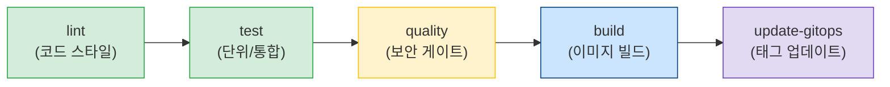
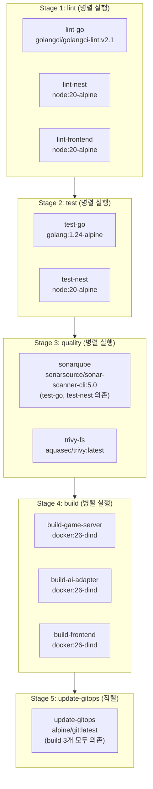
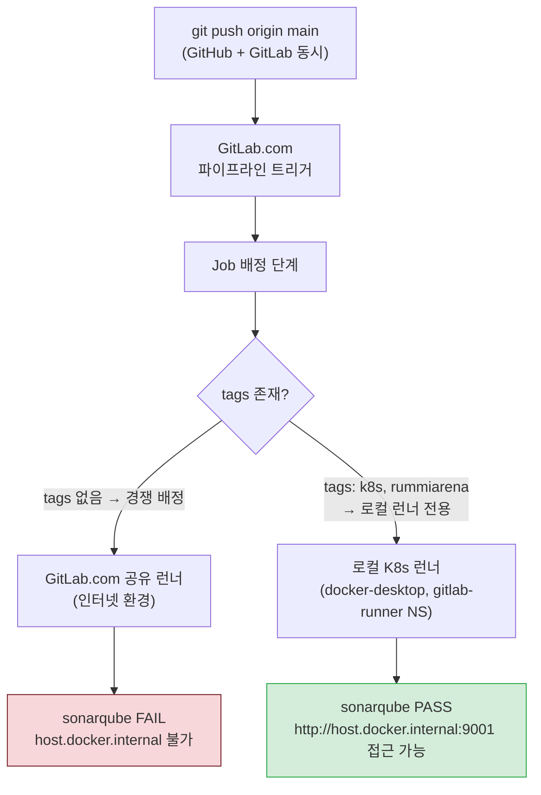
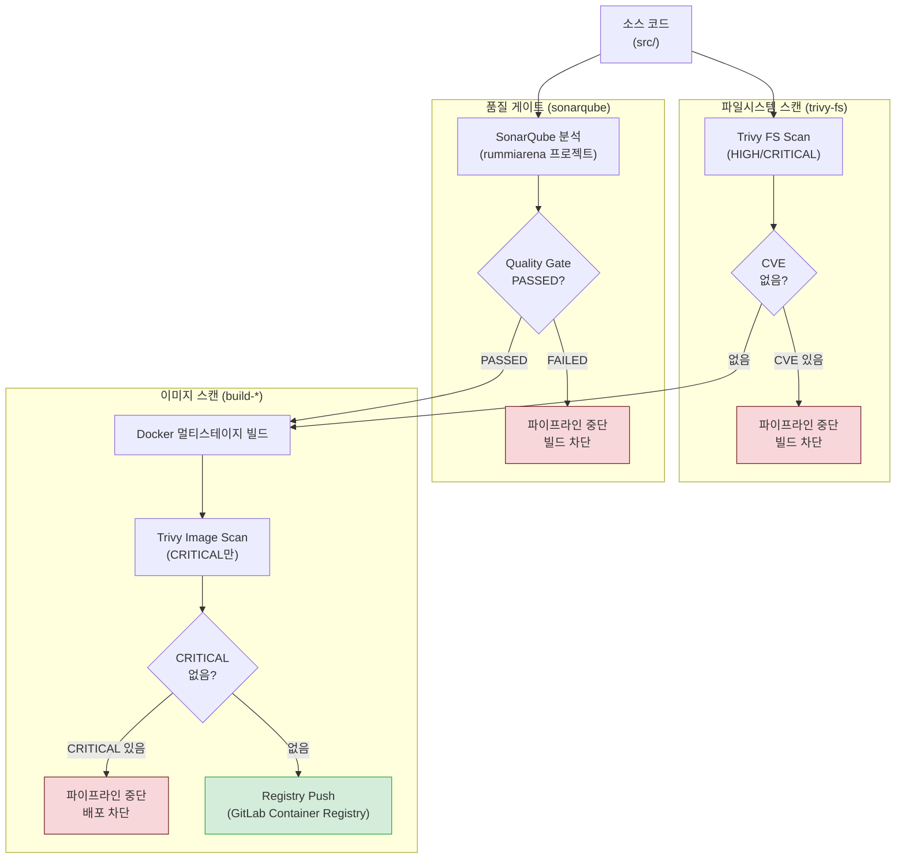
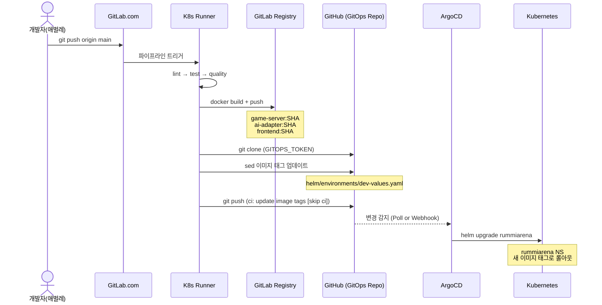
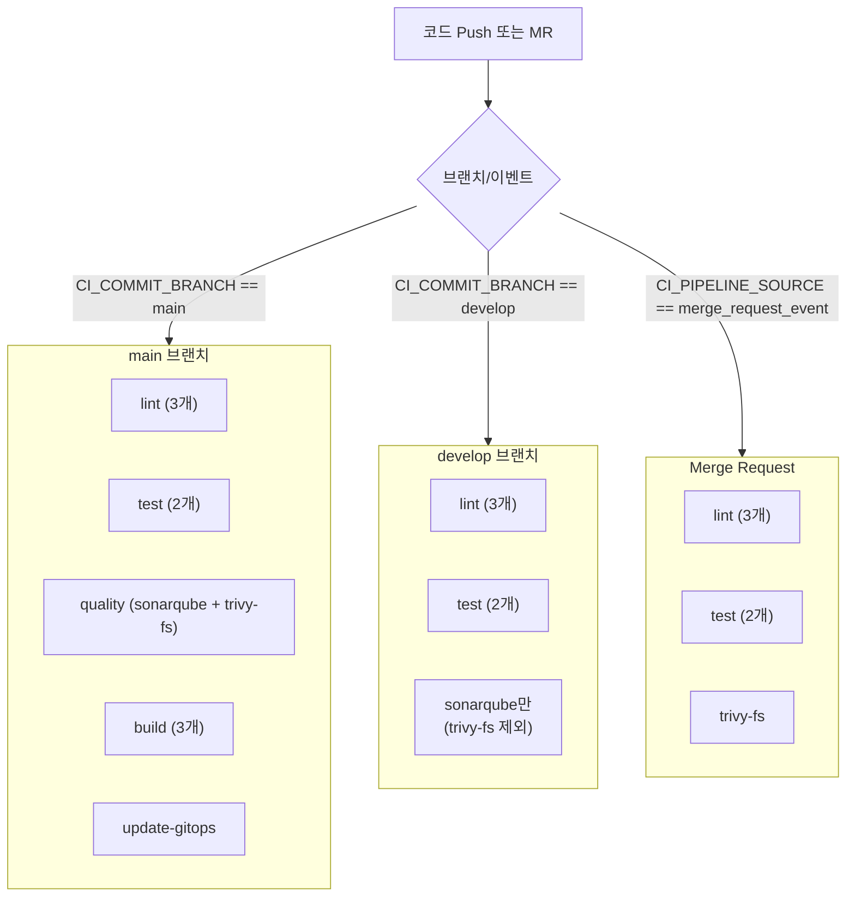

# RummiArena DevSecOps CI/CD 구조 가이드

> 버전: v1.0
> 작성일: 2026-03-21
> 작성자: CI/CD 팀 (DevOps Agent)
> 대상: `.gitlab-ci.yml` 기반 파이프라인 전체 구조 이해 및 운영 참조

---

## 목차

1. [파이프라인 전체 흐름](#1-파이프라인-전체-흐름)
2. [태그 기반 러너 선택 구조](#2-태그-기반-러너-선택-구조)
3. [각 Stage 상세](#3-각-stage-상세)
4. [DevSecOps 보안 게이트](#4-devsecops-보안-게이트)
5. [캐시 전략](#5-캐시-전략)
6. [GitOps 연동 구조](#6-gitops-연동-구조)
7. [CI/CD Variables 목록](#7-cicd-variables-목록)
8. [파이프라인 실행 조건 (rules)](#8-파이프라인-실행-조건-rules)
9. [트러블슈팅 체크리스트](#9-트러블슈팅-체크리스트)
10. [로컬 수동 스캔 방법](#10-로컬-수동-스캔-방법)

---

## 1. 파이프라인 전체 흐름

### 1.1 5단계 파이프라인 개요

RummiArena CI/CD는 **lint → test → quality → build → update-gitops** 5단계로 구성된다.
각 단계는 이전 단계가 성공해야 진행되며, `allow_failure: false`인 job이 실패하면 이후 단계가 즉시 중단된다.



### 1.2 단계별 Job 목록 및 병렬/직렬 관계



### 1.3 파이프라인 중단 조건

| 조건 | 중단 여부 | 비고 |
|------|-----------|------|
| lint job 실패 | 해당 stage 이후 중단 | 병렬 중 하나라도 실패 시 |
| test job 실패 | test stage 이후 중단 | coverage.out 아티팩트 미생성 |
| sonarqube Quality Gate 실패 | build 단계 차단 | `allow_failure: false` |
| trivy-fs HIGH/CRITICAL 발견 | build 단계 차단 | `allow_failure: false` |
| build-* 실패 | update-gitops 차단 | `needs:` 의존 관계 |
| update-gitops 실패 | 파이프라인 종료 | GitOps repo push 오류 |

---

## 2. 태그 기반 러너 선택 구조

### 2.1 로컬 러너 강제 실행 앵커

`.gitlab-ci.yml` 상단에 YAML 앵커로 로컬 러너 설정을 정의하고, 모든 job에 병합(`<<: *local-runner`)한다.

```yaml
# 로컬 K8s 런너 강제 실행 앵커
# quality/lint/test는 host.docker.internal 접근이 필요하므로 공유 런너 사용 금지
.local-runner: &local-runner
  tags:
    - k8s
    - rummiarena
```

각 job에 적용:

```yaml
lint-go:
  stage: lint
  <<: *local-runner   # tags: [k8s, rummiarena] 병합
  image: golangci/golangci-lint:v2.1
  ...
```

### 2.2 태그 기반 러너 선택 흐름



### 2.3 공유 런너 vs 로컬 런너 비교

| 항목 | GitLab.com 공유 런너 | 로컬 K8s 런너 |
|------|---------------------|---------------|
| 실행 환경 | GitLab.com 인프라 (인터넷) | Docker Desktop K8s (로컬 WSL2) |
| host.docker.internal 접근 | 불가 (다른 호스트) | 가능 (동일 호스트) |
| SonarQube 연결 | 실패 (localhost:9001 불가) | 성공 (9001 포트 직접 접근) |
| 선택 조건 | tags 없는 job | tags: k8s, rummiarena 일치 |
| 동시 실행 수 | 최대 400 (GitLab Free) | concurrent: 2 (10GB WSL 제약) |
| Runner ID | 시스템 자동 배정 | 52262488 (gitlab-runner NS) |
| 네트워크 격리 | 완전 격리 | 호스트 네트워크 공유 |

### 2.4 host.docker.internal 접근이 필요한 이유

CI Job Pod는 Docker Desktop K8s 내부에서 실행되지만, SonarQube는 WSL2 호스트의 `localhost:9001`에서 동작한다. K8s Pod에서 WSL2 호스트의 서비스에 접근하려면 `host.docker.internal` 특수 DNS 이름을 사용해야 한다.

```
GitLab Runner Pod (K8s) → host.docker.internal:9001 → SonarQube (WSL2 localhost)
```

따라서 `SONAR_HOST_URL`은 반드시 `http://host.docker.internal:9001`로 설정해야 하며, 공유 런너에서는 이 도메인이 해석되지 않아 연결에 실패한다.

---

## 3. 각 Stage 상세

### 3.1 lint Stage

lint stage의 3개 job은 모두 **병렬 실행**된다. 캐시 정책은 `pull-push`로 캐시를 읽고 갱신한다.

#### lint-go

| 항목 | 값 |
|------|-----|
| 이미지 | `golangci/golangci-lint:v2.1` |
| 태그 | `k8s, rummiarena` |
| 작업 경로 | `src/game-server/` |
| 캐시 | go.sum 기반 Go 모듈 캐시 (pull-push) |
| 실행 조건 | main, develop, MR |
| 명령 | `golangci-lint run ./... --timeout 5m` |

> v2.1 선택 이유: Go 1.24 지원. v1.62는 Go 1.23 기반으로 toolchain 버전 불일치 발생.

#### lint-nest

| 항목 | 값 |
|------|-----|
| 이미지 | `node:20-alpine` |
| 태그 | `k8s, rummiarena` |
| 작업 경로 | `src/ai-adapter/` |
| 캐시 | package-lock.json 기반 node_modules (pull-push) |
| 실행 조건 | main, develop, MR |
| 명령 | `npm ci --prefer-offline && npm run lint` |

#### lint-frontend

| 항목 | 값 |
|------|-----|
| 이미지 | `node:20-alpine` |
| 태그 | `k8s, rummiarena` |
| 작업 경로 | `src/frontend/` |
| 캐시 | package-lock.json 기반 node_modules (pull-push) |
| 실행 조건 | main, develop, MR |
| 명령 | `npm ci --prefer-offline && npm run lint` |

### 3.2 test Stage

test stage의 2개 job은 **병렬 실행**된다. 캐시 정책은 `pull`(읽기 전용)이며, 아티팩트를 7일간 보관한다.

#### test-go

| 항목 | 값 |
|------|-----|
| 이미지 | `golang:1.24-alpine` |
| 태그 | `k8s, rummiarena` |
| before_script | `apk add --no-cache gcc musl-dev` |
| 커버리지 추출 패턴 | `'/total:\s+\(statements\)\s+(\d+\.\d+)%/'` |
| 아티팩트 | `coverage.out`, `coverage.xml` (Cobertura 형식) |
| 타임아웃 | 120s |

핵심 명령:

```bash
go test ./... -v \
    -coverprofile=coverage.out \
    -covermode=atomic \
    -timeout 120s
go tool cover -func=coverage.out
GOBIN=/usr/local/bin go install github.com/boumenot/gocover-cobertura@latest
gocover-cobertura < coverage.out > coverage.xml
```

> `GOBIN=/usr/local/bin` 명시 이유: CI 환경에서 `$GOPATH/bin`이 PATH에 포함되지 않는 경우를 방지.

#### test-nest

| 항목 | 값 |
|------|-----|
| 이미지 | `node:20-alpine` |
| 태그 | `k8s, rummiarena` |
| 명령 | `npm ci --prefer-offline && npm run test:cov` |
| 아티팩트 | `coverage/cobertura-coverage.xml`, `coverage/` 전체 |
| lcov 경로 | `src/ai-adapter/coverage/lcov.info` |

### 3.3 quality Stage

quality stage는 `sonarqube`와 `trivy-fs` 두 job이 **병렬 실행**된다. 단, sonarqube는 `needs: [test-go, test-nest]`로 test stage 아티팩트를 의존한다.

#### sonarqube

| 항목 | 값 |
|------|-----|
| 이미지 | `sonarsource/sonar-scanner-cli:5.0` |
| 태그 | `k8s, rummiarena` |
| 프로젝트 키 | `rummiarena` (통합 스캔) |
| Quality Gate | `sonar.qualitygate.wait=true` (게이트 통과 대기) |
| JVM 메모리 | `-Xmx512m` (10GB WSL 제약 대응) |
| 실행 조건 | main, develop 브랜치만 (MR 제외) |
| allow_failure | `false` |
| 소스 경로 | `src/` |
| 제외 경로 | `**/node_modules/**, **/*.test.go, **/*.spec.ts, **/dist/**, **/coverage/**` |

> `sonar-scanner-cli:5.0` 고정 이유: SonarQube 9.9 LTS 호환. `:latest`는 v2 API를 사용하여 `v2 API not found` 오류 발생.

커버리지 연동:

```
-Dsonar.go.coverage.reportPaths=src/game-server/coverage.out
-Dsonar.javascript.lcov.reportPaths=src/ai-adapter/coverage/lcov.info,src/frontend/coverage/lcov.info
```

#### trivy-fs

| 항목 | 값 |
|------|-----|
| 이미지 | `aquasec/trivy:latest` (entrypoint: [""]) |
| 태그 | `k8s, rummiarena` |
| 스캔 대상 | `src/` 디렉토리 |
| 심각도 | HIGH, CRITICAL (이 이상 발견 시 exit code 1) |
| 캐시 | `trivy-db-cache` (Trivy DB 재다운로드 방지) |
| 제외 경로 | `src/ai-adapter/node_modules, src/frontend/node_modules, .cache` |
| 실행 조건 | main 브랜치, MR |
| allow_failure | `false` |

> `entrypoint: [""]` 이유: `aquasec/trivy` 이미지의 기본 ENTRYPOINT가 `trivy`로 설정되어 있어, `trivy fs` 명령이 `trivy trivy fs`로 중복 실행되는 것을 방지.

### 3.4 build Stage

build stage는 3개 job이 **병렬 실행**된다. `.build-common` 앵커로 공통 설정을 재사용하며, **main 브랜치에서만 실행**된다.

공통 설정 (`&build-common`):

```yaml
.build-common: &build-common
  stage: build
  image: docker:26-dind
  services:
    - name: docker:26-dind
      alias: docker
  before_script:
    - docker login -u "$CI_REGISTRY_USER" -p "$CI_REGISTRY_PASSWORD" "$CI_REGISTRY"
  rules:
    - if: $CI_COMMIT_BRANCH == "main"
```

#### build-game-server

| 항목 | 값 |
|------|-----|
| 빌드 컨텍스트 | `src/game-server/` |
| Dockerfile target | `runner` (멀티스테이지 최종 스테이지) |
| 이미지 태그 | `$DOCKER_IMAGE/game-server:$CI_COMMIT_SHA` + `:latest` |
| 레이어 캐시 | `--cache-from $DOCKER_IMAGE/game-server:latest` |
| OCI 라벨 | `org.opencontainers.image.revision`, `ref.name` |
| Trivy 이미지 스캔 | CRITICAL 발견 시 실패 (`--severity CRITICAL`) |

#### build-ai-adapter

| 항목 | 값 |
|------|-----|
| 빌드 컨텍스트 | `src/ai-adapter/` |
| Dockerfile target | `runner` |
| 이미지 태그 | `$DOCKER_IMAGE/ai-adapter:$CI_COMMIT_SHA` + `:latest` |

#### build-frontend

| 항목 | 값 |
|------|-----|
| 빌드 컨텍스트 | `src/frontend/` |
| Dockerfile target | `runner` |
| 이미지 태그 | `$DOCKER_IMAGE/frontend:$CI_COMMIT_SHA` + `:latest` |

build job의 Trivy 이미지 스캔은 docker socket을 마운트하여 직접 실행한다:

```bash
docker run --rm \
    -v /var/run/docker.sock:/var/run/docker.sock \
    aquasec/trivy:latest image \
    --exit-code 1 \
    --severity CRITICAL \
    --no-progress \
    $DOCKER_IMAGE/game-server:$CI_COMMIT_SHA
```

### 3.5 update-gitops Stage

| 항목 | 값 |
|------|-----|
| 이미지 | `alpine/git:latest` (entrypoint: [""]) |
| 태그 | `k8s, rummiarena` |
| 실행 조건 | main 브랜치, `when: on_success` |
| 의존 job | `build-game-server`, `build-ai-adapter`, `build-frontend` |
| 대상 파일 | `helm/environments/dev-values.yaml` |
| 커밋 메시지 | `ci: update image tags to $CI_COMMIT_SHA [skip ci]` |

> `entrypoint: [""]` 이유: `alpine/git` 이미지의 ENTRYPOINT가 `git`으로 설정되어 있어 `script` 명령 전체가 `git` 하위 명령으로 해석되는 것을 방지.

> `[skip ci]` 마커: GitHub에 push 후 GitLab이 이 커밋을 감지하여 무한 루프 파이프라인이 트리거되는 것을 방지.

---

## 4. DevSecOps 보안 게이트

### 4.1 보안 게이트 흐름



### 4.2 SonarQube Quality Gate 조건

SonarQube 프로젝트 `rummiarena`에 적용되는 Quality Gate 기준:

| 지표 | 조건 | 기준값 |
|------|------|--------|
| new_reliability_rating | 등급 A 이상 | 새 버그 없음 |
| new_security_rating | 등급 A 이상 | 새 취약점 없음 |
| new_maintainability_rating | 등급 A 이상 | 새 코드 스멜 최소화 |
| new_duplicated_lines_density | 3% 미만 | 중복 코드 비율 |

> `sonar.qualitygate.wait=true` 설정으로 게이트 결과를 동기적으로 대기한다. 게이트 FAILED 시 `sonar-scanner`가 exit code 1을 반환하고 파이프라인이 즉시 중단된다.

### 4.3 Trivy 스캔 정책

| 스캔 유형 | 실행 시점 | 차단 기준 | 대상 |
|-----------|-----------|-----------|------|
| trivy-fs (파일시스템) | quality stage | HIGH, CRITICAL | src/ 전체 소스 |
| trivy image (이미지) | build stage (빌드 직후) | CRITICAL만 | 빌드된 Docker 이미지 |

파일시스템 스캔과 이미지 스캔의 기준이 다른 이유: 파일시스템 스캔은 개발 의존성까지 포함하므로 HIGH도 차단하고, 이미지 스캔은 런타임 의존성만 포함하므로 CRITICAL만 차단하여 빌드 실패를 최소화한다.

### 4.4 CVE 수정 이력

| 날짜 | CVE | 심각도 | 패키지 | 수정 내용 |
|------|-----|--------|--------|----------|
| 2026-03-16 | CVE-2025-55182 | CRITICAL | next | 15.2.3 → 15.2.6 |
| 2026-03-16 | CVE-2026-2359 | HIGH | multer (간접) | overrides 2.1.0 |
| 2026-03-16 | CVE-2025-30204 | HIGH | golang-jwt/jwt/v5 | v5.2.1 → v5.2.2 |
| 2026-03-16 | GHSA-h25m-26qc-wcjf | HIGH | next | 15.2.6 → 15.2.9 |
| 2026-03-16 | GHSA-mwv6-3258-q52c | HIGH | next | 15.2.6 → 15.2.9 |
| 2026-03-16 | CVE-2026-3520 | HIGH | multer (간접) | overrides 2.1.0 → 2.1.1 |
| 2026-03-16 | CVE-2025-22869 | HIGH | golang.org/x/crypto | v0.31.0 → v0.35.0 |

---

## 5. 캐시 전략

### 5.1 캐시 앵커 목록

`.gitlab-ci.yml`에 4개의 YAML 앵커로 캐시를 정의하고 재사용한다.

```yaml
# Go 모듈 캐시 — go.sum 변경 시 캐시 무효화
.go-cache: &go-cache
  key:
    files:
      - src/game-server/go.sum
  paths:
    - .cache/go/

# ai-adapter Node.js 캐시 — package-lock.json 변경 시 무효화
.node-ai-cache: &node-ai-cache
  key:
    files:
      - src/ai-adapter/package-lock.json
  paths:
    - src/ai-adapter/node_modules/
    - .cache/npm/

# frontend Node.js 캐시 — package-lock.json 변경 시 무효화
.node-fe-cache: &node-fe-cache
  key:
    files:
      - src/frontend/package-lock.json
  paths:
    - src/frontend/node_modules/
    - .cache/npm/

# Trivy DB 캐시 — 고정 키, 매 실행 DB 재다운로드 방지
# (trivy-fs job에서 직접 정의, key: trivy-db-cache)
```

### 5.2 캐시 정책 설명

| 캐시명 | 키 방식 | 정책 | 적용 Job |
|--------|---------|------|----------|
| go-cache | go.sum 파일 해시 | lint-go: `pull-push`, test-go: `pull` | lint-go, test-go |
| node-ai-cache | package-lock.json 해시 | lint-nest: `pull-push`, test-nest: `pull` | lint-nest, test-nest |
| node-fe-cache | package-lock.json 해시 | lint-frontend: `pull-push` | lint-frontend |
| trivy-db-cache | 고정 키 `trivy-db-cache` | `pull-push` | trivy-fs |

**pull-push vs pull 정책**:

| 정책 | 동작 | 사용 시점 |
|------|------|-----------|
| `pull-push` | 캐시 읽기 + 실행 후 캐시 갱신 | lint job (의존성 설치 후 캐시 업데이트 필요) |
| `pull` | 캐시 읽기만 (갱신 없음) | test job (설치 불필요, 읽기 전용으로 속도 향상) |

### 5.3 전역 캐시 경로 설정

```yaml
variables:
  GOPATH: "$CI_PROJECT_DIR/.cache/go"       # Go 모듈 캐시 경로
  npm_config_cache: "$CI_PROJECT_DIR/.cache/npm"  # npm 캐시 경로
  TRIVY_CACHE_DIR: "$CI_PROJECT_DIR/.cache/trivy"  # Trivy DB 캐시 경로
```

---

## 6. GitOps 연동 구조

### 6.1 전체 GitOps 플로우



### 6.2 dev-values.yaml 이미지 태그 업데이트

`update-gitops` job은 GitHub 소스 repo의 `helm/environments/dev-values.yaml`에서 이미지 태그를 `$CI_COMMIT_SHA`로 교체한다.

```bash
# game-server 이미지 태그 업데이트
sed -i "s|registry.gitlab.com/k82022603/rummiarena/game-server:.*|registry.gitlab.com/k82022603/rummiarena/game-server:$CI_COMMIT_SHA|g" \
    helm/environments/dev-values.yaml

# ai-adapter 이미지 태그 업데이트
sed -i "s|registry.gitlab.com/k82022603/rummiarena/ai-adapter:.*|registry.gitlab.com/k82022603/rummiarena/ai-adapter:$CI_COMMIT_SHA|g" \
    helm/environments/dev-values.yaml

# frontend 이미지 태그 업데이트
sed -i "s|registry.gitlab.com/k82022603/rummiarena/frontend:.*|registry.gitlab.com/k82022603/rummiarena/frontend:$CI_COMMIT_SHA|g" \
    helm/environments/dev-values.yaml
```

> `git diff --staged --quiet || git commit ...` 패턴: 이미 동일한 SHA인 경우 불필요한 커밋을 방지한다.

### 6.3 GitOps 저장소 구조

```
GitHub: k82022603/RummiArena (소스 + GitOps 통합)
└── helm/
    └── environments/
        └── dev-values.yaml    ← ArgoCD가 감시하는 파일
```

소스 repo와 GitOps repo가 동일한 GitHub 저장소에 위치한다. ArgoCD는 `helm/environments/dev-values.yaml`의 이미지 태그 변경을 감지하여 자동 배포를 트리거한다.

---

## 7. CI/CD Variables 목록

### 7.1 GitLab CI Variables (수동 등록 필요)

| 변수명 | 설명 | Protected | Masked | 예시 값 |
|--------|------|-----------|--------|---------|
| `SONAR_HOST_URL` | SonarQube 서버 URL | No | No | `http://host.docker.internal:9001` |
| `SONAR_TOKEN` | SonarQube 분석 토큰 (Global Analysis Token) | Yes | Yes | `squ_xxxxxxxxxxxx` |
| `GITOPS_TOKEN` | GitHub PAT (GitOps repo push용) | Yes | Yes | `ghp_xxxxxxxxxxxx` |

### 7.2 GitLab 자동 제공 Variables (등록 불필요)

| 변수명 | 설명 | 값 예시 |
|--------|------|---------|
| `CI_REGISTRY_USER` | GitLab Container Registry 사용자명 | `gitlab+deploy-token-xxx` |
| `CI_REGISTRY_PASSWORD` | GitLab Container Registry 패스워드 | 자동 생성 토큰 |
| `CI_REGISTRY` | Registry 도메인 | `registry.gitlab.com` |
| `CI_COMMIT_SHA` | 커밋 SHA (full) | `a1b2c3d4...` |
| `CI_COMMIT_REF_NAME` | 브랜치 또는 태그명 | `main` |
| `CI_PIPELINE_SOURCE` | 파이프라인 트리거 소스 | `push`, `merge_request_event` |

### 7.3 파이프라인 전역 Variables (gitlab-ci.yml 내 정의)

| 변수명 | 값 | 설명 |
|--------|----|------|
| `DOCKER_IMAGE` | `registry.gitlab.com/k82022603/rummiarena` | 이미지 레지스트리 기본 경로 |
| `DOCKER_DRIVER` | `overlay2` | Docker storage driver |
| `DOCKER_TLS_CERTDIR` | `""` | DinD TLS 비활성화 (로컬 러너) |
| `SONAR_PROJECT_KEY` | `rummiarena` | SonarQube 통합 프로젝트 키 |
| `GOPATH` | `$CI_PROJECT_DIR/.cache/go` | Go 모듈 캐시 경로 |
| `npm_config_cache` | `$CI_PROJECT_DIR/.cache/npm` | npm 캐시 경로 |
| `TRIVY_CACHE_DIR` | `$CI_PROJECT_DIR/.cache/trivy` | Trivy DB 캐시 경로 |

### 7.4 Variables 등록 방법

**glab CLI (권장)**:

```bash
export SONAR_HOST_URL="http://host.docker.internal:9001"
export SONAR_TOKEN="squ_xxxxxxxxxxxx"
export GITOPS_TOKEN="ghp_xxxxxxxxxxxx"
./scripts/gitlab-setup.sh set-vars
```

**웹 UI**: GitLab 프로젝트 → Settings → CI/CD → Variables → Add variable

**GITOPS_TOKEN 권한 요구사항**:
- Repository: `k82022603/RummiArena`
- Permissions: Contents **Read and write**, Metadata Read

---

## 8. 파이프라인 실행 조건 (rules)

### 8.1 브랜치별 실행 범위



### 8.2 Job별 실행 조건 표

| Job | main | develop | MR |
|-----|------|---------|-----|
| lint-go | O | O | O |
| lint-nest | O | O | O |
| lint-frontend | O | O | O |
| test-go | O | O | O |
| test-nest | O | O | O |
| sonarqube | O | O | X |
| trivy-fs | O | X | O |
| build-game-server | O | X | X |
| build-ai-adapter | O | X | X |
| build-frontend | O | X | X |
| update-gitops | O | X | X |

### 8.3 rules 설정 예시

```yaml
# lint/test job — MR, main, develop 모두 실행
rules:
  - if: $CI_PIPELINE_SOURCE == "merge_request_event"
  - if: $CI_COMMIT_BRANCH == "main"
  - if: $CI_COMMIT_BRANCH == "develop"

# sonarqube — main, develop만 (MR은 커버리지 아티팩트 미보장)
rules:
  - if: $CI_COMMIT_BRANCH == "main"
  - if: $CI_COMMIT_BRANCH == "develop"

# trivy-fs — main, MR (develop은 보안 게이트 생략으로 빠른 피드백)
rules:
  - if: $CI_COMMIT_BRANCH == "main"
  - if: $CI_PIPELINE_SOURCE == "merge_request_event"

# build/update-gitops — main만
rules:
  - if: $CI_COMMIT_BRANCH == "main"
```

---

## 9. 트러블슈팅 체크리스트

### 9.1 파이프라인이 시작되지 않는 경우

**증상**: Push 후 GitLab UI에 파이프라인이 생성되지 않음

| 확인 항목 | 명령 | 기대값 |
|-----------|------|--------|
| gitlab remote 등록 여부 | `git remote -v` | `gitlab` remote가 보여야 함 |
| GitLab push 여부 | `git push gitlab main` | 수동 push 후 파이프라인 확인 |
| .gitlab-ci.yml 문법 | GitLab UI → CI/CD → Editor | "Syntax is correct" |

### 9.2 stuck_or_timeout_failure

**증상**: job이 "pending" 상태에서 멈추거나 timeout

원인 및 해결:

```
원인 1: Runner 오프라인
확인: kubectl get pods -n gitlab-runner
해결: kubectl rollout restart deploy/gitlab-runner -n gitlab-runner

원인 2: tags 불일치
확인: GitLab Settings → CI/CD → Runners → Runner 클릭 → Tags 확인
해결: GitLab API로 즉시 수정
```

**GitLab API로 태그 수정**:

```bash
RUNNER_ID=52262488
GITLAB_PAT="glpat-xxxxxxxxxxxx"

# tags 추가 (k8s, rummiarena)
curl -s -X PUT "https://gitlab.com/api/v4/runners/${RUNNER_ID}" \
  -H "PRIVATE-TOKEN: ${GITLAB_PAT}" \
  -H "Content-Type: application/json" \
  -d '{"tag_list": "k8s,rummiarena"}' | python3 -m json.tool
```

### 9.3 sonarqube job이 공유 런너에서 실행되는 경우

**증상**: sonarqube job 로그에 `Connection refused`가 보이거나 다른 IP에서 실행 중

원인: `<<: *local-runner` 앵커 누락

```yaml
# 잘못된 예 — tags 없음 → 공유 런너 경쟁
sonarqube:
  stage: quality
  image: sonarsource/sonar-scanner-cli:5.0
  ...

# 올바른 예 — local-runner 앵커 적용
sonarqube:
  stage: quality
  <<: *local-runner    # tags: [k8s, rummiarena] 병합
  image: sonarsource/sonar-scanner-cli:5.0
  ...
```

### 9.4 alpine/git ENTRYPOINT 문제

**증상**: `update-gitops` job에서 `unknown flag: --global` 오류 발생

원인: `alpine/git` 이미지의 기본 ENTRYPOINT가 `git`이므로 모든 script 명령이 `git <명령>`으로 실행됨

해결:

```yaml
update-gitops:
  image:
    name: alpine/git:latest
    entrypoint: [""]   # ENTRYPOINT 오버라이드 — 필수
```

동일하게 `aquasec/trivy`도 entrypoint 오버라이드 필요:

```yaml
trivy-fs:
  image:
    name: aquasec/trivy:latest
    entrypoint: [""]   # ENTRYPOINT: trivy 오버라이드
```

### 9.5 DOCKER_IMAGE 대문자 문제

**증상**: `docker push`에서 `invalid reference format` 오류

원인: Docker 이미지 이름은 소문자만 허용. `$CI_PROJECT_PATH`가 대문자를 포함할 수 있음

해결: `.gitlab-ci.yml`에 소문자로 하드코딩

```yaml
variables:
  DOCKER_IMAGE: registry.gitlab.com/k82022603/rummiarena  # 소문자 고정
```

> `$CI_PROJECT_PATH`를 사용하는 경우 `$(echo $CI_PROJECT_PATH | tr '[:upper:]' '[:lower:]')`로 변환 필요.

### 9.6 --target production 오류

**증상**: `docker build --target production`에서 `target stage not found` 오류

원인: Dockerfile의 최종 스테이지명이 `production`이 아님

RummiArena Dockerfile 최종 스테이지명은 `runner`이므로 반드시 일치시켜야 한다:

```bash
# 잘못된 예
docker build --target production src/game-server/

# 올바른 예
docker build --target runner src/game-server/
```

Dockerfile 스테이지명 확인:

```bash
grep "^FROM.*AS" src/game-server/Dockerfile
# FROM golang:1.24-alpine AS builder
# FROM alpine:3.19 AS runner   ← 최종 스테이지
```

### 9.7 gocover-cobertura not found

**증상**: `test-go` job에서 `gocover-cobertura: not found` 오류

원인: `go install` 기본 설치 경로 `$GOPATH/bin`이 PATH에 미포함

해결:

```yaml
# GOBIN을 /usr/local/bin으로 명시
- GOBIN=/usr/local/bin go install github.com/boumenot/gocover-cobertura@latest
- gocover-cobertura < coverage.out > coverage.xml
```

### 9.8 SonarQube v2 API not found

**증상**: sonarqube job 로그에 `ERROR: Error during SonarScanner execution. v2 API not found`

원인: `sonar-scanner-cli:latest`가 SonarQube 10.x API를 사용하지만 로컬 SonarQube는 9.9 LTS

해결: 이미지 버전을 `5.0`으로 고정

```yaml
sonarqube:
  image: sonarsource/sonar-scanner-cli:5.0  # :latest 사용 금지
```

### 9.9 trivy-fs CVE 수정 방법

**npm 직접 의존성 업데이트**:

```bash
npm install next@15.2.9 eslint-config-next@15.2.9 --save-exact --prefix src/frontend
```

**npm 간접 의존성 (overrides)**:

```json
// src/ai-adapter/package.json
{
  "overrides": {
    "multer": "2.1.1"
  }
}
```

overrides 변경 후 lock 파일 재생성:

```bash
cd src/ai-adapter && npm install
cd src/frontend && npm install
git add src/ai-adapter/package-lock.json src/frontend/package-lock.json
```

**Go 모듈 보안 패치**:

```bash
cd src/game-server
go get golang.org/x/crypto@v0.35.0
go get github.com/golang-jwt/jwt/v5@v5.2.2
go mod tidy
```

---

## 10. 로컬 수동 스캔 방법

CI 파이프라인 실행 전에 로컬에서 사전 검증하는 방법이다. CI 모드로 전환 전 문제를 조기에 발견할 수 있다.

### 10.1 SonarQube 로컬 스캔 (game-server)

SonarQube가 `http://localhost:9001`에서 실행 중인 상태에서 실행한다.

```bash
# 1. 커버리지 프로파일 생성
cd /mnt/d/Users/KTDS/Documents/06.과제/RummiArena/src/game-server
go test ./... -coverprofile=coverage.out -covermode=atomic -timeout 120s

# 2. sonar-scanner 실행 (소스 디렉토리를 직접 마운트 — 핵심)
docker run --rm --network host \
  -e SONAR_HOST_URL=http://localhost:9001 \
  -e SONAR_TOKEN=<SONAR_TOKEN> \
  -v "$(pwd):/usr/src" -w /usr/src \
  sonarsource/sonar-scanner-cli:5.0 \
  -Dsonar.projectKey=rummiarena-game-server \
  -Dsonar.go.coverage.reportPaths=coverage.out
```

> 핵심: 소스 디렉토리를 `/usr/src`에 직접 마운트해야 `coverage.out` 경로가 SonarQube 분석 경로와 일치한다. 상위 디렉토리를 마운트하면 경로 불일치로 커버리지가 0%로 표시된다.

### 10.2 SonarQube 로컬 스캔 (ai-adapter)

`sonar-project.properties` 파일을 프로젝트 루트에 생성한 후 스캔한다.

```bash
# sonar-project.properties 위치: src/ai-adapter/sonar-project.properties
cd /mnt/d/Users/KTDS/Documents/06.과제/RummiArena/src/ai-adapter

# Jest 커버리지 생성 (lcov.info 포함)
npm run test:cov

# sonar-scanner 실행
docker run --rm --network host \
  -e SONAR_HOST_URL=http://localhost:9001 \
  -e SONAR_TOKEN=<SONAR_TOKEN> \
  -v "$(pwd):/usr/src" -w /usr/src \
  sonarsource/sonar-scanner-cli:5.0
```

`sonar-project.properties` 예시:

```properties
sonar.projectKey=rummiarena-ai-adapter
sonar.projectName=RummiArena AI Adapter
sonar.sources=src
sonar.exclusions=**/*.spec.ts,**/node_modules/**,**/dist/**,**/coverage/**
sonar.javascript.lcov.reportPaths=coverage/lcov.info
```

### 10.3 Trivy 로컬 파일시스템 스캔

```bash
cd /mnt/d/Users/KTDS/Documents/06.과제/RummiArena

docker run --rm \
  -v "$(pwd):/src" \
  -v "$HOME/.cache/trivy:/root/.cache/trivy" \
  aquasec/trivy:latest fs \
  --severity HIGH,CRITICAL \
  --no-progress \
  --format table \
  --skip-dirs "src/ai-adapter/node_modules,src/frontend/node_modules,.cache" \
  /src/src/
```

### 10.4 golangci-lint 로컬 실행

```bash
cd /mnt/d/Users/KTDS/Documents/06.과제/RummiArena/src/game-server

# Docker로 실행 (CI와 동일한 버전)
docker run --rm \
  -v "$(pwd):/app" -w /app \
  golangci/golangci-lint:v2.1 \
  golangci-lint run ./... --timeout 5m
```

### 10.5 CI 모드 전환 절차

교대 실행 전략에 따라 CI 파이프라인 실행 시 Dev 모드를 먼저 중지해야 한다.

```bash
# 1. Dev 모드 서비스 중지
docker compose -f docker-compose.dev.yml down

# 2. 여유 메모리 확인 (최소 6GB 필요)
free -h

# 3. SonarQube 기동
./scripts/setup-cicd.sh sonarqube

# 4. SonarQube 준비 대기 (약 30초)
until curl -sf http://localhost:9001/api/system/status | grep -q '"status":"UP"'; do
  echo "SonarQube 기동 대기 중..."; sleep 5
done

# 5. GitLab에 push (파이프라인 트리거)
git push origin main

# 6. 파이프라인 상태 모니터링
glab pipeline list

# 7. CI 완료 후 종료
./scripts/setup-cicd.sh down
```

---

## 관련 문서

| 문서 | 경로 |
|------|------|
| GitLab CI/CD 환경 설정 | `docs/03-development/09-gitlab-cicd-setup.md` |
| GitLab Runner 설치 가이드 | `docs/03-development/10-gitlab-runner-guide.md` |
| 시크릿 관리 | `docs/03-development/02-secret-management.md` |
| Git 워크플로우 | `docs/03-development/07-git-workflow.md` |
| 인프라 설치 체크리스트 | `docs/05-deployment/03-infra-setup-checklist.md` |
| K8s 아키텍처 | `docs/05-deployment/04-k8s-architecture.md` |
| SonarQube 운영 가이드 | `docs/05-deployment/05-sonarqube-guide.md` |
| GitLab CI 도구 매뉴얼 | `docs/00-tools/05-gitlab-ci.md` |
| CI 파이프라인 정의 | `.gitlab-ci.yml` |
| Runner Helm values | `helm/charts/gitlab-runner/values.yaml` |

---

> **문서 이력**
> | 버전 | 날짜 | 작성자 | 내용 |
> |------|------|--------|------|
> | 1.0 | 2026-03-21 | CI/CD 팀 (DevOps Agent) | 초안 작성 — .gitlab-ci.yml 전체 구조 분석 + DevSecOps 보안 게이트 + 트러블슈팅 가이드 |
