# 12. 플레이어 생명주기 구현 내역서

- **작성일**: 2026-03-30
- **작성자**: 애벌레
- **설계 문서**: `docs/02-design/12-player-lifecycle-design.md`
- **테스트 보고서**: `docs/04-testing/22-lifecycle-implementation-test-report.md`
- **구현 범위**: 퇴장/기권 (7 SP), 중복 방 제한 (3 SP), 교착 처리 개선 (5 SP), beforeunload 경고 (2 SP)

---

## 1. 변경 개요

```mermaid
flowchart TB
    subgraph Backend["Go Backend (game-server)"]
        direction TB
        M1["model/tile.go\n(PlayerConnectionStatus)"]
        M2["model/game.go\n(GameEndType)"]
        S1["service/game_service.go\n(ForfeitPlayer, advanceTurn, 교착)"]
        S2["service/room_service.go\n(역인덱스, checkDuplicateRoom)"]
        H1["handler/ws_handler.go\n(Grace Timer, forfeitAndBroadcast)"]
        H2["handler/ws_message.go\n(신규 메시지 타입 3종)"]
        R1["repository/memory_repo.go\n(역인덱스 CRUD)"]
    end

    subgraph Adapter["AI Adapter (NestJS)"]
        direction TB
        C1["cost/cost-tracking.service.ts\n(Redis Hash 비용 추적)"]
        C2["cost/cost-limit.guard.ts\n(일일 한도 429)"]
        C3["cost/cost.controller.ts\n(/stats/cost API)"]
        K1["metrics/metrics.service.ts\n(Redis Sorted Set)"]
        K2["metrics/metrics.controller.ts\n(/stats/metrics API)"]
        RD["redis/redis.module.ts\n(Global Redis)"]
        MV["move/move.service.ts\n(fire-and-forget)"]
        OL["adapter/ollama.adapter.ts\n(num_predict 512)"]
    end

    subgraph Frontend["Frontend (Next.js)"]
        direction TB
        F1["hooks/useGameLeaveGuard.ts\n(beforeunload + popstate)"]
        F2["GameClient.tsx\n(퇴장/교착 UI 통합)"]
        F3["ActionBar.tsx\n(패스 버튼 + 교착 안내)"]
        F4["PlayerCard.tsx\n(FORFEITED/DISCONNECTED)"]
        F5["useWebSocket.ts\n(신규 WS 핸들링)"]
        F6["gameStore.ts\n(disconnectedPlayers, isDrawPileEmpty)"]
    end

    subgraph DevOps["Helm / DevOps"]
        direction TB
        D1["ai-adapter secret.yaml\n(신규 Secret 템플릿)"]
        D2["postgres/redis/ollama\ndeployment.yaml\n(securityContext)"]
        D3["argocd/application.yaml\n(ignoreDifferences)"]
        D4["inject-secrets.sh\n(LLM 키 자동 주입)"]
    end
```



---

## 2. Go Backend (game-server) 상세

### 2.1 model/tile.go -- PlayerConnectionStatus 타입 추가

```go
type PlayerConnectionStatus string

const (
    StatusActive       PlayerConnectionStatus = "ACTIVE"
    StatusDisconnected PlayerConnectionStatus = "DISCONNECTED"
    StatusForfeited    PlayerConnectionStatus = "FORFEITED"
)
```

**변경 사유**: 기존에는 플레이어 연결 상태를 별도로 추적하지 않았다. 퇴장/기권 기능을 위해 3가지 상태(ACTIVE, DISCONNECTED, FORFEITED)를 타입으로 정의하여 advanceTurn과 ELO 계산에서 활용한다.

### 2.2 model/game.go -- GameEndType 타입 추가

```go
type GameEndType string

const (
    EndTypeNormal   GameEndType = "NORMAL"    // 타일 전부 내려놓기
    EndTypeForfeit  GameEndType = "FORFEIT"   // 나머지 전원 기권
    EndTypeDeadlock GameEndType = "DEADLOCK"  // 교착 상태 종료
    EndTypeCancelled GameEndType = "CANCELLED" // 전원 기권 (ELO 미적용)
)
```

**변경 사유**: 게임 종료 유형에 따라 ELO 계산 로직과 결과 화면 표시가 달라진다. CANCELLED의 경우 ELO를 적용하지 않는다.

### 2.3 service/game_service.go -- 핵심 로직 변경

#### ForfeitPlayer

```go
func (s *GameService) ForfeitPlayer(gameID string, seat int, reason string) error
```

- 플레이어 상태를 FORFEITED로 변경
- 활성 플레이어 수 카운트 -> 1명 이하 시 GAME_OVER 트리거
- ELO 계산: CANCELLED(전원 기권) vs FORFEIT(나머지 승리) 분기

#### SetPlayerStatus

```go
func (s *GameService) SetPlayerStatus(gameID string, seat int, status PlayerConnectionStatus) error
```

- DISCONNECTED 설정 시 Grace Timer는 handler에서 관리 (서비스 계층은 상태만 담당)
- ACTIVE 복원 시 disconnectedAt 타임스탬프 초기화

#### advanceTurn 건너뛰기

```go
// 기존 코드
func (s *GameService) advanceTurn(game *model.Game) int {
    return (game.CurrentSeat + 1) % game.PlayerCount
}

// 변경 후
func (s *GameService) advanceTurn(game *model.Game) int {
    next := (game.CurrentSeat + 1) % game.PlayerCount
    attempts := 0
    for attempts < game.PlayerCount {
        if game.Players[next].Status != model.StatusForfeited {
            return next
        }
        next = (next + 1) % game.PlayerCount
        attempts++
    }
    return -1 // 모든 플레이어 FORFEITED -> GAME_OVER
}
```

**핵심 변경**: FORFEITED 상태인 플레이어를 건너뛰고 다음 활성 플레이어에게 턴을 넘긴다. DISCONNECTED 상태는 건너뛰지 않는다(Grace Period 내 재연결 가능하므로).

#### countActivePlayers

```go
func (s *GameService) countActivePlayers(game *model.Game) int
```

- FORFEITED가 아닌 플레이어 수를 카운트
- 1명 이하 시 자동 승리 판정에 사용

#### 교착 패스 모드

```go
func (s *GameService) DrawTile(gameID string, seat int) (*model.Tile, error) {
    if len(game.DrawPile) == 0 {
        // 패스 모드: 타일 지급하지 않고 연속 패스 카운트 증가
        game.ConsecutivePasses++
        if game.ConsecutivePasses >= game.ActivePlayerCount {
            // 전원 패스 -> DEADLOCK 종료
            return nil, s.endGameByDeadlock(game)
        }
        return nil, nil // 패스 처리 (타일 미지급)
    }
    game.ConsecutivePasses = 0 // 드로우 발생 시 카운트 리셋
    // ... 기존 드로우 로직
}
```

### 2.4 service/room_service.go -- 중복 방 제한

#### checkDuplicateRoom

```go
func (s *RoomService) checkDuplicateRoom(userID string) error {
    existingRoom := s.repo.GetActiveRoomForUser(userID)
    if existingRoom != "" {
        return NewDuplicateRoomError(userID, existingRoom)
    }
    return nil
}
```

- CreateRoom과 JoinRoom 양쪽 진입점에서 호출
- 409 Conflict HTTP 상태 코드 반환

#### userRooms 역인덱스

- 방 참가 시: `SetActiveRoomForUser(userID, roomID)`
- 게임 종료/방 나가기 시: `ClearActiveRoomForUser(userID)`
- 조회: `GetActiveRoomForUser(userID) -> roomID`

### 2.5 handler/ws_handler.go -- WebSocket 생명주기

#### Grace Timer

```go
func (h *WSHandler) startGraceTimer(gameID string, seat int, duration time.Duration) {
    timer := time.AfterFunc(duration, func() {
        h.forfeitAndBroadcast(gameID, seat, "DISCONNECT_TIMEOUT")
    })
    h.graceTimers[gameKey(gameID, seat)] = timer
}

func (h *WSHandler) cancelGraceTimer(gameID string, seat int) {
    key := gameKey(gameID, seat)
    if timer, ok := h.graceTimers[key]; ok {
        timer.Stop()
        delete(h.graceTimers, key)
    }
}
```

- WS 연결 끊김 감지 시 60초 Grace Timer 시작
- Grace 내 재연결 시 Timer 취소 + PLAYER_RECONNECT 브로드캐스트
- Grace 만료 시 ForfeitPlayer 호출 + PLAYER_FORFEITED 브로드캐스트

#### forfeitAndBroadcast

```go
func (h *WSHandler) forfeitAndBroadcast(gameID string, seat int, reason string)
```

- GameService.ForfeitPlayer 호출
- PLAYER_FORFEITED 메시지 브로드캐스트
- 기권된 플레이어가 현재 턴이면 즉시 advanceTurn

#### handleLeaveGame

```go
func (h *WSHandler) handleLeaveGame(conn *websocket.Conn, msg WSMessage)
```

- 명시적 LEAVE_GAME 메시지 수신 시 Grace Period 없이 즉시 기권 처리
- 기존 WS 연결은 유지 (관전 모드 전환 가능)

### 2.6 handler/ws_message.go -- 신규 메시지 타입

| 메시지 타입 | 방향 | 페이로드 |
|------------|------|----------|
| `PLAYER_DISCONNECTED` | Server -> Client (broadcast) | `{ seat, nickname, disconnectedAt }` |
| `PLAYER_FORFEITED` | Server -> Client (broadcast) | `{ seat, nickname, reason, activePlayers }` |
| `DRAW_PILE_EMPTY` | Server -> Client (broadcast) | `{ consecutivePasses, activePlayerCount }` |
| `LEAVE_GAME` | Client -> Server | `{ gameID }` |
| `PLAYER_RECONNECT` | Server -> Client (broadcast) | `{ seat, nickname }` |

### 2.7 repository/memory_repo.go -- 역인덱스 CRUD

```go
type MemoryRoomRepository struct {
    rooms     map[string]*model.Room
    userRooms map[string]string // userID -> roomID (역인덱스)
    mu        sync.RWMutex
}

func (r *MemoryRoomRepository) GetActiveRoomForUser(userID string) string
func (r *MemoryRoomRepository) SetActiveRoomForUser(userID, roomID string)
func (r *MemoryRoomRepository) ClearActiveRoomForUser(userID string)
```

- `sync.RWMutex`로 동시성 보호 (race detector 0건 검증 완료)
- 방 삭제 시 해당 방의 모든 유저 역인덱스도 일괄 삭제

---

## 3. AI Adapter (NestJS) 상세

### 3.1 cost/cost-tracking.service.ts -- Redis Hash 비용 추적

```typescript
@Injectable()
export class CostTrackingService {
  async recordCost(model: string, inputTokens: number, outputTokens: number): Promise<void>
  async getDailyCost(date?: string): Promise<CostSummary>
  async getMonthlyCost(year: number, month: number): Promise<CostSummary>
  async getModelCost(model: string, days?: number): Promise<ModelCostDetail>
}
```

- Redis Hash 키: `quota:daily:YYYY-MM-DD` (모델별 필드)
- `HINCRBY` 원자적 증분으로 동시 요청 안전
- 비용 계산: 모델별 단가 테이블 (input/output 토큰 분리)
- TTL: 일별 키 90일, 월별 키 없음

### 3.2 cost/cost-limit.guard.ts -- 일일 한도 429 Guard

```typescript
@Injectable()
export class CostLimitGuard implements CanActivate {
  async canActivate(context: ExecutionContext): Promise<boolean>
}
```

- 환경변수 `DAILY_COST_LIMIT_USD` (기본값: 10.00)
- 한도 초과 시 429 Too Many Requests 응답
- `/ai/move` 엔드포인트에만 적용 (관리 API 제외)

### 3.3 cost/cost.controller.ts -- /stats/cost API

| 엔드포인트 | 메서드 | 응답 |
|-----------|--------|------|
| `/stats/cost/daily` | GET | 오늘 일별 비용 (모델별 분류) |
| `/stats/cost/monthly` | GET | 이번 달 월별 비용 |
| `/stats/cost/model/:model` | GET | 특정 모델 최근 N일 비용 추이 |

### 3.4 metrics/metrics.service.ts -- Redis Sorted Set 메트릭

```typescript
@Injectable()
export class MetricsService {
  async recordMetric(model: string, latencyMs: number, tokens: number, isValid: boolean): Promise<void>
  async getLatencyStats(model: string): Promise<LatencyStats>  // p50, p95, avg
  async getTokenUsage(model: string): Promise<TokenUsageStats>
}
```

- Redis Sorted Set 키: `metrics:latency:{model}`, `metrics:tokens:{model}`
- Score = 응답 시간(ms) 또는 토큰 수, Member = 타임스탬프 기반 고유 ID
- p50/p95 계산: `ZRANGEBYSCORE` + 백분위 인덱스

### 3.5 metrics/metrics.controller.ts -- /stats/metrics API

| 엔드포인트 | 메서드 | 응답 |
|-----------|--------|------|
| `/stats/metrics/latency` | GET | 모델별 응답 시간 통계 (p50, p95, avg) |
| `/stats/metrics/token-usage` | GET | 모델별 토큰 사용량 통계 |

### 3.6 redis/redis.module.ts -- Global Redis 모듈

- `@Global()` 데코레이터로 전체 애플리케이션에서 Redis 클라이언트 공유
- 기존 `ioredis` 인스턴스를 NestJS 모듈로 래핑
- cost, metrics 모듈에서 DI를 통해 주입

### 3.7 move/move.service.ts -- fire-and-forget 비용+메트릭 기록

```typescript
// LLM 호출 후
const result = await this.adapter.requestMove(request);
// fire-and-forget: 비용/메트릭 기록은 게임 흐름을 차단하지 않음
this.costService.recordCost(model, result.inputTokens, result.outputTokens).catch(e => this.logger.warn(e));
this.metricsService.recordMetric(model, result.latencyMs, result.totalTokens, result.isValid).catch(e => this.logger.warn(e));
```

**설계 결정**: 비용/메트릭 기록 실패가 게임 진행을 차단해서는 안 된다. `.catch()`로 에러를 로그만 남기고 무시한다.

### 3.8 adapter/ollama.adapter.ts -- num_predict 512, stop 토큰 정리

```typescript
// 변경 전
options: { num_predict: 256 }

// 변경 후
options: {
  num_predict: 512,  // 복잡한 재배열 응답을 위해 상향
  stop: ["\n\n", "```"]  // 불필요한 후속 텍스트 차단
}
```

**변경 사유**: gemma3:1b 모델이 복잡한 턴(재배열 포함)에서 256 토큰 내에 JSON 응답을 완성하지 못하는 경우가 있었다. 512로 상향하되 stop 토큰으로 불필요한 출력을 제한한다.

---

## 4. Frontend (Next.js) 상세

### 4.1 hooks/useGameLeaveGuard.ts -- beforeunload + popstate 가드

```typescript
export function useGameLeaveGuard(isPlaying: boolean) {
  useEffect(() => {
    if (!isPlaying) return;

    const handleBeforeUnload = (e: BeforeUnloadEvent) => {
      e.preventDefault();
      e.returnValue = '';  // Chrome 호환
    };

    const handlePopState = () => {
      if (confirm('게임 중입니다. 정말 나가시겠습니까?')) {
        // 나가기 처리
      } else {
        history.pushState(null, '', location.href);  // 뒤로가기 취소
      }
    };

    window.addEventListener('beforeunload', handleBeforeUnload);
    window.addEventListener('popstate', handlePopState);
    history.pushState(null, '', location.href);  // popstate 트리거용

    return () => {
      window.removeEventListener('beforeunload', handleBeforeUnload);
      window.removeEventListener('popstate', handlePopState);
    };
  }, [isPlaying]);
}
```

- PLAYING 상태에서만 가드 활성화 (로비, 연습 모드, GAME_OVER 시 비활성)
- 브라우저 네이티브 confirm 사용 (beforeunload 표준)

### 4.2 GameClient.tsx -- 퇴장/교착 UI 통합

- `PLAYER_DISCONNECTED` 수신: 토스트 + PlayerCard 상태 변경
- `PLAYER_FORFEITED` 수신: 토스트 + PlayerCard 기권 표시 + 1명 남으면 결과 화면
- `DRAW_PILE_EMPTY` 수신: 교착 안내 배너 + ActionBar 패스 모드 전환
- `PLAYER_RECONNECT` 수신: 토스트 + PlayerCard 복구

### 4.3 ActionBar.tsx -- 패스 버튼 + 교착 안내

```typescript
// isDrawPileEmpty 상태에 따라 버튼 전환
{isDrawPileEmpty ? (
  <Button onClick={handlePass} variant="warning">
    패스 ({consecutivePasses}/{activePlayerCount})
  </Button>
) : (
  <Button onClick={handleDraw}>드로우</Button>
)}
```

- 드로우 소진 시 "드로우" 버튼이 "패스" 버튼으로 자동 전환
- 연속 패스 횟수 / 활성 플레이어 수 카운트 표시
- 교착 안내 텍스트: "타일이 모두 소진되었습니다. 배치 또는 패스를 선택하세요."

### 4.4 PlayerCard.tsx -- FORFEITED/DISCONNECTED 상태 표시

| 상태 | 시각적 표현 |
|------|------------|
| ACTIVE | 기본 스타일, 녹색 온라인 표시 |
| DISCONNECTED | 회색 반투명 + 점멸 Wi-Fi 아이콘 + "연결 끊김" 텍스트 |
| FORFEITED | 회색 완전 불투명 + 적색 X 아이콘 + "기권" 텍스트 |

### 4.5 useWebSocket.ts -- 신규 WS 메시지 핸들링

기존 메시지 핸들러에 5개 신규 메시지 타입 추가:

| 메시지 | 핸들러 동작 |
|--------|------------|
| PLAYER_DISCONNECTED | `gameStore.addDisconnectedPlayer(seat)` |
| PLAYER_FORFEITED | `gameStore.markPlayerForfeited(seat)` |
| DRAW_PILE_EMPTY | `gameStore.setDrawPileEmpty(true)` |
| PLAYER_RECONNECT | `gameStore.removeDisconnectedPlayer(seat)` |
| LEAVE_GAME (전송) | `ws.send(JSON.stringify({ type: 'LEAVE_GAME', gameID }))` |

### 4.6 gameStore.ts -- 신규 상태

```typescript
interface GameState {
  // ... 기존 상태
  disconnectedPlayers: Set<number>;  // seat 번호 Set
  forfeitedPlayers: Set<number>;     // seat 번호 Set
  isDrawPileEmpty: boolean;
  consecutivePasses: number;
  activePlayerCount: number;
}
```

---

## 5. Helm / DevOps 상세

### 5.1 ai-adapter secret.yaml -- 신규 Secret 템플릿

```yaml
apiVersion: v1
kind: Secret
metadata:
  name: ai-adapter-secret
  namespace: rummikub
type: Opaque
data:
  OPENAI_API_KEY: ""
  CLAUDE_API_KEY: ""
  DEEPSEEK_API_KEY: ""
  DAILY_COST_LIMIT_USD: ""
```

- `inject-secrets.sh`에서 base64 인코딩 값으로 패치
- Helm values.yaml에는 키 이름만 참조, 값은 포함하지 않음

### 5.2 postgres/redis/ollama deployment.yaml -- securityContext 추가

```yaml
securityContext:
  runAsNonRoot: true
  runAsUser: 1000
  readOnlyRootFilesystem: true
  allowPrivilegeEscalation: false
  capabilities:
    drop: ["ALL"]
```

- BL-P0-005 완료: 기존 game-server, frontend에만 적용되었던 securityContext를 postgres, redis, ollama에도 추가
- PostgreSQL: `runAsUser: 999` (postgres 유저), `readOnlyRootFilesystem: false` (WAL 쓰기 필요)
- Redis: `runAsUser: 999` (redis 유저)
- Ollama: `runAsUser: 1000`, `readOnlyRootFilesystem: false` (모델 파일 쓰기)

### 5.3 argocd/application.yaml -- ignoreDifferences 추가

```yaml
spec:
  ignoreDifferences:
    - group: ""
      kind: Secret
      name: ai-adapter-secret
      jsonPointers:
        - /data
```

- `inject-secrets.sh`로 외부 주입되는 Secret의 data 필드를 ArgoCD 동기화 대상에서 제외
- Google OAuth ConfigMap ignoreDifferences 선례를 따름

### 5.4 inject-secrets.sh -- LLM 키 자동 주입 Step 추가

기존 스크립트에 AI Adapter Secret 패치 단계를 추가:

```bash
# Step 3: AI Adapter Secret 패치 (신규)
echo "=== AI Adapter Secret 패치 ==="
kubectl patch secret ai-adapter-secret -n rummikub --type merge -p "{
  \"data\": {
    \"OPENAI_API_KEY\": \"$(echo -n $OPENAI_API_KEY | base64)\",
    \"CLAUDE_API_KEY\": \"$(echo -n $CLAUDE_API_KEY | base64)\",
    \"DEEPSEEK_API_KEY\": \"$(echo -n $DEEPSEEK_API_KEY | base64)\",
    \"DAILY_COST_LIMIT_USD\": \"$(echo -n ${DAILY_COST_LIMIT_USD:-10.00} | base64)\"
  }
}"
```

- `.env.local`에서 자동 참조 (기존 Google OAuth 패턴과 동일)
- game-server-secret + ai-adapter-secret 동시 패치 (1회 실행)

---

## 6. 의존성 그래프

```mermaid
flowchart TB
    subgraph "기능 1: 퇴장/기권 (7 SP)"
        T1A["model/tile.go\nPlayerConnectionStatus"] --> T1B["service/game_service.go\nForfeitPlayer, advanceTurn"]
        T1A --> T1C["handler/ws_handler.go\nGrace Timer"]
        T1B --> T1C
        T1C --> T1D["handler/ws_message.go\n3개 메시지 타입"]
        T1D --> T1E["Frontend\nPlayerCard, 토스트"]
    end

    subgraph "기능 2: 중복 방 제한 (3 SP)"
        T2A["repository/memory_repo.go\n역인덱스 CRUD"] --> T2B["service/room_service.go\ncheckDuplicateRoom"]
        T2B --> T2C["handler/room_handler.go\n409 Conflict"]
    end

    subgraph "기능 3: 교착 처리 (5 SP)"
        T3A["model/game.go\nGameEndType"] --> T3B["service/game_service.go\nDrawTile 패스 모드"]
        T3B --> T3C["handler/ws_message.go\nDRAW_PILE_EMPTY"]
        T3C --> T3D["Frontend\nActionBar 패스 전환"]
    end

    subgraph "기능 4: beforeunload (2 SP)"
        T4A["hooks/useGameLeaveGuard.ts"] --> T4B["GameClient.tsx\n훅 통합"]
    end

    subgraph "AI Adapter 비용/메트릭"
        A1["redis/redis.module.ts\nGlobal Redis"] --> A2["cost-tracking.service.ts"]
        A1 --> A3["metrics.service.ts"]
        A2 --> A4["cost-limit.guard.ts\n429"]
        A2 --> A5["cost.controller.ts\nAPI 3개"]
        A3 --> A6["metrics.controller.ts\nAPI 2개"]
        A2 --> A7["move.service.ts\nfire-and-forget"]
        A3 --> A7
    end
```



---

## 7. 설계 결정 기록

| # | 결정 | 대안 | 선택 사유 |
|---|------|------|-----------|
| D-01 | Grace Timer 60초 고정 | 설정 가능한 타이머 | 단순성. 게임당 설정이 필요할 정도의 복잡성이 아님 |
| D-02 | DISCONNECTED는 턴 건너뛰지 않음 | DISCONNECTED도 건너뛰기 | 재연결 기회 보장. Grace 내에 턴이 오면 대기 |
| D-03 | 역인덱스를 인메모리 map으로 구현 | Redis Hash로 구현 | 단일 Pod 운영 환경에서 네트워크 비용 불필요. BL-P3-003(Redis 이관) 시 변경 |
| D-04 | fire-and-forget 비용 기록 | 동기 기록 | 게임 응답 지연 방지. 비용 기록 실패가 게임 흐름보다 낮은 우선순위 |
| D-05 | 전원 기권 시 ELO 미적용 | 모두 동일 감소 | 비의도적 네트워크 장애 시 불이익 방지 |
| D-06 | num_predict 256 -> 512 | 1024 | 512면 대부분의 재배열 JSON을 커버. 1024는 CPU 환경에서 응답 시간 과다 |

---

## 8. 알려진 제한사항

| # | 제한사항 | 영향 | 해결 계획 |
|---|----------|------|-----------|
| L-01 | 역인덱스(userRooms)가 인메모리 -> Pod 재시작 시 유실 | 드물지만 중복 방 생성 가능 | BL-P3-003 Redis 이관 시 해결 |
| L-02 | Grace Timer가 인메모리 -> Pod 재시작 시 즉시 만료 | 재시작 시 DISCONNECTED 플레이어 즉시 기권 처리 안 됨 | Redis 기반 Timer 도입 (Sprint 6) |
| L-03 | 비용 추적이 Redis TTL 90일 | 90일 이전 데이터 자동 삭제 | PostgreSQL 영속화 (Sprint 6) |
| L-04 | beforeunload 메시지 커스터마이징 불가 | 브라우저 표준 제한 (보안상 메시지 변경 불가) | 없음 (브라우저 표준) |

---

*이 문서는 `docs/02-design/12-player-lifecycle-design.md` 설계의 구현 결과를 기록한다.*
*테스트 결과: `docs/04-testing/22-lifecycle-implementation-test-report.md` 참조.*
