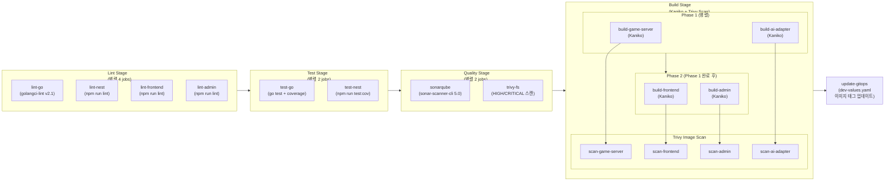
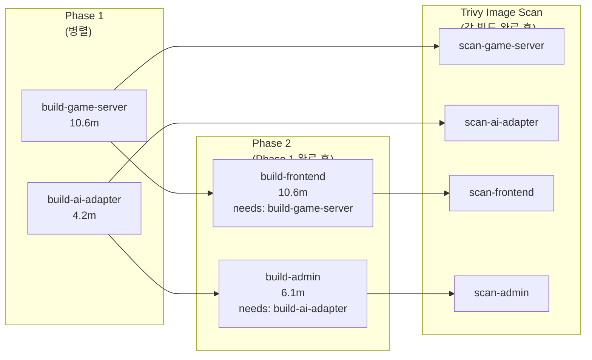
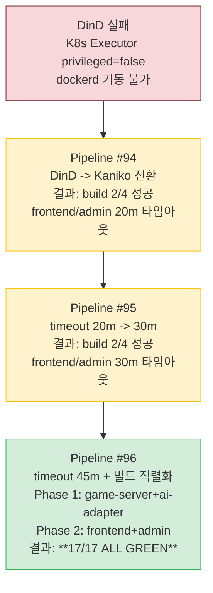

# 13. CI/CD Readiness Checklist

> 최초 작성: Sprint 5 Day 1 (2026-04-01) -- CI/CD 파이프라인 검증 및 준비 상태 점검
> **최종 업데이트: 2026-04-03 -- Pipeline #96 17/17 ALL GREEN 달성**

## 1. 파이프라인 구조

### 1.1 전체 파이프라인 흐름

### 1.2 파이프라인 요약

| 항목 | 값 |
|------|-----|
| 스테이지 | 5개 (lint, test, quality, build, update-gitops) |
| 잡 | **17개** (lint 4 + test 2 + quality 2 + build 4 + scan 4 + gitops 1) |
| 빌드 도구 | **Kaniko v1.23.2** (DinD 대체, 2026-04-03 전환) |
| 빌드 전략 | Phase 1/2 직렬화 (Registry push 대역폭 경쟁 해소) |
| 트리거 조건 | `main`, `develop` 브랜치 push + MR 이벤트 |
| 러너 요구 | `k8s` + `rummiarena` 태그 (`.local-runner` 앵커) |
| 파이프라인 현황 | **17/17 ALL GREEN** (Pipeline #96, 2026-04-03) |

## 2. Pipeline #96 결과 (2026-04-03, 17/17 ALL GREEN)

**Pipeline URL**: https://gitlab.com/k82022603/RummiArena/-/pipelines/2427283301

| 스테이지 | Job | 소요 시간 | 상태 |
|---------|-----|-----------|------|
| lint | lint-go | ~54s | PASS |
| lint | lint-nest | ~54s | PASS |
| lint | lint-frontend | ~54s | PASS |
| lint | lint-admin | ~54s | PASS |
| test | test-go | ~53s | PASS |
| test | test-nest | ~53s | PASS |
| quality | sonarqube | 2.2m | PASS |
| quality | trivy-fs | 0.3m | PASS |
| build | build-game-server (Kaniko) | 10.6m | PASS |
| build | build-ai-adapter (Kaniko) | 4.2m | PASS |
| build | build-frontend (Kaniko) | 10.6m | PASS |
| build | build-admin (Kaniko) | 6.1m | PASS |
| build | scan-game-server (Trivy) | ~20s | PASS |
| build | scan-ai-adapter (Trivy) | ~20s | PASS |
| build | scan-frontend (Trivy) | ~20s | PASS |
| build | scan-admin (Trivy) | ~20s | PASS |
| update-gitops | update-gitops | 0.4m | PASS |

### 2.1 빌드 직렬화 전략 (Phase 1/2)

> Phase 1/2 직렬화 이유: 4개 Kaniko 빌드가 동시에 Registry push를 수행하면 대역폭 경쟁으로 타임아웃 발생. Phase 1 완료 후 Phase 2를 시작하면 안정적으로 완료된다.

## 3. CI/CD Variables 상태

### 3.1 GitLab CI/CD Variables (Settings > CI/CD > Variables)

| Variable | 상태 | Masked | Protected | 값 (요약) | 비고 |
|----------|------|--------|-----------|-----------|------|
| `SONAR_HOST_URL` | SET | No | No | `http://host.docker.internal:9001` | K8s Pod에서 접근 확인 완료 |
| `SONAR_TOKEN` | SET | Yes | No | `sqa_6ad55c...` | SonarQube 분석 토큰 |
| `GITOPS_TOKEN` | SET | Yes | No | `ghp_aeghdy...` | GitHub PAT (GitOps repo push) |
| `CI_REGISTRY_USER` | 자동 | - | - | GitLab 자동 제공 | 설정 불필요 |
| `CI_REGISTRY_PASSWORD` | 자동 | - | - | GitLab 자동 제공 | 설정 불필요 |

### 3.2 보안 권장사항

| 항목 | 현재 | 권장 | 우선순위 |
|------|------|------|---------|
| `GITOPS_TOKEN` protected | No | **Yes** (main 브랜치 전용) | P2 |
| `SONAR_TOKEN` protected | No | Yes (main/develop 전용) | P3 |

## 4. GitLab Runner 상태

| 항목 | 값 |
|------|-----|
| Runner ID | 52262488 |
| 이름 | rummiarena-k8s-runner |
| 유형 | project_type (프로젝트 전용) |
| 상태 | **online** |
| 태그 | `k8s`, `rummiarena` |
| Executor | kubernetes (namespace: `gitlab-runner`) |
| GitLab Runner 버전 | 18.9.0 |
| 생성자 | k82022603 (배진용) |
| 생성일 | 2026-03-15 |

## 5. Container Registry 상태

| 리포지토리 | 경로 | 최종 빌드 |
|------------|------|-----------|
| game-server | `registry.gitlab.com/k82022603/rummiarena/game-server` | Pipeline #96 (2026-04-03) |
| ai-adapter | `registry.gitlab.com/k82022603/rummiarena/ai-adapter` | Pipeline #96 (2026-04-03) |
| frontend | `registry.gitlab.com/k82022603/rummiarena/frontend` | Pipeline #96 (2026-04-03) |
| admin | `registry.gitlab.com/k82022603/rummiarena/admin` | Pipeline #96 (2026-04-03) |
| cache | `registry.gitlab.com/k82022603/rummiarena/cache` | Kaniko 레이어 캐시 |

## 6. 이슈 해결 이력

### 6.1 해결 완료

| 이슈 ID | 내용 | 해결 방법 | 해결일 |
|---------|------|-----------|--------|
| ISS-CI-001 | lint-go staticcheck 3건 실패 | 코드 수정 (S1039, S1024, S1016) | 2026-04-01 |
| ISS-CI-002 | update-gitops sed 패턴 불일치 | sed 패턴 수정 (repository+tag 분리 방식) | 2026-04-02 |
| ISS-CI-003 | SonarQube 접근성 미확인 | K8s Pod에서 host.docker.internal:9001 접근 확인 | 2026-04-01 |
| ISS-CI-005 | Build stage DinD 구성 문제 | **DinD -> Kaniko 전환** (근본 해결) | 2026-04-03 |
| ISS-CI-007 | Kaniko 빌드 타임아웃 (20m/30m) | timeout 45m + Phase 1/2 직렬화 | 2026-04-03 |

### 6.2 DinD -> Kaniko 전환 상세

**전환 핵심 포인트**:

| 항목 | DinD (기존) | Kaniko (현재) |
|------|------------|--------------|
| Docker daemon | 필요 (privileged 필수) | 불필요 (userspace 빌드) |
| 보안 | privileged container 필요 | rootless, 권한 상승 불필요 |
| 메모리 | ~512MB+ (dockerd) | ~300MB (executor) |
| 캐시 | `--cache-from` (이미지 pull) | `--cache-repo` (Registry 레이어 캐시) |
| 인증 | `docker login` | `/kaniko/.docker/config.json` |
| 이미지 | `docker:26-dind` | `gcr.io/kaniko-project/executor:v1.23.2-debug` |

## 7. Dockerfile 빌드 타겟 검증

| 서비스 | `runner` 스테이지 | 베이스 이미지 | Kaniko 호환 |
|--------|------------------|--------------|-------------|
| game-server | `alpine:3.21 AS runner` | Alpine | OK |
| ai-adapter | `node:22-alpine AS runner` | Node Alpine | OK |
| frontend | `node:22-alpine AS runner` | Node Alpine | OK |
| admin | `node:22-alpine AS runner` | Node Alpine | OK |

## 8. 파이프라인 이력

| # | 날짜 | 상태 | 잡 수 | 실패 원인 |
|---|------|------|-------|-----------|
| **#96** | **2026-04-03** | **PASSED** | **17/17** | - (ALL GREEN) |
| #95 | 2026-04-03 | failed | 13/17 | build-frontend/admin 30m 타임아웃 |
| #94 | 2026-04-03 | failed | 13/17 | build-frontend/admin 20m 타임아웃 (Kaniko 첫 전환) |
| #93 | 2026-04-02 | failed | 8/13 | build DinD 서비스 연결 실패 |
| #71 | 2026-03-26 | failed | - | lint-go staticcheck 3건 |

## 9. 체크리스트 최종 상태 (2026-04-03)

### 즉시 조치 (모두 완료)

- [x] **ISS-CI-001**: lint-go staticcheck 3건 수정
- [x] **ISS-CI-002**: `update-gitops` sed 패턴 수정 (repository+tag 분리 방식)
- [x] **ISS-CI-005**: DinD -> Kaniko 전환 + timeout 45m + 빌드 직렬화

### 확인 완료

- [x] **ISS-CI-003**: K8s Pod에서 `host.docker.internal:9001` SonarQube 접근 가능 확인
- [x] Kaniko userspace 빌드로 privileged 불필요 (DinD 제거)
- [x] SonarQube 서버 CI 실행 시 구동 확인 완료

### 권장 개선 (후속 작업)

- [ ] `GITOPS_TOKEN`, `SONAR_TOKEN` 변수에 `protected: true` 설정
- [ ] ISS-CI-006: `trivy-fs` 규칙에 `develop` 브랜치 추가
- [ ] Kaniko 캐시 히트율 모니터링 (두 번째 빌드부터 ~3-5분 예상)

## 10. 환경 도구 버전

| 도구 | 버전 | 위치 |
|------|------|------|
| glab CLI | - | `~/.local/bin/glab` (인증 완료, gitlab.com) |
| gh CLI | v2.87.3 | `~/.local/bin/gh` (GitHub용) |
| GitLab Runner | 18.9.0 | K8s Pod (gitlab-runner namespace) |
| SonarQube | 9.9 LTS | `http://localhost:9001` |
| Kaniko Executor | v1.23.2-debug | CI 빌드 이미지 |
| Trivy | 0.58.2 | CI 스캔 이미지 |
| sonar-scanner-cli | 5.0 | CI quality 이미지 |

---

> **문서 이력**
> | 버전 | 날짜 | 작성자 | 내용 |
> |------|------|--------|------|
> | 1.0 | 2026-04-01 | DevOps Agent | 초안 작성 (CI/CD 준비 체크리스트, 8/13 PASS) |
> | 2.0 | 2026-04-03 | DevOps Agent | Pipeline #96 17/17 ALL GREEN 반영, DinD->Kaniko 전환 이력, 빌드 직렬화 전략 문서화 |
