# 13. CI/CD Readiness Checklist

> Sprint 5 Day 1 (2026-04-01) -- CI/CD 파이프라인 검증 및 준비 상태 점검

## 1. 파이프라인 구조

```mermaid
flowchart LR
    subgraph Lint["Lint Stage\n(병렬 4 jobs)"]
        LG["lint-go\n(golangci-lint v2.1)"]
        LN["lint-nest\n(npm run lint)"]
        LF["lint-frontend\n(npm run lint)"]
        LA["lint-admin\n(npm run lint)"]
    end

    subgraph Test["Test Stage\n(병렬 2 jobs)"]
        TG["test-go\n(go test + coverage)"]
        TN["test-nest\n(npm run test:cov)"]
    end

    subgraph Quality["Quality Stage\n(병렬 2 jobs)"]
        SQ["sonarqube\n(sonar-scanner-cli 5.0)"]
        TR["trivy-fs\n(HIGH/CRITICAL 스캔)"]
    end

    subgraph Build["Build Stage\n(병렬 4 jobs)"]
        BGS["build-game-server\n(Docker + Trivy 이미지 스캔)"]
        BAI["build-ai-adapter\n(Docker + Trivy 이미지 스캔)"]
        BFE["build-frontend\n(Docker + Trivy 이미지 스캔)"]
        BAD["build-admin\n(Docker + Trivy 이미지 스캔)"]
    end

    UG["update-gitops\n(dev-values.yaml\n이미지 태그 업데이트)"]

    Lint --> Test --> Quality --> Build --> UG
```



| 항목 | 값 |
|------|-----|
| 스테이지 | 5개 (lint, test, quality, build, update-gitops) |
| 잡 | 13개 |
| 트리거 조건 | `main`, `develop` 브랜치 push + MR 이벤트 |
| 러너 요구 | `k8s` + `rummiarena` 태그 (`.local-runner` 앵커) |

## 2. CI/CD Variables 상태

### 2.1 GitLab CI/CD Variables (Settings > CI/CD > Variables)

| Variable | 상태 | Masked | Protected | 값 (요약) | 비고 |
|----------|------|--------|-----------|-----------|------|
| `SONAR_HOST_URL` | SET | No | No | `http://host.docker.internal:9001` | URL이므로 마스킹 불필요 |
| `SONAR_TOKEN` | SET | Yes | No | `sqa_6ad55c...` | SonarQube 분석 토큰 |
| `GITOPS_TOKEN` | SET | Yes | No | `ghp_aeghdy...` | GitHub PAT (GitOps repo push) |
| `CI_REGISTRY_USER` | 자동 | - | - | GitLab 자동 제공 | 설정 불필요 |
| `CI_REGISTRY_PASSWORD` | 자동 | - | - | GitLab 자동 제공 | 설정 불필요 |

### 2.2 보안 권장사항

| 항목 | 현재 | 권장 | 우선순위 |
|------|------|------|---------|
| `GITOPS_TOKEN` protected | No | **Yes** (main 브랜치 전용) | P1 |
| `SONAR_TOKEN` protected | No | Yes (main/develop 전용) | P2 |
| `SONAR_HOST_URL` 값 | `host.docker.internal:9001` | K8s 런너에서 접근 가능한지 확인 필요 | P1 |

## 3. GitLab Runner 상태

| 항목 | 값 |
|------|-----|
| Runner ID | 52262488 |
| 이름 | rummiarena-k8s-runner |
| 유형 | project_type (프로젝트 전용) |
| 상태 | **online** |
| 태그 | `k8s`, `rummiarena` |
| Executor | kubernetes (namespace: `gitlab-runner`) |
| GitLab Runner 버전 | 18.9.0 |
| 생성자 | k82022603 (배진용) |
| 생성일 | 2026-03-15 |

**결론**: 러너 등록 및 연결 완료. `.local-runner` 태그(`k8s`, `rummiarena`)와 정확히 일치.

## 4. Container Registry 상태

| 리포지토리 | 경로 | 생성일 |
|------------|------|--------|
| game-server | `registry.gitlab.com/k82022603/rummiarena/game-server` | 2026-03-21 |
| ai-adapter | `registry.gitlab.com/k82022603/rummiarena/ai-adapter` | 2026-03-21 |
| frontend | `registry.gitlab.com/k82022603/rummiarena/frontend` | 2026-03-21 |
| admin | `registry.gitlab.com/k82022603/rummiarena/admin` | 2026-03-21 |

## 5. 발견된 이슈 및 조치사항

### ISS-CI-001: lint-go staticcheck 3건 실패 (P1)

**마지막 파이프라인** (#71, 2026-03-26) 에서 `lint-go` 잡이 staticcheck 3건으로 실패.

| 파일 | 규칙 | 내용 |
|------|------|------|
| `ranking_handler_test.go:227` | S1039 | `fmt.Sprintf()` 불필요 사용 |
| `ws_handler.go:1041` | S1024 | `t.Sub(time.Now())` 대신 `time.Until()` 사용 권장 |
| `admin_repository.go:246` | S1016 | 구조체 리터럴 대신 타입 변환 사용 권장 |

**조치**: 3건 모두 코드 수정 필요 (game-server 소스).

### ISS-CI-002: GitOps stage sed 패턴 불일치 (P1)

`update-gitops` 잡의 sed 명령이 `registry.gitlab.com/k82022603/rummiarena/game-server:*` 패턴을 찾지만, 현재 `dev-values.yaml`의 이미지 repository는 `rummiarena/game-server` (로컬 빌드 이미지):

```yaml
# 현재 dev-values.yaml
gameServer:
  image:
    repository: rummiarena/game-server    # 로컬 이미지
    tag: dev
```

```bash
# CI의 sed 명령 — 매칭 실패 (silent no-op)
sed -i "s|registry.gitlab.com/k82022603/rummiarena/game-server:.*|...|g"
```

**해결 방안** (택 1):
1. `dev-values.yaml`의 repository를 `registry.gitlab.com/k82022603/rummiarena/game-server`로 변경 + `imagePullPolicy: IfNotPresent`
2. sed 패턴을 `tag:` 줄만 교체하는 방식으로 변경 (yq 사용 권장)

### ISS-CI-003: SonarQube 접근성 미확인 (P2)

`SONAR_HOST_URL=http://host.docker.internal:9001` -- K8s executor Pod에서 `host.docker.internal`이 해석 가능한지 확인 필요.

- Docker Desktop K8s에서는 보통 `host.docker.internal`이 호스트 IP로 해석됨
- 단, K8s Pod 네트워크 정책에 따라 차단될 수 있음
- SonarQube가 실제 구동 중이어야 함 (CI 모드 교대 실행 전략)

**검증 방법**:
```bash
kubectl run sonar-test --rm -it --image=curlimages/curl --restart=Never -- \
  curl -s http://host.docker.internal:9001/api/system/status
```

### ISS-CI-004: sonar-project.properties 이중 설정 (P3 -- 정상)

| 설정 항목 | `sonar-project.properties` | `.gitlab-ci.yml` (-D 옵션) |
|-----------|---------------------------|---------------------------|
| Go coverage | `coverage.out` | `coverage_sonar.out` (경로 변환된 버전) |
| projectKey | `rummiarena` | `$SONAR_PROJECT_KEY` (= `rummiarena`) |

CI의 `-D` 옵션이 properties 파일보다 우선하므로 동작상 문제없음. 다만 로컬 실행 시에는 `sonar-project.properties`의 `coverage.out` 경로가 사용됨 (모듈 경로 포함 버전).

### ISS-CI-005: Build stage DinD 구성 주의 (P2)

```yaml
build-game-server:
  image: docker:26-dind
  services:
    - name: docker:26-dind
      alias: docker
```

- `.local-runner` 태그(`k8s`, `rummiarena`)가 빠져 있음 -- `&build-common` 앵커에 `<<: *local-runner`가 없음
- K8s executor에서 DinD가 정상 동작하려면 `privileged: true` 설정이 GitLab Runner Helm values에 필요
- 대안: Kaniko 사용 (rootless, 보안 우수)

### ISS-CI-006: trivy-fs 트리거 조건 불일치 (P3)

| 잡 | main | develop | MR |
|----|------|---------|-----|
| lint-* | O | O | O |
| test-* | O | O | O |
| sonarqube | O | O | X |
| **trivy-fs** | **O** | **X** | **O** |
| build-* | O | X | X |
| update-gitops | O | X | X |

`trivy-fs`가 `develop` 브랜치에서는 실행되지 않음. 보안 스캔 일관성을 위해 develop에서도 실행 권장.

## 6. Dockerfile 빌드 타겟 검증

| 서비스 | `runner` 스테이지 | 베이스 이미지 | 호환 |
|--------|------------------|--------------|------|
| game-server | `alpine:3.21 AS runner` | Alpine | OK |
| ai-adapter | `node:22-alpine AS runner` | Node Alpine | OK |
| frontend | `node:22-alpine AS runner` | Node Alpine | OK |
| admin | `node:22-alpine AS runner` | Node Alpine | OK |

`.gitlab-ci.yml`의 `--target runner`와 모든 Dockerfile이 일치.

## 7. 최근 파이프라인 이력

| # | 날짜 | 상태 | 실패 원인 |
|---|------|------|-----------|
| #71 | 2026-03-26 | **failed** | lint-go staticcheck 3건 |
| #70 | 2026-03-24 | **failed** | (미확인) |
| #69 | 2026-03-24 | **canceled** | 수동 취소 |
| #68 | 2026-03-23 | **failed** | (미확인) |
| #67 | 2026-03-23 | **failed** | (미확인) |

## 8. 파이프라인 드라이런 전 체크리스트

### 즉시 조치 (드라이런 전 필수)

- [ ] **ISS-CI-001**: lint-go staticcheck 3건 수정
  - `ranking_handler_test.go:227` -- `fmt.Sprintf` 제거
  - `ws_handler.go:1041` -- `time.Until()` 사용
  - `admin_repository.go:246` -- 타입 변환 사용
- [ ] **ISS-CI-002**: `update-gitops` sed 패턴 수정 또는 `dev-values.yaml` 이미지 경로 정규화
- [ ] **ISS-CI-005**: `build-common` 앵커에 `<<: *local-runner` 추가 또는 build 잡 태깅 확인

### 확인 필요

- [ ] **ISS-CI-003**: K8s Pod에서 `host.docker.internal:9001` SonarQube 접근 가능 여부
- [ ] GitLab Runner Helm values에 `privileged: true` 설정 (DinD 필수)
- [ ] SonarQube 서버가 CI 실행 시 구동 중인지 확인 (교대 실행 전략)

### 권장 개선 (드라이런 후)

- [ ] **ISS-CI-006**: `trivy-fs` 규칙에 `develop` 브랜치 추가
- [ ] `GITOPS_TOKEN`, `SONAR_TOKEN` 변수에 `protected: true` 설정
- [ ] 캐시 동작 확인 (현재 "Cache file does not exist" 경고 발생)
- [ ] Build stage에서 Kaniko 전환 검토 (DinD 대안, 보안 우수)

## 9. 환경 도구 버전

| 도구 | 버전 | 위치 |
|------|------|------|
| glab CLI | - | `~/.local/bin/glab` (인증 완료, gitlab.com) |
| gh CLI | - | `~/.local/bin/gh` (GitHub용) |
| GitLab Runner | 18.9.0 | K8s Pod (gitlab-runner namespace) |
| SonarQube | - | `http://localhost:9001` (admin/RummiAdmin2026!) |

## 10. 다음 단계

1. ISS-CI-001 lint-go 코드 수정 (3건)
2. ISS-CI-002 GitOps stage sed/values 정규화
3. ISS-CI-005 build stage 러너 태그 확인
4. SonarQube 서버 기동 + 접근성 검증
5. 파이프라인 드라이런 실행 (develop 브랜치 push)
