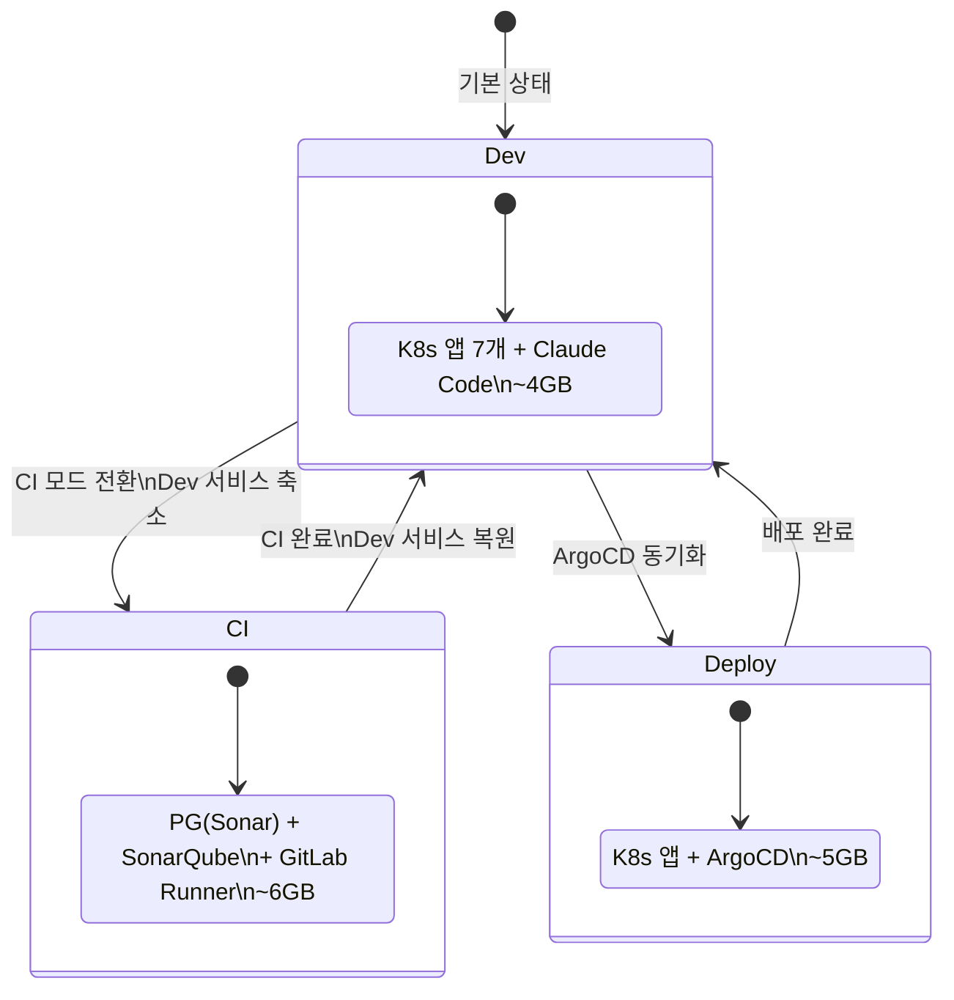
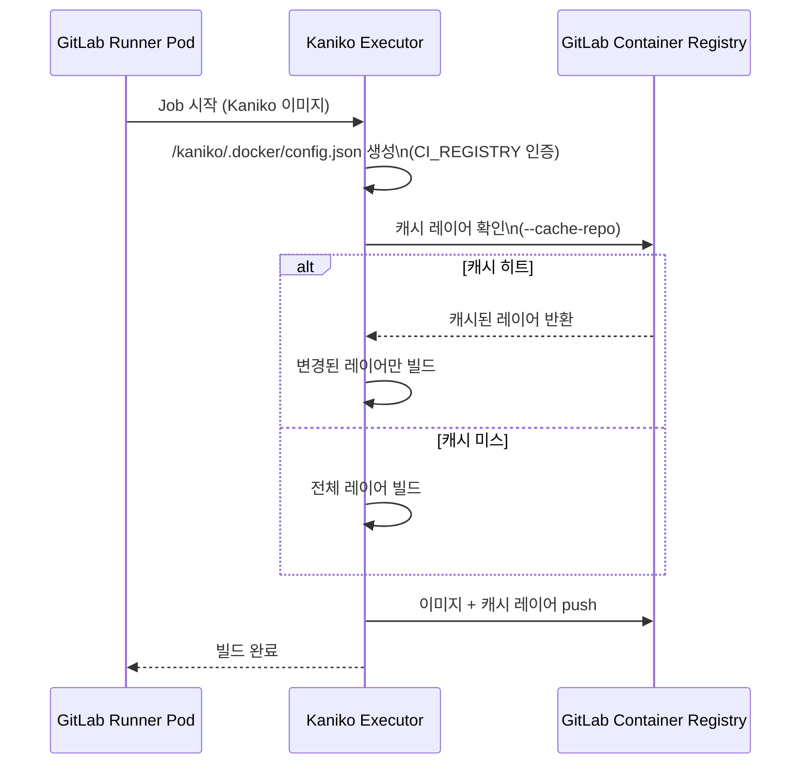
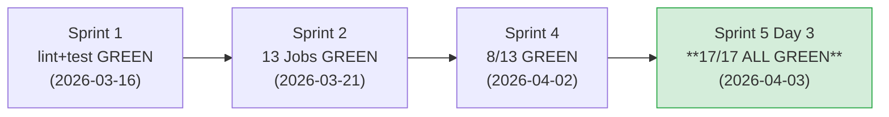
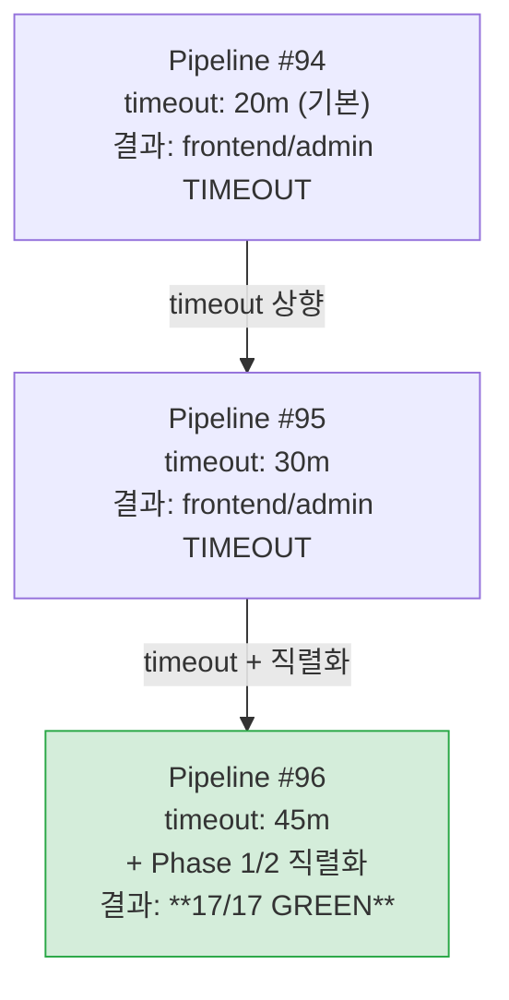
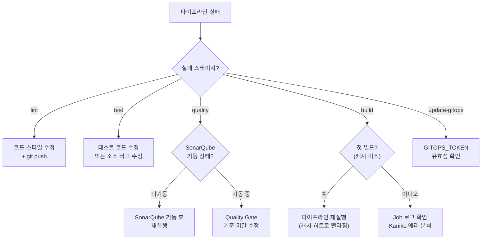

# 14. CI/CD 운영 매뉴얼

> 작성일: 2026-04-03
> 작성자: DevOps Agent
> 대상: RummiArena CI/CD 파이프라인 운영, 모니터링, 트러블슈팅
> 전제: `.gitlab-ci.yml` 구조와 각 stage 동작은 [11-devsecops-cicd-guide.md](./11-devsecops-cicd-guide.md) 참조

---

## 1. 파이프라인 운영 개요

### 1.1 현재 파이프라인 상태

| 항목 | 값 |
|------|-----|
| 최종 성공 | **Pipeline #96** (2026-04-03, 17/17 ALL GREEN) |
| Pipeline URL | https://gitlab.com/k82022603/RummiArena/-/pipelines/2427283301 |
| 총 Job 수 | 17개 (lint 4 + test 2 + quality 2 + build 4 + scan 4 + gitops 1) |
| 빌드 도구 | Kaniko v1.23.2 (DinD 대체) |
| 총 소요 시간 | ~35분 (첫 빌드 기준, 캐시 히트 시 ~15분 예상) |

### 1.2 파이프라인 실행 전 체크리스트

```
[ ] WSL2 메모리 프로파일: RummiArena (10GB) 활성화 확인
[ ] Docker Desktop K8s 정상 동작 확인: kubectl get nodes
[ ] GitLab Runner Pod Running 확인: kubectl get pods -n gitlab-runner
[ ] SonarQube 기동 확인 (CI 모드): http://localhost:9001/api/system/status
[ ] dev-values.yaml에 현재 이미지 태그 확인
```

### 1.3 교대 실행 전략

CI 모드와 Dev 모드는 동시 실행이 불가하다 (10GB WSL 제약).



---

## 2. 일반 운영 절차

### 2.1 파이프라인 실행 (main 브랜치 push)

```bash
# 1. GitHub + GitLab 동시 push
git push origin main
git push gitlab main

# 2. 파이프라인 모니터링 (glab CLI)
glab ci status
glab ci view

# 3. 또는 웹 UI 확인
# https://gitlab.com/k82022603/RummiArena/-/pipelines
```

### 2.2 파이프라인 재실행

```bash
# 마지막 파이프라인 재실행
glab ci retry

# 특정 job만 재실행 (웹 UI에서 Retry 버튼)
# https://gitlab.com/k82022603/RummiArena/-/pipelines/<ID>
```

### 2.3 CI 모드 전환 절차

```bash
# 1. Dev 서비스 축소 (옵션: 불필요한 서비스 스케일 다운)
kubectl scale deployment frontend admin ai-adapter ollama --replicas=0 -n rummikub

# 2. SonarQube 기동 확인
docker start sonarqube-rummiarena 2>/dev/null || \
  kubectl get pods -n sonarqube

# 3. Runner 상태 확인
kubectl get pods -n gitlab-runner

# 4. CI 실행 (git push gitlab main)
git push gitlab main

# 5. CI 완료 후 Dev 서비스 복원
kubectl scale deployment frontend admin ai-adapter ollama --replicas=1 -n rummikub
```

---

## 3. 빌드 전략: Kaniko

### 3.1 Kaniko 동작 원리

Kaniko는 Docker daemon 없이 userspace에서 컨테이너 이미지를 빌드한다. K8s Executor에서 privileged 권한 없이 실행 가능하며, 빌드된 이미지를 직접 Registry에 push한다.



### 3.2 빌드 직렬화 (Phase 1/2)

4개 Kaniko 빌드가 동시 실행 시 Registry push 대역폭 경쟁으로 타임아웃이 발생한다. 이를 해결하기 위해 2단계로 직렬화한다.

| Phase | 서비스 | needs 의존 | 소요 시간 (첫 빌드) |
|-------|--------|-----------|-------------------|
| 1 | game-server | (없음) | ~10.6m |
| 1 | ai-adapter | (없음) | ~4.2m |
| 2 | frontend | build-game-server | ~10.6m |
| 2 | admin | build-ai-adapter | ~6.1m |

> 첫 빌드 후 Kaniko 캐시가 Registry에 저장되므로, 이후 빌드는 변경된 레이어만 재빌드하여 ~3-5분 내 완료 예상.

### 3.3 Kaniko 캐시 전략

```yaml
# 캐시 관련 Kaniko 플래그
/kaniko/executor
    --cache=true                            # 레이어 캐시 활성화
    --cache-repo "${DOCKER_IMAGE}/cache"    # Registry에 캐시 저장
    --snapshot-mode=redo                    # 파일 변경 탐지 정확도 향상
    --compressed-caching=false              # 비압축 캐시 (속도 우선)
    --push-retry=3                          # push 실패 시 3회 재시도
```

---

## 4. 파이프라인 성공 이력

| Pipeline | 날짜 | 결과 | 핵심 변경 | 비고 |
|----------|------|------|----------|------|
| #96 | 2026-04-03 | **17/17 PASS** | timeout 45m + Phase 1/2 직렬화 | 첫 17/17 ALL GREEN |
| #95 | 2026-04-03 | 13/17 | timeout 30m | frontend/admin timeout |
| #94 | 2026-04-03 | 13/17 | DinD -> Kaniko 전환 | frontend/admin timeout |
| #93 | 2026-04-02 | 8/13 | Kaniko 빌드 도입 | DinD 연결 실패 |
| #71 | 2026-03-26 | failed | - | lint-go staticcheck 3건 |

### 4.1 주요 마일스톤



---

## 5. 트러블슈팅

### 5.1 DinD -> Kaniko 전환 (Pipeline #93 -> #94)

**문제**: K8s Executor에서 DinD 서비스 연결 실패

```
Cannot connect to the Docker daemon at tcp://docker:2375
```

**근본 원인**: `privileged=false` (K8s Executor 보안 정책) -> dockerd 기동 불가

**해결**: DinD를 완전 제거하고 Kaniko로 전환

| 항목 | 변경 전 (DinD) | 변경 후 (Kaniko) |
|------|--------------|----------------|
| 이미지 | `docker:26-dind` | `gcr.io/kaniko-project/executor:v1.23.2-debug` |
| 서비스 | `services: docker:26-dind` | 없음 |
| 인증 | `docker login` | `/kaniko/.docker/config.json` |
| 빌드 | `docker build` | `/kaniko/executor` |
| 스캔 | `docker run trivy` (소켓 마운트) | 별도 trivy job (Registry 풀링) |

### 5.2 빌드 타임아웃 (Pipeline #94 -> #96)

**문제**: Kaniko 전환 후 frontend/admin 빌드가 20m/30m timeout

**원인 분석**:
- Next.js 앱의 node_modules 레이어 ~500MB
- Kaniko 첫 빌드: 캐시 미스 -> 전 레이어 Registry push
- 4개 빌드 동시 push -> 대역폭 경쟁

**해결 (단계적)**:



**핵심 설정**:

```yaml
# timeout 상향
.build-kaniko: &build-kaniko
  timeout: 45m    # 20m -> 45m (첫 빌드 안전 마진)

# Phase 2 직렬화 (Phase 1 완료 후 시작)
build-frontend:
  needs: ["build-game-server"]    # Phase 1 완료 대기

build-admin:
  needs: ["build-ai-adapter"]    # Phase 1 완료 대기
```

### 5.3 Trivy 이미지 스캔 분리

**문제**: DinD 환경에서는 build job 내에서 docker socket으로 Trivy 스캔이 가능했으나, Kaniko는 Docker 소켓이 없음

**해결**: Trivy 이미지 스캔을 별도 job으로 분리. Registry에서 직접 풀링하여 스캔.

```yaml
.trivy-scan: &trivy-scan
  image:
    name: aquasec/trivy:0.58.2
    entrypoint: [""]
  variables:
    TRIVY_USERNAME: "${CI_REGISTRY_USER}"
    TRIVY_PASSWORD: "${CI_REGISTRY_PASSWORD}"

scan-game-server:
  <<: *trivy-scan
  needs: ["build-game-server"]
  script:
    - trivy image --exit-code 1 --severity CRITICAL
        "${DOCKER_IMAGE}/game-server:${CI_COMMIT_SHA}"
```

### 5.4 update-gitops sed 패턴 불일치 (Pipeline #93 이전)

**문제**: sed 패턴이 `registry.gitlab.com/...` 전체 경로를 매칭하지만, dev-values.yaml은 `rummiarena/game-server` (로컬 이미지) 형식이었음

**해결**: 섹션 범위 sed 패턴으로 변경. 각 서비스 섹션 내의 `repository:` + `tag:` 줄을 별도로 교체.

```bash
# 섹션 범위 sed: gameServer: ~ aiAdapter: 사이에서만 교체
sed -i "/gameServer:/,/aiAdapter:/{s|repository:.*|repository: $DOCKER_IMAGE/game-server|;s|tag:.*|tag: \"$CI_COMMIT_SHA\"|}"
```

### 5.5 Runner Pending (stuck_or_timeout_failure)

**증상**: Job이 "pending" 상태에서 멈춤

**확인 순서**:

```bash
# 1. Runner Pod 상태 확인
kubectl get pods -n gitlab-runner

# 2. Runner Pod 로그 확인
kubectl logs -n gitlab-runner -l app=gitlab-runner --tail=50

# 3. Runner 오프라인이면 재시작
kubectl rollout restart deploy/gitlab-runner -n gitlab-runner

# 4. 태그 불일치 확인 (GitLab UI)
# Settings -> CI/CD -> Runners -> Runner 클릭 -> Tags 확인
# 필요: k8s, rummiarena
```

### 5.6 SonarQube 접근 불가

**증상**: sonarqube job에서 `ERROR: SonarQube server not available`

```bash
# 1. SonarQube 서버 상태 확인
curl -s http://localhost:9001/api/system/status

# 2. K8s Pod에서 host.docker.internal 접근 확인
kubectl run sonar-test --rm -it --image=curlimages/curl --restart=Never -- \
  curl -s http://host.docker.internal:9001/api/system/status

# 3. SonarQube 미기동 시 기동
docker start sonarqube-rummiarena
```

---

## 6. 모니터링 명령어

### 6.1 파이프라인 모니터링

```bash
# 최근 파이프라인 목록
glab ci list

# 현재 파이프라인 상태
glab ci status

# 특정 파이프라인 상세
glab ci view <pipeline-id>

# Job 로그 확인
glab ci trace <job-id>
```

### 6.2 Runner 모니터링

```bash
# Runner Pod 상태
kubectl get pods -n gitlab-runner -w

# Runner 리소스 사용량
kubectl top pods -n gitlab-runner

# Runner 로그 (실시간)
kubectl logs -n gitlab-runner -l app=gitlab-runner -f --tail=100
```

### 6.3 Container Registry 확인

```bash
# Registry 이미지 목록 (glab)
glab api projects/:id/registry/repositories

# 이미지 태그 확인
glab api "projects/:id/registry/repositories/<repo-id>/tags"
```

---

## 7. 긴급 대응 절차

### 7.1 파이프라인 실패 시 대응 흐름



### 7.2 롤백 절차

```bash
# 1. 이전 커밋의 이미지 태그 확인
git log --oneline -5

# 2. dev-values.yaml에서 이전 SHA로 수동 복원
# helm/environments/dev-values.yaml 편집

# 3. ArgoCD 수동 동기화
argocd app sync rummikub

# 4. 또는 git revert 후 재배포
git revert HEAD
git push origin main
git push gitlab main
```

---

## 8. 관련 문서

| 문서 | 경로 | 내용 |
|------|------|------|
| DevSecOps CI/CD 구조 | [11-devsecops-cicd-guide.md](./11-devsecops-cicd-guide.md) | 파이프라인 전체 구조, stage 상세 |
| CI/CD 준비 체크리스트 | [13-cicd-readiness-checklist.md](./13-cicd-readiness-checklist.md) | 17/17 GREEN 달성 기록, 이슈 이력 |
| GitLab CI/CD 설정 | [09-gitlab-cicd-setup.md](./09-gitlab-cicd-setup.md) | GitLab 계정, Runner, Variables 설정 |
| GitLab Runner 가이드 | [10-gitlab-runner-guide.md](./10-gitlab-runner-guide.md) | Runner 설치/등록/관리 |
| K8s 아키텍처 | [../05-deployment/04-k8s-architecture.md](../05-deployment/04-k8s-architecture.md) | 배포 프로세스, GitOps 흐름 |

---

> **문서 이력**
> | 버전 | 날짜 | 작성자 | 내용 |
> |------|------|--------|------|
> | 1.0 | 2026-04-03 | DevOps Agent | 초안 작성 -- Pipeline #96 17/17 ALL GREEN 기준, DinD->Kaniko 전환 트러블슈팅, 운영 절차 |
