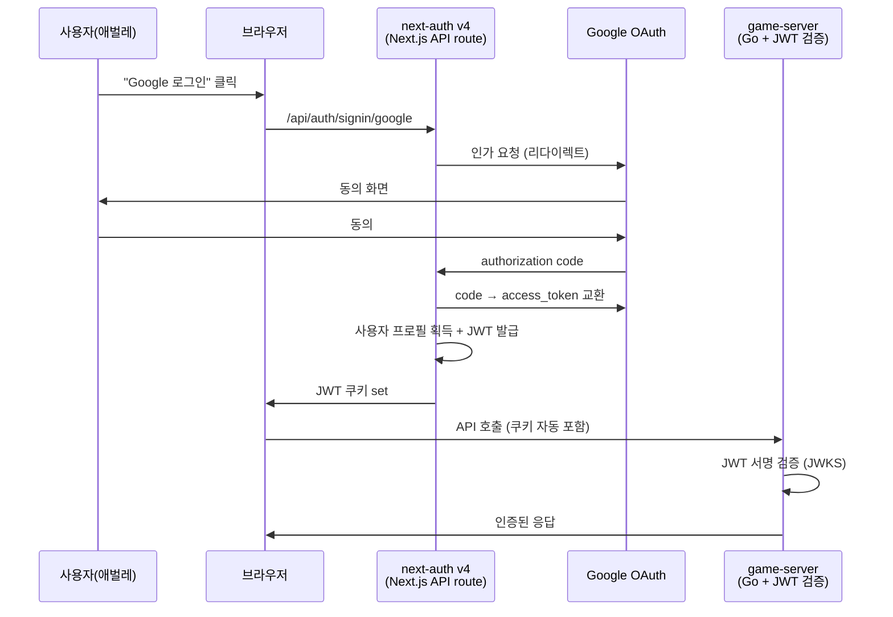

# 19. next-auth / Auth.js 기술 가이드 — 현 프로젝트(v4) 와 v5 이주 배경

- **작성일**: 2026-04-23 (Sprint 7 Day 2 저녁)
- **작성자**: Claude main (Opus 4.7 xhigh)
- **목적**: 프로젝트 구성원이 next-auth 가 무엇이고, 왜 v5 로 이주해야 하는지 공통 이해를 확보하기 위한 기술 개요 문서. 실제 이주 결정 사항은 별도 ADR `docs/02-design/52-adr-next-auth-v5-migration.md` 참조.
- **독자**: 애벌레 + 개발 에이전트 (frontend-dev, go-dev, architect, security)
- **비고**: ADR 과 역할이 다르다. ADR = 결정·절차, 본 문서 = 개념·배경·용어 해설

---

## 1. next-auth 란 무엇인가

**Next.js 용 인증(authentication) 라이브러리**. 오픈소스이며 NPM 패키지 `next-auth` 로 배포된다. 사용자가 웹사이트에 로그인하고, 세션을 유지하고, 권한을 확인하는 기능을 몇 줄 코드로 붙일 수 있게 해준다.

### 핵심 기능

| 기능 | 설명 | 예시 |
|------|------|------|
| OAuth 제공자 연동 | Google, GitHub, Facebook, Kakao 등 수십 곳과 통합 | 현 프로젝트: Google OAuth 2.0 |
| 세션 관리 | JWT 토큰 또는 DB 기반 세션 | 로그인 유지, 만료 처리 |
| 콜백 훅 | 로그인 성공 시 사용자 프로필 DB 저장 등 커스텀 로직 | `signIn`, `jwt`, `session` 콜백 |
| CSRF 방어 | 자동으로 CSRF 토큰 발급·검증 | 공격 방어 |
| 프론트엔드 helper | `useSession()` 훅, `getServerSession()` 함수 | UI 에서 로그인 상태 읽기 |
| 이메일·credentials | 이메일 매직 링크, 아이디·비밀번호 로그인 | (현 프로젝트 미사용) |

### 동작 흐름 — 현 프로젝트 기준

---

## 2. 현 프로젝트에서의 사용 현황 (v4)

### 2.1 파일 경로

| 파일 | 역할 |
|------|------|
| `src/frontend/src/app/api/auth/[...nextauth]/route.ts` | NextAuth 설정·핸들러 (Google provider, 콜백) |
| `src/frontend/src/hooks/*` (추정) | `useSession()` 호출부 |
| `src/frontend/src/components/**` | 로그인 상태 분기 UI |
| `src/frontend/middleware.ts` 또는 없음 | 미사용으로 확인됨 (SEC-B 감사 §2.4) |
| `src/game-server/internal/middleware/jwt.go` (추정) | NextAuth 가 발급한 JWT 를 game-server 측에서 검증 |

### 2.2 의존성 버전

- `next-auth`: v4.x (현재, `src/frontend/package.json`)
- peer 의존: `uuid<14` (취약점 경로, §4 참조)

### 2.3 설정 포인트

- `NEXTAUTH_SECRET` — JWT 서명 키 (K8s secret 주입)
- `NEXTAUTH_URL` — 자기 URL (helm values)
- `GOOGLE_CLIENT_ID`, `GOOGLE_CLIENT_SECRET` — Google Cloud Console 발급 (MEMORY.md "Google OAuth K8s 관리" 섹션 참조)

### 2.4 중요 원칙 (CLAUDE.md §6)

> **인증/인가 ↔ 사용자 프로필 완전 분리**: OAuth 핸들러에서 DisplayName, AvatarURL 등 프로필 정보를 절대 덮어쓰지 않는다. OAuth 는 identity 확인만, 프로필은 별도 API 에서 관리.

이 원칙은 v5 이주 후에도 유지.

---

## 3. v5 (Auth.js) 와의 차이

2024년 next-auth 가 **Auth.js** 로 리브랜딩되며 v5 가 나왔다. 이름은 바뀌었지만 NPM 패키지 이름은 여전히 `next-auth` (v5.x).

### 3.1 API 변화

| 영역 | v4 | v5 |
|------|-----|-----|
| 초기화 | `NextAuth(authOptions)` | `NextAuth(config)` — 공통 `auth()` helper 자동 export |
| 서버 컴포넌트 세션 | `getServerSession(authOptions)` | `auth()` (인자 없음) |
| 클라이언트 세션 | `useSession()` | `useSession()` (동일) |
| 로그인 트리거 | `signIn()` from `next-auth/react` | `signIn()` — 서버 액션 지원 추가 |
| 타입 확장 | `declare module "next-auth"` | 동일하지만 경로 일부 변경 |

### 3.2 Runtime 개선

- **Edge runtime 지원**: middleware, API route 를 Edge 에서 실행 가능 (더 빠른 콜드 스타트)
- **App Router 최적화**: Next.js 15 App Router 와 동작 매끄러움
- **TypeScript strict 모드** 공식 지원

### 3.3 Breaking changes (주요)

- `pages/api/auth/[...nextauth].ts` → `app/api/auth/[...nextauth]/route.ts` (이미 현 프로젝트는 App Router)
- `authOptions` export 이름·구조 변경
- Adapter API 변경 (DB 기반 세션 쓰는 경우. 현 프로젝트는 JWT 라 영향 적음)
- `NEXTAUTH_SECRET` → `AUTH_SECRET` (환경변수 이름 변경. v5 가 두 이름 모두 인식하지만 새 이름 권장)
- `NEXTAUTH_URL` → `AUTH_URL` (동일 원칙)

---

## 4. 왜 v5 로 이주해야 하나

### 4.1 보안 이유 (1차 동기)

- `next-auth v4` 의 의존성 체인에 `uuid<14` 가 포함됨
- `uuid<14` 는 **GHSA-w5hq-g745-h8pq** (Moderate) 취약점이 있음 — 예측 가능한 UUID 생성
- **v4 semver 범위 안에서는 해소 불가**. next-auth v4 가 uuid v9 를 고정 의존하고, uuid v9 는 v14 로 올리려면 메이저 bump 필요
- next-auth v5 는 uuid 의존성을 제거하거나 v14+ 로 교체함 → 취약점 자동 해소

### 4.2 미래 호환성 (2차)

- next-auth v4 는 **유지보수 모드**. 신규 기능 추가 없음
- Next.js 16/17 출시 시 v4 호환성 보장 안 됨
- Edge runtime, Server Actions 등 최신 Next 기능은 v5 만 지원

### 4.3 취약점 실제 위험도

UUID 예측 가능 문제는:
- 이론상: 세션 토큰 생성에 사용될 경우 공격자가 다음 세션 ID 추측 가능
- 현 프로젝트: JWT 서명 기반이라 UUID 가 세션 ID 로 직접 노출되지 않음
- 실제 공격 경로까지 여러 단계 필요 → Critical 은 아니고 Moderate

그럼에도 Production 기준으로는 "해소 가능한 취약점은 해소" 원칙이라 이주 대상.

---

## 5. 이주 시 주의사항

### 5.1 JWT 서명 키 호환성

`NEXTAUTH_SECRET` 은 v4 와 v5 가 동일한 HMAC-SHA256 알고리즘 사용. 기존 발급된 JWT 는 v5 전환 후에도 검증 가능 (세션 무효화 없음).

### 5.2 game-server 측 JWT 검증 영향

- v4 와 v5 모두 RFC 7519 표준 JWT 를 발급
- game-server `jwt.go` 의 JWKS 조회 · 서명 검증 로직은 변경 불필요 (추정)
- 단, JWT payload 필드 이름 변경 시 game-server 측 claim 추출 수정 필요. 이주 시 실제 payload diff 로 확인

### 5.3 사용자 세션 강제 로그아웃 여부

이주 후 첫 배포 직후 사용자 브라우저의 v4 세션 쿠키는:
- 이름 동일 (`next-auth.session-token`) → 유지됨
- 서명 키 동일 → 검증 성공

→ **강제 로그아웃 없음**. 사용자 경험 매끄러움.

### 5.4 MEMORY.md 원칙 지속 적용

- OAuth 핸들러에서 DisplayName/AvatarURL 덮어쓰기 절대 금지 (`feedback_auth_profile_separation.md`)
- `helm/charts/frontend/values.yaml` 에서 `GOOGLE_CLIENT_ID` 키 완전 제거 (2026-03-29 결정)
- `scripts/inject-secrets.sh` 가 `.env.local` 자동 참조

### 5.5 환경변수 네이밍 전환

- v5 기본값: `AUTH_SECRET`, `AUTH_URL`
- 하위 호환: `NEXTAUTH_SECRET`, `NEXTAUTH_URL` 도 인식
- **권장**: 이주 PR 에서 함께 변경. K8s ConfigMap + Helm values + `.env.local.example` 3곳 동기화

---

## 6. 검증 체크리스트 (이주 PR 배포 직후)

1. 기존 로그인 사용자가 재로그인 없이 접근 가능 (세션 유지)
2. 신규 로그인: Google OAuth 동의 화면 → 성공 → 로비 진입
3. game-server 측 JWT 검증: 일반 API 호출 성공 (401 Unauthorized 없음)
4. WebSocket 연결: JWT 서명 검증 경로 정상
5. 로그아웃: `signOut()` 호출 → 쿠키 제거 + 서버 세션 invalidate
6. Playwright E2E auth 스위트 전수 PASS
7. `npm audit --audit-level=high --omit=dev` frontend 0 건

---

## 7. 참고 자료

- Auth.js 공식 v5 마이그레이션: https://authjs.dev/getting-started/migrating-to-v5 (공식)
- GHSA-w5hq-g745-h8pq uuid 취약점: https://github.com/advisories/GHSA-w5hq-g745-h8pq
- 현 프로젝트 이주 결정: `docs/02-design/52-adr-next-auth-v5-migration.md` (architect-docs 작성 중)
- security 감사 근거: `docs/04-testing/78-sec-a-b-c-audit-delta.md` §3
- OAuth K8s 관리: `docs/03-development/README.md` "Google OAuth K8s" 섹션

---

## 8. 용어 정리 (빠른 참조)

| 용어 | 설명 |
|------|------|
| **OAuth** | 사용자가 비밀번호 노출 없이 제3자(Google 등) 에 자기 신원 증명하는 표준 |
| **OAuth provider** | 신원 증명을 제공하는 곳. Google, GitHub 등 |
| **JWT (JSON Web Token)** | 서명된 JSON. 쿠키/헤더에 담아 인증 정보 전달 |
| **Session strategy** | 세션 저장 방식. "jwt" (쿠키 내 JWT) vs "database" (DB 에 세션 row) |
| **Callback** | 인증 단계별 커스텀 훅 (signIn/jwt/session) |
| **Adapter** | DB 기반 세션 사용 시 DB 연결 추상화 |
| **middleware** | Next.js 의 요청 인터셉터. 인증 가드에 자주 사용 |
| **JWKS** | JSON Web Key Set. 공개 키 세트. JWT 서명 검증에 사용 |

---

**문서 끝.**
