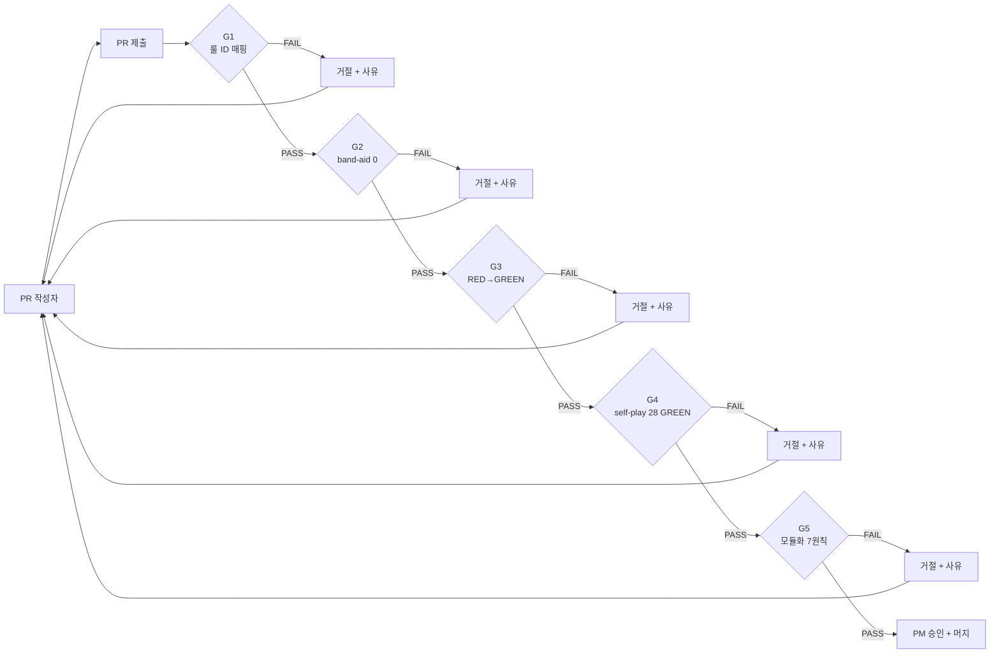

# 20 — PR 머지 게이트 운영 정책 (G1~G5)

- **작성**: 2026-04-25, pm
- **상위 결단**: `docs/02-design/61-phase-b-synthesis.md` §6.9 (Phase D 인수)
- **상위 dispatch**: `work_logs/plans/2026-04-25-phase-c-implementation-dispatch.md` §4
- **계승**: `docs/04-testing/88-test-strategy-rebuild.md` §6 (qa 산출물의 G1~G5 명세)
- **사용처**: 모든 PR 작성자 (frontend-dev / go-dev / designer / qa / security / architect / ai-engineer / devops / pm 본인)
- **발효 시점**:
  - **G1, G2, G3, G5**: 2026-04-25 (본 정책 발행 즉시)
  - **G4**: qa PR-D-Q08 (Phase D Day 7) 의 CI self-play stage GREEN 후
- **충돌 정책**: 본 정책과 기존 `.github/PULL_REQUEST_TEMPLATE.md` 충돌 시 → 본 정책 우선. 템플릿이 본 정책을 따라야.
- **사용자 명령 근거**: "PM은 철저히 감독하고 말이다. 어설프게 감독하지 마라." (2026-04-25)

---

## 0. 정책 개요

### 0.1 본 정책의 위치

본 sprint (Phase D, 2026-04-25~05-02) 부터 모든 PR 은 5개 게이트 (G1~G5) 를 통과해야 머지된다.



### 0.2 PM 자동 거절 권한

본 정책 발행 즉시 PM 은 다음 권한을 가진다:

- **G1~G5 어느 하나라도 위반 시 PR 머지 자동 거절**
- 거절 시 **PR 코멘트로 위반 게이트 + 항목 + 재제출 절차 명시**
- 재제출은 **위반 사유 해소 commit 추가** 후 PR 재요청
- **3회 이상 동일 사유 위반** 시 임시 스탠드업 소집

### 0.3 PR 작성자 의무

본 정책 발효 후 모든 PR 작성자는 다음을 첨부:

- [ ] G1: commit message 룰 ID 매핑 grep 결과
- [ ] G2: band-aid 패턴 grep 결과 0 hit
- [ ] G3: RED commit SHA + GREEN commit SHA + 양쪽 CI 결과
- [ ] G4: self-play 28 시나리오 GREEN report (CI artifact)
- [ ] G5: 모듈화 7원칙 self-check 7/7 ✓

---

## 1. G1 — commit message 룰 ID 매핑 검증

### 1.1 조건

신규/수정 commit 의 **모든 commit message 본문 또는 footer** 에 SSOT 룰 ID 1개 이상 명시.

**허용 룰 ID 패턴**:
- **V-NN** (서버 검증 룰, V-01 ~ V-19 + V-13a~e)
- **UR-NN** (UI 인터랙션 룰, UR-01 ~ UR-36)
- **D-NN** (데이터 무결성 룰, D-01 ~ D-12)
- **INV-GN** (전역 invariant, INV-G1 ~ INV-G5)
- **F-NN** (UI 기능 카탈로그, F-01 ~ F-25 — 60 SSOT)
- **A-NN** (행동 매트릭스 셀, A1 ~ A21 — 56 SSOT)
- **S-NN** (상태 머신 노드, S0 ~ S10 — 56b SSOT)
- **AC-NN.k** (acceptance criteria, 60 §6)
- **SEC-DEBT-NNN** (보안 부채, 89 §5)

### 1.2 자동화 (pre-commit + CI)

`scripts/check-commit-rule-id.sh` (Phase D Day 2 qa+devops 신설):

```bash
#!/usr/bin/env bash
# G1 게이트: commit message 룰 ID 매핑 검증
set -e

PATTERN='(V-[0-9]+[a-e]?|UR-[0-9]+|D-[0-9]+|INV-G?[0-9]+|F-[0-9]+|A[0-9]+|S[0-9]+|AC-[0-9]+\.[0-9]+|SEC-DEBT-[0-9]+)'

# 가장 최근 commit 검증 (pre-commit hook)
COMMIT_MSG=$(git log -1 --pretty=%B)

if ! echo "$COMMIT_MSG" | grep -qE "$PATTERN"; then
  echo "❌ G1 FAIL: commit message 에 SSOT 룰 ID 매핑 없음"
  echo "   허용 패턴: $PATTERN"
  echo "   현재 message:"
  echo "$COMMIT_MSG"
  exit 1
fi

echo "✅ G1 PASS"
```

### 1.3 PM 책임

- **PR 제출 시**: PM 이 commit log 직접 확인 + 본문에 룰 ID 1개 이상 표시
- **위반 시 거절 코멘트 형식**:
  ```
  G1 FAIL: commit "{title}" 에 룰 ID 매핑 없음.
  허용 패턴: V-NN / UR-NN / D-NN / INV-GN / F-NN / A-NN / S-NN / AC-NN.k / SEC-DEBT-NNN
  재제출: amend 또는 신규 commit 으로 룰 ID 추가 후 force-push.
  ```

### 1.4 예외

- **chore / docs / ci / build** prefix 의 commit (commitizen 표준) 은 예외 — 단 PR 본문에 영향 받는 룰 ID 명시 의무
- **revert / merge** commit 은 예외

---

## 2. G2 — band-aid 패턴 0 hit

### 2.1 조건

다음 grep 패턴이 신규/수정 코드에서 **0 hit**:

| 패턴 | 의도 | 예외 |
|------|------|------|
| `source.guard\|sourceGuard\|SourceGuard` | source guard 신설 금지 | (없음) |
| `invariant.validator\|invariantValidator\|InvariantValidator` | invariant validator 위협 토스트 금지 | INV-G2 property test 내 helper import 만 허용 |
| `detectDuplicateTileCodes` (helper 사용 검증) | helper 자체 검증 폐기 | property test 내 assertion 도구로만 |
| `BUG-UI-T11-INVARIANT\|BUG-UI-T11-SOURCE-GUARD` (토스트 코드) | 사고 ID 토스트 금지 | (없음) |
| `setLastError.*상태 이상\|invariant.*오류\|소스 불일치` (한글 카피) | 위협 카피 금지 | UR-21 룰 ID prefix 카피만 허용 |
| `useEffect.*assert.*throw` (런타임 throw) | 운영 throw 금지 | dev-only `process.env.NODE_ENV === "development"` 분기만 허용 |

### 2.2 자동화 (CI lint)

`scripts/check-band-aid-patterns.sh`:

```bash
#!/usr/bin/env bash
# G2 게이트: band-aid 패턴 0 hit 검증
set -e

VIOLATIONS=0

# 패턴 1: source guard
if grep -rE "source.?guard|SourceGuard" src/frontend/src/ --include="*.ts" --include="*.tsx" \
   | grep -v "/__tests__/" | grep -v "// G2-EXEMPT"; then
  echo "❌ G2 FAIL: source guard 패턴 발견"
  VIOLATIONS=$((VIOLATIONS+1))
fi

# 패턴 2: invariant validator
if grep -rE "invariant.?validator|InvariantValidator" src/frontend/src/ --include="*.ts" --include="*.tsx" \
   | grep -v "/__tests__/INV-G" | grep -v "// G2-EXEMPT"; then
  echo "❌ G2 FAIL: invariant validator 패턴 발견"
  VIOLATIONS=$((VIOLATIONS+1))
fi

# 패턴 3: 위협 한글 카피
if grep -rE "상태 이상|invariant.*오류|소스 불일치" src/frontend/src/ --include="*.ts" --include="*.tsx" \
   | grep -v "// G2-EXEMPT"; then
  echo "❌ G2 FAIL: 위협 카피 발견 (UR-34 위반)"
  VIOLATIONS=$((VIOLATIONS+1))
fi

# 패턴 4: helper 사용 검증 테스트
if grep -rE "describe.*detectDuplicateTileCodes" src/frontend/src/**/__tests__/ \
   | grep -vE "/INV-G2-tile-unique.prop"; then
  echo "❌ G2 FAIL: detectDuplicateTileCodes helper 사용 검증 테스트 발견"
  VIOLATIONS=$((VIOLATIONS+1))
fi

if [ $VIOLATIONS -gt 0 ]; then
  echo "❌ G2 FAIL: $VIOLATIONS 위반"
  exit 1
fi

echo "✅ G2 PASS"
```

### 2.3 예외 처리 (`// G2-EXEMPT`)

매우 드문 예외만 허용 (PM 사전 승인 필수). 코드 라인 끝에 주석:

```ts
const validator = createInvariantValidator(...); // G2-EXEMPT: dev-only assertion (PR-D-Q04)
```

PR description 에 예외 사유 + PM 승인 SHA 명시.

### 2.4 PM 책임

- **PR 제출 시**: G2 grep 결과 0 hit 확인
- **위반 시 거절 코멘트 형식**:
  ```
  G2 FAIL: band-aid 패턴 발견.
  파일/라인: {file}:{line}
  패턴: {pattern}
  근거: docs/02-design/55 UR-34/UR-35/UR-36 (band-aid 금지)
  사용자 명령 (2026-04-25): "guard 만들어 놓은 것 모두 없애... 게임룰에 의한 로직을 만들란 말이다."
  재제출: 본질 원인 코드 수정 (atomic 보장 / 명세 게이트) 후 force-push.
  ```

---

## 3. G3 — RED→GREEN 전환 증거

### 3.1 조건

모든 신규/수정 PR 은 **두 commit 분리**:

1. **RED commit** — 테스트만 추가, 구현 없음. CI 에서 RED 확인.
2. **GREEN commit** — 코드 수정으로 RED → GREEN 전환.

PR description 에 다음 첨부:

- RED commit SHA + 그 commit 의 CI URL (RED 결과 표시)
- GREEN commit SHA + 그 commit 의 CI URL (GREEN 결과 표시)

### 3.2 자동화 (MR 템플릿 + CI)

`.github/PULL_REQUEST_TEMPLATE.md` (본 정책 발효 후 갱신):

```markdown
## G3 — RED→GREEN 증거

### RED commit
- SHA: `{RED_SHA}`
- CI URL: {RED_CI_URL}
- RED 결과 (필수): 첨부 스크린샷 또는 CI log link

### GREEN commit
- SHA: `{GREEN_SHA}`
- CI URL: {GREEN_CI_URL}
- GREEN 결과: 첨부 스크린샷 또는 CI log link

### G3 자동 검증
- [ ] RED commit 의 CI 결과가 RED (`failed`) 임을 확인
- [ ] GREEN commit 의 CI 결과가 GREEN (`passed`) 임을 확인
- [ ] 두 commit 사이 변경 = 코드 (테스트 외부) 만 (테스트 추가 commit 이 RED commit 에 포함됨)
```

CI workflow `scripts/check-red-green-evidence.sh` (Phase D Day 2 devops 신설):

```bash
#!/usr/bin/env bash
# G3 게이트: RED→GREEN 분리 commit 검증
RED_SHA="${1:-}"
GREEN_SHA="${2:-}"

if [ -z "$RED_SHA" ] || [ -z "$GREEN_SHA" ]; then
  echo "❌ G3 FAIL: RED_SHA 또는 GREEN_SHA 누락"
  exit 1
fi

# RED commit 의 CI 결과 검증
RED_STATUS=$(gh api "/repos/k82022603/RummiArena/commits/$RED_SHA/check-runs" \
  --jq '.check_runs[] | select(.name == "test") | .conclusion' | head -1)

if [ "$RED_STATUS" != "failure" ]; then
  echo "❌ G3 FAIL: RED commit ($RED_SHA) 가 실제로 RED 가 아님 (status=$RED_STATUS)"
  exit 1
fi

GREEN_STATUS=$(gh api "/repos/k82022603/RummiArena/commits/$GREEN_SHA/check-runs" \
  --jq '.check_runs[] | select(.name == "test") | .conclusion' | head -1)

if [ "$GREEN_STATUS" != "success" ]; then
  echo "❌ G3 FAIL: GREEN commit ($GREEN_SHA) 가 실제로 GREEN 가 아님 (status=$GREEN_STATUS)"
  exit 1
fi

echo "✅ G3 PASS: RED→GREEN 증거 확인"
```

### 3.3 PM 책임

- **PR 검토 시**: RED commit 의 CI 결과 직접 확인 (RED 인지)
- **GREEN commit 의 변경**: 코드만 (테스트 추가 외) — 테스트가 GREEN commit 에 추가되면 RED→GREEN 분리 의미 소실
- **위반 시 거절 코멘트 형식**:
  ```
  G3 FAIL: RED commit 또는 GREEN commit 누락 / RED 가 실제로 RED 가 아님.
  근거: 사용자 명령 (2026-04-24) "RED 없이 구조 제안하면 회귀 유발".
  재제출: RED commit 분리 (테스트만 추가) → CI RED 확인 → GREEN commit (구현) 추가.
  ```

### 3.4 예외

- **순수 docs PR** (`.md` 만 변경): G3 면제. 단 PR description 에 "docs-only" 명시
- **dependency bump PR** (Renovate / Dependabot): G3 면제. CI GREEN 만 확인

---

## 4. G4 — self-play harness 28 GREEN

### 4.1 조건

PR 머지 전 `npm run self-play -- --scenarios=all` 결과 **28/28 GREEN**.

시나리오 목록 (88 §5.3):

| 카테고리 | 시나리오 ID | 건수 |
|---------|------------|------|
| S-Normal | S-N01 ~ S-N06 | 6 |
| S-Incident | S-I01 ~ S-I06 | 6 |
| S-Reject | S-R01 ~ S-R08 | 8 |
| S-State | S-S01 ~ S-S05 | 5 |
| S-Edge | S-E01 ~ S-E03 | 3 |

### 4.2 자동화 (CI new stage)

`.gitlab-ci.yml` 또는 `.github/workflows/ci.yml` 에 신설:

```yaml
self-play:
  stage: self-play
  needs: [build-frontend, build-game-server, build-ai-adapter]
  script:
    - kubectl apply -f k8s/test-environment/
    - sleep 30  # services warmup
    - npm run self-play -- --scenarios=all --reporter=junit --output=self-play-report.xml
  artifacts:
    when: always
    paths:
      - self-play-report.xml
    reports:
      junit: self-play-report.xml
  retry:
    max: 1
    when: runner_system_failure
```

### 4.3 GREEN 기준

- **28/28 PASS**
- **DOM invariant**: `data-tile-code` 중복 0, `data-group-id` 중복 0
- **WS message trace**: 56b §4.2 순서 강제
- **상태 trace**: `data-state` 속성 수집 → 56b 다이어그램 path 매칭
- **screenshot diff**: designer 57 시각 토큰 회귀 0
- **콘솔 로그**: `[BUG-UI-T11-*]` / `band-aid` / 경고 0

### 4.4 PM 책임

- **PR 제출 시**: CI artifact `self-play-report.xml` 확인 → 28/28 PASS
- **RED 1건 이상 발견 시 즉시 거절**:
  ```
  G4 FAIL: self-play harness {N}/28 RED.
  RED 시나리오: {scenarios}
  근거: 60 §7.1 "self-play harness GREEN 일 때만 사용자 배포".
  재제출: RED 시나리오 본질 원인 수정 후 self-play 재실행 28/28 GREEN 첨부.
  ```

### 4.5 발효 시점

- **2026-05-01 (Phase D Day 7)** qa PR-D-Q08 의 CI self-play stage 신설 GREEN 후 발효
- 그 전까지는 manual 검증 (qa 가 로컬 실행 + report 첨부)

### 4.6 예외

- **순수 docs PR**: G4 면제
- **순수 backend service PR** (frontend 변경 없음): G4 부분 면제 — S-Reject 8 + S-Edge 3 만 GREEN 의무 (총 11)

---

## 5. G5 — 모듈화 7원칙 self-check

### 5.1 조건

PR description 에 모듈화 7원칙 self-check 7개 항목 모두 ✓ 체크.

근거: `/home/claude/.claude/plans/reflective-squishing-beacon.md` §제1원칙

### 5.2 PR 템플릿

`.github/PULL_REQUEST_TEMPLATE.md` 에 추가:

```markdown
## G5 — 모듈화 7원칙 self-check

- [ ] **§1 SRP** — 1 파일 1 책임 (예: A06-pending-to-server.test.ts 는 A6 셀 단독)
- [ ] **§2 순수 함수 우선** — 부작용 격리, 도메인 로직 순수
- [ ] **§3 의존성 주입** — import 직접 결합 최소화, deps 인자 주입
- [ ] **§4 계층 분리** — UI / 상태 / 도메인 / 통신 4계층 명확
- [ ] **§5 테스트 가능성** — describe/it 명에 SSOT 룰 ID 명시
- [ ] **§6 수정 용이성** — 룰 1개 변경 시 1~3 파일만 수정
- [ ] **§7 band-aid 금지** — G2 게이트 통과 (룰 ID 매핑 없는 가드/토스트 0)

각 항목에 **구체적 근거** 1줄 첨부 (예: "F-05 atomic transfer 는 dragEndReducer.case(A6) 단일 분기에서 처리" — SRP 충족).
```

### 5.3 PM 책임

- **PR 검토 시**: 7 체크박스 모두 ✓ + 각 항목 근거 1줄 확인
- **체크 누락 또는 근거 부실 시 거절**:
  ```
  G5 FAIL: 모듈화 7원칙 self-check 7/7 미충족.
  미충족 항목: {예: §6 수정 용이성 — 룰 1개 변경 시 5 파일 수정 필요}
  근거: 본 sprint 의 정량 기준 = 1~3 파일.
  재제출: 본질 원인 분리 (계층 추출 / hook 분리 / domain pure func 추출) 후 self-check 재작성.
  ```

### 5.4 예외

- **chore / docs PR**: §1, §2, §5, §6, §7 면제 (§3, §4 은 적용)
- **CI/CD PR**: §2 면제 (인프라 작업), 나머지 적용

---

## 6. 게이트 위반 시 PM 자동 거절 + 재제출 절차

### 6.1 거절 절차

1. **PR 자동 검증 fail** (CI 또는 PM 수동)
2. **PM 코멘트 거절** — 위반 게이트 + 항목 + 재제출 절차 명시
3. **PR draft 전환** (선택) 또는 review 변경 요청
4. **작성자가 위반 사유 해소 commit** 추가
5. **CI 재실행** + PM 재검토

### 6.2 재제출 의무 사항

- 위반 사유에 대응하는 **구체적 코드 변경** (단순 reword 금지)
- 변경된 commit 의 SHA + 위반 해소 근거 PR 코멘트 추가
- 같은 게이트 위반 **2회 이상 반복 시 PM 임시 스탠드업 소집**

### 6.3 반복 위반 escalation

| 위반 횟수 | 조치 |
|---------|------|
| 1회 | 정상 거절 + 재제출 |
| 2회 | PR 코멘트 + Slack/카카오톡 알림 |
| **3회 이상** | **임시 스탠드업 소집** (PM + 작성자 + 관련 에이전트 1명) — 근본 원인 회의 |
| 5회 이상 | sprint 일정 영향 평가 + 사용자 보고 |

### 6.4 게이트 통과 PR 의 머지 절차

1. PM 이 "G1~G5 PASS 확인" 코멘트
2. PM 이 "Approve" review 추가
3. 작성자가 머지 (또는 PM 이 직접)
4. main 브랜치 push 후 즉시 K8s 재빌드 (PR #82 사고 교훈 — 머지 후 즉시 재빌드 강제)

---

## 7. 게이트 운영 책임 매트릭스

| 게이트 | 자동화 책임 | 검증 책임 | 거절 권한 | 예외 승인 |
|-------|----------|---------|---------|---------|
| G1 | qa + devops | PM | PM | PM |
| G2 | qa + devops | PM | PM | PM (G2-EXEMPT 주석) |
| G3 | devops + qa | PM | PM | PM (docs/dep bump 면제) |
| G4 | qa | PM | PM | PM (BE-only 부분 면제) |
| G5 | (수동) | PM | PM | PM (chore/docs 부분 면제) |

### 7.1 PM (애벌레) 의 일일 책임

- **매일 09:00 스탠드업**: 전일 머지된 PR 의 G1~G5 통과 여부 보고
- **매일 18:00 마감**: 미머지 PR 의 게이트 위반 현황 + 차단 사유 기록 (`work_logs/scrums/`)

### 7.2 작성자 (frontend-dev/go-dev/designer/qa/security/architect) 의무

- **PR 제출 전 self-check** — 본 §1~§5 의 PR 템플릿 항목 체크박스 모두 ✓
- **CI 결과 첨부** — RED/GREEN/self-play artifact 모두 PR description
- **거절 코멘트에 24시간 내 응답** — 재제출 또는 사유 근거 문답

### 7.3 devops 의무

- **자동화 스크립트 4종 신설** (Phase D Day 2):
  - `scripts/check-commit-rule-id.sh` (G1)
  - `scripts/check-band-aid-patterns.sh` (G2)
  - `scripts/check-red-green-evidence.sh` (G3)
  - CI self-play stage (G4, Phase D Day 7)
- **pre-commit hook 설치 가이드** 발행 (`docs/03-development/21-pre-commit-setup.md`, Phase D Day 2)

### 7.4 qa 의무

- **G2 패턴 정기 갱신** (월 1회) — 신규 band-aid 패턴 식별 시 추가
- **G4 self-play 시나리오 갱신** — 사용자 사고 신규 발생 시 24시간 내 추가
- **게이트 위반 PR 의 통계 보고** — 매주 금 18:00

---

## 8. 본 정책 self-check (모듈화 7원칙)

| 원칙 | 본 정책 적용 |
|------|------------|
| **SRP** | 본 정책 = "PR 머지 게이트 운영" 단일 책임. 게이트 정의는 88 SSOT, dispatch 는 별도 명령서 |
| **순수 함수 우선** | 입력 (PR) → 출력 (PASS/FAIL) 결정론적 |
| **의존성 주입** | SSOT 55/56/56b/57/60/87/88/89 모두 명시 인용 |
| **계층 분리** | §1 G1 / §2 G2 / §3 G3 / §4 G4 / §5 G5 / §6 거절 / §7 책임 — 7 계층 |
| **테스트 가능성** | 자동화 스크립트 4종 + PR 템플릿 체크박스 7 = 모든 게이트 검증 가능 |
| **수정 용이성** | 게이트 1개 추가 시 §N 1 절 + §0.1 다이어그램 1 노드 |
| **band-aid 금지** | G2 자체가 band-aid 차단 정책. 본 정책의 모든 거절 사유는 룰 ID 매핑 |

**self-check**: 7/7 ✅

---

## 9. 변경 이력

- **2026-04-25 v1.0**: 본 정책 발행. Phase C 결단 §6.9 + 88 §6 입력. G1~G5 자동화 스크립트 4종 정의 + PR 템플릿 갱신 의무 + PM 자동 거절 권한. G1/G2/G3/G5 즉시 발효, G4 는 Phase D Day 7 (2026-05-01) 발효.

---

**서명**: pm (애벌레 GO 사인 인수, 2026-04-25)
**발효**: 본 정책 발행 즉시 (2026-04-25)
**다음 액션**: devops 자동화 스크립트 4종 신설 (Phase D Day 2) + qa PR 템플릿 갱신 (Phase D Day 2)
