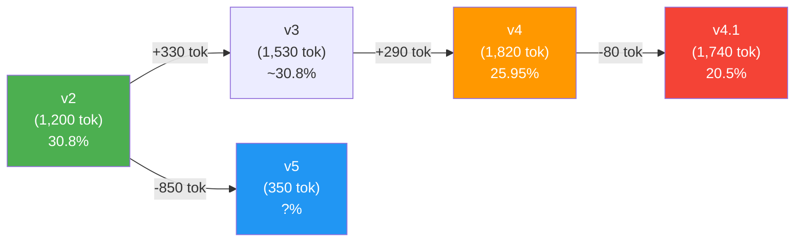
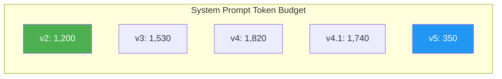

# 23. 프롬프트 V5.0 — Zero-Shot Reasoning 설계

- 작성일: 2026-04-17 (Sprint 6 Day 6)
- 작성자: ai-engineer + 애벌레
- 상태: 구현 완료
- 연관 문서:
  - `docs/03-development/22-round6-v4-vs-v2-comparison.md` (v2 > v4 > v4.1 실증)
  - `docs/02-design/42-prompt-variant-standard.md` (SSOT)
  - `docs/02-design/21-reasoning-model-prompt-engineering.md` (v2 설계 원본)

---

## 1. 배경

### 1.1 실증 데이터 — 복잡할수록 성능 하락



| 지표 | v2 | v4 | v4.1 |
|------|:---:|:---:|:---:|
| Place rate | **30.8%** | 25.95% | 20.5% |
| Avg response | 211s | 320s | 272s |
| Max response | 356s | 691s | 711s |
| Fallback | 0 | 0.5/game | 1 |
| System prompt | 1,200 tok | 1,820 tok | 1,740 tok |

### 1.2 Nature 논문 근거

DeepSeek-R1 Nature 게재 논문 (`nature.com/articles/s41586-025-09422-z`) 의 핵심 발견:

> **"Few-shot prompting consistently degrades performance in reasoning models."**

권장 접근법:
1. **Zero-shot** — 예시 없이 문제만 기술
2. **Directly describe the problem** — 규칙 + 현재 상태
3. **Specify the output format** — 출력 형식만 명시

### 1.3 RummiArena 실증과 Nature 논문의 수렴

v2→v4→v4.1 의 3단계 regression 은 Nature 논문의 예측과 정확히 일치:
- v2 에 포함된 **Few-shot 5개**도 성능을 저해했을 가능성 (v2 가 ceiling 이 아닐 수 있음)
- v4 의 **Step-by-step/5축/Checklist** 가 모델 고유 추론을 방해
- v4.1 에서 TB 만 빼면 남은 복잡성이 오히려 더 큰 방해

---

## 2. v5.0 설계 원칙

| 원칙 | 구현 |
|------|------|
| **Zero-shot** | Few-shot 예시 0개. Task demonstration 완전 제거 |
| **Direct problem description** | 게임 규칙 서술 + 최소 VALID/INVALID 예시 (규칙 명확화용, 각 1개) |
| **Specify output format** | JSON 스키마 2종 (draw/place) 만 명시 |
| **메타인지 지시 제거** | Checklist, Step-by-step, 5축, Action Bias, Thinking Budget 전부 제거 |
| **3모델 공통** | deepseek-reasoner, claude, openai 동일 프롬프트 |

---

## 3. v2 → v5 변경 상세

### 3.1 제거 항목 (v2 기준, -850 tokens)

| 섹션 | v2 토큰 | v5 | 제거 근거 |
|------|:---:|:---:|------|
| Few-shot 5개 | ~300 | **제거** | Nature: "few-shot consistently degrades" |
| Validation Checklist 7항목 | ~80 | **제거** | 메타인지 지시 = 모델 추론 방해 |
| Step-by-step 9단계 | ~100 | **제거** | 동일 |
| VALID/INVALID 예시 다수 | ~200 | 각 1개 유지 (~40) | 최소 규칙 명확화만 유지 |
| User prompt "Your Task" 섹션 | ~40 | **제거** | 시스템 프롬프트에서 역할 명시 |
| User prompt "Validation Reminders" | ~30 | **제거** | 메타인지 지시 |

### 3.2 유지 항목

| 섹션 | 이유 |
|------|------|
| Tile Encoding | 타일 코드 해석 필수 (압축) |
| Rules (GROUP/RUN/SIZE) | 게임 규칙 = 문제 정의 |
| Initial Meld Rule | 핵심 게임 메커닉 |
| Table State Rule | tableGroups 포맷 요구사항 |
| Response Format | JSON 출력 형식 |
| GROUP VALID/INVALID 1쌍 | a/b suffix 혼동 방지 (실전 오류 #1) |
| RUN VALID/INVALID 1쌍 | gap 오류 방지 |

---

## 4. 토큰 비교



| Variant | System Prompt | 대비 v2 |
|---------|:---:|:---:|
| v2 | 1,200 tok | baseline |
| v3 | 1,530 tok | +28% |
| v4 | 1,820 tok | +52% |
| v4.1 | 1,740 tok | +45% |
| **v5** | **350 tok** | **-71%** |

---

## 5. 구현 파일

| 파일 | 역할 |
|------|------|
| `src/ai-adapter/src/prompt/v5-reasoning-prompt.ts` | 시스템/유저/재시도 프롬프트 |
| `src/ai-adapter/src/prompt/registry/variants/v5.variant.ts` | PromptRegistry 등록 메타데이터 |
| `src/ai-adapter/src/prompt/registry/prompt-registry.service.ts` | registerBuiltinVariants 에 v5 추가 |
| `src/ai-adapter/src/prompt/registry/prompt-registry.service.spec.ts` | 7개 변형 등록 + v5 zero-shot 검증 테스트 |

---

## 6. 검증 계획

### 6.1 Smoke Test (Round 8 전)

```bash
# v5 활성화 (DeepSeek 단독)
kubectl -n rummikub set env deploy/ai-adapter \
  DEEPSEEK_REASONER_PROMPT_VARIANT=v5

# 10턴 smoke test
python scripts/ai-battle-3model-r4.py --models deepseek --max-turns 10
```

성공 기준: 0 fallback, JSON 파싱 성공, 10턴 내 1회 이상 place

### 6.2 Round 8 본 대전

| 대전 | 모델 | Variant | 턴 |
|------|------|---------|:---:|
| R8-1 | DeepSeek v5 | v5 | 80 |
| R8-2 | Claude v5 | v5 | 80 |
| R8-3 | OpenAI v5 | v5 | 80 |

### 6.3 성공 기준

| 지표 | 기준 |
|------|------|
| Place rate (DeepSeek) | ≥ 30.8% (v2 동등 이상) |
| Fallback (500s budget) | 0 |
| Avg response | ≤ v2 수준 (~211s) |

---

## 7. 리스크

| 리스크 | 완화 |
|--------|------|
| Zero-shot 에서 JSON 포맷 오류 증가 | 시스템 프롬프트에 명확한 JSON 예시 유지 |
| 규칙 예시 부족으로 GROUP 색상 오류 증가 | VALID/INVALID 1쌍 유지 (a/b suffix 혼동 방지) |
| v5 가 v2 보다 나쁠 경우 | v2 로 즉시 롤백 (env 변경만) |

---

## 8. 변경 이력

| 일자 | 변경 | 담당 |
|------|------|------|
| 2026-04-17 | 초판 작성 — v5.0 zero-shot 설계 + 구현 | ai-engineer + 애벌레 |
