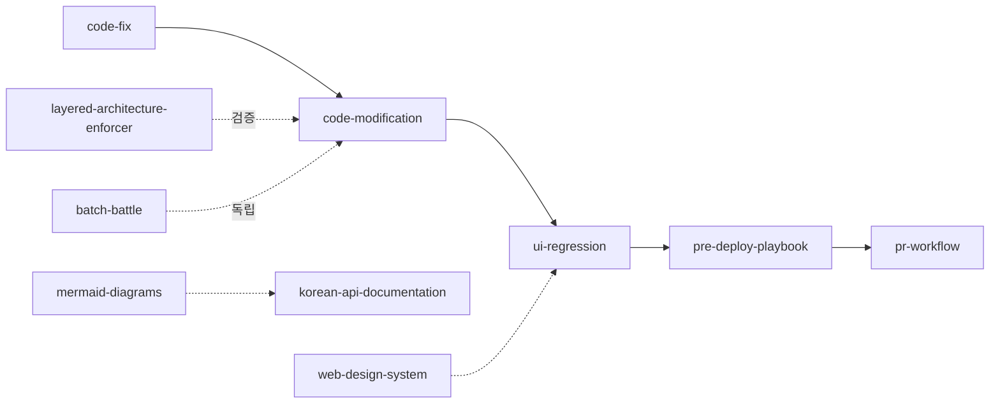

# 24. Skills Catalog — 프로젝트 SKILL 명세

- **작성일**: 2026-04-21 (Day 11)
- **대상 디렉토리**: `.claude/skills/`
- **용도**: 프로젝트 고유 SKILL 10개의 목적·트리거·주요 Phase·연동 관계 일람. 신규 멤버·에이전트·미래의 Claude 세션이 빠르게 파악.

## 1. SKILL 이란

Claude Code 의 SKILL 은 특정 작업 패턴을 **표준 절차로 캡슐화**한 문서 + 실행 가이드. 프로젝트 `.claude/skills/<name>/SKILL.md` 에 존재하며, Claude Skill tool 로 호출되거나 Claude 메인 세션이 맥락 감지 후 자동 적용.

**공식 SKILL vs 프로젝트 SKILL**:
- 공식: Anthropic 배포 (update-config, claude-api, loop, schedule 등)
- 프로젝트: 본 문서에 나열된 10개 — RummiArena 고유 워크플로우

## 2. SKILL 10개 일람

| # | SKILL | 트리거 | 핵심 역할 | 신설일 |
|---|-------|--------|----------|--------|
| 1 | `batch-battle` | "AI 대전", "round 실행", "N=3 배치" | AI 대전 배치 실행 (환경 검증 → 실행 → 모니터링 → 정리) | Sprint 5 |
| 2 | `code-fix` | "이 버그 고쳐줘", "코드 수정" | 코드 수정 워크플로우 (architect 분석 → dev 구현 → qa 검증) | Sprint 4 |
| 3 | `code-modification` | dev 에이전트 spawn 시, "수정" | 코드 수정 4단계 (분석→계획→구현→검증) 표준 | Sprint 4 |
| 4 | `korean-api-documentation` | "API 문서 만들어", OpenAPI 작성 | 한글 API 문서화 표준 | Sprint 2 |
| 5 | `layered-architecture-enforcer` | 계층 위반 감지, 리팩토링 | 레이어드 아키텍처 원칙 보호 | Sprint 3 |
| 6 | `mermaid-diagrams` | 다이어그램 작성, 설계 문서 | Mermaid 다이어그램 작성 표준 | Sprint 1 |
| 7 | `pr-workflow` | "PR 만들어", "push/merge" | PR 작업 가드레일 (L1~L6 사전 합의) | Sprint 6 Day 11 (`2026-04-21`) |
| 8 | `pre-deploy-playbook` | Pod 재배포 직후, 사용자 전달 직전 | 배포 전 Claude 가 사용자 대리 플레이 | Sprint 6 Day 11 |
| 9 | `ui-regression` | UI 파일 수정, PR 전 | UI 회귀 테스트 실행 + 시나리오 추가 가드레일 | Sprint 6 Day 11 |
| 10 | `web-design-system` | UI 설계, 디자인 | 웹 디자인 시스템 (anti-pattern + verbalized sampling) | Sprint 2 |

## 3. SKILL 카드 상세

### 3.1 batch-battle

**트리거**: AI 대전 스크립트 실행 (`scripts/ai-battle-*.py`), 라운드 다수 실측, v6 shaper 등 배치 검증
**핵심 Phase**:
- Phase 0: 환경 검증 (DNS, K8s Pod, Istio, 비용 quota)
- Phase 1: argparse 사전 검증 + dry-run turn=2 강제
- Phase 2: 실행
- Phase 3: 15분 주기 능동 보고 + 10개 지표 고정 테이블 (`3c` 서브섹션, 2026-04-21 추가)
- Phase 4: Cleanup (pstree + orphan 프로세스 확인)
**금지**: 사전 검증 누락, monitoring 문서 사후 복원
**기반 문서**: `docs/04-testing/63-v6-shaper-final-report.md` Part 3 반성 6건 반영

### 3.2 code-fix

**트리거**: "이거 고쳐줘", 버그 리포트 대응
**핵심 Phase**: architect 분석 계획서 → dev 구현 → qa 검증 → main 세션 종합
**금지**: architect 분석 없이 dev 직접 수정, 검증 누락
**연동**: `code-modification` (dev 가 수정 시 반드시 따름)

### 3.3 code-modification

**트리거**: dev 에이전트(go-dev/node-dev/frontend-dev) 모든 코드 수정 작업
**핵심 Phase**:
- Phase 1: 분석 (호출자·피호출·테스트 존재 확인)
- Phase 2: 계획 (변경 내용·이유·범위 명시)
- Phase 3: 구현
- Phase 4: 검증 (빌드·테스트·셀프 리뷰·롤백 준비)
**Phase 4 티어링**: 핫픽스 최소 / 표준 / 릴리스 (긴급도별)
**SSOT 매핑**: 에이전트 모델 / 타임아웃 / 프롬프트 variant / 게임룰 / 에러코드 — 각각 전용 체크리스트로 라우팅

### 3.4 korean-api-documentation

**트리거**: OpenAPI spec 작성, REST/WS API 문서화
**핵심**: 한글 용어 통일, 예외 처리 패턴 설명, Error code 테이블

### 3.5 layered-architecture-enforcer

**트리거**: handler → service → repository 계층 위반 감지
**핵심**: 계층 역방향 import 금지, 계층 건너뛰기 금지
**적용 대상**: game-server (Go), ai-adapter (NestJS), admin (Next.js)

### 3.6 mermaid-diagrams

**트리거**: 아키텍처 다이어그램, 플로우차트, 시퀀스 다이어그램 필요
**핵심**: 노드에 한글 설명 포함, 다이어그램 유형 선택 (flowchart / sequence / state / er / class / gantt)
**금지**: ASCII art, 텍스트 박스 다이어그램

### 3.7 pr-workflow

**트리거**: "PR 만들어", "push 해줘", "머지" — branch/commit/push/PR/merge 관련 작업
**핵심 Phase**:
- Phase 0: 사전 합의 (Scope L1~L6, branch 정책, merge 권한, 사후 정리)
- Phase 1: 작업 실행
- Phase 2: 사후 보고
**Scope 정의**:
| Level | 의미 | 위험도 |
|-------|------|--------|
| L1 | Local only | 낮음 |
| L2 | Commit only | 낮음 |
| L3 | Push to branch | 중간 |
| L4 | PR draft | 중간 |
| L5 | PR ready for review | 중간 |
| L6 | Merge included | 높음 |
**금지**: default 임의 적용, 합의 없는 merge, force push to main

### 3.8 pre-deploy-playbook (2026-04-21 신설)

**트리거**: Pod 재배포 직후, 사용자에게 "확인해주세요" 전달 **직전**
**핵심 Phase**:
- Phase 1: Pre-flight (BUILD_ID 확인, auth.json 유효성)
- Phase 2: Playwright 로그인 → 방 생성 → 플레이 (드래그 5+, 확정 2+, 드로우 2+, 턴 10+)
- Phase 3: 실패 분류 (네트워크/백엔드/UI/단언)
- Phase 4: GO/NO-GO 리포트
- Phase 5: 시나리오 카탈로그 편입
**금지**: Playbook 미완료 상태 "사용자 확인해보세요" 전달, 부분 통과로 부분 GO
**연동**: `ui-regression` 의 Phase 3.5 대체 SKILL

### 3.9 ui-regression (2026-04-21 신설)

**트리거**: UI 파일 수정 직후, PR 전, 사용자 실측 버그 리포트 수신
**핵심 Phase**:
- Phase 0: Pre-flight (반사실적 체크리스트 + 계층 분산 검증)
- Phase 1: Unit (Jest, 100% PASS 필수)
- Phase 2: Integration (handleDragEnd 분기, gameStore 다중 selector)
- Phase 3: E2E (Playwright, 뷰포트 매트릭스)
- Phase 3.5: Pre-deploy Playbook (→ `pre-deploy-playbook` SKILL)
- Phase 4: 리포트 (GO/CONDITIONAL/NO-GO)
- Phase 5: 사용자 실측 → E2E 전환 **24h 의무**
**금지**: 테스트 실패 덮어쓰기, `test.skip` 우회, 사용자 실측 없이 GO 판정
**SSOT**: `docs/04-testing/66-ui-regression-plan.md`, `docs/04-testing/65-day11-ui-scenario-matrix.md`

### 3.10 web-design-system

**트리거**: UI 컴포넌트 설계, 랜딩페이지, 디자인 시스템 구축
**핵심**: Verbalized Sampling (뻔한 패턴 회피), 한글 타이포그래피 최적화, 접근성 WCAG 2.1 AA
**금지**: 보라색 그라데이션, shadcn/ui 기본 스타일, Inter-only 폰트 (한글 지원 부족)

## 4. SKILL 연동 관계



### 주요 흐름
- **기능 추가/버그 수정**: `code-fix` → `code-modification` → `ui-regression` → `pre-deploy-playbook` → `pr-workflow`
- **아키텍처 일관성**: `layered-architecture-enforcer` 가 `code-modification` 과정에서 항상 감독
- **AI 대전 실험**: `batch-battle` 독립 흐름 (UI/코드 수정과 분리)

## 5. SKILL 이 호출되는 방식

1. **명시적 슬래시 명령**: `/<skill-name>` 타이핑 시 Skill tool 자동 호출
2. **문맥 감지 자동 적용**: 트리거 키워드·파일 경로·요청 패턴 매칭 시 Claude 메인 세션이 해당 SKILL 내용을 프롬프트에 반영
3. **에이전트 프롬프트 명시**: 에이전트 spawn 시 `"code-modification SKILL 따라 작업하시오"` 같이 명시 — 에이전트가 SKILL 문서를 읽고 실행
4. **Sub-SKILL 참조**: SKILL 안에서 다른 SKILL 참조 (예: `ui-regression` Phase 3.5 → `pre-deploy-playbook`)

## 6. SKILL 추가 절차

새 SKILL 을 만들 때 따라야 하는 순서:

1. **필요성 검증**: 반복 패턴 발견 → 3회 이상 동일 절차 수행 → SKILL 후보
2. **파일 생성**: `.claude/skills/<kebab-name>/SKILL.md`
3. **frontmatter 필수**:
   ```yaml
   ---
   name: <kebab-name>
   description: <한 줄 설명, Skill tool 목록에서 노출>
   ---
   ```
4. **구조 준수**:
   - Purpose (목적)
   - Trigger (발동 조건)
   - Phase 1~N (실행 절차)
   - Anti-patterns (금지 사항)
   - 변경 이력
5. **연동 명시**: 기존 SKILL 과 호출 관계 있으면 명시
6. **본 카탈로그 갱신**: `docs/03-development/24-skills-catalog.md` 에 신규 SKILL 추가
7. **커밋**: `docs(skill): <name> SKILL 신설 — <이유>`

## 7. SKILL 유지 원칙

- **SSOT 단일**: 한 절차가 여러 SKILL 에 중복 서술되지 않게. 참조 링크로 연결
- **선언과 현실 동기화**: SKILL 문서 내용이 실제 실행과 불일치하면 즉시 수정. 지침 공허화 방지
- **기원 기록**: 각 SKILL 은 "왜 만들어졌는지" 를 Purpose 또는 Context 에 명시 (사고 이력·사용자 피드백 등)
- **폐기 가능성**: 6개월 이상 발동 0회 이면 폐기 검토. git 이력에 보존.

## 8. 최근 변경 이력

- **2026-04-21 v1.0**: 최초 작성. 기존 SKILL 7개 + Day 11 신설 3개 (`pr-workflow`, `pre-deploy-playbook`, `ui-regression`) 일람.
- 차기 갱신: 신규 SKILL 추가 또는 폐기 시.

## 9. 관련 문서

- `CLAUDE.md` — 프로젝트 최상위 지침
- `docs/03-development/06-coding-conventions.md` — 코딩 컨벤션
- `docs/04-testing/66-ui-regression-plan.md` — UI 회귀 운영 계획
- `.claude/agents/*-agent.md` — 에이전트 정의 (SKILL 과 상호 참조)
