# Frontend 현행 코드 기능 인벤토리

> **목적**: game-analyst 명세 + architect ADR 수령 전 현행 코드의 게임룰 책임 분기를 기록한다.
> **작성 기준일**: 2026-04-25
> **대상 파일**:
> - `src/frontend/src/app/game/[roomId]/GameClient.tsx` (1,830줄)
> - `src/frontend/src/components/game/GameBoard.tsx` (577줄)
> **상태**: 분석 전용 — 코드 수정 보류

---

## 1. 파일 구조 개요

### 1.1 GameClient.tsx — 최상위 게임 플레이 오케스트레이터

| 영역 | 줄 범위 | 역할 |
|------|---------|------|
| 유틸 함수 (모듈 레벨) | 63–173 | `classifySetType`, `removeFirstOccurrence`, `tryJokerSwap` |
| 순수 UI 컴포넌트 | 182–411 | `DrawPileVisual`, `getPlayerDisplayName`, `GameEndedOverlay` |
| 충돌 감지 커스터마이징 | 414–427 | `pointerWithinThenClosest` |
| GameClient 본체 | 445–1830 | Zustand 구독, DnD 핸들러, 레이아웃 렌더링 |

### 1.2 GameBoard.tsx — 테이블 보드 표현 컴포넌트

| 영역 | 줄 범위 | 역할 |
|------|---------|------|
| 유틸 함수 | 15–38 | `detectDuplicateColors` |
| 공개 타입/함수 | 49–93 | `PendingBlockValidity`, `validatePendingBlock` (export) |
| `DroppableGroupWrapper` | 144–222 | 개별 그룹 droppable 래퍼 + UX-004 색 토큰 |
| `NewGroupDropZone` | 225–254 | G-5 새 그룹 드롭존 |
| `GameBoard` (memo) | 265–576 | 전체 테이블 보드 렌더링 |

---

## 2. 게임룰 책임 분기 인벤토리

### 2.1 초기 등록 (Initial Meld) — 30점 규칙

**관련 규칙**: V-04 (서버), UX-004 (프론트 표시)

| 위치 | 코드 | 책임 |
|------|------|------|
| `GameClient.tsx:491` | `effectiveHasInitialMeld` useMemo | players[mySeat].hasInitialMeld 1차, 루트 hasInitialMeld fallback |
| `GameClient.tsx:774` | `freshHasInitialMeld` in handleDragEnd | 드롭 분기에서 최신 등록 완료 여부 판단 |
| `GameClient.tsx:833` | 테이블→테이블 재배치 차단 | `!freshHasInitialMeld` 시 return → 최초 등록 전 재배치 금지 |
| `GameClient.tsx:1001–1023` | FINDING-01 분기 | 서버 그룹 targeted + 미등록 → 무조건 신규 pending 그룹 생성 |
| `GameClient.tsx:666` | `pendingPlacementScore` useMemo | 30점 달성 여부 표시용 점수 계산 |
| `GameBoard.tsx:140` | `hasInitialMeld` prop | DroppableGroupWrapper에 전달, 드롭존 색 토큰 결정 |
| `GameBoard.tsx:170` | `isDropBlocked` 계산 | 서버 확정 그룹 + 미등록 + hover → .dropzone-block (빨간 점선) |

**주의 지점**: `effectiveHasInitialMeld`가 7개 지점에 분산 참조됨 (W2-A 이슈 핵심).

---

### 2.2 타일 배치 드롭 분기 — handleDragEnd (730–1287줄)

```
handleDragEnd 분기 트리
├── isMyTurn 아님 → return (방어)
├── over 없음 → ErrorToast "드롭 위치를 확인하세요"
├── [dragSource.kind === "table"] 테이블 타일 드래그
│   ├── over === "player-rack" → pending 타일 랙 되돌리기 (sourceIsPending 조건)
│   └── over === 다른 그룹ID → 테이블→테이블 이동 (freshHasInitialMeld 필요)
├── [P3] 조커 교체 후보 탐색
│   └── swapCandidate 있고 tryJokerSwap 성공 → 조커 회수 + pendingMyTiles에 추가
├── [existingPendingGroup] 기존 pending 그룹에 드롭
│   ├── isCompatibleWithGroup 실패 → 신규 pending 그룹 생성
│   └── 호환 → 해당 그룹에 타일 추가 (중복 감지 방어)
├── [FINDING-01] targetServerGroup && !freshHasInitialMeld → 신규 pending 그룹 생성
├── [targetServerGroup && freshHasInitialMeld] 서버 확정 그룹에 등록 후 드롭
│   ├── isCompatibleWithGroup 실패 → 신규 pending 그룹 생성
│   └── 호환 → 서버 그룹에 타일 append + pendingGroupIds 등록
├── [game-board] 보드 빈 공간
│   ├── shouldCreateNewGroup 판정 (forceNewGroup/분류 불일치) → 신규 그룹
│   └── lastPendingGroup에 타일 추가
├── [game-board-new-group] G-5 드롭존 → 무조건 신규 pending 그룹
└── [player-rack] 보드→랙 되돌리기 (pending 그룹 내 타일만)
```

---

### 2.3 그룹/런 자동 분류 — classifySetType

**파일**: `GameClient.tsx:63–82`

| 조건 | 반환값 | 게임룰 |
|------|--------|--------|
| regular 타일 0개 (조커만) | "run" | 기본값 (표시 무관) |
| regular 타일 1개 | "run" | B-NEW: 단일 타일은 판정 불가 → 중립값 |
| colors.size === 1 | "run" | 같은 색 → 런 |
| numbers.size === 1 | "group" | 같은 숫자 → 그룹 |
| 색/숫자 혼합 | "group" | BUG-NEW-002: 기본 "group" (이전 "run"에서 변경) |

---

### 2.4 pending 블록 실시간 유효성 판정 — validatePendingBlock

**파일**: `GameBoard.tsx:51–93` (export)
**호출처**: `GameClient.tsx:658`, `GameBoard.tsx:301`

| 반환값 | 조건 |
|--------|------|
| "partial" | 3장 미만 또는 조커만 |
| "valid-group" | 비조커 숫자 동일 + 색상 비중복 + 최대 4개 |
| "valid-run" | 비조커 색상 동일 + 연속숫자 (조커로 빈 슬롯 채움) |
| "invalid" | 색도 숫자도 일치하지 않는 잡종 |

---

### 2.5 조커 교체 — tryJokerSwap (P3)

**파일**: `GameClient.tsx:113–173`

| 타입 | 판정 로직 |
|------|----------|
| group | 랙 타일 숫자 = 그룹 숫자 && 색상 미중복 → 교체 가능 |
| run | 랙 타일 색 = 런 색 && 랙 타일 숫자가 빈 슬롯 후보 집합에 포함 → 교체 가능 |
| 기타 | null 반환 (판정 불가) |

**규칙 V-07**: 회수된 조커는 같은 턴 내에 다른 세트에 사용 필수.
**구현**: `handleConfirm:1332` — `unplacedRecoveredJokers` 검사로 차단.

---

### 2.6 확정 검증 — handleConfirm (C-3, G-2)

**파일**: `GameClient.tsx:1317–1425`

단계별 검증 순서:
1. `confirmBusy` 락 확인 (Issue #48 — 중복 클릭 차단)
2. `pendingTableGroups` / `pendingMyTiles` null 체크
3. `unplacedRecoveredJokers` 검사 (조커 미배치 차단)
4. pending 그룹별 규칙 검증:
   - 3개 미만 → `invalidPendingGroupIds` 강조 + ErrorToast
   - 그룹: 같은 숫자 + 색상 중복 없음
   - 런: 같은 색 + 연속 숫자 (조커 제외)
   - 잡종: 색 혼합 세트 거부
5. `detectDuplicateTileCodes` 고스트 타일 무결성 검사 (G-3)
6. `PLACE_TILES` + `CONFIRM_TURN` 전송

---

### 2.7 재배치 분기 (§6.2 유형 1/2/3/4)

| 유형 | 드래그 원점 | 드롭 대상 | 조건 | 결과 |
|------|------------|----------|------|------|
| 1 | 테이블(pending) | player-rack | sourceIsPending 필수 | 타일 랙 회수 |
| 2 | 랙 | 기존 pending 그룹 | isCompatibleWithGroup | 그룹에 추가 |
| 3 | 테이블(pending/서버) | 다른 그룹 | freshHasInitialMeld 필수 | 그룹 간 이동 |
| 4 | 랙 | 조커 포함 그룹 | tryJokerSwap 성공 | 조커 교체 |

---

### 2.8 턴 제어 흐름

| 액션 | 함수 | WS 메시지 |
|------|------|----------|
| 타일 배치 | handleDragEnd → (드롭 완료 시 pending state 변경) | 없음 (로컬) |
| 확정 | handleConfirm | PLACE_TILES + CONFIRM_TURN |
| 되돌리기 | handleUndo | RESET_TURN |
| 드로우 | handleDraw | DRAW_TILE |
| 패스 | handlePass | DRAW_TILE (서버가 소진 시 패스 처리) |

---

### 2.9 isMyTurn 판정 — SSOT

**파일**: `GameClient.tsx:629–639` (BUG-UI-011)

```
currentPlayerId !== null
  → players[mySeat].userId === currentPlayerId  (E2E 브리지 경로)
  → myPlayer에 userId 없으면 false (AI 플레이어)
currentPlayerId === null
  → gameState.currentSeat === effectiveMySeat  (프로덕션 기본 경로)
```

---

## 3. 알려진 회귀/미해결 분기

### 3.1 effectiveHasInitialMeld 7지점 분산 (W2-A)

`effectiveHasInitialMeld`가 다음 지점에서 참조된다:

1. `GameClient.tsx:491` — useMemo 선언
2. `GameClient.tsx:774` — handleDragEnd 내 freshHasInitialMeld 계산
3. `GameClient.tsx:833` — 테이블→테이블 재배치 차단 조건
4. `GameClient.tsx:892–893` — P3 조커 교체 조건
5. `GameClient.tsx:1001` — FINDING-01 early-return 조건
6. `GameClient.tsx:1026` — 서버 그룹 append 조건
7. `GameClient.tsx:1679` — GameBoard prop 전달

**문제**: GAME_STATE 핸들러가 players[]만 업데이트할 때 루트 `hasInitialMeld`가 stale 상태가 되어 4·5·6·7번 지점이 잘못된 값을 볼 수 있다. PR #81 F4 수정 후에도 EXT-SC1/SC3/GHOST-SC2 회귀 재현 중.

### 3.2 F3 V-04 rack sync (W2-B, 미구현)

optimistic `setMyTiles` 롤백 (PR #83)으로 `MOVE_ACCEPTED` 구독 방식의 재구현이 미완료 상태다. 현재 확정 직후 랙 타일 수가 서버 응답 전까지 원본 값을 표시한다.

### 3.3 handleDragEnd 484줄 단일 함수 (W2-F)

`handleDragEnd`(730–1287줄)가 6개 드롭 경로를 단일 함수에서 처리하며:
- 중복된 "신규 pending 그룹 생성" 블록이 4–5곳에 인라인 복사됨
- `freshTableGroups` 참조 패턴이 각 분기마다 반복됨
- 분리 ADR 미확정 (W2-F: architect + frontend-dev 대기 중)

### 3.4 DroppableGroupWrapper 드롭존 색 토큰 (UX-004)

`GameBoard.tsx:169–188` DroppableGroupWrapper의 `isDropBlocked` / `isDropAllowed` 계산이 `hasInitialMeld`와 `isPendingGroup` 조합에 의존한다. `effectiveHasInitialMeld` stale 문제가 해결되지 않으면 드롭존 색 표시도 오동작할 수 있다.

---

## 4. 컴포넌트 의존 그래프 (GameClient 기준)

```mermaid
flowchart TB
    GC["GameClient\n(오케스트레이터)"]
    GB["GameBoard\n(테이블 보드)"]
    PR["PlayerRack\n(내 타일 랙)"]
    PC["PlayerCard\n(플레이어 카드)"]
    AB["ActionBar\n(확정/드로우/되돌리기)"]
    TT["TurnTimer\n(턴 타이머)"]
    THP["TurnHistoryPanel\n(히스토리)"]
    CS["ConnectionStatus\n(WS 상태)"]
    ET["ErrorToast\n(에러 표시)"]
    ELT["ExtendLockToast\n(초기 등록 안내)"]
    JSI["JokerSwapIndicator\n(조커 교체 배너)"]
    IMB["InitialMeldBanner\n(최초 등록 안내)"]

    GC --> GB
    GC --> PR
    GC --> PC
    GC --> AB
    GC --> TT
    GC --> THP
    GC --> CS
    GC --> ET
    GC --> ELT
    GC --> JSI
    GC --> IMB

    GS["useGameStore\n(Zustand)"]
    WS["useWebSocket\n(WS 훅)"]
    WSS["useWSStore\n(WS 에러)"]
    RS["useRoomStore\n(룸 정보)"]

    GC --> GS
    GC --> WS
    GC --> WSS
    GC --> RS
```



---

## 5. 외부 의존 함수 (GameClient 내 import)

| 함수/훅 | 파일 | 용도 |
|---------|------|------|
| `validatePendingBlock` | `GameBoard.tsx` | pending 블록 실시간 유효성 (re-export) |
| `computeValidMergeGroups` | `lib/mergeCompatibility.ts` | 드래그 중 호환 그룹 집합 |
| `isCompatibleWithGroup` | `lib/mergeCompatibility.ts` | 드롭 호환성 단건 판정 |
| `calculateScore` | `lib/practice/practice-engine.ts` | pending 배치 점수 계산 |
| `detectDuplicateTileCodes` | `lib/tileStateHelpers.ts` | 고스트 타일 중복 감지 |
| `parseTileCode` | `types/tile.ts` | 타일 코드 파싱 |
| `useWebSocket` | `hooks/useWebSocket.ts` | WS 연결/전송 |
| `useGameLeaveGuard` | `hooks/useGameLeaveGuard.ts` | 게임 중 페이지 이탈 방어 |

---

## 6. 수정 금지 구역 (game-analyst + architect 대기 중)

아래 분기는 회귀 원인이 완전히 파악되지 않아 **Sprint 7 Week 2 ADR 수령 전 수정 금지**:

1. `effectiveHasInitialMeld` useMemo 및 `freshHasInitialMeld` 파생 로직 (W2-A)
2. `handleDragEnd` 전체 (W2-F — 분리 ADR 대기)
3. `tryJokerSwap` + 조커 회수 pendingMyTiles 병합 경로 (회귀 영향 범위 미확정)
4. `handleConfirm` 내 tilesFromRack 계산 (F3 V-04 재구현과 연동 필요)

---

*작성: frontend-dev (분석 전용, 코드 수정 없음)*
*승인 대기: game-analyst 명세 + architect ADR*
