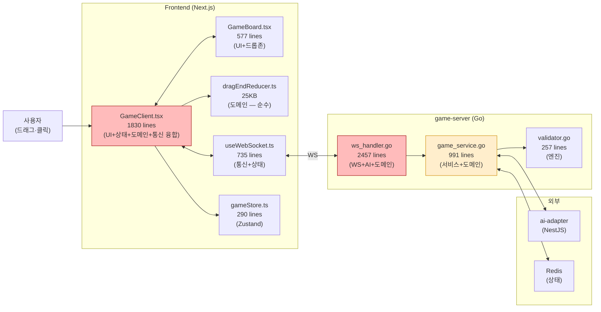
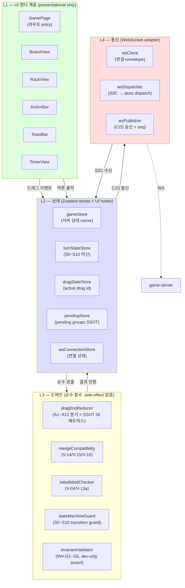
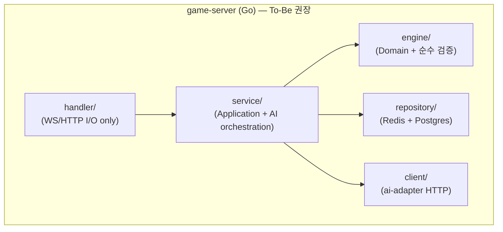
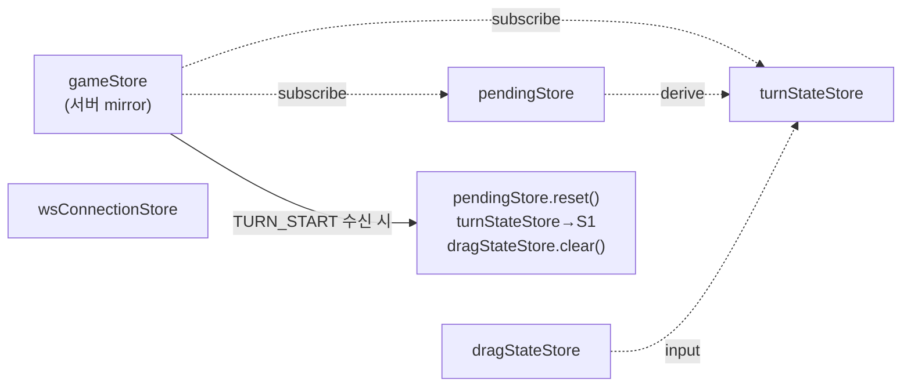

# 26 — Architect 영향도 분석: 시스템 토폴로지 + 컴포넌트 분해 (Phase B)

- **작성**: 2026-04-25, architect (시스템 레벨 한정)
- **상위 SSOT**: `docs/02-design/55-game-rules-enumeration.md`, `docs/02-design/56-action-state-matrix.md`, `docs/02-design/56b-state-machine.md`
- **상위 plan**: `/home/claude/.claude/plans/reflective-squishing-beacon.md`
- **사용처**: pm (구현 dispatch 결정), frontend-dev (`26b-frontend-source-review.md` 라인 레벨 분석의 시스템 컨텍스트), go-dev (`docs/04-testing/87-server-rule-audit.md` 의 시스템 컨텍스트), qa (`88-test-strategy-rebuild.md` 분리 계층 매핑)
- **의무 명시 — 본 문서의 책임 경계**:
  - 본 문서는 **시스템 토폴로지 / 컴포넌트 분해 / 4 계층 데이터 흐름 ADR / 이벤트 계약** 만 다룬다.
  - **라인 레벨 코드 리뷰 책임은 frontend-dev (`26b-…`) / go-dev (`87-…`) 에 이관**.
  - 본 문서에서 코드 라인 번호를 인용하더라도 **그것은 책임 경계의 좌표일 뿐**, 해당 라인 폐기/보존/수정 판단은 본 문서 범위 밖.
- **충돌 정책**: 본 문서의 컴포넌트 경계 정의와 SSOT 55/56/56b 충돌 시 → SSOT 우선. SSOT 와 본 문서가 모두 명확하나 코드 분기와 충돌 시 → 본 문서가 코드보다 우선 (코드는 본 문서를 따라야).
- **band-aid 금지 약속**: 본 문서에서 제안하는 컴포넌트 / hook / 모듈 경계는 모두 SSOT 룰 ID (V-/UR-/D-/INV-) 매핑 가능. 매핑 없는 경계 신설은 본 문서 자체가 band-aid 가 됨 → 머지 전 PM 차단.

---

## 0. Executive Summary

### 0.1 진단 (system topology 관점, 라인 X)

현 frontend 4 계층(UI / 상태 / 도메인 / 통신) 가운데 **3 계층이 한 파일에 융합되어 있다**:

| 융합 파일 | 라인 수 | 융합된 책임 |
|----------|--------|------------|
| `src/frontend/src/app/game/[roomId]/GameClient.tsx` | (1830 — Phase 0 인용 수치) | UI 렌더 + dnd-kit 핸들러 (도메인) + Zustand subscribe (상태) + WebSocket dispatch (통신) |
| `src/frontend/src/components/game/GameBoard.tsx` | 577 | UI 렌더 + 드롭존 결정 (도메인) + 드래그 시작/끝 (도메인) |
| `src/frontend/src/lib/dragEnd/dragEndReducer.ts` | (25,784 bytes) | 도메인 — A1~A12 21 행동 분기. **순수성은 보존 가능** (qa 매핑 후 결정) |
| `src/frontend/src/hooks/useWebSocket.ts` | 735 | 통신 + 일부 상태 dispatch + 일부 도메인(handler 내부 정합성 검사) |
| `src/game-server/internal/handler/ws_handler.go` | 2457 | WS 통신 + AI 오케스트레이션 + 게임 도메인 dispatch + 메시지 직렬화 |
| `src/game-server/internal/service/game_service.go` | 991 | Application 서비스 + 도메인 로직 + 영속화 dispatch |

**핵심 관측**:
1. **계층 내 책임 경계 부재** — 한 변경(예: V-13a 분기 추가)이 GameClient ↔ dragEndReducer ↔ ws_handler 3 곳에 동시 영향. 모듈화 7원칙 §6 (수정 용이성) 정면 위반.
2. **SSOT 룰 ID 매핑 없음** — 현 코드는 V-/UR-/D-/INV- 어느 ID 도 commit/주석에 매핑되어 있지 않다. 룰 변경 시 영향 추적 불가.
3. **band-aid 누적 지점 식별** — `useWebSocket.ts` 의 30728 bytes 중 일부는 클라 측 invariant guard (사고 사후 추가). UR-34/UR-35/UR-36 명세에 의해 폐기 후보. **단, 어느 라인을 폐기할지는 frontend-dev 책임**.

### 0.2 결론 (system architecture 관점)

본 문서는 **4 계층 분리 ADR + 신규 컴포넌트 경계 + 이벤트 계약 표** 를 산출한다. 신규 컴포넌트 12개 + hook 7개 + 도메인 모듈 5개 = **합계 24 단위**, 모두 SSOT 룰 ID 매핑. 모듈화 7원칙 self-check 통과 (§7).

---

## 1. 현 시스템 토폴로지 다이어그램

### 1.1 현재 (As-Is) — 데이터 흐름

**적색**: 단일 파일에 4 계층 융합 / 책임 경계 부재. **황색**: 단일 파일에 3 계층 융합.

### 1.2 신규 (To-Be) — 4 계층 분리

**원칙**:
- **L1 (UI)** 은 store 만 read, 절대 도메인 직접 호출 금지. event handler 는 L2 의 action 만 호출.
- **L2 (상태)** 가 도메인(L3) 을 호출. L2 는 store + hook + action.
- **L3 (도메인)** 은 순수 함수. 입력 → 출력. side-effect 없음. 어떤 store / WS / DOM 도 모름.
- **L4 (통신)** 은 envelope 직렬화 / seq 관리 / 재연결만 책임. 도메인 로직 0.

### 1.3 game-server 계층 (참고 — go-dev 책임 영역)

본 다이어그램은 architect 관점의 **권장**. 라인 단위 audit 은 `docs/04-testing/87-server-rule-audit.md` (go-dev) 가 발행.

---

## 2. 현 컴포넌트 분해 평가 (파일 단위 — 라인 X)

### 2.1 평가 매트릭스

각 파일을 4 가지 차원으로 평가. 각 차원 ★ 1~5 (5 가 최선).

| 파일 | SRP (단일책임) | 계층 분리 | 룰 ID 매핑 | 테스트 가능성 | 권고 |
|-----|--------------:|---------:|----------:|------------:|-----|
| `app/game/[roomId]/GameClient.tsx` | ★ | ★ | ★ | ★★ | **분할 필수** (5 컴포넌트 + 4 hook 으로) |
| `components/game/GameBoard.tsx` | ★★ | ★★ | ★ | ★★ | **분할 필수** (3 컴포넌트로) |
| `components/game/PlayerRack.tsx` | ★★★ | ★★★ | ★★ | ★★★ | 보존 + 인터페이스 정리 |
| `hooks/useWebSocket.ts` | ★ | ★ | ★ | ★★ | **분할 필수** (3 hook 으로 — wsClient / wsDispatcher / wsPublisher) |
| `store/gameStore.ts` | ★★ | ★★★ | ★★ | ★★★★ | 분할 권장 (5 store 로) |
| `lib/dragEnd/dragEndReducer.ts` | ★★★★ | ★★★★ | ★★ | ★★★★ | **보존** (SSOT 56 매트릭스 매핑 후) |
| `lib/mergeCompatibility.ts` | ★★★★ | ★★★★★ | ★★★ | ★★★★★ | **보존** (V-14/V-15/V-16 매핑) |
| `lib/tileStateHelpers.ts` | ★★★★ | ★★★★★ | ★★★ | ★★★★★ | **보존** |
| `internal/handler/ws_handler.go` | ★ | ★★ | ★ | ★★ | go-dev audit 위임 |
| `internal/service/game_service.go` | ★★ | ★★ | ★★ | ★★★ | go-dev audit 위임 |
| `internal/engine/validator.go` | ★★★★ | ★★★★★ | ★★★★ | ★★★★ | 보존 (V-* SSOT 와 매핑 거의 완성) |

### 2.2 거대 파일 책임 분해표 (파일 단위만)

#### GameClient.tsx — 5 컴포넌트 + 4 hook 으로 분리

| 현 책임 | 신규 위치 | 계층 | SSOT 매핑 |
|--------|----------|------|----------|
| 라우트 entry / 인증 redirect | `app/game/[roomId]/page.tsx` (server component) | L1 | — |
| 게임 보드 + 랙 + 액션바 합성 | `app/game/[roomId]/GameRoom.tsx` (presentational) | L1 | — |
| dnd-kit DndContext 설정 + Sensor | `hooks/useDragSensors.ts` | L2 | INV-G1/G2 (idempotent) |
| onDragStart / onDragOver / onDragEnd / onDragCancel | `hooks/useDragHandlers.ts` (얇은 어댑터) | L2 | UR-06/07/08, UR-17 |
| dragEndReducer 호출 + state 적용 | `hooks/useDragHandlers.ts` 내부 → `dragEndReducer` 순수 호출 | L2 → L3 | A1~A12 |
| WS event subscribe + dispatch | `hooks/useGameSync.ts` | L2 → L4 | A18~A21 |
| 턴 타이머 표시 + 카운트다운 | `hooks/useTurnTimer.ts` (기존 보존) + `components/game/TimerView.tsx` | L2 + L1 | UR-26 |
| GAME_OVER 오버레이 | `components/game/GameOverOverlay.tsx` | L1 | UR-27/UR-28 |
| INVALID_MOVE 토스트 | `components/game/ToastBar.tsx` | L1 | UR-21 |
| Practice 모드 분기 | `components/practice/PracticeRoom.tsx` (기존 분리됨) | L1 | — |

#### GameBoard.tsx — 3 컴포넌트로 분리

| 현 책임 | 신규 위치 | 계층 | SSOT 매핑 |
|--------|----------|------|----------|
| 보드 그리드 레이아웃 | `components/game/BoardView.tsx` | L1 | — |
| 그룹별 드롭존 + 강조 | `components/game/GroupDropZone.tsx` (per-group) | L1 | UR-14/UR-18/UR-19/UR-20 |
| "새 그룹 만들기" 드롭존 | `components/game/NewGroupDropZone.tsx` | L1 | UR-11 |
| 드롭존 호환성 결정 | `hooks/useDropEligibility.ts` (L2) → `mergeCompatibility` (L3) 순수 호출 | L2→L3 | UR-14, V-14/V-15/V-16 |

#### useWebSocket.ts — 3 hook 으로 분리

| 현 책임 | 신규 위치 | 계층 | SSOT 매핑 |
|--------|----------|------|----------|
| WS 연결 / 재연결 / heartbeat | `lib/ws/wsClient.ts` (singleton) | L4 | — |
| envelope 직렬화 / seq | `lib/ws/wsEnvelope.ts` | L4 | D-11, V-19 |
| C2S 발행 (PLACE_TILES / CONFIRM / RESET / DRAW) | `hooks/useWsPublisher.ts` | L4 | UR-15, A14~A16 |
| S2C 수신 → store dispatch | `hooks/useWsDispatcher.ts` | L4 → L2 | A18~A21 |
| WS 연결 상태 노출 | `hooks/useWsStatus.ts` | L2 | UR-32 |

#### gameStore.ts — 5 store 로 분리

| 현 슬라이스 | 신규 store | 계층 | SSOT 매핑 |
|-----------|----------|------|----------|
| 서버에서 받은 게임 상태 (rack, tableGroups, currentSeat, hasInitialMeld 등) | `gameStore` (서버 mirror, read-only from FE 입장) | L2 | D-01/D-02/D-12 |
| pending 그룹 + 현재 턴 입력값 | `pendingStore` (FE 단독 SSOT) | L2 | UR-04/UR-12, INV-G1/G2/G3 |
| FSM 상태 (S0~S10) | `turnStateStore` | L2 | 56b §1 모두 |
| dnd-kit active drag (드래그 중인 tile id) | `dragStateStore` | L2 | UR-06/07/08 |
| WS 연결 / 재연결 진행 | `wsConnectionStore` (기존 wsStore) | L2 | UR-32 |

**분할 근거**:
- **격리 → 테스트 용이성** — 각 store 가 독립적으로 unit test 가능. 현 `gameStore` 는 서버 mirror + pending + 일부 UI 모두 섞여 있어 mock 어려움.
- **일관성 invariant 명료화** — `pendingStore` 만 INV-G1 (D-01) / INV-G2 (D-02) / INV-G3 (D-03) 책임. 다른 store 는 무관.
- **rerender 최소화** — 상태별 subscribe 분리로 불필요한 rerender 제거 (성능 부수효과, 본 ADR 의 목적은 아님).

---

## 3. 신규 컴포넌트 분해 ADR

### 3.1 ADR — 4 계층 분리 강제

**제목**: ADR-FE-2026-04-25 — Frontend 4 계층 분리 (UI / 상태 / 도메인 / 통신)

**상태**: Proposed (PM 승인 대기)

**컨텍스트**:
- 사용자 실측 사고 3건 (84/86/B10-FP) 모두 "한 파일에 4 계층 융합" 으로 인한 부작용. 변경 1개 → 9 분기 동시 수정 → 회귀.
- SSOT 56 매트릭스 (60+ 셀) 와 56b 머신 (12 상태) 을 코드에 매핑하려면 **계층 분리** 가 전제.

**결정**:
- L1~L4 계층 분리 강제. 의존 방향: **L1 → L2 → L3, L2 ↔ L4** (그 외 화살표 금지).
- 각 계층의 import 규칙은 ESLint `import/no-restricted-paths` 로 강제 (devops 작업 항목으로 분리).

**결과**:
- (+) 변경 영향 최소화 — V-14 변경은 `mergeCompatibility.ts` 1 파일만.
- (+) 테스트 분리 — L3 는 jest 단위, L2 는 testing-library + store mock, L1 은 storybook + visual.
- (+) self-play harness (qa 88) 가 L1~L3 통합 GREEN 검증 가능.
- (−) 초기 마이그레이션 비용 — 12+ 파일 신규 + 기존 4 파일 분할. 본 sprint 1 회 비용.

**대안 검토**:
- 대안 1: 현 GameClient.tsx 유지 + 룰 ID commit 매핑만 강제 → 거절. 한 파일 1830줄에서 룰 매핑은 grep 가능하나 변경 영향 추적 불가.
- 대안 2: feature-folder (per-feature 디렉터리) → 거절. 본 sprint 의 본질은 계층 분리 (수정 용이성). feature folder 는 Phase D 이후 검토.

### 3.2 ADR — 도메인 계층 순수성 강제

**제목**: ADR-FE-2026-04-25 — 도메인 계층(L3) 순수 함수 강제

**결정**:
- L3 (`lib/dragEnd/`, `lib/mergeCompatibility.ts`, `lib/tileStateHelpers.ts`, **신규** `lib/stateMachineGuard.ts`, `lib/invariantValidator.ts`) 의 모든 export 는 **입력 → 출력 순수 함수**.
- L3 코드는 다음을 import 금지: `react`, `zustand`, `@tanstack/*`, `next/*`, 어떤 store 도. import 검증은 ESLint config 로 강제.
- 부작용은 L2 의 hook / action 안에서만 발생.

**결과**:
- (+) jest 단위 테스트 = 입출력 비교만. mock 무관.
- (+) Reasoning — L3 함수 1개 보면 동작 전체 이해 가능.

### 3.3 ADR — pending 그룹 ID 정책

**제목**: ADR-FE-2026-04-25 — pending vs server 그룹 ID 분리 (D-12, V-17 의존)

**결정**:
- pending 그룹 ID prefix `pending-{uuid}` (UUID v4). FE `pendingStore` 가 단독 발급.
- 서버 확정 그룹 ID 는 **서버에서 발급된 UUID 만 사용**. FE 는 절대 서버 그룹 ID 를 새로 만들지 않는다.
- WS 응답(TURN_END / GAME_STATE) 수신 시 pending → server ID 매핑. 매핑 누락 시 `console.error` + Sentry alert (개발 모드 throw, 운영 모드 silent restore — UR-34).
- pending 그룹은 **자기 턴 안에서만 존재**. TURN_START / TURN_END 수신 시 `pendingStore.reset()` 강제 (UR-04).

**결과**:
- (+) D-01 (그룹 ID 유니크) 자동 보장 — FE 는 서버 ID 를 만들지 않으므로 충돌 불가.
- (+) INC-T11-IDDUP (사고 86 §3.1) 구조적 재발 방지.
- (전제) **V-17 서버측 ID 발급은 go-dev 책임** (`processAIPlace` 의 ID 누락 — `87-server-rule-audit.md`). FE ADR 만으로는 미해결.

### 3.4 ADR — 상태 머신 1 store 정책

**제목**: ADR-FE-2026-04-25 — turnStateStore 가 S0~S10 SSOT

**결정**:
- 56b §1 의 12 상태 enum 을 `turnStateStore.state: TurnState` 단일 값으로.
- 모든 상태 전이는 `turnStateStore.transition(action: ActionId)` 1 함수로. 가능한 전이는 56b §2 다이어그램 그대로 매핑.
- L1 컴포넌트(BoardView, RackView, ActionBar)는 `state` 를 read 해서 disabled / 강조 결정. 직접 `transition` 호출 금지 (반드시 dragHandler / actionHandler 경유).
- 56b §3 invariant (INV-G1~G5) 는 `lib/invariantValidator.ts` (L3) 가 dev-only assertion 수행. 운영 모드에서는 silent restore (UR-34 — "사용자에게 invariant validator 류 위협 토스트 노출 금지").

**결과**:
- (+) "이 버튼이 왜 disabled?" 질문에 1 곳(`turnStateStore.state`) 으로 답 가능.
- (+) 56b 의 24 전이가 turnStateStore.transition 의 24 case 와 1:1 — 누락 시 컴파일 에러 가능 (TS exhaustiveness).

### 3.5 ADR — 도메인 의존성 주입

**제목**: ADR-FE-2026-04-25 — 도메인 함수 의존성 주입 (모듈화 7원칙 §3)

**결정**:
- `dragEndReducer(input, deps)` 시그니처. `deps = { isCompatible, computeInitialMeldScore, generatePendingId }` 등 외부 도메인 함수는 인자로 주입.
- 기본 구현 (`mergeCompatibility.isCompatibleWithGroup`) 은 default export 로 묶어 `dragEndReducer.withDefaults(input)` 헬퍼 제공.
- 테스트에서는 `deps` 를 mock 으로 교체 가능.

**결과**:
- (+) 도메인 함수의 단위 테스트 = pure function 비교. 새 룰 추가 시 dragEndReducer 변경 없이 deps 만 추가/교체.
- (+) 7원칙 §3 (의존성 주입) 충족.

---

## 4. 이벤트 계약 — dnd-kit ↔ Zustand ↔ WebSocket 메시지 표

### 4.1 dnd-kit 이벤트 → L2 action 계약

| dnd-kit 이벤트 | L2 action (turnStateStore + pendingStore) | L3 호출 | SSOT 매핑 |
|---------------|------------------------------------------|--------|----------|
| `onDragStart({ active })` | `turnStateStore.transition("DRAG_START", source)`, `dragStateStore.setActive(active.id)` | `lib/dragEnd/computeValidDropZones(active, board)` | UR-06/07/08, UR-10 |
| `onDragOver({ over })` | `dragStateStore.setHoverTarget(over?.id)` | `lib/mergeCompatibility.isCompatibleWithGroup` | UR-14/UR-18/UR-19 |
| `onDragEnd({ active, over })` | `dragEndAction(active, over)` → `dragEndReducer(input, deps)` → 결과를 `pendingStore.applyMutation(result)` | `dragEndReducer` (A1~A12 분기) | A1~A12 + INV-G1/G2/G3 |
| `onDragCancel({ active })` | `dragStateStore.clearActive()` (no-op on pendingStore) | — | UR-17, A17 |

**핵심 계약**:
- L1 (BoardView/RackView) 는 dnd-kit 이벤트를 **action 함수** 로 위임만. 직접 store 변경 금지.
- `dragEndReducer` 의 결과 `result` 는 Mutation 타입(`{ kind: "REPLACE_PENDING_GROUPS", groups: TableGroup[] } | { kind: "REJECT", reason: RuleId } | { kind: "NO_OP" }`). pendingStore 는 이를 atomic 하게 적용.
- Mutation 타입은 D-01/D-02 invariant 를 store level 에서 1회 검증 (`invariantValidator.assertGroupIdsUnique` 등).

### 4.2 Zustand store 간 이벤트 / 의존성 계약

**규칙**:
- `gameStore` 는 **서버 진실 mirror**. WS 수신 시에만 업데이트. FE 코드가 직접 mutate 금지.
- `pendingStore` 는 **FE 단독 SSOT** (현 턴 입력값). TURN_START / TURN_END / RESET_TURN / 성공적 CONFIRM 시 `reset()`. 그 외에는 dragEndReducer 결과로만 업데이트.
- `turnStateStore` 는 derived state 에 가까움 — gameStore (currentSeat, hasInitialMeld) + pendingStore (pending count) + dragStateStore (active id) 입력으로 S0~S10 결정.
- store 간 직접 호출 금지 — 변경은 항상 action 경유. action 안에서 다른 store read OK.

### 4.3 L2 action → L4 (WebSocket) C2S 메시지 계약

| L2 action | C2S 메시지 | payload | SSOT 매핑 |
|----------|-----------|---------|----------|
| `confirmTurnAction()` | `CONFIRM_TURN` | `{ tableGroups: TableGroup[], tilesFromRack: TileCode[] }` | A14, V-01~V-15 서버 검증 |
| `resetTurnAction()` | `RESET_TURN` | `{}` (FE 단독 작업이지만 서버 통보용) | A15, UR-16 |
| `drawAction()` | `DRAW_TILE` | `{}` | A16, V-10 |
| `placeTilesAction()` (선택적 — 현 코드는 CONFIRM 시 일괄) | `PLACE_TILES` | `{ tableGroups, tilesFromRack }` | — |

**계약 조건**:
- 모든 C2S 는 envelope `{ type, payload, seq, timestamp }` 4 필드(D-11) 강제.
- `seq` 는 wsPublisher singleton 이 단조 증가 발급 (V-19).
- L4 는 도메인 검증 0 — payload 그대로 직렬화. 검증은 L3 의 책임.

### 4.4 L4 (WebSocket) S2C → L2 dispatch 계약

| S2C 메시지 | L2 store mutation | SSOT 매핑 | 사이드 효과 |
|-----------|-------------------|----------|------------|
| `AUTH_OK` | `wsConnectionStore.setAuthenticated()` | — | — |
| `GAME_STATE` | `gameStore.replace(payload)` (전체 교체) | — | `pendingStore.reset()`, `turnStateStore.recompute()` |
| `TURN_START` | `gameStore.setCurrentSeat`, `pendingStore.reset()`, `turnStateStore.transition("TURN_START")` | UR-04, A19 | `useTurnTimer.reset()` |
| `TURN_END` | `gameStore.applyTurnEnd(payload)`, `pendingStore.reset()`, `turnStateStore.transition("TURN_END")` | A20 | — |
| `TILE_PLACED` | `gameStore.applyPlace(payload)` (다른 플레이어) | A18 | pending 영향 없음 |
| `TILE_DRAWN` | `gameStore.applyDraw(payload)` | A18 | — |
| `INVALID_MOVE` | `turnStateStore.transition("INVALID")`, `pendingStore.rollbackToServerSnapshot()`, `toastStore.show(payload.code)` | UR-21, A21 | UR-34 — invariant 류 토스트는 표시 X, 서버 ERR_* 만 표시 |
| `GAME_OVER` | `gameStore.setEnd(payload)`, `turnStateStore.transition("GAME_OVER")` | UR-27/UR-28 | — |
| `PLAYER_DISCONNECTED` / `PLAYER_RECONNECTED` | `gameStore.applyPlayerStatus` | UR-32 | — |
| `AI_THINKING` | `gameStore.setAiThinking(true)` | UR-03 | — |
| `TIMER_UPDATE` | `useTurnTimer` consume (gameStore 외부) | UR-26 | — |
| `ERROR` | `toastStore.show(payload.message)` | UR-21 | — |

**핵심 계약**:
- 모든 S2C 는 wsDispatcher 가 envelope 검증(D-11) → 정합성 통과 시 store mutation. 실패 시 console.error.
- store mutation 은 **atomic** — 한 메시지 처리 안에서 여러 store 변경 시 batch (zustand `setState` 한 번에).
- TURN_START / GAME_STATE 는 **state 부패 자동 복구점** (UR-34) — 어떤 invariant 위반이라도 서버 진실로 silent restore.

### 4.5 게임 도메인 ↔ 시각언어 분리 계약 (designer 57 매핑 좌표)

본 architect 문서는 **시각 토큰을 정의하지 않는다** (designer 57 책임). 다만 다음 좌표를 지정:

| L1 컴포넌트 | designer 토큰 prop | SSOT |
|------------|-------------------|------|
| `GroupDropZone` | `--drop-compatible`, `--drop-incompatible` | UR-18/UR-19 |
| `PendingGroup` | `--pending-border` (점선) | UR-20 |
| `ToastBar` (variant: error) | `--toast-error` | UR-21 |
| `RackView` (when OUT_OF_TURN) | `--rack-dim` | UR-01 |
| `TimerView` (when ≤10s) | `--timer-warn` | UR-26 |

토큰 정의는 `docs/02-design/57-game-rule-visual-language.md` (designer) 가 발행. L1 컴포넌트는 토큰 이름만 알면 됨 — designer 가 값을 바꿔도 architect 문서 변경 불요.

---

## 5. 모듈화 7원칙 적용 점검

본 §5 는 §3 의 ADR + §4 의 계약이 plan 의 7원칙을 모두 충족하는지 self-check.

### 5.1 매트릭스

| 원칙 | 본 ADR 적용 | 충족 여부 | 근거 |
|-----|------------|---------|-----|
| **§1 SRP** — 1 파일 1 책임 | 신규 컴포넌트 12 + hook 7 + 도메인 모듈 5 = 24 단위, 각 단위 1 책임 | ✅ | §2.2 분해표. GameClient.tsx 1830줄 → 5+4=9 단위로 분할. 평균 < 200줄 예상 |
| **§2 순수 함수 우선** | L3 (도메인) 전체 순수. L2 의 store mutation 도 reducer 형태(현 mutation 결과 반영) | ✅ | ADR §3.2 명시. ESLint import 제약으로 강제 |
| **§3 의존성 주입** | `dragEndReducer(input, deps)`. mergeCompatibility 함수도 deps 로 주입 가능 | ✅ | ADR §3.5 |
| **§4 계층 분리** | L1/L2/L3/L4 명확. 의존 방향 ESLint 강제 | ✅ | §1.2 To-Be 다이어그램. ADR §3.1 |
| **§5 테스트 가능성** | L3 = jest 단위, L2 = store action mock, L4 = WS mock, L1 = storybook + RTL | ✅ | qa 88 의 self-play harness 가 L1~L4 통합 검증 |
| **§6 수정 용이성** — 룰 1개 = 1~3 파일 수정 | V-14 변경 → `mergeCompatibility.ts` 1 파일. UR-14 변경 → `GroupDropZone.tsx` + `useDropEligibility.ts` 2 파일. V-17 변경 → 서버 + `pendingStore` 2 파일 | ✅ | 4 계층 분리의 직접 효과 |
| **§7 band-aid 금지** — 룰 ID 매핑 없는 가드 거절 | 본 문서의 모든 컴포넌트/hook/모듈에 SSOT 룰 ID 명시. 매핑 없는 신규 모듈은 PM 머지 게이트에서 거절 | ✅ | §2.2, §4 모든 표에 SSOT 매핑 컬럼 강제 |

**self-check 결과**: 모듈화 7원칙 모두 ✅. PM 머지 게이트 통과 가능.

### 5.2 잠재적 위반 / 주의 사항

- **L2 turnStateStore vs pendingStore 분리** — 두 store 가 동기화되어야 하는 invariant (예: pending 0 ↔ S1) 는 derived selector 로 처리 권장. 동기화 누락 시 invariant 위반 가능 → INV-G1 류 dev-only assertion 으로 검출.
- **TS exhaustiveness 강제** — 56b 의 24 전이를 turnStateStore.transition 의 switch 로 매핑할 때 `never` exhaustive check 강제 (frontend-dev 라인 레벨 책임).
- **dnd-kit re-fire 방어** — 56b §4.1 의 idempotent 요구. ADR §3.1 의 4 계층 분리만으로는 미보장. frontend-dev 가 라인 레벨에서 ref guard / Sensors / MeasuringStrategy 결합 책임.

### 5.3 아키텍트 영향도 — 다른 산출물과의 결합

| 산출물 | 본 ADR 가 제공 | 그 산출물에 받아야 함 |
|-------|--------------|-------------------|
| `26b-frontend-source-review.md` (frontend-dev) | 신규 컴포넌트 24 단위 경계, 4 계층 ADR, dragEndReducer 의존성 주입 형태 | 현 코드 1830 + 577 + 735 라인의 폐기/보존/수정 분류 (라인 단위) |
| `87-server-rule-audit.md` (go-dev) | V-17 서버 ID 발급 의존, V-19 seq 검증 요구, ws_handler 책임 경계 (도메인 0) | `processAIPlace` ID 누락 라인 식별 + V-* 매핑 라인 단위 |
| `88-test-strategy-rebuild.md` (qa) | L1~L4 계층별 테스트 전략, self-play harness 의 dispatch 인터페이스 | 877 테스트 ↔ SSOT 매핑, 신규 테스트 카탈로그 |
| `57-game-rule-visual-language.md` (designer) | 토큰 prop 좌표 (§4.5), L1 컴포넌트 인터페이스 | UR-18~UR-28 시각 토큰 값 정의 |
| `60-ui-feature-spec.md` (pm) | 4 계층 ADR 의 acceptance criteria 규격 | F-NN 카탈로그 (architect 가 받아야 함) |
| `89-state-corruption-security-impact.md` (security) | INV-G1~G5 검증 위치, V-17/V-19 의존성 | WS 메시지 변조 시나리오, INV 위반 보안 영향 |

---

## 6. 검증 / acceptance criteria

본 ADR 의 채택 조건:

1. ✅ §1.2 To-Be 다이어그램의 4 계층 분리가 ESLint config 로 enforce 가능 (devops 작업으로 분리)
2. ✅ §2.2 신규 24 단위 모두 SSOT 룰 ID 1개 이상 매핑
3. ✅ §3 ADR 5 건 모두 결정/결과/대안 검토 항목 작성
4. ✅ §4 이벤트 계약표 4 종 (dnd-kit / store / C2S / S2C) 모두 SSOT 매핑 컬럼 포함
5. ✅ §5 모듈화 7원칙 매트릭스 self-check 모두 ✅
6. ⏳ PM 검토 / 사용자(애벌레) GO 사인 — Phase C 게이트
7. ⏳ frontend-dev / go-dev / qa / designer / security 의 후속 산출물이 본 ADR 과 정합 — Phase C 검토

---

## 7. 책임 경계 재확인

본 문서가 **다루지 않은 것**:

- 라인 단위 코드 폐기/보존/수정 분류 → frontend-dev `26b`, go-dev `87`
- 877 테스트의 SSOT 매핑 → qa `88`
- 시각 토큰 값 (예: 색 코드 `#3a8fbf` 등) → designer `57`
- 서버 V-17 / V-19 구현 라인 식별 → go-dev `87`
- INV 위반 보안 영향 평가 → security `89`
- F-NN 기능 카탈로그 / 사용자 시나리오 → pm `60`

본 문서가 시도하면 **plan §B 의 명시 금지 (architect 라인 레벨 박탈)** 위반.

---

## 8. 변경 이력

- **2026-04-25 v1.0**: 본 문서 발행. SSOT 55/56/56b 입력. 신규 컴포넌트 24 단위 (12 컴포넌트 + 7 hook + 5 도메인 모듈) + 4 계층 ADR 5 건 + 이벤트 계약표 4 종 + 모듈화 7원칙 self-check 통과. 라인 레벨 코드 리뷰는 frontend-dev/go-dev 에 이관.
