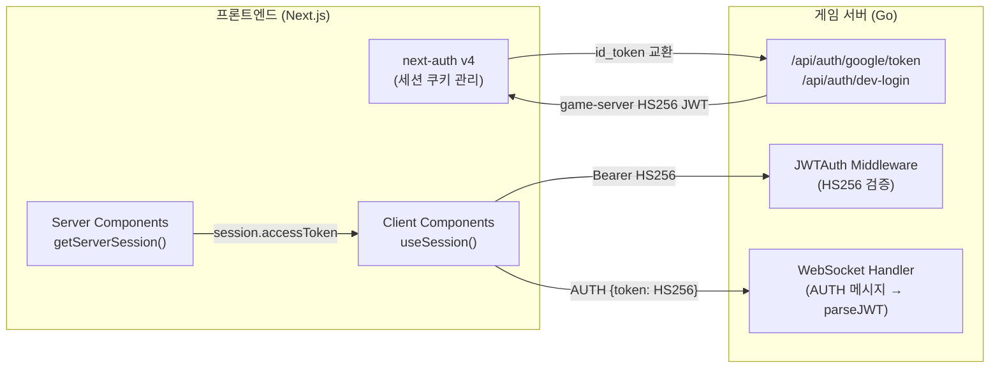

# ADR-027: next-auth v5 이주 보안 분석

- **상태**: 초안 (Draft)
- **작성일**: 2026-04-26
- **작성자**: security (Opus 4.6 1M context)
- **범위**: Sprint 8 후보
- **연관 ADR**: `docs/02-design/52-adr-next-auth-v5-migration.md` (architect, 이주 범위/절차), `docs/03-development/19-next-auth-guide.md` (기술 배경)
- **분류**: Security ADR — 보안 영향 분석 전용

---

## 1. 컨텍스트

### 1.1 현재 인증 아키텍처 요약

RummiArena 프론트엔드는 `next-auth@4.24.14` (실제 설치 버전)를 사용하며, 인증 흐름은 다음과 같이 2계층으로 분리되어 있다.

**계층 1 — next-auth (프론트엔드 세션 관리)**

| 항목 | 현재 설정 |
|------|----------|
| 세션 전략 | JWT (`session.strategy: "jwt"`) |
| 세션 만료 | 24시간 (`maxAge: 86400`) |
| Provider | Google OAuth 2.0 + CredentialsProvider (dev-login) |
| 쿠키 이름 | `next-auth.session-token` (HTTP), `__Secure-next-auth.session-token` (HTTPS) |
| 서명 알고리즘 | HMAC-SHA256 (NEXTAUTH_SECRET 기반) |
| CSRF | next-auth v4 내장 Double Submit Cookie 방식 |
| Middleware | 미사용 (src/frontend/middleware.ts 없음) |

**계층 2 — game-server 자체 JWT (API/WebSocket 인가)**

| 항목 | 현재 설정 |
|------|----------|
| 서명 알고리즘 | HS256 (`jwt.SigningMethodHS256`) |
| 검증 미들웨어 | `internal/middleware/auth.go` — `JWTAuth(secret)` |
| Claims 구조 | `sub`(userID), `email`, `role`, `exp`, `iat` |
| WS 인증 | 첫 메시지 AUTH 타입 + JWT 전달 → `parseJWT()` 검증 |
| Rate Limit | 인증 엔드포인트: `LowFrequencyPolicy` (10 req/min) |

**핵심 구조**: next-auth는 Google id_token을 game-server `POST /api/auth/google/token`으로 교환하여 **game-server가 발급한 HS256 JWT**를 `session.accessToken`에 저장한다. game-server는 next-auth의 내부 세션 JWT를 전혀 보지 않는다. 이 분리 덕분에 next-auth 버전 변경이 game-server에 전파되지 않는다.



### 1.2 이주 동기 (보안 관점)

1. **supply-chain 취약점**: `next-auth@4` → `uuid@8.3.2` → `GHSA-w5hq-g745-h8pq` (Moderate). v4 semver 범위 내 해소 불가.
2. **유지보수 모드**: v4는 2025-Q4부터 maintenance mode. 신규 보안 패치 속도 저하 예상.
3. **인증/프로필 분리 원칙 준수 검증**: v5 이주 시 `coding-conventions.md` 5.5절 원칙이 코드 변경 과정에서 위반되지 않도록 보안 게이트 필요.

### 1.3 분석 범위

이 ADR은 architect의 이주 ADR (`docs/02-design/52`)을 **보안 관점에서 보완**한다. 범위는 다음과 같다.

- next-auth v4 → v5 변경에 따른 보안 메커니즘 차이
- RummiArena 고유 아키텍처(2계층 JWT, K8s 환경)에서의 위험 평가
- 마이그레이션 과정의 보안 체크리스트

---

## 2. 보안 영향 분석

### 2.1 세션 전략

**현재(v4)**: JWT 전략, `NEXTAUTH_SECRET`으로 HS256 서명. 세션 데이터가 쿠키 안에 암호화된 JWT로 저장된다.

**v5 변경사항**:
- v5는 세션 JWT를 **JWE(JSON Web Encryption)**로 암호화한다 (v4는 JWS만). 이는 클라이언트 측에서 세션 payload를 디코딩할 수 없게 만들어 정보 노출을 방지한다.
- `session.strategy: "jwt"`는 v5에서도 동일하게 지원된다. database 전략 전환 없음.
- `maxAge: 86400` (24시간) 설정은 v5에서도 호환.

**보안 영향**:

| 항목 | v4 | v5 | 영향 |
|------|----|----|------|
| 쿠키 내 JWT 암호화 | JWS (서명만) | JWE (암호화+서명) | **개선** — 쿠키 탈취 시 payload 노출 방지 |
| Secret 호환성 | `NEXTAUTH_SECRET` | `AUTH_SECRET` (호환 alias 유지) | **중립** — 기존 secret 재사용 가능 |
| 세션 무효화 | 쿠키 삭제만 가능 | 동일 (JWT 전략은 서버 측 무효화 불가) | **동일** — JWT 전략의 고유 한계 |

**권장사항**:
- v5 이주 시 `NEXTAUTH_SECRET` 값을 변경하지 않는다 (기존 세션 호환성 유지).
- 장기적으로 database 세션 전략 검토 필요: JWT 전략은 토큰 revocation이 불가하여, 계정 탈취 시 24시간까지 세션이 유효하다. 그러나 현재 game-server가 자체 HS256 JWT를 사용하므로 next-auth 세션 탈취만으로는 game-server API 접근이 불가능하다 (2계층 방어).

### 2.2 CSRF 보호

**현재(v4)**: next-auth v4는 Double Submit Cookie 패턴으로 CSRF를 방어한다. `next-auth.csrf-token` 쿠키와 hidden form field의 값을 비교한다. 현재 프로젝트는 `signIn("google")`, `signIn("dev-login")` 호출 시 next-auth가 자동으로 CSRF 토큰을 주입한다.

**v5 변경사항**:
- v5는 CSRF 보호 메커니즘을 유지하되, Server Actions 통합으로 인해 **form-based CSRF** 외에 **Server Action token** 방식도 추가된다.
- `signIn()` / `signOut()`을 Server Action으로 호출할 수 있게 된다 (현재 프로젝트는 client-side `signIn()`을 사용).

**보안 영향**:

| 항목 | v4 | v5 | 영향 |
|------|----|----|------|
| CSRF 방어 유지 | Double Submit Cookie | Double Submit Cookie + Server Action | **개선** — 추가 방어 계층 |
| 현 프로젝트 영향 | 자동 적용 | 자동 적용 | **변경 없음** — client-side signIn 유지 |

**권장사항**:
- 이주 후 CSRF 토큰 쿠키(`next-auth.csrf-token` 또는 `authjs.csrf-token`)가 정상 발급되는지 Playwright로 검증한다.
- v5에서 쿠키 이름 prefix가 `next-auth.*` → `authjs.*`로 변경될 수 있으므로 (AUTH_URL이 HTTPS일 때 `__Host-authjs.csrf-token`) 쿠키 이름 기반 로직이 있으면 점검한다. 현재 프로젝트에는 쿠키 이름을 직접 참조하는 코드가 없으므로 영향 없음.

### 2.3 JWT 서명

**현재(v4)**: next-auth 내부 세션 JWT는 `NEXTAUTH_SECRET`으로 HS256 서명. game-server의 자체 HS256 JWT는 `JWT_SECRET`으로 서명 (별도 키).

**v5 변경사항**:
- v5 세션 JWT도 HS256 서명을 기본으로 유지한다.
- v5는 추가로 JWE 암호화를 적용하여 `A256CBC-HS512`(또는 유사 알고리즘)로 payload를 암호화한다.
- Google id_token 검증은 game-server `verifyGoogleIDToken()`에서 RS256 + JWKS로 수행되며, next-auth 버전과 무관하다.

**보안 영향**:

| 항목 | v4 | v5 | 영향 |
|------|----|----|------|
| 세션 JWT 서명 | HS256 | HS256 | **동일** |
| 세션 JWT 암호화 | 없음 | JWE | **개선** |
| game-server JWT | HS256 (독립) | HS256 (독립) | **영향 없음** |
| Google JWKS 검증 | RS256 (`WithValidMethods(["RS256"])`) | RS256 (변경 없음) | **영향 없음** |
| Algorithm confusion 방어 | game-server `auth.go`에서 `SigningMethodHMAC` 타입 체크 | 동일 | **영향 없음** |

**권장사항**:
- game-server의 JWT 검증(`middleware/auth.go`, `ws_handler.go:parseJWT`)은 next-auth 이주와 완전히 독립이다. 변경 금지.
- v5 이주 후 `session.accessToken`에 저장되는 값이 여전히 game-server HS256 JWT인지 (next-auth 내부 토큰이 아닌지) 로그로 확인한다. `jwt` callback에서 `token.accessToken = data.token` 할당이 v5에서도 동일하게 동작하는지가 핵심.

### 2.4 Callback URL 검증

**현재(v4)**: next-auth v4는 `callbacks.redirect`를 명시하지 않으면 기본적으로 **같은 호스트 origin**만 허용한다. 현재 프로젝트는 `redirect` callback을 설정하지 않으므로 기본 보호가 적용된다.

현재 코드에서 callback URL이 사용되는 위치:
- `signIn("google", { callbackUrl: "/lobby" })` — 상대 경로 (안전)
- `signIn("dev-login", { callbackUrl: "/lobby", redirect: false })` — 클라이언트 측 리다이렉트 (안전)
- `signOut({ callbackUrl: "/login" })` — 상대 경로 (안전)
- Google Cloud Console 등록 redirect URI: `http://localhost:3000/api/auth/callback/google`

**v5 변경사항**:
- v5는 `redirectProxyUrl` 옵션을 새로 제공하여 multi-tenant 환경에서 redirect를 중앙화할 수 있다.
- 기본 redirect 보호 로직은 동일: 같은 origin만 허용.
- v5에서도 callback 경로는 `/api/auth/callback/google`으로 동일하다.

**보안 영향**:

| 항목 | v4 | v5 | 영향 |
|------|----|----|------|
| Open Redirect 방어 | 기본 same-origin 검증 | 동일 | **동일** |
| Google redirect URI | `/api/auth/callback/google` | 동일 경로 | **변경 없음** — Google Cloud Console 수정 불필요 |
| K8s Ingress 경로 | Traefik `path: /` → frontend | 동일 | **영향 없음** |

**권장사항**:
- 이주 후 Open Redirect 테스트를 수행한다: `callbackUrl=https://evil.example.com`으로 signIn 요청 시 거부되는지 확인.
- Traefik Ingress(`helm/templates/ingress.yaml`)의 `/api` 경로가 game-server로 라우팅되므로, `/api/auth/*` 경로가 Ingress에서 game-server로 빠지지 않고 frontend에서 처리되는지 재확인한다. 현재 Ingress 설정에서 `/api` prefix가 game-server로 갈 경우 next-auth 콜백이 game-server에 도달하는 경로 혼선이 발생할 수 있다. 다만, 현재 운영은 NodePort 직접 노출(`localhost:30000`, `localhost:30080`)이므로 Ingress는 미활성 상태.

**P1 주의 — Ingress 활성화 시 경로 충돌**: `helm/templates/ingress.yaml`에서 `/api` prefix가 game-server로 라우팅된다. Phase 5에서 Ingress를 활성화하면 `/api/auth/callback/google` 요청이 game-server로 갈 수 있다. 이 경우 next-auth 콜백이 실패한다. 해결 방안: Ingress에 `/api/auth` 경로를 frontend로 명시 라우팅하는 규칙을 추가한다.

### 2.5 세션 토큰 순환 (Session Token Rotation)

**현재(v4)**: JWT 전략에서는 세션 토큰 rotation이 기본 비활성이다. 쿠키에 저장된 JWT는 만료(`exp`)까지 동일한 토큰이 사용된다. `session.maxAge: 86400`에 의해 24시간 후 자동 만료.

**v5 변경사항**:
- v5의 JWT 전략도 자동 rotation을 기본 제공하지 않는다.
- v5는 `session.updateAge` 옵션을 제공하여 세션 접근 시 일정 시간이 지나면 JWT를 재발급한다 (sliding window). v4에도 존재하는 옵션이며 현재 프로젝트는 명시 설정하지 않았다 (기본값: `maxAge` 기준).
- OAuth access_token refresh: v5는 `account.refresh_token`을 `jwt` callback에서 자동으로 넘기지만, 현재 프로젝트는 Google access_token을 사용하지 않는다 (game-server HS256 JWT를 `accessToken`으로 사용).

**보안 영향**:

| 항목 | v4 | v5 | 영향 |
|------|----|----|------|
| 세션 JWT rotation | 미적용 | 미적용 (옵션 동일) | **동일** |
| game-server JWT rotation | 없음 (24h 고정 만료) | 변경 없음 | **영향 없음** |
| Google refresh_token | 미사용 | 미사용 | **영향 없음** |

**권장사항**:
- 세션 토큰 탈취 위험을 완화하려면 `session.updateAge`를 명시 설정하여 sliding window rotation을 활성화하는 것을 Sprint 8에서 검토한다. 예시: `updateAge: 3600` (1시간마다 JWT 재발급).
- game-server HS256 JWT의 24시간 고정 만료는 next-auth 이주와 무관하지만, 장기적으로 refresh token 메커니즘 도입을 보안 로드맵에 포함할 수 있다.

### 2.6 Provider 설정

**현재(v4)**:

1. **GoogleProvider**: `clientId`, `clientSecret` 환경변수 기반. 조건부 등록 (`if (process.env.GOOGLE_CLIENT_ID && ...)`).
2. **CredentialsProvider (dev-login)**: 무조건 등록 (프로덕션 포함). `authorize()`에서 game-server `POST /api/auth/dev-login`을 호출하여 JWT를 교환.

**v5 변경사항**:
- Provider API 구조는 동일: `GoogleProvider({ clientId, clientSecret })`, `CredentialsProvider({ authorize })`.
- v5에서 CredentialsProvider는 **JWT 전략에서만** 동작 (database 전략과 비호환). 현재 JWT 전략이므로 영향 없음.
- v5는 Provider 설정에 `allowDangerousEmailAccountLinking` 옵션을 추가했다. 현재 프로젝트는 미사용.

**보안 영향**:

| 항목 | v4 | v5 | 영향 |
|------|----|----|------|
| GoogleProvider 호환 | 동일 API | 동일 API | **변경 없음** |
| CredentialsProvider | JWT 전략 한정 | JWT 전략 한정 (명시) | **동일** — 이미 JWT 사용 |
| dev-login 프로덕션 노출 | 무조건 등록 | 동일 (코드 로직) | **기존 리스크 유지** |
| `id_token` 접근 | `account.id_token` | `account.id_token` (유지 확인 필요) | **검증 필요** |

**P2 기존 리스크 — dev-login 프로덕션 노출**: 현재 `CredentialsProvider("dev-login")`가 환경 조건 없이 항상 등록된다. game-server 측 `POST /api/auth/dev-login`은 `APP_ENV=dev`일 때만 라우터에 등록되므로 프로덕션에서 요청이 404로 실패하지만, next-auth 측 provider 목록에는 노출된다. v5 이주 시 이 문제를 함께 정리하는 것을 권장한다: `NODE_ENV !== "production"` 조건으로 CredentialsProvider 등록을 제한.

**P1 검증 필수 — `account.id_token` 필드**: v5의 `jwt` callback에서 `account.id_token`이 Google Provider 사용 시 정상적으로 전달되는지 반드시 로컬 테스트로 확인한다. 이 값이 없으면 game-server JWT 교환이 실패하여 **인증 완전 차단**이 발생한다.

---

## 3. 리스크 매트릭스

| ID | 항목 | 리스크 등급 | 확률 | 영향 | 대응 |
|----|------|-----------|------|------|------|
| SEC-M-001 | `account.id_token` 필드 누락으로 game-server JWT 교환 실패 | **High** | 낮 | 치명 (인증 전면 차단) | v5 로컬 테스트에서 jwt callback 내 `account` 객체 전체를 로깅하여 필드 존재 확인. 실패 시 v5 이주 중단 |
| SEC-M-002 | 세션 쿠키 서명 비호환으로 기존 사용자 강제 로그아웃 | **Medium** | 낮 | 중 (UX 저하) | `NEXTAUTH_SECRET` 변경 금지. 이주 직후 기존 쿠키 검증 테스트 |
| SEC-M-003 | CSRF 토큰 쿠키 이름 변경으로 로그인 폼 제출 실패 | **Medium** | 중 | 중 (로그인 불가) | Playwright로 signIn flow 전수 재검증. 쿠키 이름 변경 시 next.config.ts의 CSP connect-src 점검 |
| SEC-M-004 | Ingress 활성화 시 `/api/auth` 경로가 game-server로 라우팅 | **High** | Phase 5 전 없음 | 치명 (OAuth 콜백 실패) | Ingress 활성화 전 `/api/auth` → frontend 명시 규칙 추가 필수 |
| SEC-M-005 | dev-login CredentialsProvider 프로덕션 노출 | **Low** | 높 (현재도 노출) | 낮 (game-server가 차단) | v5 이주 PR에서 환경 조건부 등록으로 변경 권장 |
| SEC-M-006 | v5 beta 버전 사용으로 미공개 취약점 존재 가능 | **Medium** | 중 | 중 | Auth.js security advisory 모니터링. stable 출시 시 즉시 pin 변경 |
| SEC-M-007 | `uuid@8` 취약점 해소 실패 (v5에서도 transitive 의존) | **Low** | 낮 | 낮 | v5 설치 후 `npm audit` 결과로 `GHSA-w5hq-g745-h8pq` 소멸 확인 |
| SEC-M-008 | 인증/프로필 분리 원칙 위반 (이주 과정 코드 변경 시) | **Medium** | 중 | 중 (아키텍처 원칙 파괴) | 코드리뷰 체크리스트에 `coding-conventions.md` 5.5절 준수 항목 명시 |

---

## 4. 마이그레이션 보안 체크리스트

### 4.1 이주 전 (Pre-migration)

- [ ] **SEC-PRE-01**: `npm audit --audit-level=moderate --omit=dev` 실행하여 v4 baseline 취약점 목록 캡처 (이주 전/후 비교용)
- [ ] **SEC-PRE-02**: 현재 NEXTAUTH_SECRET이 최소 32바이트 엔트로피인지 확인. 약한 시크릿이면 이주 시점에 rotation (전면 재로그인 감수)
- [ ] **SEC-PRE-03**: Google Cloud Console에서 Authorized redirect URIs에 `/api/auth/callback/google` 경로가 정확히 등록되어 있는지 확인

### 4.2 이주 중 (During migration)

- [ ] **SEC-DUR-01**: `lib/auth.ts` 재작성 시 `jwt` callback에서 `account.id_token` 접근 경로가 v5에서 동일한지 확인. `console.log(JSON.stringify(account))` 로 구조 검증 후 로그 제거
- [ ] **SEC-DUR-02**: `session` callback에서 `session.accessToken` 할당이 유지되는지 확인. 이 값이 game-server HS256 JWT여야 한다 (next-auth 내부 토큰이 아님)
- [ ] **SEC-DUR-03**: `types/next-auth.d.ts` 모듈 augmentation이 v5에서도 동작하는지 TypeScript 컴파일로 검증
- [ ] **SEC-DUR-04**: CredentialsProvider("dev-login")에 프로덕션 환경 제외 조건 추가: `if (process.env.NODE_ENV !== "production") { providers.push(CredentialsProvider(...)) }`
- [ ] **SEC-DUR-05**: 인증/프로필 분리 원칙 검증 — `jwt` callback과 `session` callback에서 DisplayName, AvatarURL 등 프로필 필드를 새로 추가하지 않았는지 확인 (`coding-conventions.md` 5.5절)
- [ ] **SEC-DUR-06**: `next.config.ts` CSP 헤더에 새로운 connect-src가 필요한지 확인 (v5가 추가 외부 요청을 하는 경우)

### 4.3 이주 후 (Post-migration)

- [ ] **SEC-POST-01**: `npm audit --audit-level=moderate --omit=dev` 실행하여 `GHSA-w5hq-g745-h8pq` (uuid) 소멸 확인
- [ ] **SEC-POST-02**: Playwright 인증 테스트 스위트 전수 PASS 확인 (dev-login, Google OAuth mock, session persist, signOut)
- [ ] **SEC-POST-03**: CSRF 토큰 쿠키 발급 검증 — 브라우저 DevTools에서 `csrf-token` 쿠키 존재 확인
- [ ] **SEC-POST-04**: Open Redirect 테스트 — `callbackUrl=https://evil.example.com`으로 signIn 시도 → 차단 확인
- [ ] **SEC-POST-05**: game-server WebSocket 인증 경로 검증 — dev-login → lobby → room 생성 → WS 연결 → game state 수신까지 E2E 확인
- [ ] **SEC-POST-06**: K8s 환경에서 `NEXTAUTH_SECRET`이 `frontend-secret` Secret에서 정상 주입되는지 확인 (env 이름 호환 alias 동작 검증)
- [ ] **SEC-POST-07**: 보안 응답 헤더 유지 확인 — `next.config.ts`의 `securityHeaders` (CSP, X-Frame-Options, X-Content-Type-Options 등)가 이주 후에도 정상 적용
- [ ] **SEC-POST-08**: `session.accessToken`에 저장된 값이 game-server HS256 JWT인지 확인 (next-auth 내부 세션 토큰이 아닌지). 방법: 브라우저 콘솔에서 `session.accessToken`을 jwt.io에서 디코딩하여 `sub`, `email`, `exp` claims 존재 확인
- [ ] **SEC-POST-09**: Rate limiting 정상 동작 확인 — `/api/auth/google/token`, `/api/auth/dev-login`에 `LowFrequencyPolicy` (10 req/min) 적용 유지

---

## 5. K8s 환경 고려사항

### 5.1 Secret 관리

현재 `NEXTAUTH_SECRET`과 `GOOGLE_CLIENT_SECRET`은 Helm Secret(`helm/charts/frontend/templates/secret.yaml`)으로 관리된다. v5 이주 시:

- `AUTH_SECRET` env 이름으로 전환하는 경우 Helm values + Secret template + ConfigMap 3곳을 동시 변경해야 한다.
- **권장**: 이주 PR에서는 env 이름을 변경하지 않는다 (v5는 `NEXTAUTH_SECRET` alias를 인식). env rename은 별건 PR로 Sprint 8에서 처리.
- `GOOGLE_CLIENT_ID`는 `inject-secrets.sh`가 `kubectl patch`로 직접 주입하는 구조 (ArgoCD ServerSideApply 충돌 방지). 이 구조는 next-auth 버전과 무관.

### 5.2 Traefik Ingress 경로 충돌 (SEC-M-004 상세)

현재 `helm/templates/ingress.yaml`:

```yaml
paths:
  - path: /        # → frontend:3000
  - path: /api     # → game-server:8080
  - path: /ws      # → game-server:8080
```

`/api/auth/callback/google`은 `/api` prefix에 매칭되어 game-server로 라우팅된다. 그러나 이 경로는 next-auth가 처리해야 한다. 현재는 Ingress가 비활성(NodePort 직접 노출)이므로 문제없지만, Phase 5 Ingress 활성화 시 반드시 다음을 추가해야 한다:

```yaml
# frontend가 처리해야 하는 next-auth 경로 (game-server보다 우선)
- path: /api/auth
  pathType: Prefix
  backend:
    service:
      name: frontend
      port:
        number: 3000
```

### 5.3 Pod 간 통신

`GAME_SERVER_INTERNAL_URL`은 `http://game-server.rummikub.svc.cluster.local:8080`으로 설정되어 있다. next-auth의 `jwt` callback에서 이 URL로 game-server에 id_token을 교환한다. 이 통신은:
- K8s 클러스터 내부 (ClusterIP) 통신이므로 TLS 없음
- Istio sidecar가 game-server Pod에 적용되어 있으므로 mTLS 자동 적용 (Istio mesh 내)
- v5 이주 시 이 통신 경로는 변경되지 않음

---

## 6. 인증/프로필 분리 원칙 영향 (`coding-conventions.md` 5.5절)

v5 이주 코드 변경 시 다음 원칙을 반드시 준수한다:

1. **jwt callback**: `token.accessToken = data.token` (game-server JWT)만 저장. DisplayName, AvatarURL 등 프로필 필드를 token에 추가하지 않는다.
2. **session callback**: `session.accessToken`과 `session.user.id`만 노출. 프로필 정보는 별도 API(`/api/users/:id`)로 조회.
3. **v5의 `auth()` helper**: 서버 컴포넌트에서 `const session = await auth()`로 세션을 읽을 때, 반환되는 session 객체에 프로필 정보가 포함되지 않도록 한다.
4. **game-server `upsertUser()`**: 이 함수는 next-auth 이주와 무관하지만, 이주 과정에서 "함께 개선"하겠다는 유혹을 경계한다. OAuth 핸들러에서 `existing.DisplayName = gc.Name` 패턴이 절대 추가되지 않도록 코드리뷰에서 차단한다.

---

## 7. 결론

### 7.1 판정: **조건부 권장 (Conditionally Recommended)**

next-auth v4 → v5 이주는 보안 관점에서 **순이득**이다.

**개선 사항**:
- supply-chain 취약점 (`uuid@8` → `GHSA-w5hq-g745-h8pq`) 해소
- 세션 JWT가 JWE로 암호화되어 쿠키 탈취 시 정보 노출 방지 강화
- 유지보수 모드 탈출로 향후 보안 패치 적시 수신

**중립/변경 없음**:
- game-server JWT 검증 경로: 완전 독립, 코드 변경 0건
- CSRF 보호: 동등 이상
- Callback URL 검증: 동일
- K8s Secret 관리: env alias 호환으로 변경 없음

**조건 (이주 GO 전 충족 필수)**:

| 조건 | 검증 방법 | 차단 수준 |
|------|----------|----------|
| v5 `jwt` callback에서 `account.id_token` 필드 존재 | 로컬 Google OAuth 테스트 + 로그 확인 | **GO/NO-GO** |
| `session.accessToken`이 game-server HS256 JWT | jwt.io 디코딩으로 claims 확인 | **GO/NO-GO** |
| `npm audit` 에서 uuid 취약점 소멸 | `npm audit --audit-level=moderate --omit=dev` | **GO/NO-GO** |
| CSRF 토큰 쿠키 정상 발급 | Playwright signIn flow | **GO/NO-GO** |
| Playwright auth 스위트 376+ tests PASS | CI 전수 실행 | **GO/NO-GO** |
| dev-login 프로덕션 제외 | 코드 조건 확인 | 권장 (차단은 아님) |

### 7.2 실행 시기

architect ADR (`docs/02-design/52`)이 Sprint 7 내 실행을 결정했으나, Sprint 7 W2가 UI 전면 재설계에 집중 중이므로 **Sprint 8 초반**이 현실적이다. 보안 긴급도는 Moderate(uuid 취약점)이므로 1~2주 지연은 수용 가능하다.

### 7.3 보안 게이트 (이주 PR 머지 조건)

- SAST: SonarQube 새 코드 취약점 = 0
- SCA: `npm audit --audit-level=high --omit=dev` = 0 findings
- DAST: Playwright auth 스위트 전수 PASS
- Code Review: security agent가 4.2절 체크리스트 전항목 서명

---

> **문서 이력**
>
> | 버전 | 날짜 | 작성자 | 내용 |
> |------|------|--------|------|
> | 1.0 | 2026-04-26 | security (Opus 4.6 1M context) | 초안 — v4→v5 보안 영향 분석, 리스크 매트릭스 8건, 체크리스트 15항목 |
