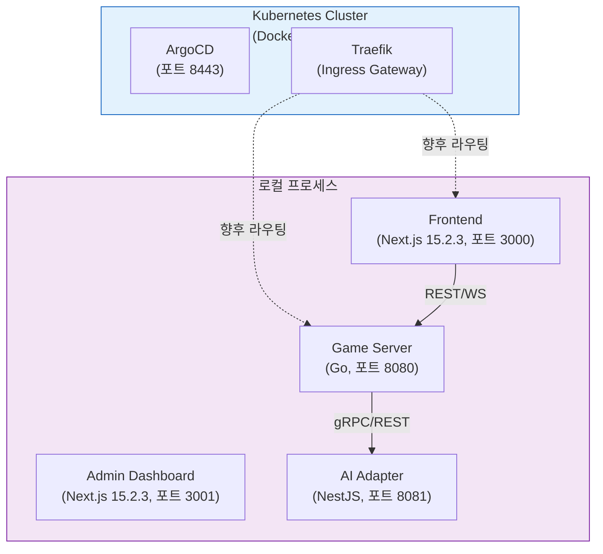
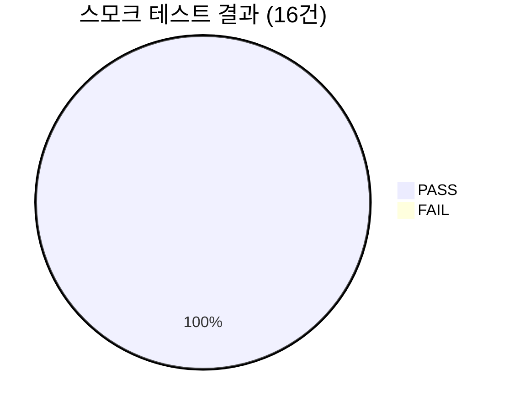
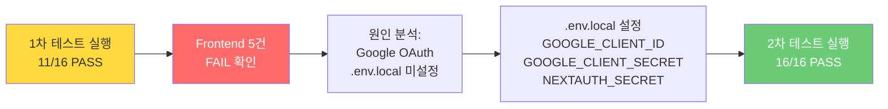
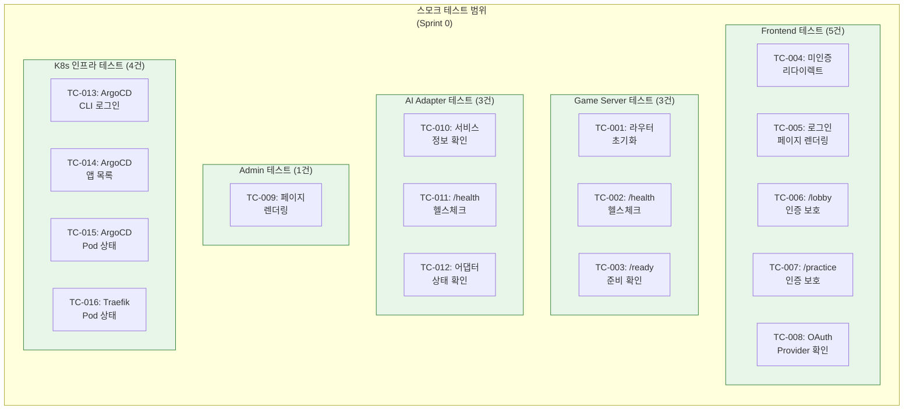
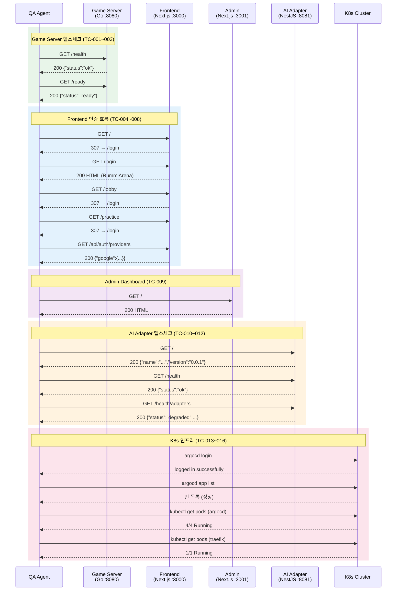
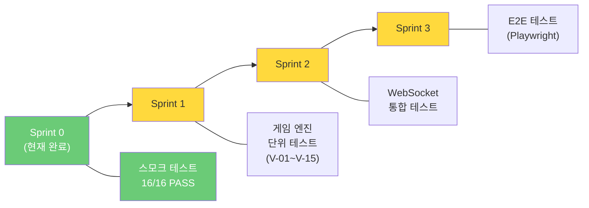

# 스모크 테스트 결과 보고서 (Smoke Test Report)

이 문서는 RummiArena Sprint 0 완료 시점에서 전체 서비스의 기동 상태, 헬스체크, 인증 흐름을 검증한 스모크 테스트 결과를 기록한다.

---

## 1. 테스트 개요

| 항목 | 내용 |
|------|------|
| 일시 | 2026-03-12 |
| 환경 | WSL2 (Ubuntu), Docker Desktop Kubernetes |
| 목적 | Sprint 0 완료 후 전체 서비스 스모크 테스트 (서비스 기동 + 헬스체크 + 인증 흐름 검증) |
| 수행자 | QA Agent (Claude) |
| 테스트 대상 | 5개 서비스, 16개 테스트 케이스 |
| 최종 결과 | **16/16 (100%) PASS** |

### 1.1 실행 환경 상세

| 항목 | 버전/사양 |
|------|-----------|
| OS | WSL2 Ubuntu (Linux 6.6.87.2-microsoft-standard-WSL2) |
| RAM | 16GB (WSL 할당 10GB) |
| CPU | Intel i7-1360P (WSL 할당 6코어) |
| Docker Desktop | Kubernetes v1.34.1 |
| Node.js | v22.21.1 |
| Go | 1.24.1 |
| Helm | 3.20.0 |
| ArgoCD Server | v3.3.3 |
| ArgoCD CLI | v3.3.3 |

### 1.2 테스트 대상 서비스

---

## 2. 테스트 결과 상세

### 2.1 Game Server (Go, 포트 8080) -- 3/3 PASS

| TC | 항목 | 기대값 | 실제값 | 결과 |
|----|------|--------|--------|------|
| TC-001 | gin 라우터 초기화 | 로그에 라우트 등록 출력 | `/health`, `/ready` 라우트 등록 확인 | **PASS** |
| TC-002 | `GET /health` | HTTP 200, `{"status":"ok"}` | HTTP 200, `{"status":"ok","timestamp":"2026-03-12T05:32:43Z"}` | **PASS** |
| TC-003 | `GET /ready` | HTTP 200, `{"status":"ready"}` | HTTP 200, `{"status":"ready"}` | **PASS** |

**비고**: Game Server는 gin 프레임워크 기반으로 라우트가 정상 등록되며, 헬스체크 응답에 timestamp 필드가 추가되어 있다. 이는 향후 K8s livenessProbe/readinessProbe와 연동할 때 유용하다.

---

### 2.2 Frontend (Next.js 15.2.3, 포트 3000) -- 5/5 PASS

| TC | 항목 | 기대값 | 실제값 | 결과 |
|----|------|--------|--------|------|
| TC-004 | `GET /` 미인증 리다이렉트 | HTTP 307 -> `/login` | HTTP 307, Location: `/login` | **PASS** |
| TC-005 | `GET /login` 페이지 렌더링 | HTTP 200, "RummiArena" 포함 | HTTP 200, HTML에 "RummiArena" 확인 | **PASS** |
| TC-006 | `GET /lobby` 인증 보호 | HTTP 307 -> `/login` | HTTP 307, Location: `/login` | **PASS** |
| TC-007 | `GET /practice` 인증 보호 | HTTP 307 -> `/login` | HTTP 307, Location: `/login` | **PASS** |
| TC-008 | `GET /api/auth/providers` | HTTP 200, JSON에 "google" | HTTP 200, `{"google":{"id":"google","name":"Google","type":"oauth"}}` | **PASS** |

**비고**: NextAuth.js 기반 Google OAuth 인증이 정상 동작한다. 미인증 상태에서 보호 경로(`/lobby`, `/practice`) 접근 시 `/login`으로 307 리다이렉트된다. 1차 테스트에서 Google OAuth `.env.local` 미설정으로 5건 FAIL 발생 후, `.env.local` 설정 완료 후 전 항목 PASS.

---

### 2.3 Admin Dashboard (Next.js 15.2.3, 포트 3001) -- 1/1 PASS

| TC | 항목 | 기대값 | 실제값 | 결과 |
|----|------|--------|--------|------|
| TC-009 | `GET /` 페이지 렌더링 | HTTP 200, title 태그 존재 | HTTP 200, `<title>Create Next App</title>` | **PASS** |

**비고**: 서비스 기동 자체는 정상이나, 타이틀이 Next.js 기본 템플릿 상태이다. (이슈 [LOW-001] 참조)

---

### 2.4 AI Adapter (NestJS, 포트 8081) -- 3/3 PASS

| TC | 항목 | 기대값 | 실제값 | 결과 |
|----|------|--------|--------|------|
| TC-010 | `GET /` 서비스 정보 | HTTP 200, JSON | HTTP 200, `{"name":"RummiArena AI Adapter","version":"0.0.1"}` | **PASS** |
| TC-011 | `GET /health` | HTTP 200, `{"status":"ok"}` | HTTP 200, `{"status":"ok","timestamp":"..."}` | **PASS** |
| TC-012 | `GET /health/adapters` | HTTP 200, 어댑터 상태 | HTTP 200, `{"status":"degraded","adapters":{"openai":false,"claude":false,"deepseek":false,"ollama":false}}` | **PASS** |

**비고**: 4개 LLM 어댑터(openai, claude, deepseek, ollama) 모두 `false`로 보고되지만, 이는 로컬 개발 환경에서 API 키가 미설정된 상태이므로 정상이다. `status: "degraded"`는 설계 의도에 부합한다. (이슈 [INFO-001] 참조)

---

### 2.5 ArgoCD / Traefik (K8s, 포트 8443) -- 4/4 PASS

| TC | 항목 | 기대값 | 실제값 | 결과 |
|----|------|--------|--------|------|
| TC-013 | ArgoCD CLI 로그인 | 로그인 성공 | `'admin:login' logged in successfully` | **PASS** |
| TC-014 | `argocd app list` | 정상 응답 | 빈 목록 (등록 앱 0개) -- 정상 | **PASS** |
| TC-015 | ArgoCD Pods 상태 | 전체 Running | 4/4 Running (controller, redis, repo-server, server) | **PASS** |
| TC-016 | Traefik Pod 상태 | Running | 1/1 Running | **PASS** |

**비고**: ArgoCD에 등록된 애플리케이션은 아직 없으나, Sprint 1부터 Helm chart 기반 배포 파이프라인 연동 예정이므로 현 시점에서 정상이다.

---

## 3. 최종 요약

### 3.1 전체 결과

| 구분 | 결과 | 비율 |
|------|------|------|
| 1차 테스트 | 11/16 통과 | 68.75% |
| 2차 테스트 (Google OAuth 설정 후) | **16/16 통과** | **100%** |

### 3.2 서비스별 결과

| 서비스 | 테스트 수 | PASS | FAIL | 통과율 |
|--------|-----------|------|------|--------|
| Game Server (Go) | 3 | 3 | 0 | 100% |
| Frontend (Next.js) | 5 | 5 | 0 | 100% |
| Admin Dashboard (Next.js) | 1 | 1 | 0 | 100% |
| AI Adapter (NestJS) | 3 | 3 | 0 | 100% |
| ArgoCD / Traefik (K8s) | 4 | 4 | 0 | 100% |
| **합계** | **16** | **16** | **0** | **100%** |

### 3.3 1차 테스트 실패 원인 및 해결

---

## 4. 발견된 이슈 및 권고사항

### 4.1 이슈 목록

| ID | 심각도 | 서비스 | 제목 | 상태 |
|----|--------|--------|------|------|
| LOW-001 | LOW | Admin Dashboard | 타이틀 미변경 (기본 템플릿) | Open |
| LOW-002 | LOW | AI Adapter | 기동 시간 과다 (약 15초) | Open |
| INFO-001 | INFO | AI Adapter | 어댑터 상태 degraded (API 키 미설정) | 인지 |
| INFO-002 | INFO | Frontend | .env.local 미포함 (.gitignore 대상) | 인지 |

---

### 4.2 이슈 상세

#### [LOW-001] Admin Dashboard 타이틀 미변경

| 항목 | 내용 |
|------|------|
| 서비스 | Admin Dashboard (포트 3001) |
| 현상 | `<title>Create Next App</title>` (Next.js 기본 템플릿 상태) |
| 기대값 | `<title>RummiArena Admin</title>` 또는 프로젝트명 반영 |
| 권고 | `src/admin/app/layout.tsx` 또는 `src/admin/app/page.tsx`에서 타이틀 변경 |
| 우선순위 | Sprint 1 백로그에 추가 |

#### [LOW-002] AI Adapter 기동 시간 과다

| 항목 | 내용 |
|------|------|
| 서비스 | AI Adapter (NestJS, 포트 8081) |
| 현상 | NestJS bootstrap에 약 15초 소요 |
| 영향 | K8s 배포 시 readinessProbe가 기본 설정이면 Health Check 실패 가능 |
| 권고 | Helm chart에서 `readinessProbe.initialDelaySeconds`를 20초 이상으로 설정 |
| 참조 | `helm/ai-adapter/values.yaml` (향후 생성 시 반영) |

#### [INFO-001] AI Adapter 어댑터 상태 degraded

| 항목 | 내용 |
|------|------|
| 서비스 | AI Adapter (포트 8081) |
| 현상 | 4개 LLM 어댑터(openai, claude, deepseek, ollama) 모두 `false` |
| 원인 | 로컬 개발 환경에서 API 키 미설정 |
| 상태 | 설계 의도에 부합 (키 미설정 시 `degraded` 보고) |
| 조치 | 실제 운영/테스트 시 `.env`에 각 API 키 설정 필요 |

#### [INFO-002] Frontend .env.local 미포함

| 항목 | 내용 |
|------|------|
| 서비스 | Frontend (포트 3000) |
| 현상 | `.env.local`은 `.gitignore` 대상이므로 저장소에 포함되지 않음 |
| 영향 | 팀원이 클론 후 바로 실행하면 Google OAuth 인증 실패 |
| 조치 | `.env.local.example` 파일 제공 및 `docs/03-development/01-dev-setup.md`에 설정 가이드 추가 |

---

## 5. 테스트 아키텍처 다이어그램

### 5.1 테스트 대상 서비스 관계 및 테스트 포인트

### 5.2 서비스 간 의존 관계 및 헬스체크 흐름

---

## 6. 테스트 이력

### 6.1 실행 타임라인

```mermaid
gantt
    title 스모크 테스트 실행 타임라인
    dateFormat HH:mm
    axisFormat %H:%M

    section 1차 테스트
    Game Server (3건 PASS)           :done, gs1, 05:25, 5min
    Frontend (5건 FAIL)              :crit, fe1, 05:30, 10min
    Admin Dashboard (1건 PASS)       :done, ad1, 05:40, 3min
    AI Adapter (3건 PASS)            :done, ai1, 05:43, 5min
    ArgoCD/Traefik (4건 PASS)        :done, k8s1, 05:48, 5min

    section 원인 분석 및 조치
    Frontend OAuth 설정 분석         :active, fix1, 05:55, 10min
    .env.local 설정                  :active, fix2, 06:05, 5min

    section 2차 테스트
    Frontend 재테스트 (5건 PASS)     :done, fe2, 06:10, 10min
```

### 6.2 결과 비교

| 회차 | 일시 | PASS | FAIL | 통과율 | 실패 원인 |
|------|------|------|------|--------|-----------|
| 1차 | 2026-03-12 05:25 | 11 | 5 | 68.75% | Frontend Google OAuth `.env.local` 미설정 |
| 2차 | 2026-03-12 06:10 | 16 | 0 | 100% | (조치 완료) |

---

## 7. 다음 테스트 계획

### 7.1 Sprint별 테스트 로드맵

### 7.2 Sprint 1 테스트 상세 계획

Sprint 1에서는 Game Engine의 핵심인 규칙 검증 로직(V-01~V-15)에 대한 단위 테스트를 최우선으로 수행한다.

| 대상 | 도구 | 테스트 유형 | 커버리지 목표 | 우선순위 |
|------|------|------------|--------------|---------|
| Game Engine (V-01~V-15) | Go testify | 단위 테스트 | 90% 이상 | 최우선 |
| AI Adapter ResponseParser | jest | 단위 테스트 | 80% 이상 | 높음 |
| REST API 핸들러 | Go httptest | 통합 테스트 | 80% 이상 | 보통 |
| AI Adapter 실패 시나리오 | jest | 단위 테스트 | 100% | 높음 |

**Game Engine V-01~V-15 테스트 대상** (참조: `docs/02-design/06-game-rules.md`):

| ID | 검증 항목 | 테스트 우선순위 |
|----|-----------|----------------|
| V-01 | 세트가 유효한 그룹 또는 런인가 | 최우선 |
| V-02 | 세트가 3장 이상인가 | 최우선 |
| V-03 | 랙에서 최소 1장 추가했는가 | 최우선 |
| V-04 | 최초 등록 30점 이상인가 | 최우선 |
| V-05 | 최초 등록 시 랙 타일만 사용했는가 | 최우선 |
| V-06 | 테이블 타일이 유실되지 않았는가 | 높음 |
| V-07 | 조커 교체 후 즉시 사용했는가 | 높음 |
| V-08 | 자기 턴인가 (currentPlayerSeat 확인) | 높음 |
| V-09 | 턴 타임아웃 초과인가 | 보통 |
| V-10 | 드로우 파일이 비어있는가 | 보통 |
| V-11 | 교착 상태인가 (드로우 파일 소진 + 전원 패스) | 보통 |
| V-12 | 승리 조건 달성인가 (랙 타일 0장) | 최우선 |
| V-13 | 재배치 권한이 있는가 (hasInitialMeld) | 높음 |
| V-14 | 그룹에서 같은 색상이 중복되지 않는가 | 최우선 |
| V-15 | 런에서 숫자가 연속인가 (13-1 순환 불가) | 최우선 |

### 7.3 AI Adapter 실패 시나리오 테스트 계획

AI Adapter의 안정성을 보장하기 위해 다음 실패 시나리오를 Sprint 1에서 반드시 테스트한다.

| 시나리오 | 기대 동작 | 테스트 도구 |
|----------|-----------|-------------|
| LLM 응답 타임아웃 (30초 초과) | 재요청 (최대 3회) 후 강제 드로우 | jest + mock timer |
| LLM 응답 잘못된 JSON 포맷 | 파싱 실패 감지, 재요청 | jest |
| LLM 무효 수 제안 (Game Engine 거부) | 재요청 (최대 3회) 후 강제 드로우 | jest + Game Engine mock |
| LLM API 키 만료/인증 실패 | 에러 로깅, graceful fallback | jest |
| LLM API rate limit 초과 (429) | 백오프 후 재시도 | jest |
| Ollama 서버 연결 불가 | 타임아웃 처리, 다른 어댑터 상태에 영향 없음 | jest |

---

## 8. 참조 문서

| 문서 | 경로 |
|------|------|
| 테스트 전략 | `docs/04-testing/01-test-strategy.md` |
| 시스템 아키텍처 | `docs/02-design/01-architecture.md` |
| API 설계 | `docs/02-design/03-api-design.md` |
| AI Adapter 설계 | `docs/02-design/04-ai-adapter-design.md` |
| 게임 규칙 | `docs/02-design/06-game-rules.md` |
| 개발 환경 설정 | `docs/03-development/01-dev-setup.md` |
