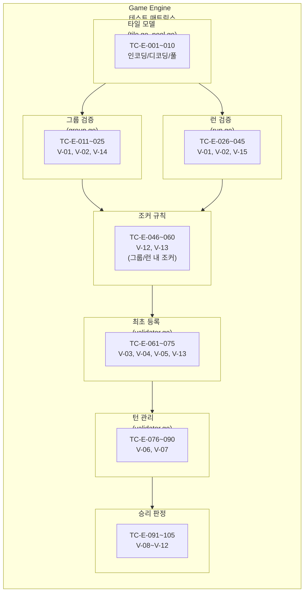
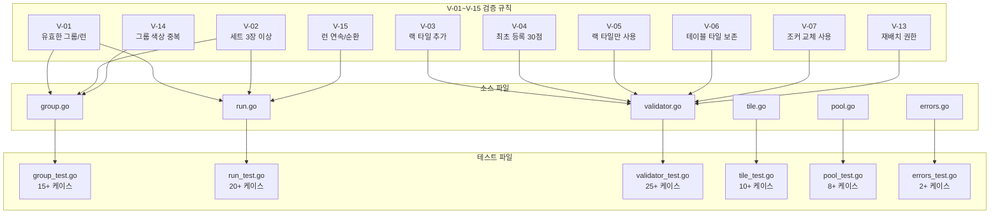
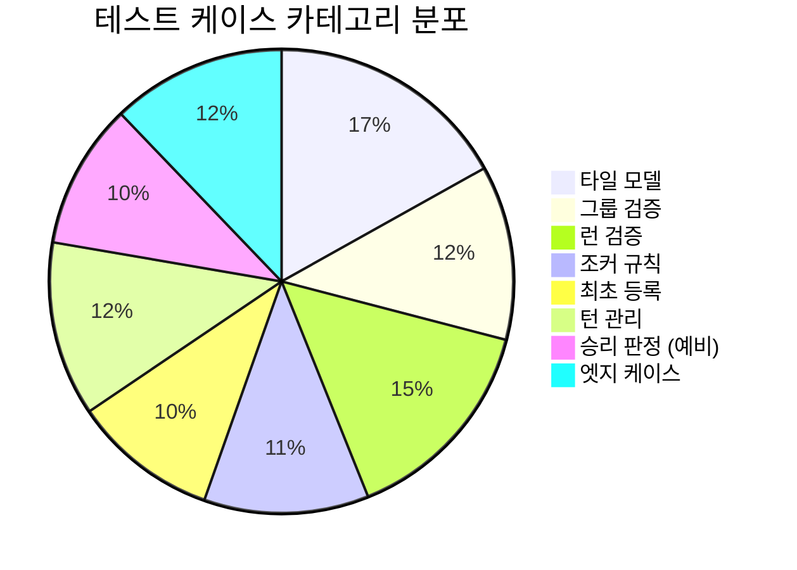
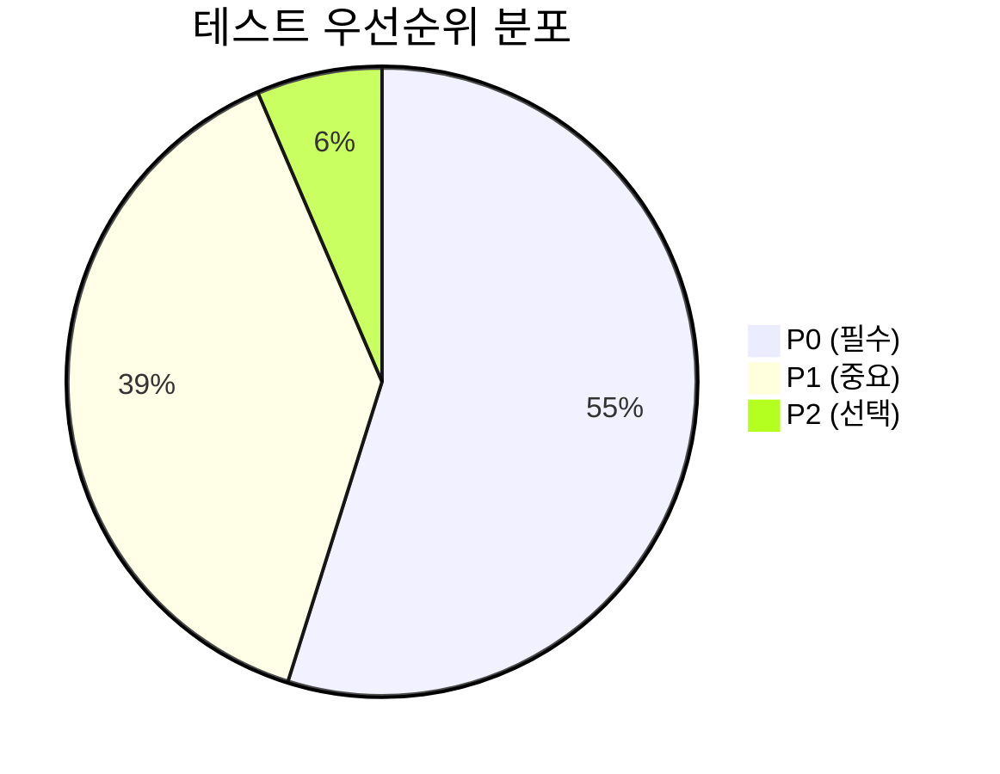
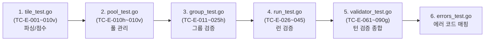

# Game Engine 테스트 케이스 매트릭스

이 문서는 RummiArena Game Engine (`src/game-server/internal/engine/`)의 단위 테스트 케이스를 체계적으로 정의한다.
게임 규칙 검증(V-01~V-15) 각각에 대해 정상/경계/에러 케이스를 포함하며,
실제 타일 코드를 사용한 구체적인 입출력 데이터를 명시한다.

참조 문서:
- `docs/02-design/06-game-rules.md` (게임 규칙 정의)
- `docs/02-design/09-game-engine-detail.md` (엔진 상세 설계)
- `docs/04-testing/01-test-strategy.md` (테스트 전략)

---

## 1. 테스트 커버리지 개요

### 1.1 V-규칙과 테스트 카테고리 매핑



### 1.2 커버리지 목표

| 대상 | 목표 커버리지 | 최소 테스트 수 | 비고 |
|------|-------------|---------------|------|
| tile.go | 90%+ | 10개 | 인코딩/디코딩/점수 |
| pool.go | 85%+ | 8개 | 풀 생성/셔플/분배/드로우 |
| group.go | 95%+ | 15개 | V-01, V-02, V-14 |
| run.go | 95%+ | 20개 | V-01, V-02, V-15 |
| validator.go | 90%+ | 25개 | V-03~V-07, V-13 |
| errors.go | 100% | 2개 | 에러 코드/메시지 매핑 |
| **engine 패키지 전체** | **90%+** | **80개+** | V-01~V-15 각 최소 3개 |

### 1.3 V-규칙별 테스트 수 요약

| V-규칙 | 검증 항목 | 엔진 담당 | 테스트 수 | 테스트 ID 범위 |
|--------|----------|-----------|-----------|---------------|
| V-01 | 유효한 그룹/런 | O | 12 | TC-E-011~016, TC-E-026~031 |
| V-02 | 세트 3장 이상 | O | 6 | TC-E-017~019, TC-E-032~034 |
| V-03 | 랙에서 1장 추가 | O | 4 | TC-E-076~079 |
| V-04 | 최초 등록 30점 | O | 5 | TC-E-061~065 |
| V-05 | 최초 등록 랙 타일만 | O | 4 | TC-E-066~069 |
| V-06 | 테이블 타일 보존 | O | 4 | TC-E-080~083 |
| V-07 | 조커 교체 후 사용 | O | 4 | TC-E-084~087 |
| V-08 | 자기 턴 확인 | X (service) | - | - |
| V-09 | 턴 타임아웃 | X (service) | - | - |
| V-10 | 드로우 파일 소진 | X (service) | - | - |
| V-11 | 교착 상태 | X (service) | - | - |
| V-12 | 승리 조건 | X (service) | - | - |
| V-13 | 재배치 권한 | O | 3 | TC-E-070~072 |
| V-14 | 그룹 색상 중복 | O | 5 | TC-E-020~024 |
| V-15 | 런 연속/순환 | O | 8 | TC-E-035~042 |

> V-08~V-12는 service 레이어 테스트에서 별도 커버한다. 이 문서는 engine 패키지 범위만 다룬다.
> service 레이어의 승리/교착/타임아웃 테스트는 TC-E-091~105 범위에서 예비 정의만 포함한다.

---

## 2. 타일 모델 테스트 (tile.go, pool.go)

### 2.1 타일 인코딩/디코딩 (tile.go)

| ID | 테스트 설명 | 입력 | 기대 결과 | 에러 코드 | 우선순위 | 카테고리 |
|----|-----------|------|----------|----------|---------|---------|
| TC-E-001 | 숫자 타일 파싱 - 정상 (한 자리) | `"R7a"` | `Tile{Color:"R", Number:7, Set:"a", Code:"R7a"}` | - | P0 | 타일모델 |
| TC-E-002 | 숫자 타일 파싱 - 정상 (두 자리) | `"B13b"` | `Tile{Color:"B", Number:13, Set:"b", Code:"B13b"}` | - | P0 | 타일모델 |
| TC-E-003 | 조커 타일 파싱 - JK1 | `"JK1"` | `Tile{IsJoker:true, Code:"JK1"}` | - | P0 | 타일모델 |
| TC-E-004 | 조커 타일 파싱 - JK2 | `"JK2"` | `Tile{IsJoker:true, Code:"JK2"}` | - | P0 | 타일모델 |
| TC-E-005 | 무효 색상 거부 | `"X7a"` | error | ERR_INVALID_TILE_CODE | P0 | 타일모델 |
| TC-E-006 | 무효 숫자 거부 (0) | `"R0a"` | error | ERR_INVALID_TILE_CODE | P0 | 타일모델 |
| TC-E-007 | 무효 숫자 거부 (14) | `"R14a"` | error | ERR_INVALID_TILE_CODE | P0 | 타일모델 |
| TC-E-008 | 무효 세트 거부 | `"R7c"` | error | ERR_INVALID_TILE_CODE | P0 | 타일모델 |
| TC-E-009 | 빈 문자열 거부 | `""` | error | ERR_INVALID_TILE_CODE | P1 | 타일모델 |
| TC-E-010 | 무효 조커 코드 거부 | `"JK3"` | error | ERR_INVALID_TILE_CODE | P1 | 타일모델 |

### 2.2 타일 점수 계산

| ID | 테스트 설명 | 입력 | 기대 결과 | 우선순위 | 카테고리 |
|----|-----------|------|----------|---------|---------|
| TC-E-010a | 숫자 타일 점수 | `R7a` | `7` | P0 | 타일모델 |
| TC-E-010b | 경계값 타일 점수 (1) | `Y1a` | `1` | P1 | 타일모델 |
| TC-E-010c | 경계값 타일 점수 (13) | `K13b` | `13` | P1 | 타일모델 |
| TC-E-010d | 조커 타일 점수 | `JK1` | `30` | P0 | 타일모델 |

### 2.3 ParseAll 일괄 파싱

| ID | 테스트 설명 | 입력 | 기대 결과 | 우선순위 | 카테고리 |
|----|-----------|------|----------|---------|---------|
| TC-E-010e | 복수 타일 정상 파싱 | `["R7a", "B13b", "JK1"]` | 3개 Tile 슬라이스 | P0 | 타일모델 |
| TC-E-010f | 하나라도 무효면 전체 실패 | `["R7a", "X99z", "JK1"]` | error | P0 | 타일모델 |
| TC-E-010g | 빈 슬라이스 | `[]` | 빈 슬라이스 (에러 없음) | P2 | 타일모델 |

### 2.4 타일 풀 (pool.go)

| ID | 테스트 설명 | 입력/조건 | 기대 결과 | 우선순위 | 카테고리 |
|----|-----------|----------|----------|---------|---------|
| TC-E-010h | 전체 타일 수 106장 | `GenerateDeck()` | `len == 106` | P0 | 타일모델 |
| TC-E-010i | 숫자 타일 104장 | `GenerateDeck()` | 숫자 타일 104장 | P0 | 타일모델 |
| TC-E-010j | 조커 2장 | `GenerateDeck()` | JK1, JK2 각 1장 | P0 | 타일모델 |
| TC-E-010k | 색상별 26장 (13x2) | `GenerateDeck()` | R:26, B:26, Y:26, K:26 | P1 | 타일모델 |
| TC-E-010l | 타일 코드 중복 없음 | `GenerateDeck()` | 모든 Code 유니크 | P0 | 타일모델 |
| TC-E-010m | NewTilePool 셔플 확인 | `NewTilePool()` | Remaining() == 106, 순서가 정렬 상태가 아닌지 확인 | P1 | 타일모델 |
| TC-E-010n | Deal 정상 분배 | `pool.Deal(14)` | 14장 반환, Remaining 감소 | P0 | 타일모델 |
| TC-E-010o | Deal 초과 요청 | 남은 3장에서 `Deal(5)` | 3장만 반환 | P1 | 타일모델 |
| TC-E-010p | DrawOne 정상 | 남은 1장 이상 | 1장 반환, Remaining -1 | P0 | 타일모델 |
| TC-E-010q | DrawOne 빈 풀 | `Remaining() == 0` | `nil, error` (ERR_DRAW_PILE_EMPTY) | P0 | 타일모델 |
| TC-E-010r | DealInitialHands 2인 | `DealInitialHands(2)` | 2명 x 14장, Remaining == 78 | P0 | 타일모델 |
| TC-E-010s | DealInitialHands 4인 | `DealInitialHands(4)` | 4명 x 14장, Remaining == 50 | P0 | 타일모델 |
| TC-E-010t | DealInitialHands 범위 초과 (5인) | `DealInitialHands(5)` | error | P1 | 타일모델 |
| TC-E-010u | DealInitialHands 범위 미달 (1인) | `DealInitialHands(1)` | error | P1 | 타일모델 |
| TC-E-010v | Deal 0장 요청 | `Deal(0)` | nil 반환 | P2 | 타일모델 |

---

## 3. 그룹 검증 테스트 (group.go) -- V-01, V-02, V-14

### 3.1 유효한 그룹 (V-01: 그룹 판정)

| ID | V-규칙 | 테스트 설명 | 입력 타일 코드 | 기대 결과 | 에러 코드 | 우선순위 | 카테고리 |
|----|--------|-----------|---------------|----------|----------|---------|---------|
| TC-E-011 | V-01 | 3색 그룹 - 정상 | `[R7a, B7a, K7b]` | PASS | - | P0 | 그룹 |
| TC-E-012 | V-01 | 4색 그룹 - 정상 | `[R5a, B5a, Y5a, K5b]` | PASS | - | P0 | 그룹 |
| TC-E-013 | V-01 | 숫자 1 그룹 (최소값) | `[R1a, B1a, Y1a]` | PASS | - | P1 | 그룹 |
| TC-E-014 | V-01 | 숫자 13 그룹 (최대값) | `[R13a, B13b, K13a]` | PASS | - | P1 | 그룹 |
| TC-E-015 | V-01 | 조커 1장 포함 3색 그룹 | `[R3a, JK1, Y3a]` | PASS | - | P0 | 그룹 |
| TC-E-016 | V-01 | 조커 2장 + 숫자 1장 | `[JK1, R7a, JK2]` | PASS | - | P1 | 그룹 |

### 3.2 세트 크기 규칙 (V-02)

| ID | V-규칙 | 테스트 설명 | 입력 타일 코드 | 기대 결과 | 에러 코드 | 우선순위 | 카테고리 |
|----|--------|-----------|---------------|----------|----------|---------|---------|
| TC-E-017 | V-02 | 2장 그룹 - 거부 | `[R7a, B7a]` | FAIL | ERR_SET_SIZE | P0 | 그룹 |
| TC-E-018 | V-02 | 5장 그룹 - 거부 | `[R7a, B7a, Y7a, K7b, JK1]` | FAIL | ERR_SET_SIZE | P0 | 그룹 |
| TC-E-019 | V-02 | 1장 그룹 - 거부 | `[R7a]` | FAIL | ERR_SET_SIZE | P1 | 그룹 |

### 3.3 색상 중복 규칙 (V-14)

| ID | V-규칙 | 테스트 설명 | 입력 타일 코드 | 기대 결과 | 에러 코드 | 우선순위 | 카테고리 |
|----|--------|-----------|---------------|----------|----------|---------|---------|
| TC-E-020 | V-14 | 같은 색 2장 (R 중복) | `[R7a, R7b, B7a]` | FAIL | ERR_GROUP_COLOR_DUP | P0 | 그룹 |
| TC-E-021 | V-14 | 같은 색 2장 (K 중복) | `[R5a, K5a, K5b]` | FAIL | ERR_GROUP_COLOR_DUP | P0 | 그룹 |
| TC-E-022 | V-14 | 4장 중 색 중복 | `[R7a, B7a, B7b, K7a]` | FAIL | ERR_GROUP_COLOR_DUP | P0 | 그룹 |
| TC-E-023 | V-01 | 숫자 불일치 (7과 8) | `[R7a, B8a, K7b]` | FAIL | ERR_GROUP_NUMBER | P0 | 그룹 |
| TC-E-024 | V-01 | 숫자 불일치 (1과 13) | `[R1a, B13b, Y1a]` | FAIL | ERR_GROUP_NUMBER | P1 | 그룹 |

### 3.4 그룹 점수 계산

| ID | V-규칙 | 테스트 설명 | 입력 타일 코드 | 기대 점수 | 우선순위 | 카테고리 |
|----|--------|-----------|---------------|----------|---------|---------|
| TC-E-025a | - | 3색 그룹 점수 | `[R7a, B7a, K7b]` | 21 | P0 | 그룹 |
| TC-E-025b | - | 4색 그룹 점수 | `[R5a, B5a, Y5a, K5b]` | 20 | P0 | 그룹 |
| TC-E-025c | - | 조커 포함 점수 (조커가 대체 숫자 값) | `[R3a, JK1, Y3a]` | 9 | P0 | 그룹 |
| TC-E-025d | - | 조커 2장 점수 | `[JK1, R10a, JK2]` | 30 | P1 | 그룹 |
| TC-E-025e | - | 10점 그룹 (최초 등록 경계값) | `[R10a, B10a, K10b]` | 30 | P0 | 그룹 |

### 3.5 그룹 엣지 케이스

| ID | V-규칙 | 테스트 설명 | 입력 타일 코드 | 기대 결과 | 에러 코드 | 우선순위 | 카테고리 |
|----|--------|-----------|---------------|----------|----------|---------|---------|
| TC-E-025f | V-01 | 빈 타일 슬라이스 | `[]` | FAIL | ERR_SET_SIZE | P1 | 그룹 |
| TC-E-025g | V-01 | 조커만 3장 (숫자 타일 없음) | `[JK1, JK2, JK1]` | FAIL (파싱 에러 또는 무효) | 구현 의존 | P1 | 그룹 |
| TC-E-025h | V-14 | 세트 a/b 혼합 동일 색상 | `[R7a, R7b, B7a, K7a]` | FAIL | ERR_GROUP_COLOR_DUP | P1 | 그룹 |

---

## 4. 런 검증 테스트 (run.go) -- V-01, V-02, V-15

### 4.1 유효한 런 (V-01: 런 판정)

| ID | V-규칙 | 테스트 설명 | 입력 타일 코드 | 기대 결과 | 에러 코드 | 우선순위 | 카테고리 |
|----|--------|-----------|---------------|----------|----------|---------|---------|
| TC-E-026 | V-01 | 3연속 런 - 정상 | `[Y3a, Y4a, Y5a]` | PASS | - | P0 | 런 |
| TC-E-027 | V-01 | 4연속 런 - 정상 | `[B9a, B10b, B11a, B12a]` | PASS | - | P0 | 런 |
| TC-E-028 | V-01 | 시작이 1인 런 | `[R1a, R2a, R3a]` | PASS | - | P0 | 런 |
| TC-E-029 | V-01 | 끝이 13인 런 | `[K11a, K12b, K13a]` | PASS | - | P0 | 런 |
| TC-E-030 | V-01 | 5연속 런 | `[Y1a, Y2a, Y3a, Y4a, Y5a]` | PASS | - | P1 | 런 |
| TC-E-031 | V-01 | 13장 풀 런 (최대) | `[R1a, R2a, R3a, R4a, R5a, R6a, R7a, R8a, R9a, R10a, R11a, R12a, R13a]` | PASS | - | P1 | 런 |

### 4.2 세트 크기 규칙 (V-02)

| ID | V-규칙 | 테스트 설명 | 입력 타일 코드 | 기대 결과 | 에러 코드 | 우선순위 | 카테고리 |
|----|--------|-----------|---------------|----------|----------|---------|---------|
| TC-E-032 | V-02 | 2장 런 - 거부 | `[R3a, R4a]` | FAIL | ERR_SET_SIZE | P0 | 런 |
| TC-E-033 | V-02 | 1장 런 - 거부 | `[Y7a]` | FAIL | ERR_SET_SIZE | P1 | 런 |
| TC-E-034 | V-02 | 빈 슬라이스 런 - 거부 | `[]` | FAIL | ERR_SET_SIZE | P2 | 런 |

### 4.3 숫자 연속/순환 규칙 (V-15)

| ID | V-규칙 | 테스트 설명 | 입력 타일 코드 | 기대 결과 | 에러 코드 | 우선순위 | 카테고리 |
|----|--------|-----------|---------------|----------|----------|---------|---------|
| TC-E-035 | V-15 | 13-1 순환 거부 | `[R12a, R13a, R1a]` | FAIL | ERR_RUN_SEQUENCE | P0 | 런 |
| TC-E-036 | V-15 | 비연속 (3,5,6) - 갭 있음 | `[Y3a, Y5a, Y6a]` | FAIL | ERR_RUN_SEQUENCE | P0 | 런 |
| TC-E-037 | V-15 | 비연속 (3,5,7) - 갭 2개 | `[R3a, R5a, R7a]` | FAIL | ERR_RUN_SEQUENCE | P1 | 런 |
| TC-E-038 | V-15 | 같은 숫자 중복 (세트a/b 혼합) | `[R3a, R3b, R4a]` | FAIL | ERR_RUN_DUPLICATE | P0 | 런 |
| TC-E-039 | V-01 | 색상 혼합 거부 | `[R3a, B4a, Y5a]` | FAIL | ERR_RUN_COLOR | P0 | 런 |
| TC-E-040 | V-01 | 2색 혼합 거부 | `[R3a, R4a, B5a]` | FAIL | ERR_RUN_COLOR | P1 | 런 |
| TC-E-041 | V-15 | 내림차순 입력 (정렬 필요) | `[K5a, K4a, K3a]` | PASS (내부 정렬) | - | P1 | 런 |
| TC-E-042 | V-15 | 랜덤 순서 입력 (정렬 필요) | `[B7a, B5a, B6a]` | PASS (내부 정렬) | - | P1 | 런 |

### 4.4 런 점수 계산

| ID | V-규칙 | 테스트 설명 | 입력 타일 코드 | 기대 점수 | 우선순위 | 카테고리 |
|----|--------|-----------|---------------|----------|---------|---------|
| TC-E-043a | - | 3연속 런 점수 | `[Y3a, Y4a, Y5a]` | 12 | P0 | 런 |
| TC-E-043b | - | 4연속 런 점수 | `[B9a, B10b, B11a, B12a]` | 42 | P0 | 런 |
| TC-E-043c | - | 1-2-3 런 점수 (최소) | `[R1a, R2a, R3a]` | 6 | P1 | 런 |
| TC-E-043d | - | 11-12-13 런 점수 (최대 3장) | `[K11a, K12b, K13a]` | 36 | P1 | 런 |
| TC-E-043e | - | 13장 풀 런 점수 | `[R1a~R13a]` | 91 | P1 | 런 |

### 4.5 런 엣지 케이스

| ID | V-규칙 | 테스트 설명 | 입력 타일 코드 | 기대 결과 | 에러 코드 | 우선순위 | 카테고리 |
|----|--------|-----------|---------------|----------|----------|---------|---------|
| TC-E-044 | V-15 | 11-12-13 경계 런 | `[K11a, K12b, K13a]` | PASS | - | P0 | 런 |
| TC-E-045 | V-15 | 1-2-3 경계 런 | `[B1a, B2a, B3a]` | PASS | - | P0 | 런 |

---

## 5. 조커 규칙 테스트 -- V-12, V-13 (그룹/런 내 조커)

### 5.1 조커가 그룹에서 대체

| ID | V-규칙 | 테스트 설명 | 입력 타일 코드 | 기대 결과 | 기대 점수 | 우선순위 | 카테고리 |
|----|--------|-----------|---------------|----------|----------|---------|---------|
| TC-E-046 | V-01 | 조커가 누락된 색상 대체 (3장) | `[R3a, JK1, Y3a]` | PASS | 9 | P0 | 조커 |
| TC-E-047 | V-01 | 조커 2장 + 숫자 1장 그룹 | `[JK1, R7a, JK2]` | PASS | 21 | P0 | 조커 |
| TC-E-048 | V-01 | 조커 1장 4색 그룹 | `[R5a, B5a, Y5a, JK1]` | PASS | 20 | P1 | 조커 |
| TC-E-049 | V-01 | 조커 2장 4색 그룹 | `[R10a, JK1, JK2, K10b]` | PASS | 40 | P1 | 조커 |

### 5.2 조커가 런에서 대체

| ID | V-규칙 | 테스트 설명 | 입력 타일 코드 | 기대 결과 | 기대 점수 | 우선순위 | 카테고리 |
|----|--------|-----------|---------------|----------|----------|---------|---------|
| TC-E-050 | V-15 | 조커가 중간 위치 대체 (3-?-5) | `[R3a, JK1, R5a]` | PASS | 12 | P0 | 조커 |
| TC-E-051 | V-15 | 조커가 끝 위치 대체 (11-12-?) | `[K11a, K12b, JK1]` | PASS | 36 | P0 | 조커 |
| TC-E-052 | V-15 | 조커가 시작 위치 대체 (?-2-3) | `[JK1, R2a, R3a]` | PASS | 6 | P0 | 조커 |
| TC-E-053 | V-15 | 조커 2장이 연속 갭 대체 (3-?-?-6) | `[R3a, JK1, JK2, R6a]` | PASS | 18 | P0 | 조커 |
| TC-E-054 | V-15 | 조커가 끝 확장 (3-4-5-?) | `[R3a, R4a, R5a, JK1]` | PASS | 18 | P1 | 조커 |

### 5.3 조커 교체 (조커 스왑)

| ID | V-규칙 | 테스트 설명 | 입력 데이터 | 기대 결과 | 에러 코드 | 우선순위 | 카테고리 |
|----|--------|-----------|-----------|----------|----------|---------|---------|
| TC-E-055 | V-07 | 조커 교체 + 즉시 사용 - 정상 | 테이블 `[R7a, JK1, K7b]`, 랙 `B7a` 교체, JK1을 다른 세트에 배치 | PASS | - | P0 | 조커 |
| TC-E-056 | V-07 | 조커 교체 + 미사용 - 거부 | 테이블 `[R7a, JK1, K7b]`, 랙 `B7a` 교체, JK1이 테이블에 없음 | FAIL | ERR_JOKER_NOT_USED | P0 | 조커 |
| TC-E-057 | V-07 | 조커 미교체 (정상 진행) | 테이블 `[R7a, JK1, K7b]` 변경 없음 | PASS | - | P1 | 조커 |
| TC-E-058 | V-07 | 조커 교체 후 다른 세트에서 사용 | JK1 교체 후 새 런에서 사용 | PASS | - | P0 | 조커 |

### 5.4 조커 2개 동시 사용

| ID | V-규칙 | 테스트 설명 | 입력 타일 코드 | 기대 결과 | 에러 코드 | 우선순위 | 카테고리 |
|----|--------|-----------|---------------|----------|----------|---------|---------|
| TC-E-059 | V-01 | 조커 2장 런 (3-?-?-6) | `[R3a, JK1, JK2, R6a]` | PASS | - | P0 | 조커 |
| TC-E-060 | V-01 | 조커 2장 그룹 (R7 + 2조커) | `[R7a, JK1, JK2]` | PASS | - | P0 | 조커 |
| TC-E-060a | V-15 | 조커 부족으로 갭 메울 수 없음 | `[R3a, JK1, R7a]` | FAIL | ERR_RUN_SEQUENCE | P1 | 조커 |
| TC-E-060b | V-15 | 조커 위치가 범위 초과 (?-?-12-13) | `[JK1, JK2, R12a, R13a]` (4장, 뒤 확장 불가 -> 앞 확장 시도 -> 10-11-12-13) | PASS | - | P1 | 조커 |

---

## 6. 최초 등록 테스트 (validator.go) -- V-03, V-04, V-05, V-13

### 6.1 최초 등록 점수 (V-04)

| ID | V-규칙 | 테스트 설명 | 배치 타일 | 합계 점수 | 기대 결과 | 에러 코드 | 우선순위 | 카테고리 |
|----|--------|-----------|----------|----------|----------|----------|---------|---------|
| TC-E-061 | V-04 | 정확히 30점 그룹 | `[R10a, B10a, K10b]` | 30 | PASS | - | P0 | 최초등록 |
| TC-E-062 | V-04 | 30점 초과 (유효) | `[R11a, B11a, K11b]` | 33 | PASS | - | P0 | 최초등록 |
| TC-E-063 | V-04 | 29점 (부족) | `[R9a, B9a, Y9b, K9a]` | 36 -> 정상이므로 다른 예시: `[R9a, B9a, K9b]` | 27 | FAIL | ERR_INITIAL_MELD_SCORE | P0 | 최초등록 |
| TC-E-064 | V-04 | 복수 세트 합산 30점 | 런 `[Y1a, Y2a, Y3a]`(6) + 그룹 `[R10a, B10a, K10b]`(30) = 36 | 36 | PASS | - | P0 | 최초등록 |
| TC-E-065 | V-04 | 조커 포함 최초 등록 점수 | 런 `[R8a, JK1, R10a]` = 8+9+10=27 | 27 | FAIL | ERR_INITIAL_MELD_SCORE | P0 | 최초등록 |
| TC-E-065a | V-04 | 조커 포함 30점 이상 | 런 `[R11a, JK1, R13a]` = 11+12+13=36 | 36 | PASS | - | P0 | 최초등록 |

### 6.2 최초 등록 타일 출처 (V-05)

| ID | V-규칙 | 테스트 설명 | 조건 | 기대 결과 | 에러 코드 | 우선순위 | 카테고리 |
|----|--------|-----------|------|----------|----------|---------|---------|
| TC-E-066 | V-05 | 랙 타일만 사용 - 정상 | 랙에 있는 타일로만 세트 구성 | PASS | - | P0 | 최초등록 |
| TC-E-067 | V-05 | 테이블 타일 사용 시도 - 거부 | 기존 테이블 타일 재배치 시도 | FAIL | ERR_INITIAL_MELD_SOURCE | P0 | 최초등록 |
| TC-E-068 | V-05 | 랙에 없는 타일 포함 - 거부 | 제출 타일 중 랙에 존재하지 않는 타일 | FAIL | ERR_INITIAL_MELD_SOURCE | P1 | 최초등록 |
| TC-E-069 | V-05 | 빈 테이블에 최초 배치 | 테이블 비어있음, 랙 타일만 사용 | PASS | - | P0 | 최초등록 |

### 6.3 재배치 권한 (V-13)

| ID | V-규칙 | 테스트 설명 | HasInitialMeld | 조건 | 기대 결과 | 에러 코드 | 우선순위 | 카테고리 |
|----|--------|-----------|---------------|------|----------|----------|---------|---------|
| TC-E-070 | V-13 | 최초 등록 전 재배치 시도 - 거부 | false | 기존 세트 변경 | FAIL | ERR_NO_REARRANGE_PERM | P0 | 최초등록 |
| TC-E-071 | V-13 | 최초 등록 후 재배치 허용 | true | 기존 세트 변경 + 랙 타일 추가 | PASS | - | P0 | 최초등록 |
| TC-E-072 | V-13 | 최초 등록 후 재배치 (테이블 타일 이동) | true | 세트 분할/합병 | PASS | - | P0 | 최초등록 |

### 6.4 최초 등록 종합 시나리오

| ID | V-규칙 | 테스트 설명 | 입력 | 기대 결과 | 우선순위 | 카테고리 |
|----|--------|-----------|------|----------|---------|---------|
| TC-E-073 | V-04,05 | 여러 세트로 30점 달성 | 그룹 `[R8a, B8a, K8b]`(24) + 런 `[Y1a, Y2a, Y3a]`(6) = 30 | PASS | P0 | 최초등록 |
| TC-E-074 | V-04,05 | 최초 등록 시 조커를 포함한 세트 | `[R10a, JK1, K10b]` = 10+10+10 = 30 | PASS | P0 | 최초등록 |
| TC-E-075 | V-04,05 | 6점짜리 세트만 배치 | `[Y1a, Y2a, Y3a]` = 6 | FAIL (30점 미달) | P0 | 최초등록 |

---

## 7. 턴 관리 테스트 (validator.go) -- V-03, V-06, V-07

### 7.1 랙 타일 사용 검증 (V-03)

| ID | V-규칙 | 테스트 설명 | TableBefore 타일 수 | TableAfter 타일 수 | 기대 결과 | 에러 코드 | 우선순위 | 카테고리 |
|----|--------|-----------|-------------------|-------------------|----------|----------|---------|---------|
| TC-E-076 | V-03 | 랙에서 1장 추가 - 정상 | 6 | 7 | PASS | - | P0 | 턴관리 |
| TC-E-077 | V-03 | 랙에서 3장 추가 - 정상 | 6 | 9 | PASS | - | P1 | 턴관리 |
| TC-E-078 | V-03 | 재배치만 (추가 없음) - 거부 | 6 | 6 | FAIL | ERR_NO_RACK_TILE | P0 | 턴관리 |
| TC-E-079 | V-03 | 테이블 타일 수 감소 - 거부 | 6 | 5 | FAIL | V-06 연계 | P0 | 턴관리 |

### 7.2 테이블 타일 보존 (V-06)

| ID | V-규칙 | 테스트 설명 | 조건 | 기대 결과 | 에러 코드 | 우선순위 | 카테고리 |
|----|--------|-----------|------|----------|----------|---------|---------|
| TC-E-080 | V-06 | 타일 보존 - 정상 (재배치) | before 타일 전부 after에 존재 | PASS | - | P0 | 턴관리 |
| TC-E-081 | V-06 | 타일 유실 감지 | before `R7a` 가 after에 없음 | FAIL | ERR_TABLE_TILE_MISSING | P0 | 턴관리 |
| TC-E-082 | V-06 | 타일 세트 간 이동 (유효) | `R7a`가 세트1에서 세트2로 이동 | PASS | - | P0 | 턴관리 |
| TC-E-083 | V-06 | 다수 타일 유실 | before 3장이 after에 없음 | FAIL | ERR_TABLE_TILE_MISSING | P1 | 턴관리 |

### 7.3 조커 교체 검증 (V-07)

| ID | V-규칙 | 테스트 설명 | JokerReturnedCodes | TableAfter 조커 존재 | 기대 결과 | 에러 코드 | 우선순위 | 카테고리 |
|----|--------|-----------|-------------------|---------------------|----------|----------|---------|---------|
| TC-E-084 | V-07 | 조커 교체 없음 - 정상 | `[]` | - | PASS | - | P0 | 턴관리 |
| TC-E-085 | V-07 | 조커 교체 + 즉시 사용 | `["JK1"]` | JK1이 다른 세트에 존재 | PASS | - | P0 | 턴관리 |
| TC-E-086 | V-07 | 조커 교체 + 미사용 | `["JK1"]` | JK1이 TableAfter에 없음 | FAIL | ERR_JOKER_NOT_USED | P0 | 턴관리 |
| TC-E-087 | V-07 | 조커 2장 교체 + 모두 사용 | `["JK1", "JK2"]` | 둘 다 TableAfter에 존재 | PASS | - | P1 | 턴관리 |

### 7.4 턴 검증 종합 시나리오 (ValidateTurnConfirm)

| ID | V-규칙 | 테스트 설명 | HasInitialMeld | 기대 결과 | 관련 V-규칙 | 우선순위 | 카테고리 |
|----|--------|-----------|---------------|----------|------------|---------|---------|
| TC-E-088 | V-01~05 | 유효 그룹 최초 등록 30점 | false | PASS | V-01, V-02, V-03, V-04, V-05 | P0 | 턴관리 |
| TC-E-089 | V-04 | 최초 등록 25점 런 - 거부 | false | FAIL | V-04 | P0 | 턴관리 |
| TC-E-090 | V-01,03,06 | 재배치 + 랙 추가 (등록 완료 후) | true | PASS | V-01, V-03, V-06 | P0 | 턴관리 |
| TC-E-090a | V-03 | 재배치만 (랙 미추가) - 거부 | true | FAIL | V-03 | P0 | 턴관리 |
| TC-E-090b | V-06 | 테이블 타일 유실 | true | FAIL | V-06 | P0 | 턴관리 |
| TC-E-090c | V-05,13 | 최초 등록 전 재배치 시도 | false | FAIL | V-05, V-13 | P0 | 턴관리 |
| TC-E-090d | V-07 | 조커 교체 + 즉시 사용 | true | PASS | V-07 | P0 | 턴관리 |
| TC-E-090e | V-07 | 조커 교체 + 미사용 - 거부 | true | FAIL | V-07 | P0 | 턴관리 |
| TC-E-090f | V-01,03,06 | 복합 재배치 (분할+합병+추가) | true | PASS | V-01, V-03, V-06 | P1 | 턴관리 |
| TC-E-090g | V-01 | 무효 세트 포함 배치 | true | FAIL | V-01 | P0 | 턴관리 |

---

## 8. 승리 판정 / 교착 상태 테스트 (service 레이어 예비 정의)

> 아래 테스트들은 engine 패키지 외부(service 레이어)에서 구현하지만,
> 게임 엔진 설계와의 연계를 위해 테스트 ID를 예약한다.
> score.go, snapshot.go 등이 구현되면 engine 패키지 테스트로 편입될 수 있다.

### 8.1 승리 조건 (V-12)

| ID | V-규칙 | 테스트 설명 | 조건 | 기대 결과 | 우선순위 | 카테고리 |
|----|--------|-----------|------|----------|---------|---------|
| TC-E-091 | V-12 | 랙 0장 -> 승리 | 마지막 타일 배치 후 랙 비어있음 | 게임 종료, 해당 플레이어 승리 | P0 | 승리판정 |
| TC-E-092 | V-12 | 랙 1장 -> 게임 계속 | 배치 후 랙에 1장 남음 | 게임 계속 | P0 | 승리판정 |
| TC-E-093 | V-12 | 마지막 타일이 무효 세트 | 랙 1장을 무효 세트에 배치 | 배치 거부, 게임 계속 | P0 | 승리판정 |

### 8.2 교착 상태 (V-11)

| ID | V-규칙 | 테스트 설명 | 조건 | 기대 결과 | 우선순위 | 카테고리 |
|----|--------|-----------|------|----------|---------|---------|
| TC-E-094 | V-11 | 드로우 파일 소진 + 전원 패스 | DrawPileExhausted=true, ConsecutivePass >= PlayerCount | 교착 판정 | P0 | 승리판정 |
| TC-E-095 | V-11 | 드로우 소진 + 배치 성공 | 드로우 파일 0장이지만 타일 배치 성공 | 게임 계속, 패스 카운터 초기화 | P0 | 승리판정 |
| TC-E-096 | V-11 | 드로우 남아있음 + 전원 패스 | DrawPileExhausted=false | 교착 아님 (드로우 가능) | P1 | 승리판정 |

### 8.3 점수 계산

| ID | V-규칙 | 테스트 설명 | 잔여 타일 | 기대 점수 | 우선순위 | 카테고리 |
|----|--------|-----------|----------|----------|---------|---------|
| TC-E-097 | - | 승자 점수 0점 | 랙 비어있음 | 0 | P0 | 승리판정 |
| TC-E-098 | - | 패자 숫자 타일 합산 | `[R3a, K8b]` | 3+8 = 11 | P0 | 승리판정 |
| TC-E-099 | - | 조커 포함 패자 점수 | `[R3a, K8b, JK1]` | 3+8+30 = 41 | P0 | 승리판정 |
| TC-E-100 | - | 교착 시 최소 점수 승자 | A:7점, B:41점, C:15점 | A가 승자 | P0 | 승리판정 |

### 8.4 동점 처리

| ID | V-규칙 | 테스트 설명 | 조건 | 기대 결과 | 우선순위 | 카테고리 |
|----|--------|-----------|------|----------|---------|---------|
| TC-E-101 | - | 동점 + 타일 수 차이 | A:7점(2장), B:7점(3장) | A 승리 (타일 수 적음) | P0 | 승리판정 |
| TC-E-102 | - | 동점 + 타일 수 동일 | A:7점(2장), B:7점(2장) | 무승부 | P1 | 승리판정 |

### 8.5 ELO 레이팅

| ID | V-규칙 | 테스트 설명 | 조건 | 기대 결과 | 우선순위 | 카테고리 |
|----|--------|-----------|------|----------|---------|---------|
| TC-E-103 | - | 2인전 ELO 정상 계산 | A(1200) 승, B(1000) 패 | A:+8, B:-10 (근사) | P1 | 승리판정 |
| TC-E-104 | - | 이변 시 ELO 큰 변동 | A(1200) 패, B(1000) 승 | A:-24, B:+30 (근사) | P1 | 승리판정 |
| TC-E-105 | - | CANCELLED 시 ELO 미반영 | endType="CANCELLED" | 모든 delta = 0 | P0 | 승리판정 |

---

## 9. 엣지 케이스 종합 목록

게임 엔진 전반에 걸친 특수 상황/경계 조건을 별도로 정리한다.

### 9.1 타일 배치 엣지 케이스

| ID | 테스트 설명 | 조건 | 기대 결과 | 관련 V-규칙 | 우선순위 |
|----|-----------|------|----------|------------|---------|
| TC-E-EC-01 | 빈 테이블에 첫 배치 | TableBefore = [], 최초 등록 | 30점 이상이면 PASS | V-04, V-05 | P0 |
| TC-E-EC-02 | 최초 등록 전 테이블 재배치 시도 | HasInitialMeld=false, 기존 세트 변경 | FAIL (재배치 불가) | V-05, V-13 | P0 |
| TC-E-EC-03 | 조커만으로 구성된 세트 | `[JK1, JK2]` (2장) | FAIL (크기 미달 + 숫자 타일 없음) | V-02 | P1 |
| TC-E-EC-04 | 1장만 남은 상태에서 배치 | 랙에 R7a 1장, 기존 그룹에 추가 | 세트 유효하면 PASS, 랙 0장 -> 승리 | V-01, V-12 | P0 |
| TC-E-EC-05 | 동시 여러 세트 배치 + 기존 세트 재배치 | 2개 새 세트 + 1개 기존 세트 분할 | 모든 세트 유효 + 타일 보존 확인 | V-01, V-03, V-06 | P1 |
| TC-E-EC-06 | 테이블 전체 세트가 0개인 상태에서 확정 | TableAfter = [] | FAIL (랙 타일 추가 없음) | V-03 | P1 |
| TC-E-EC-07 | 같은 타일을 2번 사용 시도 | 랙에 R7a 1장인데 2곳에 사용 | 타일 보존 검증에서 감지 | V-06 | P1 |

### 9.2 조커 엣지 케이스

| ID | 테스트 설명 | 조건 | 기대 결과 | 관련 V-규칙 | 우선순위 |
|----|-----------|------|----------|------------|---------|
| TC-E-EC-08 | 조커 2장 동시 교체 | JK1, JK2 모두 테이블에서 회수 후 즉시 재사용 | 둘 다 TableAfter에 존재하면 PASS | V-07 | P1 |
| TC-E-EC-09 | 조커 교체 후 원래 세트가 무효 | `[R7a, JK1, K7b]`에서 JK1 제거 후 `[R7a, K7b]` (2장) | FAIL (세트 무효) | V-01, V-02 | P0 |
| TC-E-EC-10 | 조커를 같은 세트 내에서 재배치 | JK1의 위치만 변경 (동일 세트) | PASS (세트 유효하면) | V-01 | P2 |
| TC-E-EC-11 | 런에서 조커 위치가 양끝 모두 가능 | `[JK1, R6a, R7a]` (JK1=5 또는 JK1=8?) | PASS (유효 위치 존재하면) | V-15 | P1 |

### 9.3 세트 구조 엣지 케이스

| ID | 테스트 설명 | 조건 | 기대 결과 | 관련 V-규칙 | 우선순위 |
|----|-----------|------|----------|------------|---------|
| TC-E-EC-12 | 그룹인지 런인지 모호한 세트 | `[R7a, B7a, Y7a]` -> 그룹으로 유효 | PASS (그룹) | V-01 | P1 |
| TC-E-EC-13 | 그룹/런 양쪽 모두 실패 | `[R3a, B5a, Y7a]` | FAIL | ERR_INVALID_SET | P0 |
| TC-E-EC-14 | 최초 등록 세트가 그룹+런 혼합 | 그룹 1개 + 런 1개 동시 배치 | 각각 유효 + 합산 30점 이상 -> PASS | V-01, V-04 | P0 |
| TC-E-EC-15 | 14장 이상 런 시도 (불가능하지만 방어) | 14장 동일 색상 (숫자 1~13 + 조커) | PASS (13장 런 + 조커 위치 유효하면) | V-15 | P2 |

### 9.4 타일 풀 엣지 케이스

| ID | 테스트 설명 | 조건 | 기대 결과 | 관련 V-규칙 | 우선순위 |
|----|-----------|------|----------|------------|---------|
| TC-E-EC-16 | 4인 플레이 후 드로우 파일 수 | 106 - (4 x 14) = 50장 | Remaining() == 50 | - | P0 |
| TC-E-EC-17 | 연속 드로우로 풀 소진 | 50번 DrawOne() 호출 | 50번째 성공, 51번째 error | V-10 | P1 |
| TC-E-EC-18 | 음수 Deal 요청 | `Deal(-1)` | nil 반환 (패닉 안 함) | - | P2 |

---

## 10. 테스트 구현 가이드

### 10.1 Go 테스트 파일 구조

```
src/game-server/internal/engine/
├── tile.go              -> tile_test.go         (TC-E-001~010v)
├── pool.go              -> pool_test.go         (TC-E-010h~010v)
├── group.go             -> group_test.go        (TC-E-011~025h)
├── run.go               -> run_test.go          (TC-E-026~045)
├── validator.go         -> validator_test.go    (TC-E-061~090g)
├── errors.go            -> errors_test.go       (에러 코드/메시지 매핑)
├── score.go (미구현)     -> score_test.go        (TC-E-097~105)
└── snapshot.go (미구현)  -> snapshot_test.go     (스냅샷 비교)
```

### 10.2 Table-Driven Test 패턴 (권장)

모든 테스트는 Go의 Table-Driven Test 패턴을 사용한다.

```go
func TestValidateGroup(t *testing.T) {
    tests := []struct {
        name      string
        tileCodes []string
        wantErr   bool
        errMsg    string // 에러 메시지 부분 일치 확인용
    }{
        // TC-E-011: 3색 그룹 정상
        {
            name:      "TC-E-011: 3색 그룹 정상",
            tileCodes: []string{"R7a", "B7a", "K7b"},
            wantErr:   false,
        },
        // TC-E-017: 2장 그룹 거부
        {
            name:      "TC-E-017: 2장 그룹 거부",
            tileCodes: []string{"R7a", "B7a"},
            wantErr:   true,
            errMsg:    "3 or 4 tiles",
        },
        // TC-E-020: 같은 색 중복
        {
            name:      "TC-E-020: 같은 색 중복 (R)",
            tileCodes: []string{"R7a", "R7b", "B7a"},
            wantErr:   true,
            errMsg:    "duplicate color",
        },
    }

    for _, tt := range tests {
        t.Run(tt.name, func(t *testing.T) {
            tiles, err := ParseAll(tt.tileCodes)
            require.NoError(t, err, "tile parsing should succeed")

            err = ValidateGroup(tiles)
            if tt.wantErr {
                assert.Error(t, err)
                if tt.errMsg != "" {
                    assert.Contains(t, err.Error(), tt.errMsg)
                }
            } else {
                assert.NoError(t, err)
            }
        })
    }
}
```

### 10.3 ValidateTurnConfirm 통합 테스트 패턴

```go
func TestValidateTurnConfirm(t *testing.T) {
    // 헬퍼: 타일 코드로 TileSet 생성
    makeSet := func(id string, codes ...string) *TileSet {
        tiles, _ := ParseAll(codes)
        return &TileSet{ID: id, Tiles: tiles}
    }

    tests := []struct {
        name    string
        req     TurnConfirmRequest
        wantErr bool
        errMsg  string
    }{
        // TC-E-088: 유효 그룹 최초 등록 30점
        {
            name: "TC-E-088: 최초 등록 30점 그룹",
            req: TurnConfirmRequest{
                TableBefore:    []*TileSet{},
                TableAfter:     []*TileSet{makeSet("g1", "R10a", "B10a", "K10b")},
                RackBefore:     []string{"R10a", "B10a", "K10b", "Y1a"},
                RackAfter:      []string{"Y1a"},
                HasInitialMeld: false,
            },
            wantErr: false,
        },
        // TC-E-089: 최초 등록 25점 거부
        {
            name: "TC-E-089: 최초 등록 25점 거부",
            req: TurnConfirmRequest{
                TableBefore:    []*TileSet{},
                TableAfter:     []*TileSet{makeSet("r1", "R7a", "R8a", "R9a")},
                RackBefore:     []string{"R7a", "R8a", "R9a", "Y1a"},
                RackAfter:      []string{"Y1a"},
                HasInitialMeld: false,
            },
            wantErr: true,
            errMsg:  "V-04",
        },
    }

    for _, tt := range tests {
        t.Run(tt.name, func(t *testing.T) {
            err := ValidateTurnConfirm(tt.req)
            if tt.wantErr {
                assert.Error(t, err)
                if tt.errMsg != "" {
                    assert.Contains(t, err.Error(), tt.errMsg)
                }
            } else {
                assert.NoError(t, err)
            }
        })
    }
}
```

### 10.4 테스트 헬퍼 함수

```go
// 테스트 전용 헬퍼 (engine 패키지 내 test_helpers_test.go)

// mustParse 파싱 실패 시 panic (테스트 전용)
func mustParse(code string) *Tile {
    t, err := Parse(code)
    if err != nil {
        panic(fmt.Sprintf("mustParse(%q): %v", code, err))
    }
    return t
}

// mustParseAll 복수 타일 파싱 (테스트 전용)
func mustParseAll(codes ...string) []*Tile {
    tiles, err := ParseAll(codes)
    if err != nil {
        panic(fmt.Sprintf("mustParseAll(%v): %v", codes, err))
    }
    return tiles
}

// makeSet 테스트용 TileSet 생성 헬퍼
func makeSet(id string, codes ...string) *TileSet {
    return &TileSet{ID: id, Tiles: mustParseAll(codes...)}
}
```

---

## 11. 테스트 실행 및 커버리지

### 11.1 실행 명령

```bash
# 엔진 패키지 전체 테스트
cd src/game-server
go test ./internal/engine/ -v -count=1

# 커버리지 측정
go test ./internal/engine/ -coverprofile=coverage.out
go tool cover -html=coverage.out -o coverage.html

# 특정 테스트만 실행
go test ./internal/engine/ -run "TestValidateGroup" -v
go test ./internal/engine/ -run "TC-E-011" -v

# race condition 검사 (셔플 등 동시성 관련)
go test ./internal/engine/ -race -count=5
```

### 11.2 SonarQube 연동

```bash
# Go 테스트 커버리지를 SonarQube 형식으로 변환
go test ./internal/engine/ -coverprofile=coverage.out -covermode=atomic
# sonar-scanner에 전달
sonar-scanner -Dsonar.go.coverage.reportPaths=coverage.out
```

### 11.3 Quality Gate 기준

| 항목 | 최소 기준 | 목표 기준 |
|------|----------|----------|
| engine 패키지 커버리지 | 80% | 90%+ |
| 신규 코드 커버리지 | 60% | 80%+ |
| 버그 | 0건 | 0건 |
| 취약점 | 0건 | 0건 |
| 코드 스멜 | A등급 | A등급 |

---

## 12. 테스트 커버리지 매핑 다이어그램

### 12.1 V-규칙별 소스 파일/테스트 파일 매핑



### 12.2 테스트 카테고리별 케이스 분포



### 12.3 우선순위별 테스트 분포



---

## 13. 현재 구현 상태와 테스트 갭 분석

### 13.1 구현된 파일

| 파일 | 구현 상태 | 대응 테스트 파일 | 테스트 상태 |
|------|----------|---------------|-----------|
| tile.go | 구현 완료 | tile_test.go | **미작성** |
| pool.go | 구현 완료 | pool_test.go | **미작성** |
| group.go | 구현 완료 | group_test.go | **미작성** |
| run.go | 구현 완료 | run_test.go | **미작성** |
| validator.go | 구현 완료 | validator_test.go | **미작성** |
| errors.go | 구현 완료 | errors_test.go | **미작성** |
| score.go | **미구현** (설계만) | score_test.go | **미작성** |
| snapshot.go | **미구현** (설계만) | snapshot_test.go | **미작성** |

### 13.2 구현 코드 vs 설계 문서 차이점

현재 구현된 코드를 분석한 결과, 설계 문서(09-game-engine-detail.md)와 아래 차이가 있다.

| 항목 | 설계 문서 | 현재 구현 | 테스트 영향 |
|------|----------|----------|-----------|
| ValidateGroup 반환 | `(bool, int, *ValidationError)` | `error` | 점수 반환이 없으므로 groupScore 별도 테스트 필요 |
| ValidateRun 반환 | `(bool, int, *ValidationError)` | `error` | 점수 반환이 없으므로 runScore 별도 테스트 필요 |
| 조커만 런 | "무효" (설계) | `return nil` (유효 허용) | 설계와 구현 불일치 -- 정책 결정 필요 |
| ValidateTurn | `TurnInput -> ValidationResult` | `TurnConfirmRequest -> error` | 구조체 이름/필드 차이, 테스트 코드 조정 필요 |
| Tile 타입 | `Tile` (값 타입) | `*Tile` (포인터) | 테스트에서 포인터 사용 |
| 에러 코드 사용 | 구조화 `ValidationError` | 일반 `error` 문자열 | 에러 코드 매칭 대신 문자열 포함 검증 |

### 13.3 테스트 우선 구현 순서 (권장)



---

## 부록 A. 전체 테스트 ID 인덱스

| ID 범위 | 카테고리 | 테스트 수 | 파일 |
|---------|---------|----------|------|
| TC-E-001~010g | 타일 인코딩/디코딩/파싱 | 17 | tile_test.go |
| TC-E-010h~010v | 타일 풀 관리 | 15 | pool_test.go |
| TC-E-011~025h | 그룹 검증 (V-01, V-02, V-14) | 18 | group_test.go |
| TC-E-026~045 | 런 검증 (V-01, V-02, V-15) | 22 | run_test.go |
| TC-E-046~060b | 조커 규칙 (그룹/런 내) | 17 | group_test.go, run_test.go |
| TC-E-061~075 | 최초 등록 (V-03, V-04, V-05, V-13) | 15 | validator_test.go |
| TC-E-076~090g | 턴 관리 (V-03, V-06, V-07) | 18 | validator_test.go |
| TC-E-091~105 | 승리 판정/점수 (예비) | 15 | score_test.go |
| TC-E-EC-01~EC-18 | 엣지 케이스 | 18 | 각 파일에 분산 |
| **합계** | | **155** | |

## 부록 B. 테스트 데이터 참조 -- 주요 타일 세트

자주 사용되는 테스트 데이터를 정리한다.

### B.1 유효한 그룹

| 이름 | 타일 코드 | 점수 | 비고 |
|------|----------|------|------|
| group3_basic | `[R7a, B7a, K7b]` | 21 | 3색 기본 |
| group4_basic | `[R5a, B5a, Y5a, K5b]` | 20 | 4색 기본 |
| group3_joker | `[R3a, JK1, Y3a]` | 9 | 조커 포함 |
| group3_10s | `[R10a, B10a, K10b]` | 30 | 최초 등록 경계값 |
| group3_13s | `[R13a, B13b, K13a]` | 39 | 최대 숫자 |
| group3_1s | `[R1a, B1a, Y1a]` | 3 | 최소 숫자 |

### B.2 유효한 런

| 이름 | 타일 코드 | 점수 | 비고 |
|------|----------|------|------|
| run3_basic | `[Y3a, Y4a, Y5a]` | 12 | 3연속 기본 |
| run4_basic | `[B9a, B10b, B11a, B12a]` | 42 | 4연속 |
| run3_start | `[R1a, R2a, R3a]` | 6 | 시작 경계 |
| run3_end | `[K11a, K12b, K13a]` | 36 | 끝 경계 |
| run3_joker_mid | `[R3a, JK1, R5a]` | 12 | 조커 중간 |
| run3_joker_end | `[K11a, K12b, JK1]` | 36 | 조커 끝 |
| run13_full | `[R1a~R13a]` | 91 | 13장 풀런 |

### B.3 무효 세트 (거부 대상)

| 이름 | 타일 코드 | 사유 |
|------|----------|------|
| inv_group_2tiles | `[R7a, B7a]` | 2장 미달 |
| inv_group_5tiles | `[R7a, B7a, Y7a, K7b, JK1]` | 5장 초과 |
| inv_group_dup_color | `[R7a, R7b, B7a]` | 같은 색 중복 |
| inv_group_diff_num | `[R7a, B8a, K7b]` | 숫자 불일치 |
| inv_run_2tiles | `[R3a, R4a]` | 2장 미달 |
| inv_run_wrap | `[R12a, R13a, R1a]` | 13-1 순환 |
| inv_run_gap | `[Y3a, Y5a, Y6a]` | 비연속 |
| inv_run_mixed_color | `[R3a, B4a, Y5a]` | 색상 혼합 |
| inv_run_dup_num | `[R3a, R3b, R4a]` | 같은 숫자 중복 |
| inv_neither | `[R3a, B5a, Y7a]` | 그룹도 런도 아님 |
