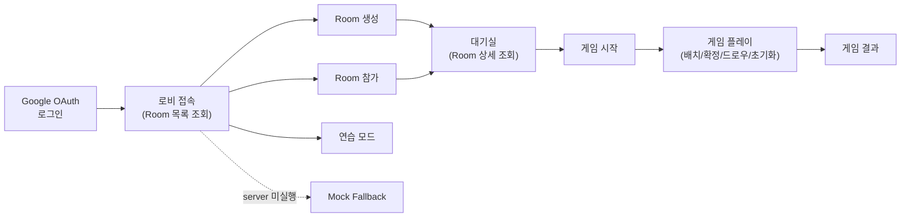
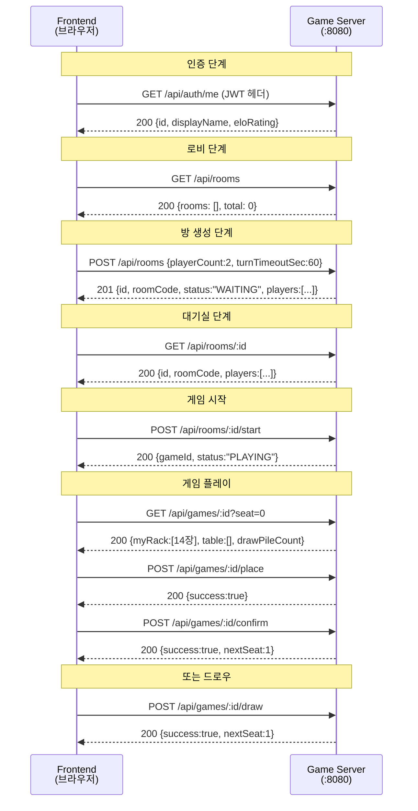
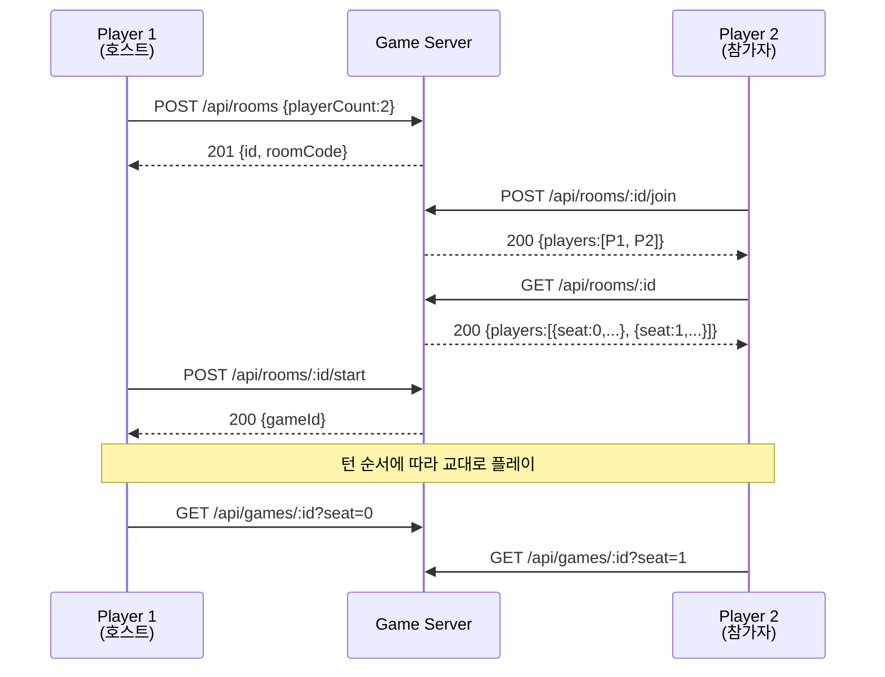
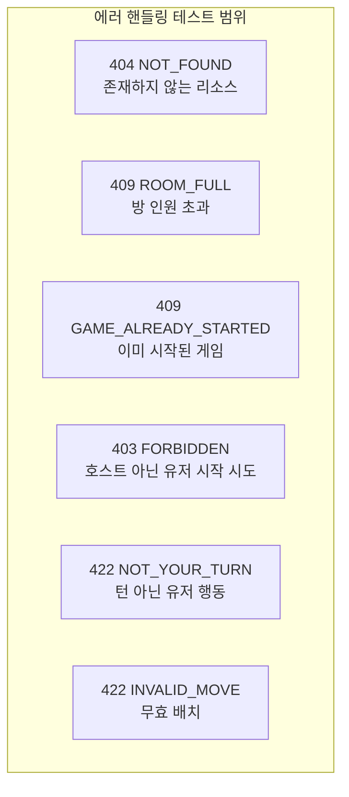
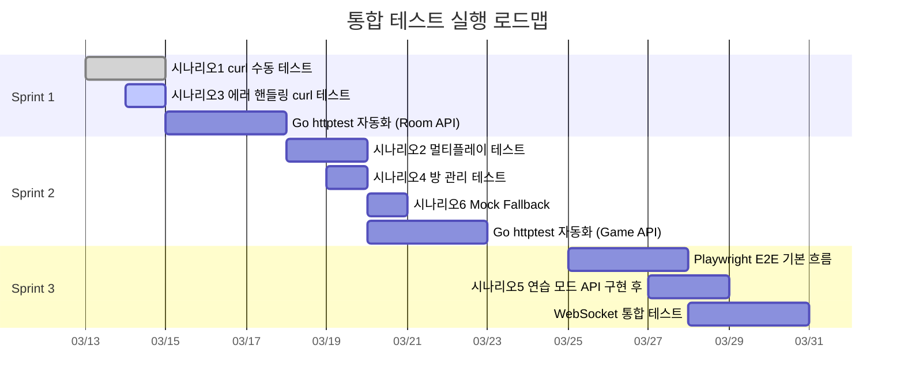

# Frontend - Game Server 통합 테스트 시나리오 (Integration Test Scenarios)

이 문서는 Frontend(Next.js)와 game-server(Go/gin) 간 REST API 통합 테스트 시나리오를 정의한다.
스모크 테스트(`02-smoke-test-report.md`)에서 검증한 서비스 기동 상태를 전제로,
실제 사용자 여정(User Journey)을 따라 API 호출 순서와 기대 결과를 상세히 기술한다.

---

## 1. 테스트 개요

### 1.1 목적

| 항목 | 내용 |
|------|------|
| 목적 | Frontend API 클라이언트(`src/frontend/src/lib/api.ts`)와 game-server REST API 12개 엔드포인트 간 통합 검증 |
| 검증 대상 | 요청/응답 포맷 일치, HTTP 상태 코드, 에러 응답 포맷(`03-api-design.md` SS0.1), mock fallback 동작 |
| 제외 범위 | WebSocket 실시간 통신 (별도 `05-websocket-test-scenarios.md`에서 다룰 예정), AI Adapter 호출 |

### 1.2 범위

사용자 여정 전체 흐름을 커버한다.



### 1.3 테스트 환경

| 항목 | 값 |
|------|------|
| Frontend | `http://localhost:3000` (Next.js 15) |
| Game Server | `http://localhost:8080` (Go/gin) |
| 저장소 | 인메모리 (Redis 미연결 시 자동 fallback) |
| 인증 | JWT 토큰 (game-server `middleware.JWTAuth` 검증) |
| API Base | `NEXT_PUBLIC_API_URL=http://localhost:8080/api` |

### 1.4 전제 조건

1. game-server가 `go run ./cmd/server`로 실행 중이며, `GET /health`가 `200 OK`를 반환한다.
2. JWT Secret이 game-server 설정(`config.yaml` 또는 환경변수 `JWT_SECRET`)과 테스트 토큰 생성에 동일하게 사용된다.
3. 인메모리 저장소를 사용하므로 서버 재시작 시 모든 데이터가 초기화된다.
4. Frontend `.env.local`에 `NEXT_PUBLIC_API_URL=http://localhost:8080/api`가 설정되어 있다.

### 1.5 테스트 케이스 ID 규칙

```
TC-I-{NNN}
  |   |  |
  |   |  +-- 일련번호 (3자리)
  |   +----- Integration
  +--------- Test Case
```

---

## 2. E2E 시나리오 (User Journey)

### 2.1 시나리오 1: 방 생성 후 AI와 게임 완료

하나의 Human 플레이어가 방을 생성하고, AI 플레이어와 함께 게임을 진행하여 완료하는 핵심 시나리오이다.



---

#### TC-I-001: Google OAuth 로그인 후 프로필 조회

| 항목 | 내용 |
|------|------|
| ID | TC-I-001 |
| 설명 | 인증된 사용자가 `/api/auth/me`로 자신의 프로필을 조회한다. |
| 사전조건 | 유효한 JWT 토큰 보유 |
| 실행단계 | 1. `GET /api/auth/me` 호출 (Authorization: Bearer {JWT}) |
| 기대결과 | HTTP 200, 응답 body에 `id`, `displayName`, `eloRating` 필드 존재 |

**요청 예시**:
```bash
curl -s -H "Authorization: Bearer ${JWT_TOKEN}" http://localhost:8080/api/auth/me
```

**기대 응답**:
```json
{
  "id": "user-uuid",
  "email": "user@example.com",
  "displayName": "애벌레",
  "avatarUrl": "https://...",
  "role": "ROLE_USER",
  "eloRating": 1200
}
```

> **참고**: 현재 MVP에서는 `/api/auth/me`가 JWT payload에서 직접 추출하는 방식이므로, game-server에 해당 엔드포인트가 구현되기 전까지 Frontend는 NextAuth.js 세션으로 대체한다.

---

#### TC-I-002: 로비 접속 -- Room 목록 조회

| 항목 | 내용 |
|------|------|
| ID | TC-I-002 |
| 설명 | 로비 화면에서 `GET /api/rooms`로 현재 활성 Room 목록을 조회한다. |
| 사전조건 | 유효한 JWT 토큰 보유 |
| 실행단계 | 1. `GET /api/rooms` 호출 |
| 기대결과 | HTTP 200, `{rooms: [...], total: N}` 포맷 |

**기대 응답 (빈 목록)**:
```json
{
  "rooms": [],
  "total": 0
}
```

**기대 응답 (방 존재 시)**:
```json
{
  "rooms": [
    {
      "id": "uuid",
      "roomCode": "ABCD",
      "status": "WAITING",
      "hostUserId": "uuid",
      "playerCount": 4,
      "settings": {
        "turnTimeoutSec": 60,
        "initialMeldThreshold": 30
      },
      "players": [
        { "seat": 0, "userId": "uuid", "type": "HUMAN", "status": "CONNECTED" }
      ],
      "createdAt": "2026-03-13T10:00:00Z"
    }
  ],
  "total": 1
}
```

---

#### TC-I-003: Room 생성

| 항목 | 내용 |
|------|------|
| ID | TC-I-003 |
| 설명 | 새 Room을 생성하고, 응답에서 `id`, `roomCode`를 확인한다. |
| 사전조건 | 유효한 JWT 토큰 보유 |
| 실행단계 | 1. `POST /api/rooms` 호출 (body: `{playerCount:4, turnTimeoutSec:60}`) |
| 기대결과 | HTTP 201, 응답에 `id`(UUID), `roomCode`(4자리 대문자), `status:"WAITING"`, `players[0].seat=0` |

**요청**:
```json
{
  "playerCount": 4,
  "turnTimeoutSec": 60
}
```

**기대 응답**:
```json
{
  "id": "uuid-string",
  "roomCode": "HPKV",
  "name": "uuid-str의 방",
  "status": "WAITING",
  "hostUserId": "user-uuid",
  "playerCount": 4,
  "settings": {
    "turnTimeoutSec": 60,
    "initialMeldThreshold": 30
  },
  "players": [
    { "seat": 0, "userId": "user-uuid", "type": "HUMAN", "status": "CONNECTED" },
    { "seat": 1, "type": "HUMAN", "status": "EMPTY" },
    { "seat": 2, "type": "HUMAN", "status": "EMPTY" },
    { "seat": 3, "type": "HUMAN", "status": "EMPTY" }
  ],
  "createdAt": "2026-03-13T10:00:00Z"
}
```

**검증 포인트**:
- `id`가 유효한 UUID 형식인가
- `roomCode`가 4자리 대문자 알파벳인가 (I, O 제외)
- `players[0].userId`가 JWT의 사용자 ID와 일치하는가
- 나머지 seat의 `status`가 `"EMPTY"`인가

---

#### TC-I-004: 대기실 진입 -- Room 상세 조회

| 항목 | 내용 |
|------|------|
| ID | TC-I-004 |
| 설명 | 생성된 Room의 상세 정보를 조회한다. |
| 사전조건 | TC-I-003에서 생성한 Room의 `id` 보유 |
| 실행단계 | 1. `GET /api/rooms/{roomId}` 호출 |
| 기대결과 | HTTP 200, TC-I-003 응답과 동일한 Room 정보 |

**검증 포인트**:
- `id`, `roomCode`, `status`, `players` 정보가 생성 시 응답과 일치
- `hostUserId`가 생성자 ID와 일치

---

#### TC-I-005: 게임 시작

| 항목 | 내용 |
|------|------|
| ID | TC-I-005 |
| 설명 | 호스트가 게임 시작을 요청하고, `gameId`를 반환받는다. |
| 사전조건 | Room에 최소 2명 참가 (호스트 포함), Room 상태가 `WAITING` |
| 실행단계 | 1. `POST /api/rooms/{roomId}/start` 호출 (호스트 JWT) |
| 기대결과 | HTTP 200, `{gameId: "uuid", status: "PLAYING", message: "게임이 시작되었습니다."}` |

**기대 응답**:
```json
{
  "gameId": "uuid-string",
  "status": "PLAYING",
  "message": "게임이 시작되었습니다."
}
```

**검증 포인트**:
- `gameId`가 유효한 UUID 형식
- 이후 `GET /api/rooms/{roomId}`의 `status`가 `"PLAYING"`으로 변경됨

---

#### TC-I-006: 게임 상태 조회 -- 초기 상태

| 항목 | 내용 |
|------|------|
| ID | TC-I-006 |
| 설명 | 게임 시작 직후 1인칭 뷰로 게임 상태를 조회한다. |
| 사전조건 | TC-I-005에서 반환된 `gameId` 보유 |
| 실행단계 | 1. `GET /api/games/{gameId}?seat=0` 호출 |
| 기대결과 | HTTP 200, `myRack`에 14장 타일, `table`이 빈 배열, `drawPileCount`가 타일풀 - (14 x 플레이어 수) |

**기대 응답 구조**:
```json
{
  "gameId": "uuid",
  "status": "PLAYING",
  "currentSeat": 0,
  "table": [],
  "myRack": ["R7a", "B3a", "K10b", "Y5a", "JK1", "..."],
  "players": [
    { "seat": 0, "playerType": "HUMAN", "tileCount": 14, "hasInitialMeld": false },
    { "seat": 1, "playerType": "HUMAN", "tileCount": 14, "hasInitialMeld": false }
  ],
  "drawPileCount": 78,
  "turnStartAt": 1742475600
}
```

**검증 포인트**:
- `myRack` 길이가 정확히 14
- `table`이 빈 배열 `[]`
- 모든 `players[].hasInitialMeld`이 `false`
- `drawPileCount` = 106 - (14 x 플레이어 수)
- `currentSeat`이 0 (첫 번째 플레이어부터 시작)
- 타일 코드가 인코딩 규칙(`{Color}{Number}{Set}`)을 준수

---

#### TC-I-007: 타일 배치 (Place)

| 항목 | 내용 |
|------|------|
| ID | TC-I-007 |
| 설명 | 자기 턴에 랙에서 타일을 테이블에 임시 배치한다. |
| 사전조건 | TC-I-006 완료, 현재 턴이 seat 0, 랙에 배치 가능한 타일 보유 |
| 실행단계 | 1. `POST /api/games/{gameId}/place` 호출 (아래 body) |
| 기대결과 | HTTP 200, `{success: true}`, 랙에서 해당 타일 제거됨 |

**요청**:
```json
{
  "seat": 0,
  "tableGroups": [
    {
      "id": "group-1",
      "tiles": ["R10a", "B10a", "K10b"]
    }
  ],
  "tilesFromRack": ["R10a", "B10a", "K10b"]
}
```

**기대 응답**:
```json
{
  "success": true,
  "nextSeat": 0,
  "gameState": {
    "gameId": "uuid",
    "status": "PLAYING",
    "currentSeat": 0
  }
}
```

**검증 포인트**:
- `success`가 `true`
- `nextSeat`이 여전히 현재 seat (place는 턴을 넘기지 않음)
- 이후 `GET /api/games/{gameId}?seat=0`에서 `myRack` 길이가 11 (14 - 3)

---

#### TC-I-008: 턴 확정 (Confirm)

| 항목 | 내용 |
|------|------|
| ID | TC-I-008 |
| 설명 | 임시 배치한 타일을 확정하여 Game Engine 검증을 수행한다. |
| 사전조건 | TC-I-007 완료, 테이블에 유효한 세트가 배치된 상태 |
| 실행단계 | 1. `POST /api/games/{gameId}/confirm` 호출 (최초 등록 조건 충족 세트) |
| 기대결과 | HTTP 200, `{success: true, nextSeat: 1}`, 다음 플레이어 턴으로 전환 |

**요청 (최초 등록 30점 이상 세트)**:
```json
{
  "seat": 0,
  "tableGroups": [
    {
      "id": "group-1",
      "tiles": ["R10a", "B10a", "K10b"]
    }
  ],
  "tilesFromRack": ["R10a", "B10a", "K10b"]
}
```

**기대 응답**:
```json
{
  "success": true,
  "nextSeat": 1,
  "gameEnded": false,
  "gameState": {
    "gameId": "uuid",
    "status": "PLAYING",
    "currentSeat": 1
  }
}
```

**검증 포인트**:
- `success`가 `true`
- `nextSeat`이 다음 플레이어 seat
- `gameEnded`가 `false`
- 이후 `GET /api/games/{gameId}?seat=0`에서 `players[0].hasInitialMeld`이 `true`

---

#### TC-I-009: 드로우 (Draw)

| 항목 | 내용 |
|------|------|
| ID | TC-I-009 |
| 설명 | 자기 턴에 드로우 파일에서 타일 1장을 뽑는다. |
| 사전조건 | 현재 턴이 요청 seat, 드로우 파일에 타일 존재 |
| 실행단계 | 1. `POST /api/games/{gameId}/draw` 호출 (body: `{seat: 0}`) |
| 기대결과 | HTTP 200, `{success: true, nextSeat: 1}`, 랙에 타일 1장 추가 |

**요청**:
```json
{
  "seat": 0
}
```

**기대 응답**:
```json
{
  "success": true,
  "nextSeat": 1,
  "gameState": {
    "gameId": "uuid",
    "status": "PLAYING",
    "currentSeat": 1
  }
}
```

**검증 포인트**:
- 드로우 전 랙 14장 -> 드로우 후 랙 15장
- `drawPileCount`가 1 감소
- `nextSeat`이 다음 플레이어

---

#### TC-I-010: 턴 초기화 (Reset)

| 항목 | 내용 |
|------|------|
| ID | TC-I-010 |
| 설명 | 현재 턴의 임시 배치를 취소하고 턴 시작 시점으로 롤백한다. |
| 사전조건 | place 수행 후, confirm 전 상태 |
| 실행단계 | 1. `POST /api/games/{gameId}/place` (임시 배치) -> 2. `POST /api/games/{gameId}/reset` (롤백) |
| 기대결과 | HTTP 200, `{success: true}`, 랙과 테이블이 턴 시작 시점으로 복원 |

**요청**:
```json
{
  "seat": 0
}
```

**기대 응답**:
```json
{
  "success": true,
  "nextSeat": 0,
  "gameState": {
    "gameId": "uuid",
    "status": "PLAYING",
    "currentSeat": 0
  }
}
```

**검증 포인트**:
- `nextSeat`이 여전히 현재 seat (턴 유지)
- `GET /api/games/{gameId}?seat=0`에서 `myRack` 길이가 place 전으로 복원
- `table`이 place 전 상태로 복원

---

#### TC-I-011: 게임 종료 -- 승리 조건

| 항목 | 내용 |
|------|------|
| ID | TC-I-011 |
| 설명 | 플레이어가 모든 타일을 유효한 세트로 내려놓아 승리한다. |
| 사전조건 | 랙에 3장 남아 있고, 해당 3장이 유효한 그룹/런을 구성 |
| 실행단계 | 1. `POST /api/games/{gameId}/confirm` 호출 (마지막 타일 배치) |
| 기대결과 | HTTP 200, `{success: true, gameEnded: true, winnerId: "user-uuid"}` |

**기대 응답**:
```json
{
  "success": true,
  "nextSeat": 0,
  "gameEnded": true,
  "winnerId": "user-uuid",
  "gameState": {
    "gameId": "uuid",
    "status": "FINISHED"
  }
}
```

**검증 포인트**:
- `gameEnded`가 `true`
- `winnerId`가 승리한 플레이어 ID
- `gameState.status`가 `"FINISHED"`
- 이후 `GET /api/games/{gameId}?seat=0`에서 `status`가 `"FINISHED"`

---

### 2.2 시나리오 2: 방 참가 -- 멀티플레이

다른 유저가 이미 생성한 방에 참가하여 멀티플레이어 게임을 진행하는 시나리오이다.



---

#### TC-I-020: 다른 유저 방 참가 (Join)

| 항목 | 내용 |
|------|------|
| ID | TC-I-020 |
| 설명 | 다른 유저가 생성한 WAITING 상태의 방에 참가한다. |
| 사전조건 | Player 1이 Room 생성 완료 (WAITING), Player 2가 유효한 JWT 보유 |
| 실행단계 | 1. Player 2가 `POST /api/rooms/{roomId}/join` 호출 |
| 기대결과 | HTTP 200, 응답의 `players`에 Player 2가 추가됨, `status: "CONNECTED"` |

**기대 응답**:
```json
{
  "id": "room-uuid",
  "roomCode": "HPKV",
  "status": "WAITING",
  "players": [
    { "seat": 0, "userId": "player1-uuid", "type": "HUMAN", "status": "CONNECTED" },
    { "seat": 1, "userId": "player2-uuid", "type": "HUMAN", "status": "CONNECTED" }
  ]
}
```

---

#### TC-I-021: 대기실 플레이어 목록 확인

| 항목 | 내용 |
|------|------|
| ID | TC-I-021 |
| 설명 | 대기실에서 현재 참가한 플레이어 목록을 확인한다. |
| 사전조건 | TC-I-020 완료 |
| 실행단계 | 1. `GET /api/rooms/{roomId}` 호출 |
| 기대결과 | HTTP 200, `players` 배열에 2명의 CONNECTED 플레이어 표시 |

---

#### TC-I-022: 호스트가 게임 시작

| 항목 | 내용 |
|------|------|
| ID | TC-I-022 |
| 설명 | 호스트(Player 1)가 2명 충족 상태에서 게임을 시작한다. |
| 사전조건 | Room에 2명 이상 참가, Room 상태 `WAITING` |
| 실행단계 | 1. Player 1이 `POST /api/rooms/{roomId}/start` 호출 |
| 기대결과 | HTTP 200, `gameId` 반환, 양쪽 플레이어 모두 게임 상태 조회 가능 |

---

#### TC-I-023: 턴 순서에 따른 교대 진행

| 항목 | 내용 |
|------|------|
| ID | TC-I-023 |
| 설명 | seat 0 -> seat 1 -> seat 0 순서로 턴이 교대로 진행된다. |
| 사전조건 | TC-I-022 완료, 게임 진행 중 |
| 실행단계 | 1. seat 0이 draw -> nextSeat=1 확인 -> 2. seat 1이 draw -> nextSeat=0 확인 |
| 기대결과 | 각 draw 후 `nextSeat`이 상대방 seat으로 전환 |

---

### 2.3 시나리오 3: 에러 핸들링

정상 흐름이 아닌 예외 상황에서 서버가 올바른 HTTP 상태 코드와 에러 응답을 반환하는지 검증한다.



---

#### TC-I-030: 존재하지 않는 방 참가 (404)

| 항목 | 내용 |
|------|------|
| ID | TC-I-030 |
| 설명 | 존재하지 않는 Room ID로 참가를 시도한다. |
| 사전조건 | 존재하지 않는 Room ID |
| 실행단계 | 1. `POST /api/rooms/non-existent-id/join` 호출 |
| 기대결과 | HTTP 404, `{error: {code: "NOT_FOUND", message: "방을 찾을 수 없습니다."}}` |

**기대 응답**:
```json
{
  "error": {
    "code": "NOT_FOUND",
    "message": "방을 찾을 수 없습니다."
  }
}
```

---

#### TC-I-031: 가득 찬 방 참가 (409)

| 항목 | 내용 |
|------|------|
| ID | TC-I-031 |
| 설명 | 모든 seat이 채워진 방에 추가 참가를 시도한다. |
| 사전조건 | 2인 방에 2명 참가 완료 (빈 seat 없음) |
| 실행단계 | 1. 3번째 유저가 `POST /api/rooms/{roomId}/join` 호출 |
| 기대결과 | HTTP 409, `{error: {code: "ROOM_FULL", message: "방이 꽉 찼습니다."}}` |

**기대 응답**:
```json
{
  "error": {
    "code": "ROOM_FULL",
    "message": "방이 꽉 찼습니다."
  }
}
```

---

#### TC-I-032: 호스트가 아닌 유저의 게임 시작 시도 (403)

| 항목 | 내용 |
|------|------|
| ID | TC-I-032 |
| 설명 | 호스트가 아닌 참가자가 게임 시작을 시도한다. |
| 사전조건 | Room에 Player 1(호스트)과 Player 2(참가자)가 있는 상태 |
| 실행단계 | 1. Player 2의 JWT로 `POST /api/rooms/{roomId}/start` 호출 |
| 기대결과 | HTTP 403, `{error: {code: "FORBIDDEN", message: "방장만 게임을 시작할 수 있습니다."}}` |

**기대 응답**:
```json
{
  "error": {
    "code": "FORBIDDEN",
    "message": "방장만 게임을 시작할 수 있습니다."
  }
}
```

---

#### TC-I-033: 자기 턴이 아닐 때 배치 시도 (422)

| 항목 | 내용 |
|------|------|
| ID | TC-I-033 |
| 설명 | 현재 턴이 아닌 플레이어가 타일 배치를 시도한다. |
| 사전조건 | 게임 진행 중, 현재 턴은 seat 0 |
| 실행단계 | 1. seat 1이 `POST /api/games/{gameId}/place` 호출 (seat: 1) |
| 기대결과 | HTTP 422, `{error: {code: "NOT_YOUR_TURN", message: "자신의 턴이 아닙니다."}}` |

**기대 응답**:
```json
{
  "error": {
    "code": "NOT_YOUR_TURN",
    "message": "자신의 턴이 아닙니다."
  }
}
```

---

#### TC-I-034: 무효 배치 후 확정 시도 (422)

| 항목 | 내용 |
|------|------|
| ID | TC-I-034 |
| 설명 | 유효하지 않은 세트(2장만 배치)로 턴 확정을 시도한다. |
| 사전조건 | 현재 턴 seat 0, 랙에 타일 보유 |
| 실행단계 | 1. `POST /api/games/{gameId}/confirm` 호출 (무효 세트: 2장 그룹) |
| 기대결과 | HTTP 422, `{error: {code: "INVALID_SET", message: ...}}` |

**요청 (무효: 2장 그룹)**:
```json
{
  "seat": 0,
  "tableGroups": [
    {
      "id": "group-invalid",
      "tiles": ["R7a", "B7a"]
    }
  ],
  "tilesFromRack": ["R7a", "B7a"]
}
```

**기대 응답**:
```json
{
  "error": {
    "code": "INVALID_SET",
    "message": "세트는 최소 3장 이상이어야 합니다."
  }
}
```

---

#### TC-I-035: 빈 드로우 파일에서 드로우

| 항목 | 내용 |
|------|------|
| ID | TC-I-035 |
| 설명 | 드로우 파일이 모두 소진된 상태에서 드로우를 시도한다. |
| 사전조건 | `drawPileCount`가 0인 게임 상태 |
| 실행단계 | 1. `POST /api/games/{gameId}/draw` 호출 (seat: 현재 턴) |
| 기대결과 | HTTP 200, `{success: false, gameEnded: true, errorCode: "DRAW_PILE_EMPTY"}` |

**기대 응답**:
```json
{
  "success": false,
  "nextSeat": 0,
  "gameEnded": true,
  "errorCode": "DRAW_PILE_EMPTY",
  "gameState": {
    "status": "FINISHED"
  }
}
```

> **참고**: 현재 구현에서는 드로우 파일 소진 시 즉시 게임을 종료하지만, 게임 규칙(SS7.2)에 따르면 교착 상태 판정까지 1라운드 대기해야 한다. 이 차이는 향후 개선 대상이다.

---

### 2.4 시나리오 4: 방 관리

Room의 생명주기(생성 -> 관리 -> 삭제/취소)를 검증한다.

---

#### TC-I-040: 방 삭제

| 항목 | 내용 |
|------|------|
| ID | TC-I-040 |
| 설명 | 호스트가 WAITING 상태의 방을 삭제한다. |
| 사전조건 | 호스트가 생성한 WAITING 상태 방 |
| 실행단계 | 1. `DELETE /api/rooms/{roomId}` 호출 (호스트 JWT) |
| 기대결과 | HTTP 200, `{message: "방이 삭제되었습니다."}` |

**기대 응답**:
```json
{
  "message": "방이 삭제되었습니다."
}
```

**후행 검증**:
- `GET /api/rooms/{roomId}` -> 404 NOT_FOUND

---

#### TC-I-041: 호스트 퇴장 -- 방 자동 CANCELLED

| 항목 | 내용 |
|------|------|
| ID | TC-I-041 |
| 설명 | 호스트가 방에서 퇴장하면 방 상태가 자동으로 CANCELLED로 변경된다. |
| 사전조건 | 호스트와 참가자가 있는 WAITING 상태 방 |
| 실행단계 | 1. 호스트가 `POST /api/rooms/{roomId}/leave` 호출 |
| 기대결과 | HTTP 200, 응답의 `status`가 `"CANCELLED"` |

**기대 응답**:
```json
{
  "id": "room-uuid",
  "status": "CANCELLED",
  "players": [...]
}
```

---

#### TC-I-042: 일반 유저 퇴장 -- 슬롯 해제

| 항목 | 내용 |
|------|------|
| ID | TC-I-042 |
| 설명 | 호스트가 아닌 참가자가 퇴장하면 해당 seat이 EMPTY로 초기화된다. |
| 사전조건 | 호스트(seat 0) + 참가자(seat 1)가 있는 WAITING 상태 방 |
| 실행단계 | 1. 참가자가 `POST /api/rooms/{roomId}/leave` 호출 |
| 기대결과 | HTTP 200, `players[1].status`가 `"EMPTY"`, `players[1].userId`가 빈 문자열 |

**후행 검증**:
- Room 상태가 여전히 `"WAITING"` (호스트가 남아있으므로 취소되지 않음)
- 다른 플레이어가 빈 seat에 참가 가능

---

### 2.5 시나리오 5: 연습 모드

> **주의**: 연습 모드 API(`/api/practice/*`)는 현재 game-server에 아직 구현되지 않았다. 이 시나리오는 구현 완료 후 실행 대상이며, 현재는 설계 문서 기반의 기대 동작을 정의한다.

---

#### TC-I-050: Stage 목록 조회

| 항목 | 내용 |
|------|------|
| ID | TC-I-050 |
| 설명 | 연습 모드 Stage 목록을 조회한다. |
| 사전조건 | 유효한 JWT 토큰 |
| 실행단계 | 1. `GET /api/practice/stages` 호출 |
| 기대결과 | HTTP 200, 6개 Stage 정보 포함 |

**기대 응답** (`03-api-design.md` SS1.6 참조):
```json
{
  "stages": [
    { "stage": 1, "name": "최초 등록", "description": "30점 이상 조합으로 첫 배치 연습", "unlocked": true, "bestScore": null },
    { "stage": 2, "name": "런 만들기", "unlocked": true, "bestScore": null },
    { "stage": 3, "name": "그룹 만들기", "unlocked": false, "bestScore": null },
    { "stage": 4, "name": "테이블 재배치", "unlocked": false, "bestScore": null },
    { "stage": 5, "name": "조커 활용", "unlocked": false, "bestScore": null },
    { "stage": 6, "name": "종합 실전", "unlocked": false, "bestScore": null }
  ]
}
```

---

#### TC-I-051: Stage 1 시작 -- 최초 등록 연습

| 항목 | 내용 |
|------|------|
| ID | TC-I-051 |
| 설명 | Stage 1을 시작하고 최초 등록 연습용 초기 상태를 받는다. |
| 사전조건 | Stage 1이 `unlocked: true` |
| 실행단계 | 1. `POST /api/practice/start` 호출 (body: `{stage: 1}`) |
| 기대결과 | HTTP 200, `initialState.myTiles`에 30점 이상 세트를 구성 가능한 14장 타일 |

---

#### TC-I-052: 힌트 동작

| 항목 | 내용 |
|------|------|
| ID | TC-I-052 |
| 설명 | 연습 모드에서 힌트를 요청하면 유효한 세트 조합이 하이라이트된다. |
| 사전조건 | TC-I-051 완료, 연습 세션 진행 중 |
| 실행단계 | 1. Frontend에서 힌트 버튼 클릭 -> 로컬 로직 또는 API 호출 |
| 기대결과 | 유효한 세트를 구성할 수 있는 타일이 하이라이트 |

> **참고**: 힌트 기능이 서버 측 API인지 클라이언트 측 로직인지는 구현 시 결정. 테스트 방식이 달라진다.

---

#### TC-I-053: Stage 클리어 -- 결과 표시

| 항목 | 내용 |
|------|------|
| ID | TC-I-053 |
| 설명 | Stage 클리어 조건을 달성하면 결과가 반환된다. |
| 사전조건 | TC-I-051 진행 중 |
| 실행단계 | 1. 30점 이상 세트를 배치하여 Stage 1 클리어 |
| 기대결과 | 클리어 결과, 다음 Stage 잠금 해제 |

---

### 2.6 시나리오 6: Mock Fallback

Frontend가 game-server에 연결할 수 없을 때 mock 데이터로 동작하는지 검증한다.
이 시나리오는 `src/frontend/src/lib/api.ts`의 try-catch fallback 로직을 테스트한다.

---

#### TC-I-060: game-server 미실행 시 Frontend mock 동작

| 항목 | 내용 |
|------|------|
| ID | TC-I-060 |
| 설명 | game-server가 실행되지 않은 상태에서 Frontend 로비에 접속한다. |
| 사전조건 | game-server 중지, Frontend만 실행 (`localhost:3000`) |
| 실행단계 | 1. 브라우저에서 `/lobby` 접속 -> 2. 콘솔에서 fallback 로그 확인 |
| 기대결과 | 콘솔에 `[api] getRooms fallback to mock:` 메시지, 화면에 mock Room 3개 표시 |

**검증 포인트**:
- MOCK_ROOMS(`mock-data.ts`)의 3개 방이 목록에 표시
  - room-001: `ABCD`, WAITING, 2인
  - room-002: `EFGH`, PLAYING, 4인
  - room-003: `WXYZ`, WAITING, 1인
- 에러 토스트가 표시되지 않음 (graceful fallback)

---

#### TC-I-061: API 호출 실패 시 mock fallback 확인

| 항목 | 내용 |
|------|------|
| ID | TC-I-061 |
| 설명 | Room 생성 API 실패 시 `createMockRoom()`이 호출되어 mock Room이 반환된다. |
| 사전조건 | game-server 중지 |
| 실행단계 | 1. 방 생성 폼에서 생성 버튼 클릭 |
| 기대결과 | mock Room이 생성되어 대기실로 이동, 콘솔에 `[api] createRoom fallback to mock:` 메시지 |

**검증 포인트**:
- 생성된 mock Room의 `roomCode`가 4자리 랜덤 대문자
- `players[0]`의 `displayName`이 `"나"`
- `status`가 `"WAITING"`

---

#### TC-I-062: mock 데이터로 전체 흐름 진행

| 항목 | 내용 |
|------|------|
| ID | TC-I-062 |
| 설명 | mock 데이터만으로 로비 -> 대기실 -> 게임 화면까지 UI 흐름이 동작한다. |
| 사전조건 | game-server 중지 |
| 실행단계 | 1. 로비 접속 (mock rooms 표시) -> 2. Room 카드 클릭 (mock room 상세) -> 3. 게임 시작 -> 게임 화면 표시 |
| 기대결과 | 각 화면이 mock 데이터로 정상 렌더링, 에러 없음 |

**검증 포인트**:
- `MOCK_GAME_STATE`의 초기 타일 14장이 랙에 표시
- `MOCK_TABLE_GROUPS`의 3개 세트가 테이블에 표시
- `MOCK_PLAYERS`의 4명 플레이어 카드가 표시

---

## 3. API 엔드포인트별 테스트 매트릭스

game-server의 12개 REST API 엔드포인트에 대해 HTTP 상태 코드별 테스트 커버리지를 정의한다.

### 3.1 Room API (7개 엔드포인트)

| # | 엔드포인트 | 200/201 정상 | 400 잘못된 입력 | 401 인증 실패 | 403 권한 없음 | 404 리소스 없음 | 409 충돌 |
|---|-----------|:---:|:---:|:---:|:---:|:---:|:---:|
| 1 | `POST /api/rooms` | TC-I-003 | playerCount 범위 초과 | JWT 없음 | - | - | - |
| 2 | `GET /api/rooms` | TC-I-002 | - | JWT 없음 | - | - | - |
| 3 | `GET /api/rooms/:id` | TC-I-004 | 빈 ID | JWT 없음 | - | 없는 ID | - |
| 4 | `POST /api/rooms/:id/join` | TC-I-020 | 빈 ID | JWT 없음 | - | TC-I-030 | TC-I-031 (FULL), 이미 참가, 이미 시작 |
| 5 | `POST /api/rooms/:id/leave` | TC-I-042 | 빈 ID | JWT 없음 | - | 없는 방, 방에 없는 유저 | 종료된 방 |
| 6 | `POST /api/rooms/:id/start` | TC-I-005 | 빈 ID | JWT 없음 | TC-I-032 | 없는 ID | 이미 시작, 인원 부족 |
| 7 | `DELETE /api/rooms/:id` | TC-I-040 | 빈 ID | JWT 없음 | 호스트 아님 | 없는 ID | - |

### 3.2 Game API (5개 엔드포인트)

| # | 엔드포인트 | 200 정상 | 400 잘못된 입력 | 401 인증 실패 | 404 리소스 없음 | 422 유효성 실패 |
|---|-----------|:---:|:---:|:---:|:---:|:---:|
| 8 | `GET /api/games/:id` | TC-I-006 | 잘못된 seat 값 | JWT 없음 | 없는 gameId | - |
| 9 | `POST /api/games/:id/place` | TC-I-007 | 빈 tableGroups | JWT 없음 | 없는 gameId | TC-I-033 (NOT_YOUR_TURN) |
| 10 | `POST /api/games/:id/confirm` | TC-I-008 | 빈 tableGroups | JWT 없음 | 없는 gameId | TC-I-034 (INVALID_SET), NOT_YOUR_TURN |
| 11 | `POST /api/games/:id/draw` | TC-I-009 | - | JWT 없음 | 없는 gameId | NOT_YOUR_TURN, DRAW_PILE_EMPTY |
| 12 | `POST /api/games/:id/reset` | TC-I-010 | - | JWT 없음 | 없는 gameId | NOT_YOUR_TURN |

### 3.3 에러 응답 일관성 검증

모든 에러 응답이 `03-api-design.md` SS0.1의 공통 에러 응답 포맷을 준수하는지 검증한다.

```json
{
  "error": {
    "code": "에러_코드",
    "message": "사용자 표시용 한글 메시지"
  }
}
```

| 검증 항목 | 기대값 |
|-----------|--------|
| `error.code` 존재 여부 | 항상 존재 (string) |
| `error.message` 존재 여부 | 항상 존재 (string, 한글) |
| 401 응답 `error.code` | `"UNAUTHORIZED"` |
| 403 응답 `error.code` | `"FORBIDDEN"` |
| 404 응답 `error.code` | `"NOT_FOUND"` |
| 409 응답 `error.code` | `"ROOM_FULL"` / `"GAME_ALREADY_STARTED"` / `"ALREADY_JOINED"` |
| 422 응답 `error.code` | `"NOT_YOUR_TURN"` / `"INVALID_SET"` / `"INVALID_MOVE"` |

---

## 4. 테스트 데이터

### 4.1 테스트 Room 설정

| 설정 | 값 | 용도 |
|------|------|------|
| 2인 방 (기본) | `{playerCount: 2, turnTimeoutSec: 60}` | 대부분의 테스트 |
| 4인 방 | `{playerCount: 4, turnTimeoutSec: 90}` | 멀티플레이 테스트 |
| 빠른 턴 방 | `{playerCount: 2, turnTimeoutSec: 30}` | 타임아웃 테스트 |

### 4.2 테스트 타일 배치 시나리오

#### 유효한 배치

| 시나리오 | 세트 | 타일 코드 | 합계 | 최초 등록 |
|----------|------|-----------|------|-----------|
| 유효 그룹 (3장) | group | `R7a`, `B7a`, `K7b` | 21점 | 부족 |
| 유효 그룹 (4장) | group | `R10a`, `B10a`, `Y10a`, `K10b` | 40점 | 통과 |
| 유효 런 (3장) | run | `Y3a`, `Y4a`, `Y5a` | 12점 | 부족 |
| 유효 런 (5장) | run | `B9a`, `B10b`, `B11a`, `B12a`, `B13b` | 55점 | 통과 |
| 최초 등록 복수 세트 | group + run | `[R10a, B10a, K10b]` + `[Y1a, Y2a, Y3a]` | 36점 | 통과 |
| 조커 포함 그룹 | group | `R5a`, `JK1`, `K5b` | 15점 | 부족 |
| 조커 포함 런 | run | `R11a`, `JK2`, `R13a` | 36점 | 통과 |

#### 무효한 배치

| 시나리오 | 세트 | 타일 코드 | 무효 사유 | Engine 규칙 |
|----------|------|-----------|-----------|-------------|
| 2장 세트 | group | `R7a`, `B7a` | 최소 3장 미달 | V-02 |
| 같은 색 중복 그룹 | group | `R7a`, `R7b`, `B7a` | 색상 중복 | V-14 |
| 비연속 런 | run | `Y3a`, `Y5a`, `Y6a` | 4 건너뜀 | V-15 |
| 13-1 순환 런 | run | `R12a`, `R13a`, `R1a` | 순환 불가 | V-15 |
| 색상 불일치 런 | run | `R3a`, `B4a`, `Y5a` | 색상 혼합 | V-01 |
| 최초 등록 미달 | group | `R3a`, `B3a`, `K3b` | 9점 < 30점 | V-04 |
| 테이블 재배치 (미등록자) | - | 테이블 타일 이동 | hasInitialMeld=false | V-13 |
| 랙 추가 없이 확정 | - | 테이블 타일만 재배치 | 랙 타일 미사용 | V-03 |

### 4.3 AI 플레이어 설정 예시

| 설정 | 값 | 용도 |
|------|------|------|
| 초보 AI | `{type: "AI_LLAMA", persona: "rookie", difficulty: "beginner", psychologyLevel: 0}` | 쉬운 상대 |
| 중급 AI | `{type: "AI_DEEPSEEK", persona: "calculator", difficulty: "intermediate", psychologyLevel: 1}` | 중간 상대 |
| 고급 AI | `{type: "AI_CLAUDE", persona: "shark", difficulty: "expert", psychologyLevel: 3}` | 어려운 상대 |
| 혼합 AI | `{type: "AI_OPENAI", persona: "fox", difficulty: "expert", psychologyLevel: 2}` | 전략적 상대 |

> **참고**: AI 플레이어 추가(`POST /api/rooms/:id/add-ai`) 엔드포인트는 API 설계서에 정의되어 있지만, 현재 game-server 라우터에는 등록되어 있지 않다. 통합 테스트는 구현 완료 후 추가한다.

---

## 5. 자동화 가이드

### 5.1 JWT 테스트 토큰 생성

테스트 실행 전 유효한 JWT 토큰을 생성해야 한다.

```bash
# Go 테스트 헬퍼 또는 jwt.io에서 생성
# Payload: {"sub": "test-user-001", "name": "애벌레", "iat": <now>, "exp": <now+3600>}
# Secret: game-server의 JWT_SECRET 값과 동일해야 함

export JWT_TOKEN="eyJhbGciOiJIUzI1NiIsInR5cCI6IkpXVCJ9..."
export JWT_TOKEN_P2="eyJhbGciOiJIUzI1NiIsInR5cCI6IkpXVCJ9..."  # Player 2용

export BASE_URL="http://localhost:8080/api"
```

### 5.2 curl 기반 수동 테스트 스크립트

아래는 시나리오 1(방 생성 -> 게임 완료) 전체를 curl로 수행하는 스크립트이다.

```bash
#!/bin/bash
# ==============================================================
# integration-test-scenario1.sh
# RummiArena Frontend <-> Game Server 통합 테스트 (시나리오 1)
# ==============================================================

set -e

BASE_URL="http://localhost:8080/api"
JWT_TOKEN="${JWT_TOKEN:-your-jwt-token-here}"
JWT_TOKEN_P2="${JWT_TOKEN_P2:-your-jwt-token-p2-here}"
AUTH_HEADER="Authorization: Bearer ${JWT_TOKEN}"
AUTH_HEADER_P2="Authorization: Bearer ${JWT_TOKEN_P2}"

echo "=== TC-I-002: Room 목록 조회 ==="
ROOMS=$(curl -s -w "\n%{http_code}" \
  -H "${AUTH_HEADER}" \
  "${BASE_URL}/rooms")
HTTP_CODE=$(echo "$ROOMS" | tail -1)
BODY=$(echo "$ROOMS" | head -n -1)
echo "HTTP: ${HTTP_CODE}"
echo "Body: ${BODY}"
[ "${HTTP_CODE}" = "200" ] && echo "PASS" || echo "FAIL"

echo ""
echo "=== TC-I-003: Room 생성 ==="
CREATE_RESP=$(curl -s -w "\n%{http_code}" \
  -X POST \
  -H "Content-Type: application/json" \
  -H "${AUTH_HEADER}" \
  -d '{"playerCount":2,"turnTimeoutSec":60}' \
  "${BASE_URL}/rooms")
HTTP_CODE=$(echo "$CREATE_RESP" | tail -1)
BODY=$(echo "$CREATE_RESP" | head -n -1)
echo "HTTP: ${HTTP_CODE}"
echo "Body: ${BODY}"
[ "${HTTP_CODE}" = "201" ] && echo "PASS" || echo "FAIL"

# roomId 추출 (jq 필요)
ROOM_ID=$(echo "$BODY" | jq -r '.id')
ROOM_CODE=$(echo "$BODY" | jq -r '.roomCode')
echo "Room ID: ${ROOM_ID}"
echo "Room Code: ${ROOM_CODE}"

echo ""
echo "=== TC-I-004: Room 상세 조회 ==="
GET_ROOM=$(curl -s -w "\n%{http_code}" \
  -H "${AUTH_HEADER}" \
  "${BASE_URL}/rooms/${ROOM_ID}")
HTTP_CODE=$(echo "$GET_ROOM" | tail -1)
BODY=$(echo "$GET_ROOM" | head -n -1)
echo "HTTP: ${HTTP_CODE}"
[ "${HTTP_CODE}" = "200" ] && echo "PASS" || echo "FAIL"

echo ""
echo "=== TC-I-020: Player 2 참가 ==="
JOIN_RESP=$(curl -s -w "\n%{http_code}" \
  -X POST \
  -H "Content-Type: application/json" \
  -H "${AUTH_HEADER_P2}" \
  "${BASE_URL}/rooms/${ROOM_ID}/join")
HTTP_CODE=$(echo "$JOIN_RESP" | tail -1)
BODY=$(echo "$JOIN_RESP" | head -n -1)
echo "HTTP: ${HTTP_CODE}"
echo "Players: $(echo "$BODY" | jq '.players')"
[ "${HTTP_CODE}" = "200" ] && echo "PASS" || echo "FAIL"

echo ""
echo "=== TC-I-005: 게임 시작 ==="
START_RESP=$(curl -s -w "\n%{http_code}" \
  -X POST \
  -H "Content-Type: application/json" \
  -H "${AUTH_HEADER}" \
  "${BASE_URL}/rooms/${ROOM_ID}/start")
HTTP_CODE=$(echo "$START_RESP" | tail -1)
BODY=$(echo "$START_RESP" | head -n -1)
echo "HTTP: ${HTTP_CODE}"
echo "Body: ${BODY}"
[ "${HTTP_CODE}" = "200" ] && echo "PASS" || echo "FAIL"

GAME_ID=$(echo "$BODY" | jq -r '.gameId')
echo "Game ID: ${GAME_ID}"

echo ""
echo "=== TC-I-006: 게임 상태 조회 (seat 0) ==="
GAME_STATE=$(curl -s -w "\n%{http_code}" \
  -H "${AUTH_HEADER}" \
  "${BASE_URL}/games/${GAME_ID}?seat=0")
HTTP_CODE=$(echo "$GAME_STATE" | tail -1)
BODY=$(echo "$GAME_STATE" | head -n -1)
echo "HTTP: ${HTTP_CODE}"
RACK_COUNT=$(echo "$BODY" | jq '.myRack | length')
DRAW_COUNT=$(echo "$BODY" | jq '.drawPileCount')
echo "Rack tiles: ${RACK_COUNT}, Draw pile: ${DRAW_COUNT}"
[ "${RACK_COUNT}" = "14" ] && echo "Rack count PASS" || echo "Rack count FAIL"
[ "${HTTP_CODE}" = "200" ] && echo "PASS" || echo "FAIL"

echo ""
echo "=== TC-I-009: 드로우 ==="
DRAW_RESP=$(curl -s -w "\n%{http_code}" \
  -X POST \
  -H "Content-Type: application/json" \
  -H "${AUTH_HEADER}" \
  -d '{"seat":0}' \
  "${BASE_URL}/games/${GAME_ID}/draw")
HTTP_CODE=$(echo "$DRAW_RESP" | tail -1)
BODY=$(echo "$DRAW_RESP" | head -n -1)
echo "HTTP: ${HTTP_CODE}"
echo "NextSeat: $(echo "$BODY" | jq '.nextSeat')"
[ "${HTTP_CODE}" = "200" ] && echo "PASS" || echo "FAIL"

echo ""
echo "=== TC-I-030: 존재하지 않는 방 참가 (404 기대) ==="
ERR_RESP=$(curl -s -w "\n%{http_code}" \
  -X POST \
  -H "Content-Type: application/json" \
  -H "${AUTH_HEADER}" \
  "${BASE_URL}/rooms/non-existent-id/join")
HTTP_CODE=$(echo "$ERR_RESP" | tail -1)
BODY=$(echo "$ERR_RESP" | head -n -1)
echo "HTTP: ${HTTP_CODE}"
echo "Error: $(echo "$BODY" | jq '.error')"
[ "${HTTP_CODE}" = "404" ] && echo "PASS" || echo "FAIL"

echo ""
echo "=== TC-I-033: 턴 아닌 유저 배치 시도 (422 기대) ==="
ERR_RESP2=$(curl -s -w "\n%{http_code}" \
  -X POST \
  -H "Content-Type: application/json" \
  -H "${AUTH_HEADER_P2}" \
  -d '{"seat":1,"tableGroups":[{"id":"g1","tiles":["R7a","B7a","K7b"]}],"tilesFromRack":["R7a"]}' \
  "${BASE_URL}/games/${GAME_ID}/place")
HTTP_CODE=$(echo "$ERR_RESP2" | tail -1)
echo "HTTP: ${HTTP_CODE}"
# 현재 seat 1의 턴이 아니므로 (seat 0이 드로우 후 seat 1이 현재 턴)
# 실제 결과는 게임 상태에 따라 다를 수 있음
echo "Error handling check: ${HTTP_CODE}"

echo ""
echo "=== 테스트 완료 ==="
```

### 5.3 Go httptest 기반 자동화 테스트 (향후)

```go
// src/game-server/internal/handler/integration_test.go (예시 구조)
//
// 실제 gin 라우터를 초기화하고 httptest.Server로 전체 API를 테스트한다.
// 인메모리 저장소를 사용하여 외부 의존성 없이 실행 가능하다.
//
// func TestScenario1_CreateRoomAndStartGame(t *testing.T) {
//     router := setupTestRouter()  // 인메모리 repo + 실제 핸들러
//     ts := httptest.NewServer(router)
//     defer ts.Close()
//
//     // 1. Room 생성
//     resp := postJSON(t, ts, "/api/rooms", createRoomBody, jwtToken1)
//     assert.Equal(t, 201, resp.StatusCode)
//
//     // 2. Player 2 참가
//     resp = postJSON(t, ts, "/api/rooms/"+roomID+"/join", nil, jwtToken2)
//     assert.Equal(t, 200, resp.StatusCode)
//
//     // 3. 게임 시작
//     resp = postJSON(t, ts, "/api/rooms/"+roomID+"/start", nil, jwtToken1)
//     assert.Equal(t, 200, resp.StatusCode)
//
//     // 4. 게임 상태 조회
//     resp = getJSON(t, ts, "/api/games/"+gameID+"?seat=0", jwtToken1)
//     assert.Equal(t, 200, resp.StatusCode)
//     assert.Len(t, gameState.MyRack, 14)
// }
```

### 5.4 Playwright E2E 자동화 계획

Sprint 3에서 Playwright 기반 브라우저 E2E 테스트를 구현할 예정이다.

| 단계 | 목표 | 도구 |
|------|------|------|
| Sprint 1 | curl + Go httptest 통합 테스트 | bash, Go testify/httptest |
| Sprint 2 | Frontend jest + MSW mock 테스트 | jest, MSW (Mock Service Worker) |
| Sprint 3 | Playwright 브라우저 E2E | Playwright |
| Sprint 4 | k6 부하 테스트 | k6 |

#### Playwright 테스트 시나리오 (예정)

```typescript
// tests/e2e/game-flow.spec.ts (예시 구조)
//
// test('시나리오 1: 방 생성 -> 게임 완료', async ({ page }) => {
//   // 1. 로그인 (Mock OAuth)
//   await page.goto('/login');
//   await page.click('[data-testid="google-login"]');
//
//   // 2. 로비에서 방 생성
//   await page.goto('/lobby');
//   await page.click('[data-testid="create-room"]');
//   await page.selectOption('[data-testid="player-count"]', '2');
//   await page.click('[data-testid="submit-create-room"]');
//
//   // 3. 대기실 확인
//   await expect(page.locator('[data-testid="room-code"]')).toBeVisible();
//   await expect(page.locator('[data-testid="player-list"]')).toContainText('애벌레');
//
//   // 4. 게임 시작
//   await page.click('[data-testid="start-game"]');
//   await expect(page.locator('[data-testid="my-rack"]')).toBeVisible();
// });
```

---

## 6. 테스트 우선순위 및 실행 계획

### 6.1 우선순위 분류

| 우선순위 | 시나리오 | TC 범위 | 사유 |
|----------|----------|---------|------|
| P0 (필수) | 시나리오 1: 방 생성 -> 게임 완료 | TC-I-001~011 | 핵심 게임 흐름 |
| P0 (필수) | 시나리오 3: 에러 핸들링 | TC-I-030~035 | 안정성 필수 |
| P1 (높음) | 시나리오 2: 멀티플레이 | TC-I-020~023 | 멀티 유저 검증 |
| P1 (높음) | 시나리오 4: 방 관리 | TC-I-040~042 | Room 생명주기 |
| P2 (보통) | 시나리오 6: Mock Fallback | TC-I-060~062 | Frontend 안정성 |
| P3 (낮음) | 시나리오 5: 연습 모드 | TC-I-050~053 | API 미구현 (예약) |

### 6.2 Sprint별 실행 계획



---

## 7. 발견 사항 및 개선 권고

### 7.1 현재 구현과 API 설계서 간 차이점

문서 작성 과정에서 `03-api-design.md` 설계와 실제 구현 간 다음 차이점을 발견했다.

| # | 항목 | API 설계서 | 실제 구현 | 영향도 | 권고 |
|---|------|-----------|-----------|--------|------|
| 1 | `POST /api/rooms/:id/add-ai` | 정의됨 | 미구현 (라우터 미등록) | 중 | Sprint 1 내 추가 |
| 2 | `/api/auth/me` | 정의됨 | game-server에 미구현 | 중 | NextAuth.js 세션으로 대체 중 |
| 3 | `/api/practice/*` | 4개 엔드포인트 정의 | 전체 미구현 | 저 | Sprint 3 구현 예정 |
| 4 | Room 참가 시 충돌 응답 | `ROOM_FULL` (409) | 409로 정상 반환 | 없음 | 일치 |
| 5 | 드로우 파일 소진 시 | 교착 상태 판정 후 종료 | 즉시 게임 종료 | 중 | 교착 상태 로직 추가 필요 |
| 6 | Confirm 시 `tilesFromRack` | ConfirmRequest에서 중복 전송 | PlaceTiles에서 이미 제거됨 | 저 | place 없이 confirm 직접 호출 시 필요 |
| 7 | 에러 HTTP 상태 | 422 (INVALID_MOVE) | 422 (NOT_YOUR_TURN) | 없음 | `03-api-design.md`에 422 추가 권장 |

### 7.2 Frontend API 클라이언트 개선 권고

| # | 현상 | 권고 |
|---|------|------|
| 1 | `getRooms()`가 `Room[]`을 기대하지만, 서버는 `{rooms: [], total: N}`으로 래핑 | 서버 응답 구조에 맞게 `rooms` 필드에서 추출하도록 수정 |
| 2 | JWT 토큰이 Authorization 헤더에 포함되지 않음 | NextAuth.js 세션 토큰을 game-server JWT로 교환하는 로직 필요 |
| 3 | `startGame()` 반환 타입이 `{id: string}`이지만, 서버는 `{gameId, status, message}` | 타입을 `{gameId: string, status: string, message: string}`으로 수정 |

---

## 8. 참조 문서

| 문서 | 경로 | 관계 |
|------|------|------|
| API 설계 | `docs/02-design/03-api-design.md` | REST API 스펙 기준 |
| WebSocket 프로토콜 | `docs/02-design/10-websocket-protocol.md` | WS 통합 테스트 (별도 문서) |
| 게임 규칙 | `docs/02-design/06-game-rules.md` | V-01~V-15 검증 기준 |
| UI 와이어프레임 | `docs/02-design/07-ui-wireframe.md` | 사용자 흐름 기준 |
| 테스트 전략 | `docs/04-testing/01-test-strategy.md` | 상위 테스트 전략 |
| 스모크 테스트 | `docs/04-testing/02-smoke-test-report.md` | 사전 검증 결과 |
| Engine 테스트 매트릭스 | `docs/04-testing/03-engine-test-matrix.md` | 게임 엔진 단위 테스트 |
| Frontend API 클라이언트 | `src/frontend/src/lib/api.ts` | API 호출 구현체 |
| Frontend Mock 데이터 | `src/frontend/src/lib/mock-data.ts` | Mock fallback 데이터 |
| Room Handler | `src/game-server/internal/handler/room_handler.go` | 서버 핸들러 구현 |
| Game Handler | `src/game-server/internal/handler/game_handler.go` | 서버 핸들러 구현 |
| Game Server 라우터 | `src/game-server/cmd/server/main.go` | 12개 엔드포인트 등록 |

---

| 버전 | 날짜 | 변경 내용 |
|------|------|-----------|
| v1.0 | 2026-03-13 | 최초 작성. 6개 E2E 시나리오, 35개 테스트 케이스, API 매트릭스, curl 스크립트 포함 |
