# 통합 테스트 계획서 v2 (Cross-Service Data Flow Verification)

이 문서는 RummiArena의 **서비스 간 경계를 관통하는 데이터 흐름**을 검증하는 진정한 통합 테스트 계획서이다.
기존 `04-integration-test-scenarios.md`가 curl 기반 API 스모크 테스트에 그쳤다면,
이 문서는 "API 호출 -> 서버 처리 -> DB/Redis 기록 -> 재조회 정합성"의 전체 경로를 검증한다.

**핵심 원칙**: 통합 테스트는 API 응답만 확인하는 것이 아니다.
API를 호출한 뒤 **PostgreSQL과 Redis에 실제로 데이터가 기록되었는지 직접 조회**하여 정합성을 검증한다.

---

## 1. 테스트 원칙

### 1.1 통합 테스트란 무엇인가

| 구분 | 스모크 테스트 / API 테스트 | 통합 테스트 (이 문서) |
|------|---------------------------|----------------------|
| 대상 | 단일 엔드포인트의 HTTP 응답 | **서비스 간 경계**를 관통하는 데이터 흐름 |
| 검증 방법 | curl 응답 코드 + body 확인 | API 호출 + **DB/Redis 직접 조회** + 정합성 비교 |
| 인프라 의존 | 서버만 기동하면 됨 | **K8s Pod 전체 + PostgreSQL + Redis** 기동 필수 |
| 실패 의미 | "엔드포인트가 응답하지 않음" | "서비스 간 데이터 불일치 또는 누락" |

### 1.2 데이터 흐름 검증의 3단계

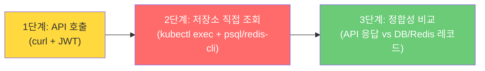

모든 시나리오는 이 3단계를 반드시 수행한다.
2단계 없이 1단계만 수행하면 그것은 API 테스트이지 통합 테스트가 아니다.

### 1.3 행동 원칙

1. **인프라 먼저, 테스트 나중** -- DB/Redis가 기동되지 않은 상태에서 통합 테스트를 시도하지 않는다.
2. **API 응답을 신뢰하지 않는다** -- 서버가 200을 반환해도 DB에 레코드가 없으면 FAIL이다.
3. **양방향 검증** -- 쓰기(POST) 후 DB 직접 조회, 읽기(GET) 응답과 DB 레코드 비교.
4. **격리된 테스트** -- 각 시나리오는 독립 실행 가능해야 한다. 이전 시나리오 잔여 데이터에 의존하지 않는다.
5. **정리(Teardown)** -- 테스트 종료 후 생성한 데이터를 삭제하여 다음 실행에 영향을 주지 않는다.

---

## 2. 테스트 환경 사전점검 체크리스트

**통합 테스트 실행 전에 반드시 아래 항목을 모두 확인한다.**
하나라도 실패하면 테스트를 진행하지 않는다.

### 2.1 인프라 점검 흐름

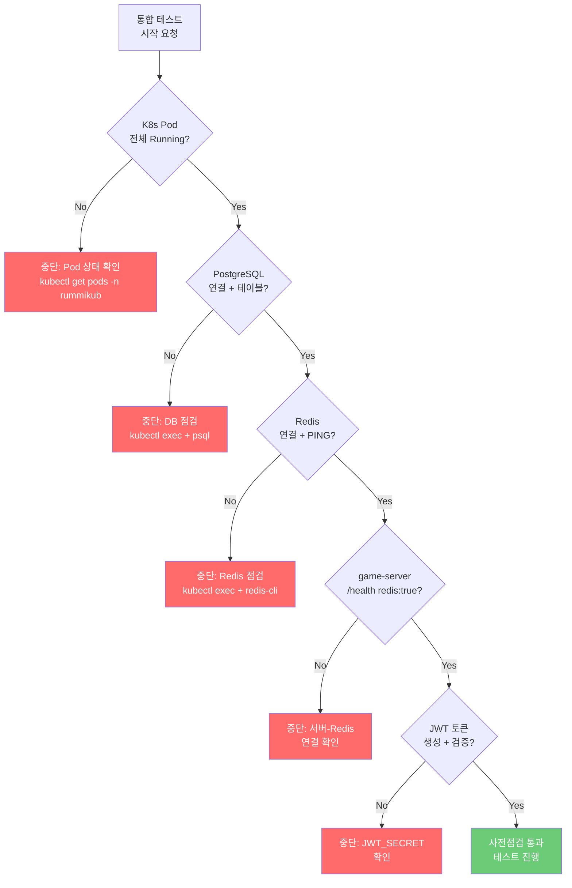

### 2.2 점검 항목 상세

| # | 점검 항목 | 확인 명령 | 기대 결과 | 체크 |
|---|----------|----------|----------|------|
| 1 | K8s Pod 전체 Running | `kubectl get pods -n rummikub` | game-server, ai-adapter, frontend, postgres, redis 전체 Running | `[ ]` |
| 2 | PostgreSQL 연결 | `kubectl exec -n rummikub deploy/postgres -- psql -U rummikub -d rummikub -c '\dt'` | 10개 테이블 목록 출력 | `[ ]` |
| 3 | 핵심 테이블 존재 | 위 명령 결과에서 `users`, `games`, `game_players` 테이블 확인 | 3개 테이블 존재 | `[ ]` |
| 4 | Redis PING | `kubectl exec -n rummikub deploy/redis -- redis-cli PING` | `PONG` | `[ ]` |
| 5 | game-server health | `curl -s http://localhost:30080/health \| jq .` | `{"status":"ok", ..., "redis": true}` | `[ ]` |
| 6 | ai-adapter health | `curl -s http://localhost:30081/health \| jq .` | `{"status":"ok", ...}` | `[ ]` |
| 7 | JWT 토큰 생성 | 아래 스크립트로 테스트 JWT 생성 | 유효한 JWT 문자열 반환 | `[ ]` |
| 8 | JWT 인증 검증 | `curl -s -H "Authorization: Bearer ${JWT}" http://localhost:30080/api/auth/me` | 200 또는 사용자 정보 반환 | `[ ]` |

### 2.3 사전점검 실행 스크립트

```bash
#!/bin/bash
# ==============================================================
# pre-check.sh -- 통합 테스트 사전점검
# ==============================================================
set -e

PASS=0
FAIL=0

check() {
  local desc="$1"
  local result="$2"
  if [ "$result" = "true" ]; then
    echo "[PASS] $desc"
    PASS=$((PASS+1))
  else
    echo "[FAIL] $desc"
    FAIL=$((FAIL+1))
  fi
}

echo "=========================================="
echo "  RummiArena 통합 테스트 사전점검"
echo "=========================================="
echo ""

# 1. K8s Pod 상태
echo "--- K8s Pod 상태 ---"
POD_STATUS=$(kubectl get pods -n rummikub --no-headers 2>/dev/null | awk '{print $3}' | sort -u)
ALL_RUNNING=$(echo "$POD_STATUS" | grep -v "Running" | wc -l)
check "K8s Pod 전체 Running" "$([ "$ALL_RUNNING" = "0" ] && echo true || echo false)"

# 2. PostgreSQL 연결
echo ""
echo "--- PostgreSQL 점검 ---"
PG_TABLES=$(kubectl exec -n rummikub deploy/postgres -- \
  psql -U rummikub -d rummikub -t -c \
  "SELECT count(*) FROM information_schema.tables WHERE table_schema='public'" 2>/dev/null | tr -d ' ')
check "PostgreSQL 연결 + 테이블 존재 (${PG_TABLES}개)" "$([ "$PG_TABLES" -ge 5 ] 2>/dev/null && echo true || echo false)"

# 핵심 테이블 확인
for TBL in users games game_players; do
  EXISTS=$(kubectl exec -n rummikub deploy/postgres -- \
    psql -U rummikub -d rummikub -t -c \
    "SELECT EXISTS(SELECT 1 FROM information_schema.tables WHERE table_name='${TBL}')" 2>/dev/null | tr -d ' ')
  check "테이블 '${TBL}' 존재" "$([ "$EXISTS" = "t" ] && echo true || echo false)"
done

# 3. Redis PING
echo ""
echo "--- Redis 점검 ---"
REDIS_PONG=$(kubectl exec -n rummikub deploy/redis -- redis-cli PING 2>/dev/null | tr -d '\r')
check "Redis PING -> PONG" "$([ "$REDIS_PONG" = "PONG" ] && echo true || echo false)"

# 4. game-server health
echo ""
echo "--- game-server 점검 ---"
GS_HEALTH=$(curl -s --max-time 5 http://localhost:30080/health 2>/dev/null)
GS_STATUS=$(echo "$GS_HEALTH" | jq -r '.status' 2>/dev/null)
GS_REDIS=$(echo "$GS_HEALTH" | jq -r '.redis' 2>/dev/null)
check "game-server /health status=ok" "$([ "$GS_STATUS" = "ok" ] && echo true || echo false)"
check "game-server redis 연결" "$([ "$GS_REDIS" = "true" ] && echo true || echo false)"

# 5. ai-adapter health
echo ""
echo "--- ai-adapter 점검 ---"
AI_HEALTH=$(curl -s --max-time 5 http://localhost:30081/health 2>/dev/null)
AI_STATUS=$(echo "$AI_HEALTH" | jq -r '.status' 2>/dev/null)
check "ai-adapter /health status=ok" "$([ "$AI_STATUS" = "ok" ] && echo true || echo false)"

# 결과 요약
echo ""
echo "=========================================="
echo "  결과: PASS=${PASS} / FAIL=${FAIL}"
echo "=========================================="
if [ "$FAIL" -gt 0 ]; then
  echo "  [경고] FAIL 항목이 있습니다. 통합 테스트를 진행하지 마십시오."
  exit 1
else
  echo "  [완료] 모든 사전점검 통과. 통합 테스트를 진행하십시오."
  exit 0
fi
```

---

## 3. JWT 토큰 생성

통합 테스트에서 사용할 JWT 토큰을 생성한다.
game-server의 `JWT_SECRET`과 동일한 시크릿을 사용해야 한다.

### 3.1 토큰 생성 스크립트

```bash
#!/bin/bash
# ==============================================================
# gen-jwt.sh -- 테스트용 JWT 토큰 생성
# 의존성: jq, openssl (base64)
# ==============================================================

JWT_SECRET="${JWT_SECRET:-test-secret-for-dev}"

# Player 1 (호스트)
P1_SUB="test-user-001"
P1_NAME="애벌레"
P1_EMAIL="test1@rummiarena.test"

# Player 2 (참가자)
P2_SUB="test-user-002"
P2_NAME="테스트유저2"
P2_EMAIL="test2@rummiarena.test"

# Player 3 (풀방 테스트용)
P3_SUB="test-user-003"
P3_NAME="테스트유저3"
P3_EMAIL="test3@rummiarena.test"

gen_jwt() {
  local sub="$1" name="$2" email="$3"
  local now=$(date +%s)
  local exp=$((now + 3600))

  local header=$(echo -n '{"alg":"HS256","typ":"JWT"}' | openssl base64 -A | tr '+/' '-_' | tr -d '=')
  local payload=$(echo -n "{\"sub\":\"${sub}\",\"name\":\"${name}\",\"email\":\"${email}\",\"iat\":${now},\"exp\":${exp}}" \
    | openssl base64 -A | tr '+/' '-_' | tr -d '=')
  local signature=$(echo -n "${header}.${payload}" \
    | openssl dgst -sha256 -hmac "${JWT_SECRET}" -binary \
    | openssl base64 -A | tr '+/' '-_' | tr -d '=')

  echo "${header}.${payload}.${signature}"
}

export JWT_P1=$(gen_jwt "$P1_SUB" "$P1_NAME" "$P1_EMAIL")
export JWT_P2=$(gen_jwt "$P2_SUB" "$P2_NAME" "$P2_EMAIL")
export JWT_P3=$(gen_jwt "$P3_SUB" "$P3_NAME" "$P3_EMAIL")

echo "JWT_P1 (${P1_NAME}): ${JWT_P1}"
echo "JWT_P2 (${P2_NAME}): ${JWT_P2}"
echo "JWT_P3 (${P3_NAME}): ${JWT_P3}"
echo ""
echo "export JWT_P1 JWT_P2 JWT_P3  # 을 실행하여 환경변수로 사용"
```

### 3.2 환경 변수 설정

```bash
# K8s NodePort 기반 접속 정보
export GS_URL="http://localhost:30080"
export API_URL="${GS_URL}/api"
export JWT_SECRET="test-secret-for-dev"

# JWT 생성
source ./gen-jwt.sh

# PostgreSQL 직접 조회 헬퍼
pg_query() {
  kubectl exec -n rummikub deploy/postgres -- \
    psql -U rummikub -d rummikub -t -c "$1" 2>/dev/null | sed 's/^[[:space:]]*//'
}

# Redis 직접 조회 헬퍼
redis_cmd() {
  kubectl exec -n rummikub deploy/redis -- redis-cli "$@" 2>/dev/null
}
```

---

## 4. 통합 테스트 시나리오

### 4.1 전체 데이터 흐름 아키텍처

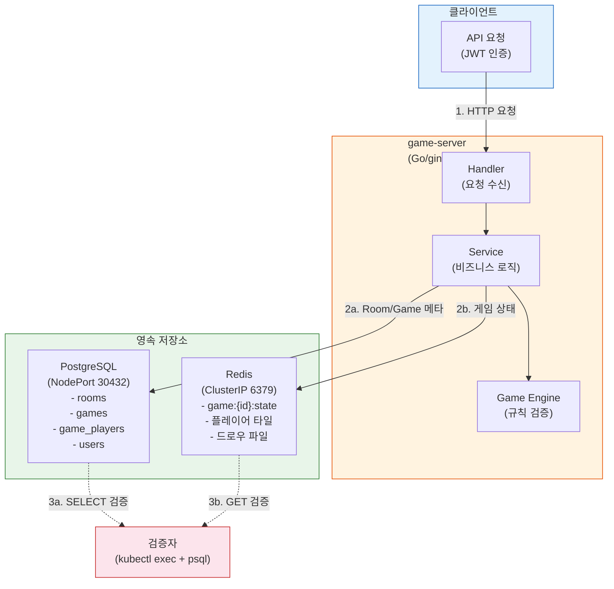

---

### 4.2 시나리오 A: Room 생성 -> PostgreSQL 저장 검증

**목적**: `POST /api/rooms` 호출 후 PostgreSQL `games` 테이블에 레코드가 생성되는지 검증한다.

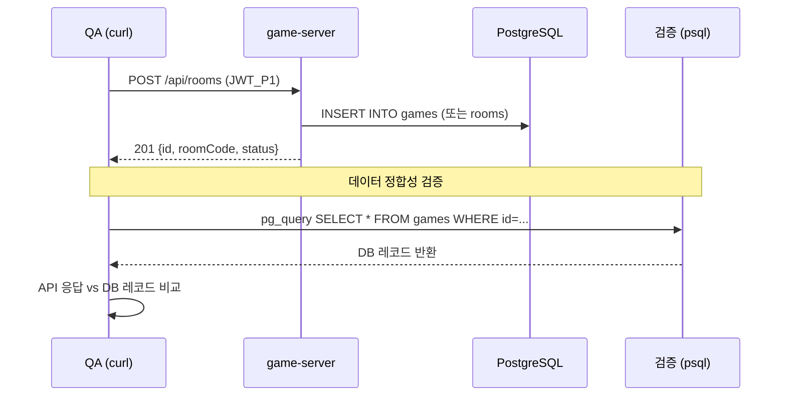

#### TC-IV-A01: Room 생성 -> DB 레코드 존재 확인

```bash
#!/bin/bash
# ==============================================================
# scenario-a.sh -- Room 생성 -> DB 저장 검증
# ==============================================================
source ./env-setup.sh  # JWT, 헬퍼 함수 로드

echo "=== TC-IV-A01: Room 생성 -> DB 저장 검증 ==="

# 1단계: API 호출
RESP=$(curl -s -w "\n%{http_code}" \
  -X POST \
  -H "Content-Type: application/json" \
  -H "Authorization: Bearer ${JWT_P1}" \
  -d '{"playerCount":2,"turnTimeoutSec":60}' \
  "${API_URL}/rooms")

HTTP_CODE=$(echo "$RESP" | tail -1)
BODY=$(echo "$RESP" | head -n -1)
ROOM_ID=$(echo "$BODY" | jq -r '.id')
ROOM_CODE=$(echo "$BODY" | jq -r '.roomCode')
API_STATUS=$(echo "$BODY" | jq -r '.status')
API_HOST=$(echo "$BODY" | jq -r '.hostUserId')
API_PLAYER_COUNT=$(echo "$BODY" | jq -r '.playerCount')

echo "  API 응답: HTTP=${HTTP_CODE}, roomId=${ROOM_ID}, code=${ROOM_CODE}"

# 1단계 검증
[ "${HTTP_CODE}" = "201" ] && echo "  [PASS] HTTP 201" || echo "  [FAIL] HTTP ${HTTP_CODE}"

# 2단계: PostgreSQL 직접 조회
echo ""
echo "--- 2단계: PostgreSQL 직접 조회 ---"

# games 테이블에서 해당 room_code로 조회
DB_RECORD=$(pg_query "SELECT id, room_code, status, player_count FROM games WHERE room_code='${ROOM_CODE}' LIMIT 1;")
echo "  DB 레코드: ${DB_RECORD}"

if [ -z "$DB_RECORD" ]; then
  echo "  [FAIL] DB에 레코드 없음 -- API는 201을 반환했으나 DB에 저장되지 않았다"
  ROOM_ID_FOR_CLEANUP="${ROOM_ID}"
  exit 1
fi

# DB 필드 파싱
DB_ID=$(echo "$DB_RECORD" | awk -F'|' '{print $1}' | tr -d ' ')
DB_CODE=$(echo "$DB_RECORD" | awk -F'|' '{print $2}' | tr -d ' ')
DB_STATUS=$(echo "$DB_RECORD" | awk -F'|' '{print $3}' | tr -d ' ')
DB_PCOUNT=$(echo "$DB_RECORD" | awk -F'|' '{print $4}' | tr -d ' ')

# 3단계: 정합성 비교
echo ""
echo "--- 3단계: API 응답 vs DB 레코드 정합성 ---"

check_match() {
  local field="$1" api_val="$2" db_val="$3"
  if [ "$api_val" = "$db_val" ]; then
    echo "  [PASS] ${field}: API='${api_val}' == DB='${db_val}'"
  else
    echo "  [FAIL] ${field}: API='${api_val}' != DB='${db_val}'"
  fi
}

check_match "roomCode" "${ROOM_CODE}" "${DB_CODE}"
check_match "status" "${API_STATUS}" "${DB_STATUS}"
check_match "playerCount" "${API_PLAYER_COUNT}" "${DB_PCOUNT}"

# 정리: 테스트 데이터 삭제
echo ""
echo "--- Teardown ---"
curl -s -X DELETE -H "Authorization: Bearer ${JWT_P1}" "${API_URL}/rooms/${ROOM_ID}" > /dev/null
echo "  Room ${ROOM_ID} 삭제 완료"
```

#### TC-IV-A02: Room 생성 -> GET 재조회 -> DB 3자 일치

| 검증 포인트 | 방법 |
|------------|------|
| POST 응답의 `id` | API 응답에서 추출 |
| GET 재조회 `id` | `GET /api/rooms/{id}` 호출 |
| DB의 `id` | `SELECT id FROM games WHERE room_code='{code}'` |
| **3자 일치** | POST.id == GET.id == DB.id |

---

### 4.3 시나리오 B: 게임 시작 -> Redis 게임 상태 검증

**목적**: 게임 시작 후 Redis에 게임 상태(`game:{gameId}:state`)가 저장되는지 검증한다.

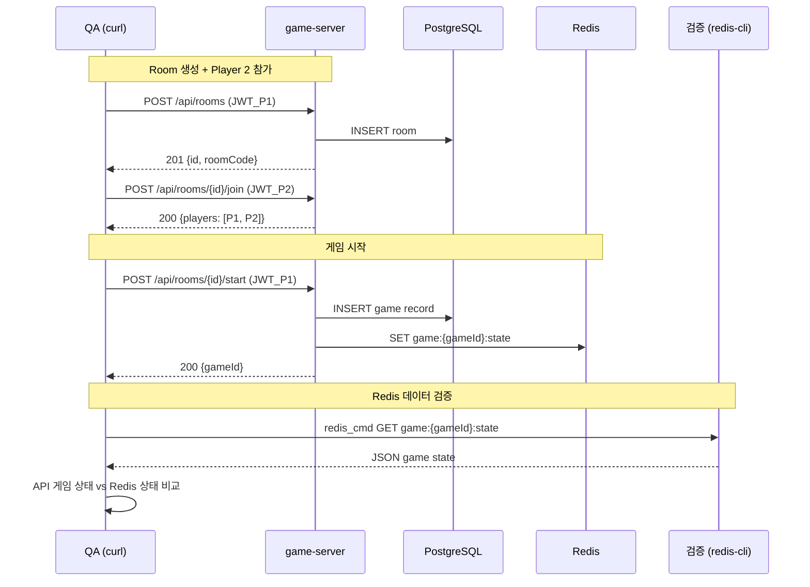

#### TC-IV-B01: 게임 시작 -> Redis key 존재 확인

```bash
#!/bin/bash
# ==============================================================
# scenario-b.sh -- 게임 시작 -> Redis 상태 검증
# ==============================================================
source ./env-setup.sh

echo "=== TC-IV-B01: 게임 시작 -> Redis 게임 상태 검증 ==="

# 사전 준비: Room 생성 + Player 2 참가
ROOM_RESP=$(curl -s -X POST \
  -H "Content-Type: application/json" \
  -H "Authorization: Bearer ${JWT_P1}" \
  -d '{"playerCount":2,"turnTimeoutSec":60}' \
  "${API_URL}/rooms")
ROOM_ID=$(echo "$ROOM_RESP" | jq -r '.id')
echo "  Room 생성: ${ROOM_ID}"

JOIN_RESP=$(curl -s -X POST \
  -H "Content-Type: application/json" \
  -H "Authorization: Bearer ${JWT_P2}" \
  "${API_URL}/rooms/${ROOM_ID}/join")
echo "  Player 2 참가: $(echo "$JOIN_RESP" | jq -r '.players | length')명"

# 1단계: 게임 시작 API 호출
START_RESP=$(curl -s -w "\n%{http_code}" \
  -X POST \
  -H "Content-Type: application/json" \
  -H "Authorization: Bearer ${JWT_P1}" \
  "${API_URL}/rooms/${ROOM_ID}/start")

HTTP_CODE=$(echo "$START_RESP" | tail -1)
BODY=$(echo "$START_RESP" | head -n -1)
GAME_ID=$(echo "$BODY" | jq -r '.gameId')

echo "  게임 시작: HTTP=${HTTP_CODE}, gameId=${GAME_ID}"
[ "${HTTP_CODE}" = "200" ] && echo "  [PASS] 게임 시작 성공" || echo "  [FAIL] 게임 시작 실패"

# 2단계: Redis 직접 조회
echo ""
echo "--- 2단계: Redis 직접 조회 ---"

REDIS_KEY="game:${GAME_ID}:state"
REDIS_EXISTS=$(redis_cmd EXISTS "${REDIS_KEY}")
echo "  Redis key '${REDIS_KEY}' 존재: ${REDIS_EXISTS}"

if [ "${REDIS_EXISTS}" = "1" ]; then
  echo "  [PASS] Redis에 게임 상태 저장됨"
else
  echo "  [FAIL] Redis에 게임 상태 없음 -- game-server가 Redis에 기록하지 않았다"
fi

# Redis 상태 내용 확인
REDIS_STATE=$(redis_cmd GET "${REDIS_KEY}")
REDIS_STATUS=$(echo "$REDIS_STATE" | jq -r '.status' 2>/dev/null)
REDIS_CURRENT_SEAT=$(echo "$REDIS_STATE" | jq -r '.currentSeat' 2>/dev/null)
REDIS_DRAW_COUNT=$(echo "$REDIS_STATE" | jq -r '.drawPileCount' 2>/dev/null)

echo "  Redis status: ${REDIS_STATUS}"
echo "  Redis currentSeat: ${REDIS_CURRENT_SEAT}"
echo "  Redis drawPileCount: ${REDIS_DRAW_COUNT}"

# 3단계: API 게임 상태와 Redis 비교
echo ""
echo "--- 3단계: API vs Redis 정합성 ---"

GAME_STATE=$(curl -s \
  -H "Authorization: Bearer ${JWT_P1}" \
  "${API_URL}/games/${GAME_ID}?seat=0")

API_STATUS=$(echo "$GAME_STATE" | jq -r '.status')
API_CURRENT_SEAT=$(echo "$GAME_STATE" | jq -r '.currentSeat')
API_DRAW_COUNT=$(echo "$GAME_STATE" | jq -r '.drawPileCount')
API_RACK_COUNT=$(echo "$GAME_STATE" | jq '.myRack | length')

echo "  API status=${API_STATUS}, currentSeat=${API_CURRENT_SEAT}, drawPile=${API_DRAW_COUNT}, rack=${API_RACK_COUNT}"

check_match "status" "${API_STATUS}" "${REDIS_STATUS}"
check_match "currentSeat" "${API_CURRENT_SEAT}" "${REDIS_CURRENT_SEAT}"
check_match "drawPileCount" "${API_DRAW_COUNT}" "${REDIS_DRAW_COUNT}"

# 게임 규칙 검증
echo ""
echo "--- 게임 초기화 규칙 검증 ---"
[ "${API_RACK_COUNT}" = "14" ] && echo "  [PASS] 초기 랙 14장" || echo "  [FAIL] 초기 랙 ${API_RACK_COUNT}장 (14장 기대)"
EXPECTED_DRAW=$((106 - 14 * 2))  # 2인 게임: 106 - 28 = 78
[ "${API_DRAW_COUNT}" = "${EXPECTED_DRAW}" ] && echo "  [PASS] 드로우 파일 ${EXPECTED_DRAW}장" || echo "  [FAIL] 드로우 파일 ${API_DRAW_COUNT}장 (${EXPECTED_DRAW}장 기대)"

# PostgreSQL에도 game 레코드 존재 확인
echo ""
echo "--- PostgreSQL game 레코드 확인 ---"
DB_GAME=$(pg_query "SELECT id, status FROM games WHERE id='${GAME_ID}' LIMIT 1;")
if [ -n "$DB_GAME" ]; then
  echo "  [PASS] DB에 game 레코드 존재: ${DB_GAME}"
else
  echo "  [FAIL] DB에 game 레코드 없음"
fi

# game_players 레코드 확인
GP_COUNT=$(pg_query "SELECT count(*) FROM game_players WHERE game_id='${GAME_ID}';")
echo "  game_players 레코드 수: ${GP_COUNT}"
[ "${GP_COUNT}" = "2" ] && echo "  [PASS] 2명 game_players 레코드" || echo "  [FAIL] ${GP_COUNT}명 (2명 기대)"

# Teardown
echo ""
echo "--- Teardown ---"
redis_cmd DEL "${REDIS_KEY}" > /dev/null
curl -s -X DELETE -H "Authorization: Bearer ${JWT_P1}" "${API_URL}/rooms/${ROOM_ID}" > /dev/null
echo "  정리 완료"
```

#### TC-IV-B02: 게임 시작 -> 두 플레이어 시점 비교

| 검증 포인트 | seat=0 조회 | seat=1 조회 | 기대값 |
|------------|------------|------------|--------|
| `myRack` 개수 | 14장 | 14장 | 양쪽 동일 |
| `myRack` 내용 | 14장 타일 목록 | 14장 타일 목록 | **서로 다름** (각자의 패) |
| `drawPileCount` | N | N | 양쪽 동일 |
| `players[0].tileCount` | 14 | 14 | 양쪽 동일 |
| `players[1].tileCount` | 14 | 14 | 양쪽 동일 |
| 상대 `myRack` 노출 | seat=0의 패가 seat=1 응답에 없음 | seat=1의 패가 seat=0 응답에 없음 | **비공개 보장** |

---

### 4.4 시나리오 C: 턴 진행 -> 상태 변경 검증

**목적**: Draw 수행 후 Redis의 `currentSeat`, 타일 수 등이 올바르게 변경되는지 검증한다.

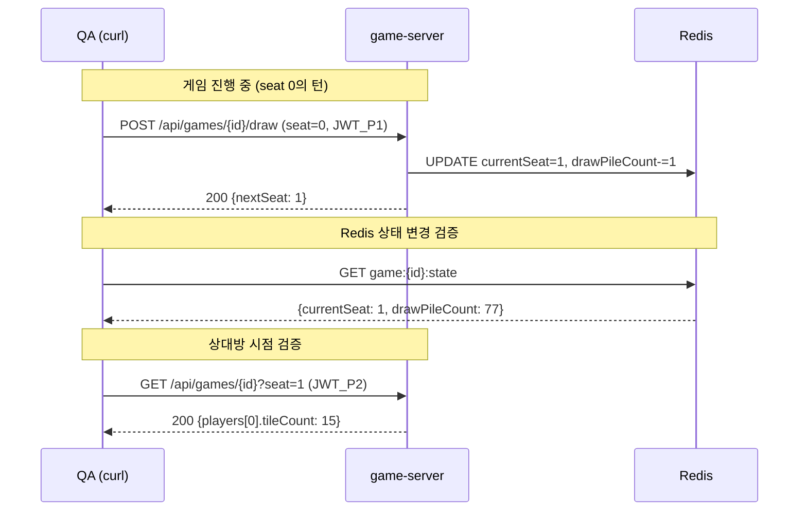

#### TC-IV-C01: Draw 수행 -> currentSeat 변경 + 타일 수 증가

```bash
# (게임 진행 중 상태에서 시작)

echo "=== TC-IV-C01: Draw -> 상태 변경 검증 ==="

# Draw 전 상태 캡처
BEFORE_STATE=$(redis_cmd GET "game:${GAME_ID}:state")
BEFORE_SEAT=$(echo "$BEFORE_STATE" | jq -r '.currentSeat')
BEFORE_DRAW=$(echo "$BEFORE_STATE" | jq -r '.drawPileCount')
echo "  Before: currentSeat=${BEFORE_SEAT}, drawPile=${BEFORE_DRAW}"

# 1단계: Draw API 호출
DRAW_RESP=$(curl -s -X POST \
  -H "Content-Type: application/json" \
  -H "Authorization: Bearer ${JWT_P1}" \
  -d '{"seat":0}' \
  "${API_URL}/games/${GAME_ID}/draw")

NEXT_SEAT=$(echo "$DRAW_RESP" | jq -r '.nextSeat')
echo "  API nextSeat: ${NEXT_SEAT}"

# 2단계: Redis 변경 확인
AFTER_STATE=$(redis_cmd GET "game:${GAME_ID}:state")
AFTER_SEAT=$(echo "$AFTER_STATE" | jq -r '.currentSeat')
AFTER_DRAW=$(echo "$AFTER_STATE" | jq -r '.drawPileCount')
echo "  After: currentSeat=${AFTER_SEAT}, drawPile=${AFTER_DRAW}"

# 3단계: 검증
[ "${AFTER_SEAT}" = "1" ] && echo "  [PASS] currentSeat 0->1" || echo "  [FAIL] currentSeat=${AFTER_SEAT}"
EXPECTED_DRAW=$((BEFORE_DRAW - 1))
[ "${AFTER_DRAW}" = "${EXPECTED_DRAW}" ] && echo "  [PASS] drawPile ${BEFORE_DRAW}->${AFTER_DRAW}" || echo "  [FAIL] drawPile=${AFTER_DRAW} (${EXPECTED_DRAW} 기대)"

# 상대방 시점 검증
P2_VIEW=$(curl -s \
  -H "Authorization: Bearer ${JWT_P2}" \
  "${API_URL}/games/${GAME_ID}?seat=1")
P1_TILES_FROM_P2=$(echo "$P2_VIEW" | jq -r '.players[] | select(.seat==0) | .tileCount')
echo "  P2가 본 P1 타일 수: ${P1_TILES_FROM_P2}"
[ "${P1_TILES_FROM_P2}" = "15" ] && echo "  [PASS] P1 타일 14->15" || echo "  [FAIL] P1 타일=${P1_TILES_FROM_P2}"
```

#### TC-IV-C02: 턴 교대 순환 (seat 0 -> 1 -> 0)

| 단계 | 행위자 | 행동 | Redis currentSeat (전) | Redis currentSeat (후) |
|------|--------|------|----------------------|----------------------|
| 1 | seat 0 | draw | 0 | 1 |
| 2 | seat 1 | draw | 1 | 0 |
| 3 | seat 0 | draw | 0 | 1 |

검증: 매 단계마다 Redis 직접 조회로 currentSeat 변경을 확인한다.

---

### 4.5 시나리오 D: Room 삭제 -> DB 정리 검증

**목적**: Room 삭제 후 PostgreSQL에서 해당 레코드가 실제로 제거되는지 검증한다.

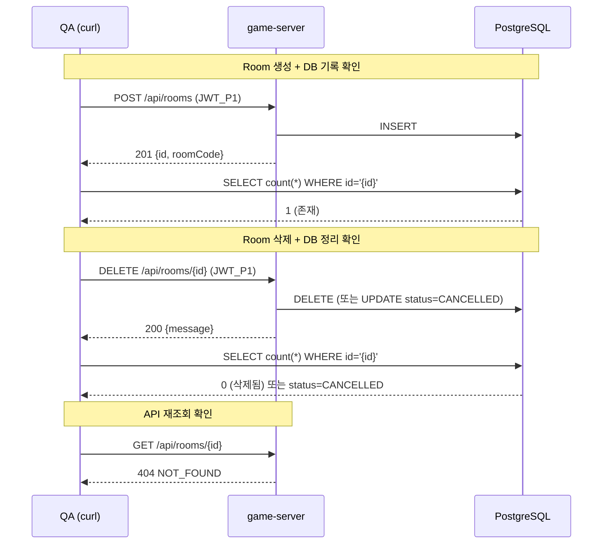

#### TC-IV-D01: Room 삭제 -> DB에서 레코드 소멸 확인

```bash
echo "=== TC-IV-D01: Room 삭제 -> DB 정리 검증 ==="

# Room 생성
ROOM_RESP=$(curl -s -X POST \
  -H "Content-Type: application/json" \
  -H "Authorization: Bearer ${JWT_P1}" \
  -d '{"playerCount":2,"turnTimeoutSec":60}' \
  "${API_URL}/rooms")
ROOM_ID=$(echo "$ROOM_RESP" | jq -r '.id')
ROOM_CODE=$(echo "$ROOM_RESP" | jq -r '.roomCode')

# DB 존재 확인 (삭제 전)
BEFORE_COUNT=$(pg_query "SELECT count(*) FROM games WHERE room_code='${ROOM_CODE}';")
echo "  삭제 전 DB 레코드 수: ${BEFORE_COUNT}"
[ "${BEFORE_COUNT}" = "1" ] && echo "  [PASS] DB에 레코드 존재" || echo "  [FAIL] DB에 레코드 없음"

# Room 삭제
DEL_RESP=$(curl -s -w "\n%{http_code}" \
  -X DELETE \
  -H "Authorization: Bearer ${JWT_P1}" \
  "${API_URL}/rooms/${ROOM_ID}")
DEL_CODE=$(echo "$DEL_RESP" | tail -1)
echo "  삭제 API: HTTP=${DEL_CODE}"

# DB 소멸 확인 (삭제 후)
AFTER_COUNT=$(pg_query "SELECT count(*) FROM games WHERE room_code='${ROOM_CODE}' AND status != 'CANCELLED';")
echo "  삭제 후 활성 레코드 수: ${AFTER_COUNT}"
[ "${AFTER_COUNT}" = "0" ] && echo "  [PASS] DB에서 활성 레코드 제거됨" || echo "  [FAIL] DB에 활성 레코드 잔존"

# API 재조회 -> 404 확인
REGET_CODE=$(curl -s -o /dev/null -w "%{http_code}" \
  -H "Authorization: Bearer ${JWT_P1}" \
  "${API_URL}/rooms/${ROOM_ID}")
echo "  재조회 API: HTTP=${REGET_CODE}"
[ "${REGET_CODE}" = "404" ] && echo "  [PASS] 404 NOT_FOUND" || echo "  [FAIL] HTTP ${REGET_CODE}"
```

---

### 4.6 시나리오 E: 에러 전파 + DB 무변경 검증

**목적**: 에러 발생 시 (1) 적절한 HTTP 상태 코드가 반환되고 (2) **DB/Redis에 부작용이 없는지** 검증한다.
단순히 에러 코드를 확인하는 것이 아니라, 에러가 저장소에 의도하지 않은 변경을 일으키지 않음을 보장한다.

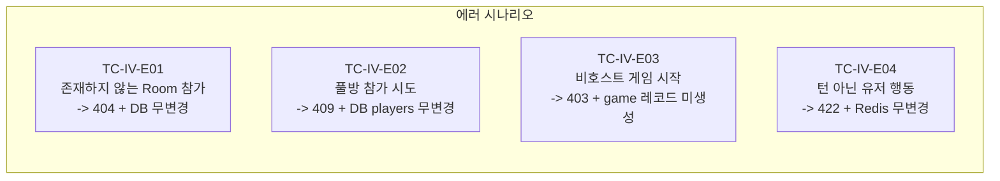

#### TC-IV-E01: 존재하지 않는 Room 참가 -> 404 + DB 무변경

```bash
echo "=== TC-IV-E01: 존재하지 않는 Room 참가 -> 에러 + DB 무변경 ==="

FAKE_ROOM_ID="00000000-0000-0000-0000-000000000000"

# DB 레코드 수 캡처 (Before)
BEFORE_TOTAL=$(pg_query "SELECT count(*) FROM games;")

# 에러 API 호출
ERR_RESP=$(curl -s -w "\n%{http_code}" \
  -X POST \
  -H "Content-Type: application/json" \
  -H "Authorization: Bearer ${JWT_P1}" \
  "${API_URL}/rooms/${FAKE_ROOM_ID}/join")

HTTP_CODE=$(echo "$ERR_RESP" | tail -1)
BODY=$(echo "$ERR_RESP" | head -n -1)
ERR_CODE=$(echo "$BODY" | jq -r '.error.code')

echo "  HTTP: ${HTTP_CODE}, error.code: ${ERR_CODE}"
[ "${HTTP_CODE}" = "404" ] && echo "  [PASS] 404 반환" || echo "  [FAIL] HTTP ${HTTP_CODE}"
[ "${ERR_CODE}" = "NOT_FOUND" ] && echo "  [PASS] error.code=NOT_FOUND" || echo "  [FAIL] error.code=${ERR_CODE}"

# DB 무변경 확인
AFTER_TOTAL=$(pg_query "SELECT count(*) FROM games;")
[ "${BEFORE_TOTAL}" = "${AFTER_TOTAL}" ] && echo "  [PASS] DB 무변경 (${BEFORE_TOTAL} -> ${AFTER_TOTAL})" || echo "  [FAIL] DB 변경됨 (${BEFORE_TOTAL} -> ${AFTER_TOTAL})"
```

#### TC-IV-E02: 풀방 참가 -> 409 + 기존 players 무변경

```bash
echo "=== TC-IV-E02: 풀방 참가 -> 409 + players 무변경 ==="

# 2인 방 생성 + P2 참가 (풀방)
ROOM_RESP=$(curl -s -X POST \
  -H "Content-Type: application/json" \
  -H "Authorization: Bearer ${JWT_P1}" \
  -d '{"playerCount":2,"turnTimeoutSec":60}' \
  "${API_URL}/rooms")
ROOM_ID=$(echo "$ROOM_RESP" | jq -r '.id')

curl -s -X POST \
  -H "Content-Type: application/json" \
  -H "Authorization: Bearer ${JWT_P2}" \
  "${API_URL}/rooms/${ROOM_ID}/join" > /dev/null

# Before: player 수 확인
BEFORE_PLAYERS=$(curl -s -H "Authorization: Bearer ${JWT_P1}" \
  "${API_URL}/rooms/${ROOM_ID}" | jq '.players | [.[] | select(.status=="CONNECTED")] | length')

# P3 참가 시도 (풀방)
ERR_RESP=$(curl -s -w "\n%{http_code}" \
  -X POST \
  -H "Content-Type: application/json" \
  -H "Authorization: Bearer ${JWT_P3}" \
  "${API_URL}/rooms/${ROOM_ID}/join")
HTTP_CODE=$(echo "$ERR_RESP" | tail -1)
echo "  풀방 참가 시도: HTTP=${HTTP_CODE}"
[ "${HTTP_CODE}" = "409" ] && echo "  [PASS] 409 ROOM_FULL" || echo "  [FAIL] HTTP ${HTTP_CODE}"

# After: player 수 무변경 확인
AFTER_PLAYERS=$(curl -s -H "Authorization: Bearer ${JWT_P1}" \
  "${API_URL}/rooms/${ROOM_ID}" | jq '.players | [.[] | select(.status=="CONNECTED")] | length')
[ "${BEFORE_PLAYERS}" = "${AFTER_PLAYERS}" ] && echo "  [PASS] players 무변경 (${BEFORE_PLAYERS}명)" || echo "  [FAIL] players 변경 (${BEFORE_PLAYERS} -> ${AFTER_PLAYERS})"

# Teardown
curl -s -X DELETE -H "Authorization: Bearer ${JWT_P1}" "${API_URL}/rooms/${ROOM_ID}" > /dev/null
```

#### TC-IV-E03: 에러 응답 포맷 일관성

모든 에러 응답이 아래 포맷을 준수하는지 검증한다.

```json
{
  "error": {
    "code": "MACHINE_READABLE_CODE",
    "message": "한글 사용자 메시지"
  }
}
```

| HTTP 상태 | 시나리오 | 기대 error.code |
|-----------|---------|----------------|
| 401 | JWT 없이 API 호출 | `UNAUTHORIZED` |
| 403 | 비호스트가 게임 시작 | `FORBIDDEN` |
| 404 | 없는 Room 조회 | `NOT_FOUND` |
| 409 | 풀방 참가 | `ROOM_FULL` |
| 422 | 턴 아닌 유저 행동 | `NOT_YOUR_TURN` |
| 422 | 무효한 세트 배치 | `INVALID_SET` |

---

### 4.7 시나리오 F: game-server -> ai-adapter Cross-Service 통신

**목적**: game-server가 AI 턴일 때 ai-adapter를 호출하고, 그 결과가 Redis에 반영되는지 검증한다.

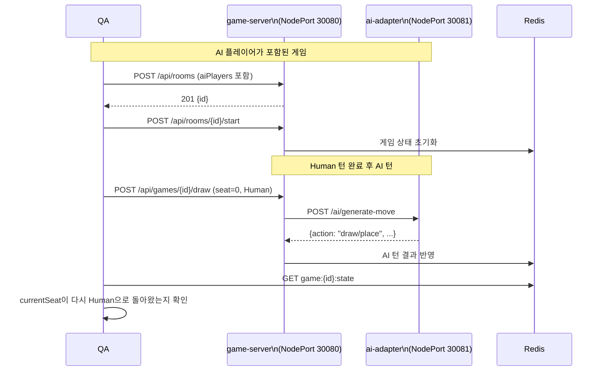

> **참고**: AI 턴 자동 진행은 ai-adapter의 LLM API 키 설정 여부에 따라 동작이 달라진다.
> API 키 미설정 시 AI는 강제 드로우 처리되며, 이 동작도 유효한 테스트 대상이다.

---

## 5. 테스트 케이스 요약 매트릭스

### 5.1 시나리오별 검증 포인트

| 시나리오 | TC ID | API 호출 | DB 검증 | Redis 검증 | Cross-Service |
|---------|-------|---------|--------|-----------|---------------|
| A: Room 생성 | TC-IV-A01 | POST /api/rooms -> 201 | games 테이블 INSERT 확인 | - | - |
| A: Room 재조회 | TC-IV-A02 | GET /api/rooms/{id} -> 200 | POST/GET/DB 3자 일치 | - | - |
| B: 게임 시작 | TC-IV-B01 | POST /api/rooms/{id}/start -> 200 | games status=PLAYING, game_players 2건 | game:{id}:state 존재, drawPileCount=78 | - |
| B: 양 시점 비교 | TC-IV-B02 | GET ?seat=0, GET ?seat=1 | - | 양쪽 drawPileCount 동일, myRack 비공개 | - |
| C: Draw 턴 진행 | TC-IV-C01 | POST /api/games/{id}/draw -> 200 | - | currentSeat 변경, drawPileCount-1 | - |
| C: 턴 교대 순환 | TC-IV-C02 | draw x 3회 | - | seat 0->1->0 순환 확인 | - |
| D: Room 삭제 | TC-IV-D01 | DELETE /api/rooms/{id} -> 200 | games 레코드 삭제/CANCELLED | - | - |
| E: 에러 404 | TC-IV-E01 | POST join -> 404 | DB 무변경 (총 레코드 수) | - | - |
| E: 에러 409 | TC-IV-E02 | POST join -> 409 | - | - | - |
| E: 포맷 일관성 | TC-IV-E03 | 6종 에러 | - | - | - |
| F: AI 턴 | TC-IV-F01 | draw -> AI 턴 자동 진행 | ai_call_logs 기록 | currentSeat 2회 변경 | GS -> AI Adapter |

### 5.2 저장소별 검증 항목

#### PostgreSQL 검증 대상

| 테이블 | 시나리오 | 검증 쿼리 | 기대값 |
|--------|---------|----------|--------|
| `games` | A: Room 생성 | `SELECT * FROM games WHERE room_code='{code}'` | 1건, status=WAITING |
| `games` | B: 게임 시작 | `SELECT status FROM games WHERE id='{gameId}'` | status=PLAYING |
| `games` | D: Room 삭제 | `SELECT count(*) FROM games WHERE id='{id}' AND status!='CANCELLED'` | 0 |
| `game_players` | B: 게임 시작 | `SELECT count(*) FROM game_players WHERE game_id='{gameId}'` | 플레이어 수 (2) |
| `game_players` | B: 게임 시작 | `SELECT seat_order, player_type FROM game_players WHERE game_id='{gameId}'` | seat 0, 1 각 1건 |
| `ai_call_logs` | F: AI 턴 | `SELECT count(*) FROM ai_call_logs WHERE game_id='{gameId}'` | 1건 이상 |

#### Redis 검증 대상

| Key 패턴 | 시나리오 | 검증 명령 | 기대값 |
|----------|---------|----------|--------|
| `game:{gameId}:state` | B: 게임 시작 | `EXISTS game:{id}:state` | 1 (존재) |
| `game:{gameId}:state` | B: 게임 시작 | `GET game:{id}:state \| jq .drawPileCount` | 106 - (14 x 플레이어 수) |
| `game:{gameId}:state` | C: Draw | `GET game:{id}:state \| jq .currentSeat` | 이전 값 + 1 (mod 플레이어 수) |
| `game:{gameId}:state` | C: Draw | `GET game:{id}:state \| jq .drawPileCount` | 이전 값 - 1 |

---

## 6. 실행 가이드

### 6.1 실행 순서

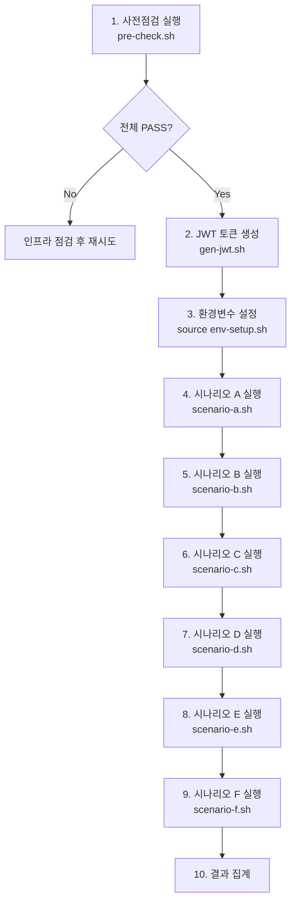

### 6.2 헬퍼 함수 (env-setup.sh)

```bash
#!/bin/bash
# ==============================================================
# env-setup.sh -- 통합 테스트 환경 설정 + 헬퍼 함수
# ==============================================================

export GS_URL="http://localhost:30080"
export API_URL="${GS_URL}/api"
export JWT_SECRET="test-secret-for-dev"

# JWT 생성 (gen-jwt.sh에서 export)
source "$(dirname "$0")/gen-jwt.sh"

# PostgreSQL 직접 조회
pg_query() {
  kubectl exec -n rummikub deploy/postgres -- \
    psql -U rummikub -d rummikub -t -c "$1" 2>/dev/null | sed 's/^[[:space:]]*//'
}

# Redis 명령 실행
redis_cmd() {
  kubectl exec -n rummikub deploy/redis -- redis-cli "$@" 2>/dev/null
}

# API 응답 vs DB 값 비교
check_match() {
  local field="$1" api_val="$2" db_val="$3"
  if [ "$api_val" = "$db_val" ]; then
    echo "  [PASS] ${field}: API='${api_val}' == DB/Redis='${db_val}'"
    return 0
  else
    echo "  [FAIL] ${field}: API='${api_val}' != DB/Redis='${db_val}'"
    return 1
  fi
}

# 테스트 결과 카운터
TOTAL_PASS=0
TOTAL_FAIL=0

pass() { TOTAL_PASS=$((TOTAL_PASS+1)); echo "  [PASS] $1"; }
fail() { TOTAL_FAIL=$((TOTAL_FAIL+1)); echo "  [FAIL] $1"; }

summary() {
  echo ""
  echo "=========================================="
  echo "  통합 테스트 결과: PASS=${TOTAL_PASS} / FAIL=${TOTAL_FAIL} / TOTAL=$((TOTAL_PASS+TOTAL_FAIL))"
  echo "=========================================="
}
```

### 6.3 전체 실행 스크립트

```bash
#!/bin/bash
# ==============================================================
# run-integration-tests.sh -- 전체 통합 테스트 실행
# ==============================================================
set -e

SCRIPT_DIR="$(cd "$(dirname "$0")" && pwd)"

echo "============================================"
echo "  RummiArena 통합 테스트 v2"
echo "  실행일: $(date '+%Y-%m-%d %H:%M:%S')"
echo "  환경: K8s rummikub namespace"
echo "============================================"
echo ""

# 사전점검
echo "[Phase 0] 사전점검"
bash "${SCRIPT_DIR}/pre-check.sh"
echo ""

# 환경 설정
source "${SCRIPT_DIR}/env-setup.sh"

# 시나리오 실행
for SCENARIO in a b c d e; do
  SCRIPT="${SCRIPT_DIR}/scenario-${SCENARIO}.sh"
  if [ -f "$SCRIPT" ]; then
    echo "[Scenario ${SCENARIO^^}] 실행 중..."
    bash "$SCRIPT"
    echo ""
  else
    echo "[Scenario ${SCENARIO^^}] 스크립트 없음 -- 건너뜀"
    echo ""
  fi
done

# 결과 집계
summary
```

---

## 7. 합격 기준

### 7.1 통합 테스트 합격 조건

| 기준 | 조건 | 비고 |
|------|------|------|
| 사전점검 | 8/8 항목 PASS | 하나라도 FAIL이면 테스트 불가 |
| 시나리오 A~D (정상 흐름) | 전체 PASS | API 응답 + DB/Redis 정합성 100% |
| 시나리오 E (에러 처리) | 전체 PASS | 에러 시 DB/Redis 무변경 보장 |
| 시나리오 F (Cross-Service) | PASS 또는 SKIP (API 키 미설정 시) | AI 강제 드로우도 유효 |
| 에러 응답 포맷 | 6종 전체 일관 | `error.code` + `error.message` 존재 |

### 7.2 불합격 시 조치

| 불합격 유형 | 의미 | 조치 |
|------------|------|------|
| API 200 + DB 레코드 없음 | 서버가 DB 저장을 건너뜀 | game-server의 repository 레이어 디버깅 |
| API 200 + Redis key 없음 | 서버가 Redis 저장을 건너뜀 | Redis 연결 상태 + gameStateRepo 확인 |
| DB 값과 API 응답 불일치 | 직렬화/역직렬화 오류 | model 구조체와 DB 스키마 매핑 점검 |
| 에러 시 DB 변경 발생 | 트랜잭션 롤백 누락 | GORM 트랜잭션 처리 점검 |
| Redis currentSeat 미변경 | 턴 전환 로직 오류 | turnService.NextTurn() 디버깅 |

---

## 8. 기존 문서와의 관계

| 문서 | 역할 | 이 문서와의 관계 |
|------|------|----------------|
| `02-smoke-test-report.md` | 서비스 기동 확인 | 사전점검의 기반. 스모크 PASS가 통합 테스트의 전제 |
| `04-integration-test-scenarios.md` | curl 기반 API 테스트 | API 응답 검증에 한정. **이 문서로 대체** |
| `03-engine-test-matrix.md` | Game Engine 단위 테스트 | 통합 테스트에서 Engine 규칙이 E2E로 동작하는지 검증 |
| `01-test-strategy.md` | 전체 테스트 전략 | 통합 테스트 = 테스트 피라미드의 20% (Integration 계층) |
| `02-design/02-database-design.md` | DB 스키마 정의 | PostgreSQL 검증 쿼리의 근거 |
| `02-design/03-api-design.md` | API 스펙 정의 | API 호출 규격과 에러 코드의 근거 |

---

## 9. 향후 계획

### 9.1 자동화 로드맵

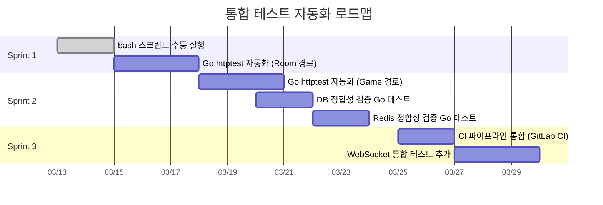

### 9.2 Go httptest 통합 테스트 구조 (Sprint 2 목표)

```go
// src/game-server/internal/handler/integration_test.go (설계 방향)
//
// 실제 PostgreSQL + Redis를 사용하는 통합 테스트
// testcontainers-go로 컨테이너를 자동 생성/삭제
//
// func TestIntegration_RoomCreate_DBVerification(t *testing.T) {
//     // 1. testcontainers로 PG + Redis 기동
//     pgContainer := startPostgresContainer(t)
//     redisContainer := startRedisContainer(t)
//     defer pgContainer.Terminate(ctx)
//     defer redisContainer.Terminate(ctx)
//
//     // 2. 실제 repo 생성 (mock 아님)
//     db := connectPostgres(pgContainer)
//     rdb := connectRedis(redisContainer)
//     gameRepo := repository.NewPostgresGameRepo(db)
//     stateRepo := repository.NewRedisGameStateRepo(rdb)
//
//     // 3. 라우터 + 핸들러 초기화
//     router := setupRouter(gameRepo, stateRepo)
//     ts := httptest.NewServer(router)
//     defer ts.Close()
//
//     // 4. Room 생성 API 호출
//     resp := postJSON(t, ts, "/api/rooms", body, jwt)
//     assert.Equal(t, 201, resp.StatusCode)
//     roomID := extractField(resp, "id")
//
//     // 5. PostgreSQL 직접 조회 (핵심!)
//     var dbRoom model.Game
//     err := db.First(&dbRoom, "id = ?", roomID).Error
//     assert.NoError(t, err)
//     assert.Equal(t, "WAITING", string(dbRoom.Status))
//
//     // 6. API 응답과 DB 레코드 비교
//     assert.Equal(t, resp.RoomCode, dbRoom.RoomCode)
// }
```

---

## 10. 참조 문서

| 문서 | 경로 | 관계 |
|------|------|------|
| 테스트 전략 | `docs/04-testing/01-test-strategy.md` | 상위 전략 |
| 스모크 테스트 | `docs/04-testing/02-smoke-test-report.md` | 사전 검증 |
| Engine 단위 테스트 | `docs/04-testing/03-engine-test-matrix.md` | 단위 테스트 보완 |
| API 스모크 테스트 (v1) | `docs/04-testing/04-integration-test-scenarios.md` | 이전 버전 (참고용) |
| API 설계 | `docs/02-design/03-api-design.md` | API 스펙 근거 |
| DB 설계 | `docs/02-design/02-database-design.md` | DB 스키마 근거 |
| 게임 규칙 | `docs/02-design/06-game-rules.md` | 검증 규칙 근거 |
| 인프라 체크리스트 | `docs/05-deployment/03-infra-setup-checklist.md` | 인프라 설정 |
| Postgres Repo | `src/game-server/internal/repository/postgres_repo.go` | DB 접근 구현체 |
| Redis Repo | `src/game-server/internal/repository/redis_repo.go` | Redis 접근 구현체 |
| Game State Adapter | `src/game-server/internal/repository/game_state_adapter.go` | Redis/Memory 어댑터 |

---

| 버전 | 날짜 | 변경 내용 |
|------|------|-----------|
| v2.0 | 2026-03-13 | 전면 재작성. 서비스 간 데이터 흐름 검증 중심. 인프라 사전점검 체크리스트 + 6개 시나리오 + DB/Redis 직접 조회 스크립트 포함 |
