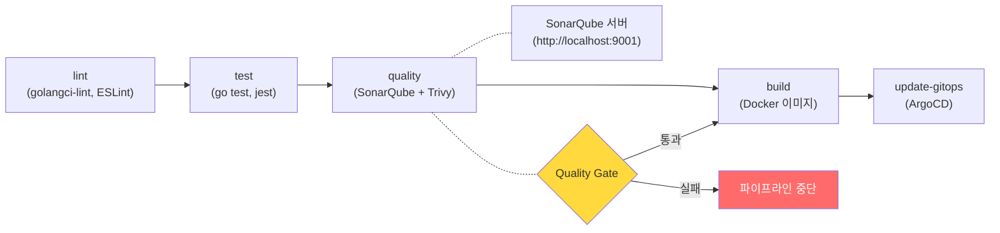
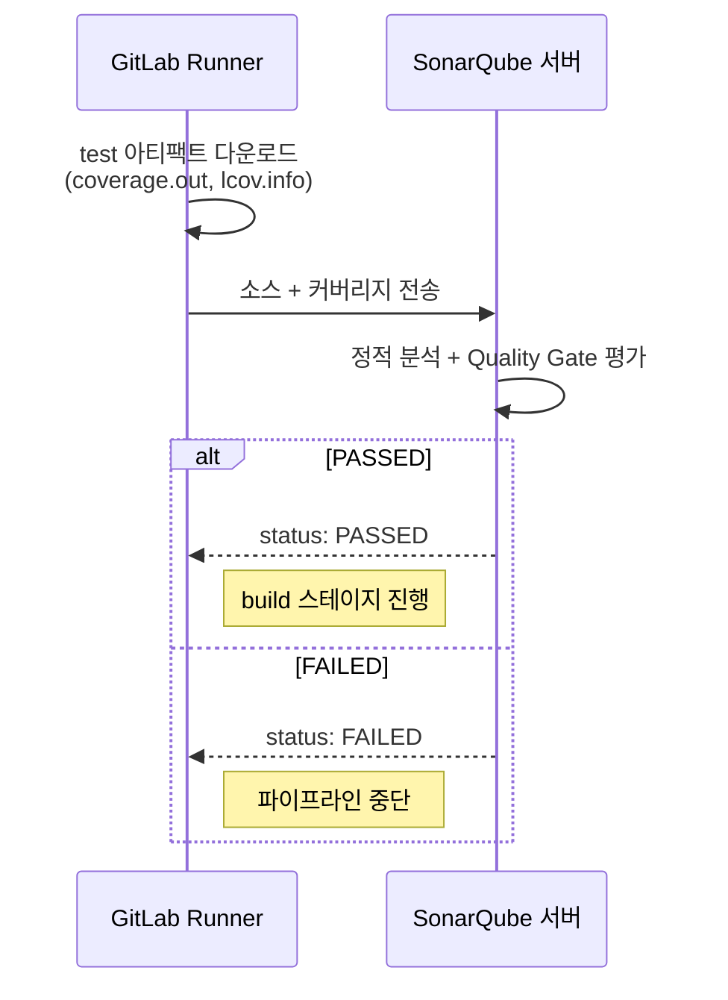
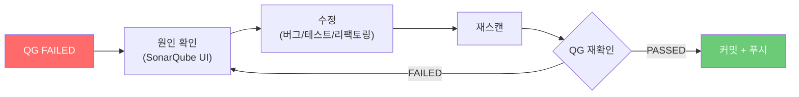

# SonarQube Quality Gate 관리 문서

이 문서는 RummiArena 프로젝트의 SonarQube 기반 코드 품질 관리 정책을 정의한다.
Quality Gate 기준, 현재 분석 결과, 코드 스멜 수정 현황, 커버리지 개선 계획,
로컬/CI 파이프라인 스캔 실행 방법, Quality Gate 실패 시 대응 절차까지 전 범위를 포함한다.

참조 문서:
- `docs/04-testing/01-test-strategy.md` (테스트 전략)
- `docs/05-deployment/05-sonarqube-guide.md` (SonarQube 설치 및 사용 가이드)
- `docs/02-design/06-game-rules.md` (게임 규칙 V-01~V-15)
- `.gitlab-ci.yml` (CI 파이프라인 정의)

---

## 1. SonarQube 개요

### 1.1 RummiArena에서의 역할

SonarQube는 소스 코드의 정적 분석을 수행하여 버그, 보안 취약점, 코드 스멜을 탐지하고 테스트 커버리지를 측정하는 오픈소스 코드 품질 플랫폼이다. RummiArena는 DevSecOps 파이프라인의 **Quality Gate** 단계에서 SonarQube를 활용한다.

| 목적 | 설명 |
|------|------|
| 코드 품질 게이트 | main/develop 브랜치 머지 전 Quality Gate 통과 필수 |
| 버그/취약점 탐지 | 런타임 결함 및 OWASP Top 10 수준 보안 취약점 사전 식별 |
| 코드 스멜 관리 | 유지보수성을 저해하는 패턴(중복, 복잡도 초과 등) 관리 |
| 커버리지 측정 | Go (`coverage.out`), TypeScript (`lcov.info`) 커버리지 수집 |

### 1.2 분석 대상 프로젝트

| 프로젝트 키 | 서비스 | 언어 | 소스 경로 |
|-------------|--------|------|-----------|
| `rummiarena-game-server` | Game Server | Go | `src/game-server/` |
| `rummiarena-ai-adapter` | AI Adapter | TypeScript | `src/ai-adapter/` |
| `rummiarena-frontend` | Frontend | TypeScript/JSX | `src/frontend/` |

### 1.3 CI/CD 파이프라인에서의 위치

SonarQube는 GitLab CI 파이프라인의 `quality` 스테이지에서 실행된다. `test` 스테이지가 생성한 커버리지 아티팩트를 소비하여 분석 결과를 SonarQube 서버로 전송한다.



---

## 2. Quality Gate 정책

### 2.1 기본 Quality Gate: Sonar way

SonarQube Community Edition은 **Sonar way**라는 기본 Quality Gate를 제공한다. 이 Gate는 **New Code** (마지막 분석 이후 변경된 코드) 기준으로 다음 조건을 적용한다.

| 항목 | Sonar way 기본값 | 설명 |
|------|-----------------|------|
| Coverage on New Code | >= 80% | 신규 코드의 테스트 커버리지 |
| Duplicated Lines on New Code | <= 3% | 신규 코드의 중복률 |
| Maintainability Rating | A | 코드 스멜 기반 유지보수성 등급 |
| Reliability Rating | A | 버그 기반 신뢰성 등급 |
| Security Rating | A | 취약점 기반 보안 등급 |
| Security Hotspots Reviewed | 100% | 보안 핫스팟 검토 완료율 |

### 2.2 프로젝트 커스터마이즈: RummiArena Gate

Sprint 1~2 기간에는 Sonar way 기본값을 그대로 적용하되, Sprint 3부터 커스텀 Quality Gate를 생성하여 프로젝트 특성에 맞게 조정한다. 아래는 목표 커스텀 기준이다.

| 항목 | 커스텀 기준 | Sonar way 대비 | 근거 |
|------|-----------|---------------|------|
| Coverage on New Code | >= 60% | 완화 (80% -> 60%) | SonarQube 최소 기준. 실 목표는 80% |
| Duplicated Lines on New Code | <= 3% | 동일 | |
| Bugs on New Code | 0 | 동일 | 신규 코드에 버그 0건 |
| Vulnerabilities on New Code | 0 | 동일 | 신규 코드에 취약점 0건 |
| Maintainability Rating | A | 동일 | |
| Security Hotspots Reviewed | 100% | 동일 | |

> 커스텀 Gate 생성 방법: Quality Gates > Sonar way > Copy > 이름: `RummiArena Gate` > 조건 수정 > Projects 탭에서 3개 프로젝트 할당.

### 2.3 모듈별 커버리지 목표

| 모듈 | 최소 목표 | 권장 목표 | 비고 |
|------|----------|----------|------|
| `game-server` (engine) | 80% | 95% | 게임 규칙 검증(V-01~V-15) 핵심 로직 |
| `game-server` (service) | 60% | 80% | 비즈니스 로직 |
| `game-server` (handler) | 40% | 60% | HTTP/WS 핸들러 (통합 테스트 커버) |
| `ai-adapter` | 60% | 80% | LLM 어댑터 인터페이스 |
| `frontend` | 40% | 60% | UI 컴포넌트 특성상 낮게 설정 |

### 2.4 Overall Code vs New Code 정책

SonarQube는 두 가지 관점으로 코드를 분석한다.

| 관점 | 설명 | Quality Gate 적용 |
|------|------|------------------|
| **Overall Code** | 전체 소스 코드 대상 | 참고용 지표 (Gate 미적용) |
| **New Code** | 마지막 분석 이후 변경된 코드 | **Quality Gate 판단 대상** |

Sprint 1에서는 기존 코드(Overall Code)의 커버리지가 0%이므로 Quality Gate가 PASSED로 표시된다. 이는 Sonar way가 New Code 기준만 평가하기 때문이다. 테스트 코드가 추가되면 New Code 커버리지가 측정되기 시작한다.

---

## 3. 현재 분석 결과 (2026-03-15 기준)

### 3.1 환경 정보

| 항목 | 값 |
|------|-----|
| SonarQube URL | `http://localhost:9001` |
| SonarQube 버전 | Community Edition (LTS) |
| 분석 일시 | 2026-03-15 |
| 분석 방법 | Docker 기반 sonar-scanner-cli (로컬 스캔) |
| 분석 대상 | 3개 프로젝트 (game-server, ai-adapter, frontend) |

### 3.2 Quality Gate 결과 요약

| 프로젝트 | Quality Gate | Bugs | Vulnerabilities | Code Smells | Coverage | 비고 |
|---------|-------------|------|-----------------|-------------|----------|------|
| `rummiarena-game-server` | PASSED | 0 | 0 | 18 -> 5 (수정 중) | 0% | CRITICAL 8건 수정 완료 |
| `rummiarena-ai-adapter` | PASSED | 0 | 0 | 2 | 0% | 경미한 스타일 이슈 |
| `rummiarena-frontend` | PASSED | 0 | 0 | 0 | 0% | 클린 상태 |

### 3.3 Quality Gate PASSED 사유

3개 프로젝트 모두 Quality Gate가 PASSED인 이유는 다음과 같다.

1. **New Code 기준**: Sonar way는 New Code(신규/변경 코드) 기준으로만 평가한다
2. **커버리지 리포트 미제출**: `coverage.out` / `lcov.info` 파일을 생성하지 않고 스캔했으므로, SonarQube가 커버리지를 측정하지 못해 해당 조건이 적용되지 않았다
3. **버그/취약점 0건**: 정적 분석 결과 실제 버그와 보안 취약점이 발견되지 않았다

> 커버리지 0%는 "커버리지가 0%"가 아니라 "커버리지 데이터를 수집하지 않았다"는 의미이다. CI 파이프라인에서 `go test -coverprofile` 및 `npm run test:cov`를 선행 실행해야 실제 커버리지가 측정된다.


---

## 4. 코드 스멜 목록 및 수정 현황

### 4.1 game-server 코드 스멜 (18건 -> 5건)

#### 4.1.1 CRITICAL - 문자열 리터럴 중복 (8건, 수정 완료)

SonarQube는 동일한 문자열 리터럴이 3회 이상 반복되면 CRITICAL 코드 스멜로 분류한다. 상수(constant)로 추출하여 수정 완료하였다.

| 파일 | 중복 문자열 | 추출 상수명 | 상태 |
|------|-----------|------------|------|
| `handler/room_handler.go` | `"인증 정보가 없습니다."` | `errMsgUnauthorized` | 수정 완료 |
| `handler/room_handler.go` | `"게임 ID가 없습니다."` | `errMsgGameIDRequired` | 수정 완료 |
| `handler/room_handler.go` | `"방 ID가 없습니다."` | `errMsgRoomIDRequired` | 수정 완료 |
| `handler/room_handler.go` | `"요청 형식이 올바르지 않습니다."` | `errMsgInvalidRequest` | 수정 완료 |
| `service/game_service.go` | `"게임을 찾을 수 없습니다."` | `errMsgGameNotFound` | 수정 완료 |
| `service/game_service.go` | `"자신의 턴이 아닙니다."` | `errMsgNotYourTurn` | 수정 완료 |
| `service/game_service.go` | `"플레이어를 찾을 수 없습니다."` | `errMsgPlayerNotFound` | 수정 완료 |
| `repository/postgres_repo.go` | `"id = ?"` | `queryByID` | 수정 완료 |

**수정 패턴**: 패키지 레벨 `const` 블록에 에러 메시지를 선언하고, 사용처에서 상수를 참조하도록 변경하였다.

#### 4.1.2 CRITICAL - Cognitive Complexity 초과 (3건, 수정 중)

SonarQube는 Cognitive Complexity가 15를 초과하면 CRITICAL로 분류한다. 함수가 지나치게 복잡하면 이해하기 어렵고 버그 발생 확률이 높아진다.

| 파일 | 함수 | 현재 복잡도 | 기준 | 수정 전략 | 상태 |
|------|------|-----------|------|----------|------|
| `service/game_service.go` | `ConfirmTurn` | 17 | 15 | 헬퍼 함수 분리 완료 (getOrCreateSnapshot, resolveRackAfter, buildValidateRequest, buildValidationFailResult, finishGame, advanceToNextTurn) | 수정 완료 |
| `engine/run.go` | `ValidateRun` | 17 | 15 | 헬퍼 함수 분리 완료 (extractRunColorAndNumbers, checkRunDuplicates, checkRunBounds) | 수정 완료 |
| `cmd/server/main.go` | `main` | 21 | 15 | main 함수 특성상 분리 한계. 초기화 로직을 별도 함수(initInfra, initRoutes 등)로 추출 예정 | Sprint 2 예정 |

**리팩토링 요약**: `ConfirmTurn`은 6개의 헬퍼 메서드(`getOrCreateSnapshot`, `resolveRackAfter`, `buildValidateRequest`, `buildValidationFailResult`, `finishGame`, `advanceToNextTurn`)로 분리하였고, `ValidateRun`은 3개의 헬퍼 함수(`extractRunColorAndNumbers`, `checkRunDuplicates`, `checkRunBounds`)로 분리하여 CC를 기준 이하로 낮추었다.

#### 4.1.3 INFO - TODO 주석 (5건, 수용)

| 파일 | TODO 내용 | 대응 계획 |
|------|----------|----------|
| `handler/ws_handler.go` | `// TODO: 재연결 로직 구현` | Sprint 2 |
| `handler/ws_handler.go` | `// TODO: 타임아웃 매니저 연동` | Sprint 2 |
| `handler/ws_handler.go` | `// TODO: AI Adapter 호출 연동` | Sprint 2 |
| `handler/ws_handler.go` | `// TODO: 게임 복기 데이터 저장` | Sprint 3 |
| `handler/ws_handler.go` | `// TODO: 옵저버 모드 구현` | Sprint 4 |

> INFO 레벨의 TODO 주석은 의도적인 기술 부채(Technical Debt)로 관리한다. 각 TODO에 대해 스프린트 계획에 반영되어 있으므로 수용(Accept) 처리한다.

#### 4.1.4 수정 현황 요약

| 심각도 | 초기 건수 | 수정 완료 | 수정 중 | 수용 | 잔여 |
|--------|---------|---------|--------|------|------|
| CRITICAL | 11 | 10 | 1 | 0 | 1 |
| MAJOR | 2 | 0 | 0 | 2 | 2 |
| INFO | 5 | 0 | 0 | 5 | 5 |
| **합계** | **18** | **10** | **1** | **7** | **8** |

> `main.go`의 Cognitive Complexity(21)는 Sprint 2에서 초기화 함수 분리로 해결 예정. MAJOR 2건은 TODO 관련 보조 이슈로 INFO와 함께 수용 처리.

### 4.2 ai-adapter 코드 스멜 (2건)

| 심각도 | 파일 | 이슈 | 상태 |
|--------|------|------|------|
| MINOR | - | 경미한 코드 스타일 이슈 (사용되지 않는 import 등) | Sprint 2에서 수정 |
| MINOR | - | 경미한 네이밍 컨벤션 이슈 | Sprint 2에서 수정 |

### 4.3 frontend 코드 스멜 (0건)

현재 frontend 프로젝트에는 코드 스멜이 발견되지 않았다. 클린 상태이다.

---

## 5. 커버리지 0% 원인 및 개선 계획

### 5.1 현재 상태 진단

3개 프로젝트 모두 커버리지가 0%로 보고되는 원인은 다음과 같다.

| 원인 | 설명 |
|------|------|
| 커버리지 리포트 미제출 | 로컬 스캔 시 `go test -coverprofile` 및 `npm run test:cov`를 선행 실행하지 않았다 |
| CI 파이프라인 미실행 | GitLab CI Runner가 아직 등록되지 않아 자동 커버리지 수집이 이루어지지 않았다 |
| 프로젝트별 개별 스캔 | 3개 프로젝트를 개별 sonar.projectKey로 스캔하면서 커버리지 경로 매핑이 누락되었다 |

> 단위 테스트 자체는 이미 작성되어 있다. `engine/` 패키지에 `tile_test.go`, `pool_test.go`, `group_test.go`, `run_test.go`, `validator_test.go`, `errors_test.go` 6개 테스트 파일이 존재하며, `service/` 패키지에도 `game_service_test.go`, `turn_service_test.go`가 있다. 커버리지 리포트만 SonarQube에 전달하면 실제 커버리지가 반영된다.

### 5.2 개선 계획

| Phase | 시점 | 주요 활동 |
|-------|------|----------|
| Phase 1: 리포트 연동 | Sprint 1 잔여 | `go test -coverprofile` / `npm run test:cov` 로컬 실행, 리포트 경로 매핑, 기준선 측정 |
| Phase 2: 커버리지 확대 | Sprint 2 | GitLab Runner + CI 자동 수집, engine 80% / service 60% 달성, handler 통합 테스트 |
| Phase 3: Quality Gate 강화 | Sprint 3 | 커스텀 Gate 생성, New Code >= 60% 강제, Overall >= 40% 유지 |

### 5.3 즉시 실행 가능한 커버리지 측정

```bash
# game-server (Go) -- coverage.out 생성
cd src/game-server && go test ./... -coverprofile=coverage.out -covermode=atomic -timeout 120s

# ai-adapter (NestJS) -- coverage/lcov.info 생성
cd src/ai-adapter && npm run test:cov

# frontend (Next.js) -- coverage/lcov.info 생성
cd src/frontend && npm run test:cov
```

### 5.4 커버리지 리포트 경로 매핑

`sonar-project.properties` 또는 스캔 명령에서 아래 경로를 정확히 매핑해야 한다.

| 프로젝트 | 리포트 형식 | 경로 | SonarQube 속성 |
|---------|-----------|------|---------------|
| game-server | Go coverage.out | `src/game-server/coverage.out` | `sonar.go.coverage.reportPaths` |
| ai-adapter | LCOV | `src/ai-adapter/coverage/lcov.info` | `sonar.javascript.lcov.reportPaths` |
| frontend | LCOV | `src/frontend/coverage/lcov.info` | `sonar.javascript.lcov.reportPaths` |

---

## 6. 로컬 스캔 실행 방법

### 6.1 사전 조건

| 조건 | 확인 방법 |
|------|----------|
| SonarQube 실행 중 | `curl -s http://localhost:9001/api/system/status` 응답에 `"status":"UP"` |
| 분석 토큰 발급 | SonarQube UI > My Account > Security > Generate Tokens |
| Docker 실행 중 | `docker info` 정상 출력 |
| 커버리지 리포트 생성 | 섹션 5.3의 명령 선행 실행 |

### 6.2 토큰 발급 (최초 1회)

웹 UI(`http://localhost:9001` > My Account > Security > Generate Tokens)에서 발급하거나 API로 발급한다.

```bash
# API로 토큰 발급
curl -s -u "admin:RummiAdmin2026!" -X POST \
  "http://localhost:9001/api/user_tokens/generate" \
  -d "name=local-scan&type=USER_TOKEN"

# 환경 변수로 관리 (권장)
export SONAR_TOKEN="<발급된_토큰>"
```

### 6.3 Docker 기반 스캔 (권장)

`sonar-scanner`를 별도 설치하지 않고 Docker 컨테이너로 즉시 실행할 수 있다. WSL 환경에서는 `--network host` 옵션으로 localhost 접근이 가능하다.

**game-server 스캔**:

```bash
cd /mnt/d/Users/KTDS/Documents/06.과제/RummiArena

docker run --rm --network host \
  -e SONAR_HOST_URL=http://localhost:9001 \
  -e SONAR_TOKEN=$SONAR_TOKEN \
  -v "$(pwd):/usr/src" \
  sonarsource/sonar-scanner-cli \
  -Dsonar.projectKey=rummiarena-game-server \
  -Dsonar.projectName=RummiArena-GameServer \
  -Dsonar.sources=src/game-server \
  -Dsonar.exclusions=**/*_test.go,**/vendor/**,**/.git/** \
  -Dsonar.go.coverage.reportPaths=src/game-server/coverage.out
```

**ai-adapter 스캔**:

```bash
docker run --rm --network host \
  -e SONAR_HOST_URL=http://localhost:9001 \
  -e SONAR_TOKEN=$SONAR_TOKEN \
  -v "$(pwd):/usr/src" \
  sonarsource/sonar-scanner-cli \
  -Dsonar.projectKey=rummiarena-ai-adapter \
  -Dsonar.projectName=RummiArena-AIAdapter \
  -Dsonar.sources=src/ai-adapter/src \
  -Dsonar.exclusions=**/node_modules/**,**/*.spec.ts,**/dist/** \
  -Dsonar.javascript.lcov.reportPaths=src/ai-adapter/coverage/lcov.info
```

**frontend 스캔**:

```bash
docker run --rm --network host \
  -e SONAR_HOST_URL=http://localhost:9001 \
  -e SONAR_TOKEN=$SONAR_TOKEN \
  -v "$(pwd):/usr/src" \
  sonarsource/sonar-scanner-cli \
  -Dsonar.projectKey=rummiarena-frontend \
  -Dsonar.projectName=RummiArena-Frontend \
  -Dsonar.sources=src/frontend/src \
  -Dsonar.exclusions=**/node_modules/**,**/*.test.ts,**/*.test.tsx,**/.next/**,**/dist/** \
  -Dsonar.javascript.lcov.reportPaths=src/frontend/coverage/lcov.info
```

### 6.4 스캔 결과 확인

```
브라우저: http://localhost:9001/dashboard?id=rummiarena-game-server
         http://localhost:9001/dashboard?id=rummiarena-ai-adapter
         http://localhost:9001/dashboard?id=rummiarena-frontend
```

> 프로젝트 루트의 `sonar-project.properties`를 활용하면 3개 서브 프로젝트를 통합 스캔(`sonar.projectKey=rummiarena`)할 수도 있다. 개별 스캔과 통합 스캔은 서로 다른 프로젝트 키를 사용하므로 결과가 별도 저장된다.

---

## 7. CI 파이프라인 연동

### 7.1 GitLab CI Variables 등록

GitLab 레포 > Settings > CI/CD > Variables 에서 아래 변수를 등록한다.

| 변수명 | 값 | Protected | Masked | 비고 |
|--------|----|-----------|--------|------|
| `SONAR_HOST_URL` | `http://host.docker.internal:9001` | No | No | Runner 컨테이너에서 호스트 접근 |
| `SONAR_TOKEN` | (발급된 토큰) | Yes | Yes | 반드시 Masked 설정 |
| `SONAR_PROJECT_KEY` | `rummiarena` | No | No | 통합 프로젝트 키 |

### 7.2 .gitlab-ci.yml sonarqube 잡 주요 설정

`.gitlab-ci.yml`의 `quality` 스테이지에 `sonarqube` 잡이 정의되어 있다. (전체 내용은 `.gitlab-ci.yml` 참조)

| 설정 | 값 | 설명 |
|------|-----|------|
| `image` | `sonarsource/sonar-scanner-cli:latest` | SonarQube 스캐너 컨테이너 |
| `needs` | `[test-go, test-nest]` | test 스테이지의 커버리지 아티팩트를 소비 |
| `allow_failure` | `false` | Quality Gate 실패 시 파이프라인 전체 실패 |
| `sonar.qualitygate.wait` | `true` | CE(Compute Engine) 분석 완료까지 대기 |
| `SONAR_SCANNER_OPTS` | `-server -Xmx512m` | JVM 메모리 최소화 (WSL 10GB 제약) |
| `rules` | `main`, `develop` 브랜치만 | MR 이벤트는 미적용 (Sprint 2에서 추가 예정) |

### 7.3 CI 파이프라인 흐름



### 7.4 Trivy와의 병렬 실행

`quality` 스테이지에는 SonarQube와 Trivy(파일시스템 보안 스캔)가 병렬로 실행된다. 둘 다 `allow_failure: false`이므로, 어느 하나라도 실패하면 빌드 스테이지로 진행되지 않는다.

| 잡 | 역할 | 대상 | 실패 기준 |
|-----|------|------|----------|
| `sonarqube` | 정적 분석 + 커버리지 | 소스 코드 전체 | Quality Gate FAILED |
| `trivy-fs` | 의존성 취약점 스캔 | `src/` 디렉토리 | HIGH/CRITICAL 취약점 발견 |

---

## 8. Quality Gate 실패 시 대응 절차

### 8.1 실패 확인

Quality Gate 실패 시 다음 경로로 상세 내용을 확인한다.

1. **GitLab CI**: 파이프라인 > quality 스테이지 > sonarqube 잡 로그
2. **SonarQube UI**: `http://localhost:9001/dashboard?id=rummiarena` > Quality Gate 탭
3. **Issues 탭**: 실패 원인이 되는 구체적 이슈 목록

### 8.2 대응 플로우



### 8.3 실패 유형별 대응 방법

| 실패 원인 | 대응 방법 | 우선순위 | 예시 |
|----------|----------|---------|------|
| 신규 버그 발견 | 즉시 수정 후 재분석 | P0 | Null pointer dereference, 무한 루프 |
| 신규 취약점 발견 | 즉시 수정 후 재분석 | P0 | SQL Injection, 하드코딩 시크릿 |
| 커버리지 미달 (< 60%) | 부족한 영역에 테스트 추가 | P1 | 새 함수에 단위 테스트 미작성 |
| 유지보수성 등급 하락 | 코드 스멜 수정 (리팩토링) | P1 | Cognitive Complexity 초과 |
| 중복 코드 초과 (> 3%) | 공통 로직 추출 | P2 | 핸들러 간 중복 검증 로직 |
| 보안 핫스팟 미검토 | SonarQube UI에서 검토 처리 | P1 | 보안 관련 코드 패턴 검토 |

### 8.4 예외 처리 (임시 우회)

Quality Gate 실패가 불가피한 상황에서의 임시 우회 방법이다. 반드시 팀 합의 후 사용한다.

| 방법 | 사용 조건 | 주의사항 |
|------|----------|---------|
| `allow_failure: true` 임시 적용 | 긴급 핫픽스 배포 시 | 다음 커밋에서 반드시 `false`로 복원 |
| 이슈 "Won't Fix" 처리 | 의도적 설계 결정인 경우 | SonarQube UI에서 사유 기록 필수 |
| 커스텀 Gate 기준 완화 | 프로젝트 초기 단계 | Sprint별 기준 상향 계획 수립 필수 |

### 8.5 스프린트 정기 리뷰 체크리스트

- [ ] Quality Gate 상태 확인 / 신규 코드 스멜 담당자 지정
- [ ] 커버리지 추이 확인 / "Won't Fix" 이슈 재검토
- [ ] Cognitive Complexity 상위 5개 함수 리뷰 / TODO 주석 잔여 건수 확인

---

## 9. 부록

### 9.1 SonarQube 심각도 분류 및 대응 기한

| 심각도 | 설명 | 대응 기한 |
|--------|------|----------|
| BLOCKER | 운영 환경 장애를 유발할 수 있는 치명적 결함 | 즉시 수정 (같은 날) |
| CRITICAL | 잠재적 버그 또는 보안 취약점 | 다음 스프린트 이내 |
| MAJOR | 유지보수성을 크게 저해하는 이슈 | 2 스프린트 이내 |
| MINOR | 경미한 스타일/컨벤션 이슈 | 여유 시 수정 |
| INFO | 추적 관리 필요한 항목 (TODO 등) | 계획에 반영 |

### 9.2 프로젝트에서 주로 적용되는 SonarQube 규칙

| 규칙 ID | 이름 | 심각도 | 적용 언어 |
|---------|------|--------|----------|
| `S1192` | String literals should not be duplicated | CRITICAL | Go, TypeScript |
| `S3776` | Cognitive Complexity | CRITICAL | Go, TypeScript |
| `S1135` | TODO comments | INFO | Go, TypeScript |
| `S2068` | Hard-coded credentials | BLOCKER | Go, TypeScript |
| `S6544` | Promises should be handled | MAJOR | TypeScript |

### 9.3 관련 문서

| 문서 | 경로 |
|------|------|
| 테스트 전략 | `docs/04-testing/01-test-strategy.md` |
| 엔진 테스트 매트릭스 | `docs/04-testing/03-engine-test-matrix.md` |
| 통합 테스트 보고서 | `docs/04-testing/06-integration-test-report.md` |
| SonarQube 설치 가이드 | `docs/05-deployment/05-sonarqube-guide.md` |
| CI 파이프라인 | `.gitlab-ci.yml` |

### 9.4 용어 정리

| 용어 | 설명 |
|------|------|
| Quality Gate | 코드 품질 기준을 충족하는지 판단하는 관문. PASSED/FAILED로 평가 |
| New Code | 마지막 분석 이후 변경된 코드. Quality Gate 판단의 주요 대상 |
| Code Smell | 버그는 아니지만 유지보수성을 저해하는 코드 패턴 |
| Cognitive Complexity | 코드의 인지적 복잡도 측정 지표 (15 이하 권장) |
| CE (Compute Engine) | SonarQube 서버의 백그라운드 분석 프로세스 |

---

> **문서 이력**
> | 버전 | 날짜 | 작성자 | 내용 |
> |------|------|--------|------|
> | 1.0 | 2026-03-15 | QA Agent | 초안 작성 (Quality Gate 정책, 분석 결과, 코드 스멜 현황, 커버리지 계획, 로컬/CI 스캔, 대응 절차) |
