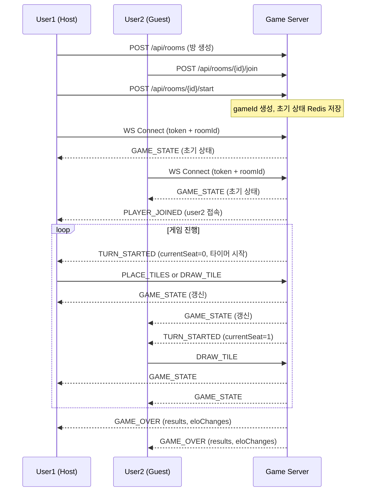

# WebSocket 통합 테스트 계획 (WS Integration Test Plan)

**작성**: 2026-03-23
**상태**: 계획 수립 완료, 자동화 구현 예정 (Sprint 4)

---

## 1. 목적

REST API 통합 테스트(`09-integration-test-report-sprint3.md`)에서 검증하지 못한 **WebSocket 실시간 통신 흐름**을 검증한다. 특히 Human + AI 혼합 멀티플레이, 턴 동기화, 재연결 처리를 집중 테스트한다.

---

## 2. 테스트 환경

| 항목 | 값 |
|------|------|
| Game Server WS | `ws://localhost:30080/ws` |
| JWT 생성 | Python PyJWT (`pip install PyJWT`) |
| WS 클라이언트 | `websocat`, `wscat`, 또는 Go `gorilla/websocket` 클라이언트 |
| 테스트 프레임워크 | Go `testing` + 인메모리 저장소 (`MemoryGameStateRepository`) |

---

## 3. 사용자 여정 WS 흐름



---

## 4. 테스트 케이스

### TC-WS-001: WS 연결 인증
| 항목 | 내용 |
|------|------|
| 전제 | 유효한 JWT, 방이 WAITING 상태 |
| 입력 | `ws://localhost:30080/ws?roomId={roomId}&token={jwt}` |
| 기대 | 연결 수립 후 즉시 `GAME_STATE` 메시지 수신 |
| 검증 | `type: "GAME_STATE"`, `data.status: "PLAYING"` |

### TC-WS-002: 유효하지 않은 JWT
| 항목 | 내용 |
|------|------|
| 입력 | 만료된 토큰 또는 잘못된 서명 |
| 기대 | 연결 즉시 `4001 Unauthorized` 코드로 종료 |

### TC-WS-003: PLACE_TILES 유효한 수
| 항목 | 내용 |
|------|------|
| 전제 | 현재 플레이어 턴, 유효한 조합 |
| 입력 | `{"type":"PLACE_TILES","data":{"tableGroups":[{"tiles":["R1a","R2a","R3a"]}],"tilesFromRack":["R1a","R2a","R3a"]}}` |
| 기대 | 전체 플레이어에게 `GAME_STATE` 브로드캐스트, 랙에서 타일 제거 |

### TC-WS-004: PLACE_TILES 무효한 수
| 항목 | 내용 |
|------|------|
| 입력 | 같은 색 2장만 배치 (룰 위반) |
| 기대 | 요청자에게만 `INVALID_MOVE` 응답, 게임 상태 변경 없음 |

### TC-WS-005: DRAW_TILE
| 항목 | 내용 |
|------|------|
| 입력 | `{"type":"DRAW_TILE","data":{}}` |
| 기대 | 드로우 파일 1장 감소, 랙에 추가, `GAME_STATE` 브로드캐스트 |

### TC-WS-006: 타이머 만료 → 강제 드로우
| 항목 | 내용 |
|------|------|
| 전제 | `turnTimeoutSec: 3`으로 방 생성 |
| 기대 | 3초 후 현재 플레이어 자동 드로우, `GAME_STATE` 브로드캐스트 |

### TC-WS-007: 재연결 복구
| 항목 | 내용 |
|------|------|
| 동작 | WS 연결 끊은 후 재연결 |
| 기대 | 재연결 시 `GAME_STATE`로 현재 상태 동기화 |

### TC-WS-008: 타이머 Redis 복구
| 항목 | 내용 |
|------|------|
| 동작 | 타이머 진행 중 game-server Pod 재시작 |
| 기대 | 재시작 후 클라이언트 재연결 시 잔여 시간으로 타이머 재개 (또는 즉시 만료 처리) |

### TC-WS-009: 동시 다중 접속
| 항목 | 내용 |
|------|------|
| 동작 | 4명이 동시에 같은 방에 접속 |
| 기대 | 모든 클라이언트가 동일한 `GAME_STATE` 수신 (순서 무관) |

### TC-WS-010: GAME_OVER 수신
| 항목 | 내용 |
|------|------|
| 전제 | 플레이어 중 한 명의 랙이 비어있는 상태 |
| 기대 | 모든 플레이어에게 `GAME_OVER` 브로드캐스트 (`results`, `eloChanges` 포함) |

---

## 5. 자동화 전략

### 5.1 단위 테스트 (이미 완료)
`src/game-server/internal/handler/ws_timer_test.go` — 타이머 로직 7개 PASS

### 5.2 통합 테스트 구현 방법 (Sprint 4 예정)
```bash
# websocat 사용 예시
TOKEN=$(python3 -c "import jwt,time; print(jwt.encode({'sub':'u1','email':'t@t.com','role':'user','iat':int(time.time()),'exp':int(time.time())+3600}, 'rummiarena-jwt-secret-2026', algorithm='HS256'))")

# 방 생성 → 시작 → WS 연결
ROOM_ID=$(curl -s -X POST http://localhost:30080/api/rooms \
  -H "Authorization: Bearer $TOKEN" \
  -H "Content-Type: application/json" \
  -d '{"name":"ws-test","maxPlayers":2,"turnTimeoutSec":30}' | python3 -c "import sys,json; print(json.load(sys.stdin)['data']['roomId'])")

websocat "ws://localhost:30080/ws?roomId=$ROOM_ID&token=$TOKEN"
```

### 5.3 Go WS 클라이언트 테스트 (권장)
`scripts/ws-integration-test.go` 구현 예정:
- `gorilla/websocket` 클라이언트 2개 동시 연결
- TC-WS-001~010 순차 실행
- 결과 JSON 출력

---

## 6. 우선순위

| 우선순위 | TC | 이유 |
|---------|-----|------|
| P0 | TC-WS-003, TC-WS-005 | 핵심 게임 흐름 |
| P1 | TC-WS-001, TC-WS-002, TC-WS-006 | 인증 + 타이머 |
| P2 | TC-WS-007, TC-WS-008 | 재연결 복구 (Redis 구현 완료) |
| P3 | TC-WS-009, TC-WS-010 | 멀티플레이 엣지 케이스 |

---

## 7. 관련 파일

| 파일 | 설명 |
|------|------|
| `src/game-server/internal/handler/ws_handler.go` | WS 핸들러 |
| `src/game-server/internal/handler/ws_timer_test.go` | 타이머 단위 테스트 (7개 PASS) |
| `src/game-server/internal/repository/memory_game_state_repo.go` | 인메모리 저장소 |
| `docs/02-design/10-websocket-protocol.md` | WS 프로토콜 설계 |
