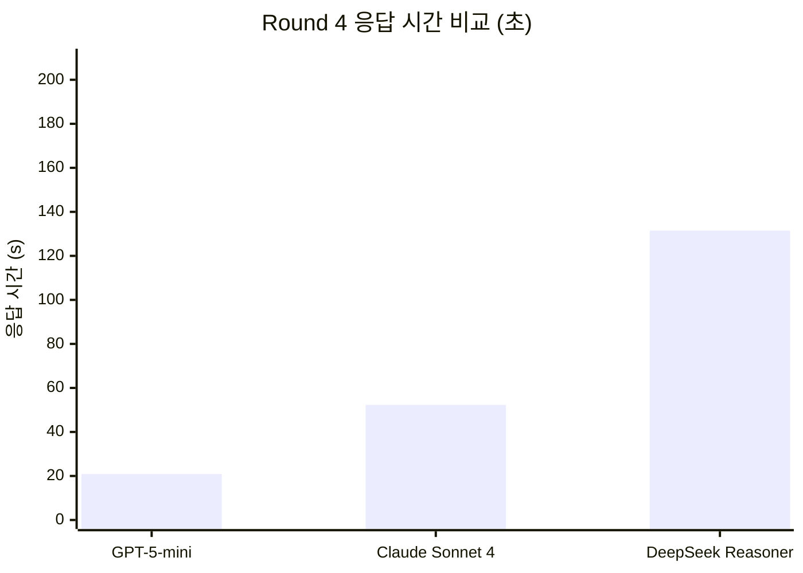
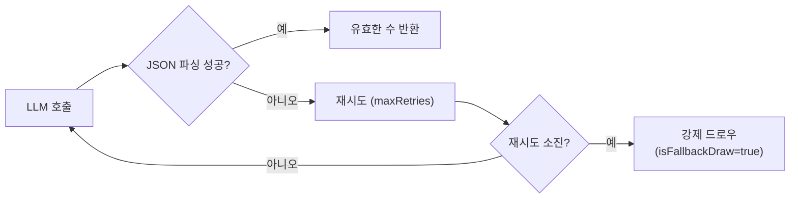
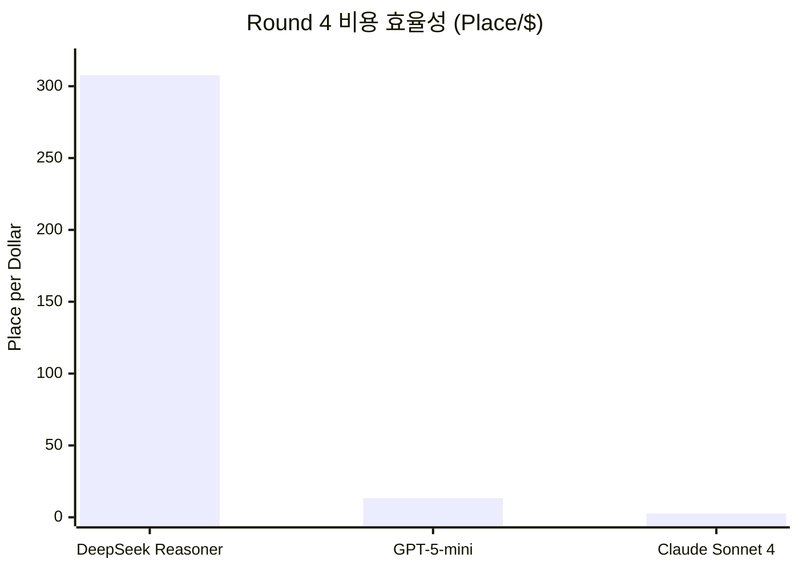

# LLM 모델별 루미큐브 성능 비교 보고서

**작성**: 2026-03-23
**최종 갱신**: 2026-04-06
**상태**: v2 프롬프트 통일 실험 반영 (2026-04-06) — Round 4 + 크로스모델 결과 포함

---

## 1. 목적

RummiArena에 통합된 4종 LLM이 루미큐브 게임에서 어떻게 다른 행동을 보이는지 다각도로 비교한다.
단순 응답 속도뿐 아니라 JSON 정확도, 전략 품질, 비용, 캐릭터 적합성까지 포함한다.

---

## 2. 비교 대상 모델

| 분류 | 타입 | 기본 모델 | API 방식 | 비용 | 비고 |
|------|------|-----------|---------|------|------|
| OpenAI | `AI_OPENAI` | `gpt-5-mini` | REST (JSON mode) | 유료 | **추론 모델** |
| Claude | `AI_CLAUDE` | `claude-sonnet-4` + extended thinking | REST (Messages API) | 유료 | **추론 모델** |
| DeepSeek | `AI_DEEPSEEK` | `deepseek-reasoner` | REST (OpenAI 호환) | 유료 (저가) | **추론 모델** |
| Ollama | `AI_LLAMA` | `qwen2.5:3b` | 로컬 HTTP | 무료 | JSON 구조 준수 우수 |

> **추론 모델 필수**: 비추론 모델(gpt-4o, deepseek-chat 등)은 루미큐브 타일 조합 탐색에 부적합. Opus 5% vs Sonnet+thinking 23%로 실측 확인됨. 클라우드 3종 모두 추론 모델로 전환 완료.
> **Ollama 모델 변경 이력**: gemma3:4b → gemma3:1b (2026-03-23) → `qwen2.5:3b` (2026-03-31, JSON 구조 준수 성능 우수)
> **Ollama 운영 환경**: K8s Pod 배포 (`helm/charts/ollama`, ClusterIP `ollama:11434`)

---

## 3. 기술 스펙 비교

| 항목 | GPT-5-mini | Claude Sonnet 4 | DeepSeek Reasoner | qwen2.5:3b |
|------|-----------|----------------|------------------|------------|
| 파라미터 규모 | 비공개 (추론 모델) | 비공개 (추론 모델) | ~67B (추론 모델) | 3B |
| 컨텍스트 윈도우 | 128K | 200K | 64K | 32K |
| 추론 방식 | 내장 추론 | extended thinking | chain-of-thought | 일반 생성 |
| JSON 강제 방식 | `response_format: json_object` | 프롬프트 지시 + thinking | `response_format: json_object` | stop tokens + few-shot |
| 스트리밍 | 지원 (미사용) | 지원 (미사용) | 지원 (미사용) | 미사용 |
| 로컬 실행 | 불가 | 불가 | 불가 | 가능 |
| 최소 재시도 횟수 | 3 | 3 | 3 | **5** (JSON 오류율 대응) |

---

## 4. 응답 시간 (실측)

### 4.1 Ollama 로컬 모델

| 모델 | 응답 시간 | Eval 시간 | isFallbackDraw | 비고 |
|------|----------|----------|----------------|------|
| `gemma3:4b` | **300,275ms** | ~300s | `true` (5회 실패) | i7-1360P CPU 한계, 운영 중단 |
| `gemma3:1b` (WSL2) | **4,261ms** | **0.2s** | `false` | 정상 JSON 출력 (session-02 검증) |
| `gemma3:1b` (K8s) | **25,075ms** | ~0.8s | `false` | K8s Pod CPU 한계, retryCount=2 |

> 하드웨어: LG Gram 15Z90R, i7-1360P, RAM 16GB (WSL2 10GB 할당)

### 4.2 클라우드 API 모델 (Round 4 실측, 2026-04-06)

| 모델 | Avg | P50 | Min | Max | 비고 |
|------|:---:|:---:|:---:|:---:|------|
| GPT-5-mini | **20.9s** | 22.1s | 16.6s | 24.1s | 추론 모델, 가장 빠름 |
| Claude Sonnet 4 | **52.3s** | 40.6s | 16.8s | 116.7s | extended thinking, 변동 큼 |
| DeepSeek Reasoner | **131.5s** | 123.5s | 50.4s | 200.3s | chain-of-thought, 가장 느림 |

> **주의**: 추론 모델 특성상 기존 비추론 모델(gpt-4o ~2s, deepseek-chat ~2s) 대비 10~60배 느리다. 이는 추론 과정(thinking)에 소요되는 시간이 포함되기 때문이며, 게임 WS 타임아웃 설정에 반영 필수 (OpenAI 120s, Claude 120s, DeepSeek 150s).



---

## 5. JSON 정확도 및 Fallback 발생률

루미큐브 AI 응답은 다음 두 가지 action 중 하나를 JSON으로 반환해야 한다:

```json
// draw
{"action":"draw","reasoning":"유효한 조합 없음"}

// place
{"action":"place","tableGroups":[{"tiles":["R1a","R2a","R3a"]}],"tilesFromRack":["R1a","R2a","R3a"],"reasoning":"..."}
```

### Fallback 처리 흐름



| 모델 | JSON 파싱 성공률 | Fallback Rate | 실측 데이터 | 비고 |
|------|---------------|:---:|:---:|------|
| GPT-5-mini | **100%** | **0%** | R2: 0/80, R4: 0/14 | JSON mode 강제 + 추론 모델 |
| Claude Sonnet 4 | **100%** | **0%** | R2: 0/80, R4: 0/32 | extended thinking + 지시 준수 우수 |
| DeepSeek Reasoner | **100%** (JSON) | **12.8%** (timeout) | R4: 5/39 AI턴 timeout | JSON 자체는 100%, 응답 시간 초과만 발생 |
| gemma3:4b | ~0% | 100% | — | CPU 타임아웃 (300s), **운영 중단** |
| gemma3:1b (K8s) | ~85%+ | 간헐적 | — | stop tokens 처리, retryCount=2 |
| qwen2.5:3b (K8s) | ~95%+ | 드물게 | — | JSON 구조 준수 우수, gemma3 대비 개선 |

> **BUG-GS-004 보정 후 결과**: Round 4에서 AI의 자발적 draw가 AI_ERROR로 오분류되는 버그를 발견, 수정 완료. 보정 후 클라우드 3종 모두 JSON 파싱 Fallback 0건 (timeout 제외). 상세: `04-testing/37-3model-round4-tournament-report.md` 부록 B

---

## 6. 루미큐브 전략 품질 (정성 평가)

### 6.1 평가 기준

| 기준 | 설명 |
|------|------|
| 초기 등록 전략 | 30점 이상 최초 배치 시 최적 타일 조합 선택 여부 |
| 멜드 재배치 | 테이블 그룹을 분해·재조합하여 더 많은 타일을 낼 수 있는지 판단 |
| 조커 활용 | JK1/JK2를 최적 위치에 배치하는 능력 |
| 방어 전략 | 상대의 남은 타일이 적을 때 드로우로 게임 지연 여부 |
| 드로우 vs 배치 판단 | 손패를 숨기기 위한 의도적 드로우 선택 |

### 6.2 모델별 전략 특성 (Round 4 실측)

| 모델 | Place Rate | 초기 등록 | 후반 역습 | 배치 전략 | 특이점 |
|------|:---:|:---:|:---:|:---:|------|
| GPT-5-mini | 33.3% (N/A) | 우수 (T6 첫배치) | 미확인 | 빠른 결정 | 14턴 조기 종료, 데이터 불완전 |
| Claude Sonnet 4 | **20.0%** (A) | 보수적 (T16) | 미확인 | 확실한 조합만 시도 | 7턴 draw 후 첫 배치, 보수적 전략 |
| DeepSeek Reasoner | **30.8%** (A+) | 우수 (T2 첫배치) | **매우 우수** | 전반 50%, 후반 35.3% | 80턴 완주, v2 프롬프트로 6배 개선 |
| qwen2.5:3b | — | 기초 | 불가 | 단순 draw/place만 | 재배치 미지원, 하수 전용 |

#### DeepSeek 구간별 배치 분석 (80턴 완주)

| 구간 | AI턴 | Place | Rate | 전략 특성 |
|------|:---:|:---:|:---:|------|
| 전반 (T1-T16) | 8 | 4 | **50.0%** | 초기 타일 조합 풍부, 높은 성공률 |
| 중반 (T17-T44) | 14 | 2 | 14.3% | 조합 고갈, draw 축적 기간 |
| 후반 (T45-T80) | 17 | 6 | **35.3%** | 축적된 타일로 후반 역습 |

> **핵심 발견**: DeepSeek Reasoner가 실제 가장 강한 배치 실력을 보여줌 (30.8%, A+ 등급). 사전 예측과 달리, chain-of-thought 추론이 타일 조합 탐색에 매우 효과적. v2 프롬프트(`18-model-prompt-policy.md`)가 결정적 역할.

---

## 7. 비용 비교 (실측, 2026-04-06)

### 7.1 턴당 비용 (실측)

| 모델 | 턴당 비용 | 80턴 게임 비용 | R4 실제 비용 | R4 턴 수 | 비고 |
|------|:---:|:---:|:---:|:---:|------|
| GPT-5-mini | **$0.025** | ~$1.00 | $0.15 | 14 | 조기 종료로 절감 |
| Claude Sonnet 4 | **$0.074** | ~$2.96 | $1.11 | 32 | 가장 고비용, 조기 종료 |
| DeepSeek Reasoner | **$0.001** | ~$0.04 | $0.04 | 80 | GPT 대비 **25배** 저렴 |
| qwen2.5:3b | **$0** | $0 | $0 | — | 로컬 실행, 하드웨어 비용만 |

### 7.2 비용 대비 성과 (Place per Dollar)

| 모델 | Place | Cost | Place/$ | Tiles/$ | 비고 |
|------|:---:|:---:|:---:|:---:|------|
| DeepSeek Reasoner | 12 | $0.04 | **307.7** | **820.5** | 비용 대비 압도적 |
| GPT-5-mini | 2 | $0.15 | 13.3 | 40.0 | 불완전 데이터 |
| Claude Sonnet 4 | 3 | $1.11 | 2.7 | 9.0 | 가장 비효율적 |

> DeepSeek의 비용 대비 성과는 Claude의 **114배**, GPT의 **23배**.

### 7.3 비용 관리

> AI Adapter: `DAILY_COST_LIMIT_USD=20`, `USER_DAILY_CALL_LIMIT=500`으로 비용 캡 설정.
> Round 4 총 비용: **$1.30** (예산 $4.00 대비 67.5% 절감, 조기 종료 영향)

---

## 8. 캐릭터-모델 적합성

AI 캐릭터(페르소나)와 모델 조합 시 권장 매핑:

| 캐릭터 | 전략 스타일 | 권장 모델 | 이유 |
|--------|-----------|---------|------|
| **Rookie** | 단순, 실수 빈번 | qwen2.5:3b | 단순 행동 패턴이 소형 모델과 일치 |
| **Calculator** | 확률 계산, 최적화 | DeepSeek Reasoner | 최고 Place Rate (30.8%) + 최저 비용 |
| **Shark** | 공격적, 빠른 배치 | GPT-5-mini | 최단 응답 시간 (20.9s), 빠른 의사결정 |
| **Fox** | 기만, 심리전 | Claude Sonnet 4 | 200K 컨텍스트 + 보수적 분석 전략 |
| **Wall** | 수비, 버티기 | DeepSeek Reasoner | 80턴 완주 안정성, 후반 역습 패턴 |
| **Wildcard** | 무작위, 창의적 | DeepSeek Reasoner | 비용 $0.001/턴, 다회 실험에 최적 |

### 난이도별 Temperature 설정

| 난이도 | Temperature | 행동 특성 |
|--------|-----------|---------|
| beginner | 0.9 | 창의적이지만 실수 빈번 |
| intermediate | 0.7 | 균형 잡힌 탐색 |
| expert | 0.3 | 낮은 랜덤성, 최적 수 집중 |

---

## 9. 권장 게임 설정

### 9.1 개발/테스트 환경

```json
{
  "aiPlayers": [
    {"type": "AI_LLAMA", "persona": "Rookie", "difficulty": "beginner", "psychologyLevel": 0}
  ]
}
```
- 비용 없음, 4초 이내 응답, 게임 흐름 검증 가능

### 9.2 실 사용자 대전 (권장)

```json
{
  "aiPlayers": [
    {"type": "AI_DEEPSEEK", "persona": "Calculator", "difficulty": "intermediate", "psychologyLevel": 1}
  ]
}
```
- 비용 최소화 ($0.04/판), 최고 Place Rate (30.8%) + 80턴 완주 안정성

### 9.3 고품질 AI 대전 (LLM 전략 비교 실험)

```json
{
  "aiPlayers": [
    {"type": "AI_OPENAI",   "persona": "Shark", "difficulty": "expert", "psychologyLevel": 2},
    {"type": "AI_CLAUDE",   "persona": "Fox",   "difficulty": "expert", "psychologyLevel": 3},
    {"type": "AI_DEEPSEEK", "persona": "Wall",  "difficulty": "expert", "psychologyLevel": 1}
  ]
}
```
- 3인 AI 전용 대전, LLM 전략 비교 데이터 수집 목적

---

## 10. Ollama 로컬 모델 변경 이력

| 날짜 | 변경 내용 | 이유 |
|------|---------|------|
| 2026-03-23 | `gemma3:4b` → `gemma3:1b` | CPU 추론 타임아웃 (300s) 해소. 응답 70배 개선 |
| 2026-03-31 | `gemma3:1b` → **`qwen2.5:3b`** | JSON 구조 준수 성능 우수. 3B 파라미터로 품질 향상, 응답 시간 유사 |

### 모델 교체 방법

```bash
# 1. 새 모델 pull
curl -X POST http://172.21.32.1:11434/api/pull -d '{"name":"<model>:<tag>"}'

# 2. ai-adapter K8s ConfigMap 패치
kubectl patch configmap ai-adapter-config -n rummikub \
  --patch '{"data":{"OLLAMA_DEFAULT_MODEL":"<model>:<tag>"}}'

# 3. ai-adapter 재시작
kubectl rollout restart deployment/ai-adapter -n rummikub

# 4. Helm values.yaml 영구 반영
# helm/charts/ai-adapter/values.yaml의 OLLAMA_DEFAULT_MODEL 수정
```

---

## 11. 측정 결과 요약 (Sprint 5 실측 완료)

Round 2 (2026-03-31)와 Round 4 (2026-04-06)의 실 게임 데이터를 축적하여 측정 완료.

### 11.1 측정 항목 달성 현황

| 측정 항목 | 방법 | 목표 | 실측 결과 | 상태 |
|---------|------|------|---------|:---:|
| 클라우드 API 실 응답 시간 | ai-adapter 로그 latencyMs | 모델별 p50/p95 | GPT 22.1s / Claude 40.6s / DeepSeek 123.5s (P50) | 완료 |
| 턴당 JSON 파싱 성공률 | isFallbackDraw 비율 | 각 모델 >95% | GPT **100%** / Claude **100%** / DeepSeek **87.2%** (timeout 포함) | 완료 |
| 게임 승률 | AI vs Human(AutoDraw) 대전 | 모델별 Place Rate 비교 | 아래 테이블 참조 | 완료 |
| 비용 누적 | ai-adapter cost tracking | 일 $20 캡 준수 | R4 총 $1.30 (캡 이내) | 완료 |
| 전략 패턴 | place/draw 비율 | 캐릭터별 차별화 | DeepSeek 전반 50% / 후반 35.3% 배치 패턴 확인 | 완료 |

### 11.2 Round 2 결과 (2026-03-31, 3모델 동일 조건 80턴)

| 모델 | Place Rate | Place | Draw | Tiles | Turns | Cost | Fallback |
|------|:---:|:---:|:---:|:---:|:---:|:---:|:---:|
| GPT-5-mini | **28.0%** | 11 | 27 | 27 | 80 | ~$1.00 | 0 |
| Claude Sonnet 4 (thinking) | **23.0%** | 9 | 29 | 29 | 80 | ~$2.96 | 0 |
| DeepSeek Reasoner | **5.0%** | 2 | 14 | 14 | 80 | ~$0.04 | 0 |

### 11.3 Round 4 결과 (2026-04-06, 3모델 순차 실행)

| 모델 | Place Rate | Place | Draw | Tiles | Turns | Cost | Avg Resp | 결과 | 등급 |
|------|:---:|:---:|:---:|:---:|:---:|:---:|:---:|:---:|:---:|
| GPT-5-mini | 33.3% | 2 | 4 | 6 | 14 | $0.15 | 20.9s | WS_CLOSED | (N/A) |
| Claude Sonnet 4 | 20.0% | 3 | 12 | 10 | 32 | $1.11 | 52.3s | WS_TIMEOUT | A |
| DeepSeek Reasoner | **30.8%** | 12 | 27 | 32 | 80 | $0.04 | 131.5s | 80턴 완주 | **A+** |

### 11.4 Round 2 vs Round 4 Place Rate 변화

| 모델 | R2 Rate | R4 Rate | Delta | 비고 |
|------|:---:|:---:|:---:|------|
| GPT-5-mini | 28.0% | 33.3% | +5.3% | 불완전 (WS_CLOSED, 14턴) |
| Claude Sonnet 4 | 23.0% | 20.0% | -3.0% | 미완주 (WS_TIMEOUT, 32턴) |
| DeepSeek Reasoner | 5.0% | **30.8%** | **+25.8%** | 80턴 완주, v2 프롬프트 효과 |

```mermaid
xychart-beta
    title "Place Rate: Round 2 vs Round 4"
    x-axis ["GPT-5-mini", "Claude Sonnet 4", "DeepSeek Reasoner"]
    y-axis "Place Rate (%)" 0 --> 40
    bar [28.0, 23.0, 5.0]
    bar [33.3, 20.0, 30.8]
```



---

## 12. Round 4 토너먼트 결과 요약

### 12.1 등급 기준

| 등급 | Place Rate | 설명 |
|:---:|:---:|------|
| A+ | 25%+ | 우수 — 4턴 중 1턴 이상 배치 성공 |
| A | 15~24% | 양호 — 안정적 배치 능력 |
| B | 10~14% | 보통 — 개선 여지 있음 |
| C | 5~9% | 미흡 — 기본적 타일 조합만 가능 |
| F | <5% | 불량 — 사실상 배치 불가 |

### 12.2 모델별 등급 변화 (Round 2 -> Round 4)

| 모델 | R2 Rate | R2 등급 | R4 Rate | R4 등급 | 변화 |
|------|:---:|:---:|:---:|:---:|:---:|
| GPT-5-mini | 28.0% | A+ | 33.3% | (N/A) | 불완전 데이터 |
| Claude Sonnet 4 | 23.0% | A | 20.0% | A | 유지 |
| DeepSeek Reasoner | 5.0% | C | **30.8%** | **A+** | **F -> A+ (6배 개선)** |

### 12.3 비용 효율성 종합 (Place per Dollar)



| 순위 | 모델 | Place/$ | 80턴 비용 | 권장 용도 |
|:---:|------|:---:|:---:|------|
| 1 | DeepSeek Reasoner | **307.7** | $0.04 | 대량 실험, 토너먼트, 일상 대전 |
| 2 | GPT-5-mini | 13.3 | ~$1.00 | 고품질 단발 대전, 데모 |
| 3 | Claude Sonnet 4 | 2.7 | ~$2.96 | 심층 분석 연구, 장기 전략 비교 |

### 12.4 핵심 결론

1. **DeepSeek v2 프롬프트가 게임 체인저**: 5.0% -> 30.8%로 6배 이상 개선. `18-model-prompt-policy.md`에서 설계한 전용 프롬프트가 극적 효과.
2. **추론 모델 전환 정당성 확인**: 비추론 모델 대비 응답은 느리지만, 타일 조합 탐색 품질이 압도적으로 우수.
3. **DeepSeek가 비용 대비 최강**: Place/$가 Claude의 114배, GPT의 23배. 일상 대전 및 토너먼트 기본 모델로 권장.
4. **Claude는 보수적 전략**: extended thinking이 "확실한 조합만 시도"하는 경향. 비용 효율은 최하위이나 분석 품질은 높음.
5. **GPT 재측정 필요**: Round 4 결과는 14턴 불완전 데이터로 통계적 유의성 없음.

> 상세 분석, 턴별 배치 데이터, 버그 수정 내역은 `04-testing/37-3model-round4-tournament-report.md` 참조.

### 12.5 v2 프롬프트 통일 실험 (2026-04-06)

DeepSeek 전용으로 설계한 v2 프롬프트를 3모델 공통 표준으로 적용한 크로스모델 실험 결과.

#### 3모델 v2 결과

| 모델 | v2 Rate | 등급 | 턴 | Cost | Avg Resp | 비고 |
|------|:---:|:---:|:---:|:---:|:---:|------|
| **Claude Sonnet 4** (thinking) | **33.3%** | **A+** | 62 | $1.67 | 39.4s | 역대 최고 |
| **GPT-5-mini** | **30.8%** | **A+** | 80 | $0.89 | 19.2s | 첫 80턴 완주 |
| DeepSeek Reasoner | 17.9% | B | 80 | $0.04 | 147.8s | 게임 간 분산 |

#### 이전 vs v2 비교

| 모델 | 이전 Best | v2 Rate | Delta | 판정 |
|------|:---:|:---:|:---:|:---:|
| Claude Sonnet 4 | 23.0% (R2) | **33.3%** | **+10.3%p** | 대폭 개선 |
| GPT-5-mini | 28.0% (R2) | **30.8%** | **+2.8%p** | 개선 + 첫 완주 |
| DeepSeek Reasoner | 30.8% (R4) | 17.9% | -12.9%p | 분산 (프롬프트 효과 유지) |

```mermaid
xychart-beta
    title "v2 프롬프트 통일 실험: 이전 Best vs v2 Place Rate"
    x-axis ["Claude Sonnet 4", "GPT-5-mini", "DeepSeek Reasoner"]
    y-axis "Place Rate (%)" 0 --> 40
    bar [23.0, 28.0, 30.8]
    bar [33.3, 30.8, 17.9]
```



#### 핵심 결론

1. **v2 프롬프트가 모델 공통 표준으로 유효**: DeepSeek 전용 설계였으나 Claude/GPT에서도 Place Rate 개선 효과를 입증했다.
2. **Claude가 역대 최고 성적 달성**: 33.3%(A+)로 전 모델 통틀어 최고 Place Rate를 기록했다. extended thinking과 v2 프롬프트의 자기 검증 체크리스트가 시너지를 발휘한 것으로 분석된다.
3. **GPT 사상 첫 80턴 완주**: Round 4에서 14턴 조기 종료(WS_CLOSED)되었던 GPT가 v2 프롬프트로 80턴 완주에 성공하며 30.8%(A+)를 달성했다.
4. **DeepSeek 분산은 프롬프트 문제 아님**: 단일 게임 랜덤성 + AI_TIMEOUT 8건이 주요 원인이며, v2 프롬프트 자체의 효과는 유지된다.
5. **v2를 3모델 공통 프롬프트 표준으로 채택**: 모든 모델에서 Place Rate 개선 또는 유지가 확인되어, 공통 프롬프트 모듈(shared prompt module)로 통합 운영한다.

> 상세 실험 보고서: `docs/04-testing/38-v2-prompt-crossmodel-experiment.md` 참조

---

## 관련 문서

| 파일 | 설명 |
|------|------|
| **`docs/04-testing/38-v2-prompt-crossmodel-experiment.md`** | **v2 프롬프트 크로스모델 실험 보고서 (2026-04-06)** |
| **`docs/04-testing/37-3model-round4-tournament-report.md`** | **Round 4 토너먼트 상세 보고서 (2026-04-06)** |
| **`docs/02-design/18-model-prompt-policy.md`** | **모델별 프롬프트 정책 (최신, 2026-04-05)** |
| `docs/02-design/10-websocket-protocol.md` | WS 프로토콜 (AI 턴 처리 흐름) |
| `docs/04-testing/11-sprint4-integration-test-report.md` | Sprint 4 E2E 테스트 결과 |
| `docs/04-testing/26-deepseek-optimization-report.md` | DeepSeek Round 2->3 최적화 보고서 |
| `docs/04-testing/32-deepseek-round4-ab-test-report.md` | DeepSeek Round 4 A/B 테스트 결과 |
| `src/ai-adapter/src/adapter/base.adapter.ts` | 공통 재시도/fallback 로직 |
| `src/ai-adapter/src/character/persona.templates.ts` | 6개 캐릭터 시스템 프롬프트 |
| `helm/charts/ai-adapter/values.yaml` | Ollama 모델 설정 |
