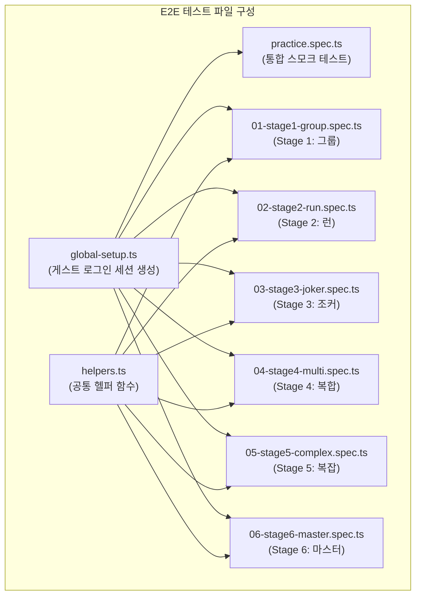

# 14. 연습 모드 E2E 테스트 가이드

> 대상 파일: `src/frontend/e2e/practice.spec.ts` 및 `e2e/01~06-stage*.spec.ts`
> 실행 환경: Playwright + Chromium, Next.js K8s (localhost:30000)

---

## 1. 테스트 구조 개요



**테스트 수**: 전체 44개 (practice.spec.ts 14개 + 01~06 spec 30개)

---

## 2. 실행 방법

### 사전 조건

- K8s 파드 실행 중: `kubectl get pods -n rummikub` → 전체 Running 확인
- frontend 접근 가능: `curl -s http://localhost:30000/` → 200 OK

### 전체 실행

```bash
cd src/frontend
BASE_URL=http://localhost:30000 npx playwright test --reporter=list
```

### 특정 파일만 실행

```bash
# practice.spec.ts만
BASE_URL=http://localhost:30000 npx playwright test e2e/practice.spec.ts

# Stage 1~3만 (빠른 검증)
BASE_URL=http://localhost:30000 npx playwright test e2e/01-stage1 e2e/02-stage2 e2e/03-stage3

# 특정 테스트만 (TC ID 기준)
BASE_URL=http://localhost:30000 npx playwright test --grep "TC-P-101"
```

### 결과 확인

```bash
# HTML 리포트
npx playwright show-report

# 실패 스크린샷 위치
ls src/frontend/test-results/
```

---

## 3. 테스트 케이스 목록

### practice.spec.ts (스모크 테스트)

| describe | 테스트 | 목적 | 예상 결과 |
|----------|--------|------|----------|
| Stage 1 — 그룹 만들기 | 랙에 6개 타일 초기 로드 | 타일 렌더링 확인 | PASS |
| | 초기화 버튼 동작 | 리셋 기능 | PASS |
| | 확정 버튼 클리어 전 비활성화 | UX 가드 | PASS |
| | 3개 타일 보드 드래그 → 그룹 생성 | dnd-kit 드래그 | PASS |
| | 유효 그룹 → 클리어 뱃지 | 유효성 검사 | PASS |
| | 클리어 후 확정 버튼 활성화 | 버튼 상태 전환 | PASS |
| Stage 2 — 런 만들기 | 랙 타일 로드 | 타일 렌더링 | PASS |
| | R4+R5+R6 → 클리어 뱃지 | 런 유효성 | PASS |
| | 런 그룹 기본 타입 확인 | 타입 초기값 | PASS |
| Stage 3 — 조커 활용 | 초기화 버튼 동작 | 리셋 기능 | PASS |
| 네비게이션 | Stage 1/2/6 페이지 로드 | 라우팅 | PASS |
| | 잘못된 스테이지 리디렉트 | 라우팅 가드 | K8s 재빌드 후 |

### 01-stage1-group.spec.ts

| TC ID | 테스트명 | 입력 | 기대 결과 |
|-------|---------|------|----------|
| TC-P-101 | R7+B7+Y7 (3색) → 클리어 가능 | 3색 동일 숫자 | ✅ 클리어 뱃지 |
| TC-P-102 | R7+B7 (2개) → 클리어 불가 | 2개 미만 | ✅ 버튼 비활성 |
| TC-P-103 | R7+B7+R3 (숫자 불일치) → 무효 | 다른 숫자 혼합 | ✅ 에러 표시 |
| TC-P-104 | R7+B7+Y7+K7 (4색) → 클리어 | 4색 완전 그룹 | ✅ 클리어 뱃지 |
| TC-G-007 | 무효 배치 후 초기화 → 재배치 → 클리어 | 초기화 복구 | ✅ 정상 |

### 02-stage2-run.spec.ts

| TC ID | 테스트명 | 입력 | 기대 결과 |
|-------|---------|------|----------|
| TC-P-201 | R4+R5+R6 (연속 3개) → 클리어 | 3개 런 | ✅ 클리어 뱃지 |
| TC-P-202 | R4+R5+R6+R7 (4개) → 클리어 | 4개 런 | ✅ 클리어 뱃지 |
| TC-P-203 | R4+R5+R7 (R6 누락) → 무효 | 연속 아님 | ✅ 에러 표시 |
| TC-P-204 | R4+R5+B3 (색 혼합) → 무효 | 색상 불일치 | ✅ 에러 표시 |
| TC-R-002 | R4+R5+R6+R7+K8 (색 혼합) 감지 | K8 이질 | ✅ 버튼 비활성 |
| — | 초기화 후 재배치 → 클리어 | 복구 플로우 | ✅ 정상 |

### 03-stage3-joker.spec.ts

| TC ID | 테스트명 | 입력 | 기대 결과 |
|-------|---------|------|----------|
| TC-P-301/TC-J-001 | JK1+R5+R6 (조커 앞/뒤) → 클리어 | 조커 런 | ✅ 클리어 뱃지 |
| TC-P-302/TC-J-002 | JK1+B7+Y7+K7 (조커 그룹) → 클리어 | 조커 그룹 | ✅ 클리어 뱃지 |
| TC-P-303/TC-J-003 | JK1만 → 클리어 불가 | 조커 단독 | ✅ 버튼 비활성 |
| TC-P-304 | R5+R6만 (조커 없음) → 불가 | goal=joker 조건 | ✅ 버튼 비활성 |
| TC-J-004 | 조커 단독 → 버튼 비활성 | 에러 없이 차단 | ✅ 버튼 비활성 |
| TC-R-009 변형 | R5+JK1+R6 (조커 중간) → 클리어 | 중간 위치 조커 | ✅ 클리어 뱃지 |
| — | 초기화 후 그룹 세트로 클리어 | 복구 플로우 | ✅ 정상 |

---

## 4. 공통 헬퍼 (e2e/helpers.ts)

```typescript
// 스테이지 이동 + 튜토리얼 dismiss + dnd-kit 준비 대기
goToStage(page, stageNum)

// 단일 타일을 보드에 드래그 (aria-label 기반)
dragTileToBoard(page, "R7a")

// 여러 타일을 순서대로 드래그
dragTilesToBoard(page, ["R7a", "B7a", "Y7a"])

// "+ 새 그룹" 버튼 클릭
clickNewGroup(page)

// 초기화 버튼 클릭
resetBoard(page)
```

### dnd-kit 드래그 동작 원리

```
1. pointerdown (타일 중심)
2. move +3px → +9px (activation constraint 8px 초과 유도)
3. move → 보드 중심 (steps: 20)
4. wait 60ms (드래그 오버 인식)
5. pointerup
6. wait 150ms (상태 업데이트 반영)
```

**주의**: HTML5 dragstart/dragend가 아닌 PointerEvent 시뮬레이션. `page.dragAndDrop()` 사용 금지.

---

## 5. 새 테스트 작성 방법

```typescript
import { test, expect } from "@playwright/test";
import { goToStage, dragTilesToBoard } from "./helpers";

test.describe("Stage N — 새 스테이지", () => {
  test.beforeEach(async ({ page }) => {
    await goToStage(page, N);
  });

  test("TC-P-N01: 유효 배치 → 클리어", async ({ page }) => {
    // helpers.ts의 dragTilesToBoard 사용 (waitFor 내장)
    await dragTilesToBoard(page, ["R7a", "B7a", "Y7a"]);

    // 클리어 뱃지 확인 (span[role="status"] 선택자 사용)
    await expect(
      page.locator('span[role="status"]:has-text("클리어 가능!")')
    ).toBeVisible({ timeout: 5000 });

    // 확정 버튼 활성화 확인
    await expect(page.getByLabel("스테이지 클리어 확정")).not.toBeDisabled();
  });
});
```

### 타일 코드 규칙

| 표현 | 의미 |
|------|------|
| `R7a` | 빨강 7 (세트 a) |
| `B7a` | 파랑 7 (세트 a) |
| `Y7a` | 노랑 7 (세트 a) |
| `K7a` | 검정 7 (세트 a) |
| `JK1` | 조커 1번 |
| `JK2` | 조커 2번 |

### aria-label 패턴

| 요소 | aria-label |
|------|-----------|
| 드래그 가능 타일 | `"R7a 타일 (드래그 가능)"` |
| 게임 테이블(보드) | `"게임 테이블"` |
| 타일 랙 | `"내 타일 랙"` |
| 클리어 확정 버튼 | `"스테이지 클리어 확정"` |
| 초기화 버튼 | `"타일 배치 초기화"` |
| 새 그룹 버튼 | `"다음 드롭 시 새 그룹 생성"` |

---

## 6. 자주 발생하는 실패 패턴

### 패턴 1: 튜토리얼 모달이 클릭을 차단

```
Error: <div role="dialog"> intercepts pointer events
```

**원인**: 스테이지 진입 시 튜토리얼 오버레이가 표시된 상태에서 버튼 클릭 시도.

**해결**: `beforeEach`에서 반드시 `dismissTutorial(page)` 또는 `goToStage()` 호출.

```typescript
// ❌ 잘못된 예
test.beforeEach(async ({ page }) => {
  await page.goto("/practice/1");
  // 튜토리얼 dismiss 없음!
});

// ✅ 올바른 예
test.beforeEach(async ({ page }) => {
  await goToStage(page, 1); // dismiss 내장
});
```

### 패턴 2: dnd-kit 드래그 후 "클리어 가능!" 미표시

```
Error: Locator 'span[role="status"]:has-text("클리어 가능!")' not found
```

**원인 A**: 타일이 보드에 실제로 드롭되지 않음 (드래그 타이밍 문제).

**원인 B**: 유효하지 않은 타일 조합 (게임 규칙 위반).

**원인 C**: `clickNewGroup()`을 호출하지 않아 두 번째 그룹이 생성되지 않음 (multi goal).

**해결**:
```typescript
// 복수 그룹이 필요한 경우 반드시 clickNewGroup 호출
await dragTilesToBoard(page, ["JK1", "Y8a", "Y10a", "Y11a"]); // 1번째 그룹
await clickNewGroup(page);                                      // ← 필수
await dragTilesToBoard(page, ["R7a", "B7a", "K7a"]);            // 2번째 그룹
```

### 패턴 3: strict mode violation

```
Error: locator("text=그룹") resolved to 2 elements
```

**원인**: `text=그룹` 선택자가 heading과 button 두 곳에 매칭됨.

**해결**:
```typescript
// ❌ 느슨한 선택자
page.locator("text=그룹")

// ✅ 명시적 선택자
page.getByText("그룹").first()
page.locator('button:has-text("그룹")')
```

### 패턴 4: `[aria-label="내 타일 (6개)"]` 타임아웃

```
Error: waitForSelector('[aria-label="내 타일 (6개)"]') timeout
```

**원인**: 실제 DOM은 `aria-label="내 타일 랙"` (숫자는 `<h2 class="sr-only">` 내부).

**해결**:
```typescript
// ❌ 잘못된 선택자
await page.waitForSelector('[aria-label="내 타일 (6개)"]');

// ✅ 올바른 선택자
await page.locator('[aria-label="내 타일 랙"]').waitFor({ state: "visible" });
```

---

## 7. 환경별 실행 참고

| 환경 | BASE_URL | 비고 |
|------|----------|------|
| K8s (NodePort) | `http://localhost:30000` | 기본 환경 |
| Next.js 로컬 dev | `http://localhost:3000` | `npm run dev` 실행 시 |
| CI/CD | `http://frontend-service:3000` | GitLab CI job 내부 |

```bash
# K8s
BASE_URL=http://localhost:30000 npx playwright test

# 로컬 dev
BASE_URL=http://localhost:3000 npx playwright test

# 헤드리스 OFF (디버깅)
BASE_URL=http://localhost:30000 npx playwright test --headed --slowmo=500
```

---

## 8. 테스트 결과 보고서 위치

| 파일 | 내용 |
|------|------|
| `docs/04-testing/13-qa-test-scenarios.md` | QA 전체 시나리오 + 실제 결과 |
| `src/frontend/test-results/` | 실패 스크린샷 (Git 추적 대상) |
| `src/frontend/playwright-report/` | HTML 리포트 (로컬 생성, Git 제외) |
