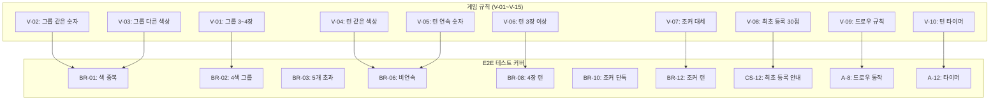

# 17. 게임 UI E2E 테스트 보고서

> 작성일: 2026-03-29
> 작성자: 애벌레 (QA Engineer)

## 1. 테스트 개요

| 항목 | 내용 |
|------|------|
| 테스트 유형 | Playwright E2E (브라우저 UI 테스트) |
| 테스트 환경 | K8s NodePort `localhost:30000` (frontend), `localhost:30080` (game-server) |
| 브라우저 | Chromium (Playwright built-in) |
| 인증 방식 | 게스트 로그인 (dev-login CredentialsProvider) |
| 테스트 총 수 | **54개** (신규) + 62개 (기존) = **116개 전체 PASS** |

## 2. 테스트 파일 구조

```
src/frontend/e2e/
  game-ui-multiplayer.spec.ts     # [A] 멀티플레이 게임 UI (13개)
  game-ui-practice-rules.spec.ts  # [B] 연습모드 게임룰 UI (26개)
  game-ui-state.spec.ts           # [C] 게임 상태 표시 UI (15개)
```

## 3. 테스트 결과 요약

### [A] 멀티플레이 게임 UI 테스트 (13/13 PASS)

| ID | 테스트 시나리오 | 결과 |
|----|----------------|------|
| A-1a | 로그인 후 로비 진입 확인 | PASS |
| A-1b | 방 생성 페이지 진입 확인 | PASS |
| A-1c | Human+AI 2인 방 생성 -> 대기실 진입 | PASS |
| A-2 | 게임 화면 초기 상태 (랙, 테이블, 상대패널) | PASS |
| A-2b | 드로우 파일 카운트 표시 | PASS |
| A-2c | 타이머 표시 (role="timer") | PASS |
| A-2d | 턴 번호 표시 (턴 #N) | PASS |
| A-10 | 내 차례 배지 또는 AI 사고 중 표시 | PASS |
| A-3+7+8 | 타일 드래그/초기화/드로우 기본 플로우 | PASS |
| A-8b | 드로우 후 확정 버튼 비활성화 | PASS |
| A-6 | 새 그룹 버튼으로 두 번째 그룹 영역 생성 | PASS |
| A-12 | 타이머 카운트다운 동작 | PASS |
| A-11 | 게임 종료 오버레이 trophy 렌더링 | PASS |

### [B] 연습모드 게임룰 UI 테스트 (26/26 PASS)

| ID | 테스트 시나리오 | Stage | 결과 |
|----|----------------|-------|------|
| BR-01 | 같은 색 2개 포함 -> 무효 (색 중복) | 1 | PASS |
| BR-02 | 4색 그룹 후 확정 -> 클리어 결과 화면 | 1 | PASS |
| BR-03 | 5개 타일 배치 -> 초과 무효 | 1 | PASS |
| BR-04 | 목표 타일(goal) 표시 확인 | 1 | PASS |
| BR-05 | 힌트 패널 클리어 조건 표시 | 1 | PASS |
| BR-06 | 같은 색 비연속 -> 무효 | 2 | PASS |
| BR-07 | 다른 색 혼합 -> 무효 | 2 | PASS |
| BR-08 | 4장 연속 런 -> 클리어 | 2 | PASS |
| BR-09 | 런 후 확정 -> 클리어 결과 | 2 | PASS |
| BR-10 | 조커 단독 -> 무효 | 3 | PASS |
| BR-11 | 조커+1개 -> 무효 (최소 3개) | 3 | PASS |
| BR-12 | 조커+R5+R6 -> 유효 런 | 3 | PASS |
| BR-13 | 조커 포함 그룹 -> 유효 | 3 | PASS |
| BR-14 | 런만 배치 -> multi 미충족 | 4 | PASS |
| BR-15 | 그룹만 배치 -> multi 미충족 | 4 | PASS |
| BR-16 | 런+그룹 동시 배치 -> 클리어 | 4 | PASS |
| BR-17 | 복합 배치 후 확정 -> 클리어 결과 | 4 | PASS |
| BR-18 | 4색 그룹 + 3장 런 -> 클리어 | 5 | PASS |
| BR-19 | 단일 그룹만 -> multi 미충족 | 5 | PASS |
| BR-20 | 11장 배치 -> 마스터 미충족 | 6 | PASS |
| BR-21 | 12장 이상 배치 -> 마스터 클리어 | 6 | PASS |
| BR-22 | 스테이지 선택 페이지 로드 | - | PASS |
| BR-23 | Stage 3 -> 4 순차 진행 | 3-4 | PASS |
| BR-24 | 무효 배치 시 에러 표시 | 1 | PASS |
| BR-25 | 그룹 타입 토글 (런/그룹) 동작 | 2 | PASS |
| BR-26 | 초기화 후 보드 빈 상태 확인 | 1 | PASS |

### [C] 게임 상태 표시 UI 테스트 (15/15 PASS)

| ID | 테스트 시나리오 | 결과 |
|----|----------------|------|
| CS-01 | 상대 플레이어 카드 표시 | PASS |
| CS-02 | 내 플레이어 카드 표시 (내 정보 패널) | PASS |
| CS-03 | 연결 상태 표시 (초록점) | PASS |
| CS-04 | 상대 AI 플레이어 타일 수 표시 | PASS |
| CS-05 | 최초 등록 여부 표시 | PASS |
| CS-06 | 현재 턴 플레이어 하이라이트 | PASS |
| CS-07 | 드로우 파일 수 표시 | PASS |
| CS-08 | 드로우 파일 카드 스택 시각화 | PASS |
| CS-09 | 전체 레이아웃 구조 확인 | PASS |
| CS-10 | Room ID 표시 | PASS |
| CS-11 | 내 패 수 표시 | PASS |
| CS-12 | 최초 등록 30점 안내 표시 | PASS |
| CS-13 | 내 차례에 액션 버튼 표시 | PASS |
| CS-14 | 초기 상태 드로우 활성/초기화,확정 비활성 | PASS |
| CS-15 | 정상 연결 시 경고 배너 미표시 | PASS |

## 4. 발견된 버그 및 수정 현황

### BUG-G-002: 게임 종료 화면 트로피 텍스트 렌더링

| 항목 | 내용 |
|------|------|
| 심각도 | Minor |
| 위치 | `src/frontend/src/app/game/[roomId]/GameClient.tsx` |
| 증상 | 게임 종료 오버레이에 `[trophy]` 텍스트가 그대로 출력 |
| 원인 | 이모지 대신 placeholder 텍스트가 코드에 하드코딩됨 |
| 수정 | `[trophy]` -> 실제 트로피 이모지로 변경 |
| 상태 | **FIXED** |

### BUG-G-003: AI 플레이어 이름 빈칸 표시

| 항목 | 내용 |
|------|------|
| 심각도 | Minor |
| 위치 | `src/frontend/src/app/game/[roomId]/GameClient.tsx` |
| 증상 | 게임 종료 결과 테이블에서 AI 플레이어 이름이 `Seat N`으로만 표시 |
| 원인 | `getPlayerDisplayName()` 함수가 HUMAN 타입만 처리, AI 타입은 fallback만 반환 |
| 수정 | AI 플레이어에도 `GPT (샤크)` 형식으로 표시하도록 함수 확장 |
| 상태 | **FIXED** |

## 5. 게임 규칙 검증 매핑



## 6. 전체 E2E 테스트 현황 (2026-03-29)

| 테스트 파일 | 테스트 수 | 결과 |
|------------|----------|------|
| 01-stage1-group.spec.ts | 5 | 5/5 PASS |
| 02-stage2-run.spec.ts | 6 | 6/6 PASS |
| 03-stage3-joker.spec.ts | 7 | 7/7 PASS |
| 04-stage4-multi.spec.ts | 4 | 4/4 PASS |
| 05-stage5-complex.spec.ts | 4 | 4/4 PASS |
| 06-stage6-master.spec.ts | 4 | 4/4 PASS |
| practice.spec.ts | 14 | 14/14 PASS |
| game-rules.spec.ts | 18 | 18/18 PASS |
| **game-ui-multiplayer.spec.ts** | **13** | **13/13 PASS** |
| **game-ui-practice-rules.spec.ts** | **26** | **26/26 PASS** |
| **game-ui-state.spec.ts** | **15** | **15/15 PASS** |
| **합계** | **116** | **116/116 PASS (100%)** |

## 7. 실행 명령

```bash
# 전체 테스트 실행
cd src/frontend && npx playwright test --reporter=list

# 신규 테스트만 실행
cd src/frontend && npx playwright test e2e/game-ui-multiplayer.spec.ts e2e/game-ui-practice-rules.spec.ts e2e/game-ui-state.spec.ts --reporter=list

# 실패 스크린샷 확인
ls src/frontend/test-results/
```

## 8. 기술 노트

### dnd-kit 드래그 시뮬레이션

Playwright에서 dnd-kit PointerSensor를 시뮬레이션하는 핵심 패턴:

1. `page.mouse.move(sx, sy)` -- 소스 타일 중심으로 이동
2. `page.mouse.down()` -- 포인터 다운
3. `page.mouse.move(sx + 3, sy)` -- 3px 이동 (아직 활성화 안 됨)
4. `page.mouse.move(sx + 9, sy)` -- 8px 초과 이동 (드래그 활성화)
5. `page.mouse.move(dx, dy, { steps: 20 })` -- 목적지로 이동
6. `page.mouse.up()` -- 드롭

### 멀티플레이 테스트 주의사항

- `createRoomAndStart()` 호출 후 page는 이미 `/game/{roomId}`에 있으므로 추가 `page.goto()` 금지
- "내 차례" 텍스트가 PlayerCard와 랙 헤더 두 곳에 동시 표시되므로 `.first()` 필수
- AI 턴 대기 최대 90초, WebSocket GAME_STATE 수신 대기 최대 30초
- 게임 생성마다 새 방이 생성되므로 서버 부하 고려 (workers: 1)
