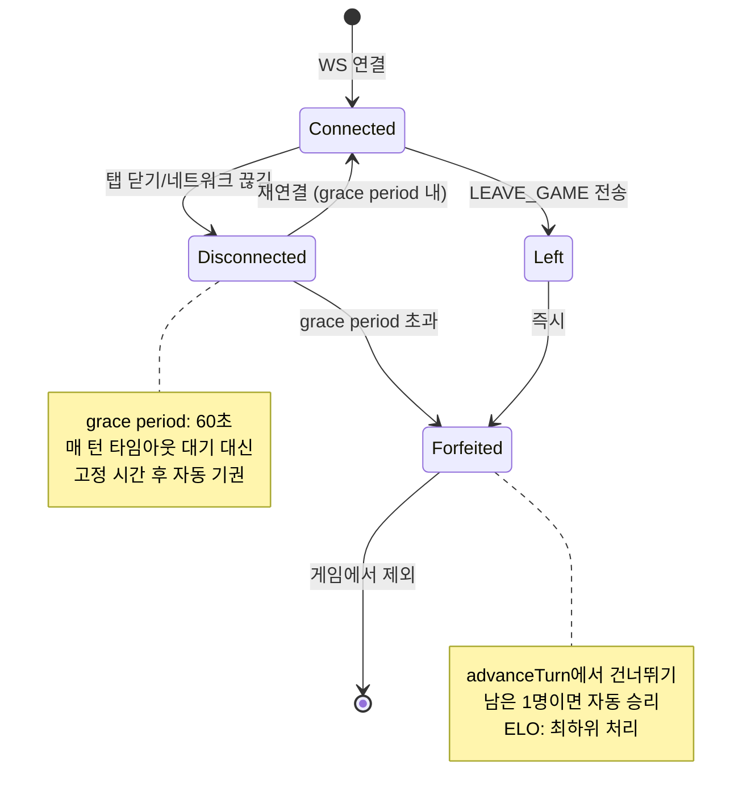

# Human 플레이어 게임 플로우 검증 보고서

**작성일**: 2026-03-30
**기준 커밋**: `d1d6c96` (main)
**검증 방식**: Go Dev (백엔드) + Frontend Dev (프론트엔드) + QA (게임 엔진) 3방향 교차 검증
**플랫폼 전제**: WEB 브라우저 (APP 아님)

---

## Executive Summary

| 구분 | 건수 | 대표 항목 |
|------|------|-----------|
| **BUG** | **12건** | seat 오판(URL 직접 접근), 상대 타일 수 미갱신, 초기 멜드 조커 점수 |
| **GAP** | **8건** | 게임 중 퇴장/기권 정책 전무, 중복 방 참가, 드로우 버튼 미비활성 |
| **RISK** | **7건** | 교착 처리 규칙 불일치, 리셋 후 상대 보드 불일치, 탭 닫기 |
| **OK** | **30건+** | 타일 풀 106장, 그룹/런 검증, 드래그앤드롭, WS 재연결 |

---

## WEB 플랫폼 특수 위험

APP이 아닌 WEB 브라우저 환경에서 발생하는 고유 위험:

| WEB 행위 | 게임 영향 | 현재 코드 대응 | 판정 |
|----------|----------|---------------|------|
| **브라우저 탭 닫기** | WS 끊김 → 빈 자리 무한 타임아웃 | PLAYER_LEAVE만 브로드캐스트, 게임 상태 미변경 | **GAP** |
| **F5 새로고침** | WS 재연결 → GAME_STATE 재수신 | 재연결 후 전체 상태 복원 | OK |
| **URL 직접 입력 `/game/xxx`** | roomStore.mySeat=0 → seat 오판 | effectiveMySeat 계산 오류 (BUG-FE-01) | **BUG** |
| **뒤로가기 버튼** | 게임 이탈, 경고 없음 | `beforeunload` 이벤트 미처리 | **GAP** |
| **다른 탭에서 새 방 생성** | 1인 다중 방 동시 참여 | JoinRoom/CreateRoom 중복 검사 없음 | **GAP** |
| **백그라운드 탭 쓰로틀링** | setTimeout 지연 → 타이머 부정확 | 서버 기준 시간으로 동기화 | OK (서버측) |
| **모바일 브라우저 슬립** | WS 자동 끊김 | 지수 백오프 5회 재시도 | OK (제한적) |

---

## 단계별 검증 결과

### 1단계: 인증 → 로비

| ID | 구분 | 항목 | 위치 | 심각도 |
|----|------|------|------|--------|
| - | OK | Google OAuth → JWT 발급 흐름 | `auth.ts` → `auth_handler.go` | - |
| - | OK | JWT 클레임 구조 일관성 (sub 필드) | `middleware/auth.go`, `ws_handler.go` | - |
| BUG-FE-02 | BUG | 로비 ELO/승률 하드코딩 (1,247 / 54%) | `LobbyClient.tsx:159-163` | 낮음 |
| GAP-FE-01 | GAP | joinRoom 실패 무시 후 대기실 이동 | `LobbyClient.tsx:236-244` | 중간 |
| RISK-BE-01 | RISK | id_token JWKS 서명 미검증 | `auth_handler.go:182-272` | 중간 |
| GAP-BE-01 | GAP | 토큰 갱신(refresh) 엔드포인트 없음 | auth 전체 | 중간 |

### 2단계: 방 생성/참가 → 대기실

| ID | 구분 | 항목 | 위치 | 심각도 |
|----|------|------|------|--------|
| - | OK | 방 생성 유효성 검증 (2~4명, 30~120초) | `room_service.go:69-74` | - |
| - | OK | AI 플레이어 자동 배치 | `room_service.go:96-125` | - |
| BUG-FE-03 | BUG | isHost 오판 (`mySeat===0` 초기값) | `WaitingRoomClient.tsx:255-257` | 낮음 |
| **GAP-GAME-01** | **GAP** | **중복 방 참가 제한 없음** | `room_service.go:JoinRoom` | **높음** |
| **GAP-GAME-02** | **GAP** | **게임 중 LeaveRoom 미차단** (PLAYING 상태) | `room_service.go:220` | **높음** |

### 3단계: 게임 시작 → 초기 상태

| ID | 구분 | 항목 | 위치 | 심각도 |
|----|------|------|------|--------|
| - | OK | 타일 풀 106장 생성 (4색 x 13 x 2 + 조커 2) | `engine/tile.go:89-112` | - |
| - | OK | 초기 패 분배 14장씩 | `engine/pool.go:67-82` | - |
| BUG-BE-02 | BUG | 초기 턴 순서 항상 seat 0 고정 | `game_service.go:142` | 낮음 |
| GAP-BE-02 | GAP | 게임 상태 비영속 (인메모리, Pod 재시작 시 소실) | `memory_repo.go` | 높음 |

### 4단계: Human 턴 진행 (핵심)

| ID | 구분 | 항목 | 위치 | 심각도 |
|----|------|------|------|--------|
| - | OK | TURN_START 브로드캐스트 + 타이머 시작 | `ws_handler.go:664-687` | - |
| - | OK | 드래그앤드롭 핸드↔보드 상태 관리 | `GameClient.tsx:handleDragEnd` | - |
| - | OK | CONFIRM → ValidateTurnConfirm (V-01~V-15) | `validator.go` | - |
| - | OK | 드로우 → 정보 비대칭 (본인만 타일 코드 수신) | `ws_handler.go:handleDrawTile` | - |
| - | OK | 리셋 → 스냅샷 복원 | `ws_handler.go:handleResetTurn` | - |
| - | OK | 타임아웃 → 자동 리셋 + 강제 드로우 | `turn_service.go:HandleTimeout` | - |
| **BUG-FE-01** | **BUG** | **effectiveMySeat 계산 오류 (URL 직접 접근 시 seat 0 고정)** | `GameClient.tsx:278,288` | **높음** |
| **BUG-FE-04** | **BUG** | **TURN_END에서 상대 tileCount/hasInitialMeld 미갱신** | `useWebSocket.ts:138-152` | **높음** |
| **BUG-FE-05** | **BUG** | **TURN_START에서 resetPending() 미호출 (타임아웃 시 잔류)** | `useWebSocket.ts:126-136` | **높음** |
| BUG-FE-06 | BUG | 기존 확정 그룹에 타일 추가(합치기) 불가 | `GameClient.tsx:326-342` | 중간 |
| BUG-BE-03 | BUG | TURN_START에 TurnNumber 항상 0 전송 | `ws_handler.go:broadcastTurnStart` | 낮음 |
| **BUG-BE-04** | **BUG** | **snapshots 맵 동시성 미보호 (data race)** | `game_service.go:90-92` | **높음** |
| RISK-BE-02 | RISK | 리셋 후 상대 보드 일시 불일치 (TILE_PLACED 이미 전송) | `ws_handler.go:handleResetTurn` | 낮음 |
| RISK-BE-03 | RISK | PLACE_TILES + CONFIRM_TURN 이중 전송 타이밍 위험 | `GameClient.tsx:470-478` | 낮음 |
| GAP-FE-02 | GAP | 드로우 파일 0일 때 드로우 버튼 비활성화 없음 | `ActionBar.tsx` | 중간 |

### 5단계: 상대방 턴 대기

| ID | 구분 | 항목 | 위치 | 심각도 |
|----|------|------|------|--------|
| - | OK | TILE_PLACED 실시간 보드 동기화 | `useWebSocket.ts:154-161` | - |
| - | OK | AI 턴 자동 처리 + 실패 시 강제 드로우 | `ws_handler.go:handleAITurn` | - |
| RISK-BE-04 | RISK | AI 타임아웃(200s)과 턴 타임아웃(30~120s) 충돌 | `ws_handler.go:747` | 낮음 |

### 6단계: 게임 종료

| ID | 구분 | 항목 | 위치 | 심각도 |
|----|------|------|------|--------|
| - | OK | 랙 소진 → 승리 (V-12) | `game_service.go:309-312` | - |
| - | OK | ELO 업데이트 (쌍대 비교 다자 ELO) | `elo_calculator.go` | - |
| - | OK | 게임 종료 오버레이 → 로비 이동 | `GameClient.tsx:508-520` | - |
| GAP-FE-03 | GAP | 게임 종료 후 로비 이동 시 gameStore 미초기화 | `GameClient.tsx:512-515` | 중간 |

### 7단계: 게임 엔진 규칙 검증

| ID | 구분 | 항목 | 위치 | 심각도 |
|----|------|------|------|--------|
| - | OK | 그룹 3~4장, 색상 중복 불가 (V-01, V-02) | `group.go` | - |
| - | OK | 런 3~13장, 연속 숫자, 동일 색상 (V-03, V-04) | `run.go` | - |
| - | OK | 조커 위치 (앞/중간/뒤), 조커만 세트 거부 | `group.go:35`, `run.go:52` | - |
| - | OK | 13→1 순환 금지 | `run.go:76` | - |
| - | OK | 랙에서 최소 1장 추가 (V-03) | `validator.go:86-89` | - |
| - | OK | 조커 교체 후 즉시 사용 의무 (V-07) | `validator.go:143-154` | - |
| **BUG-ENG-01** | **BUG** | **초기 멜드 조커 점수 30점 계산 (규칙: 대체 숫자값)** | `validator.go:130-135` | **중간** |
| RISK-ENG-01 | RISK | 드로우 파일 소진 시 즉시 교착 종료 (배치 기회 미제공) | `game_service.go:475-478` | 중간 |
| RISK-ENG-02 | RISK | 초기 멜드 시 기존 테이블 재배치 방지 불완전 (빈도만 검증) | `validator.go:118-124` | 낮음 |

### 8단계: 게임 중 퇴장/이탈 (설계 GAP)

| ID | 구분 | 항목 | 위치 | 심각도 |
|----|------|------|------|--------|
| **GAP-GAME-03** | **GAP** | **퇴장 플레이어 턴 건너뛰기 없음 (advanceTurn 무조건 순환)** | `game_service.go:556-574` | **높음** |
| **GAP-GAME-04** | **GAP** | **PlayerState에 Eliminated/Forfeited 상태 필드 없음** | `model/game.go` | **높음** |
| **GAP-GAME-05** | **GAP** | **남은 인원 1명 시 자동 승리 처리 없음** | 전체 | **높음** |
| GAP-GAME-06 | GAP | Room ↔ Redis 게임 상태 동기화 없음 | `room_service.go` ↔ `game_service.go` | 높음 |
| GAP-GAME-07 | GAP | 브라우저 뒤로가기/탭 닫기 시 `beforeunload` 경고 없음 | Frontend 전체 | 중간 |
| GAP-GAME-08 | GAP | 재연결 grace period 정책 없음 (무한 대기 vs 즉시 기권) | 전체 | 중간 |

---

## 심각도별 정리

### 높음 (즉시 수정)

| # | ID | 항목 | 담당 |
|---|-----|------|------|
| 1 | BUG-BE-04 | snapshots 맵 sync.Mutex 추가 | Go Dev |
| 2 | BUG-FE-01 | effectiveMySeat: gameStore.mySeat 우선 사용 | Frontend Dev |
| 3 | BUG-FE-04 | TURN_END에서 players 배열 tileCount/hasInitialMeld 갱신 | Frontend Dev |
| 4 | BUG-FE-05 | TURN_START에서 resetPending() 호출 추가 | Frontend Dev |
| 5 | GAP-GAME-03~06 | 게임 중 퇴장/기권 정책 설계 + 구현 | Architect + Go Dev |

### 중간 (Sprint 5)

| # | ID | 항목 | 담당 |
|---|-----|------|------|
| 6 | BUG-ENG-01 | 초기 멜드 조커 점수 → groupScore/runScore 활용 | Go Dev |
| 7 | BUG-FE-06 | 기존 확정 그룹에 타일 합치기 지원 | Frontend Dev |
| 8 | GAP-GAME-01 | JoinRoom/CreateRoom 중복 방 참가 제한 | Go Dev |
| 9 | GAP-GAME-02 | PLAYING 상태에서 LeaveRoom 차단 | Go Dev |
| 10 | GAP-FE-02 | 드로우 버튼 drawPileCount=0 비활성화 | Frontend Dev |
| 11 | GAP-FE-03 | 게임 종료 후 gameStore.reset() 호출 | Frontend Dev |
| 12 | GAP-FE-01 | joinRoom 에러 시 대기실 이동 중단 | Frontend Dev |
| 13 | GAP-GAME-07 | beforeunload 경고 추가 | Frontend Dev |
| 14 | RISK-ENG-01 | 드로우 파일 소진 후 배치 허용 교착 규칙 | Go Dev |

### 낮음 (백로그)

| # | ID | 항목 |
|---|-----|------|
| 15 | BUG-BE-02 | 초기 턴 순서 랜덤화 |
| 16 | BUG-BE-03 | TURN_START TurnNumber 채우기 |
| 17 | BUG-FE-02 | 로비 ELO/승률 실 데이터 연동 |
| 18 | BUG-FE-03 | isHost 판단 `mySeat===0` 제거 |
| 19 | RISK-BE-02 | 리셋 시 상대에게 RESET 브로드캐스트 |
| 20 | RISK-BE-03 | PLACE_TILES + CONFIRM_TURN 단일 메시지 통합 |
| 21 | RISK-ENG-02 | 초기 멜드 재배치 구조적 검증 |
| 22 | GAP-GAME-08 | 재연결 grace period 정책 |

---

## 퇴장/기권 정책 설계 제안

현재 가장 큰 설계 GAP인 "게임 중 퇴장" 처리를 위한 정책 제안:

### 필요한 구현 항목

1. `PlayerState`에 `Status` 필드 추가 (`PLAYING` / `DISCONNECTED` / `FORFEITED`)
2. `advanceTurn()`에서 `FORFEITED` 플레이어 건너뛰기
3. `handleDisconnect()`에서 grace period 타이머 시작 (60초)
4. grace period 만료 시 `FORFEITED`로 전환 + `PLAYER_LEAVE(FORFEIT)` 브로드캐스트
5. 활성 플레이어가 1명이면 자동 `finishGame()` 호출
6. `LeaveRoom()`에서 `PLAYING` 상태일 때 즉시 `FORFEITED` 처리

---

*이 보고서는 Go Dev(백엔드), Frontend Dev(프론트엔드), QA(게임 엔진) 3개 에이전트의 교차 검증 결과를 통합한 것입니다.*
