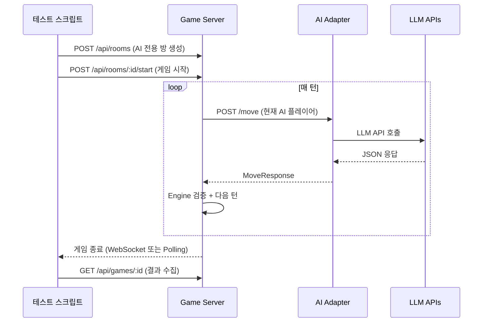
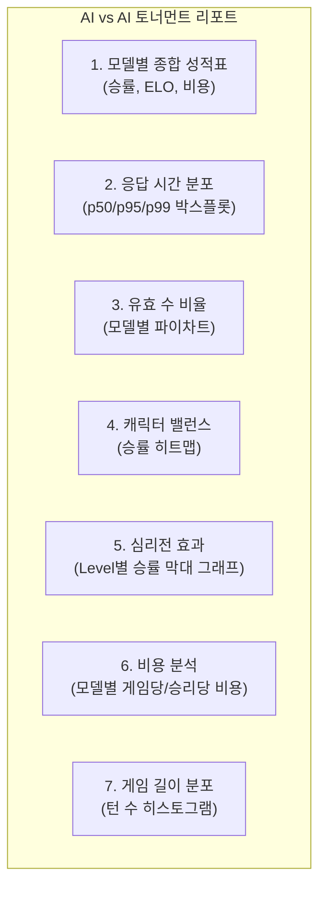
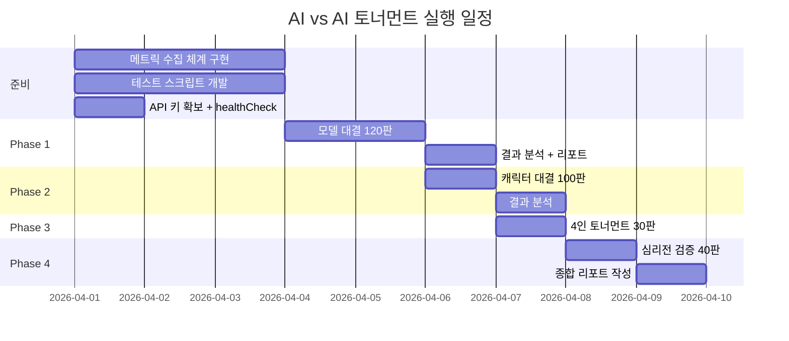

# AI vs AI 100판 토너먼트 테스트 계획

**작성일**: 2026-03-30
**상태**: 시나리오 설계 완료 -- Sprint 5 실행 대상
**관련 백로그**: BL-S4-006, BL-S4-007
**선행 조건**: BL-S4-001~004 (AI 호출 파이프라인 완성), 메트릭 수집 체계 (13-llm-metrics-schema-design.md)

---

## 1. 목적

4종 LLM 모델(OpenAI, Claude, DeepSeek, Ollama)이 루미큐브 게임에서 보이는 전략적 차이를 정량적으로 비교한다. 100판 이상의 대전 데이터를 수집하여 다음 질문에 답한다.

| 질문 | 메트릭 |
|------|--------|
| 어떤 모델이 가장 강한가? | 승률, ELO 변화 |
| 어떤 모델이 가장 안정적인가? | 유효 수 비율, Fallback 비율 |
| 어떤 모델이 가장 빠른가? | p50/p95 응답 시간 |
| 어떤 모델이 가장 비용 효율적인가? | 승리당 비용 ($/win) |
| 캐릭터-모델 조합 중 최적은? | 캐릭터별 승률 |
| 심리전이 실제로 효과가 있는가? | 심리전 레벨별 승률 차이 |
| 게임이 정상적으로 완주되는가? | 게임 완주율 |

---

## 2. 테스트 매트릭스

### 2.1 Phase 1: 모델 대결 (Model vs Model)

2인 대전으로 모델 간 직접 비교. 각 조합 20판씩 실행.

| 매치업 | Player 1 | Player 2 | 판수 | 비용 예상 |
|--------|----------|----------|------|-----------|
| M-01 | OpenAI (gpt-4o-mini) | Claude (claude-sonnet-4-20250514) | 20 | ~$2.00 |
| M-02 | OpenAI (gpt-4o-mini) | DeepSeek (deepseek-chat) | 20 | ~$0.50 |
| M-03 | OpenAI (gpt-4o-mini) | Ollama (gemma3:1b) | 20 | ~$0.30 |
| M-04 | Claude (claude-sonnet-4-20250514) | DeepSeek (deepseek-chat) | 20 | ~$1.50 |
| M-05 | Claude (claude-sonnet-4-20250514) | Ollama (gemma3:1b) | 20 | ~$1.00 |
| M-06 | DeepSeek (deepseek-chat) | Ollama (gemma3:1b) | 20 | ~$0.10 |

**공통 설정**:
- 캐릭터: Calculator (공정 비교를 위해 동일 캐릭터)
- 난이도: intermediate
- 심리전: Level 1
- maxRetries: 3 (Ollama는 자동 5로 보정)
- timeoutMs: 30000

**총 판수**: 120판 / **예상 비용**: ~$5.40

### 2.2 Phase 2: 캐릭터 대결 (Character vs Character)

동일 모델(DeepSeek, 비용 효율)로 캐릭터 간 승률 비교. 각 조합 10판.

| 매치업 | Player 1 캐릭터 | Player 2 캐릭터 | 판수 |
|--------|----------------|----------------|------|
| C-01 | Shark | Fox | 10 |
| C-02 | Shark | Wall | 10 |
| C-03 | Shark | Calculator | 10 |
| C-04 | Fox | Wall | 10 |
| C-05 | Fox | Calculator | 10 |
| C-06 | Wall | Calculator | 10 |
| C-07 | Wildcard | Shark | 10 |
| C-08 | Wildcard | Fox | 10 |
| C-09 | Rookie | Calculator | 10 |
| C-10 | Rookie | Shark | 10 |

**공통 설정**: 모델 DeepSeek, 난이도 intermediate, 심리전 Level 2

**총 판수**: 100판 / **예상 비용**: ~$0.50

### 2.3 Phase 3: 다인전 토너먼트 (4-Player FFA)

4인 AI 혼합 대전으로 실전에 가까운 환경 테스트.

| 토너먼트 | P1 | P2 | P3 | P4 | 판수 |
|----------|-----|-----|-----|-----|------|
| T-01 | OpenAI/Shark/expert | Claude/Fox/expert | DeepSeek/Calculator/expert | Ollama/Rookie/beginner | 10 |
| T-02 | OpenAI/Calculator/intermediate | Claude/Wall/intermediate | DeepSeek/Wildcard/intermediate | Ollama/Rookie/beginner | 10 |
| T-03 | DeepSeek/Shark/expert/L3 | DeepSeek/Fox/expert/L3 | DeepSeek/Wall/expert/L3 | DeepSeek/Calculator/expert/L3 | 10 |

**총 판수**: 30판 / **예상 비용**: ~$3.00

### 2.4 Phase 4: 심리전 효과 검증

동일 모델-캐릭터로 심리전 레벨만 변경하여 효과 측정.

| 매치업 | Player 1 (심리전) | Player 2 (심리전) | 판수 |
|--------|-------------------|-------------------|------|
| P-01 | DeepSeek/Fox/expert/L0 | DeepSeek/Fox/expert/L3 | 20 |
| P-02 | Claude/Shark/expert/L0 | Claude/Shark/expert/L2 | 20 |

**총 판수**: 40판 / **예상 비용**: ~$2.00

---

## 3. 성공 기준

### 3.1 필수 기준 (MUST)

| 기준 | 목표값 | 측정 방법 |
|------|--------|-----------|
| 게임 완주율 | > 95% | 정상 종료(FINISHED) / 총 시작 |
| 유효 수 비율 (클라우드 모델) | > 80% | (1 - fallback_draw_rate) |
| JSON 파싱 성공률 (클라우드 모델) | > 95% | 첫 시도 파싱 성공 / 총 시도 |
| 평균 응답 시간 (클라우드 모델) | < 5,000ms | p50 기준 |
| 평균 응답 시간 (Ollama) | < 10,000ms | p50 기준 |
| 일일 비용 | < $10 | 전체 테스트 실행 비용 |

### 3.2 권장 기준 (SHOULD)

| 기준 | 목표값 | 의미 |
|------|--------|------|
| 모델 간 승률 편차 | < 70:30 | 특정 모델이 압도적이지 않음 |
| 캐릭터 간 승률 편차 | < 65:35 | 캐릭터 밸런스 |
| 평균 게임 턴 수 | 15~40턴 | 게임이 너무 짧거나 길지 않음 |
| 교착(stalemate) 비율 | < 10% | 게임이 정상적으로 종료됨 |

### 3.3 실패 판정

| 상황 | 조치 |
|------|------|
| 게임 완주율 < 80% | 테스트 중단, 파이프라인 디버깅 |
| 특정 모델 Fallback 100% | 해당 모델 제외, API 키/설정 확인 |
| 응답 시간 p95 > 30s | 해당 모델의 timeoutMs 조정 |
| 비용 $10 초과 | 고비용 모델(GPT-4o) 판수 축소 |

---

## 4. 실행 방법

### 4.1 API 직접 호출 방식

game-server의 REST API로 AI 전용 게임을 생성하고, 턴 오케스트레이터가 자동 진행한다.



### 4.2 테스트 스크립트 구조

```
scripts/
  ai-tournament/
    run-tournament.ts       # 메인 오케스트레이터
    config.ts               # 매치업 설정 (Phase 1~4)
    game-runner.ts           # 단일 게임 실행기
    metrics-collector.ts     # 메트릭 수집 + CSV 출력
    report-generator.ts      # 결과 리포트 생성
    README.md               # 실행 가이드
```

### 4.3 실행 명령

```bash
# Phase 1: 모델 대결 (120판)
npx ts-node scripts/ai-tournament/run-tournament.ts --phase 1

# Phase 2: 캐릭터 대결 (100판)
npx ts-node scripts/ai-tournament/run-tournament.ts --phase 2

# Phase 3: 4인 토너먼트 (30판)
npx ts-node scripts/ai-tournament/run-tournament.ts --phase 3

# Phase 4: 심리전 검증 (40판)
npx ts-node scripts/ai-tournament/run-tournament.ts --phase 4

# 전체 실행
npx ts-node scripts/ai-tournament/run-tournament.ts --phase all
```

### 4.4 게임 실행기 의사 코드

```typescript
async function runSingleGame(config: GameConfig): Promise<GameResult> {
  // 1. AI 전용 방 생성
  const room = await createRoom({
    aiPlayers: config.players,
    turnTimeoutSec: 60,
  });

  // 2. 게임 시작
  await startGame(room.id);

  // 3. 게임 완료 대기 (WebSocket 또는 polling)
  const result = await waitForGameEnd(room.gameId, {
    maxWaitMs: 300_000,  // 5분 타임아웃
    pollIntervalMs: 2_000,
  });

  // 4. 메트릭 수집
  const metrics = await collectGameMetrics(room.gameId);

  return { result, metrics };
}
```

---

## 5. 결과 수집 및 분석

### 5.1 수집 데이터 형식

각 게임 종료 후 다음 데이터를 CSV로 저장한다.

**게임 결과 CSV** (`results_phase1.csv`):

| 열 | 설명 |
|----|------|
| game_id | 게임 ID |
| phase | 테스트 Phase (1~4) |
| matchup_id | 매치업 ID (M-01~M-06) |
| p1_model | Player 1 모델 |
| p1_persona | Player 1 캐릭터 |
| p2_model | Player 2 모델 |
| p2_persona | Player 2 캐릭터 |
| winner | 승자 모델 (draw이면 "draw") |
| total_turns | 총 턴 수 |
| duration_sec | 게임 소요 시간 |
| is_stalemate | 교착 종료 여부 |
| p1_final_tiles | P1 남은 타일 수 |
| p2_final_tiles | P2 남은 타일 수 |

**턴별 메트릭 CSV** (`metrics_phase1.csv`):

| 열 | 설명 |
|----|------|
| game_id | 게임 ID |
| turn | 턴 번호 |
| model | 모델 |
| action | place/draw |
| response_time_ms | 응답 시간 |
| tokens | 사용 토큰 |
| retry_count | 재시도 횟수 |
| is_fallback | 강제 드로우 여부 |
| tiles_placed | 배치 타일 수 |
| cost_usd | 비용 |

### 5.2 분석 리포트 항목



---

## 6. 환경 요구 사항

### 6.1 서비스 상태

| 서비스 | 필수 상태 | 비고 |
|--------|----------|------|
| game-server | Running | K8s 또는 로컬 |
| ai-adapter | Running | K8s 또는 로컬 |
| Redis | Running | 게임 상태 저장 |
| PostgreSQL | Running | 메트릭 영속 (선택) |
| Ollama | Running | gemma3:1b 모델 로드 상태 |

### 6.2 API 키 설정

| 환경 변수 | 필수 | 비고 |
|-----------|------|------|
| OPENAI_API_KEY | Phase 1, 3 실행 시 | gpt-4o-mini 사용 |
| CLAUDE_API_KEY | Phase 1, 3 실행 시 | claude-sonnet-4-20250514 |
| DEEPSEEK_API_KEY | Phase 1~4 | deepseek-chat |
| OLLAMA_BASE_URL | Phase 1, 3 실행 시 | http://localhost:11434 |

### 6.3 비용 캡 설정

```bash
# ai-adapter 환경 변수
DAILY_COST_LIMIT_USD=10
USER_DAILY_CALL_LIMIT=2000  # 토너먼트 스크립트용 증가
```

---

## 7. 리스크 및 완화 방안

| 리스크 | 영향 | 완화 |
|--------|------|------|
| API Rate Limit (429) | 테스트 중단 | 지수 백오프 재시도 (BL-P2-008) + 게임 간 1초 딜레이 |
| Ollama CPU 병목 | 긴 응답 시간 | WSL2 로컬 실행 (K8s Pod 대비 6배 빠름) |
| 일일 비용 초과 | 고비용 모델 차단 | Phase별 분리 실행, DeepSeek 우선 |
| 게임 교착 빈번 | 데이터 편향 | 교착 비율 10% 초과 시 규칙 조정 (BL-S4-003) |
| API 키 만료/잔액 | 특정 모델 누락 | 실행 전 healthCheck() 필수 확인 |
| 네트워크 불안정 | 타임아웃 증가 | timeoutMs 60,000ms로 상향 |

---

## 8. 일정 계획



---

## 9. 결과 리포트 양식

최종 리포트는 `docs/04-testing/22-ai-tournament-results.md`에 작성한다.

### 9.1 모델별 종합 성적표 (예시)

| 모델 | 전적 (W-L-D) | 승률 | p50 응답(ms) | p95 응답(ms) | 유효수율 | 게임당 비용 | 승리당 비용 |
|------|-------------|------|-------------|-------------|---------|-----------|-----------|
| GPT-4o-mini | 28-10-2 | 70% | 1,200 | 2,800 | 96% | $0.018 | $0.026 |
| Claude Sonnet | 24-14-2 | 60% | 2,100 | 3,500 | 98% | $0.080 | $0.133 |
| DeepSeek | 20-18-2 | 50% | 1,500 | 3,200 | 94% | $0.005 | $0.010 |
| Ollama gemma3:1b | 8-30-2 | 20% | 4,200 | 8,500 | 72% | $0.000 | $0.000 |

> 위 수치는 예시이며, 실제 토너먼트 결과로 대체한다.

---

## 관련 문서

| 파일 | 설명 |
|------|------|
| `docs/02-design/13-llm-metrics-schema-design.md` | LLM 메트릭 스키마 설계 |
| `docs/04-testing/12-llm-model-comparison.md` | LLM 모델별 성능 비교 (기존 데이터) |
| `docs/02-design/04-ai-adapter-design.md` | AI Adapter 설계 |
| `src/ai-adapter/src/adapter/base.adapter.ts` | 재시도/Fallback 로직 |
| `src/ai-adapter/src/move/move.service.ts` | 모델 선택 + 어댑터 위임 |
