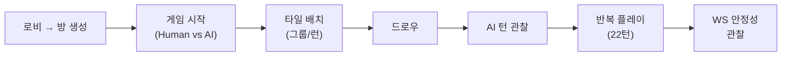
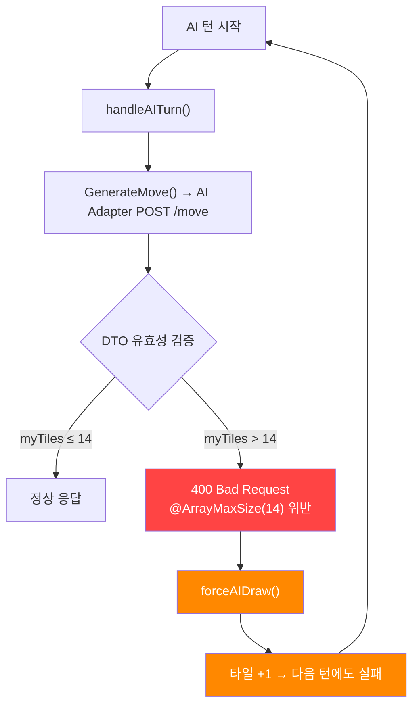

# 사용자 플레이테스트 버그 리포트

- **일시**: 2026-03-30 16:22 ~ 16:32 (약 10분)
- **테스터**: 애벌레 (Human, JinYong Bae)
- **환경**: localhost:30000, K8s rummikub namespace
- **게임 설정**: 1v1 (Human vs AI GPT-4o 고수)
- **Room ID**: aaaefe06-0753-4217-a6b8-8ac35f31ce6d
- **스크린샷**: 25장 (2배치: 12장 + 13장)
- **진행 턴**: #1 ~ #22

---

## 1. 테스트 개요

Sprint 4 설계 구현 완료 후 최초로 수행한 **실 사용자 수동 플레이테스트**.
에이전트가 단위 테스트(817개)만 작성하고 실제 게임 플로우를 한 번도 돌려보지 않은 상태에서,
기본적인 게임 동작("드로우 클릭", "타일 배치", "AI 대전")을 검증하는 목적으로 실시.

### 테스트 범위

---

## 2. 발견 버그 총괄 (10건)

| # | ID | 제목 | 심각도 | 분류 | 수정 커밋 | 배포 |
|---|-----|------|--------|------|-----------|------|
| 1 | BUG-AI-001 | AI 무한 드로우 (12턴 연속) | **CRITICAL** | Backend | `0fe0455` | O |
| 2 | BUG-WS-001 | WS 끊김 반복 ("재연결 시도 중" 배너) | **CRITICAL** | Backend | `f5495fa` | O |
| 3 | BUG-UI-005 | 런/그룹 자동 분류 오류 | HIGH | Frontend | `0fe0455` | O |
| 4 | BUG-UI-006 | 배치 실패 시 피드백 없음 | HIGH | Frontend | `0fe0455` | O |
| 5 | BUG-AI-002 | AI DisplayName "GPT 0" 노출 | HIGH | Backend | `f5495fa` | O |
| 6 | BUG-UI-TILE | 타일 a/b 세트 구분 불가 | HIGH | Frontend | `f5495fa` | O |
| 7 | BUG-UI-DEF | 동일색상 그룹 사전 차단 없음 | HIGH | Frontend | `f5495fa` | O |
| 8 | BUG-UI-007 | 플레이어 이름 간헐적 잘림 | MEDIUM | Frontend | `0fe0455` | O |
| 9 | BUG-AI-003 | GPT "등록 전" 22턴 유지 | MEDIUM | Backend | `0fe0455` | O |
| 10 | BUG-UI-30PT | 30점 최초 등록 점수 미표시 | MEDIUM | Frontend | `f5495fa` | O |

### 심각도 분포

| 심각도 | 건수 | 비율 |
|--------|------|------|
| CRITICAL | 2 | 20% |
| HIGH | 5 | 50% |
| MEDIUM | 3 | 30% |
| **합계** | **10** | 100% |

---

## 3. 개별 버그 상세

### 3.1 BUG-AI-001: AI 무한 드로우 (CRITICAL)

#### 현상
- AI(GPT-4o 고수)가 턴 #10 ~ #22까지 **12턴 연속 드로우만 반복**
- 타일 수가 19장 → 25장으로 계속 증가
- "등록 전" 상태가 22턴째 유지 (30점 최초 등록을 한 번도 못함)
- 보드에 AI가 놓은 타일은 0개

#### 증거 스크린샷
| 턴 | GPT 패 수 | 드로우 파일 | 비고 |
|----|-----------|------------|------|
| #10 (162747) | 19 | 69 | 보드에 인간 그룹만 |
| #14 (162940) | 21 | 65 | AI 드로우 계속 |
| #18 (163059) | 23 | 62 | - |
| #22 (163217) | 25 | 58 | 여전히 "등록 전" |

#### 근본 원인

**원인 1 (PRIMARY)**: `src/ai-adapter/src/common/dto/move-request.dto.ts`에서 `myTiles` 필드에 `@ArrayMaxSize(14)` 제약. 루미큐브 초기 배분은 14장이지만 드로우로 누적 가능. AI가 15장 이상 보유하면 400 에러 → `forceAIDraw` → 16장 → 같은 실패 반복 (무한 루프).

**원인 2 (SECONDARY)**: `src/game-server/internal/handler/ws_handler.go`에서 `TurnNumber: state.TurnCount` 전송. Go int 기본값 0인데 AI Adapter의 `turnNumber`에 `@Min(1)` 제약. 첫 턴에서 바로 400 에러 발생.

#### 수정

| 파일 | 변경 |
|------|------|
| `src/ai-adapter/src/common/dto/move-request.dto.ts:74` | `@ArrayMaxSize(14)` → `@ArrayMaxSize(106)` |
| `src/ai-adapter/src/move/move.controller.ts:55` | `@ArrayMaxSize(14)` → `@ArrayMaxSize(106)` |
| `src/game-server/internal/handler/ws_handler.go:820` | `TurnNumber: state.TurnCount` → `TurnNumber: state.TurnCount + 1` |

106 = 루미큐브 전체 타일 수 (13×4색×2세트 + 조커 2 = 106)

---

### 3.2 BUG-WS-001: WS 끊김 반복 (CRITICAL)

#### 현상
- 게임 중 "끊김(대기)" 노란 상태 + "재연결 시도 중..." 상단 배너 반복 발생
- 162838.png에서 명확히 관찰 (턴 #12)
- 162747.png에서도 "끊김(대기)" 상태 확인

#### 근본 원인
WebSocket 서버에 ping/pong heartbeat가 미구현. 브라우저/프록시가 idle 연결을 끊음.

#### 수정

| 파일 | 변경 |
|------|------|
| `src/game-server/internal/handler/ws_connection.go` | `pingPeriod=25s`, `pongWait=60s` 설정. WritePump에 `time.Ticker`로 주기적 ping, ReadPump에 `PongHandler`로 read deadline 갱신 |

---

### 3.3 BUG-UI-005: 런/그룹 자동 분류 오류 (HIGH)

#### 현상
- 같은 숫자 타일(R10+B10+JK, 8+8+8) 배치 시 "런 (미확정)"으로 표시
- 올바른 표시: "그룹 (미확정)"
- 162940.png, 163217.png에서 관찰

#### 근본 원인
`GameClient.tsx`와 `PracticeBoard.tsx`에서 새 pending 그룹 생성 시 `type: "run"` 하드코딩. 타일 내용 분석 없이 무조건 런으로 분류.

#### 수정

| 파일 | 변경 |
|------|------|
| `GameClient.tsx` | `classifySetType(tiles)` 함수 추가. 조커 제외 일반 타일의 숫자 동일 → `"group"`, 색상 동일 → `"run"`. 그룹 생성·타일 추가 시점 3곳 적용 |
| `PracticeBoard.tsx` | 동일 함수 추가, 3곳 적용 |

---

### 3.4 BUG-UI-006: 배치 실패 시 피드백 없음 (HIGH)

#### 현상
- 타일 배치 후 "확정" 클릭 → 서버 reject 시 타일이 조용히 랙으로 복귀
- 왜 실패했는지 메시지 없음
- 163217→163230.png에서 관찰 (8×3 배치 후 사라짐)

#### 근본 원인
`handleConfirm()`이 서버 응답을 기다리지 않고 즉시 로컬 상태를 커밋. 서버가 `INVALID_MOVE`를 보내도 이미 pending 상태가 없어져 `resetPending()`이 무효.

#### 수정

| 파일 | 변경 |
|------|------|
| `GameClient.tsx` | `handleConfirm`에서 로컬 상태 커밋 코드 제거 |
| `useWebSocket.ts` | `TURN_END` 핸들러에서 내 seat 턴 성공 시 `pendingMyTiles` → `myTiles` 커밋. `INVALID_MOVE` 에러 메시지 매핑 8개 추가 |
| `ErrorToast.tsx` | 노출 시간 3초 → 5초 |

에러 메시지 매핑:

| 코드 | 메시지 |
|------|--------|
| `INVALID_MOVE` | "유효하지 않은 조합입니다" |
| `FIRST_MELD_30` | "최초 등록은 30점 이상이어야 합니다" |
| `DUPLICATE_COLOR` | "같은 색상 타일이 중복됩니다" |
| `NOT_YOUR_TURN` | "지금은 상대 턴입니다" |
| `INVALID_RUN` | "런은 같은 색상의 연속된 숫자여야 합니다" |
| `INVALID_GROUP` | "그룹은 같은 숫자의 다른 색상이어야 합니다" |
| `MIN_THREE_TILES` | "최소 3개의 타일이 필요합니다" |
| (기타) | "배치가 거부되었습니다" |

---

### 3.5 BUG-AI-002: AI DisplayName "GPT 0" (HIGH)

#### 현상
- AI 플레이어 이름이 "GPT 0" 또는 "GPT ()"로 표시
- 캐릭터명(Shark 등)이 노출되지 않음
- 모든 스크린샷에서 관찰

#### 수정

| 파일 | 변경 |
|------|------|
| `src/game-server/internal/service/room_service.go` | `formatAIDisplayName()` + `aiTypeToFriendlyModel()` 추가. "Shark (GPT-4o)" 형식으로 표시 |

---

### 3.6 BUG-UI-TILE: 타일 a/b 세트 구분 불가 (HIGH)

#### 현상
- 같은 색+숫자 타일이 2개(a/b)인데 UI에서 시각적 차이 없음
- 사용자가 어떤 타일이 어떤 건지 구분 불가

#### 수정

| 파일 | 변경 |
|------|------|
| `src/frontend/src/components/tile/Tile.tsx` | b세트 타일 하단 우측에 작은 도트(w-1.5 h-1.5 rounded-full) 표시. `bg-current opacity-50`으로 타일 색상 계승. mini/icon 사이즈에서는 숨김 |

---

### 3.7 BUG-UI-DEF: 동일색상 그룹 사전 차단 없음 (HIGH)

#### 현상
- 같은 색상 타일을 보드 그룹에 넣어도 프론트에서 차단하지 않음
- 서버 reject만 의존 → 사용자가 왜 실패했는지 모름

#### 수정

| 파일 | 변경 |
|------|------|
| `src/frontend/src/components/game/GameBoard.tsx` | `detectDuplicateColors()` 헬퍼 추가. 그룹별 중복색 경고: 빨간 테두리 + 틴트 배경 + 경고 텍스트 |

---

### 3.8 BUG-UI-007: 플레이어 이름 간헐적 잘림 (MEDIUM)

#### 현상
- 내 턴: "JinYong ..." (잘림) — "내 차례" + "관전" 배지 공간 부족
- GPT 턴: "JinYong Bae" (정상)
- 162747, 162838, 162940, 163019, 163059, 163134, 163217, 163230에서 관찰

#### 수정

| 파일 | 변경 |
|------|------|
| `src/frontend/src/components/game/PlayerCard.tsx` | `max-w-[100px]` → `flex-1 min-w-0`. 아이콘 w-6→w-5. 배지 text-[10px]→text-[9px], px-1.5→px-1. `title={displayName}` 호버 추가 |

---

### 3.9 BUG-AI-003: GPT "등록 전" 22턴 유지 (MEDIUM)

#### 현상
- GPT가 25장 보유하면서도 "등록 전" 상태 유지
- 30점 최초 등록을 한 번도 수행하지 못함

#### 근본 원인
BUG-AI-001의 종속 버그. AI Adapter 400 에러로 인해 AI가 타일을 놓을 기회 자체가 없었음.

#### 수정
BUG-AI-001 수정으로 자동 해결.

---

### 3.10 BUG-UI-30PT: 30점 최초 등록 점수 미표시 (MEDIUM)

#### 현상
- "최초 등록 30점 이상 필요" 메시지만 있고, 현재 배치 점수가 얼마인지 안 보임
- 초보자가 규칙을 이해하기 어려움

#### 수정

| 파일 | 변경 |
|------|------|
| `src/frontend/src/app/game/[roomId]/GameClient.tsx` | `pendingPlacementScore` memoized 값 추가. 랙 헤더에 "현재 배치: 24점 / 30점 필요" (미달=노랑, 충족=초록) |

---

## 4. 수정 타임라인

```mermaid
gantt
    title 버그 발견 → 수정 → 배포 타임라인
    dateFormat HH:mm
    axisFormat %H:%M

    section 테스트
    사용자 플레이테스트 (25장 스크린샷)    :t1, 16:22, 10min
    1차 배치 분석 (12장)                    :t2, after t1, 15min
    2차 배치 분석 (13장)                    :t3, after t2, 15min

    section 1차 수정 (f5495fa)
    Go Dev (WS + AI이름)                    :g1, after t2, 20min
    Frontend Dev (타일+방어+30점)           :f1, after t2, 20min
    커밋 + Docker + K8s 배포                :d1, after g1, 10min

    section 2차 수정 (0fe0455)
    Go Dev (AI 무한 드로우 진단)            :g2, after d1, 15min
    Frontend Dev (런/그룹+피드백+이름)      :f2, after d1, 25min
    커밋 + Docker 3개 + K8s 배포            :d2, after f2, 10min
```

---

## 5. 수정 검증 체크리스트

배포 완료 후 재테스트 항목:

- [ ] **BUG-AI-001**: AI가 실제로 타일을 보드에 놓는지 확인 (3턴 이내 배치 시도 예상)
- [ ] **BUG-WS-001**: 10분 이상 플레이 시 "재연결 시도 중" 배너 미발생
- [ ] **BUG-UI-005**: 같은 숫자 3장 배치 시 "그룹 (미확정)" 표시
- [ ] **BUG-UI-006**: 유효하지 않은 조합 확정 시 에러 토스트 표시 (5초)
- [ ] **BUG-AI-002**: AI 이름이 "Shark (GPT-4o)" 형식으로 표시
- [ ] **BUG-UI-TILE**: b세트 타일 우하단에 도트 표시
- [ ] **BUG-UI-DEF**: 같은 색상 타일 중복 시 빨간 경고 테두리
- [ ] **BUG-UI-007**: 내 턴에서도 이름이 완전히 표시 (또는 호버로 확인)
- [ ] **BUG-AI-003**: AI가 "등록 완료" 상태로 전환
- [ ] **BUG-UI-30PT**: 배치 중 "현재 배치: N점 / 30점 필요" 표시

---

## 6. 교훈 및 프로세스 개선

### 발견된 프로세스 갭

| 갭 | 설명 | 개선 방안 |
|----|------|-----------|
| **DTO 경계값 미검증** | ArrayMaxSize(14) 하드코딩이 12턴 만에 AI를 완전히 무력화 | AI Adapter DTO에 대한 경계값 테스트 추가 (15장, 50장, 106장) |
| **실 플레이 미수행** | 817개 단위 테스트 전부 통과했지만 기본 플로우가 고장 | Sprint 종료 전 최소 1회 수동 플레이테스트 의무화 |
| **에러 로그 미관찰** | AI Adapter 400 에러가 서버 로그에 찍혔을 텐데 아무도 확인 안 함 | game-server AI 호출 실패 시 WARN 레벨 로그 추가 |
| **프론트 분류 하드코딩** | `type: "run"` 하드코딩으로 모든 배치가 런으로 표시 | 타일 기반 자동 분류를 단위 테스트로 커버 |

### 핵심 교훈

> **"817개 테스트가 PASS해도 10분 수동 테스트에서 10개 버그가 나온다."**
> 단위 테스트는 구현 정합성을 검증하지만, 사용자 경험은 통합 플로우에서만 검증된다.
> DTO 경계값 하나(`14` → `106`)가 전체 AI 대전 기능을 무력화한 사례는 경계값 테스트의 중요성을 보여준다.

---

## 7. 참조

| 항목 | 경로/링크 |
|------|-----------|
| 스크린샷 원본 | `/mnt/d/Users/KTDS/Pictures/FastStone/2026-03-30_1622*.png`, `1632*.png` |
| 수정 커밋 1 | `f5495fa` — WS heartbeat, AI이름, 타일 식별, 방어코딩, 30점 표시 |
| 수정 커밋 2 | `0fe0455` — AI 무한 드로우, 런/그룹, 배치 피드백, 이름 잘림 |
| 백로그 반영 | `docs/01-planning/13-backlog-2026-03-30.md` 섹션 1-2 |
| 테스트 현황 | `docs/04-testing/22-lifecycle-implementation-test-report.md` |
| AI Adapter 설계 | `docs/02-design/05-ai-adapter-design.md` |
