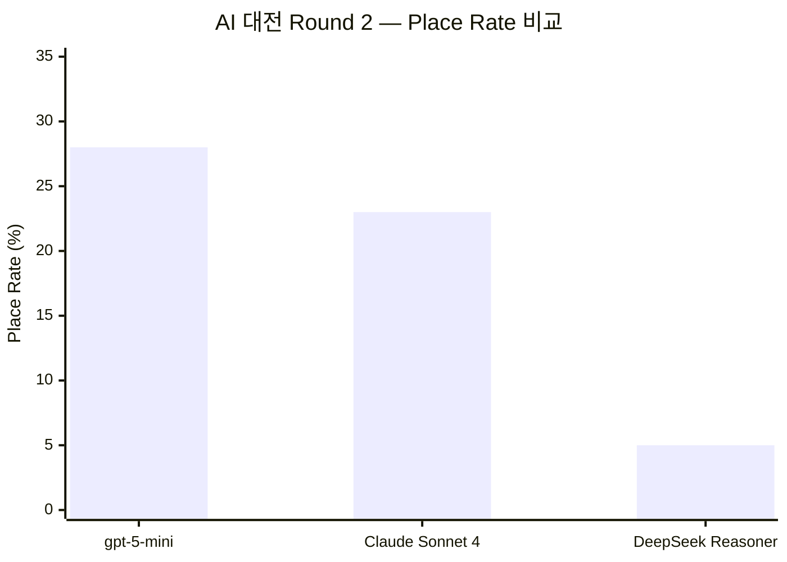
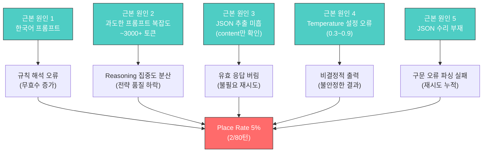
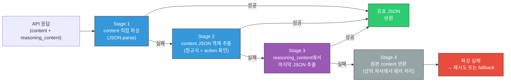
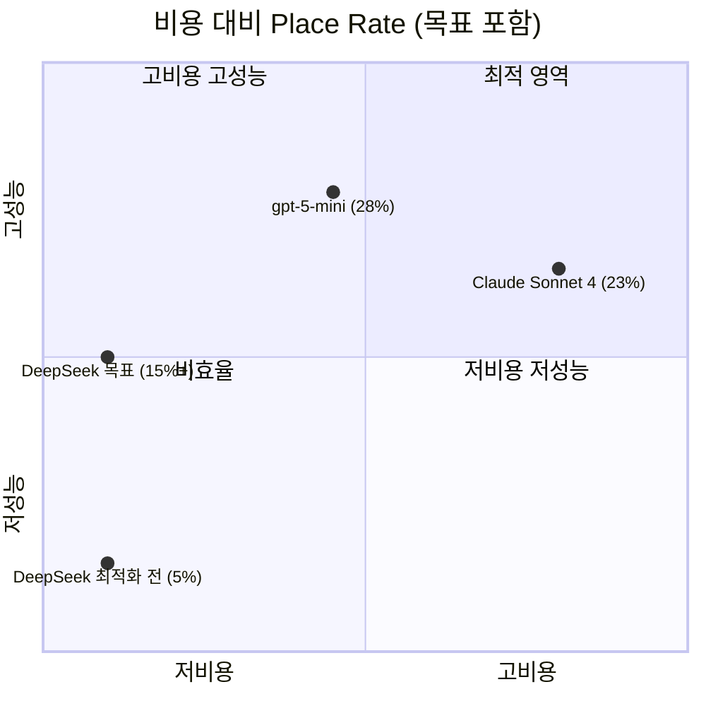
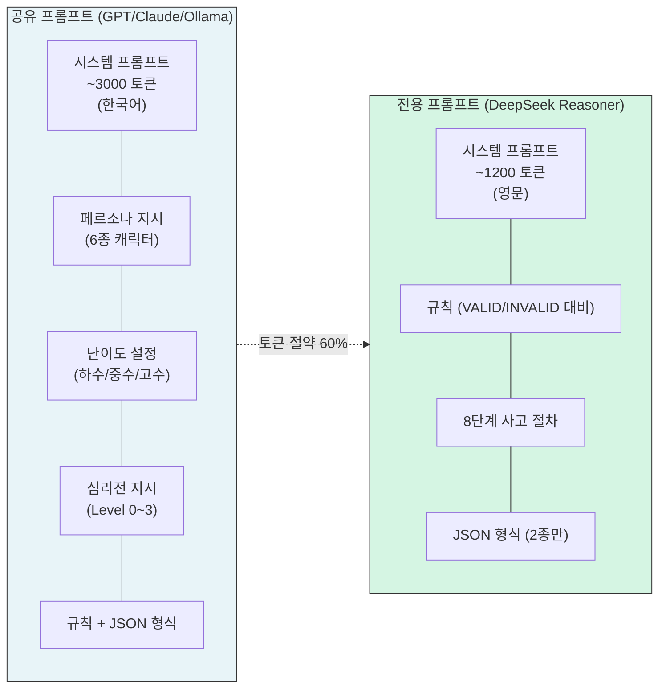
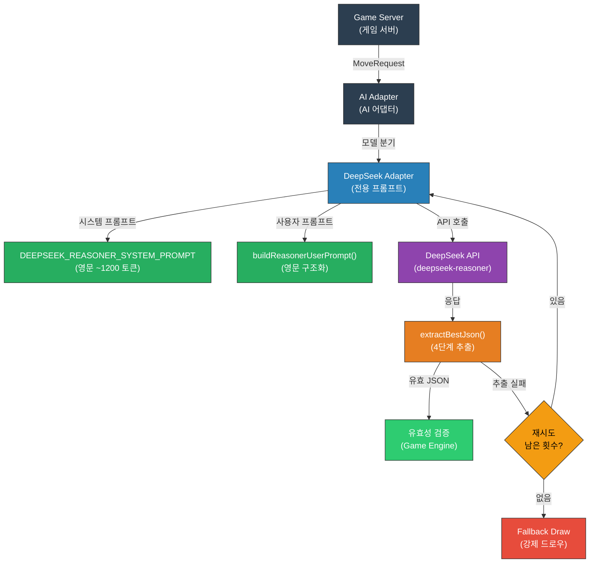
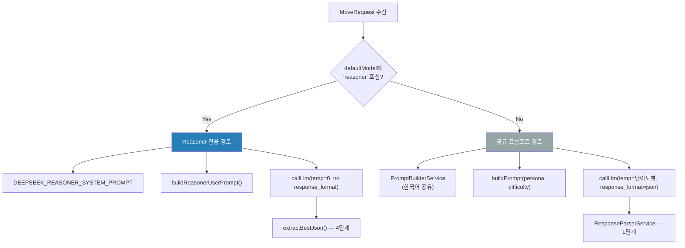
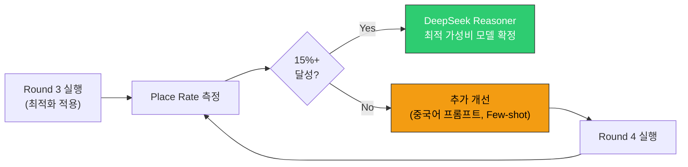

# 26. DeepSeek Reasoner 프롬프트 최적화 보고서

- **작성일**: 2026-04-01
- **작성자**: 애벌레 (AI Engineer)
- **목적**: DeepSeek Reasoner의 place rate를 5% → 15%+ 으로 개선하기 위한 프롬프트 최적화 설계·구현·검증 보고
- **관련 문서**: `docs/04-testing/24-llm-api-validation-report-2026-03-31.md`, `docs/04-testing/12-llm-model-comparison.md`
- **코드 위치**: `src/ai-adapter/src/adapter/deepseek.adapter.ts`, `src/ai-adapter/src/adapter/deepseek.adapter.spec.ts`

---

## 1. 요약

AI 대전 Round 2(2026-03-31)에서 DeepSeek Reasoner는 **place rate 5%**(80턴 중 2회 배치 성공)로 GPT-5-mini(28%), Claude Sonnet 4(23%) 대비 현저히 낮은 성능을 기록했다. 원인 분석 결과 5가지 근본 문제를 식별하고, 각각에 대한 솔루션을 설계·구현했다. 단위 테스트 38건 전체 통과를 확인했으며, AI 대전 Round 3에서 실제 place rate 개선을 검증할 예정이다.

### 핵심 변경 사항

| 영역 | 변경 전 | 변경 후 |
|------|--------|--------|
| 시스템 프롬프트 | 한국어 공유 (~3000 토큰) | **영문 전용 (~1200 토큰)** |
| 사용자 프롬프트 | 한국어 공유 빌더 | **영문 전용 구조화 빌더** |
| JSON 추출 | 1단계 (content만) | **4단계 (content → 정규식 → reasoning → 폴백)** |
| Temperature | 난이도별 0.3~0.9 | **제거 (결정적 출력)** |
| JSON 수리 | 없음 | **후행 쉼표, 코드블록, 중괄호 매칭** |

---

## 2. 최적화 이전 성능 (AI 대전 Round 2, 2026-03-31)

### 2.1 4종 모델 성능 비교

| 모델 | Place Rate | Place 횟수 | 타일 수 | 턴 수 | 시간 | 비용/턴 |
|------|-----------|-----------|--------|------|------|---------|
| gpt-5-mini | **28%** | 11 | 27 | 80 | 1,876s | $0.025 |
| Claude Sonnet 4 (thinking) | **23%** | 9 | 29 | 80 | 2,076s | $0.074 |
| DeepSeek Reasoner | **5%** | 2 | 14 | 80 | 1,995s | $0.001 |
| Ollama (qwen2.5:3b) | N/A | - | - | - | - | 무료 |

> **주목할 점**: DeepSeek Reasoner는 비용 효율이 압도적으로 우수하나($0.001/턴), place rate가 타 모델의 1/5 수준에 불과하다. 프롬프트 최적화를 통해 비용 대비 성능을 극대화하는 것이 본 보고서의 핵심 목표이다.

### 2.2 성능 격차 시각화



---

## 3. 원인 분석

DeepSeek Reasoner의 저조한 성능에 대해 5가지 근본 원인을 식별했다.

### 3.1 프롬프트 언어 불일치

**문제**: 4종 모델이 동일한 한국어 중심 공유 프롬프트를 사용하고 있었다. GPT-5-mini와 Claude Sonnet 4는 한국어 이해도가 높아 큰 영향이 없었으나, DeepSeek Reasoner는 한국어 프롬프트에서 규칙 해석 정확도가 떨어졌다.

**영향**: 루미큐브의 그룹/런 규칙, 초기 등록(30점 규칙) 등 핵심 게임 메커니즘을 정확히 이해하지 못해 무효수 비율이 높았다.

**근거**: DeepSeek의 사전 학습 데이터는 영어와 중국어 비중이 압도적으로 높으며, 한국어 처리 시 토큰 효율이 2~3배 저하된다.

### 3.2 과도한 프롬프트 복잡도

**문제**: 공유 프롬프트에는 페르소나(6종 캐릭터), 난이도(하수/중수/고수), 심리전 레벨(0~3) 등 게임 전략 외 부가 지시가 포함되어 ~3000+ 토큰에 달했다. Reasoning 모델은 이러한 복잡한 지시를 reasoning chain에 포함하면서 핵심 규칙에 대한 집중도가 분산되었다.

**영향**: reasoning_content에서 페르소나 역할극에 토큰을 낭비하고, 실제 타일 조합 탐색에 할당되는 reasoning 용량이 감소했다.

### 3.3 JSON 추출 미흡

**문제**: DeepSeek Reasoner의 응답 구조는 `content`와 `reasoning_content` 두 필드로 분리된다. 기존 파서는 `content` 필드만 확인했으며, `content`가 비어있거나 가비지 텍스트인 경우(reasoning 모델에서 빈번) JSON 추출에 실패했다.

**영향**: 실제로는 `reasoning_content`에 유효한 JSON이 포함되어 있었으나 추출하지 못해 불필요한 재시도 또는 fallback draw가 발생했다.

### 3.4 Temperature 설정 오류

**문제**: 공유 어댑터 로직이 난이도에 따라 temperature를 동적으로 설정하고 있었다 (beginner=0.9, intermediate=0.7, expert=0.3). Reasoning 모델은 자체적으로 탐색 전략을 결정하므로 외부 temperature 설정이 reasoning chain을 불안정하게 만들었다.

**영향**: 동일한 입력에 대해 비결정적 출력이 발생하여 유효수 제출 확률이 불안정했다.

### 3.5 JSON 수리 부재

**문제**: DeepSeek Reasoner의 출력에서 빈번하게 나타나는 JSON 형식 오류(후행 쉼표, 마크다운 코드블록 래핑 등)를 처리하는 로직이 없었다.

**영향**: 구문적으로 거의 유효한 JSON이 파싱 실패로 처리되어 재시도가 누적되었다.

### 3.6 근본 원인 인과 관계



---

## 4. 솔루션 상세

### 4.1 솔루션 1: DeepSeek Reasoner 전용 영문 프롬프트

**설계 원칙**: 공유 한국어 프롬프트(~3000 토큰)를 대체하는 영문 전용 시스템 프롬프트(~1200 토큰)를 설계했다. 핵심 규칙만 간결하게 포함하고, 단계별 사고 절차를 명시하여 reasoning 모델의 강점을 활용한다.

**코드 위치**: `src/ai-adapter/src/adapter/deepseek.adapter.ts` → `DEEPSEEK_REASONER_SYSTEM_PROMPT`

**프롬프트 구조**:

```
1. Tile Encoding (타일 인코딩 규칙)
   - Color + Number + Set 형식 설명
   - 예시: R7a = Red 7 set-a

2. Rules (규칙 — STRICT 표기)
   - Group: 같은 숫자 + 다른 색상 3~4장
   - Run: 같은 색상 + 연속 숫자 3장 이상
   - Size: 최소 3장 필수
   - Initial Meld: 첫 등록 합계 30점 이상
   - VALID/INVALID 예시를 명시적으로 대비 배치

3. Step-by-Step Thinking Procedure (8단계)
   ① 내 타일 목록 확인
   ② 가능한 그룹 탐색
   ③ 가능한 런 탐색
   ④ 초기 등록 미완 시 30점 필터
   ⑤ 기존 테이블 확장 검토
   ⑥ 최대 타일 배치 조합 선택
   ⑦ 유효 조합 없으면 draw
   ⑧ 기존 테이블 그룹 포함하여 JSON 생성

4. Response Format (JSON 형식)
   - draw / place 두 가지만
   - "Output raw JSON only. No markdown, no code blocks" 명시
```

**핵심 설계 결정**:
- 페르소나, 심리전, 난이도 관련 지시를 **완전히 제거** — reasoning 토큰을 규칙 분석에 집중
- VALID/INVALID 예시를 **대비 쌍**으로 배치 — 규칙 경계 조건 명확화
- `ERR_GROUP_COLOR_DUP`, `ERR_GROUP_NUMBER` 등 에러 코드 표기 — Game Engine 검증 실패 사유를 사전 인지

### 4.2 솔루션 2: 영문 기반 사용자 프롬프트 빌더

**설계 원칙**: 게임 상태를 영문 구조화 섹션으로 변환하여 모델이 정보를 체계적으로 소비할 수 있도록 한다.

**코드 위치**: `src/ai-adapter/src/adapter/deepseek.adapter.ts` → `buildReasonerUserPrompt()`

**5개 섹션 구조**:

```
# Current Table
Group1: [R7a, B7a, K7a]
Group2: [Y1a, Y2a, Y3a, Y4a]
(3 groups total -- you MUST include ALL of them in tableGroups)

# My Rack Tiles
[R1a, R2a, R3a, R10a, R11a, R12a, B5a, B6a] (8 tiles)

# Game Status
Turn: 5
Draw pile: 32 tiles remaining
Initial Meld: NOT DONE -- you need sum >= 30 points to place

# Opponents
player-02: 11 tiles
player-03: 3 tiles WARNING: close to winning!

# Your Task
Analyze my rack tiles and find valid groups/runs to place.
Respond with ONLY the JSON object. No other text.
```

**설계 포인트**:
- `Current Table`에서 "you MUST include ALL of them in tableGroups" 경고 — 기존 그룹 누락으로 인한 REJECTED 방지
- `Opponents`에서 3장 이하 보유 시 "WARNING: close to winning!" 표기 — 공격적 전략 유도
- 재시도 시 `buildReasonerRetryPrompt()`가 이전 에러 사유를 포함하여 동일 실수 반복 방지

### 4.3 솔루션 3: 4단계 JSON 추출 전략

**설계 원칙**: DeepSeek Reasoner의 응답에서 가능한 모든 경로로 유효한 JSON을 추출한다. 각 단계에서 실패하면 다음 단계로 진행하며, JSON 수리 로직도 각 단계에 내장한다.

**코드 위치**: `src/ai-adapter/src/adapter/deepseek.adapter.ts` → `extractBestJson()`



**각 Stage 상세**:

| Stage | 입력 | 처리 | 성공 조건 |
|-------|------|------|----------|
| 1 | `content` | `cleanJsonString()` → `JSON.parse()` | 유효한 JSON |
| 2 | `content` | `cleanJsonString()` → `JSON.parse()` → `action` 확인 | `action`이 `"draw"` 또는 `"place"` |
| 3 | `reasoning_content` | 중괄호 매칭으로 모든 JSON 후보 추출 → **역순 탐색** | `action`이 `"draw"` 또는 `"place"` |
| 4 | `content` 원본 | 변환 없이 반환 | (항상 반환, 상위에서 에러 처리) |

**Stage 3의 역순 탐색 근거**: reasoning chain에서 모델은 여러 번 JSON을 시도할 수 있다. 초기 JSON은 잘못된 시도이고, **마지막 JSON이 최종 결론**일 가능성이 높다.

### 4.4 솔루션 4: JSON 수리 로직

**코드 위치**: `src/ai-adapter/src/adapter/deepseek.adapter.ts` → `cleanJsonString()`

**수리 대상**:

| 오류 유형 | 예시 | 수리 방법 |
|----------|------|----------|
| 후행 쉼표 (객체) | `{"action":"draw",}` | `,}` → `}` |
| 후행 쉼표 (배열) | `["R7a","B7a",]` | `,]` → `]` |
| 마크다운 코드블록 | `` ```json\n{...}\n``` `` | 정규식으로 내부 JSON 추출 |
| 앞뒤 텍스트 | `Here is: {"action":"draw"} done.` | `{...}` 패턴 매칭 |

**적용 범위**: `cleanJsonString()`은 Stage 1~2에서 호출되며, Stage 3에서는 `extractLastJsonFromText()`가 개별 후보에 대해 후행 쉼표 제거를 수행한다.

### 4.5 솔루션 5: Temperature 제거

**변경 내용**: Reasoner 모델에 대해 API 요청 바디에서 `temperature` 파라미터를 **완전히 제거**한다.

```typescript
// deepseek.adapter.ts → callLlm()
if (isReasoner) {
  // reasoner: temperature 파라미터 자체를 보내지 않음 (API 호환)
} else {
  body.temperature = temperature;
  body.response_format = { type: 'json_object' };
}
```

**근거**:
- DeepSeek Reasoner는 내부적으로 reasoning chain을 통해 탐색 전략을 결정한다
- 외부 temperature 설정은 이 내부 탐색을 방해하며, 특히 높은 temperature(0.7~0.9)에서 reasoning chain이 발산하여 무효수 비율이 급증한다
- `response_format: json_object`도 Reasoner 모델에서는 지원되지 않으므로 함께 제거한다

---

## 5. 모델별 비교 분석

### 5.1 어댑터 구성 비교

| 비교 항목 | OpenAI (gpt-5-mini) | Claude (Sonnet 4) | DeepSeek (Reasoner) | Ollama (qwen2.5:3b) |
|----------|--------------------|--------------------|--------------------|--------------------|
| 프롬프트 언어 | 한국어 (공유) | 한국어 (공유) | **영문 (전용)** | 한국어 (공유) |
| 시스템 프롬프트 | ~3000 토큰 | ~3000 토큰 | **~1200 토큰** | ~3000 토큰 |
| 추론 방식 | reasoning tokens | thinking budget | reasoning_content | 일반 (비추론) |
| JSON 추출 | 1단계 (content) | 2단계 (thinking → text) | **4단계** | 1단계 (content) |
| JSON 강제 | `response_format: json_object` | 프롬프트 지시 | **프롬프트 지시** | stop tokens + few-shot |
| Temperature | 제거 (추론 모델) | 자동 (thinking) | **제거** | 난이도별 (0.3~0.9) |
| 타임아웃 | 120s | 120s | 150s | 30s |
| 비용/턴 | $0.025 | $0.074 | **$0.001** | 무료 |
| Place Rate (최적화 전) | 28% | 23% | 5% | N/A |
| Place Rate (목표) | 28% | 23% | **15%+** | N/A |

### 5.2 비용 대비 성능 (Cost Efficiency)



> DeepSeek Reasoner는 최적화 목표(15%+) 달성 시 **비용 대비 최고 효율 모델**이 된다. 턴당 $0.001로 GPT-5-mini의 1/25 비용에 절반 이상의 성능을 확보할 수 있다.

### 5.3 프롬프트 구조 비교



---

## 6. 아키텍처

### 6.1 DeepSeek Reasoner 요청 처리 흐름



### 6.2 공유 vs 전용 프롬프트 분기



---

## 7. 테스트 결과

### 7.1 단위 테스트 요약

| 구분 | 테스트 수 | 결과 |
|------|----------|------|
| **기존 (deepseek-chat)** | 14 | **14 PASS** |
| **신규 (deepseek-reasoner)** | 24 | **24 PASS** |
| **합계** | **38** | **38 PASS** |

### 7.2 신규 테스트 상세

#### Reasoner 전용 프롬프트 테스트 (8건)

| # | 테스트 | 검증 내용 |
|---|--------|----------|
| 1 | temperature 미포함 확인 | 요청 바디에 `temperature` 키가 없는지 |
| 2 | response_format 미포함 확인 | 요청 바디에 `response_format` 키가 없는지 |
| 3 | 최소 타임아웃 150초 적용 | `timeoutMs < 150,000`일 때 150,000으로 보정 |
| 4 | 영어 시스템 프롬프트 사용 | "You are a Rummikub game AI" 포함 확인 |
| 5 | 영어 유저 프롬프트 생성 | "Current Table", "My Rack Tiles", "Game Status" 섹션 확인 |
| 6 | draw 응답 정상 파싱 | action=draw, modelName=deepseek-reasoner |
| 7 | place 응답 정상 파싱 | tableGroups, tilesFromRack 매핑 |
| 8 | initialMeldDone=true 시 테이블 정보 포함 | 기존 그룹 확장 시나리오 |

#### JSON 추출 테스트 (10건)

| # | 테스트 | 입력 | 기대 결과 |
|---|--------|------|----------|
| 1 | 순수 JSON content | `{"action":"draw",...}` | Stage 1 성공 |
| 2 | 마크다운 코드블록 | `` ```json\n{...}\n``` `` | Stage 1 (cleanJsonString) 성공 |
| 3 | 앞뒤 텍스트 포함 | `Here is:\n{...}\nThat was` | Stage 2 성공 |
| 4 | 후행 쉼표 복구 | `{"action":"draw",}` | Stage 1 (cleanJsonString) 성공 |
| 5 | content 비어있고 reasoning에 JSON | `content=""`, `reasoning="...{...}"` | Stage 3 성공 |
| 6 | reasoning에 여러 JSON (마지막 추출) | `{attempt1}...{final}` | Stage 3 역순 탐색 |
| 7 | content 무효 + reasoning 유효 | `content="garbage"`, `reasoning="{...}"` | Stage 3 성공 |
| 8 | 모든 곳에 JSON 없음 | `content="no json"`, `reasoning="none"` | Stage 4 원본 반환 |
| 9 | place 응답 배열 후행 쉼표 | `["R7a","B7a",]` | 배열 쉼마 복구 후 파싱 |
| 10 | API 호출 → content 비어있음 → reasoning 추출 | 전체 흐름 통합 | action=draw, isFallbackDraw=false |

#### 재시도/폴백 테스트 (6건)

| # | 테스트 | 검증 내용 |
|---|--------|----------|
| 1 | 모든 재시도 실패 시 fallback draw | `isFallbackDraw=true`, `retryCount=maxRetries` |
| 2 | 첫 시도 실패 → 두 번째 성공 | `isFallbackDraw=false`, `retryCount=1` |
| 3 | 네트워크 에러 시 fallback | timeout/ECONNREFUSED 에러 처리 |
| 4 | 코드블록 래핑 API 응답 파싱 | `` ```json\n{place...}\n``` `` → action=place |
| 5 | max_tokens=8192 설정 (reasoner) | 일반 모드 1024 vs reasoner 8192 |
| 6 | 재시도 프롬프트에 이전 에러 사유 포함 | `RETRY (attempt N)` + 에러 메시지 |

---

## 8. 기대 효과 및 위험 요소

### 8.1 기대 효과

| 항목 | 최적화 전 | 최적화 후 (기대) | 근거 |
|------|---------|-----------------|------|
| Place Rate | 5% | **15%+** | 프롬프트 간결화 + 규칙 명시 + 4단계 추출 |
| Fallback Draw | 0건 (Round 2) | 0건 유지 | 4단계 추출로 파싱 실패율 추가 감소 |
| 응답 시간 | ~25s/턴 | ~20s/턴 | 토큰 절약(~60%)으로 reasoning 시간 단축 |
| 비용/턴 | $0.001 | **$0.001 이하** | 입력 토큰 60% 감소 |

### 8.2 위험 요소

| 위험 | 영향 | 대응 |
|------|------|------|
| 영문 프롬프트가 DeepSeek에서도 불충분 | Place Rate 개선 미미 | 중국어 프롬프트 실험 (DeepSeek은 중국어 학습 비중 높음) |
| reasoning_content JSON 형식 변경 | Stage 3 추출 실패 | 정규식 패턴 다각화, 단위 테스트 추가 |
| 모델 버전 업데이트로 행동 변경 | 기존 테스트 실패 | CI 파이프라인에 통합 테스트 포함 |

---

## 9. 다음 단계

### 9.1 즉시 실행 (Round 3)

1. **AI 대전 Round 3 실행**: 최적화된 DeepSeek Reasoner로 80턴 대전 수행
2. **Place Rate 측정**: 목표 15%+ (12회 이상 배치 성공)
3. **가성비 분석**: $0.001/턴으로 15%+ 달성 시 → GPT-5-mini 대비 **25배 비용 효율**

### 9.2 추가 개선 후보

| 우선순위 | 개선 항목 | 예상 효과 |
|---------|----------|----------|
| P1 | 중국어 프롬프트 실험 | DeepSeek의 중국어 강점 활용으로 추가 5%p 개선 가능성 |
| P2 | Few-shot 예시 추가 | 실제 게임 상태 + 정답 JSON 예시 2~3개 포함 |
| P3 | reasoning_content 분석 로깅 | 모델의 사고 과정을 로깅하여 규칙 이해 실패 패턴 식별 |
| P4 | 동적 프롬프트 선택 | 게임 진행 단계(초기/중반/후반)에 따라 다른 프롬프트 사용 |

### 9.3 성공 기준



---

## 10. 참고 자료

| 문서 | 위치 |
|------|------|
| LLM 4종 실 API 검증 보고서 | `docs/04-testing/24-llm-api-validation-report-2026-03-31.md` |
| LLM 모델별 성능 비교 | `docs/04-testing/12-llm-model-comparison.md` |
| AI 대전 테스트 계획 | `docs/04-testing/21-ai-vs-ai-tournament-test-plan.md` |
| DeepSeek Adapter 소스 | `src/ai-adapter/src/adapter/deepseek.adapter.ts` |
| DeepSeek Adapter 테스트 | `src/ai-adapter/src/adapter/deepseek.adapter.spec.ts` |
| AI Adapter 설계 문서 | `docs/02-design/05-ai-adapter-design.md` |
