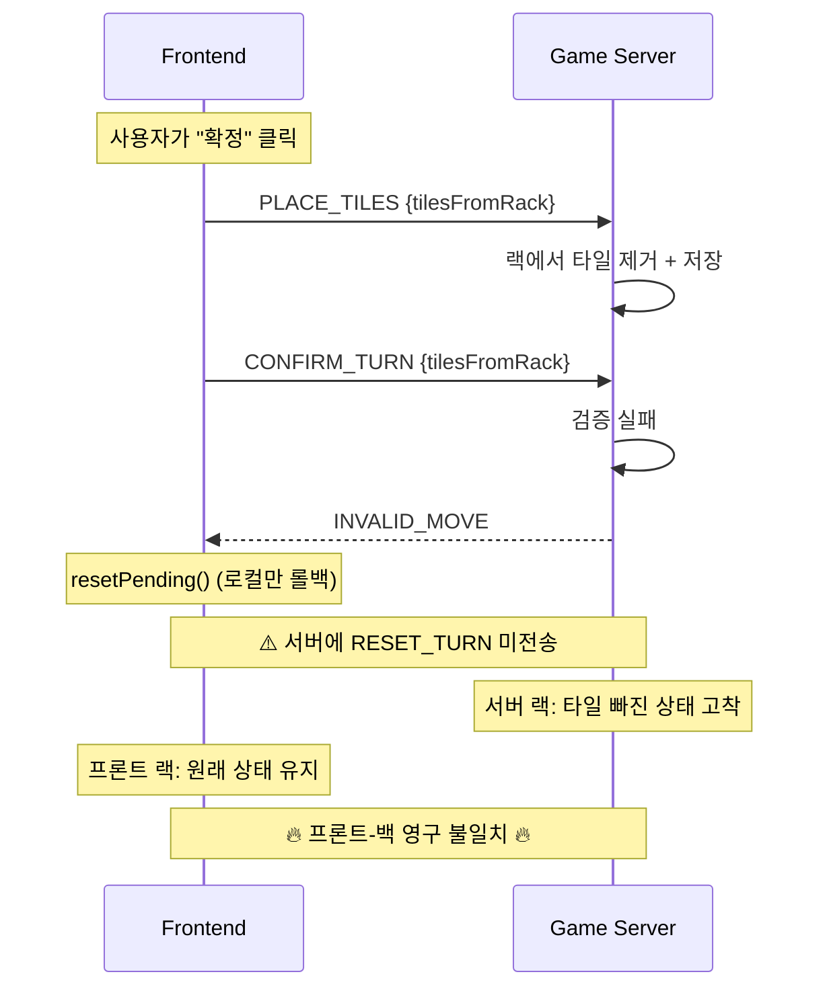

# 게임 UI/서버 버그 분석 및 수정 계획

- **작성일**: 2026-04-02
- **작성자**: 애벌레 + Claude Code Agent Team (6명)
- **트리거**: 2026-04-02 오전 플레이테스트에서 발견된 5건의 버그

## 1. 버그 증상 요약

| # | 증상 | 사용자 체감 |
|---|------|-----------|
| BUG-1 | 타일 소실 | 손에 있던 타일이 드래그 후 사라짐 |
| BUG-2 | 미완성 세트 확정 | 완성하지 않은 패를 임의로 확정(place) |
| BUG-3 | 없던 타일 추가 | 보유하지 않은 타일이 세트에 포함되어 확정 |
| BUG-4 | 유효성 규칙 혼란 | 연속 숫자가 아닌 조합이 확정됨 |
| BUG-5 | 이상한 메시지 | 확정 후 알 수 없는 메시지 표시 |

## 2. 분석 투입 에이전트

| 에이전트 | 담당 | 소요 시간 |
|---------|------|----------|
| Frontend Dev #1 | 게임 UI 버그 원인 분석 | ~4분 |
| Frontend Dev #2 | 프론트엔드 전면 코드 리뷰 | ~6분 |
| Go Dev | 게임 서버 Place/Meld 로직 리뷰 | ~8분 |
| Architect | 프론트-백 WebSocket 통신 흐름 리뷰 | ~8분 |
| QA | 테스트 커버리지 갭 분석 | ~6분 |
| DevOps | SonarQube OOM + CI lint 타임아웃 수정 | ~5분 |

## 3. 근본 원인 (Root Cause)

### 핵심: INVALID_MOVE 후 서버 랙 미복원

이 불일치가 누적되면:
- **BUG-1 타일 소실**: 서버에 없는 타일을 프론트가 표시 → 다음 확정 시 ERR_TILE_NOT_IN_RACK
- **BUG-3 없던 타일**: 불일치 상태에서 tilesFromRack 계산 왜곡
- **BUG-2/4**: 사용자 혼란으로 미완성 세트 제출 → 서버 거부 → 다시 불일치 누적

## 4. 전체 결함 목록

### Critical (7건)

| ID | 영역 | 위치 | 문제 |
|----|------|------|------|
| C-1 | 통신 | `GameClient.tsx:589-603` | INVALID_MOVE 후 RESET_TURN 미전송 → 서버-클라이언트 랙 영구 불일치 |
| C-2 | 프론트 | `useWebSocket.ts:174-177` | TURN_END에서 서버 myRack 미동기화 (pendingMyTiles만 커밋) |
| C-3 | 프론트 | `GameClient.tsx:589-609` | 클라이언트 세트 유효성 검증 완전 부재 (practice-engine.ts 로직 미사용) |
| C-4 | 서버 | `validator.go:77-110` | Universe Conservation 미검증 (table+rack 타일 보전 불변식 없음) |
| C-5 | 서버 | `validator.go:82-94` | V-06이 타일 코드가 아닌 개수만 비교 |
| C-6 | 서버 | `game_service.go:259-267` | PlaceTiles가 타일 보전 검증 없이 테이블 전체 교체 |
| C-7 | 통신 | `ws_message.go:246` / `websocket.ts:207` | `graceSec` vs `graceDeadlineMs` 필드명+의미 불일치 |

### Major (7건)

| ID | 영역 | 위치 | 문제 |
|----|------|------|------|
| M-1 | 서버 | `ws_message.go:104-107` | JokerReturnedCodes 필드 미정의 → V-07 조커 교체 규칙 비활성 |
| M-2 | 서버 | `game_service.go:762-764` | 파싱 실패 타일을 Number=0, Color=""로 통과시킴 |
| M-3 | 서버 | `game_service.go:230-328` | Get-Modify-Save 비원자적 (타이머와 race condition) |
| M-4 | 프론트 | `GameClient.tsx:591-593` | pendingMyTiles null 시 전체 타일을 배치로 보고 |
| M-5 | 프론트 | `useWebSocket.ts:39-48` | 에러 코드 매핑 8건 누락 (15개 중 8개만 매핑) |
| M-6 | 통신 | `useWebSocket.ts:219` | INVALID_MOVE 후 턴 교착 (pending 리셋 + 서버 불일치) |
| M-7 | 서버 | `game_service.go:259-267` | 랙 제거 타일이 테이블에 포함됐는지 미검증 |

### Minor (10건)

| ID | 영역 | 문제 |
|----|------|------|
| m-1 | 프론트 | filter로 타일 제거 시 동일 코드 전체 삭제 (indexOf+splice가 안전) |
| m-2 | 프론트 | resetPending() 이중 호출 (useWebSocket + ErrorToast) |
| m-3 | 프론트 | 서버 확정 그룹에도 중복 색상 경고 표시 가능 |
| m-4 | 프론트 | shouldCreateNewGroup 엣지 케이스 (1개 타일, 불연속 숫자) |
| m-5 | 프론트 | useTurnTimer 매초 interval 재생성 |
| m-6 | 프론트 | TILE_DRAWN에서 불필요한 이중 setState |
| m-7 | 프론트 | DraggableTile key에 index 포함 |
| m-8 | 통신 | S2C 5개 타입 프론트에만 존재 (AI_THINKING 등) |
| m-9 | 통신 | TableGroup type 필드 서버 미전송 |
| m-10 | 통신 | TURN_END에서 TurnNumber 0 전송 |

## 5. 수정 계획

### Phase 1: 근본 원인 수정 (C-1, C-2, M-6)

**목표**: 프론트-서버 랙 상태 동기화 보장

1. **INVALID_MOVE 핸들러에서 RESET_TURN 전송** (`useWebSocket.ts`)
   - INVALID_MOVE 수신 시 `send("RESET_TURN", {})` 호출 → 서버 스냅샷 복원
   - `resetPending()` 호출 → 프론트 로컬 상태 롤백
   - 이 한 줄이 C-1, M-6을 동시에 해결

2. **TURN_END에 myRack 포함** (`ws_handler.go` + `useWebSocket.ts`)
   - 서버: `broadcastTurnEnd` 시 해당 플레이어에게 `myRack` 필드 추가 전송
   - 프론트: TURN_END에서 `payload.myRack`이 있으면 `setMyTiles` 호출
   - pendingMyTiles 로컬 추론 대신 서버 진실(ground truth) 사용

### Phase 2: 프론트엔드 UX 수정 (C-3, M-4, M-5)

**목표**: 사용자에게 즉각적 피드백 제공

3. **클라이언트 세트 유효성 사전 검증** (`GameClient.tsx`)
   - `handleConfirm`에서 practice-engine.ts의 `validateBoard` 로직 재사용
   - 유효하지 않으면 서버 전송 차단 + 에러 토스트 표시
   - 확정 버튼을 유효한 세트일 때만 활성화

4. **tilesFromRack null 방어** (`GameClient.tsx:591-593`)
   - `pendingMyTiles ?? []` 대신 명시적 null 체크
   - null이면 확정 차단 (early return)

5. **에러 코드 매핑 완성** (`useWebSocket.ts`)
   - 서버 errors.go의 15개 에러 코드 전부 한글 매핑
   - fallback 메시지도 사용자 친화적 한글로 변경

### Phase 3: 서버 검증 강화 (C-4, C-5, C-6, M-2)

**목표**: 서버에서 타일 보전 불변식 보장

6. **Universe Conservation 검증** (`validator.go`)
   - `ValidateTurnConfirm`에 V-06b 추가: `tableBefore 타일 ⊆ tableAfter 타일` (코드 수준)
   - `rackBefore - rackAfter == tableAfter - tableBefore` 검증

7. **PlaceTiles 보전 검증** (`game_service.go`)
   - tilesFromRack에 포함된 타일이 tableGroups에 실제 존재하는지 확인
   - 파싱 실패 타일 silent fallback 제거 → 즉시 에러 반환

### Phase 4: 프로토콜 정렬 (C-7, m-8~m-10)

**목표**: 프론트-백 페이로드 완전 일치

8. **PLAYER_DISCONNECTED 필드 통일** (`ws_message.go` + `websocket.ts`)
   - 서버를 프론트 기대에 맞춤: `graceDeadlineMs` (Unix timestamp ms) 전송
   - 또는 프론트를 서버에 맞춤: `graceSec` 수신 → `Date.now() + graceSec * 1000` 계산

9. **DrawPileEmpty 필드 통일**, **TableGroup type 전송**, **TURN_END turnNumber 수정**

### Phase 5 (후속): 서버 동시성 + 조커 규칙 (M-1, M-3)

- JokerReturnedCodes 필드 추가 → V-07 활성화
- gameID 단위 mutex 도입 → race condition 방지

## 6. 테스트 커버리지 현황

| 영역 | 현재 | 갭 |
|------|------|-----|
| Go engine | 95.6% (346 tests) | V-06b(universe conservation) 테스트 추가 필요 |
| AI Adapter | 324/324 PASS | 영향 없음 |
| Playwright E2E | 288/338 PASS | 게임 모드 타일 배치→확정→롤백 E2E 부재 |
| 프론트 단위 테스트 | **0건** | gameStore, handleDragEnd, handleConfirm 단위 테스트 필요 |

## 7. 수정 우선순위 및 담당

| Phase | 담당 에이전트 | 예상 변경 파일 |
|-------|-------------|--------------|
| Phase 1 | Frontend Dev + Go Dev | useWebSocket.ts, ws_handler.go, ws_message.go |
| Phase 2 | Frontend Dev | GameClient.tsx, useWebSocket.ts |
| Phase 3 | Go Dev | validator.go, game_service.go |
| Phase 4 | Frontend Dev + Go Dev | ws_message.go, websocket.ts |
| Phase 5 | Go Dev (후속 Sprint) | ws_message.go, game_service.go |

## 8. 이미 수정 완료 (CI/CD)

| 항목 | 변경 파일 | 내용 |
|------|----------|------|
| SonarQube OOM | `.gitlab-ci.yml`, `docker-compose.cicd.yml`, `docker-compose.ci.yml` | JVM 힙 3.3G→2.2G |
| CI lint timeout | `.gitlab-ci.yml` | 전 job timeout 추가 (15m/10m/20m/5m) |
| Runner 태그+캐시 | Helm release v3, `helm/gitlab-runner-values.yaml` | rummiarena 태그 + PVC 2Gi + 리소스 제한 |
| Error 파드 정리 | K8s pods | DeadlineExceeded 좀비 4개 삭제 |
