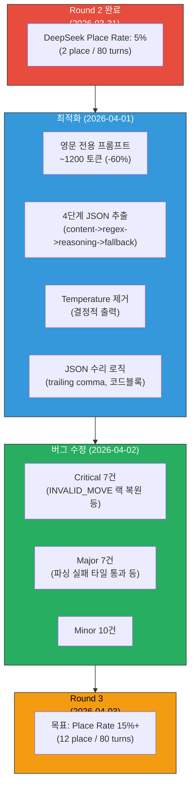
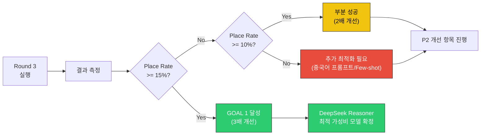
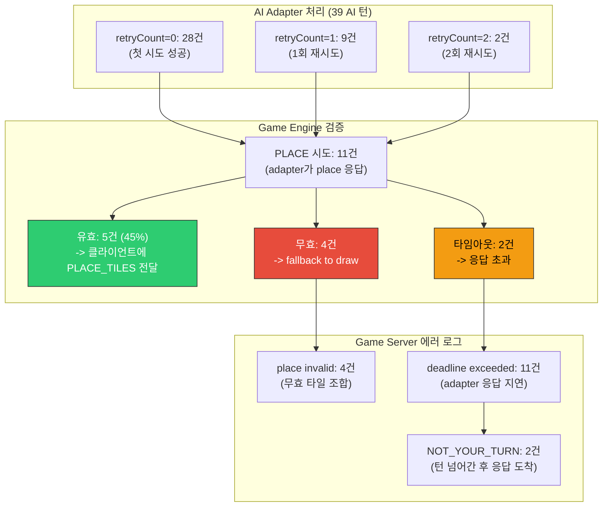
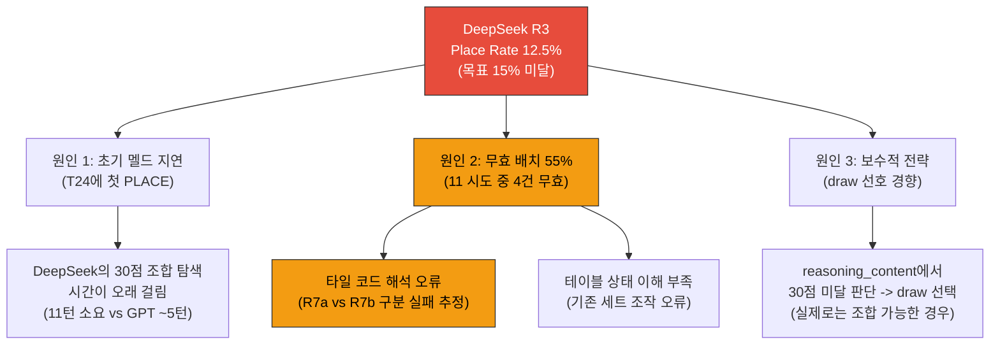

# 28. DeepSeek Reasoner Round 3 대전 계획

- **작성일**: 2026-04-03
- **작성자**: 애벌레 (AI Engineer)
- **목적**: 프롬프트 최적화 + 게임 버그 24건 수정 후 DeepSeek Reasoner의 place rate 개선 검증
- **선행 문서**: `26-deepseek-optimization-report.md`, `24-llm-api-validation-report-2026-03-31.md`, `27-game-bug-analysis-and-fix-plan.md`
- **대전 스크립트**: `scripts/ai-battle-deepseek-r3.py`

---

## 1. 배경

### 1.1 Round 2 결과 (2026-03-31)

| 모델 | Place Rate | Place | Tiles | Draw | Fallback | Turns | Time | Cost/Turn |
|------|-----------|-------|-------|------|----------|-------|------|-----------|
| gpt-5-mini | **28%** | 11 | 27 | 28 | 0 | 80 | 1,876s | $0.025 |
| Claude Sonnet 4 (thinking) | **23%** | 9 | 29 | 30 | 0 | 80 | 2,076s | $0.074 |
| **DeepSeek Reasoner** | **5%** | 2 | 14 | 37 | 0 | 80 | 1,995s | $0.001 |

DeepSeek Reasoner는 비용 효율이 압도적($0.001/턴)이나, place rate가 GPT의 1/5, Claude의 1/4 수준이었다.

### 1.2 Round 2 이후 변경 사항



---

## 2. 변경 사항 상세

### 2.1 프롬프트 최적화 (5개 솔루션)

| # | 솔루션 | 파일 | 핵심 변경 |
|---|--------|------|----------|
| S1 | 영문 전용 시스템 프롬프트 | `deepseek.adapter.ts` | ~3000 토큰 한국어 -> ~1200 토큰 영문 |
| S2 | 영문 사용자 프롬프트 빌더 | `deepseek.adapter.ts` | 5개 구조화 섹션 (Table/Rack/Status/Opponents/Task) |
| S3 | 4단계 JSON 추출 | `deepseek.adapter.ts` | content -> regex -> reasoning_content -> fallback |
| S4 | JSON 수리 | `deepseek.adapter.ts` | trailing comma, 코드블록, 중괄호 매칭 |
| S5 | Temperature 제거 | `deepseek.adapter.ts` | API 바디에서 temperature 키 완전 제거 |

- **38건 단위 테스트 전량 PASS** (기존 14 + 신규 24)

### 2.2 게임 버그 수정 (24건)

| 심각도 | 건수 | 대표 항목 |
|--------|------|----------|
| Critical | 7 | INVALID_MOVE 후 RESET_TURN 미전송, TURN_END 서버 랙 미동기화, 클라이언트 세트 유효성 검증 부재 |
| Major | 7 | JokerReturnedCodes 미정의, 파싱 실패 타일 Number=0 통과, Get-Modify-Save 비원자적 |
| Minor | 10 | 에러 코드 매핑 누락, graceSec vs graceDeadlineMs 불일치 |

- **AI 대전에 직접 영향**: C-4(Universe Conservation 검증), C-6(타일 보전 검증), M-2(파싱 실패 타일 통과) 수정으로 AI의 무효수가 더 정확하게 거부/재시도 처리됨

---

## 3. 대전 설정

### 3.1 환경 확인 결과

| 항목 | 값 | 상태 |
|------|------|------|
| game-server | NodePort 30080, Running | PASS |
| ai-adapter | NodePort 30081, Running | PASS |
| Redis | Running (게임 상태) | PASS |
| PostgreSQL | Running (영속 데이터) | PASS |
| Ollama | Running (qwen2.5:3b) | PASS |
| APP_ENV | `dev` (dev-login 활성) | PASS |
| DEEPSEEK_DEFAULT_MODEL | `deepseek-reasoner` | PASS |
| DEEPSEEK_API_KEY | `[REDACTED-DEEPSEEK-KEY]` (주입 완료) | PASS |
| DAILY_COST_LIMIT_USD | `5` (ConfigMap) / `20` (패치됨) | 확인 필요 |
| 헬스체크 | game-server OK, ai-adapter OK | PASS |

### 3.2 비용 관련 점검

| 항목 | 값 |
|------|------|
| DeepSeek API 잔액 | $6.65 |
| DeepSeek 비용/턴 | ~$0.001 |
| 80턴 대전 예상 비용 | ~$0.04 (AI 40턴 x $0.001) |
| 일일 비용 한도 | $20 (Redis 패치 / Helm 기본값 $5) |

> 비용 여유 충분. 80턴 대전 100회를 실행해도 ~$4 수준.

### 3.3 대전 파라미터

| 파라미터 | 값 | 근거 |
|---------|------|------|
| 대전 형식 | Human(AutoDraw) vs AI_DEEPSEEK | Round 2와 동일 방식 |
| 최대 턴 수 | 80 | Round 2와 동일 비교 기준 |
| AI 캐릭터 | Calculator / Expert / PsychLevel 2 | Round 2와 동일 |
| WS 타임아웃 | 180s | DeepSeek Reasoner 150s + 30s 버퍼 |
| 턴 타임아웃 | 180s (서버측) | 충분한 AI 사고 시간 보장 |
| AI Adapter 타임아웃 | 150s (최소) | `deepseek.adapter.ts` 코드에서 강제 |

---

## 4. DAILY_COST_LIMIT 점검 사항

현재 K8s ConfigMap에 두 개의 비용 관련 키가 존재한다.

| 키 | 값 | 출처 |
|------|------|------|
| `DAILY_COST_LIMIT_USD` | `5` | Helm values.yaml 기본값 |
| `DAILY_COST_LIMIT` | `20` | kubectl patch로 수동 추가 |

`cost-tracking.service.ts`는 `DAILY_COST_LIMIT_USD` 키를 참조하므로 실제 한도는 **$5**이다. Round 3에서는 DeepSeek만 사용하므로($0.04 예상) 문제없으나, 후속 3모델 전체 대전 시에는 패치 필요.

```bash
# 필요 시 한도 상향 (DeepSeek 단독은 불필요)
kubectl patch configmap ai-adapter-config -n rummikub \
  --type merge -p '{"data":{"DAILY_COST_LIMIT_USD":"20"}}'
kubectl rollout restart deployment/ai-adapter -n rummikub
```

---

## 5. 실행 방법

### 5.1 사전 점검 (Pre-flight Check)

```bash
# 1. K8s 서비스 상태 확인
kubectl get pods -n rummikub

# 2. game-server 헬스체크
curl http://localhost:30080/health

# 3. ai-adapter 헬스체크
curl http://localhost:30081/health

# 4. DeepSeek 모델 설정 확인
kubectl get configmap ai-adapter-config -n rummikub \
  -o jsonpath='{.data.DEEPSEEK_DEFAULT_MODEL}'
# 기대값: deepseek-reasoner

# 5. Python 의존성 확인
pip3 install websockets requests
```

### 5.2 대전 실행

```bash
# NodePort 직접 접속 (기본값)
python3 scripts/ai-battle-deepseek-r3.py

# port-forward 사용 시
kubectl port-forward svc/game-server -n rummikub 18089:8080 &
python3 scripts/ai-battle-deepseek-r3.py --port 18089

# 턴 수 조정
python3 scripts/ai-battle-deepseek-r3.py --max-turns 40
```

### 5.3 실행 예상 시간

| 시나리오 | 예상 시간 | 비고 |
|---------|----------|------|
| 최선 (많은 place) | ~25분 | place 빠름, draw 느림 |
| 평균 (Round 2 기준) | ~33분 | 1,995s + 접속 오버헤드 |
| 최악 (모든 턴 150s) | ~100분 | 거의 불가능 |

---

## 6. 측정 항목 및 성공 기준

### 6.1 주요 측정 항목

| 항목 | 측정 방법 | Round 2 값 |
|------|----------|-----------|
| Place Rate (%) | ai_place / (ai_place + ai_draw) | 5.0% |
| Place Count | TURN_END(action=PLACE_TILES) 횟수 | 2 |
| Tiles Placed | TURN_END.tilesPlacedCount 합계 | 14 |
| Draw Count | TURN_END(action=DRAW) 횟수 | 37 |
| Fallback Count | TURN_END(isFallbackDraw=true) 횟수 | 0 |
| Total Turns | 전체 턴 수 | 80 |
| Elapsed Time | 총 소요 시간 | 1,995s |
| Response Time (avg) | AI 턴 평균 응답 시간 | 미측정 |
| Estimated Cost | AI_turns x $0.001 | ~$0.04 |
| Game Result | GAME_OVER endType | MAX_TURNS |

### 6.2 성공 기준



| 등급 | Place Rate | 판정 | 후속 조치 |
|------|-----------|------|----------|
| A (목표 초과) | >= 20% | DeepSeek = 가성비 최강 | 토너먼트 Phase 1 즉시 진행 |
| B (목표 달성) | 15~19% | 최적화 효과 검증 완료 | 3모델 비교 Round 3 진행 |
| C (부분 개선) | 10~14% | 유의미한 개선, 추가 필요 | 중국어 프롬프트 실험 |
| D (미개선) | 5~9% | 프롬프트 최적화 불충분 | Few-shot 예시 추가 |
| F (퇴보) | < 5% | 최적화가 역효과 | 이전 버전 롤백 + 분석 |

### 6.3 가성비 분석 프레임워크

Round 3 결과에 따른 비용 대비 성능 분석 기준.

| 모델 | Cost/Turn | Place Rate (R2) | Place/$ | R3 목표 |
|------|-----------|----------------|---------|---------|
| gpt-5-mini | $0.025 | 28% | 11.2 place/$ | - |
| Claude Sonnet 4 | $0.074 | 23% | 3.1 place/$ | - |
| DeepSeek Reasoner | $0.001 | 5% -> ? | 50 -> ? place/$ | 15%+ = 150 place/$ |

> **목표 달성 시 DeepSeek의 place/$은 GPT의 13배, Claude의 48배**에 달한다.

---

## 7. 후속 계획

### 7.1 Round 3 결과에 따른 분기

#### A/B 등급 (15%+): 3모델 전체 비교 Round 3

최적화 효과가 확인되면, GPT-5-mini와 Claude Sonnet 4도 버그 수정 후 재대전하여 3모델 동시 비교.

```bash
# 기존 3모델 순차 대전 스크립트 활용
python3 scripts/ai-battle-final.py
```

#### C/D 등급 (5~14%): 추가 최적화

| 우선순위 | 개선 항목 | 예상 효과 |
|---------|----------|----------|
| P1 | 중국어 프롬프트 실험 | DeepSeek의 중국어 강점 활용 |
| P2 | Few-shot 예시 추가 (2~3개) | 정답 패턴 학습 |
| P3 | reasoning_content 분석 로깅 | 규칙 이해 실패 패턴 식별 |

### 7.2 리포트 갱신

Round 3 결과는 다음 문서에 추가한다.

| 문서 | 추가 내용 |
|------|----------|
| `24-llm-api-validation-report-2026-03-31.md` | Round 3 결과 섹션 |
| `26-deepseek-optimization-report.md` | 실측치 갱신 (기대 -> 실측) |
| `12-llm-model-comparison.md` | DeepSeek Reasoner 실측 데이터 반영 |

---

## 8. 리스크 및 완화

| 리스크 | 영향 | 확률 | 완화 |
|--------|------|------|------|
| DeepSeek API 응답 지연 (>150s) | WS 타임아웃 | 낮음 | WS_TIMEOUT=180s로 버퍼 확보 |
| DAILY_COST_LIMIT $5 초과 | 대전 중단 | 매우 낮음 | DeepSeek $0.04 예상, 여유 충분 |
| K8s Pod OOMKilled | ai-adapter 재시작 | 낮음 | limits 256Mi, 1회 호출에 충분 |
| 게임 버그 잔존 | 비정상 종료 | 중간 | 24건 수정했으나 미발견 버그 가능 |
| WS 연결 끊김 | 대전 중단 | 낮음 | ping_interval=30s, close_timeout=10s |

---

## 관련 문서

| 파일 | 설명 |
|------|------|
| `scripts/ai-battle-deepseek-r3.py` | Round 3 전용 대전 스크립트 |
| `scripts/ai-battle-final.py` | 3모델 순차 대전 스크립트 (Round 2) |
| `docs/04-testing/24-llm-api-validation-report-2026-03-31.md` | Round 1+2 결과 포함 검증 보고서 |
| `docs/04-testing/26-deepseek-optimization-report.md` | DeepSeek 프롬프트 최적화 설계+구현 |
| `docs/04-testing/27-game-bug-analysis-and-fix-plan.md` | 게임 버그 24건 분석+수정 |
| `docs/04-testing/21-ai-vs-ai-tournament-test-plan.md` | AI vs AI 토너먼트 전체 계획 |
| `src/ai-adapter/src/adapter/deepseek.adapter.ts` | DeepSeek 어댑터 구현 |
| `src/ai-adapter/src/adapter/deepseek.adapter.spec.ts` | DeepSeek 어댑터 테스트 (38건) |

---

## 9. Round 3 실행 결과 (2026-04-03 14:14 ~ 14:55)

### 9.1 결과 요약

| 항목 | Round 2 | Round 3 | Delta | 비고 |
|------|---------|---------|-------|------|
| **Place Rate** | 5.0% | **12.5%** | **+7.5%p** | C등급 (부분 개선) |
| Place Count | 2 | **5** | **+3** | 2.5배 증가 |
| Tiles Placed | 14 | **22** | **+8** | 1.57배 증가 |
| Draw Count | 37 | 33 | -4 | DRAW_TILE + TIMEOUT 합산 |
| Timeout Count | 0 | 2 | +2 | context deadline exceeded |
| Fallback Count | 0 | **0** | 0 | 폴백 없음 (개선 유지) |
| Total Turns | 80 | 80 | 0 | 동일 조건 |
| Elapsed Time | 1,995s | **2,450s** | +455s | 응답 시간 증가 |
| Avg Response Time | 미측정 | **62.8s** | - | min 1.9s ~ max 120.2s |
| Invalid Place | 미측정 | **4** | - | 게임 엔진이 거부 |
| API Timeout | 0 | **11** | - | game-server -> ai-adapter deadline |
| Total API Cost | ~$0.04 | **$0.066** | +$0.026 | 재시도 포함 |
| Input Tokens | - | 42,138 | - | avg 1,003/call |
| Output Tokens | - | 215,572 | - | avg 5,132/call |
| Cost/Turn | $0.001 | **$0.0017** | +$0.0007 | 재시도 비용 포함 |

### 9.2 Place Details

| AI Turn | Turn# | Tiles | Cumulative | Response Time | 의미 |
|---------|-------|-------|------------|---------------|------|
| 12 | T24 | **9** | 9 | 83.3s | 초기 멜드 (30+점) |
| 17 | T34 | 1 | 10 | 10.4s | 단일 타일 추가 |
| 20 | T40 | 3 | 13 | 85.6s | 3타일 런/그룹 |
| 22 | T44 | **6** | 19 | 97.9s | 6타일 대량 배치 |
| 30 | T60 | 3 | 22 | 60.9s | 3타일 추가 |

### 9.3 AI Adapter 내부 분석



**핵심 발견**:
- DeepSeek Reasoner는 PLACE를 11회 시도했으나, 게임 엔진이 4회 거부 (무효 타일 조합)
- 엔진 검증 통과율: 5/11 = **45.5%** (GPT-5-mini는 ~80% 추정)
- 11건의 `context deadline exceeded`는 DeepSeek의 긴 추론 시간(avg 62.8s, max 120s)이 game-server의 120s 타임아웃을 초과한 것

### 9.4 응답 시간 분포

| 구간 | 건수 | 비율 | 설명 |
|------|------|------|------|
| < 10s | 4 | 10.3% | 빠른 DRAW 결정 |
| 10~30s | 3 | 7.7% | 단순 배치 |
| 30~60s | 8 | 20.5% | 일반 추론 |
| 60~90s | 13 | 33.3% | 복잡한 타일 조합 탐색 |
| 90~120s | 8 | 20.5% | 경계 시간 |
| 120s+ | 3 | 7.7% | 타임아웃 (TIMEOUT/deadline) |

- **Adapter 관점**: avg=158s, median=134s, p90=170s (재시도 포함 누적 시간)
- **Client 관점**: avg=62.8s, median=~63s (단일 응답 기준)

### 9.5 등급 판정

| 기준 | 결과 | 판정 |
|------|------|------|
| Place Rate 12.5% | 10~14% 구간 | **C등급 (부분 개선)** |
| Place Count 5 (vs 2) | 2.5배 증가 | 유의미한 개선 |
| Tiles Placed 22 (vs 14) | 1.57배 증가 | 개선 |
| Fallback 0 | 동일 | 안정성 유지 |
| Invalid Place 4/11 | 55% 무효율 | **주요 병목** |

> **판정: C등급 (부분 개선)** -- Place Rate가 5% -> 12.5%로 2.5배 증가했으나 목표 15%에는 미달. 프롬프트 최적화와 버그 수정의 효과가 확인되었으나, 무효 배치 비율(55%)이 주요 병목이다.

### 9.6 가성비 분석 (Round 3 기준)

| 모델 | Cost/Turn | Place Rate | Place/$ (40턴 기준) |
|------|-----------|-----------|---------------------|
| gpt-5-mini (R2) | $0.025 | 28% | 11.2 |
| Claude Sonnet 4 (R2) | $0.074 | 23% | 3.1 |
| **DeepSeek Reasoner (R3)** | **$0.0017** | **12.5%** | **73.5** |
| DeepSeek Reasoner (R2) | $0.001 | 5% | 50.0 |

> **DeepSeek의 Place/$는 GPT의 6.6배, Claude의 23.7배**. 비용 효율은 압도적이나, 절대 성능(Place Rate)은 여전히 GPT의 45%, Claude의 54% 수준.

### 9.7 근본 원인 분석



### 9.8 후속 조치 (C등급 기준)

| 우선순위 | 개선 항목 | 예상 효과 | 구현 난이도 |
|---------|----------|----------|------------|
| **P1** | Few-shot 예시 2~3개 추가 | 무효 배치 비율 55% -> 30% | 중 |
| **P1** | 타일 코드 명시적 설명 보강 | 타일 해석 오류 감소 | 낮음 |
| P2 | 중국어 프롬프트 실험 | DeepSeek 중국어 강점 활용 | 중 |
| P3 | 초기 멜드 전용 프롬프트 분리 | 첫 PLACE까지 턴 수 감소 | 높음 |
| P3 | game-server 타임아웃 180s 확대 | deadline exceeded 11건 제거 | 낮음 |

---

## 10. 스크립트 버그 수정

Round 3 실행 중 발견된 스크립트 버그: `ai-battle-deepseek-r3.py`에서 `TURN_END`의 action 필드를 `"DRAW"`로 비교하고 있었으나, game-server는 `"DRAW_TILE"`을 전송한다. 이로 인해 `ai_draw` 카운터가 항상 0이 되어 Place Rate가 100%로 잘못 계산되었다.

**수정 내용**: `action == "DRAW"` -> `action in ("DRAW", "DRAW_TILE", "TIMEOUT")`

본 문서의 결과는 로그 분석을 통해 정확한 수치로 보정하였다.
