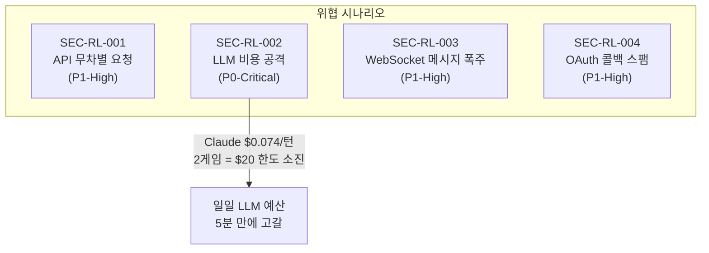
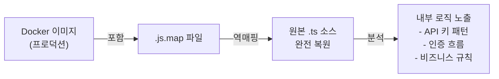

# 보안 리뷰: Rate Limit 및 PRNG 감사

- **작성일**: 2026-04-04
- **작성자**: Security Agent
- **범위**: game-server, ai-adapter, frontend, admin

---

## 1. Rate Limit 현황 감사

### 현재 상태: Rate Limiting 전무

전체 `src/` 디렉터리에서 `rate.?limit`, `throttle` 검색 결과, 어떤 서비스에도 Rate Limiting이 구현되어 있지 않다.

| 서비스 | 미들웨어 | Rate Limit |
|--------|---------|-----------|
| game-server | `gin.Recovery()`, `ZapLogger()`, `cors.New()` | **없음** |
| ai-adapter | `ValidationPipe` | **없음** (CostLimitGuard는 일일 총액만 체크) |

### 보호되지 않은 공개 엔드포인트

| 엔드포인트 | 인증 | 위험도 |
|-----------|------|--------|
| `POST /api/auth/google` | 없음 | OAuth 코드 교환 스팸 |
| `POST /api/auth/google/token` | 없음 | id_token 교환 스팸 |
| `POST /api/auth/dev-login` | 없음 | 개발 로그인 무차별 시도 |
| `GET /api/rankings` | 없음 | 조회 폭주 |
| `GET /ws` | 업그레이드 후 JWT | 연결 폭주 |

### 위협 모델



**SEC-RL-002 (P0-Critical)**: 인증된 사용자 1명이 AI 3명(Claude $0.074/턴) 방을 생성하면, ~2게임(5분)만에 $20 일일 LLM 예산을 소진할 수 있다. CostLimitGuard는 한도 도달 후에만 차단하며, 시간당/사용자별 빈도 제한이 없다.

---

## 2. PRNG 감사

### Go 코드: `math/rand` 사용 2건

| 파일 | 용도 | 심각도 | 분석 |
|------|------|--------|------|
| `engine/pool.go:5,28` | 타일 셔플 (Fisher-Yates) | **P3-Low** | Go 1.24에서 `crypto/rand` 자동 시드. 실머니 도박이 아닌 LLM 전략 비교 플랫폼 |
| `service/room_service.go:5,401` | 4자리 방 코드 생성 (22^4=234,256) | **P3-Low** | 방 접근에 JWT + UUID 필요. 방 코드는 보조 식별자 |

### TypeScript 코드: `Math.random()` 사용 0건

ai-adapter, frontend 전체에서 `Math.random()` 미사용 확인. **안전.**

### UUID / JWT Secret

- UUID: `github.com/google/uuid` → 내부 `crypto/rand` 호출. **안전.**
- JWT Secret: 프로덕션 미설정 시 서버 시작 거부 (**양호**). 개발 환경 빈 문자열 허용 (Minor).

---

## 3. 소스맵 감사

| 서비스 | 소스맵 설정 | 상태 |
|--------|-----------|------|
| frontend | `productionBrowserSourceMaps` 미설정 (기본 `false`) | **안전** |
| admin | 동일 | **안전** |
| ai-adapter | `tsconfig.build.json` — `"sourceMap": true` | **P2-취약** |
| game-server | `-trimpath -ldflags="-s -w"` 빌드 | **안전** |

**SEC-SM-001 (P2-Medium)**: ai-adapter `tsconfig.build.json:10`에서 `sourceMap: true` 활성. Dockerfile이 `dist/` 전체를 복사하므로 `.js.map` 파일이 프로덕션 이미지에 포함된다.

**권장**: `"sourceMap": false` 또는 Dockerfile에 `RUN find ./dist -name "*.map" -delete` 추가.

---

## 4. 추가 발견사항

| ID | 심각도 | 내용 |
|----|--------|------|
| SEC-ADD-001 | P2-Medium | Google id_token JWKS 서명 검증 미구현 (`auth_handler.go:271-273`). Base64 디코딩만 수행 |
| SEC-ADD-002 | P2-Medium | 보안 응답 헤더 미설정 (CSP, X-Frame-Options, X-Content-Type-Options, HSTS) |
| SEC-ADD-003 | P3-Low | 채팅 메시지 길이 검증(200자)만, HTML/스크립트 태그 서버측 새니타이징 없음 |
| SEC-ADD-004 | P3-Low | WebSocket `CheckOrigin`이 빈 Origin 허용 |

---

## 5. 우선순위 액션 테이블

| 우선순위 | ID | 조치 | 담당 |
|---------|-----|------|------|
| **P0-Critical** | SEC-RL-002 | 시간당 비용 한도 + 사용자별 AI 게임 쿨다운 구현 | Go Dev + Node Dev |
| **P1-High** | SEC-RL-001 | Redis 기반 Rate Limit (gin middleware + @nestjs/throttler) | Go Dev + Node Dev |
| **P1-High** | SEC-RL-003 | WS 메시지 빈도 제한 (채팅 5/10초, 액션 20/분) | Go Dev |
| **P1-High** | SEC-RL-004 | OAuth 콜백 IP 기반 제한 (10 req/min) | Go Dev |
| **P2-Medium** | SEC-SM-001 | ai-adapter 소스맵 비활성화 | Node Dev |
| **P2-Medium** | SEC-ADD-001 | Google JWKS 서명 검증 구현 | Go Dev |
| **P2-Medium** | SEC-ADD-002 | 보안 응답 헤더 추가 | Go Dev + DevOps |
| **P3-Low** | SEC-PRNG-001/002 | `math/rand` → `crypto/rand` 선택적 마이그레이션 | Go Dev |

---

## 6. 수정 이력 (2026-04-04 당일 해결)

### SEC-RL-002 (P0-Critical → FIXED) — LLM 비용 공격 차단

**위협**: 인증된 사용자 1명이 Claude AI 3명($0.074/턴)으로 방을 연속 생성하면 ~5분에 $20 일일 한도를 소진할 수 있었다.

**2중 방어로 해결:**

| 계층 | 구현 | 파일 |
|------|------|------|
| game-server | AI 게임 생성 **5분 쿨다운** (Redis TTL, admin bypass, fail-open) | `cooldown.go`, `room_service.go`, `room_handler.go` |
| ai-adapter | **시간당 사용자별 비용 한도 $5/h** (gameId 기반 Redis 추적) | `cost-tracking.service.ts`, `cost-limit.guard.ts`, `move.service.ts` |

- 커밋: `0a619e9`
- 테스트: Go 7건 + NestJS 23건 PASS

### SEC-RL-001 (P1-High → FIXED) — Rate Limit 구현

- game-server: Redis 기반 Fixed Window Counter middleware, 5정책 (커밋 `7baed23`)
- ai-adapter: `@nestjs/throttler` guard, `/move` 20/min, 기본 30/min (커밋 `7baed23`)
- frontend: RateLimitToast + API 자동 재시도 + WS throttle (커밋 `7baed23`)

### SEC-RL-004 (P1-High → FIXED) — OAuth 콜백 제한

- `LowFrequencyPolicy` (10 req/min) 적용 (커밋 `7baed23`)

### SEC-SM-001 (P2-Medium → FIXED) — 소스맵 제거

`ai-adapter/tsconfig.build.json`에서 `sourceMap: true → false` 변경 (커밋 `0a619e9`)

상세 설명은 아래 부록 A 참조.

### 미해결 잔여 항목

| 우선순위 | ID | 내용 | 상태 |
|---------|-----|------|------|
| P1-High | SEC-RL-003 | WS 서버측 메시지 빈도 제한 (채팅 5/10초, 액션 20/분) | 미해결 (클라이언트 throttle만 있음) |
| P2-Medium | SEC-ADD-001 | Google id_token JWKS 서명 검증 | 미해결 |
| P2-Medium | SEC-ADD-002 | 보안 응답 헤더 (CSP, X-Frame-Options 등) | 미해결 |
| P3-Low | SEC-PRNG-001/002 | `math/rand` → `crypto/rand` | 미해결 (수용 가능) |
| P3-Low | SEC-ADD-003/004 | 채팅 새니타이징, WS Origin | 미해결 (수용 가능) |

---

## 부록 A. sourceMap 해설 — 왜 프로덕션에서 비활성화해야 하는가

### 소스맵이란?

소스맵(`.map` 파일)은 컴파일된 JavaScript 코드를 원본 TypeScript 소스로 역추적할 수 있게 해주는 매핑 파일이다.

```
원본 (TypeScript)              빌드 결과 (JavaScript)           소스맵 (.js.map)
━━━━━━━━━━━━━━━━━━            ━━━━━━━━━━━━━━━━━━━━━           ━━━━━━━━━━━━━━━━━
class CostGuard {         →   "use strict";var a=...     ←→   {"sources":["cost-limit.guard.ts"],
  async canActivate() {                                         "mappings":"AAAA,OAAO..."}
    ...
  }
}
```

### `sourceMap: true` 상태의 위험

Docker 이미지에 `.map` 파일이 포함되면, 공격자가 컨테이너에 접근(또는 이미지를 pull)했을 때 **원본 TypeScript 소스 전체를 복원**할 수 있다.



**실제 사례 — Claude Code npm 소스맵 유출 (2026-03-31)**:

- Anthropic이 npm 패키지에 소스맵을 포함한 채 배포
- TypeScript 원본 **51만 줄** 전량 노출
- `/buddy`, always-on agent 등 비공개 기능의 내부 로직이 전부 드러남
- 난독화, 트리셰이킹을 거쳤더라도 소스맵 하나로 전부 무력화

### `sourceMap: false`로 변경 시 효과

| 항목 | `true` (변경 전) | `false` (변경 후) |
|------|-----------------|------------------|
| `.map` 파일 생성 | 빌드마다 생성 | **생성 안 됨** |
| Docker 이미지 | `.map` 포함 → 소스 복원 가능 | **원본 매핑 정보 없음** |
| 프로덕션 디버깅 | 소스맵으로 라인 매핑 가능 | 로그 기반 디버깅 (충분) |
| 빌드 산출물 크기 | 더 큼 | **더 작음** |
| 보안 | 소스 역공학 가능 | **역공학 원천 차단** |

### 변경 내역

```json
// src/ai-adapter/tsconfig.build.json
{
  "compilerOptions": {
-   "sourceMap": true,
+   "sourceMap": false,
  }
}
```

### 다른 서비스 현황

| 서비스 | 소스맵 | 상태 |
|--------|--------|------|
| **ai-adapter** | `false` (수정됨) | **안전** |
| frontend (Next.js) | `productionBrowserSourceMaps` 미설정 (기본 `false`) | 안전 |
| admin (Next.js) | 동일 | 안전 |
| game-server (Go) | `-trimpath -ldflags="-s -w"` 빌드 | 안전 (디버그 심볼 제거) |

### 참고

- 개발 환경(`tsconfig.json`)의 소스맵은 `true`로 유지해도 무방하다. 프로덕션 빌드 전용 설정(`tsconfig.build.json`)만 `false`이면 된다.
- Next.js의 `productionBrowserSourceMaps`는 **브라우저에 노출되는** 소스맵만 제어한다. 서버 사이드 소스맵은 별도이나, Docker 이미지에 포함되지 않으면 문제없다.
