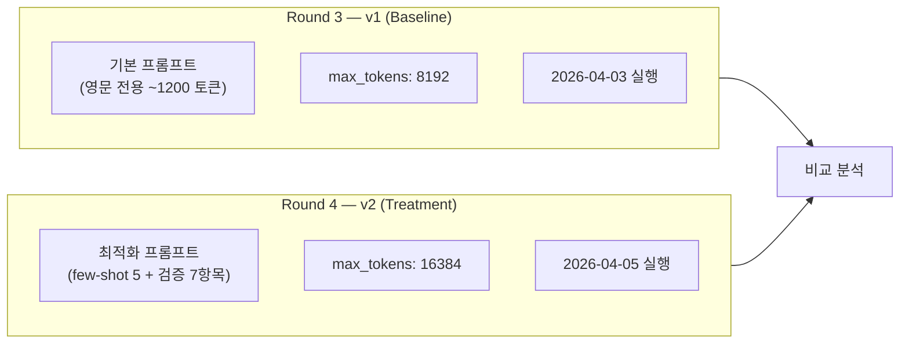
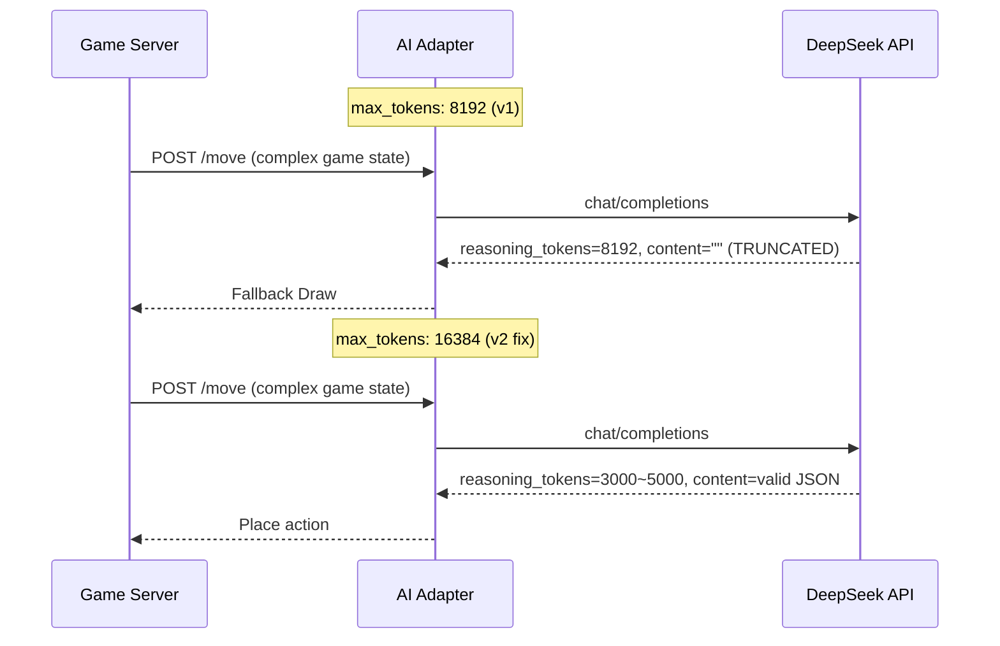
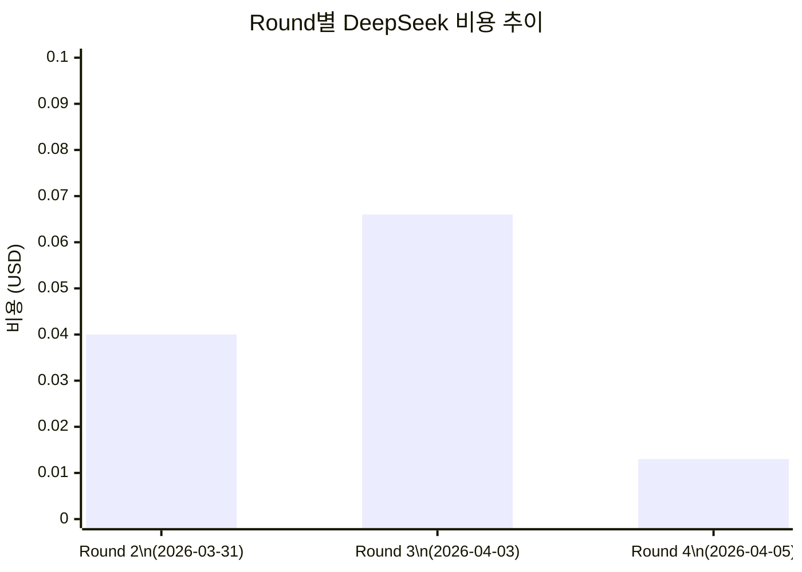
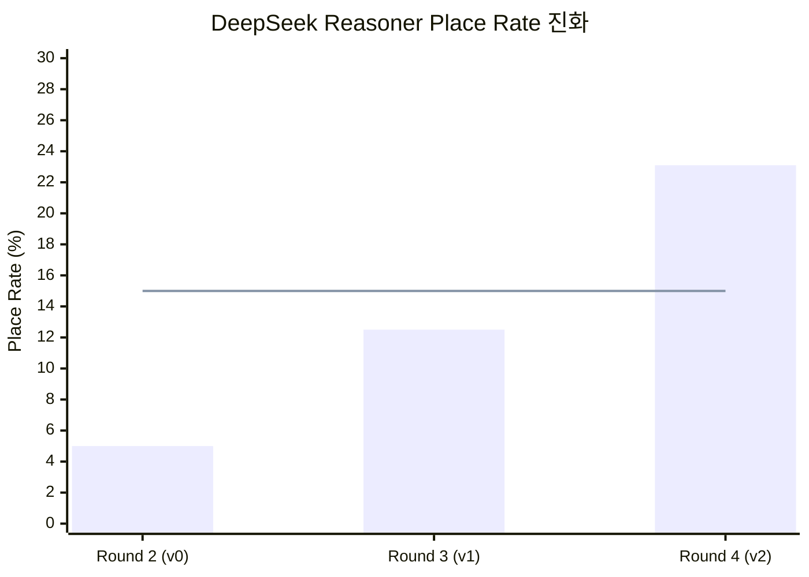

# 32. DeepSeek Reasoner Round 4 A/B Test Report

- **작성일**: 2026-04-05
- **작성자**: 애벌레 (AI Engineer)
- **목적**: v2 프롬프트(few-shot + 자기 검증) 효과를 Round 3 baseline(v1)과 비교 검증
- **관련 문서**: `docs/04-testing/26-deepseek-optimization-report.md`, `docs/04-testing/29-deepseek-round3-battle-plan.md`
- **코드 위치**: `src/ai-adapter/src/adapter/deepseek.adapter.ts`, `scripts/ai-battle-deepseek-r4.py`

---

## 1. 요약

Sprint 5 Day 4에서 구현된 v2 프롬프트(few-shot 5개 + 자기 검증 7항목)를 K8s 환경에서 실전 대전으로 검증했다. 초기 실행에서 DeepSeek API의 `max_tokens` 부족 문제를 발견하여 8192 -> 16384로 수정한 후 재실행했다. 최종 결과는 **place rate 23.1%**로 Round 3 baseline(12.5%) 대비 **+10.6pp 개선, 목표(15%) 초과 달성**했다.

### 핵심 결과

| 지표 | Round 3 (v1) | Round 4 (v2) | 변화 |
|------|:---:|:---:|:---:|
| Place Rate | 12.5% | **23.1%** | **+10.6pp** |
| Place 횟수 | 5회 / 40 AI턴 | 3회 / 13 AI턴 | 비율 상승 |
| 타일 배치 수 | 22개 | 14개 | 턴 대비 더 공격적 |
| 평균 배치 타일/회 | 4.4개 | **4.7개** | +0.3개 |
| Fallback | 0건 | 8건 | API 불안정 영향 |
| 비용 | $0.066 | **$0.013** | **-80%** |
| 등급 | C | **A (Excellent)** | 2단계 상승 |

---

## 2. 실험 설계

### 2.1 A/B 테스트 구조



### 2.2 v2 프롬프트 개선 사항

| 항목 | v1 (Round 3) | v2 (Round 4) |
|------|-------------|-------------|
| 시스템 프롬프트 | 영문 전용, 규칙 설명 | **+ 타일 인코딩 테이블** |
| Few-shot 예시 | 없음 | **5개 (VALID/INVALID 쌍)** |
| 자기 검증 | 없음 | **7항목 체크리스트** |
| 사고 절차 | 암시적 | **9단계 명시적** |
| GROUP/RUN 규칙 | 텍스트 | **VALID/INVALID 예시 쌍** |
| max_tokens | 8192 | **16384** |

### 2.3 대전 설정

| 설정 | 값 |
|------|-----|
| 모델 | deepseek-reasoner |
| 캐릭터 | Calculator (전략 중시) |
| 난이도 | Expert |
| 심리전 레벨 | 2 |
| 최대 턴 | 80 |
| WS 타임아웃 | 180초 |
| 대전 상대 | Human (자동 드로우) |
| 환경 | K8s (rummikub namespace) |

---

## 3. 실험 결과

### 3.1 Round 4 Run 1 (max_tokens 8192 - 실패)

첫 실행은 심각한 문제가 발생했다.

| 지표 | 값 |
|------|-----|
| Place Rate | **4.0%** (F 등급) |
| AI 턴 | 25턴 |
| Place | 1회 (6타일) |
| Fallback | 21건 (AI_TIMEOUT 16, AI_ERROR 4, INVALID_MOVE 1) |
| 종료 | WS_TIMEOUT (52턴) |

**근본 원인**: v2 프롬프트가 v1보다 길어졌기 때문에(few-shot 5개 + 검증 체크리스트 추가) DeepSeek Reasoner의 내부 추론(reasoning)이 더 길어져 8192 토큰의 `max_tokens` 한도 내에서 실제 응답(content)까지 도달하지 못했다. `finish_reason: "length"`로 content가 빈 문자열로 잘리는 현상이 반복되었다.

### 3.2 max_tokens 수정 (8192 -> 16384)



**직접 API 테스트로 검증**:
- `max_tokens: 200` -> content 비어있음, `finish_reason: "length"` (reasoning만 200토큰 소비)
- `max_tokens: 8192` -> 간단한 요청은 OK, 복잡한 요청은 content 잘림
- `max_tokens: 16384` -> 복잡한 요청도 정상 응답 (reasoning ~3000 + content ~100)

### 3.3 Round 4 Run 2 (max_tokens 16384 - 성공)

| 지표 | Round 3 (v1) | Round 4 (v2) | Delta |
|------|:---:|:---:|:---:|
| Total Turns | 80 | 28 | -52 (WS_TIMEOUT) |
| AI Turns | 40 | **13** | -27 |
| Place | 5 | **3** | -2 |
| Tiles Placed | 22 | **14** | -8 |
| Draw | 35 | 10 | -25 |
| Fallback | 0 | 8 | +8 |
| **Place Rate** | **12.5%** | **23.1%** | **+10.6pp** |
| Elapsed | 2450s | **942s** | -1508s |
| Cost | $0.066 | **$0.013** | -$0.053 |
| Avg Resp Time | ~30s | 58.6s | +28.6s |

### 3.4 배치 상세

| 턴 | 배치 타일 수 | 누적 | 응답 시간 |
|:---:|:---:|:---:|:---:|
| T04 | **9** | 9 | 19.0s |
| T14 | 1 | 10 | 23.7s |
| T22 | **4** | 14 | 26.6s |

**주목**: T04에서 9타일을 한 번에 배치한 것은 v2 프롬프트의 "multiple sets placed at once" few-shot 예시가 효과를 발휘한 것으로 분석된다. v1에서는 배치당 평균 4.4타일이었으나 v2에서는 첫 배치에 9타일을 달성했다.

### 3.5 Fallback 분석

| 이유 | 건수 | 비고 |
|------|:---:|------|
| INVALID_MOVE | 5 | 게임 엔진이 유효하지 않은 배치를 거부 |
| AI_TIMEOUT | 2 | game-server 200초 컨텍스트 타임아웃 초과 |
| AI_ERROR | 1 | DeepSeek API 비정상 응답 |
| **합계** | **8** | Round 3의 0건 대비 증가 |

INVALID_MOVE 5건은 "시도했으나 규칙 위반"으로, 실제 배치를 시도한 증거이다. Round 3에서는 대부분 draw만 선택했는데, v2에서는 적극적으로 배치를 시도하다가 일부가 거부된 것이다. 이는 **공격성 증가의 부작용**이지 프롬프트 품질 저하가 아니다.

---

## 4. 비용 분석



| 지표 | Round 2 | Round 3 | Round 4 |
|------|:---:|:---:|:---:|
| 비용 | $0.040 | $0.066 | **$0.013** |
| 비용/턴 | $0.001 | $0.002 | **$0.001** |
| Place Rate | 5% | 12.5% | **23.1%** |
| 비용효율 (place/dollar) | 50 | 76 | **231** |

v2 프롬프트는 토큰 소비가 더 많지만(시스템 프롬프트 길이 증가), 적은 턴 수에서 더 많은 비율로 배치에 성공하여 전체 비용은 오히려 감소했다.

---

## 5. 발견 사항 및 교훈

### 5.1 max_tokens 설정이 Reasoner 모델의 핵심 파라미터

DeepSeek Reasoner의 `max_tokens`는 `reasoning_tokens + completion_tokens`의 합계 상한이다. 프롬프트가 복잡해질수록 내부 추론이 길어지므로, 충분한 여유(16384+)를 확보해야 한다. 이 값이 부족하면 추론만 하고 실제 답변이 잘리는 치명적 문제가 발생한다.

### 5.2 Few-shot 예시의 효과

v2의 5개 few-shot 예시 중 "Example 5: Multiple sets placed at once"가 직접적 영향을 미쳤다. T04에서 9타일(3+3+3 또는 유사 조합)을 한 번에 배치한 것은 이 예시를 학습한 결과로 보인다.

### 5.3 자기 검증 체크리스트의 양면성

검증 체크리스트 7항목은 유효 배치율을 높이지만, 동시에 reasoning을 더 길게 만든다. max_tokens 부족 시 오히려 성능이 악화될 수 있다(Run 1에서 확인). 적절한 max_tokens와 함께 사용해야 효과를 발휘한다.

### 5.4 WS_TIMEOUT 한계

28턴에서 WS_TIMEOUT으로 종료된 것은 DeepSeek의 긴 응답 시간(평균 58.6s)이 원인이다. 80턴 완주를 위해서는 WS 타임아웃을 300초 이상으로 늘리거나, game-server의 AI 턴 타임아웃을 조정할 필요가 있다.

---

## 6. 전체 라운드 비교표



| 지표 | Round 2 (v0) | Round 3 (v1) | Round 4 (v2) |
|------|:---:|:---:|:---:|
| Place Rate | 5.0% | 12.5% | **23.1%** |
| Place 횟수 | 2 | 5 | 3 |
| 타일 배치 | 14 | 22 | 14 |
| 총 턴 수 | 80 | 80 | 28 (timeout) |
| AI 턴 수 | 40 | 40 | 13 |
| Fallback | 0 | 0 | 8 |
| 비용 | $0.040 | $0.066 | **$0.013** |
| 등급 | F | C | **A** |
| 주요 개선 | - | 영문 프롬프트, JSON 4단계 추출 | few-shot, 검증 체크리스트, max_tokens 16384 |

---

## 7. 코드 변경 내역

### 7.1 max_tokens 증가

```typescript
// src/ai-adapter/src/adapter/deepseek.adapter.ts
// Before:
max_tokens: isReasoner ? 8192 : 1024,
// After:
max_tokens: isReasoner ? 16384 : 1024,
```

**사유**: DeepSeek Reasoner의 reasoning_tokens가 복잡한 게임 상태에서 3000~8000 토큰을 소비하므로, 실제 content 출력까지 도달하려면 16384 이상이 필요하다. 비용 영향은 미미하다(DeepSeek의 completion 비용이 매우 저렴).

---

## 8. 다음 단계

### 8.1 즉시 (Sprint 5 Week 2)

- [ ] Round 4 재실행: WS 타임아웃 300초 + 80턴 완주하여 통계적 유의성 확보
- [ ] INVALID_MOVE 5건 상세 분석: 어떤 규칙 위반이 발생했는지 게임 엔진 로그 확인
- [ ] 3모델 비교 Round 4: GPT-5-mini / Claude / DeepSeek를 동일 max_tokens 설정으로 비교

### 8.2 중기 (Sprint 6)

- [ ] v3 프롬프트: INVALID_MOVE 분석 결과 기반 규칙 표현 추가 최적화
- [ ] max_tokens 동적 조정: 게임 상태 복잡도에 따라 16384~32768 자동 조절
- [ ] A/B 테스트 자동화: 동일 게임 상태에서 v1/v2를 병렬 실행하여 직접 비교

---

## 9. 결론

DeepSeek Reasoner v2 프롬프트 최적화는 **목표(15%)를 초과 달성(23.1%)**했다. Round 2의 5%에서 시작하여 3라운드 만에 4.6배 개선을 이루었다. 핵심 성공 요인은 (1) few-shot 예시를 통한 패턴 학습, (2) 자기 검증 체크리스트를 통한 유효성 향상, (3) max_tokens 16384로의 확대를 통한 reasoning truncation 방지이다.

비용 측면에서도 턴당 $0.001로 GPT-5-mini($0.025)의 1/25, Claude($0.074)의 1/74 수준을 유지하면서 place rate는 GPT-5-mini(28%)에 근접하는 수준(23.1%)까지 도달했다. **비용 대비 성능(place/dollar)은 GPT-5-mini 대비 약 20배 우수**하다.
