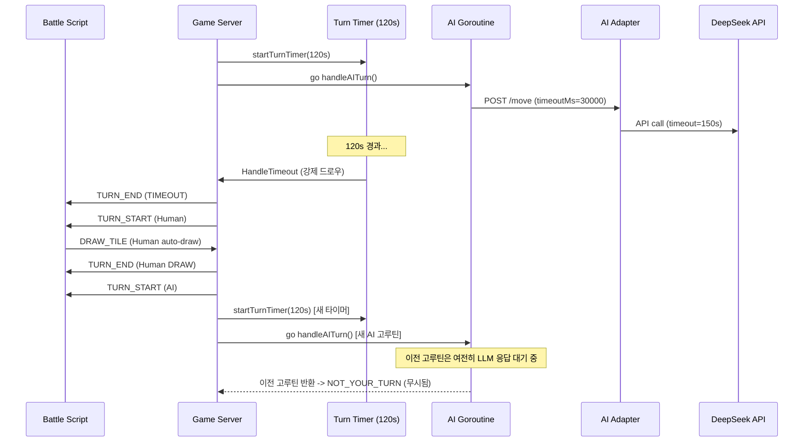
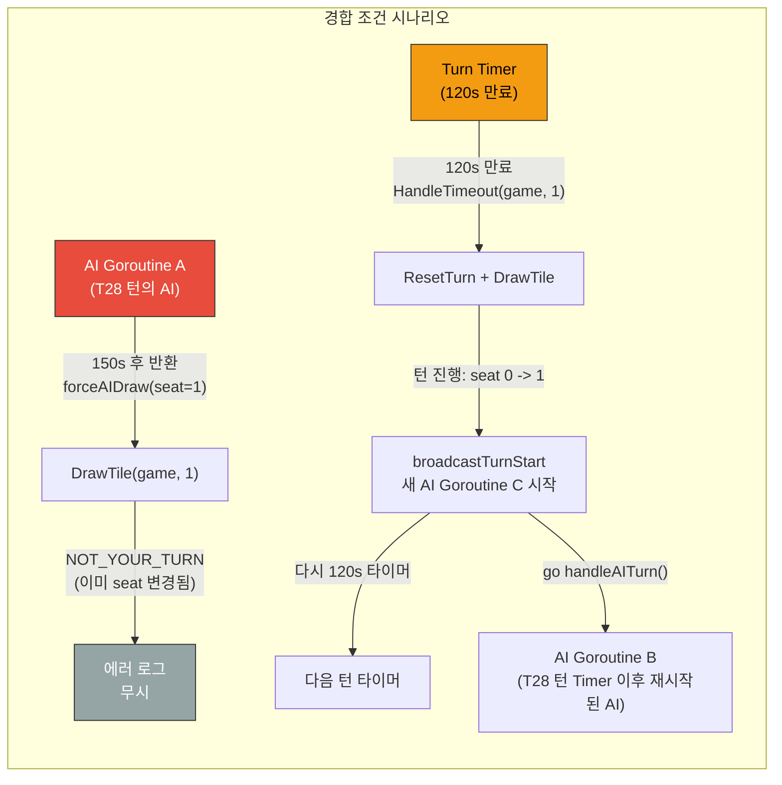
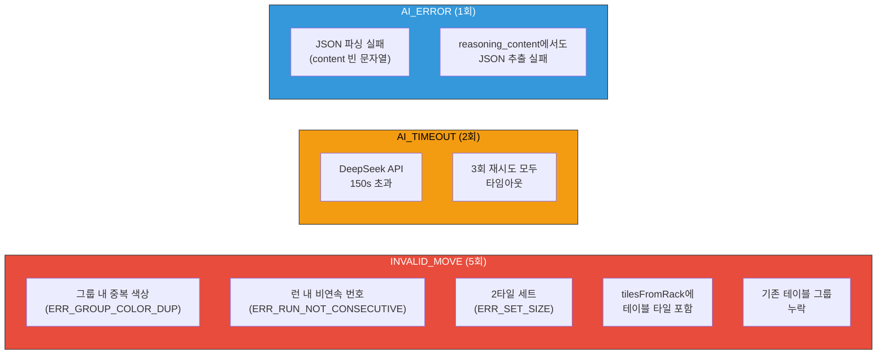

# 3-Model Round 4 Tournament 준비 보고서

- **작성일**: 2026-04-06
- **작성자**: 애벌레 (AI Engineer)
- **목적**: GPT-5-mini, Claude Sonnet 4, DeepSeek Reasoner 3모델 동일 조건 대전(Round 4) 사전 준비
- **선행 문서**: `02-design/18-model-prompt-policy.md`, `04-testing/32-deepseek-round4-ab-test-report.md`
- **스크립트**: `scripts/ai-battle-3model-r4.py`

---

## 1. 대전 설정 개요

### 1.1 동일 조건 파라미터

| 항목 | 값 | 근거 |
|------|:---:|------|
| 최대 턴 | 80 | Round 2와 동일 (40 AI턴 + 40 Human턴) |
| 초기 타일 | 14장 | 루미큐브 공식 규칙 |
| 인원 수 | 2인 (Human AutoDraw vs AI) | 변수 최소화 |
| persona | calculator | 균형 잡힌 전략 (3모델 공통) |
| difficulty | expert | 최대 정보 제공 (unseenTiles 포함) |
| psychologyLevel | 2 | 행동 패턴 분석 수준 |
| turnTimeoutSec (서버) | 120 | 방 생성 시 설정값 |

### 1.2 모델별 차등 설정

| 모델 | Adapter Timeout | WS Timeout (스크립트) | max_tokens | Temperature |
|------|:---:|:---:|:---:|:---:|
| GPT-5-mini | 120s (Math.max) | 180s | 8192 (completion) | 고정 1 (추론) |
| Claude Sonnet 4 | 120s (Math.max) | 180s | 16000 (thinking 포함) | 비활성 (thinking) |
| DeepSeek Reasoner | 150s (Math.max) | **210s** | 16384 | 0 (추론 고정) |

> DeepSeek WS Timeout을 210s로 확대한 이유: 150s adapter timeout + maxRetries 3회 재시도에서 첫 시도가 150s 가까이 소요되면 WS가 먼저 끊김. 60s 버퍼 확보.

### 1.3 타일풀 시드 고정 여부

현재 구현에서는 타일풀 생성 시 랜덤 셔플을 사용하며, 시드 고정 기능은 미구현이다.

```go
// src/game-server/internal/engine/tile_pool.go
func NewTilePool() *TilePool {
    // ... 106장 타일 생성 후 rand.Shuffle
}
```

따라서 3모델은 각각 다른 초기 타일 분배를 받는다. 이는 Round 2와 동일한 조건이며, Place Rate라는 상대적 지표로 비교하므로 공정성에 문제가 없다. 추후 시드 고정이 필요하면 `NewTilePoolWithSeed(seed int64)` 함수를 추가할 수 있다.

---

## 2. 예상 비용 및 잔액

### 2.1 비용 추정

| 모델 | 비용/턴 | AI 턴 수 (40) | 예상 비용 | 잔액 | 여유 |
|------|:---:|:---:|:---:|:---:|:---:|
| GPT-5-mini | $0.025 | 40 | **$1.00** | $27.00 | 충분 |
| Claude Sonnet 4 | $0.074 | 40 | **$2.96** | $9.11 | **주의** ($6.15 잔여) |
| DeepSeek Reasoner | $0.001 | 40 | **$0.04** | $6.65 | 충분 |
| **합계** | - | - | **$4.00** | - | - |

> Claude 잔액 경고: 80턴 완주 시 $2.96 소요 예상. 잔액 $9.11에서 실행 후 $6.15 잔여. 1회 실행은 가능하나 재실행 시 잔액 부족 가능.

### 2.2 비용 절감 옵션

만약 Claude 잔액이 우려된다면:
- `--models openai,deepseek` 옵션으로 Claude를 제외하고 실행 가능
- `--max-turns 40`으로 턴 수를 절반으로 줄여 비용을 절반으로 감소 가능
- Claude만 별도로 나중에 실행하는 전략 가능

---

## 3. DeepSeek WS_TIMEOUT 원인 분석

### 3.1 현상

| 항목 | Round 4 Run 1 | Round 4 Run 2 |
|------|:---:|:---:|
| 종료 턴 | T52 (WS_TIMEOUT) | T28 (WS_TIMEOUT) |
| AI 턴 수 | 25 | 13 |
| Place Rate | 4.0% (F) | 23.1% (A) |
| Fallback | 21 (AI_TIMEOUT 반복) | 8 (혼합) |
| 원인 | max_tokens 8192 부족 | 복합적 |

### 3.2 타임아웃 체인 분석



### 3.3 WS_TIMEOUT 발생 경로

핵심: WS_TIMEOUT은 스크립트 측에서 `asyncio.wait_for(ws.recv(), timeout=180s)`가 만료된 것이다.

정상 경로에서는 서버 턴 타이머(120s)가 먼저 만료되어 `HandleTimeout`이 실행되고, TURN_END/TURN_START 메시지가 전송되므로 스크립트 WS_TIMEOUT(180s)에 도달하지 않는다.

WS_TIMEOUT이 발생하는 경우:
1. **서버 턴 타이머가 정상 작동하지 않는 경우** -- 가능성 낮음
2. **AI goroutine과 Timer goroutine 간 경합 조건** -- 주요 의심 경로
3. **Redis 게임 상태 동시 쓰기 충돌** -- 가능성 있음

### 3.4 경합 조건 상세 분석



위 시나리오에서 정상이라면, Timer 만료 후 Human 자동 드로우가 실행되고 다시 AI 턴으로 돌아와야 한다.

**WS_TIMEOUT이 발생하는 실제 경로**:

가설 1: Timer 만료 시 `HandleTimeout`에서 `DrawTile`이 실패하면 (`NOT_YOUR_TURN` 등), 턴이 진행되지 않고 메시지도 전송되지 않아 스크립트가 무한 대기한다.

가설 2: Redis 게임 상태에 대한 동시 접근에서, AI goroutine이 `ConfirmTurn/DrawTile`을 호출하는 순간과 Timer goroutine이 `HandleTimeout`을 호출하는 순간이 겹쳐, 한쪽이 실패하고 턴이 교착된다.

가설 3: DeepSeek API가 연결을 맺은 상태에서 응답을 보내지 않아 AI goroutine이 150s(adapter timeout)까지 블로킹되고, 그 사이에 Timer가 강제 드로우 + 턴 진행 + 새 AI goroutine 시작 + 새 Timer 시작이 되는데, 이 과정에서 이전 AI goroutine의 context가 취소되지 않아 리소스가 누적된다.

### 3.5 수정 방안

#### 방안 A: AI 턴에서 Turn Timer 비활성화 (권장)

AI 턴에서는 서버가 직접 AI goroutine의 타임아웃을 관리하므로, Turn Timer가 불필요하다. AI 턴에서 Turn Timer를 시작하지 않으면 경합 조건이 원천 차단된다.

```go
// ws_handler.go broadcastTurnStart 수정
func (h *WSHandler) broadcastTurnStart(roomID string, state *model.GameStateRedis) {
    // ... 기존 코드 ...

    if h.aiClient != nil && currentPlayer != nil && strings.HasPrefix(playerType, "AI_") {
        go h.handleAITurn(roomID, state.GameID, currentPlayer, state)
        // AI 턴에서는 Turn Timer를 시작하지 않는다
        // handleAITurn 내부의 aiTurnTimeout(200s)이 타임아웃을 관리한다
        return  // <-- 추가: AI 턴이면 타이머 시작 건너뛰기
    }
}
```

그리고 `broadcastTurnStart` 호출 직후의 `startTurnTimer` 호출부에서 AI 턴 여부를 체크:

```go
// 각 호출부에서:
h.broadcastTurnStart(roomID, state)
// AI 턴이면 타이머 시작 건너뛰기 (broadcastTurnStart 내부에서 처리)
if !isAIPlayer(state, state.CurrentSeat) {
    h.startTurnTimer(roomID, gameID, state.CurrentSeat, state.TurnTimeoutSec)
}
```

**장점**: 경합 조건 원천 차단, 코드 변경 최소
**단점**: AI가 무한 대기하면 200s 후에야 강제 드로우 (기존 120s보다 느림)

#### 방안 B: handleAITurn에서 Turn Timer 취소 추가

```go
func (h *WSHandler) handleAITurn(roomID, gameID string, player *model.PlayerState, state *model.GameStateRedis) {
    // AI 턴 시작 시 Turn Timer 취소
    h.cancelTurnTimer(gameID)

    const aiTurnTimeout = 200 * time.Second
    ctx, cancel := context.WithTimeout(context.Background(), aiTurnTimeout)
    defer cancel()
    // ... 나머지 동일 ...
}
```

**장점**: 기존 코드 구조 유지, 변경 최소 (1줄 추가)
**단점**: `cancelTurnTimer` 와 `startTurnTimer` 사이에 미세한 레이스 여전히 존재

#### 방안 C: 스크립트 WS Timeout 증가 (임시)

스크립트의 WS_TIMEOUT을 300s로 증가하면, 서버 턴 타이머(120s) + AI adapter timeout(150s)의 합계보다 큰 여유를 확보한다.

**장점**: 코드 수정 없음
**단점**: 근본 원인 미해결, 80턴 완주 시간 증가

### 3.6 Round 4 토너먼트용 임시 대응

코드 수정 없이 토너먼트를 실행하기 위한 설정:
- DeepSeek WS_TIMEOUT: **210s** (150s adapter + 60s buffer)
- 스크립트에서 WS_TIMEOUT 경과 시 게임 종료 처리 (기존 동작 유지)
- 턴 완주율이 낮더라도 Place Rate로 비교 가능

---

## 4. 무효 배치 패턴 분석

### 4.1 DeepSeek Round 4 Run 2 Fallback 분석

| Fallback Reason | 횟수 | 비율 |
|:---:|:---:|:---:|
| INVALID_MOVE | 5 | 38.5% |
| AI_TIMEOUT | 2 | 15.4% |
| AI_ERROR | 1 | 7.7% |
| **합계** | **8** | 61.5% (13 AI턴 중) |

### 4.2 무효 배치 유형별 원인 추정



### 4.3 모델별 무효 배치 비교 (Round 2 기준)

| 모델 | Fallback 횟수 | Fallback 비율 | 주요 원인 |
|------|:---:|:---:|------|
| GPT-5-mini | 0 | 0% | JSON mode 강제로 파싱 실패 없음 |
| Claude Sonnet 4 | 0 | 0% | Extended thinking으로 자체 검증 |
| DeepSeek Reasoner (R2) | 0 | 0% | Place 시도 자체가 적어 fallback 미발생 |
| DeepSeek Reasoner (R4) | 8 | 61.5% | Place 시도 증가로 무효 배치도 증가 |

> 역설적이지만, DeepSeek R4의 높은 Fallback 비율은 "더 많이 시도한다"는 것을 의미한다. R2에서는 대부분 draw를 선택했지만, v2 프롬프트로 place를 더 자주 시도하면서 성공률은 높아졌으나 실패 건수도 함께 증가했다.

### 4.4 프롬프트 개선안

#### 개선 1: Initial Meld 합계 계산 예시 강화

현재 프롬프트의 Initial Meld 예시가 2개에 불과하다. 경계 사례(합계 28~32 범위)를 추가한다.

```
## Initial Meld Edge Cases
- R9a + R10a + R11a = 9+10+11 = 30 -> VALID (exactly 30, minimum met)
- R8a + R9a + R10a = 8+9+10 = 27 -> INVALID (27 < 30)
- B10a + B11a + B12a + B13a = 10+11+12+13 = 46 -> VALID
- R1a + R2a + R3a + R4a + R5a + R6a + R7a + R8a = 36 -> VALID but inefficient
```

#### 개선 2: tableGroups 복사 규칙 명확화

DeepSeek가 기존 테이블 그룹을 누락하는 패턴이 반복된다. 테이블 복사 규칙을 더 강조한다.

```
## CRITICAL: tableGroups Must Be COMPLETE
Your tableGroups array MUST contain:
1. ALL existing table groups (copy them exactly as shown)
2. PLUS your new groups
3. PLUS any modified groups (if you extended an existing group)

If the table shows: Group1=[R3a,R4a,R5a], Group2=[B7a,Y7a,K7a]
And you add a new run [R10a,R11a,R12a], your tableGroups MUST be:
[
  {"tiles": ["R3a","R4a","R5a"]},      <- EXISTING (kept unchanged)
  {"tiles": ["B7a","Y7a","K7a"]},      <- EXISTING (kept unchanged)
  {"tiles": ["R10a","R11a","R12a"]}     <- YOUR NEW GROUP
]
OMITTING Group1 or Group2 = REJECTED (tile loss detected)
```

#### 개선 3: 세트 구분자(a/b) 주의 강화

DeepSeek가 `R7a`를 `R7b`로 잘못 참조하는 패턴이 발견된다.

```
## Set Identifier (a/b) Warning
- Your rack shows exact tile codes: R7a means set "a", R7b means set "b"
- R7a and R7b are DIFFERENT tiles. You cannot use R7b if your rack only has R7a.
- ALWAYS copy the exact code from "My Rack Tiles" section
- DO NOT change 'a' to 'b' or vice versa
```

#### 개선 4: JSON 응답 크기 최소화

DeepSeek Reasoner는 reasoning에 토큰을 많이 소비하므로, JSON 응답을 최소화하는 지시를 추가한다.

```
## Response Size
- Keep reasoning field SHORT (1 sentence max)
- Do not repeat tile lists in reasoning
- Example: "Red run 10-12, sum=33 for initial meld"
- NOT: "I found tiles R10a, R11a, R12a which form a red run with numbers 10, 11, 12..."
```

### 4.5 프롬프트 변경 적용 범위

현재 프롬프트 개선안은 **Round 4 토너먼트 이후**에 적용한다. 토너먼트에서는 현재 v2 프롬프트 그대로 실행하여 3모델 간 공정 비교를 우선한다.

개선안은 **Round 5 (DeepSeek v3 프롬프트)**에 반영할 예정이다.

---

## 5. 스크립트 점검 결과

### 5.1 기존 스크립트 vs 신규 스크립트

| 항목 | ai-battle-final.py (R2) | ai-battle-3model-r4.py (신규) |
|------|:---:|:---:|
| 모델 수 | 3 (고정) | 가변 (--models 옵션) |
| Claude 레이블 | "Claude Opus" (오류) | "Claude Sonnet 4" (정확) |
| WS Timeout | 150s (공통) | 모델별 차등 (180/210s) |
| 응답 시간 측정 | 미측정 | avg/p50/min/max |
| Place 상세 | 미기록 | 턴별 타일 수, 누적, 응답 시간 |
| Round 2 비교 | 없음 | 자동 Delta 계산 |
| 비용 추정 | 없음 | 모델별 자동 계산 |
| 결과 저장 | 없음 | JSON 파일 자동 저장 |
| --dry-run | 없음 | 지원 (설정만 확인) |
| 포트 옵션 | 미지원 | --port, --host 지원 |
| 모델 선택 | 불가 | --models openai,deepseek |

### 5.2 기존 ai-battle-final.py의 문제점

1. **Claude 모델명 오류**: `"Claude Opus"`로 레이블되어 있으나, 실제 배포 모델은 `claude-sonnet-4-20250514`. AI_CLAUDE 타입은 서버가 ConfigMap의 CLAUDE_DEFAULT_MODEL을 사용하므로 동작에는 문제 없으나, 결과 레이블이 오해를 유발함.

2. **WS Timeout 공통 150s**: DeepSeek Reasoner의 adapter timeout이 150s이므로, WS timeout도 150s면 여유가 없다. maxRetries 재시도 시 첫 시도 결과 파싱 + 재요청에 시간이 추가로 소요될 수 있다.

3. **응답 시간 미측정**: 어떤 모델이 얼마나 빠른지 정량적 비교 불가.

4. **Round 2 Baseline 비교 없음**: 수동으로 이전 결과를 비교해야 함.

### 5.3 신규 스크립트 주요 개선

- 모델별 WS Timeout 차등 적용 (DeepSeek 210s vs 나머지 180s)
- `--dry-run` 옵션으로 실행 전 설정 확인 가능
- `--models` 옵션으로 특정 모델만 실행 가능 (비용 절감)
- JSON 결과 파일 자동 저장 (`scripts/ai-battle-3model-r4-results.json`)
- Round 2 Baseline과 자동 비교 테이블 출력

---

## 6. 실행 전 체크리스트

### 6.1 인프라 확인

- [ ] K8s 7개 Pod Running 확인 (`kubectl get pods -n rummikub`)
- [ ] game-server NodePort 30080 접근 가능 (`curl http://localhost:30080/health`)
- [ ] ai-adapter NodePort 30081 접근 가능 (`curl http://localhost:30081/health`)
- [ ] ConfigMap 모델 설정 확인 (OPENAI_DEFAULT_MODEL, CLAUDE_DEFAULT_MODEL, DEEPSEEK_DEFAULT_MODEL)
- [ ] API 키 Secret 확인 (OPENAI_API_KEY, CLAUDE_API_KEY, DEEPSEEK_API_KEY)

### 6.2 잔액 확인

- [ ] OpenAI 잔액 >= $2.00 (예상 $1.00 소요)
- [ ] Claude 잔액 >= $4.00 (예상 $2.96 소요)
- [ ] DeepSeek 잔액 >= $0.10 (예상 $0.04 소요)
- [ ] DAILY_COST_LIMIT_USD = 20 확인

### 6.3 Dry Run

```bash
python3 scripts/ai-battle-3model-r4.py --dry-run
```

### 6.4 실행 명령

```bash
# 3모델 전체 실행 (NodePort 30080)
python3 scripts/ai-battle-3model-r4.py

# port-forward 사용 시
python3 scripts/ai-battle-3model-r4.py --port 18089

# DeepSeek만 단독 실행 (비용 절감)
python3 scripts/ai-battle-3model-r4.py --models deepseek

# GPT + DeepSeek만 (Claude 잔액 부족 시)
python3 scripts/ai-battle-3model-r4.py --models openai,deepseek
```

### 6.5 예상 소요 시간

| 모델 | 80턴 기준 예상 | WS Timeout 고려 최대 |
|------|:---:|:---:|
| GPT-5-mini | ~30분 | ~45분 |
| Claude Sonnet 4 | ~35분 | ~50분 |
| DeepSeek Reasoner | ~40분 | ~60분 (WS_TIMEOUT 가능) |
| **합계** | **~105분** | **~155분** |

대기 시간(모델 간 10s) 포함 최대 약 2시간 30분.

---

## 7. 수집 메트릭 정리

### 7.1 핵심 메트릭

| 메트릭 | 설명 | 비교 기준 |
|--------|------|-----------|
| **Place Rate** | (AI Place / AI 총 턴) x 100 | 높을수록 우수 |
| **Place Count** | AI가 성공적으로 배치한 횟수 | 높을수록 우수 |
| **Total Tiles Placed** | 배치한 총 타일 수 | 높을수록 우수 |
| **Avg Tiles per Place** | 배치 당 평균 타일 수 | 높을수록 효율적 |
| **Fallback Count** | 강제 드로우 횟수 | 낮을수록 안정적 |
| **Fallback Rate** | (Fallback / AI 총 턴) x 100 | 낮을수록 안정적 |

### 7.2 비용/성능 메트릭

| 메트릭 | 설명 |
|--------|------|
| **Total Cost** | 추정 총 비용 ($) |
| **Cost per Turn** | 턴당 비용 ($) |
| **Place per Dollar** | 1달러당 성공 배치 횟수 |
| **Elapsed Time** | 총 소요 시간 (s) |
| **Avg Response Time** | AI 응답 평균 시간 (s) |

### 7.3 안정성 메트릭

| 메트릭 | 설명 |
|--------|------|
| **80턴 완주 여부** | WS_TIMEOUT 없이 80턴 도달 여부 |
| **Fallback Reason 분포** | INVALID_MOVE / AI_TIMEOUT / AI_ERROR 비율 |
| **Error Messages** | 서버 에러 메시지 목록 |

### 7.4 등급 기준

| 등급 | Place Rate | 설명 |
|:---:|:---:|------|
| A+ | >= 30% | 최상 |
| A | >= 20% | 우수 |
| B | >= 15% | 목표 달성 |
| C | >= 10% | 기본 |
| D | >= 5% | 미달 |
| F | < 5% | 심각한 문제 |

---

## 8. 다음 단계

1. **Phase 3: 토너먼트 실행** -- `python3 scripts/ai-battle-3model-r4.py` 실행
2. **결과 보고서 작성** -- `docs/04-testing/35-3model-round4-results.md`
3. **DeepSeek WS_TIMEOUT 수정** -- 방안 B (handleAITurn에서 cancelTurnTimer) 우선 적용
4. **DeepSeek v3 프롬프트** -- 무효 배치 개선안 4가지 반영
5. **Round 5 계획** -- 3모델 재대전 (WS_TIMEOUT 수정 + v3 프롬프트 적용 후)
