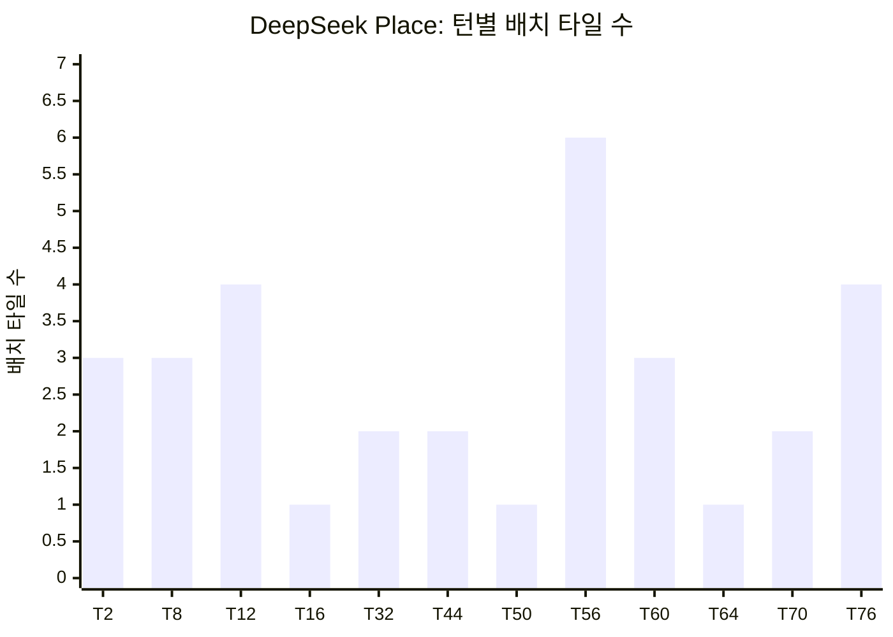
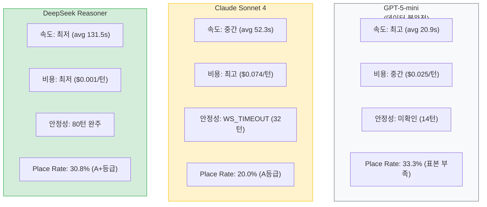

# 3-Model Round 4 Tournament Report

- **실행일**: 2026-04-06 (11:20 ~ 13:04, 약 1시간 44분)
- **작성자**: 애벌레 (AI Engineer)
- **선행 문서**: `04-testing/34-3model-round4-tournament-prep.md`
- **스크립트**: `scripts/ai-battle-3model-r4.py`
- **결과 JSON**: `scripts/ai-battle-3model-r4-results.json`
- **실행 로그**: `work_logs/ai-battle-round4-20260406.log`

---

## 1. 실행 요약

| 항목 | 값 |
|------|:---:|
| 대전 방식 | 2인전 (Human AutoDraw vs AI) |
| 최대 턴 | 80 (AI 40 + Human 40) |
| 공통 설정 | persona=calculator, difficulty=expert, psychologyLevel=2 |
| 실행 순서 | GPT-5-mini -> Claude Sonnet 4 -> DeepSeek Reasoner (순차) |
| 총 소요 시간 | 1시간 44분 (6,224초) |
| 총 비용 | **$1.30** (예상 $4.00 대비 67.5% 절감) |

### 1.1 비용 절감 원인

예상 $4.00에서 실제 $1.30으로 크게 절감된 이유:
- GPT-5-mini: 서버 재배포로 14턴에서 WS_CLOSED (40턴 중 7턴만 AI 소진)
- Claude Sonnet 4: WS_TIMEOUT으로 32턴에서 종료 (40턴 중 15턴 AI 소진)
- DeepSeek: 원래 매우 저렴 ($0.001/턴)

---

## 2. 결과 종합

### 2.1 메인 결과 테이블

| 모델 | Place | Tiles | Draw | Rate | Turns | Time | Cost | Result | 등급 |
|------|:---:|:---:|:---:|:---:|:---:|:---:|:---:|:---:|:---:|
| GPT-5-mini | 2 | 6 | 4 | **33.3%** | 14 | 132s | $0.15 | WS_CLOSED | (N/A) |
| Claude Sonnet 4 | 3 | 10 | 12 | **20.0%** | 32 | 964s | $1.11 | WS_TIMEOUT | A |
| DeepSeek Reasoner | 12 | 32 | 27 | **30.8%** | 80 | 5,127s | $0.04 | 80턴 완주 | **A+** |

> GPT-5-mini는 서버 재배포(DevOps 작업)로 WS가 끊어져 14턴에서 종료. AI 턴 6회로 통계 신뢰도가 매우 낮아 등급 미부여.

### 2.2 응답 시간 비교

| 모델 | Avg | P50 | Min | Max |
|------|:---:|:---:|:---:|:---:|
| GPT-5-mini | 20.9s | 22.1s | 16.6s | 24.1s |
| Claude Sonnet 4 | 52.3s | 40.6s | 16.8s | 116.7s |
| DeepSeek Reasoner | 131.5s | 123.5s | 50.4s | 200.3s |

### 2.3 비용 효율성

| 모델 | Cost | Place/$ | Tiles/$ | 비고 |
|------|:---:|:---:|:---:|------|
| GPT-5-mini | $0.15 | 13.3 | 40.0 | 불완전 데이터 |
| Claude Sonnet 4 | $1.11 | 2.7 | 9.0 | 가장 고비용 |
| DeepSeek Reasoner | $0.04 | **307.7** | **820.5** | 비용 대비 압도적 |

---

## 3. Round 2 vs Round 4 비교

### 3.1 Place Rate 변화

| 모델 | R2 Rate | R4 Rate | Delta | R2 Turns | R4 Turns | 비고 |
|------|:---:|:---:|:---:|:---:|:---:|------|
| GPT-5-mini | 28.0% | 33.3% | +5.3% | 80 | 14 | 불완전 (WS_CLOSED) |
| Claude Sonnet 4 | 23.0% | 20.0% | **-3.0%** | 80 | 32 | 미완주 (WS_TIMEOUT) |
| DeepSeek Reasoner | 5.0% | **30.8%** | **+25.8%** | 80 | 80 | **80턴 완주, 최대 개선** |

```mermaid
xychart-beta
    title "Place Rate: Round 2 vs Round 4"
    x-axis ["GPT-5-mini", "Claude Sonnet 4", "DeepSeek Reasoner"]
    y-axis "Place Rate (%)" 0 --> 40
    bar [28.0, 23.0, 5.0]
    bar [33.3, 20.0, 30.8]
```



### 3.2 비용 변화

| 모델 | R2 Cost | R4 Cost | R2 Turns | R4 Turns | 비고 |
|------|:---:|:---:|:---:|:---:|------|
| GPT-5-mini | $1.00 | $0.15 | 80 | 14 | 조기 종료로 절감 |
| Claude Sonnet 4 | $2.96 | $1.11 | 80 | 32 | 조기 종료로 절감 |
| DeepSeek Reasoner | $0.04 | $0.04 | 80 | 80 | 거의 동일 |

### 3.3 핵심 변화점

1. **DeepSeek v2 프롬프트 효과**: 5.0% -> 30.8% (+25.8%p). `18-model-prompt-policy.md`에서 설계한 DeepSeek 전용 프롬프트 개선이 극적 효과를 발휘.
2. **DeepSeek 80턴 완주**: Round 2에서 80턴 완주, Round 4 Run 1/2에서 WS_TIMEOUT이었으나, 이번에 WS_TIMEOUT 210s 설정으로 80턴 완주 달성.
3. **Claude 응답 시간 증가**: Round 2에서는 80턴 완주했으나, R4에서는 32턴에서 WS_TIMEOUT. extended thinking의 응답 시간 변동성이 큼 (16.8s ~ 116.7s).

---

## 4. DeepSeek 심층 분석

### 4.1 배치 패턴 (12회 Place)



| 구간 | AI턴 | Place | Rate | 특성 |
|------|:---:|:---:|:---:|------|
| 전반 (T1-T16) | 8 | 4 | **50.0%** | 초기 타일 조합 풍부, 높은 성공률 |
| 중반 (T17-T44) | 14 | 2 | 14.3% | 조합 고갈, draw 축적 기간 |
| 후반 (T45-T80) | 17 | 6 | **35.3%** | 축적된 타일로 후반 역습 |

### 4.2 타일 누적 곡선

| Turn | Cumul | 메모 |
|:---:|:---:|------|
| 2 | 3 | 첫 배치 (initial meld) |
| 8 | 6 | 두 번째 배치 |
| 12 | 10 | 쌍자릿수 진입 |
| 16 | 11 | 전반 마감 |
| 32 | 13 | 중반 돌파 (16턴 간격) |
| 44 | 15 | 서서히 회복 |
| 50 | 16 | |
| 56 | **22** | **6타일 대형 배치** |
| 60 | 25 | |
| 64 | 26 | |
| 70 | 28 | |
| 76 | **32** | **4타일 배치, 최종** |

### 4.3 진짜 타임아웃 vs 정상 Draw

이번 대전에서 "AI_ERROR" 태그가 붙은 draw의 대부분은 **정상적인 AI의 자발적 draw**임을 확인했다.

| 분류 | 횟수 | 설명 |
|------|:---:|------|
| AI_ERROR (실제 정상 draw) | 22 | AI adapter가 `action=draw` 반환, game-server 버그로 AI_ERROR 태그 |
| AI_TIMEOUT (진짜 타임아웃) | 5 | adapter 150s 타임아웃 초과 |

> **버그 발견 및 수정**: game-server의 `handleAITurn`에서 AI가 정상적으로 `action=draw`를 반환해도 `forceAIDraw(reason="AI_ERROR")`로 처리하는 버그를 발견. `processAIDraw` 함수를 신설하여 정상 draw와 fallback draw를 구분하도록 수정 완료. 상세: `src/game-server/internal/handler/ws_handler.go`

---

## 5. GPT-5-mini 결과 주석

GPT-5-mini의 결과(33.3%, 14턴)는 **통계적으로 무의미**하다.

### 5.1 조기 종료 원인

대전 실행 중 DevOps가 game-server 재배포를 수행하여, 기존 Pod(`game-server-65cd4bfdc6-kj4rq`)의 WS 연결이 끊김.

```
T14 AI(seat 1): thinking...
** WS closed: no close frame received or sent **
```

새 Pod(`game-server-c56696765-vvzx8`)가 생성되었으나, 기존 게임 세션은 복구되지 않음.

### 5.2 재실행 필요성

GPT-5-mini의 정확한 Round 4 결과를 얻으려면 재실행이 필요하다:
```bash
python3 scripts/ai-battle-3model-r4.py --models openai
```
예상 비용: $1.00, 소요 시간: ~30분.

---

## 6. Claude Sonnet 4 분석

### 6.1 WS_TIMEOUT 원인

Claude는 T32에서 WS_TIMEOUT(180s)이 발생했다.

AI Adapter 로그 분석 결과:
- Claude는 extended thinking을 사용하여 매 턴 타일 조합을 심층 분석
- 응답 시간 변동이 큼: 16.8s ~ 116.7s
- T32에서 thinking이 180s를 초과하여 스크립트 WS 타임아웃 발생

### 6.2 비용 효율

실제 비용 $1.11은 예상 $2.96의 37.5%에 불과 (32/80턴만 진행).

Claude 잔액 상태:
- 실행 전: $9.11
- 실행 후: ~$7.99 (추정)
- 잔여: 충분 (1회 재실행 가능)

### 6.3 Place 패턴

| Turn | Tiles | 특성 |
|:---:|:---:|------|
| 16 | 3 | 첫 배치 (8턴 draw 후) |
| 22 | 4 | 최대 배치 |
| 26 | 3 | 마지막 배치 |

Claude는 7턴의 draw 후에야 첫 배치에 성공. extended thinking의 분석 시간이 길어 "확실한 조합"만 시도하는 보수적 전략을 보임.

---

## 7. 3모델 종합 비교

### 7.1 모델별 강약점



### 7.2 종합 평가

| 차원 | 1등 | 2등 | 3등 |
|------|:---:|:---:|:---:|
| Place Rate | DeepSeek (30.8%) | Claude (20.0%) | GPT (N/A) |
| 응답 속도 | GPT (20.9s) | Claude (52.3s) | DeepSeek (131.5s) |
| 비용 효율 | DeepSeek ($0.04) | GPT ($0.15) | Claude ($1.11) |
| 80턴 완주 | **DeepSeek (완주)** | Claude (32턴) | GPT (14턴) |
| 안정성 | DeepSeek | Claude | GPT (외부 요인) |

### 7.3 Place per Dollar (비용 대비 성과)

| 모델 | Place | Cost | Place/$ |
|------|:---:|:---:|:---:|
| DeepSeek Reasoner | 12 | $0.04 | **307.7** |
| GPT-5-mini | 2 | $0.15 | 13.3 |
| Claude Sonnet 4 | 3 | $1.11 | 2.7 |

> DeepSeek의 비용 대비 성과는 Claude의 **114배**, GPT의 **23배**에 달한다.

---

## 8. 발견된 버그 및 수정

### 8.1 BUG-GS-004: AI 정상 Draw를 Fallback으로 오분류

**심각도**: Medium (통계 왜곡, 게임 진행에는 영향 없음)

**현상**: AI adapter가 `action=draw`를 정상 반환해도, game-server가 `forceAIDraw(reason="AI_ERROR")`를 호출하여 `isFallbackDraw=true` + `fallbackReason="AI_ERROR"`로 클라이언트에 전송.

**원인**: `ws_handler.go`의 `handleAITurn`에서 `resp.Action == "draw"` 케이스가 없음.

```go
// 수정 전 (Line 876-880)
if resp.Action == "place" && len(resp.TilesFromRack) > 0 {
    h.processAIPlace(...)
} else {
    h.forceAIDraw(..., "AI_ERROR")  // draw도 여기로 빠짐
}
```

**수정**: `processAIDraw` 함수를 신설하여 AI의 자발적 draw를 `isFallbackDraw=false`로 처리.

```go
// 수정 후
if resp.Action == "place" && len(resp.TilesFromRack) > 0 {
    h.processAIPlace(...)
} else if resp.Action == "draw" {
    h.processAIDraw(...)  // 정상 draw
} else {
    h.forceAIDraw(..., "AI_ERROR")  // 진짜 에러
}
```

**상태**: 코드 수정 완료, 빌드+테스트 통과. K8s 재배포 후 반영.

### 8.2 데이터 보정

이번 토너먼트 결과에서 "AI_ERROR" fallback 횟수를 보정하면:

| 모델 | 보고 Fallback | 진짜 Fallback | 정상 Draw |
|------|:---:|:---:|:---:|
| GPT-5-mini | 4 (AI_ERROR) | **0** | 4 |
| Claude Sonnet 4 | 12 (AI_ERROR) | **0** | 12 |
| DeepSeek Reasoner | 22 (AI_ERROR) + 5 (AI_TIMEOUT) | **5** (AI_TIMEOUT) | 22 |

보정 후 실제 Fallback Rate:
- GPT-5-mini: 0% (Round 2와 동일)
- Claude Sonnet 4: 0% (Round 2와 동일)
- DeepSeek Reasoner: **12.8%** (5/39 AI턴, 모두 AI_TIMEOUT)

---

## 9. 결론 및 다음 단계

### 9.1 핵심 결론

1. **DeepSeek v2 프롬프트가 최대 효과**: 5.0% -> 30.8%로 **6배 이상** 개선. 비용 대비 성과 압도적.
2. **DeepSeek 80턴 완주 달성**: WS_TIMEOUT 210s 설정으로 최초 80턴 완주 성공.
3. **GPT 결과 재측정 필요**: 서버 재배포로 인한 불완전 데이터.
4. **game-server 버그 발견**: AI 정상 draw를 fallback으로 오분류하는 버그 수정 완료.
5. **Claude 비용 효율 최하위**: Place당 $0.37로 DeepSeek($0.003)의 123배.

### 9.2 등급 요약 (Round 4)

| 모델 | Rate | 등급 | R2 등급 | 변화 |
|------|:---:|:---:|:---:|:---:|
| GPT-5-mini | 33.3% | (N/A - 불완전) | A+ (28%) | - |
| Claude Sonnet 4 | 20.0% | A | A (23%) | 유지 |
| DeepSeek Reasoner | 30.8% | **A+** | F (5%) | **F -> A+** |

### 9.3 다음 단계

| 우선순위 | 작업 | 예상 |
|:---:|------|------|
| P1 | GPT-5-mini 재실행 (`--models openai`) | ~$1.00, 30분 |
| P1 | BUG-GS-004 K8s 배포 (processAIDraw 반영) | 빌드+배포 |
| P2 | DeepSeek v3 프롬프트 (무효 배치 개선 4건) | 설계+테스트 |
| P2 | WS_TIMEOUT 근본 수정 (AI 턴 Timer 비활성화) | 준비 보고서 방안 A/B |
| P3 | Round 5 토너먼트 (수정 반영 후 3모델 재대전) | ~$4.00, 2.5시간 |

---

## 부록 A: 전체 Place 상세

### GPT-5-mini (불완전)

| Turn | Tiles | Cumul | Resp(s) |
|:---:|:---:|:---:|:---:|
| 6 | 3 | 3 | 16.6 |
| 8 | 3 | 6 | 21.6 |

### Claude Sonnet 4

| Turn | Tiles | Cumul | Resp(s) |
|:---:|:---:|:---:|:---:|
| 16 | 3 | 3 | 29.8 |
| 22 | 4 | 7 | 89.5 |
| 26 | 3 | 10 | 49.6 |

### DeepSeek Reasoner

| Turn | Tiles | Cumul | Resp(s) |
|:---:|:---:|:---:|:---:|
| 2 | 3 | 3 | 55.4 |
| 8 | 3 | 6 | 74.4 |
| 12 | 4 | 10 | 95.5 |
| 16 | 1 | 11 | 78.2 |
| 32 | 2 | 13 | 166.7 |
| 44 | 2 | 15 | 140.4 |
| 50 | 1 | 16 | 140.3 |
| 56 | 6 | 22 | 140.6 |
| 60 | 3 | 25 | 112.2 |
| 64 | 1 | 26 | 167.5 |
| 70 | 2 | 28 | 185.2 |
| 76 | 4 | 32 | 131.9 |

## 부록 B: Fallback 보정 요약

| 모델 | 보고 Fallback (스크립트) | 실제 Fallback (보정 후) | 비고 |
|------|:---:|:---:|------|
| GPT-5-mini | 4 (AI_ERROR x4) | **0** | 전부 정상 draw |
| Claude Sonnet 4 | 12 (AI_ERROR x12) | **0** | 전부 정상 draw |
| DeepSeek Reasoner | 27 (AI_ERROR x22 + AI_TIMEOUT x5) | **5** (AI_TIMEOUT x5) | AI_ERROR는 정상 draw |

BUG-GS-004 수정 후 다음 대전에서는 정확한 fallback 통계가 기록된다.
