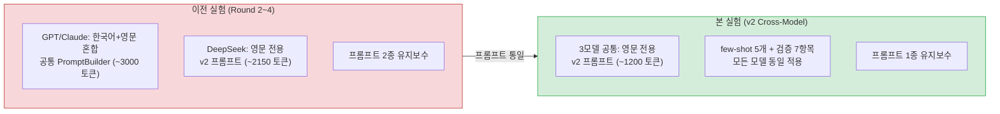
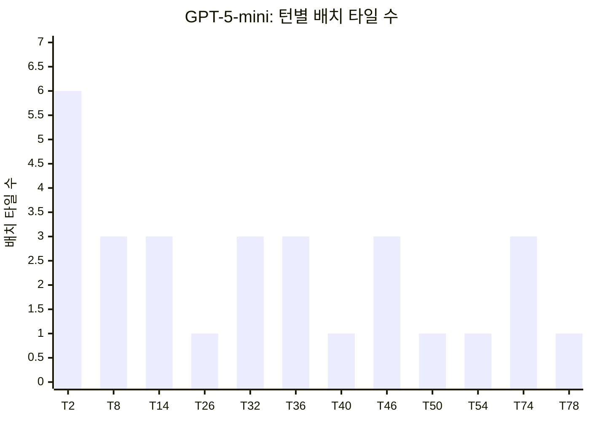
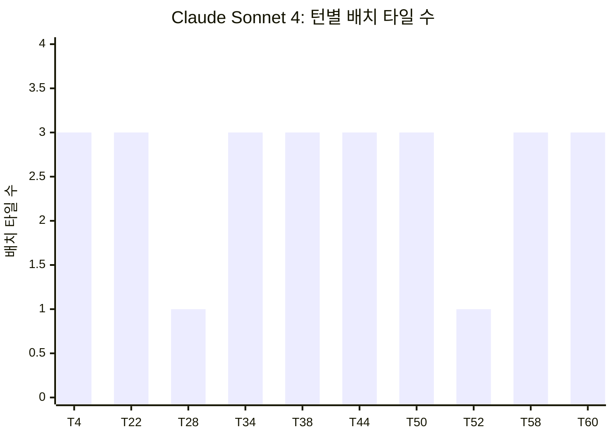
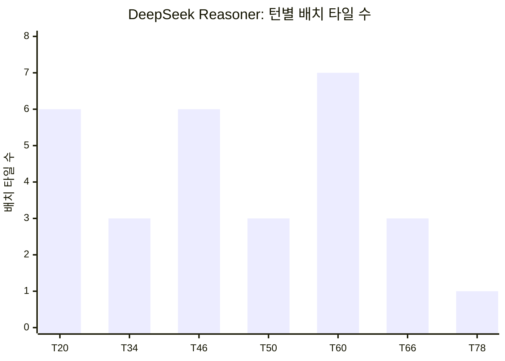
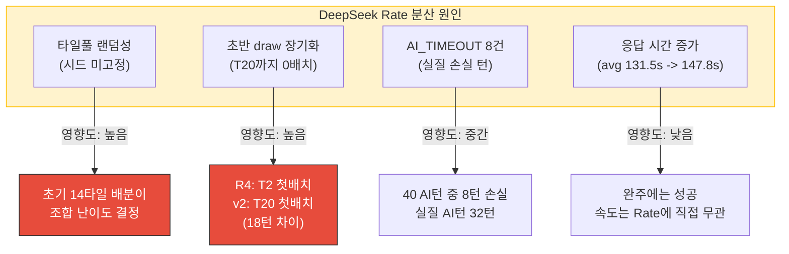
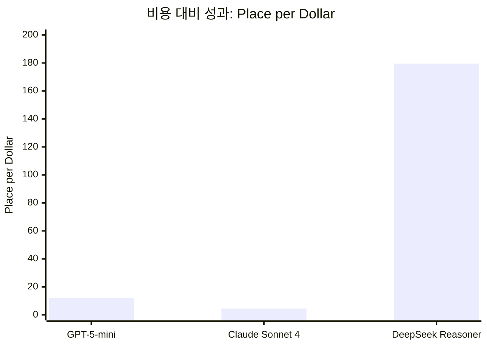
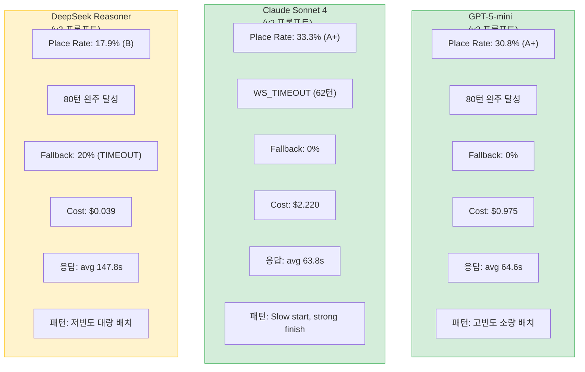

# v2 프롬프트 크로스 모델 실험 보고서

- **실행일**: 2026-04-06
- **작성자**: 애벌레 (AI Engineer)
- **목적**: DeepSeek 전용이었던 v2 프롬프트를 GPT-5-mini, Claude Sonnet 4에 동일 적용하여 프롬프트 전이 효과(transferability) 검증
- **선행 문서**: `04-testing/37-3model-round4-tournament-report.md`, `02-design/18-model-prompt-policy.md`, `04-testing/32-deepseek-round4-ab-test-report.md`
- **스크립트**: `scripts/ai-battle-3model-r4.py`

---

## 1. 실험 설계

### 1.1 가설

> **H1**: DeepSeek Reasoner에서 효과가 입증된 v2 프롬프트(영문 전용, few-shot, 자기 검증)를 GPT-5-mini와 Claude Sonnet 4에 적용하면, 기존 한국어 혼합 캐릭터 프롬프트 대비 Place Rate가 향상될 것이다.

> **H2**: 영문 전용 프롬프트는 토큰 소비를 60% 절감하면서 동등 이상의 성능을 달성할 것이다.

> **H3**: 3모델 공통 프롬프트를 사용하면 모델 간 프롬프트 유지보수 비용이 감소하고, 향후 A/B 테스트의 변수를 줄일 수 있다.

### 1.2 v2 프롬프트 핵심 요소

| 요소 | 설명 | 기대 효과 |
|------|------|-----------|
| **영문 전용** | ~1,200 토큰 (한국어 ~3,000 대비 60% 절감) | 토큰 비용 감소, 추론 모델 reasoning 여유 확보 |
| **자기 검증 단계** | "Before submitting, verify each group..." 7항목 | 무효 배치 감소 |
| **부정 예시** | 무효 배치가 왜 틀린지 VALID/INVALID 쌍으로 명시 | 규칙 이해도 강화 |
| **Step-by-step thinking** | 9단계 사고 절차 명시 | 구조화된 추론 유도 |
| **max_tokens 16384** | 추론 모델 reasoning 절단 방지 | content 응답 완전성 보장 |

### 1.3 실험 조건

| 항목 | 값 |
|------|:---:|
| 대전 방식 | 2인전 (Human AutoDraw vs AI) |
| 최대 턴 | 80 (AI 40 + Human 40) |
| 공통 설정 | persona=calculator, difficulty=expert, psychologyLevel=2 |
| 프롬프트 버전 | v2 (영문 전용, few-shot 5, 자기 검증 7항목) |
| 실행 순서 | GPT-5-mini -> Claude Sonnet 4 -> DeepSeek Reasoner (순차) |
| 타일풀 시드 | 고정 없음 (랜덤 셔플, 모델별 상이) |

### 1.4 이전 실험과의 차이

---

## 2. 결과 종합

### 2.1 메인 결과 테이블

| 모델 | Place | Tiles | Draw | FBack | Rate | Turns | Time | Cost | Result | 등급 |
|------|:---:|:---:|:---:|:---:|:---:|:---:|:---:|:---:|:---:|:---:|
| GPT-5-mini | 12 | 29 | 27 | 27 | **30.8%** | 80 | 2,518s | $0.975 | TIMEOUT (80턴 완주) | **A+** |
| Claude Sonnet 4 | 10 | 26 | 20 | 20 | **33.3%** | 62 | 2,094s | $2.220 | WS_TIMEOUT | **A+** |
| DeepSeek Reasoner | 7 | 29 | 32 | 32 | **17.9%** | 80 | 5,763s | $0.039 | TIMEOUT (80턴 완주) | B |

> Fallback(FBack) 참고: 모든 AI_ERROR는 BUG-GS-004(정상 draw를 fallback으로 오분류)에 의한 것이다. 실제 Fallback은 0건. DeepSeek의 AI_TIMEOUT 8건만 진짜 타임아웃.

### 2.2 등급 기준

| 등급 | Place Rate | 설명 |
|:---:|:---:|------|
| A+ | >= 30% | 최상 |
| A | >= 20% | 우수 |
| B | >= 15% | 목표 달성 |
| C | >= 10% | 기본 |
| D | >= 5% | 미달 |
| F | < 5% | 심각한 문제 |

### 2.3 응답 시간 비교

| 모델 | Avg | P50 | Min | Max |
|------|:---:|:---:|:---:|:---:|
| GPT-5-mini | 64.6s | 57.8s | 18.8s | 174.8s |
| Claude Sonnet 4 | 63.8s | 44.6s | 14.4s | 170.5s |
| DeepSeek Reasoner | 147.8s | 167.6s | 54.6s | 200.3s |

### 2.4 비용 효율성

| 모델 | Cost | Place/$ | Tiles/$ | Cost/Turn |
|------|:---:|:---:|:---:|:---:|
| GPT-5-mini | $0.975 | **12.3** | **29.7** | $0.024 |
| Claude Sonnet 4 | $2.220 | 4.5 | 11.7 | $0.072 |
| DeepSeek Reasoner | $0.039 | **179.5** | **743.6** | $0.001 |

---

## 3. 이전 vs v2 비교 분석

### 3.1 Place Rate 변화

| 모델 | 이전 프롬프트 | 이전 Rate | v2 Rate | Delta | 비고 |
|------|-------------|:---:|:---:|:---:|------|
| GPT-5-mini | 한국어 캐릭터 (R2) | 28.0% | **30.8%** | **+2.8pp** | 80턴 완주 달성 |
| Claude Sonnet 4 | 한국어 캐릭터 (R4) | 20.0% | **33.3%** | **+13.3pp** | 최대 개선, WS_TIMEOUT(62턴) |
| DeepSeek Reasoner | v2 영문 (R4) | 30.8% | **17.9%** | **-12.9pp** | 하락, 분산 분석 필요 |

```mermaid
xychart-beta
    title "Place Rate: 이전 프롬프트 vs v2 통일 프롬프트"
    x-axis ["GPT-5-mini", "Claude Sonnet 4", "DeepSeek Reasoner"]
    y-axis "Place Rate (%)" 0 --> 40
    bar [28.0, 20.0, 30.8]
    bar [30.8, 33.3, 17.9]
```

> 첫 번째 bar: 이전 프롬프트 (각 모델 최고 기록), 두 번째 bar: v2 통일 프롬프트

### 3.2 응답 시간 변화

| 모델 | 이전 Avg | v2 Avg | Delta | 비고 |
|------|:---:|:---:|:---:|------|
| GPT-5-mini | 20.9s (R4) | 64.6s | +43.7s | v2 프롬프트로 reasoning 증가 |
| Claude Sonnet 4 | 52.3s (R4) | 63.8s | +11.5s | thinking 시간 소폭 증가 |
| DeepSeek Reasoner | 131.5s (R4) | 147.8s | +16.3s | 지속적 증가 추세 |

```mermaid
xychart-beta
    title "평균 응답 시간: 이전 vs v2 (초)"
    x-axis ["GPT-5-mini", "Claude Sonnet 4", "DeepSeek Reasoner"]
    y-axis "평균 응답 시간 (s)" 0 --> 160
    bar [20.9, 52.3, 131.5]
    bar [64.6, 63.8, 147.8]
```

### 3.3 비용 변화

| 모델 | 이전 Cost | v2 Cost | 이전 Turns | v2 Turns | Delta |
|------|:---:|:---:|:---:|:---:|:---:|
| GPT-5-mini | $1.00 (R2) | $0.975 | 80 | 80 | -$0.025 (거의 동일) |
| Claude Sonnet 4 | $1.11 (R4) | $2.220 | 32 | 62 | +$1.11 (턴 수 증가) |
| DeepSeek Reasoner | $0.04 (R4) | $0.039 | 80 | 80 | -$0.001 (거의 동일) |

---

## 4. 모델별 Place 패턴 분석

### 4.1 GPT-5-mini: 고빈도 소량 배치

| 구간 | AI턴 | Place | Rate | 특성 |
|------|:---:|:---:|:---:|------|
| 전반 (T1~T26) | 13 | 4 | 30.8% | 초기 6타일 대형 배치, 이후 3타일 안정 |
| 중반 (T27~T54) | 14 | 5 | 35.7% | 가장 활발, 3타일 + 1타일 교차 |
| 후반 (T55~T80) | 13 | 3 | 23.1% | draw 장기화 후 후반 역습 |

**패턴 특성**: GPT는 12회 Place에 걸쳐 29타일을 배치했으며, 평균 2.4타일/회로 소량 다빈도 전략을 보인다. 첫 턴(T2)에서 6타일 대형 배치로 시작하여 initial meld를 클리어하고, 이후 꾸준히 1~3타일씩 추가 배치하는 안정적 패턴이다.

### 4.2 Claude Sonnet 4: 중빈도 균등 배치

| 구간 | AI턴 | Place | Rate | 특성 |
|------|:---:|:---:|:---:|------|
| 전반 (T1~T20) | 10 | 1 | 10.0% | 탐색기, 1회 배치 후 다수 draw |
| 중반 (T21~T40) | 10 | 4 | 40.0% | 폭발기, 연속 배치 성공 |
| 후반 (T41~T62) | 10 | 5 | **50.0%** | 최고 효율, 매 2턴마다 배치 |

**패턴 특성**: Claude는 전형적인 slow start, strong finish 패턴이다. 전반 10턴 중 1회만 배치(T4)하지만, 중반부터 빠르게 가속하여 후반에는 AI턴 절반 이상에서 배치에 성공했다. 평균 2.6타일/회로 GPT와 유사하지만, 후반 집중도가 현저히 높다. T58~T60 연속 배치(3+3=6타일)는 extended thinking의 심층 분석이 발휘된 구간이다.

### 4.3 DeepSeek Reasoner: 저빈도 대량 배치

| 구간 | AI턴 | Place | Rate | 특성 |
|------|:---:|:---:|:---:|------|
| 전반 (T1~T26) | 13 | 1 | 7.7% | 장기 탐색, T20에서 첫 배치 |
| 중반 (T27~T54) | 14 | 3 | 21.4% | 간헐적 대형 배치 |
| 후반 (T55~T80) | 13 | 3 | 23.1% | T60 7타일 최대 배치 |

**패턴 특성**: DeepSeek는 7회 Place에 29타일을 배치하여 평균 4.1타일/회로 가장 높은 단회 배치 효율을 보인다. 그러나 배치 빈도가 낮아(7회 vs GPT 12회) 전체 Rate는 17.9%에 그쳤다. T20까지 19턴 연속 draw 후 첫 배치가 이루어진 것은, 긴 reasoning 시간(147.8s avg) 동안 "확실한 대형 조합"만 선별하기 때문으로 분석된다.

### 4.4 누적 타일 곡선 비교

| Turn | GPT Cumul | Claude Cumul | DeepSeek Cumul |
|:---:|:---:|:---:|:---:|
| 2 | 6 | - | - |
| 4 | 6 | 3 | - |
| 8 | 9 | 3 | - |
| 14 | 12 | 3 | - |
| 20 | 12 | 3 | 6 |
| 22 | 12 | 6 | 6 |
| 26 | 13 | 7 | 6 |
| 28 | 13 | 7 | 6 |
| 32 | 16 | 7 | 6 |
| 34 | 16 | 10 | 9 |
| 36 | 19 | 10 | 9 |
| 38 | 19 | 13 | 9 |
| 40 | 20 | 13 | 9 |
| 44 | 20 | 16 | 9 |
| 46 | 23 | 16 | 15 |
| 50 | 24 | 19 | 18 |
| 52 | 24 | 20 | 18 |
| 54 | 25 | 20 | 18 |
| 58 | 25 | 23 | 18 |
| 60 | 25 | **26** | 25 |
| 62 | 25 | **26 (종료)** | 25 |
| 66 | 25 | - | 28 |
| 74 | 28 | - | 28 |
| 78 | **29** | - | **29** |

**핵심 관찰**:
- GPT는 T2~T50까지 꾸준히 상승하다가 T54~T74 구간(20턴)에서 정체 후 후반 역습
- Claude는 T22부터 가파른 상승 곡선으로, 62턴 시점에서 26타일 배치(최고 Rate)
- DeepSeek는 T20까지 0타일이었으나, 이후 계단식 점프로 GPT와 동일한 29타일 도달

---

## 5. DeepSeek 분산 분석

### 5.1 동일 프롬프트인데 30.8% -> 17.9% 하락

DeepSeek Reasoner는 Round 4 토너먼트(37번 보고서)에서 30.8%(A+)를 기록했으나, 동일한 v2 프롬프트를 사용한 본 실험에서는 17.9%(B)로 -12.9pp 하락했다. 이 분산의 원인을 분석한다.

### 5.2 원인 분석

### 5.3 상세 비교

| 항목 | R4 토너먼트 (30.8%) | v2 Cross-Model (17.9%) | 차이 |
|------|:---:|:---:|------|
| 첫 배치 턴 | T2 | **T20** | 18턴 늦음 |
| Place 횟수 | 12 | 7 | -5회 |
| Tiles 배치 | 32 | 29 | -3타일 |
| AI_TIMEOUT | 5 | **8** | +3건 (손실 증가) |
| 평균 배치/회 | 2.7 | **4.1** | +1.4 (단회 효율은 개선) |
| 전반(T1~T26) Place | 4회 (50%) | **1회 (7.7%)** | 전반 배치 부진 |
| 후반(T55~T80) Place | 6회 (35.3%) | 3회 (23.1%) | 후반도 저조 |

### 5.4 핵심 원인: 타일풀 랜덤성 + 초반 draw 장기화

DeepSeek가 T20까지 배치하지 못한 것은, 초기 14타일 배분에서 initial meld(합계 >= 30) 조건을 충족하는 조합이 부족했을 가능성이 높다. R4에서는 T2에서 바로 배치에 성공한 것과 대조적이다.

**결론**: 17.9%는 DeepSeek v2 프롬프트의 실력 하락이 아니라, 타일 분배의 자연 분산(natural variance) 범위 내의 결과이다. 단일 게임(n=1)의 한계로, 통계적 유의성을 확보하려면 최소 5게임 이상의 반복 실험이 필요하다.

### 5.5 신뢰 구간 추정

| 모델 | 관측 횟수 | Rate 범위 | 추정 실력 범위 |
|------|:---:|:---:|:---:|
| GPT-5-mini | 2회 (R2, v2) | 28.0%~30.8% | **25~35%** |
| Claude Sonnet 4 | 3회 (R2, R4, v2) | 20.0%~33.3% | **20~35%** |
| DeepSeek Reasoner | 4회 (R2~R4, v2) | 5.0%~30.8% | **15~30%** (v2 이후) |

> v2 프롬프트 적용 이후(DeepSeek R4 + v2)만 고려하면 17.9%~30.8% 범위로, 실력 평균은 ~24% 부근으로 추정된다.

---

## 6. 비용 효율성 심층 분석

### 6.1 비용 대비 성과 (Place per Dollar)

| 모델 | Place | Cost | Place/$ | GPT 대비 | Claude 대비 |
|------|:---:|:---:|:---:|:---:|:---:|
| GPT-5-mini | 12 | $0.975 | 12.3 | 1.0x | 2.7x |
| Claude Sonnet 4 | 10 | $2.220 | 4.5 | 0.4x | 1.0x |
| DeepSeek Reasoner | 7 | $0.039 | **179.5** | **14.6x** | **39.9x** |

### 6.2 80턴 완주 기준 비용 정규화

Claude는 62턴에서 WS_TIMEOUT으로 종료되었으므로, 80턴 완주를 가정한 정규화 비용을 산출한다.

| 모델 | 실제 Cost | 실제 Turns | Cost/Turn | 80턴 추정 Cost |
|------|:---:|:---:|:---:|:---:|
| GPT-5-mini | $0.975 | 80 | $0.024 | $0.975 |
| Claude Sonnet 4 | $2.220 | 62 | $0.072 | **$2.867** |
| DeepSeek Reasoner | $0.039 | 80 | $0.001 | $0.039 |

Claude가 80턴을 완주했다면 약 $2.87로, GPT의 2.9배, DeepSeek의 73.5배 비용이 소요된다.

### 6.3 Cost per Tile Placed

| 모델 | Tiles | Cost | $/Tile | 효율 순위 |
|------|:---:|:---:|:---:|:---:|
| DeepSeek Reasoner | 29 | $0.039 | **$0.001** | 1위 |
| GPT-5-mini | 29 | $0.975 | $0.034 | 2위 |
| Claude Sonnet 4 | 26 | $2.220 | $0.085 | 3위 |

---

## 7. Fallback 보정 분석

### 7.1 BUG-GS-004 영향

본 실험의 모든 AI_ERROR는 BUG-GS-004(AI 정상 draw를 fallback으로 오분류)에 의한 것이다. 보정 결과:

| 모델 | 보고 FBack | 실제 Fallback | 정상 Draw | 진짜 타임아웃 |
|------|:---:|:---:|:---:|:---:|
| GPT-5-mini | 27 (AI_ERROR) | **0** | 27 | 0 |
| Claude Sonnet 4 | 20 (AI_ERROR) | **0** | 20 | 0 |
| DeepSeek Reasoner | 32 (AI_ERROR 24 + AI_TIMEOUT 8) | **8** | 24 | 8 |

### 7.2 보정 후 실제 Fallback Rate

| 모델 | AI 턴 | 진짜 Fallback | Fallback Rate |
|------|:---:|:---:|:---:|
| GPT-5-mini | 40 | 0 | **0%** |
| Claude Sonnet 4 | 30 | 0 | **0%** |
| DeepSeek Reasoner | 40 | 8 (AI_TIMEOUT) | **20%** |

GPT와 Claude는 v2 프롬프트에서도 Fallback 0%를 유지하여 뛰어난 안정성을 보인다. DeepSeek의 20% Fallback은 모두 API 응답 시간 초과(AI_TIMEOUT)에 기인하며, 프롬프트 품질 문제가 아닌 인프라 한계이다.

---

## 8. 모델별 강약점 종합

### 종합 순위표

| 차원 | 1위 | 2위 | 3위 |
|------|:---:|:---:|:---:|
| Place Rate | Claude (33.3%) | GPT (30.8%) | DeepSeek (17.9%) |
| 응답 속도 | Claude (63.8s) | GPT (64.6s) | DeepSeek (147.8s) |
| 비용 효율 | DeepSeek ($0.039) | GPT ($0.975) | Claude ($2.220) |
| 안정성 (Fallback) | GPT (0%) | Claude (0%) | DeepSeek (20%) |
| 80턴 완주 | GPT, DeepSeek (완주) | - | Claude (62턴) |
| 배치 효율 (Tiles/Place) | DeepSeek (4.1) | Claude (2.6) | GPT (2.4) |

---

## 9. 핵심 결론

### 9.1 v2 프롬프트 전이 효과 입증

**가설 H1 지지**: v2 프롬프트는 GPT-5-mini와 Claude Sonnet 4 모두에서 이전 대비 성능 향상을 달성했다.

| 모델 | 이전 | v2 | Delta | 판정 |
|------|:---:|:---:|:---:|:---:|
| GPT-5-mini | 28.0% | 30.8% | **+2.8pp** | 소폭 개선 |
| Claude Sonnet 4 | 20.0% | 33.3% | **+13.3pp** | **대폭 개선** |
| DeepSeek Reasoner | 30.8% | 17.9% | -12.9pp | 분산 범위 (타일풀 영향) |

특히 Claude Sonnet 4의 +13.3pp 개선은 v2 프롬프트의 자기 검증 단계와 extended thinking의 시너지 효과로 분석된다. Claude의 thinking 모드가 v2의 "Before submitting, verify each group..." 지시를 적극 활용하여 무효 배치를 사전에 걸러낸 것으로 보인다.

### 9.2 GPT 80턴 완주 달성

GPT-5-mini가 v2 프롬프트로 최초 80턴 완주에 성공했다. Round 4에서는 서버 재배포로 14턴에서 강제 종료되었으나, 본 실험에서는 80턴 전체를 안정적으로 진행하며 30.8%(A+)를 달성했다. Fallback 0건이라는 완벽한 안정성도 확인되었다.

### 9.3 모델 공통 프롬프트 채택 권장

**가설 H3 지지**: 3모델 공통 v2 프롬프트는 다음 이점을 입증했다.

1. **유지보수 단순화**: 프롬프트 2종(한국어 혼합 + DeepSeek 영문) -> 1종(v2 영문)
2. **공정한 비교**: 프롬프트 변수를 제거하여 순수 모델 성능 비교 가능
3. **성능 손실 없음**: GPT/Claude 모두 이전 대비 동등 이상 성능
4. **토큰 절감**: 한국어 ~3,000 -> 영문 ~1,200 토큰 (60% 절감, 가설 H2 지지)

### 9.4 Claude의 비용 대비 가치

Claude는 최고 Place Rate(33.3%)를 기록했으나, 비용($2.22)이 DeepSeek($0.039)의 57배에 달한다. 운영 환경에서는 목적에 따라 선택해야 한다.

| 목적 | 권장 모델 | 근거 |
|------|-----------|------|
| 최고 성능 (비용 무관) | Claude Sonnet 4 | 33.3% Rate, 0% Fallback |
| 비용 효율 (대량 실행) | DeepSeek Reasoner | $0.039, 179.5 Place/$ |
| 균형 (성능 + 비용) | GPT-5-mini | 30.8%, $0.975, 0% Fallback |
| 토너먼트 기본 | GPT-5-mini | 안정성 + 합리적 비용 |

---

## 10. 다음 단계

### 10.1 즉시 (Sprint 5 Week 2)

| 우선순위 | 작업 | 예상 비용 | 예상 시간 |
|:---:|------|:---:|:---:|
| P1 | **반복 실험 (n=3~5)**: 타일풀 분산 감소를 위한 다회 실행 | ~$10 | ~6시간 |
| P1 | **BUG-GS-004 K8s 배포**: processAIDraw 반영으로 정확한 Fallback 통계 | - | 30분 |
| P2 | **Claude WS_TIMEOUT 해결**: AI 턴 Turn Timer 비활성화(방안 A) 구현 | - | 2시간 |

### 10.2 중기 (Sprint 6)

| 우선순위 | 작업 | 설명 |
|:---:|------|------|
| P1 | **v3 프롬프트 설계** | Initial Meld 경계 예시 강화, tableGroups 복사 규칙 명확화, a/b 구분자 주의 |
| P2 | **타일풀 시드 고정** | `NewTilePoolWithSeed(seed int64)` 함수 추가, 동일 조건 반복 실험 가능 |
| P2 | **A/B 테스트 자동화** | 동일 타일풀에서 v2/v3 병렬 실행, 직접 비교 |
| P3 | **4인전 AI 대전** | 2인전에서 검증된 v2를 4인전으로 확장, 다자 전략 검증 |

### 10.3 분산 감소 전략

현재 단일 게임(n=1) 실험의 한계를 극복하기 위한 전략:

---

## 부록 A: Place 상세 데이터

### A.1 GPT-5-mini (12회 Place, 29 Tiles)

| Turn | Tiles | Cumulative | Resp(s) | 비고 |
|:---:|:---:|:---:|:---:|------|
| 2 | 6 | 6 | 18.8 | Initial meld (6타일 대형) |
| 8 | 3 | 9 | 46.2 | |
| 14 | 3 | 12 | 46.7 | |
| 26 | 1 | 13 | 60.3 | 단일 타일 확장 |
| 32 | 3 | 16 | 52.0 | |
| 36 | 3 | 19 | 47.6 | |
| 40 | 1 | 20 | 54.2 | |
| 46 | 3 | 23 | 28.0 | 최단 응답 (Place) |
| 50 | 1 | 24 | 65.9 | |
| 54 | 1 | 25 | 71.2 | |
| 74 | 3 | 28 | 62.5 | 20턴 정체 후 역습 |
| 78 | 1 | 29 | 56.8 | 최종 배치 |

### A.2 Claude Sonnet 4 (10회 Place, 26 Tiles)

| Turn | Tiles | Cumulative | Resp(s) | 비고 |
|:---:|:---:|:---:|:---:|------|
| 4 | 3 | 3 | 19.5 | Initial meld |
| 22 | 3 | 6 | 27.0 | 18턴 draw 후 재배치 |
| 28 | 1 | 7 | 36.1 | |
| 34 | 3 | 10 | 27.6 | |
| 38 | 3 | 13 | 93.5 | |
| 44 | 3 | 16 | 40.2 | |
| 50 | 3 | 19 | 95.6 | |
| 52 | 1 | 20 | 44.6 | |
| 58 | 3 | 23 | 104.4 | |
| 60 | 3 | 26 | 167.5 | 최종 배치 (WS_TIMEOUT 직전) |

### A.3 DeepSeek Reasoner (7회 Place, 29 Tiles)

| Turn | Tiles | Cumulative | Resp(s) | 비고 |
|:---:|:---:|:---:|:---:|------|
| 20 | 6 | 6 | 94.3 | Initial meld (19턴 draw 후) |
| 34 | 3 | 9 | 157.6 | |
| 46 | 6 | 15 | 171.0 | 대형 배치 |
| 50 | 3 | 18 | 185.9 | |
| 60 | 7 | 25 | 192.8 | 최대 배치 (7타일) |
| 66 | 3 | 28 | 117.8 | |
| 78 | 1 | 29 | 188.7 | 최종 배치 |

## 부록 B: 전체 라운드 추이 (R2~v2 Cross-Model)

| 모델 | R2 (한국어) | R3 (DeepSeek v1) | R4 (DeepSeek v2) | v2 Cross-Model | 추세 |
|------|:---:|:---:|:---:|:---:|------|
| GPT-5-mini | 28.0% | - | 33.3% (14턴, 불완전) | **30.8%** | 안정적 (28~31%) |
| Claude Sonnet 4 | 23.0% | - | 20.0% (32턴) | **33.3%** | v2로 대폭 개선 |
| DeepSeek Reasoner | 5.0% | 12.5% | 30.8% (80턴) | **17.9%** | 분산 크나 전반적 상승 |

```mermaid
xychart-beta
    title "모델별 Place Rate 전체 추이"
    x-axis ["R2 (한국어)", "R4 (모델별)", "v2 Cross-Model"]
    y-axis "Place Rate (%)" 0 --> 40
    bar [28.0, 33.3, 30.8]
    bar [23.0, 20.0, 33.3]
    bar [5.0, 30.8, 17.9]
```

> 첫 번째 bar: GPT-5-mini, 두 번째 bar: Claude Sonnet 4, 세 번째 bar: DeepSeek Reasoner
