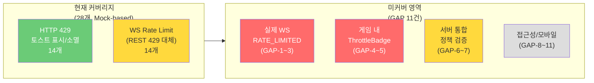

# 40. Rate Limit UX E2E 테스트 전략

> 작성일: 2026-04-08 | 작성자: QA Engineer | Sprint 5 Week 2, Day 3

## 1. 개요

Rate Limit UX 기능(SEC-RL-003)에 대한 프론트엔드 E2E 테스트 전략을 정의한다.
HTTP 429 응답 처리, WebSocket RATE_LIMITED 에러 처리, 쿨다운 프로그레스, 스로틀 배지 등
사용자에게 노출되는 모든 Rate Limit UX 요소의 동작을 검증한다.

### 1.1 대상 컴포넌트

| 컴포넌트 | 파일 | 역할 |
|---------|------|------|
| RateLimitToast | `components/game/RateLimitToast.tsx` | 429/WS RATE_LIMITED 토스트 (전역) |
| CooldownProgress | `components/ui/CooldownProgress.tsx` | 원형 프로그레스 카운트다운 |
| ThrottleBadge | `components/game/ThrottleBadge.tsx` | WS 스로틀 상태 배지 (게임 내) |
| rateLimitStore | `store/rateLimitStore.ts` | Zustand 상태 관리 (공유) |
| apiFetch (api.ts) | `lib/api.ts` | HTTP 429 자동 재시도 + 토스트 트리거 |
| useWebSocket | `hooks/useWebSocket.ts` | WS RATE_LIMITED 감지 + 스로틀 활성화 |

### 1.2 테스트 파일 구성

| 파일 | 테스트 수 | 추가일 | 범위 |
|------|----------|--------|------|
| `rate-limit.spec.ts` | 6 | 2026-04-06 | HTTP 429 기본 시나리오 |
| `ws-rate-limit.spec.ts` | 7 | 2026-04-06 | WS Rate Limit 기본 시나리오 |
| `rate-limit-enhanced.spec.ts` | 8 | 2026-04-08 | HTTP 429 강화 시나리오 |
| `ws-rate-limit-enhanced.spec.ts` | 7 | 2026-04-08 | WS Rate Limit 강화 시나리오 |
| **합계** | **28** | | |

---

## 2. 테스트 커버리지 매트릭스

### 2.1 HTTP 429 Rate Limit (REST API)

| TC ID | 시나리오 | 파일 | 분류 | 상태 |
|-------|---------|------|------|------|
| TC-RL-001 | 429 응답 시 토스트 표시 | rate-limit | Mock | 구현 |
| TC-RL-002 | 토스트에 한글 메시지 표시 | rate-limit | Mock | 구현 |
| TC-RL-003 | Retry-After 헤더 값 반영 | rate-limit | Mock | 구현 |
| TC-RL-004 | 토스트 자동 소멸 (6초) | rate-limit | Mock | 구현 |
| TC-RL-005 | 429 후 자동 재시도 성공 | rate-limit | Mock | 구현 |
| TC-RL-006 | role=alert, aria-live 접근성 속성 | rate-limit | Mock | 구현 |
| TC-RL-E-001 | CooldownProgress 렌더링 + ARIA | enhanced | Mock | 구현 |
| TC-RL-E-002 | 카운트다운 매초 감소 | enhanced | Mock | 구현 |
| TC-RL-E-003 | isRetrying 시 "재시도 중..." 표시 | enhanced | Mock | 구현 |
| TC-RL-E-004 | 연속 429 2회 후 3회차 성공 | enhanced | Mock | 구현 |
| TC-RL-E-005 | Retry-After 미포함 시 기본 5초 | enhanced | Mock | 구현 |
| TC-RL-E-006 | 시계 아이콘 SVG 존재 | enhanced | Mock | 구현 |
| TC-RL-E-007 | rankings API 429 동일 토스트 | enhanced | Mock | 구현 |
| TC-RL-E-008 | 쿨다운 완료 시 체크 아이콘 전환 | enhanced | Mock | 구현 |

### 2.2 WebSocket Rate Limit (SEC-RL-003)

| TC ID | 시나리오 | 파일 | 분류 | 상태 |
|-------|---------|------|------|------|
| TC-WS-RL-001 | RATE_LIMITED 에러 시 토스트 표시 | ws-rate-limit | Mock+REST | 구현 |
| TC-WS-RL-002 | 타입별 rate limit 정책 검증 | ws-rate-limit | Mock+REST | 구현 |
| TC-WS-RL-003 | RATE_LIMITED retry 초 표시 | ws-rate-limit | Mock+REST | 구현 |
| TC-WS-RL-004 | 토스트 자동 소멸 (6초) | ws-rate-limit | Mock+REST | 구현 |
| TC-WS-RL-005 | Close 4005 수신 시 재연결 시도 | ws-rate-limit | 구조 확인 | 구현 |
| TC-WS-RL-006 | 접근성 속성 (role, aria-live, aria-atomic) | ws-rate-limit | Mock+REST | 구현 |
| TC-WS-RL-007 | 429 후 자동 재시도 정상 로드 | ws-rate-limit | Mock+REST | 구현 |
| TC-WS-RL-E-001 | ThrottleBadge 렌더링 + 접근성 | ws-enhanced | Mock+REST | 구현 |
| TC-WS-RL-E-002 | 위반 단계별 aria-live 변경 | ws-enhanced | Mock+REST | 구현 |
| TC-WS-RL-E-003 | ThrottleBadge "느린 전송 모드" 텍스트 | ws-enhanced | 구조 확인 | 구현 |
| TC-WS-RL-E-004 | WS 재연결 시 위반 횟수 리셋 | ws-enhanced | Mock+REST | 구현 |
| TC-WS-RL-E-005 | Close 4005 한글 에러 메시지 | ws-enhanced | Mock+REST | 구현 |
| TC-WS-RL-E-006 | AUTH/PING 스로틀 제외 확인 | ws-enhanced | 구조 확인 | 구현 |
| TC-WS-RL-E-007 | 첫 429 소멸 후 새 429 재트리거 | ws-enhanced | Mock+REST | 구현 |

---

## 3. 테스트 분류 (Mock-based vs Integration)

### 3.1 Mock-based 테스트 (26/28, 93%)

거의 모든 테스트가 Playwright의 `page.route()`를 이용한 **HTTP 응답 모킹** 방식이다.

```
테스트 실행 흐름:
  Playwright → page.route("**/api/rooms") → 429 fulfill
            → 프론트엔드 apiFetch → rateLimitStore.setMessage()
            → RateLimitToast 렌더링 → DOM assertion
```

장점:
- 외부 의존성(K8s, 서버) 없이 독립 실행 가능
- 결정론적: 429 응답 타이밍과 횟수를 정확히 제어
- 빠른 실행: 서버 왕복 없이 즉시 응답

한계:
- 실제 서버의 Rate Limit 정책(Fixed Window 60msg/min)은 검증하지 못함
- WS 프로토콜 레벨의 RATE_LIMITED 에러는 REST 429로 대체 검증
- Zustand store의 직접 조작이 불가능하여 일부 WS 시나리오가 간접 확인으로 제한

### 3.2 구조 확인 테스트 (2/28, 7%)

실제 동작 검증이 아닌 코드/번들 레벨의 존재 확인:

| TC ID | 확인 방법 | 한계 |
|-------|----------|------|
| TC-WS-RL-005 | `WebSocket !== undefined` 확인 | 4005 핸들링 동작 미검증 |
| TC-WS-RL-E-003 | `page.evaluate()` 반환 값 확인 | ThrottleBadge 렌더링 미검증 |
| TC-WS-RL-E-006 | 페이지 로드 상태 확인 | AUTH/PING 실제 제외 동작 미검증 |

### 3.3 통합 테스트 (0/28, 0%)

현재 K8s에서 실제 서버 Rate Limit을 트리거하는 통합 E2E 테스트는 없다.

---

## 4. 갭 분석 (Gap Analysis)

### 4.1 높은 우선순위 갭

| # | 누락 시나리오 | 영향도 | 현재 커버리지 | 권장 |
|---|-------------|--------|-------------|------|
| GAP-1 | **실제 WS RATE_LIMITED 메시지 수신 후 토스트 표시** | High | REST 429로 대체 검증 | WS Mock 서버 또는 실제 서버 E2E |
| GAP-2 | **WS 스로틀 활성 상태에서 빠른 전송이 클라이언트에서 차단됨** | High | 미검증 | 실제 WS 연결 필요 |
| GAP-3 | **Close 4005 수신 후 재연결 시도 동작** | High | 구조 확인만 | WS Mock 서버 사용 |
| GAP-4 | **ThrottleBadge 실제 렌더링 (게임 페이지)** | Medium | 미검증 | /game/[roomId] 접근 필요 |

### 4.2 중간 우선순위 갭

| # | 누락 시나리오 | 영향도 | 권장 |
|---|-------------|--------|------|
| GAP-5 | 위반 횟수 2회 시 주황 경고 스타일 (stage=2) | Medium | wsViolationCount 직접 제어 필요 |
| GAP-6 | 3회 위반 시 서버 연결 종료 (4005 Close) | Medium | 서버 통합 테스트 |
| GAP-7 | 타입별 WS Rate Limit 정책 (CHAT 20/min, MOVE 5/min 등) | Medium | 서버 통합 테스트 |
| GAP-8 | CooldownProgress `prefers-reduced-motion` 대체 렌더링 | Low | 미디어 쿼리 에뮬레이션 |

### 4.3 낮은 우선순위 갭

| # | 누락 시나리오 | 영향도 | 권장 |
|---|-------------|--------|------|
| GAP-9 | 다중 탭에서 동시 429 → store 충돌 | Low | 향후 검증 |
| GAP-10 | Retry-After HTTP-date 형식 파싱 | Low | 단위 테스트 권장 |
| GAP-11 | 모바일 뷰포트에서 토스트 레이아웃 | Low | 반응형 테스트 |

### 4.4 갭 요약



---

## 5. 테스트 기법 분석

### 5.1 공통 패턴: HTTP 429 모킹

모든 REST Rate Limit 테스트는 동일한 패턴을 사용한다:

```
1. page.route("**/api/rooms") → 첫 N회 429 + Retry-After 헤더
2. page.goto("/lobby")
3. RateLimitToast [data-testid="rate-limit-toast"] 가시성 확인
4. 속성/텍스트/동작 assertion
```

이 패턴은 `rate-limit-enhanced.spec.ts`에서 `create429Route()` 헬퍼로 추상화되었다.

### 5.2 WS 테스트의 한계와 대안

현재 Playwright에서 WebSocket 메시지를 직접 주입할 수 없어, WS RATE_LIMITED 시나리오는 다음 대안을 사용한다:

| 대안 | 사용 여부 | 평가 |
|------|----------|------|
| REST 429 응답으로 동일 store 트리거 | 사용 중 | rateLimitStore 공유이므로 유효 |
| `page.evaluate()` Zustand store 직접 조작 | 시도함 | Next.js 번들 캡슐화로 접근 불가 |
| CustomEvent 디스패치 | 시도함 | 리스너 미등록으로 무효 |
| WS Mock 서버 (Playwright WebSocket API) | 미적용 | 향후 권장 (Playwright v1.40+ 지원) |

### 5.3 접근성 테스트 커버리지

| ARIA 속성 | 테스트 | 검증 |
|-----------|--------|------|
| role="alert" (RateLimitToast) | TC-RL-006, TC-WS-RL-006, TC-WS-RL-E-001 | 3회 검증 |
| aria-live="polite" | TC-RL-006, TC-WS-RL-006, TC-WS-RL-E-002 | 3회 검증 |
| aria-atomic="true" | TC-WS-RL-006 | 1회 검증 |
| role="progressbar" (CooldownProgress) | TC-RL-E-001 | 1회 검증 |
| aria-valuenow/min/max | TC-RL-E-001 | 1회 검증 |
| aria-label="쿨다운 잔여 시간" | TC-RL-E-001 | 1회 검증 |
| role="status" (ThrottleBadge) | 미검증 (GAP-4) | - |
| aria-label (ThrottleBadge) | 미검증 (GAP-4) | - |

---

## 6. 권장 사항

### 6.1 단기 (Sprint 5 W2)

1. **WS Mock 서버 도입 검토**: Playwright의 `page.routeWebSocket()` (v1.48+)을 활용하여 WS RATE_LIMITED 메시지를 직접 주입하는 테스트 추가. GAP-1, GAP-2, GAP-3 해결 가능.

2. **게임 페이지 ThrottleBadge 테스트**: `/game/test-room` 같은 테스트 전용 라우트를 만들거나, 실제 게임 방 생성 후 ThrottleBadge 가시성을 검증하는 테스트 추가. GAP-4, GAP-5 해결.

### 6.2 중기 (Sprint 6)

3. **서버 통합 Rate Limit E2E**: K8s 환경에서 실제 서버의 Fixed Window 60msg/min 정책을 트리거하여 429 → 토스트 → 재시도 전체 흐름을 검증하는 통합 테스트 추가. GAP-6, GAP-7 해결.

4. **다중 API 엔드포인트 429 검증**: 현재 `/api/rooms`와 `/api/rankings`만 검증됨. `/api/games`, `/api/users` 등 나머지 엔드포인트에서도 429 → 동일 토스트 → 재시도 흐름이 작동하는지 추가 검증 권장.

### 6.3 장기

5. **부하 테스트 (k6)**: 실제 Rate Limit 임계값(60 req/min)에서 429가 올바르게 반환되는지 k6 스크립트로 검증. 서버 사이드 Rate Limiter(Go 미들웨어)의 정확성도 함께 확인.

6. **접근성 자동화**: axe-playwright를 활용하여 토스트/배지의 WCAG 2.1 AA 적합성 자동 검증.

---

## 7. 테스트 실행 환경

| 항목 | 값 |
|------|-----|
| 프레임워크 | Playwright |
| 대상 URL | http://localhost:30000 (K8s NodePort) |
| 인증 | global-setup.ts의 auth.json 세션 재사용 |
| 브라우저 | Chromium (headless) |
| 타임아웃 | 테스트당 30초 (기본), 토스트 검증 10초 |
| 모킹 방식 | `page.route()` HTTP 응답 모킹 |

---

## 8. 결론

Rate Limit UX E2E 테스트는 총 28개로 구성되어 있으며, HTTP 429 처리에 대한 커버리지는 충분하다. 그러나 **실제 WebSocket RATE_LIMITED 메시지 처리**(GAP-1~3)와 **게임 내 ThrottleBadge 렌더링**(GAP-4~5)은 Mock 기반 테스트로 대체되어 있어 향후 WS Mock 서버 도입 시 보강이 필요하다.

현재 28개 테스트 중 26개(93%)가 Mock-based로 독립 실행 가능하며, CI 파이프라인에서 안정적으로 동작할 수 있다. 서버 통합 테스트는 Sprint 6에서 k6 부하 테스트와 함께 추가하는 것을 권장한다.
