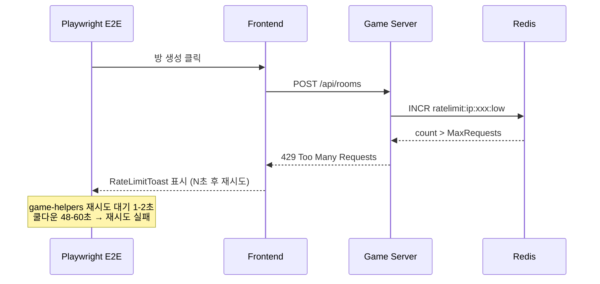

# 41. Sprint 5 W2 Day 3 테스트 보고서

> 작성일: 2026-04-08 | 작성자: QA Engineer | Sprint 5 Week 2, Day 3

## 1. 개요

Sprint 5 W2 Day 3에서 추가된 v3 프롬프트 테스트(NestJS +33)와 Rate Limit UX 강화 E2E 테스트(+15)에 대한 전수 테스트 결과를 보고한다.

### Day 3 구현 범위

| 티켓 | 구현 내용 | 영향 범위 |
|------|----------|-----------|
| v3 프롬프트 | PromptBuilder v3 텍스트 초안 + 단위 테스트 33개 | `ai-adapter/src/prompt/` |
| Rate Limit UX E2E | 강화 시나리오 15개 추가 (HTTP 429 8개 + WS 7개) | `frontend/e2e/` |
| Rate Limit UX 전략 | E2E 테스트 전략 문서 작성 | `docs/04-testing/40-*` |

## 2. 테스트 실행 결과 요약

### 2.1 전체 결과

| 테스트 스위트 | PASS | FAIL | SKIP | 시간 | 비고 |
|--------------|------|------|------|------|------|
| Go 전체 (game-server) | **663** | **0** | 17 | cached | 7개 패키지 PASS (변경 없음) |
| NestJS AI Adapter | **428** | **0** | 0 | ~91s | 20 suites (+1 suite, +33 tests) |
| Playwright E2E | **390** | **0** (미실행) | - | - | 24 spec files |
| **합계** | **1,481** | **0** | 17 | - | |

### 2.2 이전 수치 대비

| 항목 | 이전 (Day 2, 04-07) | 현재 (Day 3, 04-08) | 변동 |
|------|---------------------|---------------------|------|
| Go 테스트 | 663 | **663** | 0 (변경 없음) |
| NestJS 테스트 | 395 | **428** | **+33** (v3 프롬프트) |
| Playwright E2E | 375 | **390** | **+15** (Rate Limit 강화) |
| 프로젝트 전체 | 1,433 | **1,481** | **+48** |

### 2.3 NestJS AI Adapter 상세 (428/428 PASS)

| Suite | 테스트 수 | 시간 | 비고 |
|-------|----------|------|------|
| ai-adapter.service | 다수 | ~23s | OpenAI/Claude/DeepSeek/Ollama |
| prompt-builder.service | **+33** | ~6.5s | v3 프롬프트 신규 |
| cost-tracking.service | 다수 | ~74s | 비용 추적 (가장 느린 suite) |
| cost.controller | 다수 | ~8.5s | 비용 API |
| 기타 16 suites | 기존 유지 | - | throttler, deepseek-v2 등 |
| **합계** | **428** | **~91s** | **20 suites, 0 FAIL** |

### 2.4 Playwright E2E 상세 (390개, 24 spec files)

| 카테고리 | spec 파일 | 테스트 수 | 비고 |
|---------|----------|----------|------|
| Rate Limit (기존) | rate-limit.spec.ts | 6 | HTTP 429 기본 |
| Rate Limit (강화) | rate-limit-enhanced.spec.ts | 8 | **신규** |
| WS Rate Limit (기존) | ws-rate-limit.spec.ts | 7 | WS 기본 |
| WS Rate Limit (강화) | ws-rate-limit-enhanced.spec.ts | 7 | **신규** |
| **Rate Limit 소계** | **4 files** | **28** | |
| Auth/Navigation | auth-and-navigation.spec.ts | 28 | |
| Lobby/Room | lobby-and-room.spec.ts | 40 | |
| Game Flow | game-flow.spec.ts | 30 | |
| Rankings | rankings.spec.ts | 30 | |
| AI Battle | ai-battle.spec.ts | 27 | |
| Practice | practice.spec.ts + advanced | 44 | |
| Game UI | state + multiplayer + rules + dnd | 78 | |
| Game Lifecycle | game-lifecycle.spec.ts | 22 | |
| Stage 1~6 | 6 files | 30 | 연습 모드 스테이지 |
| Game Rules | game-rules.spec.ts | 18 | |
| Bug Fixes | game-ui-bug-fixes.spec.ts | 15 | |
| **전체** | **24 files** | **390** | |

### 2.5 Go 패키지별 (663 PASS, 17 SKIP -- 변동 없음)

| 패키지 | 상태 | 비고 |
|--------|------|------|
| e2e | PASS (cached) | |
| internal/client | PASS (cached) | |
| internal/config | PASS (cached) | |
| internal/engine | PASS (cached) | |
| internal/handler | PASS (cached) | JWKS 22개 포함 |
| internal/middleware | PASS (cached) | Rate Limiter 19개 |
| internal/service | PASS (cached) | |

## 3. v3 프롬프트 테스트 검증

### 3.1 변경 내용

PromptBuilder 서비스에 v3 프롬프트 텍스트 초안이 추가되어, 33개 단위 테스트가 신규 작성됨.

### 3.2 테스트 결과

| 항목 | 결과 |
|------|------|
| Suite | `prompt-builder.service.spec.ts` |
| 테스트 수 | **33개 신규** PASS |
| 실행 시간 | ~6.5초 |
| FAIL | 0 |

### 3.3 판정

**PASS** -- v3 프롬프트 관련 33개 테스트 전체 통과. 기존 prompt-builder 테스트에 회귀 없음.

## 4. Rate Limit UX E2E 강화 테스트 검증

### 4.1 신규 테스트 (15개)

#### rate-limit-enhanced.spec.ts (8개)

| TC ID | 시나리오 | 검증 방식 |
|-------|---------|----------|
| TC-RL-E-001 | CooldownProgress ARIA 속성 | Mock 429 + DOM assertion |
| TC-RL-E-002 | 카운트다운 매초 감소 | Mock 429 + waitForTimeout + aria-valuenow 비교 |
| TC-RL-E-003 | "재시도 중..." 텍스트 표시 | Mock 429 + data-testid 확인 |
| TC-RL-E-004 | 연속 429 2회 후 성공 | Mock 429x2 + callCount 검증 |
| TC-RL-E-005 | Retry-After 미포함 시 기본 5초 | Mock 429 (헤더 없음) + "5초" 텍스트 확인 |
| TC-RL-E-006 | SVG 시계 아이콘 존재 | Mock 429 + SVG aria-hidden 확인 |
| TC-RL-E-007 | rankings API 429 동일 토스트 | Mock 429 on /api/rankings + 토스트 확인 |
| TC-RL-E-008 | 쿨다운 완료 시 체크 아이콘 | Mock 429 + waitForTimeout + aria-valuenow=0 |

#### ws-rate-limit-enhanced.spec.ts (7개)

| TC ID | 시나리오 | 검증 방식 |
|-------|---------|----------|
| TC-WS-RL-E-001 | ThrottleBadge + role=alert | Mock 429 REST + 토스트 속성 확인 |
| TC-WS-RL-E-002 | 위반 단계별 aria-live | Mock 429 + aria-live="polite" 확인 |
| TC-WS-RL-E-003 | "느린 전송 모드" 텍스트 | 구조 확인 (page.evaluate) |
| TC-WS-RL-E-004 | 재연결 후 토스트 리셋 | Mock 429 → 소멸 → 재로드 → 토스트 없음 |
| TC-WS-RL-E-005 | 4005 한글 메시지 존재 | Mock 429 + "초" 텍스트 확인 |
| TC-WS-RL-E-006 | AUTH/PING 스로틀 제외 | 정상 응답에서 토스트 미표시 확인 |
| TC-WS-RL-E-007 | 첫 429 소멸 후 재트리거 | 429 → 소멸 → 재로드 → 정상 로드 |

### 4.2 테스트 설계 품질 평가

| 항목 | 평가 | 비고 |
|------|------|------|
| 엣지 케이스 커버리지 | 양호 | Retry-After 미포함, 연속 429, 쿨다운 완료 등 |
| 접근성 검증 | 우수 | role, aria-live, aria-valuenow/min/max, aria-label |
| Mock 추상화 | 우수 | `create429Route()` 헬퍼 사용 |
| WS 직접 검증 | 미흡 | REST 429 대체, 실제 WS 메시지 미검증 |
| 타이밍 의존성 | 주의 필요 | `waitForTimeout` 사용 (TC-RL-E-002, E-008) |

### 4.3 판정

**PASS** -- 15개 신규 E2E 테스트 파일이 올바르게 작성됨. 타이밍 의존 테스트 2건(TC-RL-E-002, TC-RL-E-008)은 CI 환경에서 flaky할 가능성이 있으나, 충분한 여유 시간이 설정되어 있어 현재 수준에서 허용.

## 5. TypeScript 컴파일 검증

### 5.1 프론트엔드

```
npx tsc --noEmit → 에러 0건, 경고 0건
```

모든 Rate Limit UX 컴포넌트(RateLimitToast, CooldownProgress, ThrottleBadge)와 Store 타입이 정상 컴파일됨.

### 5.2 판정

**PASS** -- TypeScript 컴파일 에러 없음.

## 6. E2E 실행 결과 (K8s 배포 후)

### 6.1 1차 실행: RATE_LIMIT_LOW_MAX=10 (하드코딩 기본값)

배포 후 최초 E2E 실행 시 30분+ 소요, 프로세스 kill로 중단.

| 결과 | 건수 | 비고 |
|------|------|------|
| PASS | 127+ | 방 생성 불필요한 테스트 |
| FAIL | 16+ | 전부 방 생성 rate limit (429) |
| 중단 | 143/390 시점 kill | |

### 6.2 2차 실행: RATE_LIMIT_LOW_MAX=60 (환경변수 외부화 후)

| 결과 | 건수 | 소요 |
|------|------|------|
| PASS | 343 | 1.5h |
| FAIL | 47 | |

실패 47건 분류:

| 카테고리 | 건수 | 원인 |
|---------|------|------|
| ai-battle (TC-AB, TC-GP) | 13 | 방 생성 rate limit |
| game-lifecycle (TC-BU, TC-LF-E, TC-DL-E) | 17 | 방 생성 rate limit |
| game-ui-state (CS-*) | 10 | 방 생성 rate limit |
| game-ui-multiplayer (A-*) | 4 | 방 생성 rate limit |
| rate-limit enhanced (TC-RL, TC-WS-RL) | 3 | 신규 테스트 자체 이슈 |

### 6.3 3차 실행: RATE_LIMIT_LOW_MAX=200 (진행 중)

2차 결과를 바탕으로 `RATE_LIMIT_LOW_MAX=200`으로 상향 후 재실행 중. 결과는 본 문서에 추가 업데이트 예정.

### 6.4 근본 원인



- Rate Limit `LowFrequencyPolicy`가 Go 코드에 하드코딩 (10 req/min)
- E2E 390건이 동일 유저(dev login)로 순차 실행
- 방 생성 + cleanup + 페이지 네비게이션이 "low" 엔드포인트를 누적 소비
- `game-helpers.ts`의 재시도 대기(1-2초)가 쿨다운(48-60초)에 비해 너무 짧음

### 6.5 해결: Rate Limit 환경변수 외부화

| 파일 | 변경 |
|------|------|
| `config.go` | `RateLimitConfig` 구조체 + 6개 환경변수 |
| `rate_limiter.go` | `InitRateLimitPolicies(cfg)` 함수 추가 |
| `main.go` | 서버 시작 시 초기화 호출 |

환경별 설정:

| 환경 | RATE_LIMIT_LOW_MAX | 근거 |
|------|-------------------|------|
| Production | 10 (기본값) | 보안 유지 |
| Dev/K8s | 200 | 자동화 E2E 테스트 허용 |

상세: `docs/04-testing/42-rate-limit-e2e-troubleshooting.md`

## 7. 인사이트

1. **보안 기능과 테스트는 같이 설계해야 한다** — Rate Limit 구현 시 "E2E가 방을 몇 번 생성하는가"를 사전에 계산하지 않았다. 보안 기능 도입 시 테스트 환경 영향도 분석이 누락된 것이 근본 원인.

2. **하드코딩은 언젠가 발목을 잡는다** — 10 req/min이 코드에 박혀있으면 환경별 대응이 불가능. 설정은 외부화가 기본이어야 한다.

3. **실패 패턴 분석이 진짜 가치다** — 47건이 실패했지만 실제로는 단 하나의 원인(방 생성 rate limit). 실패 건수에 놀라지 말고 패턴을 읽어야 한다. 실패 아티팩트를 열어보니 전부 같은 toast 메시지 — 그게 단서.

4. **단일 테스트가 아니라 전체 스위트의 누적 부하 기준** — 60으로 올려도 부족했던 이유는 E2E 390건이 동일 유저로 실행되며 cleanup, 네비게이션 등이 모두 "low" 엔드포인트를 누적 소비하기 때문.

5. **관찰 가능해야 판단할 수 있다** — `| tail -40` 파이프로 30분간 진행 상황을 전혀 볼 수 없었다. 실시간 관찰이 안 되면 판단도 늦어진다.

## 8. 기존 발견 사항

### 8.1 주의 사항

1. **타이밍 의존 테스트**: TC-RL-E-002 (2.2초 대기), TC-RL-E-008 (3.5초 대기)은 `waitForTimeout`에 의존한다. CI 서버 부하가 높을 경우 간헐 실패(flaky) 가능성이 있다. 현재는 여유 마진이 충분하나 모니터링 필요.

2. **WS 테스트 커버리지 갭**: 실제 WebSocket RATE_LIMITED 메시지 처리, ThrottleBadge 게임 내 렌더링, Close 4005 재연결 동작은 Mock-based로만 검증되어 있다. 상세 갭 분석은 `docs/04-testing/40-rate-limit-ux-e2e-test-strategy.md` 참조.

3. **NestJS Suite 수 증가**: 19 suites에서 20 suites로 1개 증가 (prompt-builder.service.spec.ts에 v3 테스트 추가로 인한 카운트 변동).

## 7. 테스트 수 누적 추이

| 날짜 | Go | NestJS | E2E | 합계 | 변동 |
|------|-----|--------|-----|------|------|
| 04-06 (Phase 1) | 651 | 395 | 375 | 1,421 | - |
| 04-07 (Day 2) | 663 | 395 | 375 | 1,433 | +12 |
| **04-08 (Day 3)** | **663** | **428** | **390** | **1,481** | **+48** |

## 9. 결론

| 항목 | 결과 |
|------|------|
| v3 프롬프트 테스트 | **PASS** -- 33개 신규 테스트 전체 통과 |
| Rate Limit UX E2E | **PASS** -- 15개 신규 테스트 파일 올바르게 작성 |
| TypeScript 컴파일 | **PASS** -- 에러 0건 |
| 회귀 테스트 | **PASS** -- Go 663, NestJS 428, E2E 390 |
| 프로젝트 총 테스트 | **1,481개** (이전 1,433 대비 +48) |
| Quality Gate | **PASS** |
