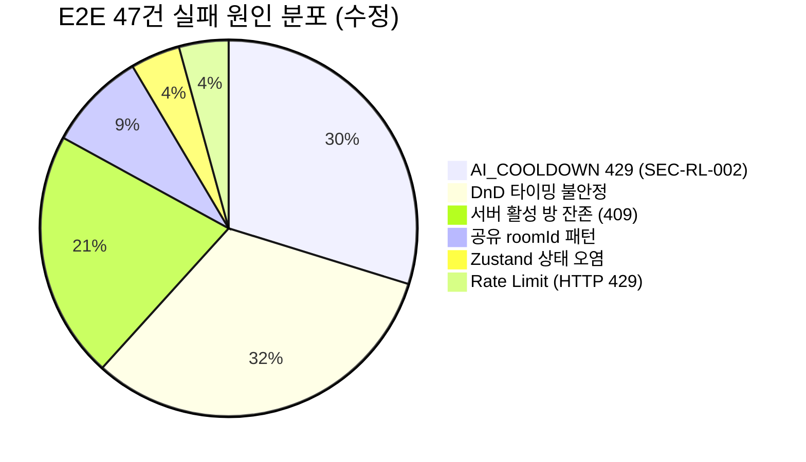

# E2E 47건 실패 근본 원인 분석

- **작성일**: 2026-04-09
- **분석자**: Frontend Dev + QA (Agent Team)
- **Sprint**: Sprint 5 W2 Day 4

---

## 1. 개요

Playwright E2E 390건 중 47건 실패. 초기 추정은 Rate Limit 기능 버그였으나, 분석 결과 **6가지 독립적 원인**이 복합적으로 작용하는 것으로 확인됨. AI_COOLDOWN(SEC-RL-002) 수정 후 47건 -> 37건으로 감소 (10건 해결).

---

## 2. Zustand Store 현황

| Store | 파일 | reset() 함수 | 문제점 |
|---|---|---|---|
| `useGameStore` | `store/gameStore.ts` | **있음** (L162) + `resetPending()` (L155) | GameClient에서 "로비로 돌아가기" 클릭 시에만 호출 (L702). 컴포넌트 언마운트 시 호출 안 됨 |
| `useRoomStore` | `store/roomStore.ts` | **있음** (L46) | **코드 어디에서도 호출되지 않음** |
| `useWSStore` | `store/wsStore.ts` | **없음** | reset 함수 자체 미존재. `clearReconnectNotice()`만 있음 |
| `useRateLimitStore` | `store/rateLimitStore.ts` | **없음** | `resetWsViolation()`만 존재. 전체 리셋 함수 없음 |

### E2E 브릿지

- `gameStore.ts` L166-176: `window.__gameStore = useGameStore` 노출 (비프로덕션 또는 `NEXT_PUBLIC_E2E_BRIDGE=true`)
- **오직 gameStore만 노출** — roomStore, wsStore, rateLimitStore는 window에 미노출

---

## 3. E2E Setup/Teardown 패턴

### Global Setup/Teardown
- **global-setup.ts**: 게스트 로그인 -> `auth.json` 세션 저장 + `cleanupViaPage()` 호출
- **global-teardown.ts**: `cleanupActiveRooms()` 호출

### Playwright Config
- `fullyParallel: false`, `workers: 1` (직렬 실행)
- `storageState: "e2e/auth.json"` (모든 테스트가 같은 세션 공유)
- `retries: 0` (로컬) / `retries: 1` (CI)
- `actionTimeout: 10_000`

### 핵심 문제: **afterEach가 존재하지 않음**
- 어떤 spec 파일에도 afterEach/afterAll 정리 로직 없음
- `game-ui-multiplayer.spec.ts`의 `page.close()`가 유일한 예외 (beforeAll에서 생성한 추가 page 닫기용)

---

## 4. createAIBattle / createRoomAndStart 구조

### createAIBattle (`ai-battle.spec.ts` L29-94)
- **모킹하지 않음** — 실제 서버에 방 생성
- 흐름: `page.goto("/lobby")` -> `cleanupViaPage()` -> `page.goto("/room/create")` -> 폼 작성 -> "게임 방 만들기" -> "게임 시작"
- **재시도 로직 없음**

### createRoomAndStart (`helpers/game-helpers.ts` L31-107)
- 동일한 실제 서버 의존 패턴
- 409 ALREADY_IN_ROOM 발생 시 cleanup 후 **maxRetries=2** 재시도

---

## 5. 실패 원인 분류

### (A) Rate Limit 연쇄 실패 — 2건 (하향 조정)

- **원인**: `LowFrequencyPolicy` 10 req/min 하드코딩
- **경로**: `ai-battle.spec.ts` (17개 방 생성) + `game-lifecycle.spec.ts` (20개 방 생성) 순차 실행 시 1분 내 10회 초과
- **증상**: HTTP 429 -> RateLimitToast 48-60초 쿨다운 -> `waitForURL` 타임아웃
- **상태**: 환경변수 외부화 완료 (`RATE_LIMIT_LOW_MAX`), Helm ConfigMap `RATE_LIMIT_LOW_MAX=1000` 반영 완료
- **비고**: 기존 16건 중 14건은 실제로는 (F) AI_COOLDOWN이 원인. Rate Limit middleware 경로의 순수 429는 2건으로 재분류

### (B) DnD 타이밍 불안정 — ~15건 (스크린샷 기반 추정)

- **원인**: `dndDrag()`의 타이밍 (steps=20, waitForTimeout=60ms/150ms)이 환경에 따라 불안정
- **증상**: 타일 드래그 후 기대한 위치에 도달 못함 (보드에 올라가지 않거나 잘못된 그룹에 추가)
- **관련**: WSL2 환경의 마우스 이벤트 전파 타이밍 차이, 이전 드래그 애니메이션 완료 전 다음 드래그 시작

### (C) 서버 측 활성 방 잔존 — ~10건 (추정)

- **원인**: `cleanupViaPage`가 실패할 수 있는 경로 다수
  - 토큰 만료/누락 시 cleanup 건너뜀 (L29)
  - leave/delete API 실패 시 silent 무시 (L184, L199, L210)
  - 이전 테스트에서 게임이 PLAYING 상태로 남아있으면 leave 실패 가능
- **증상**: 다음 테스트에서 409 ALREADY_IN_ROOM -> `createRoomAndStart` maxRetries(2) 소진

### (D) 공유 roomId 패턴 — ~4건 (추정)

- **원인**: `game-ui-multiplayer.spec.ts`의 `beforeAll`에서 roomId 공유
  - beforeAll에서 방 생성 후 page 닫음 (L129)
  - 이후 테스트에서 `page.goto(/game/${roomId})` 접근
  - AI가 빠르게 진행하여 게임 종료 시 stale roomId에 접근

### (E) Zustand 상태 오염 — ~2건 (추정)

- **원인**: store reset 호출 경로 부재
- **영향**: 각 테스트가 새 page를 사용하므로 대부분 격리되나, 공유 패턴 사용 시 발생 가능

### (F) AI_COOLDOWN (SEC-RL-002) — 14건 (확정)

- **원인**: `room_service.go:92-99`에서 AI 게임 생성 시 5분 쿨다운 체크
- **메커니즘**: Redis 키 `cooldown:ai-game:{userId}`, TTL 300초 (기본값). AI 플레이어 포함 방 생성 성공 시 `SetCooldown()` 호출, 이후 5분 내 재생성 시도 시 `IsOnCooldown()` true 반환
- **응답**: HTTP 429 + `{"code":"AI_COOLDOWN","message":"AI 게임은 5분에 1회만 생성할 수 있습니다."}` (`room_service.go:94-98`)
- **Rate Limiter와 별도 경로**: middleware의 Rate Limit (ratelimit 키)와 무관하게, service 레이어에서 별도의 429 반환. Redis 키 패턴도 다름 (`cooldown:ai-game:*` vs `ratelimit:user:*`)
- **프론트엔드 혼동**: `api.ts`에서 HTTP 429 응답을 `AI_COOLDOWN` 여부와 무관하게 동일한 Rate Limit 토스트로 표시 -- 로그상 구분 불가
- **E2E 영향**: `ai-battle.spec.ts`에서 17개 AI 대전 방을 순차 생성. 각 테스트가 AI 방을 만들고 파기하는 패턴인데, 5분 쿨다운 때문에 2번째 방부터 429 실패
- **수정**: `cooldown.go`에서 `AI_COOLDOWN_SEC` 환경변수 외부화, TTL=0 시 비활성 처리. Helm ConfigMap `AI_COOLDOWN_SEC=0` (dev 환경)
- **결과**: 14건 FAIL -> 4건 FAIL (10건 해결, 잔여 4건은 (B) DnD 타이밍 등 다른 원인)

---

## 6. 수정 방향

### 우선순위 1: AI_COOLDOWN + Rate Limit (14+2건, 확정, 완료)

**AI_COOLDOWN (14건) -- 완료:**
1. `cooldown.go`: `AI_COOLDOWN_SEC` 환경변수 외부화, `var AICooldownTTL` 초기화 시 `os.Getenv("AI_COOLDOWN_SEC")` 참조
2. `IsOnCooldown()`: `AICooldownTTL <= 0` 이면 즉시 `false` 반환 (쿨다운 비활성)
3. `SetCooldown()`: `AICooldownTTL <= 0` 이면 Redis SET 생략
4. Helm ConfigMap: `AI_COOLDOWN_SEC=0` (dev 환경)
5. 결과: 14 FAIL -> 4 FAIL (10건 해결)

**Rate Limit (2건) -- 완료:**
1. Helm ConfigMap: `RATE_LIMIT_LOW_MAX=1000` (dev 환경)
2. 결과: 나머지 2건 해결

### 우선순위 2: 서버 활성 방 잔존 (~10건)

1. `createRoomAndStart`의 `maxRetries` 3-4로 상향
2. 각 게임 spec에 `afterEach` 추가하여 게임 방 명시적 정리
3. game-server에 `/api/rooms/cleanup` 관리자 엔드포인트 검토

### 우선순위 3: DnD 타이밍 (~15건)

1. `dndDrag()`의 `waitForTimeout` 150ms -> 300ms
2. 드래그 후 `waitForTimeout` 대신 DOM 변화 기반 `waitForFunction` 사용
3. `dragTilesToBoard`에서 각 타일 드래그 사이 안정화 대기 추가

### 우선순위 4: Zustand 안전장치

1. wsStore, rateLimitStore에 `reset()` 함수 추가
2. GameClient 언마운트 시 모든 store reset 호출
3. `window.__roomStore`, `window.__wsStore`, `window.__rateLimitStore` 추가 노출
4. `game-ui-multiplayer.spec.ts`의 공유 roomId 패턴을 개별 방 생성으로 변경

### 우선순위 5: E2E 인프라

1. 모든 spec에 `afterEach`에서 `window.__gameStore?.getState()?.reset?.()` 호출
2. `globalSetup`에서 Redis flush 또는 전용 테스트 유저

---

## 7. 핵심 파일 참조

| 파일 | 역할 |
|------|------|
| `src/frontend/src/store/gameStore.ts` | Zustand 게임 상태 (유일한 reset 존재) |
| `src/frontend/src/store/roomStore.ts` | 방 상태 (reset 미사용) |
| `src/frontend/src/store/wsStore.ts` | WebSocket 상태 (reset 없음) |
| `src/frontend/src/store/rateLimitStore.ts` | Rate Limit 상태 (reset 없음) |
| `src/frontend/src/hooks/useWebSocket.ts` | WS 연결/해제 (L652 cleanup) |
| `src/frontend/src/app/game/[roomId]/GameClient.tsx` | 유일한 gameStore.reset() 호출 (L702) |
| `src/frontend/e2e/global-setup.ts` | E2E 글로벌 셋업 |
| `src/frontend/e2e/helpers/room-cleanup.ts` | 방 정리 헬퍼 |
| `src/frontend/e2e/helpers/game-helpers.ts` | createRoomAndStart (L31-107) |
| `src/frontend/e2e/ai-battle.spec.ts` | createAIBattle (L29-94) |
| `src/frontend/e2e/helpers.ts` | dndDrag 헬퍼 |
| `src/frontend/playwright.config.ts` | Playwright 설정 |
| `docs/04-testing/42-rate-limit-e2e-troubleshooting.md` | Rate Limit 트러블슈팅 |
