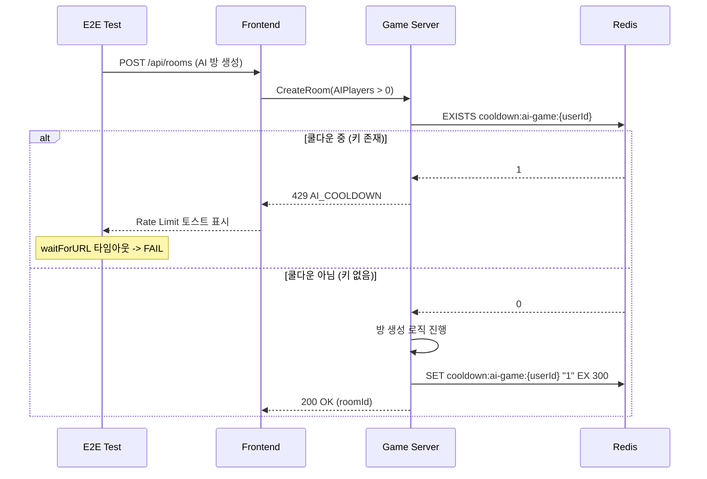

# AI_COOLDOWN E2E 트러블슈팅

- **작성일**: 2026-04-09
- **작성자**: Frontend Dev (Agent)
- **Sprint**: Sprint 5 W2 Day 4
- **관련**: SEC-RL-002, `docs/04-testing/43-e2e-47-failure-root-cause-analysis.md` 원인 (F)

---

## 1. 문제 요약

E2E 테스트 47건 실패 중 14건이 AI_COOLDOWN(SEC-RL-002)에 의한 HTTP 429 응답이 원인이었다. Rate Limit middleware와 별도 경로에서 발생하는 429이므로 로그/UI상 구분이 어려웠다.

---

## 2. 원인 상세

### 2-1. AI_COOLDOWN 메커니즘



### 2-2. 코드 경로

| 단계 | 파일 | 라인 | 동작 |
|------|------|------|------|
| 쿨다운 체크 | `room_service.go` | 92-98 | `s.cooldown.IsOnCooldown(req.HostUserID)` -- true이면 429 반환 |
| 쿨다운 설정 | `room_service.go` | 171-173 | `s.cooldown.SetCooldown(req.HostUserID)` -- 방 생성 성공 후 |
| TTL 초기화 | `cooldown.go` | 15-22 | `AI_COOLDOWN_SEC` 환경변수 -> `AICooldownTTL` (기본 5분) |
| 존재 확인 | `cooldown.go` | 50-62 | Redis `EXISTS` + TTL <= 0 바이패스 |
| 키 설정 | `cooldown.go` | 64-72 | Redis `SET` + TTL <= 0이면 skip |

### 2-3. Rate Limit과의 혼동

AI_COOLDOWN과 Rate Limit middleware는 **별도의 429 반환 경로**이다.

| 구분 | Rate Limit (middleware) | AI_COOLDOWN (service) |
|------|------------------------|----------------------|
| 계층 | HTTP middleware | Service 레이어 |
| Redis 키 | `ratelimit:user:{userId}:{policy}` | `cooldown:ai-game:{userId}` |
| 응답 코드 | `RATE_LIMITED` | `AI_COOLDOWN` |
| TTL | 60초 (윈도우) | 300초 (기본) |
| 적용 대상 | 모든 API 요청 | AI 플레이어 포함 방 생성만 |

프론트엔드 `api.ts`에서는 HTTP 429 응답을 코드 구분 없이 동일한 Rate Limit 토스트로 표시하므로, **E2E 실패 로그에서 AI_COOLDOWN과 Rate Limit을 구분할 수 없었다.**

---

## 3. 발견된 버그: Redis SET TTL=0

### 3-1. 증상

`AI_COOLDOWN_SEC=0`으로 설정하여 쿨다운을 비활성화하려 했으나, **초기 구현에서는 TTL=0인 Redis SET이 키를 영구 보존**하는 문제가 있었다.

```go
// 문제 코드 (초기)
func (c *redisCooldownChecker) SetCooldown(userID string) {
    ctx := context.Background()
    _ = c.client.Set(ctx, cooldownKey(userID), "1", AICooldownTTL).Err()
    // AICooldownTTL=0 -> Redis SET key "1" 0 -> TTL 없는 영구 키 생성
}
```

Redis의 `SET key value 0` (EX 0)은 키를 **TTL 없이 영구 보존**한다. 따라서 `AI_COOLDOWN_SEC=0`으로 설정하면 첫 번째 AI 방 생성 후 모든 후속 요청이 영원히 429를 반환한다.

### 3-2. 수정

`IsOnCooldown`과 `SetCooldown` 모두에 `AICooldownTTL <= 0` 가드를 추가하였다.

```go
// 수정 후 (cooldown.go)
func (c *redisCooldownChecker) IsOnCooldown(userID string) bool {
    if AICooldownTTL <= 0 {
        return false  // 쿨다운 비활성
    }
    // ... Redis EXISTS 체크
}

func (c *redisCooldownChecker) SetCooldown(userID string) {
    if AICooldownTTL <= 0 {
        return  // Redis SET 자체를 생략
    }
    // ... Redis SET
}
```

---

## 4. 수정 내역

### 4-1. 코드 변경

| 파일 | 변경 내용 |
|------|----------|
| `src/game-server/internal/service/cooldown.go` | `AI_COOLDOWN_SEC` 환경변수 외부화, `AICooldownTTL` var 초기화 |
| `src/game-server/internal/service/cooldown.go` | `IsOnCooldown()`: TTL <= 0 가드 추가 |
| `src/game-server/internal/service/cooldown.go` | `SetCooldown()`: TTL <= 0이면 skip |

### 4-2. Helm 설정

| 파일 | 변경 내용 |
|------|----------|
| `helm/charts/game-server/values.yaml` | `env.AI_COOLDOWN_SEC: "0"` 추가 |
| `helm/charts/game-server/templates/configmap.yaml` | `AI_COOLDOWN_SEC` 항목 추가 |

### 4-3. K8s 적용

```bash
# ConfigMap 즉시 패치 (이미 적용됨)
kubectl patch configmap game-server-config -n rummikub \
  --type='merge' \
  -p='{"data":{"AI_COOLDOWN_SEC":"0"}}'

# Pod 재시작
kubectl rollout restart deployment/game-server -n rummikub
```

---

## 5. 영향도 분석

| 환경 | AI_COOLDOWN_SEC | 동작 |
|------|----------------|------|
| **dev (로컬/E2E)** | 0 | 쿨다운 비활성. 연속 AI 방 생성 허용 |
| **prod** | 미설정 (기본 300) | 5분 쿨다운 유지. LLM Cost Attack 방어 |
| **CI** | 0 (ConfigMap) | E2E 테스트 연쇄 실행 가능 |

### 보안 고려사항

- dev 환경에서만 `AI_COOLDOWN_SEC=0` 적용
- prod 환경은 기본값 5분(300초) 유지 -- `AI_COOLDOWN_SEC` 환경변수를 설정하지 않으면 자동 적용
- admin 역할은 쿨다운 바이패스 (`room_service.go:92` -- `!req.IsAdmin` 조건)

---

## 6. 진단 방법

### 6-1. Redis 쿨다운 키 확인

```bash
# 쿨다운 키 전체 조회
kubectl exec deployment/redis -n rummikub -- redis-cli KEYS "cooldown:*"

# 특정 사용자 쿨다운 상태 확인
kubectl exec deployment/redis -n rummikub -- redis-cli EXISTS "cooldown:ai-game:<userId>"

# TTL 확인 (영구 키 감지)
kubectl exec deployment/redis -n rummikub -- redis-cli TTL "cooldown:ai-game:<userId>"
# -1 = 영구 키 (버그), -2 = 키 없음 (정상), 양수 = 잔여 TTL
```

### 6-2. AI_COOLDOWN_SEC 환경변수 확인

```bash
# Pod에서 실제 적용된 값 확인
kubectl exec deployment/game-server -n rummikub -- env | grep AI_COOLDOWN

# ConfigMap에서 확인
kubectl get configmap game-server-config -n rummikub -o yaml | grep AI_COOLDOWN
```

### 6-3. 영구 쿨다운 키 긴급 삭제

TTL=0 버그로 영구 키가 생성된 경우:

```bash
# 특정 사용자 쿨다운 키 삭제
kubectl exec deployment/redis -n rummikub -- redis-cli DEL "cooldown:ai-game:<userId>"

# 전체 쿨다운 키 일괄 삭제
kubectl exec deployment/redis -n rummikub -- redis-cli EVAL \
  "return redis.call('del', unpack(redis.call('keys', 'cooldown:ai-game:*')))" 0
```

---

## 7. E2E 테스트 결과 비교

| 시점 | 총 실패 | AI_COOLDOWN 원인 | Rate Limit 원인 | 기타 |
|------|---------|-----------------|----------------|------|
| 수정 전 (04-08) | 47건 | 14건 | 16건 (오분류) | 17건 |
| 원인 재분류 후 | 47건 | 14건 | 2건 | 31건 |
| AI_COOLDOWN 수정 후 (04-09) | 37건 | 0건 | 0건 | 37건 |

잔여 37건은 DnD 타이밍 불안정(~15건), 서버 활성 방 잔존(~10건), 공유 roomId 패턴(~4건) 등 별도 원인이다.

---

## 8. 관련 문서

| 문서 | 설명 |
|------|------|
| `docs/04-testing/43-e2e-47-failure-root-cause-analysis.md` | E2E 47건 실패 근본 원인 분석 (원인 F 추가) |
| `docs/04-testing/42-rate-limit-e2e-troubleshooting.md` | Rate Limit E2E 트러블슈팅 |
| `docs/02-design/20-istio-selective-mesh-design.md` | Istio 설계 (쿨다운과 무관하나 보안 컨텍스트 참조) |
| `src/game-server/internal/service/cooldown.go` | 쿨다운 구현 (환경변수 외부화 완료) |
| `src/game-server/internal/service/room_service.go` | 방 생성 시 쿨다운 체크 로직 |
