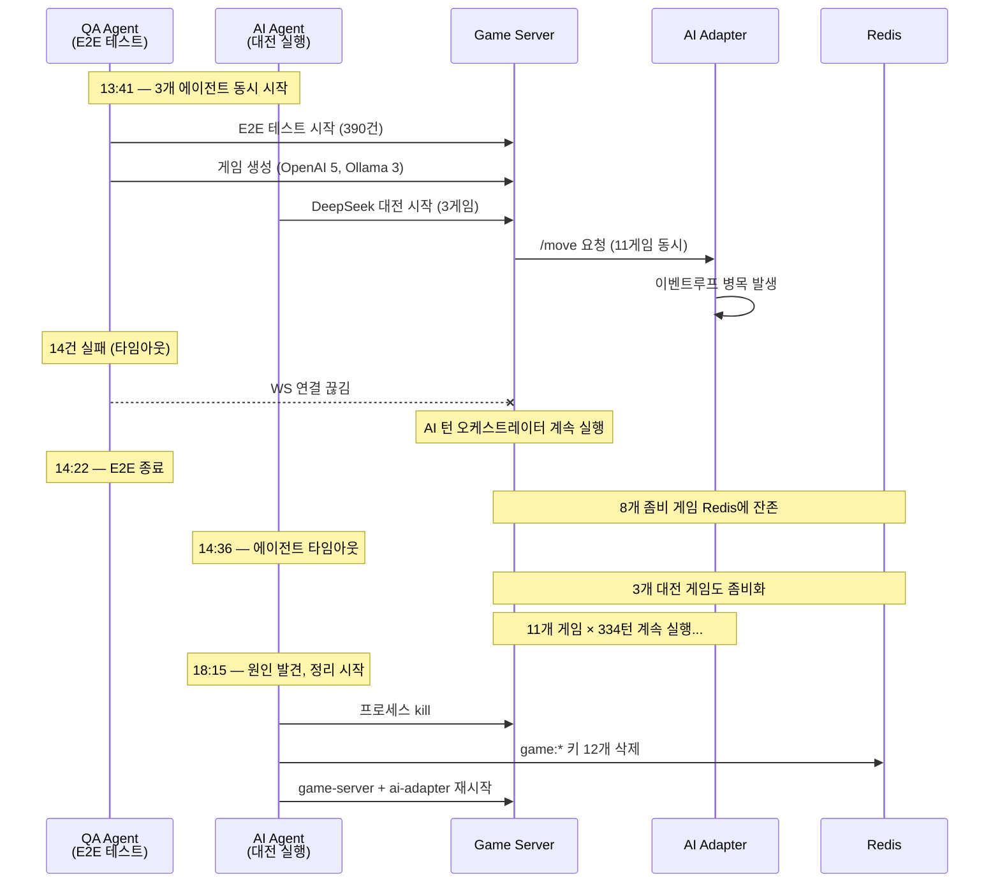
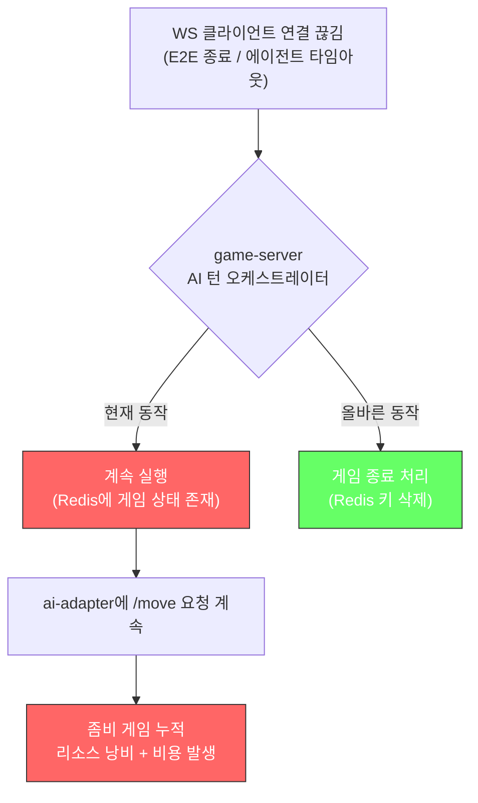

# 좀비 게임 대전 트러블슈팅

- **작성일**: 2026-04-10
- **작성자**: 애벌레 + Claude Code
- **Sprint**: Sprint 5 W2 Day 5
- **심각도**: High (비용 낭비 + 대전 데이터 오염)

---

## 1. 문제 요약

AI 대전 테스트(v2 다회 실행) 중 DeepSeek Reasoner의 턴당 응답 시간이 **278초**로 측정됨. 역대 평균 131~148초 대비 **약 2배** 증가. 원인 조사 결과, **11개 좀비 게임이 동시 실행** 중이었으며 이는 E2E 테스트와 AI 대전을 동시에 실행한 데서 기인.

---

## 2. 타임라인



---

## 3. 근본 원인 분석

### 3-1. 직접 원인: E2E + 대전 동시 실행

| 에이전트 | 생성한 게임 | 모델 | 상태 |
|----------|-----------|------|------|
| QA (E2E) | 8개 | OpenAI 5, Ollama 3 | 14건 실패 → 게임 미정리 |
| AI (대전) | 3개 | DeepSeek 3 | 에이전트 타임아웃 → 게임 미정리 |
| **합계** | **11개** | **334턴 동시 처리** | **ai-adapter 병목** |

### 3-2. 구조적 원인: WS 끊김 시 게임 미정리



### 3-3. 영향도

| 항목 | 값 |
|------|-----|
| DeepSeek 레이턴시 | 131초 → **278초** (+112%) |
| 낭비된 OpenAI 비용 | 122턴 × $0.025 = **~$3.05** |
| 낭비된 시간 | ~2.5시간 (잘못된 데이터 수집) |
| 오염된 대전 결과 | DeepSeek Run 1 중간 데이터 (21.7% place rate, 부정확) |

---

## 4. 해결 조치

### 4-1. 즉시 조치 (완료)

```bash
# 1. 실행 중인 배틀 프로세스 종료
kill <pid_multirun> <pid_battle>

# 2. Redis 좀비 게임 키 전체 삭제
kubectl exec -n rummikub deploy/redis -- redis-cli eval "
local keys = redis.call('keys', 'game:*')
for i, key in ipairs(keys) do redis.call('del', key) end
return #keys
" 0
# → 12개 키 삭제

# 3. game-server + ai-adapter 재시작 (좀비 오케스트레이터 정리)
kubectl rollout restart deploy/game-server deploy/ai-adapter -n rummikub
```

### 4-2. 재발 방지 프로세스

**대전 실행 전 필수 체크리스트**:

1. **Redis 게임 키 0개 확인**
   ```bash
   kubectl exec -n rummikub deploy/redis -- redis-cli keys "game:*"
   # 결과가 비어야 함
   ```
2. **ai-adapter /move 요청 없음 확인**
   ```bash
   kubectl logs -n rummikub deploy/ai-adapter --tail=5 | grep -c "MoveController"
   # 0이어야 함
   ```
3. **E2E 테스트와 대전을 절대 동시 실행하지 않음**
4. **대전 시작 후 첫 3턴 레이턴시 확인** (역대 평균 대비 2배 이상이면 중단)

---

## 5. 사전점검 테이블 (대전 당일)

| 항목 | 상태 |
|------|------|
| K8s 클러스터 | v1.34.1, 7/7 Pod Running |
| Redis/PostgreSQL | PONG / accepting connections |
| ConfigMap | AI_COOLDOWN=0, COST_LIMIT=$20, RATE_LIMIT=1000 |
| 이미지 리빌드 | ai-adapter + frontend 재빌드 완료 (822282e 반영) |
| game-server | 04-09 빌드, 이미 최신 |

---

## 6. 아키텍처 개선 제안 (Sprint 6)

### BUG-GS-005: WS 끊김 시 AI 게임 자동 정리

**현상**: 모든 Human 플레이어의 WS가 끊겨도 AI 턴 오케스트레이터가 계속 실행됨

**제안 수정**:
```
// game-server: ws_handler.go 또는 turn_orchestrator.go
// Human 플레이어 전원 WS 끊김 감지 시:
// 1. AI 턴 타이머 취소
// 2. 게임 상태를 CANCELLED로 변경
// 3. Redis 게임 키 TTL 설정 (5분 후 자동 삭제)
```

**우선순위**: Medium (대전 실행 시마다 수동 확인으로 우회 가능)

---

## 7. 교훈 — 근본 원인은 오케스트레이션 부재

이 사고의 본질은 "병렬 실행"이 아니라 **Agent Teams 협업 설계를 하지 않은 것**이다.

1. **에이전트를 던져놓고 방치하는 건 협업이 아니다** — 오케스트레이터(Claude Code)가 중간 결과를 확인하고 다음 단계를 트리거해야 한다
2. **DevOps 에이전트에 실시간 감시 역할을 부여하지 않았다** — 헬스체크 한 번 하고 끝나버렸다. 대전 전체 기간 동안 Redis 게임 수, ai-adapter 레이턴시를 모니터링했어야 한다
3. **QA → AI Engineer 핸드오프를 설계하지 않았다** — QA 완료 후 정리 확인 → 그 다음 대전 시작이어야 한다. 동시에 시작해버렸다
4. **에이전트 프롬프트에 "정리 단계"를 빠뜨렸다** — 각 에이전트가 자기 작업 후 Redis 키 삭제, 프로세스 종료를 확인하도록 명시했어야 한다
5. **자원 의존관계 분석을 하지 않았다** — QA도 ai-adapter를 쓰고, 대전도 ai-adapter를 쓴다. 같은 자원을 쓰는 에이전트는 순차 실행이 원칙이다
