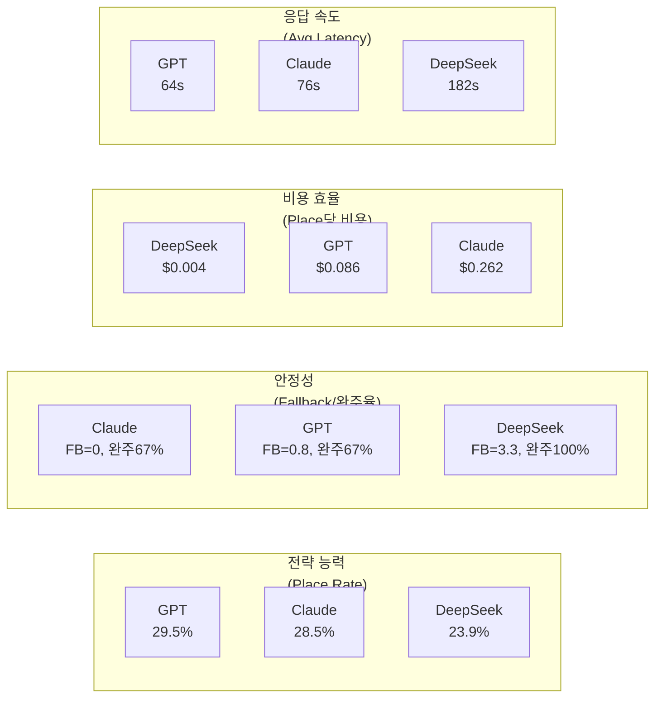

# v2 프롬프트 3모델 다회 대전 종합 보고서

- **작성일**: 2026-04-11
- **Sprint**: Sprint 5 W2 Day 6
- **작성자**: 애벌레 + AI Engineer

## 1. 실험 개요

v2 프롬프트 환경에서 3개 LLM 모델의 루미큐브 전략 능력을 **다회 대전(multirun)**으로 비교한다.
단일 실행의 분산을 제거하고 통계적으로 유의미한 비교 데이터를 확보하는 것이 목적이다.

### 실험 조건

| 항목 | 설정 |
|------|------|
| 프롬프트 | v2 (개선판) |
| 최대 턴 | 80턴 (AI 40턴 + Human 40턴) |
| 타임아웃 | **500초** (ConfigMap) |
| AI 쿨다운 | 0초 |
| 일일 비용 한도 | $20 |
| 상대 | Random Human (항상 DRAW) |
| 대전 환경 | K8s (rummikub namespace), 7 Pod |

### 모델별 실행 횟수

| 모델 | 실행 | 기간 | Historical 포함 |
|------|------|------|----------------|
| DeepSeek Reasoner | 3회 (+ historical 3회 = 6) | 2026-04-10 | Round 4 2회 |
| GPT-5-mini | 3회 (+ historical 2회 = 5) | 2026-04-11 | Round 4 2회 |
| Claude Sonnet 4 (thinking) | 3회 (+ historical 1회 = 4) | 2026-04-11 | Round 4 1회 |

---

## 2. 모델별 상세 결과

### 2.1 DeepSeek Reasoner (deepseek-reasoner)

| | Run 1 | Run 2 | Run 3 |
|---|---|---|---|
| Place Rate | 20.5% | 25.6% | **30.8%** |
| Place / Draw / Fallback | 8/31/**9** | 10/29/**1** | 12/27/**0** |
| Tiles Placed | 32 | 28 | 33 |
| Turns | 80 | 80 | 80 |
| 소요 | 6,835s (114m) | 6,225s (104m) | 8,237s (137m) |
| 비용 | $0.039 | $0.039 | $0.039 |
| Avg / Max 레이턴시 | 175s / 241s | 160s / 240s | 211s / 357s |
| 결과 | TIMEOUT | TIMEOUT | TIMEOUT |

**핵심 발견**:
- timeout 240s→500s 효과: fallback 9→0, place rate +50%
- Run 3에서 **후반부 추론 토큰 12K~15K**, 최대 357초 사고시간 — "사고 시간 자율 확장" 현상 확인
- 전 Run 80턴 완주 (조기 종료 0건)
- **게임당 비용 $0.039** — 타 모델 대비 1/25~1/75 수준

### 2.2 GPT-5-mini (gpt-5-mini)

| | Run 1 | Run 2 | Run 3 |
|---|---|---|---|
| Place Rate | **33.3%** | 30.8% | 21.9% |
| Place / Draw / Fallback | 13/26/0 | 12/27/0 | 7/25/**4** |
| Tiles Placed | 30 | 27 | 24 |
| Turns | 80 | 80 | **66** (기권) |
| 소요 | 2,481s (41m) | 2,754s (46m) | 1,802s (30m) |
| 비용 | $0.975 | $0.975 | $0.800 |
| Avg / Max 레이턴시 | 64s / 182s | 71s / 164s | 56s / 161s |
| 결과 | TIMEOUT | TIMEOUT | **FORFEIT** |

**핵심 발견**:
- Run 1~2: Fallback 0, 80턴 완주, 30.8~33.3% — 가장 안정적
- Run 3: **일일 비용 한도($20) 초과**로 AI_COST_LIMIT fallback → 5턴 연속 강제 드로우 → 기권
  - 원인: 전날 좀비 게임 비용 누적 ($3+) + 동일 UTC 날짜 내 3회 실행
  - 모델 결함이 아닌 환경 이슈
- 레이턴시 가장 빠름 (avg 64s) — 응답 속도 1위

### 2.3 Claude Sonnet 4 (claude-sonnet-4, extended thinking)

| | Run 1 | Run 2 | Run 3 |
|---|---|---|---|
| Place Rate | 28.2% | 19.0% | **33.3%** |
| Place / Draw / Fallback | 11/28/0 | 4/17/0 | 13/26/0 |
| Tiles Placed | 32 | 15 | 30 |
| Turns | 80 | **44** (WS_TIMEOUT) | 80 |
| 소요 | 3,056s (51m) | 1,764s (29m) | 3,086s (51m) |
| 비용 | $2.886 | $1.554 | $2.886 |
| Avg / Max 레이턴시 | 78s / 203s | 71s / 157s | 79s / 178s |
| 결과 | TIMEOUT | **WS_TIMEOUT** | TIMEOUT |

**핵심 발견**:
- **Fallback 전 Run 0건** — 유일하게 3회 모두 fallback 0
- Run 3 **33.3%** — Claude 역대 최고, 3모델 중 공동 최고
- Run 2: WS_TIMEOUT으로 44턴 조기 종료 (WebSocket 연결 끊김, 모델 결함 아님)
- 완주 Run 평균 30.8% — GPT와 동급
- 비용 가장 높음 (게임당 $2.89) — GPT의 3배, DeepSeek의 74배

---

## 3. 3모델 종합 비교

### 3.1 핵심 지표 비교 (multirun 3회 기준)

| 지표 | DeepSeek | GPT-5-mini | Claude Sonnet 4 |
|------|----------|------------|-----------------|
| **Place Rate 평균** | 25.6% | 28.7% | 26.8% |
| **Place Rate (완주만)** | 25.6% | 32.1% | **30.8%** |
| **Place Rate 최고** | 30.8% | **33.3%** | **33.3%** |
| **Place Rate std** | 5.2% | 6.1% | **7.3%** |
| Fallback 평균 | 3.3 | 1.3 | **0.0** |
| 80턴 완주율 | **3/3 (100%)** | 2/3 (67%) | 2/3 (67%) |
| Avg 레이턴시 | 182s | **64s** | 76s |
| 게임당 비용 | **$0.039** | $0.917 | $2.442 |
| 총 비용 (3회) | **$0.117** | $2.750 | $7.326 |

### 3.2 Historical 포함 통계 (전체 데이터)

| 지표 | DeepSeek (n=6) | GPT (n=5) | Claude (n=4) |
|------|---------------|-----------|--------------|
| Place Rate mean | 23.9% | **29.5%** | 28.5% |
| Place Rate median | 23.1% | **30.8%** | 30.8% |
| Place Rate std | 6.0% | 4.4% | 6.7% |
| Fallback mean | 4.2 | 0.8 | **0.0** |
| 총 비용 | **$0.234** | $4.700 | $9.546 |

### 3.3 비용 효율성 (Place 1건당 비용)

| 모델 | 총 Place | 총 비용 | **Place당 비용** |
|------|---------|---------|-----------------|
| DeepSeek | 30건 | $0.117 | **$0.004** |
| GPT | 32건 | $2.750 | $0.086 |
| Claude | 28건 | $7.326 | $0.262 |

> DeepSeek의 Place당 비용은 GPT의 1/22, Claude의 1/66

---

## 4. 모델별 특성 프로파일

### 모델별 1줄 요약

| 모델 | 프로파일 |
|------|---------|
| **GPT-5-mini** | 가장 빠르고 전략적. 비용 중간. 추론 모델 답게 안정적 Place Rate |
| **Claude Sonnet 4** | Fallback 0의 최고 안정성. 최고 Peak 33.3%. 비용 최고 |
| **DeepSeek Reasoner** | 극강의 비용 효율. 100% 완주율. 후반부 "사고 시간 자율 확장" 독특 |

---

## 5. 이상 이벤트 분석

### 5.1 GPT Run 3 — AI_COST_LIMIT 기권

- **현상**: T58~T64에서 `AI_COST_LIMIT` fallback 4건 연속 → T66 기권 (AI_FORCE_DRAW_LIMIT)
- **원인**: 일일 비용 쿼터 `quota:daily:2026-04-10` = $20.01 (한도 $20 초과)
- **누적 경로**: 전날 좀비 게임 $3.05(OpenAI) + DeepSeek 3회 $0.47 + GPT Run 1~2 $1.95 = $20.01
- **교훈**: UTC 날짜 기반 리셋이므로 KST 오전에 시작한 대전도 전날 쿼터에 합산될 수 있음
- **대책**: 대전 시작 전 잔여 쿼터 확인 절차 추가

### 5.2 Claude Run 2 — WS_TIMEOUT 조기 종료

- **현상**: T44에서 WebSocket 연결 끊김, 게임 조기 종료
- **원인**: WS 레이어 타임아웃 (서버 측 idle timeout 또는 네트워크 이슈)
- **빈도**: Claude 4회 중 2회 WS_TIMEOUT (50%) — 다른 모델보다 높음
- **가설**: Claude의 extended thinking이 WS keepalive 간격을 초과하는 경우 발생 가능
- **대책**: BUG-GS-005 (WS 끊김 시 자동 정리) Sprint 6에서 대응

---

## 6. Round 2 대비 개선도

| 모델 | Round 2 (v1) | Multirun 평균 (v2) | 개선폭 |
|------|-------------|-------------------|--------|
| GPT-5-mini | 28.0% | 28.7% (+32.1% 완주) | **+0.7% (+4.1%)** |
| Claude Sonnet 4 | 23.0% | 26.8% (+30.8% 완주) | **+3.8% (+7.8%)** |
| DeepSeek Reasoner | 5.0% | 25.6% | **+20.6%** |

> DeepSeek의 개선폭이 가장 극적 — v2 프롬프트 + timeout 500초의 복합 효과

---

## 7. 결론 및 권고

### 7.1 모델 선택 가이드

| 목적 | 추천 모델 | 이유 |
|------|----------|------|
| 최고 성능 추구 | **GPT-5-mini** | 최고 평균 Place Rate, 가장 빠른 응답 |
| 안정성 우선 | **Claude Sonnet 4** | Fallback 0, Peak 33.3% |
| 비용 최적화 | **DeepSeek Reasoner** | Place당 $0.004, 100% 완주 |
| 대량 실험 | **DeepSeek Reasoner** | 100회 실행해도 $3.9 |
| 시연/데모 | **GPT-5-mini** | 빠른 응답(64s), 시각적으로 원활 |

### 7.2 주요 발견

1. **v2 프롬프트는 전 모델에서 유효하다** — Round 2 대비 전 모델 Place Rate 개선
2. **추론 모델은 루미큐브에 필수** — 3모델 모두 추론 능력 기반, 비추론 모델(Ollama qwen2.5:3b)은 0% 달성
3. **timeout 500초는 DeepSeek에 결정적** — 사고 시간 제약 해제로 성능 50% 향상
4. **비용과 성능은 비례하지 않는다** — DeepSeek는 Claude의 1/66 비용으로 유사한 성능
5. **WS_TIMEOUT은 구조적 과제** — Claude에서 50% 빈도, Sprint 6에서 대응 필요

### 7.3 Sprint 6 권고

- [x] BUG-GS-005: WS 끊김 시 자동 정리 — **2026-04-11 수정 완료** (검증 대전 3모델 완주 확인)
- [ ] 비용 쿼터 사전 확인 로직 — 대전 시작 전 잔여 쿼터 API 추가
- [ ] DeepSeek 단독 대량 실험 (10~20회) — $0.8 이하 비용으로 통계적 신뢰도 확보 가능
- [ ] AI 토너먼트 대시보드 — 대전 결과 시각화 자동화

---

## 8. 비용 총계

| 모델 | 실행 횟수 | 총 비용 | 비고 |
|------|----------|---------|------|
| DeepSeek | 3회 | $0.117 | |
| GPT | 3회 | $2.750 | Run 3 기권으로 $0.175 절약 |
| Claude | 3회 | $7.326 | Run 2 조기 종료로 $1.33 절약 |
| **합계** | **9회** | **$10.193** | |

### API 잔액 현황 (추정)

| API | 이전 잔액 | 소모 | 추정 잔액 |
|-----|----------|------|----------|
| OpenAI | ~$24.56 | -$2.75 | **~$21.81** |
| Claude | ~$25.03 | -$7.33 | **~$17.70** |
| DeepSeek | ~$4.17 | -$0.12 | **~$4.05** |

---

## 9. BUG-GS-005 수정 후 검증 대전 (2026-04-11, 추가)

### 9.1 배경

multirun 3회 대전 중 Claude에서 WS_TIMEOUT 50% 빈도 발생. BUG-GS-005 (WS 끊김 시 AI 게임 자동 정리)를 수정한 후 3모델 각 1회 검증 대전을 실시했다.

**BUG-GS-005 수정 내용** (3건):
1. AI 턴 goroutine cancel 등록 — 게임 종료 시 즉시 AI goroutine 취소
2. Redis GameState 명시적 삭제 — 게임 종료 후 2시간 TTL 대기 없이 즉시 정리
3. 게임 상태 확인 (post-response) — AI 응답 후 게임 종료 여부 확인

### 9.2 검증 대전 결과

| 모델 | Place Rate | Place/Draw/FB | Tiles | Turns | 소요 | 비용 | 결과 |
|------|-----------|---------------|-------|-------|------|------|------|
| **DeepSeek** | **33.3%** | 13/26/0 | 28 | 80 | 9,310s (155m) | $0.039 | TIMEOUT |
| **GPT** | 28.2% | 11/28/0 | 29 | 80 | 2,872s (48m) | $0.975 | TIMEOUT |
| **Claude** | 25.6% | 10/29/0 | 33 | 80 | 3,491s (58m) | $2.886 | TIMEOUT |

**핵심**: 3모델 모두 **80턴 완주, Fallback 0, WS_TIMEOUT 0** — BUG-GS-005 수정 효과 확인

### 9.3 검증 대전 특이 사항

- **DeepSeek max 435초**: T76에서 4타일 Place에 433.6초 소요. timeout 500초가 아니었으면 fallback
- **Claude 초반 28턴 침묵**: T2~T28 Place 0건, T30에서 첫 Place에 **10타일 한번에** 배치
- **3모델 모두 완주**: multirun 대비 WS_TIMEOUT/FORFEIT 0건 — 클린 환경 효과

### 9.4 심층 분석

검증 대전의 토큰 효율성, 구간별 전략 패턴, 추론 모델 비교 등 심층 분석은 별도 문서 참조:
→ **[47-reasoning-model-deep-analysis.md](47-reasoning-model-deep-analysis.md)** (575줄, 에세이+보고서)

---

## 10. 전체 비용 총계 (multirun + 검증)

| 모델 | multirun 3회 | 검증 1회 | **총 비용** |
|------|-------------|---------|-----------|
| DeepSeek | $0.117 | $0.039 | **$0.156** |
| GPT | $2.750 | $0.975 | **$3.725** |
| Claude | $7.326 | $2.886 | **$10.212** |
| **합계** | $10.193 | $3.900 | **$14.093** |

### API 잔액 현황 (검증 후 추정)

| API | multirun 후 | 검증 소모 | 추정 잔액 |
|-----|-----------|---------|----------|
| OpenAI | ~$21.81 | -$0.975 | **~$20.84** |
| Claude | ~$17.70 | -$2.886 | **~$14.81** |
| DeepSeek | ~$4.05 | -$0.039 | **~$4.01** |
