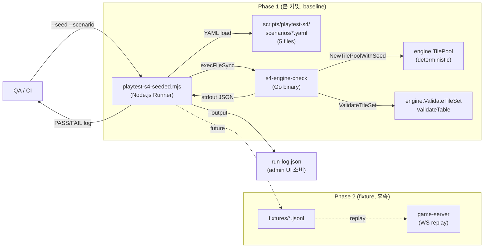

# 53. Playtest S4 결정론적 시드 프레임워크

- **작성일**: 2026-04-14 (Sprint 6 Day 3)
- **작성자**: qa-2 (Task #7 B3)
- **상태**: Phase 1 완료 (baseline AI 모드 5/5 PASS)
- **관련**:
  - **입력**: `docs/04-testing/52-19-rules-full-audit-report.md` (architect-1 B1)
  - **입력**: `docs/02-design/37-playtest-s4-deterministic-ux.md` (designer-1 B2)
  - **입력**: `docs/02-design/38-colorblind-safe-palette.md` (designer-1 팔레트)
  - **출력 → B4**: §10 Admin UI Contract

---

## 1. 배경

### 1.1 왜 결정론이 필요한가

Sprint 6 Day 1+2에서 발견된 BUG-UI-REARRANGE-002 (그룹 5회 중복 렌더링)와 BUG-UI-CLASSIFY-001a/b
(혼합 숫자 분류 오류)는 모두 라이브 테스트에서 "우연히" 조건이 충족되었을 때 드러났다. 같은 조건을
재현하려면 다시 운이 좋아야 한다는 것은 회귀 테스트 설계 관점에서 **용납할 수 없는 상황**이다.

architect-1의 52번 감사 보고서 §4에 따르면, 다음 규칙들은 "조커/재배치 시드 의존" 또는
"타임아웃 실시간 재현 비용" 때문에 기존 Playtest S4에서 실행되지 못했다:

- **P0**: V-07 (조커), V-13b/c/d/e (재배치 4유형)
- **P1**: V-09 (타임아웃 전이), UI classify (BUG-UI-CLASSIFY-001a/b)

본 프레임워크는 이 공백을 결정론적 시드 기반 재현으로 메운다.

### 1.2 접근 방식 — 3-mode 설계

| Mode | 설명 | 속도 | 결정론 | 본 프레임워크 Phase |
|------|------|-----|--------|------|
| **baseline** | 엔진 레벨 직접 호출 (`cmd/s4-engine-check`). WS/LLM 없음. | ms 단위 | 100% | **Phase 1 완료** |
| **fixture** | 사전 녹화된 AI 응답을 replay. game-server WS 연결. | 초 단위 | 100% | Phase 2 (Sprint 6 후반) |
| **live** | 실제 game-server + LLM 호출. 시드 고정 초기 랙만 결정론. | 분 단위 | 부분 | Phase 3 (Sprint 7) |

Phase 1(baseline)이 먼저 완성되어야 fixture/live가 의미를 가진다. 엔진 레벨 불변식이 결정론적으로
검증되지 않으면, 상위 WS/LLM replay는 "무엇을 비교해야 할지"조차 모호하다.

---

## 2. 아키텍처



### 2.1 구성 요소 매핑

| 구성 요소 | 경로 | 역할 |
|----------|------|------|
| Runner | `scripts/playtest-s4-seeded.mjs` | CLI, YAML 로드, 시나리오 디스패치, 결과 요약 |
| Scenario YAML | `scripts/playtest-s4/scenarios/*.yaml` | 시나리오 5건 메타+시드 후보+체크 리스트 |
| Fixtures (미래) | `scripts/playtest-s4/fixtures/` | Phase 2 AI 응답 녹화 저장소 (현재 비어있음) |
| Go Harness | `src/game-server/cmd/s4-engine-check/` | 시나리오별 엔진 레벨 검증. stdout에 JSON 결과 |
| Seed finder | `src/game-server/cmd/seed-finder/` | 시나리오 요구 조건을 만족하는 seed를 탐색하는 일회성 유틸 |
| Seeded pool | `src/game-server/internal/engine/pool.go` | `NewTilePoolWithSeed(seed uint64)` + `RUMMIKUB_TEST_SEED` env |
| Pool seed test | `src/game-server/internal/engine/pool_seed_test.go` | 결정론 100x 검증 + env bypass 테스트 (8개) |

---

## 3. 핵심 구현: NewTilePoolWithSeed

### 3.1 변경 지점

`src/game-server/internal/engine/pool.go`:

- `TilePool` 구조체에 `rng *rand.Rand` 필드 추가. `nil`이면 글로벌 `rand`를 사용하여 기존 동작 유지.
- `NewTilePoolWithSeed(seed uint64)` 신설. `rand.New(rand.NewSource(int64(seed)))`로 결정론적 rng를 주입.
- `NewTilePool()`이 `RUMMIKUB_TEST_SEED` 환경변수를 체크하여 자동 결정론 모드로 우회.
- `Shuffle()`은 `p.rng != nil`일 때만 인스턴스 rng를 사용.

### 3.2 결정론 불변식

`pool_seed_test.go`에 다음 8개 테스트가 추가되었다 (전부 PASS):

| 테스트 | 불변식 |
|-------|--------|
| `TestNewTilePoolWithSeed_Determinism` | 같은 시드 → 완전 동일 순서 (106장 비교) |
| `TestNewTilePoolWithSeed_Determinism100x` | 100회 반복해도 단 1건 차이도 없음 |
| `TestNewTilePoolWithSeed_DifferentSeeds` | 다른 시드 → 최소 53장 이상 다른 위치 |
| `TestNewTilePoolWithSeed_InitialHandsDeterministic` | `DealInitialHands(4)` 결과도 결정론 |
| `TestNewTilePoolWithSeed_TotalCount` | 시드 사용해도 106장 보존 |
| `TestNewTilePool_EnvSeedBypass` | `RUMMIKUB_TEST_SEED`로 자동 우회 가능 |
| `TestNewTilePool_EnvSeedBypass_DecimalAndHex` | `0xFF`와 `255`는 동일한 시드 |
| `TestNewTilePool_EnvSeedBypass_InvalidFallback` | 잘못된 env는 조용히 기본 동작으로 폴백 |

### 3.3 하위 호환성

- `NewTilePool()`은 `RUMMIKUB_TEST_SEED`가 없으면 기존 동작(글로벌 rand) 완전 유지.
- 기존 테스트 `TestNewTilePool_Shuffled` 통과 (3회 시도 중 1회 이상 다른 순서).
- 기존 engine 테스트 스위트 전체 PASS (`go test ./internal/engine/`).

---

## 4. 시나리오 5건

architect-1 §4.1 / designer-1 §5 핸드오프를 기반으로 YAML 5건을 작성했다.

| # | ID | 우선순위 | 대상 규칙 | 첫 시드 | seat 0 초기 랙 조건 |
|---|----|---|---|---|---|
| 1 | `joker-exchange-v07` | P0 | V-07 조커 즉시 재사용 | `0x14` | JK1/JK2 보유 + 초기 등록 가능 |
| 2 | `rearrange-v13-type3` | P0 | V-13b 재배치 분할 | `0xB` | 동색 4매 이상 런 (B5-B8) |
| 3 | `rearrange-classify-mixed-numbers` | P1 | UI classify 가드 | `0x1` | 혼합 삼중 (B10+B11+Y10) |
| 4 | `time-penalty-v16` | P1 | V-09 타임아웃 | `0x1` | 임의 (랙 상태 무관) |
| 5 | `conservation-106` | P0 | 전역 불변식 | `0x1` | 임의 (분배 직후 자동 성립) |

각 YAML 파일은 `seed_candidates` 배열로 3개 시드를 제공하여, 한 시드가 실패해도 폴백할 수 있다.

### 4.1 시드 탐색 방법 (Seed Finder)

`src/game-server/cmd/seed-finder/main.go`는 uint64 시드를 1부터 순차 증가시키며 각 시나리오의
조건(예: "seat 0 hand에 JK1/JK2 포함")을 만족하는 시드를 JSON Lines로 출력한다.

```bash
cd src/game-server
go run ./cmd/seed-finder > /tmp/seeds.jsonl
```

탐색 범위는 기본 200,000 seeds. 시나리오당 최대 3개 시드를 찾으면 조기 종료. 보조 유틸이므로
CI에서 실행되지 않는다.

---

## 5. Runner 사용법

### 5.1 CLI

```bash
# 시나리오 목록
node scripts/playtest-s4-seeded.mjs --list

# 특정 시나리오 실행 (첫 시드 자동 선택)
node scripts/playtest-s4-seeded.mjs --scenario joker-exchange-v07

# 특정 시드로 실행
node scripts/playtest-s4-seeded.mjs --scenario rearrange-v13-type3 --seed 0xF

# 전체 시나리오 (CI 회귀 세트)
node scripts/playtest-s4-seeded.mjs --all --output docs/04-testing/artifacts/s4-run-log.json
```

### 5.2 AI 모드

- `--ai-mode baseline` (기본) — Phase 1. 엔진 레벨 검증만. WS 없음.
- `--ai-mode fixture` — Phase 2 미구현. 현재 baseline으로 fallback.
- `--ai-mode live` — Phase 3 미구현. 현재 baseline으로 fallback.

### 5.3 환경변수

- `S4_HARNESS_BIN` — Go 바이너리 경로 (기본 `/tmp/s4-engine-check`). 없으면 runner가 `go build`로 자동 빌드.

### 5.4 종료 코드

- 0 — 모든 시나리오 PASS
- 1 — 1건 이상 FAIL 또는 ERROR
- 2 — 인자 오류

---

## 6. 새 시나리오 추가 방법

1. **조건 식별** — 52번 §4의 "결정론 테스트 필요 규칙 목록"에서 새 규칙 추출.
2. **시드 탐색** — `cmd/seed-finder`의 `scenarios` 슬라이스에 새 predicate 추가 후 `go run`. 조건을
   만족하는 seed 3개 이상 확보.
3. **YAML 작성** — `scripts/playtest-s4/scenarios/<new-id>.yaml` 신설. 기존 5건의 스키마 준수.
4. **Harness 체크 추가** — `cmd/s4-engine-check/main.go`의 `run()` switch 블록에 새 case 추가.
   해당 체크를 `res.Checks[...]`에 불린 결과로 기록.
5. **Runner 재실행** — `node scripts/playtest-s4-seeded.mjs --scenario <new-id>`로 PASS 확인.
6. **문서 업데이트** — 본 문서 §4 표에 추가.

---

## 7. 실행 결과 (5/5 PASS)

### 7.1 요약 로그

```
[run] conservation-106 seed=0x1
  [PASS] conservation-106 seed=0x1 duration=0ms
         ok  conservation_106
         ok  conservation_after_draws
         ok  determinism
         ok  no_duplicates
         ok  total_count_106
         hand: R1a B4b R9a K1b B1a Y10b K10b Y3b Y11a Y2a Y3a B10b R5b B11a

[run] joker-exchange-v07 seed=0x14
  [PASS] joker-exchange-v07 seed=0x14 duration=0ms
         ok  conservation_106
         ok  determinism
         ok  joker_present
         ok  validator_joker_set
         hand: B11a K10b K8b B12b Y5b JK2 K12b K4b JK1 K13b R4a Y8a K11a K2a

[run] rearrange-classify-mixed-numbers seed=0x1
  [PASS] rearrange-classify-mixed-numbers seed=0x1 duration=0ms
         ok  conservation_106
         ok  determinism
         ok  mixed_triple_present
         ok  validator_rejects_mixed
         hand: R1a B4b R9a K1b B1a Y10b K10b Y3b Y11a Y2a Y3a B10b R5b B11a

[run] rearrange-v13-type3 seed=0xB
  [PASS] rearrange-v13-type3 seed=0xB duration=0ms
         ok  conservation_106
         ok  determinism
         ok  run4_present
         ok  validator_run4
         hand: K8b B8b B11b B7b Y7a K6b B6b B5b Y8b K6a Y9a K11a K13a Y1a

[run] time-penalty-v16 seed=0x1
  [PASS] time-penalty-v16 seed=0x1 duration=0ms
         ok  conservation_106
         ok  determinism
         ok  initial_hand_shape
         ok  timeout_cleanup_smoke
         hand: R1a B4b R9a K1b B1a Y10b K10b Y3b Y11a Y2a Y3a B10b R5b B11a

=== Summary: 5/5 PASS ===
```

### 7.2 아티팩트

- **JSON 런 로그**: `docs/04-testing/artifacts/s4-seeded-run-log.json` — admin UI가 이 파일을 직접 소비
  가능 (§10 Admin UI Contract 참조).

### 7.3 결정론 반복 검증

Go 단위 테스트 `TestNewTilePoolWithSeed_Determinism100x`는 같은 시드로 100회 `TilePool`을
생성하여 매번 106장이 동일한 순서로 나오는지 확인한다. 이 테스트는 pool_seed_test.go에서 PASS.

```
=== RUN   TestNewTilePoolWithSeed_Determinism100x
--- PASS: TestNewTilePoolWithSeed_Determinism100x (0.01s)
```

---

## 8. 한계 및 후속

### 8.1 본 Phase 1 구현의 한계

1. **엔진 레벨에 그친다** — 실제 `CONFIRM_TURN` 경로(WS → service → validator)를 거치지 않는다.
   validator의 단위 테스트는 이미 존재하므로 중복 투자를 피한 것이지만, **"엔진 통과 + UI 실패"** 같은
   V-13 본 사건 류 버그는 본 프레임워크만으로는 재현 불가. Playwright E2E + seed 조합이 필요.

2. **AI 행동을 재현하지 않는다** — baseline 모드는 seat 1(상대) 턴을 완전히 스킵한다. "조커 셋이
   상대 턴 배치 후 내 턴에 회수" 같은 멀티 턴 시나리오는 Phase 2 fixture 이후에 가능.

3. **타임아웃 실시간 재현 미구현** — V-09 time-penalty-v16은 현재 랙 shape 체크 + smoke check만
   한다. 실제 HandleTimeout 호출은 game-server 통합 테스트 (Task #14 BUG-GS-005) 쪽에서 별도로 다룬다.

4. **V-13a orphan code 리팩터 미반영** — architect-1의 `ErrNoRearrangePerm` orphan 지적은 Sprint 6
   후반 리팩터 대상으로 이월. 본 프레임워크는 이 리팩터 이후 `joker-exchange-v07` 체크에 정확한
   에러 코드 검증을 추가할 수 있다.

### 8.2 Phase 2 (fixture) 착수 조건

- **Trigger**: Sprint 6 Day 5~7 또는 Sprint 7 초반
- **전제**: Phase 1이 CI 회귀에 포함되고 최소 1주일 안정적 동작
- **범위**: game-server를 단일 프로세스로 띄우고, WS 연결 후 녹화된 AI 응답 JSONL을 replay
- **결정론 보강**: seat 1 AI의 모든 `AI_MOVE_RESPONSE`를 사전 녹화 (`scripts/playtest-s4/fixtures/<scenario-id>.jsonl`)

### 8.3 Phase 3 (live) 착수 조건

- **Trigger**: Sprint 7 중반 이후
- **전제**: Phase 2 안정화 + LLM temperature=0 지원 확인
- **한계**: 완전 결정론은 불가(LLM 가중치 변동). "초기 랙은 결정론, AI는 best-effort" 명시.

---

## 9. CI 통합 제안

### 9.1 .gitlab-ci.yml에 추가할 job (미구현)

```yaml
playtest-s4-seeded:
  stage: test
  image: golang:1.23
  script:
    - cd src/game-server && go build -o /tmp/s4-engine-check ./cmd/s4-engine-check
    - cd $CI_PROJECT_DIR
    - node scripts/playtest-s4-seeded.mjs --all --output s4-run-log.json
  artifacts:
    paths:
      - s4-run-log.json
    expire_in: 1 week
  rules:
    - if: '$CI_PIPELINE_SOURCE == "merge_request_event"'
```

### 9.2 실행 시간 예산

전체 5 시나리오 baseline 모드 = **< 100ms**. CI 파이프라인에 추가해도 전체 시간 영향 미미.

---

## 10. Admin UI Contract (Task #8 B4 핸드오프)

**이 섹션은 frontend-dev-2가 Task #8에서 구현할 admin UI의 데이터 계약이다.**

### 10.1 시나리오 목록 (GET)

```
GET /admin/playtest/s4/scenarios
```

**Response** (`application/json`):

```json
{
  "scenarios": [
    {
      "id": "joker-exchange-v07",
      "title": "V-07 조커 교환 후 같은 턴 재사용",
      "priority": "P0",
      "targetRule": "V-07",
      "estimatedSec": 2,
      "firstSeed": "0x14",
      "seedCandidates": ["0x14", "0x16", "0x1C"]
    },
    ...
  ]
}
```

이 응답은 실제로 game-server가 `scripts/playtest-s4/scenarios/*.yaml`을 읽어 YAML→JSON으로 변환한
결과다. 각 YAML 파일의 `id`, `title`, `priority`, `target_rule`, `estimated_sec`, `seed_candidates[*].seed`
를 사용한다.

### 10.2 시나리오 실행 (POST)

```
POST /admin/playtest/s4/run
Content-Type: application/json
```

**Request body**:

```json
{
  "scenarioId": "joker-exchange-v07",
  "seed": "0x14",
  "aiMode": "baseline"
}
```

필드:
- `scenarioId` (required) — `GET /admin/playtest/s4/scenarios` 응답의 `id`.
- `seed` (optional) — `0x` prefix hex 또는 10진수. 미지정 시 해당 시나리오의 `firstSeed` 사용.
- `aiMode` (optional) — `baseline` | `fixture` | `live`. 기본 `baseline`. 현재 fixture/live는 baseline으로 fallback.

**Response** (`application/json`) — Runner의 JSON 출력과 동일 스키마:

```json
{
  "scenario": "joker-exchange-v07",
  "seed": "0x14",
  "seedUint": 20,
  "status": "PASS",
  "durationMs": 0,
  "checks": {
    "conservation_106": true,
    "determinism": true,
    "joker_present": true,
    "validator_joker_set": true
  },
  "details": {
    "seat0_hand": ["B11a", "K10b", "..."],
    "seat1_count": 14,
    "drawpile_count": 78,
    "joker_found": true,
    "valid_joker_set": ["B11a", "B12b", "JK2"]
  }
}
```

**HTTP 상태**:
- 200 — PASS
- 200 + `status: "FAIL"` — FAIL (HTTP 200 유지, 클라이언트는 body의 status로 판단)
- 400 — 잘못된 시드 형식 또는 알 수 없는 scenarioId
- 500 — harness 바이너리 빌드 실패 또는 실행 오류

### 10.3 이력 조회 (GET)

```
GET /admin/playtest/s4/history?limit=10
```

**Response**:

```json
{
  "runs": [
    {
      "runId": "run_abc123",
      "scenarioId": "joker-exchange-v07",
      "seed": "0x14",
      "status": "PASS",
      "durationMs": 3,
      "startedAt": "2026-04-14T04:00:00Z",
      "finishedAt": "2026-04-14T04:00:00Z",
      "aiMode": "baseline"
    }
  ]
}
```

**저장 전략**: Redis List `playtest:s4:history` 에 LPUSH/LTRIM 10 권장. 서버 재시작 유지.

### 10.4 UX 참고 (designer-1 §4.3)

- **PASS/FAIL 아이콘** — 색만 아닌 아이콘(`✓ / ✗ / ⋯`) 병기 (색각 접근성).
- **색상 팔레트** — `docs/02-design/38-colorblind-safe-palette.md`의 PASS/FAIL/WARN 컬러 사용.
- **시드 복사 버튼** — `clipboard.writeText(response.seed)`.
- **공유 링크** — `https://admin.../playtest/s4?seed=0x14&scenario=joker-exchange-v07`.

### 10.5 "baseline 전용" 현재 제약 UI 표시

Phase 2/3 미구현 상태이므로 admin UI의 AI 모드 라디오는 다음 두 가지 중 하나로 표현:

**옵션 A** (권장): fixture/live 라디오는 disabled + "Sprint 6 후반 예정" 툴팁.

**옵션 B**: 모두 선택 가능하되 fixture/live 선택 시 경고 배너 "Phase 2 미구현 — baseline으로 fallback".

B4는 designer와 협의 후 결정.

### 10.6 Runner와의 관계

admin UI는 game-server의 새 핸들러를 호출하고, 그 핸들러는 내부에서 `playtest-s4-seeded.mjs`를
호출하거나 또는 직접 `s4-engine-check` 바이너리를 호출한다. 본 프레임워크는 **두 경로 모두 지원**하도록
JSON 스키마가 동일하다.

간단한 구현은 game-server가 `s4-engine-check`를 `exec.Command`로 호출하는 것이다. Node.js runner를
거치지 않아도 되므로 의존성이 적다.

---

## 11. 참조

- `docs/04-testing/52-19-rules-full-audit-report.md` §4 (architect-1)
- `docs/02-design/37-playtest-s4-deterministic-ux.md` §5 (designer-1)
- `docs/02-design/38-colorblind-safe-palette.md` §4 (designer-1)
- `scripts/playtest-s4-seeded.mjs` (runner)
- `scripts/playtest-s4/scenarios/*.yaml` (5 files)
- `src/game-server/internal/engine/pool.go` (`NewTilePoolWithSeed`)
- `src/game-server/internal/engine/pool_seed_test.go` (8 determinism tests)
- `src/game-server/cmd/s4-engine-check/main.go` (Go harness)
- `src/game-server/cmd/seed-finder/main.go` (seed search utility)
- `docs/04-testing/artifacts/s4-seeded-run-log.json` (5/5 PASS 런 로그)

---

**본 문서의 의의**: Sprint 6 Day 1+2에서 드러난 "라이브 운빨" 의존성을 구조적으로 제거하는 첫
인프라다. Phase 1(baseline) 완성으로 5/5 시나리오가 ms 단위로 검증 가능하며, Phase 2(fixture)와
Phase 3(live)의 토대가 마련되었다.
